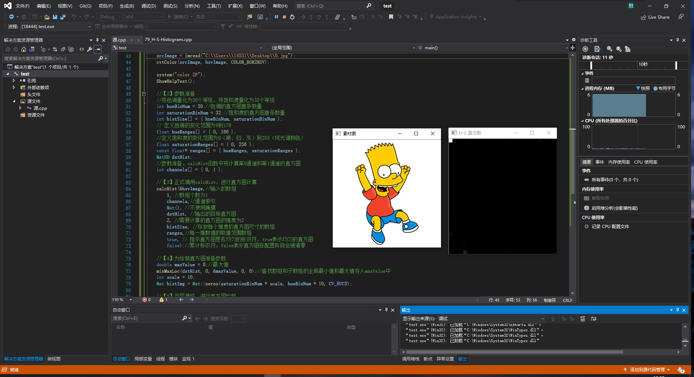
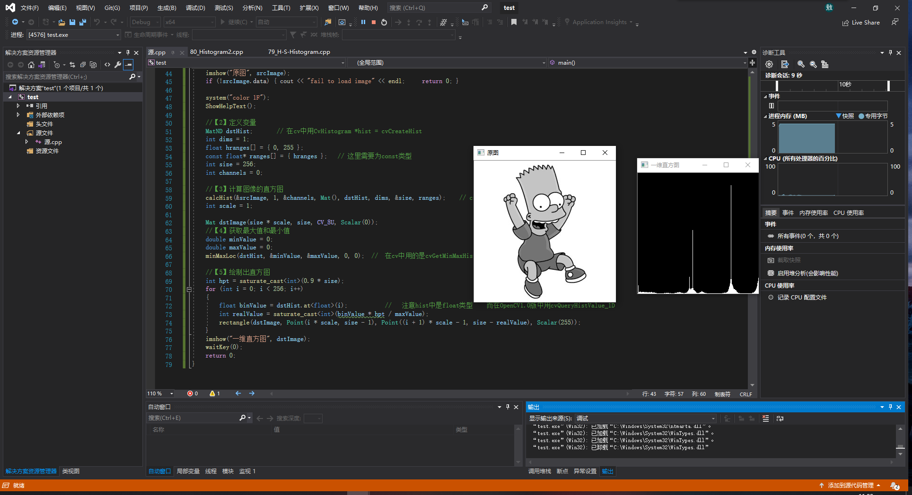
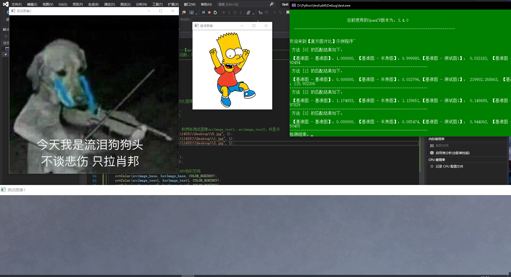
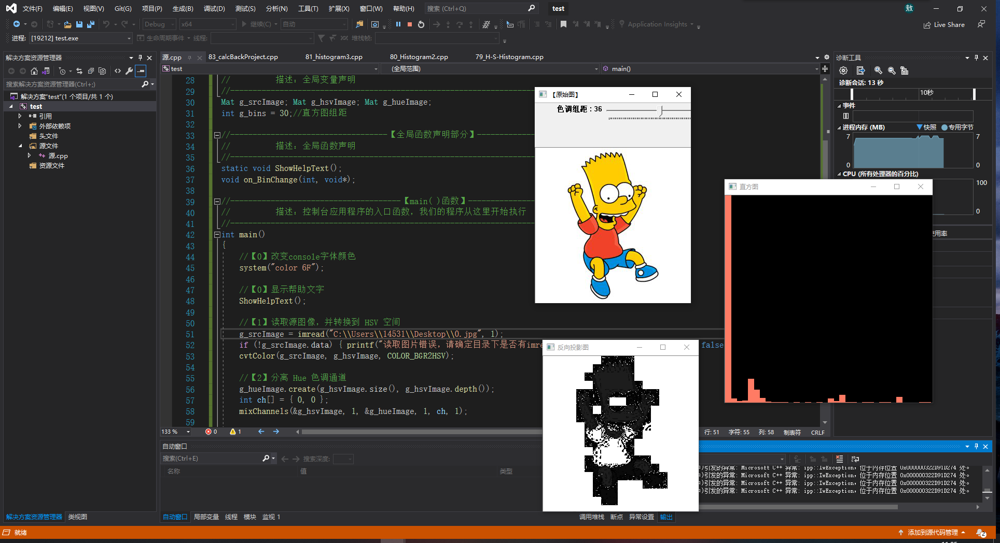
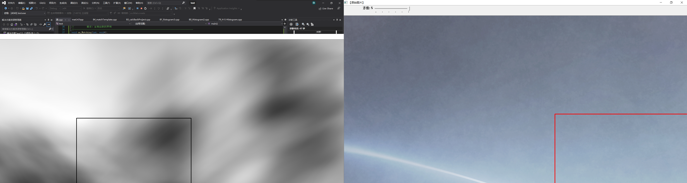

## 79

```
//--------------------------------------【程序说明】-------------------------------------------
//		程序说明：《OpenCV3编程入门》OpenCV3版书本配套示例程序79
//		程序描述：H-S二维直方图的绘制
//		开发测试所用操作系统： Windows 7 64bit
//		开发测试所用IDE版本：Visual Studio 2010
//		开发测试所用OpenCV版本：	3.0 beta
//		2014年11月 Created by @浅墨_毛星云
//		2014年12月 Revised by @浅墨_毛星云
//------------------------------------------------------------------------------------------------


//---------------------------------【头文件、命名空间包含部分】----------------------------
//		描述：包含程序所使用的头文件和命名空间
//------------------------------------------------------------------------------------------------
#include "opencv2/highgui/highgui.hpp"
#include "opencv2/imgproc/imgproc.hpp"
using namespace cv;


//-----------------------------------【ShowHelpText( )函数】-----------------------------
//		 描述：输出一些帮助信息
//----------------------------------------------------------------------------------------------
void ShowHelpText()
{
	//输出欢迎信息和OpenCV版本
	printf("\n\n\t\t\t非常感谢购买《OpenCV3编程入门》一书！\n");
	printf("\n\n\t\t\t此为本书OpenCV3版的第79个配套示例程序\n");
	printf("\n\n\t\t\t   当前使用的OpenCV版本为：" CV_VERSION );
	printf("\n\n  ----------------------------------------------------------------------------\n");
}


//--------------------------------------【main( )函数】-----------------------------------------
//          描述：控制台应用程序的入口函数，我们的程序从这里开始执行
//-----------------------------------------------------------------------------------------------
int main( )
{

	//【1】载入源图，转化为HSV颜色模型
	Mat srcImage, hsvImage;
	srcImage=imread("1.jpg");
	cvtColor(srcImage,hsvImage, COLOR_BGR2HSV);

	system("color 2F");
	ShowHelpText();

	//【2】参数准备
	//将色调量化为30个等级，将饱和度量化为32个等级
	int hueBinNum = 30;//色调的直方图直条数量
	int saturationBinNum = 32;//饱和度的直方图直条数量
	int histSize[ ] = {hueBinNum, saturationBinNum};
	// 定义色调的变化范围为0到179
	float hueRanges[] = { 0, 180 };
	//定义饱和度的变化范围为0（黑、白、灰）到255（纯光谱颜色）
	float saturationRanges[] = { 0, 256 };
	const float* ranges[] = { hueRanges, saturationRanges };
	MatND dstHist;
	//参数准备，calcHist函数中将计算第0通道和第1通道的直方图
	int channels[] = {0, 1};

	//【3】正式调用calcHist，进行直方图计算
	calcHist( &hsvImage,//输入的数组
		1, //数组个数为1
		channels,//通道索引
		Mat(), //不使用掩膜
		dstHist, //输出的目标直方图
		2, //需要计算的直方图的维度为2
		histSize, //存放每个维度的直方图尺寸的数组
		ranges,//每一维数值的取值范围数组
		true, // 指示直方图是否均匀的标识符，true表示均匀的直方图
		false );//累计标识符，false表示直方图在配置阶段会被清零

	//【4】为绘制直方图准备参数
	double maxValue=0;//最大值
	minMaxLoc(dstHist, 0, &maxValue, 0, 0);//查找数组和子数组的全局最小值和最大值存入maxValue中
	int scale = 10;
	Mat histImg = Mat::zeros(saturationBinNum*scale, hueBinNum*10, CV_8UC3);

	//【5】双层循环，进行直方图绘制
	for( int hue = 0; hue < hueBinNum; hue++ )
		for( int saturation = 0; saturation < saturationBinNum; saturation++ )
		{
			float binValue = dstHist.at<float>(hue, saturation);//直方图组距的值
			int intensity = cvRound(binValue*255/maxValue);//强度

			//正式进行绘制
			rectangle( histImg, Point(hue*scale, saturation*scale),
				Point( (hue+1)*scale - 1, (saturation+1)*scale - 1),
				Scalar::all(intensity),FILLED );
		}

		//【6】显示效果图
		imshow( "素材图", srcImage );
		imshow( "H-S 直方图", histImg );

		waitKey();
}
```

## 80

```
//--------------------------------------【程序说明】-------------------------------------------
//		程序说明：《OpenCV3编程入门》OpenCV3版书本配套示例程序80
//		程序描述：一维直方图的绘制
//		开发测试所用操作系统： Windows 7 64bit
//		开发测试所用IDE版本：Visual Studio 2010
//		开发测试所用OpenCV版本：	3.0 beta
//		2014年11月 Created by @浅墨_毛星云
//		2014年12月 Revised by @浅墨_毛星云
//------------------------------------------------------------------------------------------------


//---------------------------------【头文件、命名空间包含部分】----------------------------
//		描述：包含程序所使用的头文件和命名空间
//------------------------------------------------------------------------------------------------
#include "opencv2/highgui/highgui.hpp"
#include "opencv2/imgproc/imgproc.hpp"
#include <iostream>
using namespace cv;
using namespace std;


//-----------------------------------【ShowHelpText( )函数】-----------------------------
//		 描述：输出一些帮助信息
//----------------------------------------------------------------------------------------------
void ShowHelpText()
{
	//输出欢迎信息和OpenCV版本
	printf("\n\n\t\t\t非常感谢购买《OpenCV3编程入门》一书！\n");
	printf("\n\n\t\t\t此为本书OpenCV3版的第80个配套示例程序\n");
	printf("\n\n\t\t\t   当前使用的OpenCV版本为：" CV_VERSION );
	printf("\n\n  ----------------------------------------------------------------------------\n");
}


//--------------------------------------【main( )函数】-----------------------------------------
//          描述：控制台应用程序的入口函数，我们的程序从这里开始执行
//-------------------------------------------------------------------------------------------------
int main()
{
	//【1】载入原图并显示
	Mat srcImage = imread("1.jpg", 0);
	imshow("原图",srcImage);
	if(!srcImage.data) {cout << "fail to load image" << endl; 	return 0;}

	system("color 1F");
	ShowHelpText();

	//【2】定义变量
	MatND dstHist;       // 在cv中用CvHistogram *hist = cvCreateHist
	int dims = 1;
	float hranges[] = {0, 255};
	const float *ranges[] = {hranges};   // 这里需要为const类型
	int size = 256;
	int channels = 0;

	//【3】计算图像的直方图
	calcHist(&srcImage, 1, &channels, Mat(), dstHist, dims, &size, ranges);    // cv 中是cvCalcHist
	int scale = 1;

	Mat dstImage(size * scale, size, CV_8U, Scalar(0));
	//【4】获取最大值和最小值
	double minValue = 0;
	double maxValue = 0;
	minMaxLoc(dstHist,&minValue, &maxValue, 0, 0);  //  在cv中用的是cvGetMinMaxHistValue

	//【5】绘制出直方图
	int hpt = saturate_cast<int>(0.9 * size);
	for(int i = 0; i < 256; i++)
	{
		float binValue = dstHist.at<float>(i);           //   注意hist中是float类型    而在OpenCV1.0版中用cvQueryHistValue_1D
		int realValue = saturate_cast<int>(binValue * hpt/maxValue);
		rectangle(dstImage,Point(i*scale, size - 1), Point((i+1)*scale - 1, size - realValue), Scalar(255));
	}
	imshow("一维直方图", dstImage);
	waitKey(0);
	return 0;
}
```

## 81

```
//--------------------------------------【程序说明】-------------------------------------------
//		程序说明：《OpenCV3编程入门》OpenCV2版书本配套示例程序81
//		程序描述：绘制RGB三色分量的直方图
//		开发测试所用操作系统： Windows 7 64bit
//		开发测试所用IDE版本：Visual Studio 2010
//		开发测试所用OpenCV版本：	3.0 beta
//		2014年11月 Created by @浅墨_毛星云
//		2014年12月 Revised by @浅墨_毛星云
//------------------------------------------------------------------------------------------------


//---------------------------------【头文件、命名空间包含部分】----------------------------
//		描述：包含程序所使用的头文件和命名空间
//------------------------------------------------------------------------------------------------
#include <opencv2/opencv.hpp>  
#include <opencv2/imgproc/imgproc.hpp>  
using namespace cv;  


//-----------------------------------【ShowHelpText( )函数】-----------------------------
//		 描述：输出一些帮助信息
//----------------------------------------------------------------------------------------------
void ShowHelpText()
{
	//输出欢迎信息和OpenCV版本
	printf("\n\n\t\t\t非常感谢购买《OpenCV3编程入门》一书！\n");
	printf("\n\n\t\t\t此为本书OpenCV3版的第81个配套示例程序\n");
	printf("\n\n\t\t\t   当前使用的OpenCV版本为：" CV_VERSION );
	printf("\n\n  ----------------------------------------------------------------------------\n");
}


//--------------------------------------【main( )函数】-----------------------------------------
//          描述：控制台应用程序的入口函数，我们的程序从这里开始执行
//-----------------------------------------------------------------------------------------------
int main(  )
{

	//【1】载入素材图并显示
	Mat srcImage;
	srcImage=imread("1.jpg");
	imshow( "素材图", srcImage );

	system("color 3F");
	ShowHelpText();

	//【2】参数准备
	int bins = 256;
	int hist_size[] = {bins};
	float range[] = { 0, 256 };
	const float* ranges[] = { range};
	MatND redHist,grayHist,blueHist;
	int channels_r[] = {0};

	//【3】进行直方图的计算（红色分量部分）
	calcHist( &srcImage, 1, channels_r, Mat(), //不使用掩膜
		redHist, 1, hist_size, ranges,
		true, false );

	//【4】进行直方图的计算（绿色分量部分）
	int channels_g[] = {1};
	calcHist( &srcImage, 1, channels_g, Mat(), // do not use mask
		grayHist, 1, hist_size, ranges,
		true, // the histogram is uniform
		false );

	//【5】进行直方图的计算（蓝色分量部分）
	int channels_b[] = {2};
	calcHist( &srcImage, 1, channels_b, Mat(), // do not use mask
		blueHist, 1, hist_size, ranges,
		true, // the histogram is uniform
		false );

	//-----------------------绘制出三色直方图------------------------
	//参数准备
	double maxValue_red,maxValue_green,maxValue_blue;
	minMaxLoc(redHist, 0, &maxValue_red, 0, 0);
	minMaxLoc(grayHist, 0, &maxValue_green, 0, 0);
	minMaxLoc(blueHist, 0, &maxValue_blue, 0, 0);
	int scale = 1;
	int histHeight=256;
	Mat histImage = Mat::zeros(histHeight,bins*3, CV_8UC3);

	//正式开始绘制
	for(int i=0;i<bins;i++)
	{
		//参数准备
		float binValue_red = redHist.at<float>(i); 
		float binValue_green = grayHist.at<float>(i);
		float binValue_blue = blueHist.at<float>(i);
		int intensity_red = cvRound(binValue_red*histHeight/maxValue_red);  //要绘制的高度
		int intensity_green = cvRound(binValue_green*histHeight/maxValue_green);  //要绘制的高度
		int intensity_blue = cvRound(binValue_blue*histHeight/maxValue_blue);  //要绘制的高度

		//绘制红色分量的直方图
		rectangle(histImage,Point(i*scale,histHeight-1),
			Point((i+1)*scale - 1, histHeight - intensity_red),
			Scalar(255,0,0));

		//绘制绿色分量的直方图
		rectangle(histImage,Point((i+bins)*scale,histHeight-1),
			Point((i+bins+1)*scale - 1, histHeight - intensity_green),
			Scalar(0,255,0));

		//绘制蓝色分量的直方图
		rectangle(histImage,Point((i+bins*2)*scale,histHeight-1),
			Point((i+bins*2+1)*scale - 1, histHeight - intensity_blue),
			Scalar(0,0,255));

	}

	//在窗口中显示出绘制好的直方图
	imshow( "图像的RGB直方图", histImage );
	waitKey(0);
	return 0;
}
```

## 82

```
//--------------------------------------【程序说明】-------------------------------------------
//		程序说明：《OpenCV3编程入门》OpenCV2版书本配套示例程序82
//		程序描述：直方图对比
//		开发测试所用操作系统： Windows 7 64bit
//		开发测试所用IDE版本：Visual Studio 2010
//		开发测试所用OpenCV版本：	3.0 beta
//		2014年11月 Created by @浅墨_毛星云
//		2014年12月 Revised by @浅墨_毛星云
//------------------------------------------------------------------------------------------------


//---------------------------------【头文件、命名空间包含部分】----------------------------
//		描述：包含程序所使用的头文件和命名空间
//------------------------------------------------------------------------------------------------
#include "opencv2/highgui/highgui.hpp"
#include "opencv2/imgproc/imgproc.hpp"
using namespace cv;


//-----------------------------------【ShowHelpText( )函数】-----------------------------
//          描述：输出一些帮助信息
//----------------------------------------------------------------------------------------------
static void ShowHelpText()
{
	//输出欢迎信息和OpenCV版本
	printf("\n\n\t\t\t非常感谢购买《OpenCV3编程入门》一书！\n");
	printf("\n\n\t\t\t此为本书OpenCV3版的第82个配套示例程序\n");
	printf("\n\n\t\t\t   当前使用的OpenCV版本为：" CV_VERSION );
	printf("\n\n  ----------------------------------------------------------------------------\n");
	//输出一些帮助信息
	printf("\n\n欢迎来到【直方图对比】示例程序~\n\n"); 

}


//--------------------------------------【main( )函数】-----------------------------------------
//          描述：控制台应用程序的入口函数，我们的程序从这里开始执行
//-----------------------------------------------------------------------------------------------
int main( )
{
	//【0】改变console字体颜色
	system("color 2F"); 

	//【1】显示帮助文字
	ShowHelpText();

	//【1】声明储存基准图像和另外两张对比图像的矩阵( RGB 和 HSV )
	Mat srcImage_base, hsvImage_base;
	Mat srcImage_test1, hsvImage_test1;
	Mat srcImage_test2, hsvImage_test2;
	Mat hsvImage_halfDown;

	//【2】载入基准图像(srcImage_base) 和两张测试图像srcImage_test1、srcImage_test2，并显示
	srcImage_base = imread( "1.jpg",1 );
	srcImage_test1 = imread( "2.jpg", 1 );
	srcImage_test2 = imread( "3.jpg", 1 );
	//显示载入的3张图像
	imshow("基准图像",srcImage_base);
	imshow("测试图像1",srcImage_test1);
	imshow("测试图像2",srcImage_test2);

	// 【3】将图像由BGR色彩空间转换到 HSV色彩空间
	cvtColor( srcImage_base, hsvImage_base,  COLOR_BGR2HSV );
	cvtColor( srcImage_test1, hsvImage_test1, COLOR_BGR2HSV );
	cvtColor( srcImage_test2, hsvImage_test2, COLOR_BGR2HSV );

	//【4】创建包含基准图像下半部的半身图像(HSV格式)
	hsvImage_halfDown = hsvImage_base( Range( hsvImage_base.rows/2, hsvImage_base.rows - 1 ), Range( 0, hsvImage_base.cols - 1 ) );

	//【5】初始化计算直方图需要的实参
	// 对hue通道使用30个bin,对saturatoin通道使用32个bin
	int h_bins = 50; int s_bins = 60;
	int histSize[] = { h_bins, s_bins };
	// hue的取值范围从0到256, saturation取值范围从0到180
	float h_ranges[] = { 0, 256 };
	float s_ranges[] = { 0, 180 };
	const float* ranges[] = { h_ranges, s_ranges };
	// 使用第0和第1通道
	int channels[] = { 0, 1 };

	// 【6】创建储存直方图的 MatND 类的实例:
	MatND baseHist;
	MatND halfDownHist;
	MatND testHist1;
	MatND testHist2;

	// 【7】计算基准图像，两张测试图像，半身基准图像的HSV直方图:
	calcHist( &hsvImage_base, 1, channels, Mat(), baseHist, 2, histSize, ranges, true, false );
	normalize( baseHist, baseHist, 0, 1, NORM_MINMAX, -1, Mat() );

	calcHist( &hsvImage_halfDown, 1, channels, Mat(), halfDownHist, 2, histSize, ranges, true, false );
	normalize( halfDownHist, halfDownHist, 0, 1, NORM_MINMAX, -1, Mat() );

	calcHist( &hsvImage_test1, 1, channels, Mat(), testHist1, 2, histSize, ranges, true, false );
	normalize( testHist1, testHist1, 0, 1, NORM_MINMAX, -1, Mat() );

	calcHist( &hsvImage_test2, 1, channels, Mat(), testHist2, 2, histSize, ranges, true, false );
	normalize( testHist2, testHist2, 0, 1, NORM_MINMAX, -1, Mat() );


	//【8】按顺序使用4种对比标准将基准图像的直方图与其余各直方图进行对比:
	for( int i = 0; i < 4; i++ )
	{ 
		//进行图像直方图的对比
		int compare_method = i;
		double base_base = compareHist( baseHist, baseHist, compare_method );
		double base_half = compareHist( baseHist, halfDownHist, compare_method );
		double base_test1 = compareHist( baseHist, testHist1, compare_method );
		double base_test2 = compareHist( baseHist, testHist2, compare_method );
		//输出结果
		printf( " 方法 [%d] 的匹配结果如下：\n\n 【基准图 - 基准图】：%f, 【基准图 - 半身图】：%f,【基准图 - 测试图1】： %f, 【基准图 - 测试图2】：%f \n-----------------------------------------------------------------\n", i, base_base, base_half , base_test1, base_test2 );
	}

	printf( "检测结束。" );
	waitKey(0);
	return 0;
}
```

## 83

```
//--------------------------------------【程序说明】-------------------------------------------
//		程序说明：《OpenCV3编程入门》OpenCV2版书本配套示例程序83
//		程序描述：反向投影示例程序
//		开发测试所用操作系统： Windows 7 64bit
//		开发测试所用IDE版本：Visual Studio 2010
//		开发测试所用OpenCV版本：	3.0 beta
//		2014年11月 Created by @浅墨_毛星云
//		2014年12月 Revised by @浅墨_毛星云
//------------------------------------------------------------------------------------------------


//---------------------------------【头文件、命名空间包含部分】----------------------------
//		描述：包含程序所使用的头文件和命名空间
//------------------------------------------------------------------------------------------------
#include "opencv2/imgproc/imgproc.hpp"
#include "opencv2/highgui/highgui.hpp"
using namespace cv;


//-----------------------------------【宏定义部分】-------------------------------------------- 
//  描述：定义一些辅助宏 
//------------------------------------------------------------------------------------------------ 
#define WINDOW_NAME1 "【原始图】"        //为窗口标题定义的宏 


//-----------------------------------【全局变量声明部分】--------------------------------------
//          描述：全局变量声明
//-----------------------------------------------------------------------------------------------
Mat g_srcImage; Mat g_hsvImage; Mat g_hueImage;
int g_bins = 30;//直方图组距

//-----------------------------------【全局函数声明部分】--------------------------------------
//          描述：全局函数声明
//-----------------------------------------------------------------------------------------------
static void ShowHelpText();
void on_BinChange(int, void* );

//--------------------------------------【main( )函数】-----------------------------------------
//          描述：控制台应用程序的入口函数，我们的程序从这里开始执行
//-----------------------------------------------------------------------------------------------
int main( )
{
	//【0】改变console字体颜色
	system("color 6F"); 

	//【0】显示帮助文字
	ShowHelpText();

	//【1】读取源图像，并转换到 HSV 空间
	g_srcImage = imread( "1.jpg", 1 );
	if(!g_srcImage.data ) { printf("读取图片错误，请确定目录下是否有imread函数指定图片存在~！ \n"); return false; } 
	cvtColor( g_srcImage, g_hsvImage, COLOR_BGR2HSV );

	//【2】分离 Hue 色调通道
	g_hueImage.create( g_hsvImage.size(), g_hsvImage.depth() );
	int ch[ ] = { 0, 0 };
	mixChannels( &g_hsvImage, 1, &g_hueImage, 1, ch, 1 );

	//【3】创建 Trackbar 来输入bin的数目
	namedWindow( WINDOW_NAME1 , WINDOW_AUTOSIZE );
	createTrackbar("色调组距 ", WINDOW_NAME1 , &g_bins, 180, on_BinChange );
	on_BinChange(0, 0);//进行一次初始化

	//【4】显示效果图
	imshow( WINDOW_NAME1 , g_srcImage );

	// 等待用户按键
	waitKey(0);
	return 0;
}


//-----------------------------------【on_HoughLines( )函数】--------------------------------
//          描述：响应滑动条移动消息的回调函数
//---------------------------------------------------------------------------------------------
void on_BinChange(int, void* )
{
	//【1】参数准备
	MatND hist;
	int histSize = MAX( g_bins, 2 );
	float hue_range[] = { 0, 180 };
	const float* ranges = { hue_range };

	//【2】计算直方图并归一化
	calcHist( &g_hueImage, 1, 0, Mat(), hist, 1, &histSize, &ranges, true, false );
	normalize( hist, hist, 0, 255, NORM_MINMAX, -1, Mat() );

	//【3】计算反向投影
	MatND backproj;
	calcBackProject( &g_hueImage, 1, 0, hist, backproj, &ranges, 1, true );

	//【4】显示反向投影
	imshow( "反向投影图", backproj );

	//【5】绘制直方图的参数准备
	int w = 400; int h = 400;
	int bin_w = cvRound( (double) w / histSize );
	Mat histImg = Mat::zeros( w, h, CV_8UC3 );

	//【6】绘制直方图
	for( int i = 0; i < g_bins; i ++ )
	{ rectangle( histImg, Point( i*bin_w, h ), Point( (i+1)*bin_w, h - cvRound( hist.at<float>(i)*h/255.0 ) ), Scalar( 100, 123, 255 ), -1 ); }

	//【7】显示直方图窗口
	imshow( "直方图", histImg );
}


//-----------------------------------【ShowHelpText( )函数】----------------------------------
//          描述：输出一些帮助信息
//----------------------------------------------------------------------------------------------
static void ShowHelpText()
{
	//输出欢迎信息和OpenCV版本
	printf("\n\n\t\t\t非常感谢购买《OpenCV3编程入门》一书！\n");
	printf("\n\n\t\t\t此为本书OpenCV3版的第83个配套示例程序\n");
	printf("\n\n\t\t\t   当前使用的OpenCV版本为：" CV_VERSION );
	printf("\n\n  ----------------------------------------------------------------------------\n");

	//输出一些帮助信息
	printf("\n\n\t欢迎来到【反向投影】示例程序\n\n"); 
	printf("\n\t请调整滑动条观察图像效果\n\n");

}
```

## 84

```
//--------------------------------------【程序说明】-------------------------------------------
//		程序说明：《OpenCV3编程入门》OpenCV3版书本配套示例程序84
//		程序描述：模板匹配示例
//		开发测试所用操作系统： Windows 7 64bit
//		开发测试所用IDE版本：Visual Studio 2010
//		开发测试所用OpenCV版本：	3.0 beta
//		2014年11月 Created by @浅墨_毛星云
//		2014年12月 Revised by @浅墨_毛星云
//------------------------------------------------------------------------------------------------


//---------------------------------【头文件、命名空间包含部分】----------------------------
//		描述：包含程序所使用的头文件和命名空间
//------------------------------------------------------------------------------------------------
#include "opencv2/highgui/highgui.hpp"
#include "opencv2/imgproc/imgproc.hpp"
using namespace cv;


//-----------------------------------【宏定义部分】-------------------------------------------- 
//  描述：定义一些辅助宏 
//------------------------------------------------------------------------------------------------ 
#define WINDOW_NAME1 "【原始图片】"        //为窗口标题定义的宏 
#define WINDOW_NAME2 "【匹配窗口】"        //为窗口标题定义的宏 

//-----------------------------------【全局变量声明部分】------------------------------------
//          描述：全局变量的声明
//-----------------------------------------------------------------------------------------------
Mat g_srcImage; Mat g_templateImage; Mat g_resultImage;
int g_nMatchMethod;
int g_nMaxTrackbarNum = 5;

//-----------------------------------【全局函数声明部分】--------------------------------------
//          描述：全局函数的声明
//-----------------------------------------------------------------------------------------------
void on_Matching( int, void* );
static void ShowHelpText( );


//-----------------------------------【main( )函数】--------------------------------------------
//          描述：控制台应用程序的入口函数，我们的程序从这里开始执行
//-----------------------------------------------------------------------------------------------
int main(  )
{
	//【0】改变console字体颜色
	system("color 1F"); 

	//【0】显示帮助文字
	ShowHelpText();

	//【1】载入原图像和模板块
	g_srcImage = imread( "1.jpg", 1 );
	g_templateImage = imread( "2.jpg", 1 );

	//【2】创建窗口
	namedWindow( WINDOW_NAME1, WINDOW_AUTOSIZE );
	namedWindow( WINDOW_NAME2, WINDOW_AUTOSIZE );

	//【3】创建滑动条并进行一次初始化
	createTrackbar( "方法", WINDOW_NAME1, &g_nMatchMethod, g_nMaxTrackbarNum, on_Matching );
	on_Matching( 0, 0 );

	waitKey(0);
	return 0;

}

//-----------------------------------【on_Matching( )函数】--------------------------------
//          描述：回调函数
//-------------------------------------------------------------------------------------------
void on_Matching( int, void* )
{
	//【1】给局部变量初始化
	Mat srcImage;
	g_srcImage.copyTo( srcImage );

	//【2】初始化用于结果输出的矩阵
	int resultImage_rows = g_srcImage.rows - g_templateImage.rows + 1;
	int resultImage_cols =  g_srcImage.cols - g_templateImage.cols + 1;
	g_resultImage.create(resultImage_rows,resultImage_cols, CV_32FC1);

	//【3】进行匹配和标准化
	matchTemplate( g_srcImage, g_templateImage, g_resultImage, g_nMatchMethod );
	normalize( g_resultImage, g_resultImage, 0, 1, NORM_MINMAX, -1, Mat() );

	//【4】通过函数 minMaxLoc 定位最匹配的位置
	double minValue; double maxValue; Point minLocation; Point maxLocation;
	Point matchLocation;
	minMaxLoc( g_resultImage, &minValue, &maxValue, &minLocation, &maxLocation, Mat() );

	//【5】对于方法 SQDIFF 和 SQDIFF_NORMED, 越小的数值有着更高的匹配结果. 而其余的方法, 数值越大匹配效果越好
	//此句代码的OpenCV2版为：
	//if( g_nMatchMethod  == CV_TM_SQDIFF || g_nMatchMethod == CV_TM_SQDIFF_NORMED )
	//此句代码的OpenCV3版为：
	if( g_nMatchMethod  == TM_SQDIFF || g_nMatchMethod == TM_SQDIFF_NORMED )
	{ matchLocation = minLocation; }
	else
	{ matchLocation = maxLocation; }

	//【6】绘制出矩形，并显示最终结果
	rectangle( srcImage, matchLocation, Point( matchLocation.x + g_templateImage.cols , matchLocation.y + g_templateImage.rows ), Scalar(0,0,255), 2, 8, 0 );
	rectangle( g_resultImage, matchLocation, Point( matchLocation.x + g_templateImage.cols , matchLocation.y + g_templateImage.rows ), Scalar(0,0,255), 2, 8, 0 );

	imshow( WINDOW_NAME1, srcImage );
	imshow( WINDOW_NAME2, g_resultImage );

}


//-----------------------------------【ShowHelpText( )函数】----------------------------------
//          描述：输出一些帮助信息
//----------------------------------------------------------------------------------------------
static void ShowHelpText()
{
	//输出欢迎信息和OpenCV版本
	printf("\n\n\t\t\t非常感谢购买《OpenCV3编程入门》一书！\n");
	printf("\n\n\t\t\t此为本书OpenCV3版的第84个配套示例程序\n");
	printf("\n\n\t\t\t   当前使用的OpenCV版本为：" CV_VERSION );
	printf("\n\n  ----------------------------------------------------------------------------\n");
	//输出一些帮助信息
	printf("\t欢迎来到【模板匹配】示例程序~\n"); 
	printf("\n\n\t请调整滑动条观察图像效果\n\n");
	printf(  "\n\t滑动条对应的方法数值说明: \n\n" 
		"\t\t方法【0】- 平方差匹配法(SQDIFF)\n" 
		"\t\t方法【1】- 归一化平方差匹配法(SQDIFF NORMED)\n" 
		"\t\t方法【2】- 相关匹配法(TM CCORR)\n" 
		"\t\t方法【3】- 归一化相关匹配法(TM CCORR NORMED)\n" 
		"\t\t方法【4】- 相关系数匹配法(TM COEFF)\n" 
		"\t\t方法【5】- 归一化相关系数匹配法(TM COEFF NORMED)\n" );  
}
```

