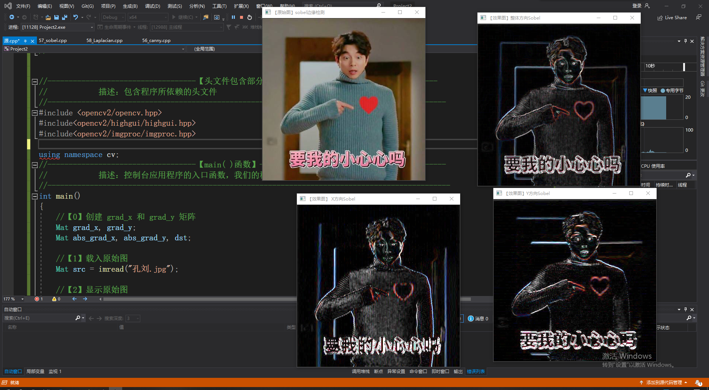
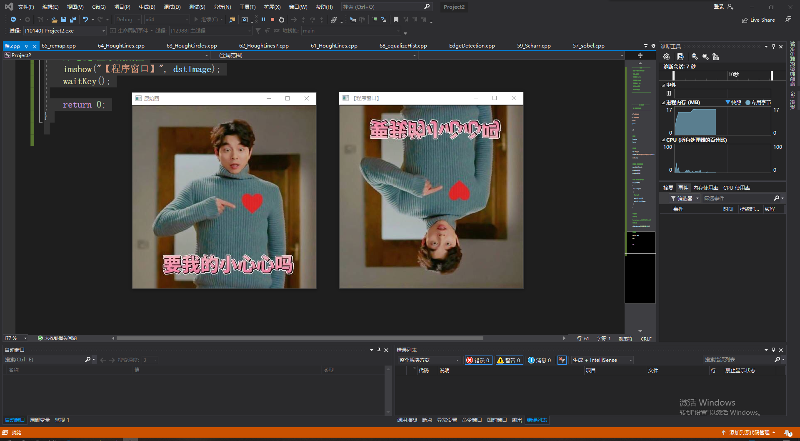
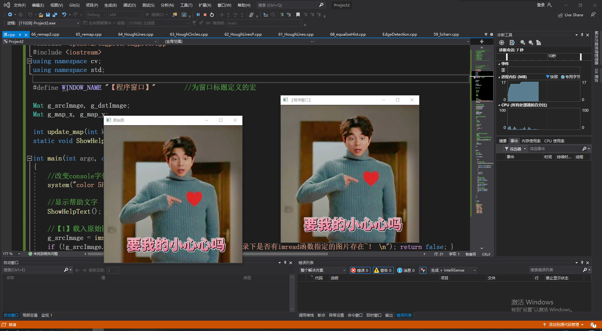

<font face = 微软雅黑 >

## 1.carry函数用法

```cpp
#include <opencv2/opencv.hpp>
#include<opencv2/highgui/highgui.hpp>
#include<opencv2/imgproc/imgproc.hpp>
using namespace cv;

int main()
{
	//载入原始图  
	Mat srcImage = imread("孔刘.jpg"); 
	Mat srcImage1 = srcImage.clone();

	//显示原始图 
	imshow("【原始图】Canny边缘检测", srcImage);

	//----------------------------------------------------------------------------------
	//	一、最简单的canny用法，拿到原图后直接用。
	//	注意：此方法在OpenCV2中可用，在OpenCV3中已失效
	//----------------------------------------------------------------------------------
	//Canny( srcImage, srcImage, 150, 100,3 );
	//imshow("【效果图】Canny边缘检测", srcImage); 


	//----------------------------------------------------------------------------------
	//	二、高阶的canny用法，转成灰度图，降噪，用canny，最后将得到的边缘作为掩码，拷贝原图到效果图上，得到彩色的边缘图
	//----------------------------------------------------------------------------------
	Mat dstImage, edge, grayImage;

	// 【1】创建与src同类型和大小的矩阵(dst)
	dstImage.create(srcImage1.size(), srcImage1.type());

	// 【2】将原图像转换为灰度图像
	cvtColor(srcImage1, grayImage, COLOR_BGR2GRAY);

	// 【3】先用使用 3x3内核来降噪
	blur(grayImage, edge, Size(3, 3));

	// 【4】运行Canny算子
	Canny(edge, edge, 3, 9, 3);

	//【5】将g_dstImage内的所有元素设置为0 
	dstImage = Scalar::all(0);

	//【6】使用Canny算子输出的边缘图g_cannyDetectedEdges作为掩码，来将原图g_srcImage拷到目标图g_dstImage中
	srcImage1.copyTo(dstImage, edge);

	//【7】显示效果图 
	imshow("【效果图】Canny边缘检测2", dstImage);


	waitKey(0);

	return 0;
}

```

代码测试：


## 2.sobel函数用法

```cpp
#include <opencv2/opencv.hpp>
#include<opencv2/highgui/highgui.hpp>
#include<opencv2/imgproc/imgproc.hpp>

using namespace cv;

int main()
{
	//【0】创建 grad_x 和 grad_y 矩阵
	Mat grad_x, grad_y;
	Mat abs_grad_x, abs_grad_y, dst;

	//【1】载入原始图  
	Mat src = imread("孔刘.jpg"); 

	//【2】显示原始图 
	imshow("【原始图】sobel边缘检测", src);

	//【3】求 X方向梯度
	Sobel(src, grad_x, CV_16S, 1, 0, 3, 1, 1, BORDER_DEFAULT);
	convertScaleAbs(grad_x, abs_grad_x);
	imshow("【效果图】 X方向Sobel", abs_grad_x);

	//【4】求Y方向梯度
	Sobel(src, grad_y, CV_16S, 0, 1, 3, 1, 1, BORDER_DEFAULT);
	convertScaleAbs(grad_y, abs_grad_y);
	imshow("【效果图】Y方向Sobel", abs_grad_y);

	//【5】合并梯度(近似)
	addWeighted(abs_grad_x, 0.5, abs_grad_y, 0.5, 0, dst);
	imshow("【效果图】整体方向Sobel", dst);

	waitKey(0);
	return 0;
}

```

代码测试：



## 3.Laplacian函数用法

```cpp
#include <opencv2/opencv.hpp>
#include<opencv2/highgui/highgui.hpp>
#include<opencv2/imgproc/imgproc.hpp>
using namespace cv;

int main()
{
	//【0】变量的定义
	Mat src, src_gray, dst, abs_dst;

	//【1】载入原始图  
	src = imread("孔刘.jpg");  

	//【2】显示原始图 
	imshow("【原始图】图像Laplace变换", src);

	//【3】使用高斯滤波消除噪声
	GaussianBlur(src, src, Size(3, 3), 0, 0, BORDER_DEFAULT);

	//【4】转换为灰度图
	cvtColor(src, src_gray, COLOR_RGB2GRAY);

	//【5】使用Laplace函数
	Laplacian(src_gray, dst, CV_16S, 3, 1, 0, BORDER_DEFAULT);

	//【6】计算绝对值，并将结果转换成8位
	convertScaleAbs(dst, abs_dst);

	//【7】显示效果图
	imshow("【效果图】图像Laplace变换", abs_dst);

	waitKey(0);

	return 0;
}

```

代码测试：


## 4.Scharr函数用法

```cpp

#include <opencv2/opencv.hpp>
#include<opencv2/highgui/highgui.hpp>
#include<opencv2/imgproc/imgproc.hpp>
using namespace cv;

int main()
{
	//【0】创建 grad_x 和 grad_y 矩阵
	Mat grad_x, grad_y;
	Mat abs_grad_x, abs_grad_y, dst;

	//【1】载入原始图  
	Mat src = imread("孔刘.jpg");  

	//【2】显示原始图 
	imshow("【原始图】Scharr滤波器", src);

	//【3】求 X方向梯度
	Scharr(src, grad_x, CV_16S, 1, 0, 1, 0, BORDER_DEFAULT);
	convertScaleAbs(grad_x, abs_grad_x);
	imshow("【效果图】 X方向Scharr", abs_grad_x);

	//【4】求Y方向梯度
	Scharr(src, grad_y, CV_16S, 0, 1, 1, 0, BORDER_DEFAULT);
	convertScaleAbs(grad_y, abs_grad_y);
	imshow("【效果图】Y方向Scharr", abs_grad_y);

	//【5】合并梯度(近似)
	addWeighted(abs_grad_x, 0.5, abs_grad_y, 0.5, 0, dst);

	//【6】显示效果图
	imshow("【效果图】合并梯度后Scharr", dst);

	waitKey(0);
	return 0;
}

```

代码测试：


## 5.边缘检测综合案例

```cpp
#include <opencv2/highgui/highgui.hpp>
#include <opencv2/imgproc/imgproc.hpp>
using namespace cv;

//原图，原图的灰度版，目标图
Mat g_srcImage, g_srcGrayImage, g_dstImage;

//Canny边缘检测相关变量
Mat g_cannyDetectedEdges;
int g_cannyLowThreshold = 1;//TrackBar位置参数  

//Sobel边缘检测相关变量
Mat g_sobelGradient_X, g_sobelGradient_Y;
Mat g_sobelAbsGradient_X, g_sobelAbsGradient_Y;
int g_sobelKernelSize = 1;//TrackBar位置参数  

//Scharr滤波器相关变量
Mat g_scharrGradient_X, g_scharrGradient_Y;
Mat g_scharrAbsGradient_X, g_scharrAbsGradient_Y;

static void ShowHelpText();
static void on_Canny(int, void*);//Canny边缘检测窗口滚动条的回调函数
static void on_Sobel(int, void*);//Sobel边缘检测窗口滚动条的回调函数
void Scharr();//封装了Scharr边缘检测相关代码的函数

int main(int argc, char** argv)
{
	//改变console字体颜色
	system("color 2F");

	//显示欢迎语
	ShowHelpText();

	//载入原图
	g_srcImage = imread("孔刘.jpg");
	if (!g_srcImage.data) { printf("Oh，no，读取srcImage错误~！ \n"); return false; }

	//显示原始图
	namedWindow("【原始图】");
	imshow("【原始图】", g_srcImage);

	// 创建与src同类型和大小的矩阵(dst)
	g_dstImage.create(g_srcImage.size(), g_srcImage.type());

	// 将原图像转换为灰度图像
	cvtColor(g_srcImage, g_srcGrayImage, COLOR_BGR2GRAY);

	// 创建显示窗口
	namedWindow("【效果图】Canny边缘检测", WINDOW_AUTOSIZE);
	namedWindow("【效果图】Sobel边缘检测", WINDOW_AUTOSIZE);

	// 创建trackbar
	createTrackbar("参数值：", "【效果图】Canny边缘检测", &g_cannyLowThreshold, 120, on_Canny);
	createTrackbar("参数值：", "【效果图】Sobel边缘检测", &g_sobelKernelSize, 3, on_Sobel);

	// 调用回调函数
	on_Canny(0, 0);
	on_Sobel(0, 0);

	//调用封装了Scharr边缘检测代码的函数
	Scharr();

	//轮询获取按键信息，若按下Q，程序退出
	while ((char(waitKey(1)) != 'q')) {}

	return 0;
}

static void ShowHelpText()
{
	
	//输出一些帮助信息
	printf("\n\n\t运行成功，请调整滚动条观察图像效果~\n\n"
		"\t按下“q”键时，程序退出。\n");
}

void on_Canny(int, void*)
{
	// 先使用 3x3内核来降噪
	blur(g_srcGrayImage, g_cannyDetectedEdges, Size(3, 3));

	// 运行我们的Canny算子
	Canny(g_cannyDetectedEdges, g_cannyDetectedEdges, g_cannyLowThreshold, g_cannyLowThreshold * 3, 3);

	//先将g_dstImage内的所有元素设置为0 
	g_dstImage = Scalar::all(0);

	//使用Canny算子输出的边缘图g_cannyDetectedEdges作为掩码，来将原图g_srcImage拷到目标图g_dstImage中
	g_srcImage.copyTo(g_dstImage, g_cannyDetectedEdges);

	//显示效果图
	imshow("【效果图】Canny边缘检测", g_dstImage);
}

void on_Sobel(int, void*)
{
	// 求 X方向梯度
	Sobel(g_srcImage, g_sobelGradient_X, CV_16S, 1, 0, (2 * g_sobelKernelSize + 1), 1, 1, BORDER_DEFAULT);
	convertScaleAbs(g_sobelGradient_X, g_sobelAbsGradient_X);//计算绝对值，并将结果转换成8位

	// 求Y方向梯度
	Sobel(g_srcImage, g_sobelGradient_Y, CV_16S, 0, 1, (2 * g_sobelKernelSize + 1), 1, 1, BORDER_DEFAULT);
	convertScaleAbs(g_sobelGradient_Y, g_sobelAbsGradient_Y);//计算绝对值，并将结果转换成8位

	// 合并梯度
	addWeighted(g_sobelAbsGradient_X, 0.5, g_sobelAbsGradient_Y, 0.5, 0, g_dstImage);

	//显示效果图
	imshow("【效果图】Sobel边缘检测", g_dstImage);

}

void Scharr()
{
	// 求 X方向梯度
	Scharr(g_srcImage, g_scharrGradient_X, CV_16S, 1, 0, 1, 0, BORDER_DEFAULT);
	convertScaleAbs(g_scharrGradient_X, g_scharrAbsGradient_X);//计算绝对值，并将结果转换成8位

	// 求Y方向梯度
	Scharr(g_srcImage, g_scharrGradient_Y, CV_16S, 0, 1, 1, 0, BORDER_DEFAULT);
	convertScaleAbs(g_scharrGradient_Y, g_scharrAbsGradient_Y);//计算绝对值，并将结果转换成8位

	// 合并梯度
	addWeighted(g_scharrAbsGradient_X, 0.5, g_scharrAbsGradient_Y, 0.5, 0, g_dstImage);

	//显示效果图
	imshow("【效果图】Scharr滤波器", g_dstImage);
}

```

代码测试：


## 6.HoughLines函数用法

```cpp
#include <opencv2/opencv.hpp>
#include <opencv2/imgproc/imgproc.hpp>
using namespace cv;
using namespace std;

int main()
{
	//【1】载入原始图和Mat变量定义   
	Mat srcImage = imread("孔刘.jpg");  
	Mat midImage, dstImage;//临时变量和目标图的定义

	//【2】进行边缘检测和转化为灰度图
	Canny(srcImage, midImage, 50, 200, 3);//进行一此canny边缘检测
	cvtColor(midImage, dstImage, COLOR_GRAY2BGR);//转化边缘检测后的图为灰度图

	//【3】进行霍夫线变换
	vector<Vec2f> lines;//定义一个矢量结构lines用于存放得到的线段矢量集合
	HoughLines(midImage, lines, 1, CV_PI / 180, 150, 0, 0);

	//【4】依次在图中绘制出每条线段
	for (size_t i = 0; i < lines.size(); i++)
	{
		float rho = lines[i][0], theta = lines[i][1];
		Point pt1, pt2;
		double a = cos(theta), b = sin(theta);
		double x0 = a * rho, y0 = b * rho;
		pt1.x = cvRound(x0 + 1000 * (-b));
		pt1.y = cvRound(y0 + 1000 * (a));
		pt2.x = cvRound(x0 - 1000 * (-b));
		pt2.y = cvRound(y0 - 1000 * (a));
		//此句代码的OpenCV2版为:
		/ne( dstImage, pt1, pt2, Scalar(55,100,195), 1, CV_AA);
		//此句代码的OpenCV3版为:
		line(dstImage, pt1, pt2, Scalar(55, 100, 195), 1, LINE_AA);
	}

	//【5】显示原始图  
	imshow("【原始图】", srcImage);

	//【6】边缘检测后的图 
	imshow("【边缘检测后的图】", midImage);

	//【7】显示效果图  
	imshow("【效果图】", dstImage);

	waitKey(0);

	return 0;
}

```

代码测试：


## 7.HoughLinesP函数用法

```cpp
#include <opencv2/opencv.hpp>
#include <opencv2/imgproc/imgproc.hpp>
using namespace cv;
using namespace std;

int main()
{
	//【1】载入原始图和Mat变量定义   
	Mat srcImage = imread("孔刘.jpg"); 
	Mat midImage, dstImage;//临时变量和目标图的定义

	//【2】进行边缘检测和转化为灰度图
	Canny(srcImage, midImage, 50, 200, 3);//进行一此canny边缘检测
	cvtColor(midImage, dstImage, COLOR_GRAY2BGR);//转化边缘检测后的图为灰度图

	//【3】进行霍夫线变换
	vector<Vec4i> lines;//定义一个矢量结构lines用于存放得到的线段矢量集合
	HoughLinesP(midImage, lines, 1, CV_PI / 180, 80, 50, 10);

	//【4】依次在图中绘制出每条线段
	for (size_t i = 0; i < lines.size(); i++)
	{
		Vec4i l = lines[i];
		//此句代码的OpenCV2版为：
		/ne( dstImage, Point(l[0], l[1]), Point(l[2], l[3]), Scalar(186,88,255), 1, CV_AA);
		//此句代码的OpenCV3版为：
		line(dstImage, Point(l[0], l[1]), Point(l[2], l[3]), Scalar(186, 88, 255), 1, LINE_AA);
	}

	//【5】显示原始图  
	imshow("【原始图】", srcImage);

	//【6】边缘检测后的图 
	imshow("【边缘检测后的图】", midImage);

	//【7】显示效果图  
	imshow("【效果图】", dstImage);

	waitKey(0);

	return 0;
}

```

代码测试：


## 8.HoughCircles函数用法

```cpp
#include <opencv2/opencv.hpp>
#include <opencv2/imgproc/imgproc.hpp>
using namespace cv;
using namespace std;

int main()
{
	//【1】载入原始图、Mat变量定义   
	Mat srcImage = imread("孔刘.jpg");  
	Mat midImage, dstImage;//临时变量和目标图的定义

	//【2】显示原始图
	imshow("【原始图】", srcImage);

	//【3】转为灰度图并进行图像平滑
	cvtColor(srcImage, midImage, COLOR_BGR2GRAY);//转化边缘检测后的图为灰度图
	GaussianBlur(midImage, midImage, Size(9, 9), 2, 2);

	//【4】进行霍夫圆变换
	vector<Vec3f> circles;
	HoughCircles(midImage, circles, HOUGH_GRADIENT, 1.5, 10, 200, 100, 0, 0);

	//【5】依次在图中绘制出圆
	for (size_t i = 0; i < circles.size(); i++)
	{
		//参数定义
		Point center(cvRound(circles[i][0]), cvRound(circles[i][1]));
		int radius = cvRound(circles[i][2]);
		//绘制圆心
		circle(srcImage, center, 3, Scalar(0, 255, 0), -1, 8, 0);
		//绘制圆轮廓
		circle(srcImage, center, radius, Scalar(155, 50, 255), 3, 8, 0);
	}

	//【6】显示效果图  
	imshow("【效果图】", srcImage);

	waitKey(0);

	return 0;
}

```

代码测试：


## 9.霍夫线变换综合示例

```cpp
#include <opencv2/opencv.hpp>
#include <opencv2/highgui/highgui.hpp>
#include <opencv2/imgproc/imgproc.hpp>
using namespace std;
using namespace cv;

Mat g_srcImage, g_dstImage,g_midImage;//原始图、中间图和效果图
vector<Vec4i> g_lines;//定义一个矢量结构g_lines用于存放得到的线段矢量集合
//变量接收的TrackBar位置参数
int g_nthreshold=100;

static void on_HoughLines(int, void*);//回调函数
static void ShowHelpText();

int main( )
{
	//改变console字体颜色
	system("color 4F");  

	ShowHelpText();

	//载入原始图和Mat变量定义   
	Mat g_srcImage = imread("孔刘.jpg");  

	//显示原始图  
	imshow("【原始图】", g_srcImage);  

	//创建滚动条
	namedWindow("【效果图】",1);
	createTrackbar("值", "【效果图】",&g_nthreshold,200,on_HoughLines);

	//进行边缘检测和转化为灰度图
	Canny(g_srcImage, g_midImage, 50, 200, 3);//进行一次canny边缘检测
	cvtColor(g_midImage,g_dstImage, COLOR_GRAY2BGR);//转化边缘检测后的图为灰度图

	//调用一次回调函数，调用一次HoughLinesP函数
	on_HoughLines(g_nthreshold,0);
	HoughLinesP(g_midImage, g_lines, 1, CV_PI/180, 80, 50, 10 );

	//显示效果图  
	imshow("【效果图】", g_dstImage);  


	waitKey(0);  

	return 0;  

}

static void on_HoughLines(int, void*)
{
	//定义局部变量储存全局变量
	Mat dstImage=g_dstImage.clone();
	Mat midImage=g_midImage.clone();

	//调用HoughLinesP函数
	vector<Vec4i> mylines;
	HoughLinesP(midImage, mylines, 1, CV_PI/180, g_nthreshold+1, 50, 10 );

	//循环遍历绘制每一条线段
	for( size_t i = 0; i < mylines.size(); i++ )
	{
		Vec4i l = mylines[i];
		line( dstImage, Point(l[0], l[1]), Point(l[2], l[3]), Scalar(23,180,55), 1, LINE_AA);
	}
	//显示图像
	imshow("【效果图】",dstImage);
}

static void ShowHelpText()
{
	//输出一些帮助信息
	printf("\n\n\n\t请调整滚动条观察图像效果~\n\n");


}

```

代码测试：


## 10.remap函数用法示例

```cpp
#include <opencv2/opencv.hpp>
#include <opencv2/highgui/highgui.hpp>
#include <opencv2/imgproc/imgproc.hpp>
using namespace std;
using namespace cv;

Mat g_srcImage, g_dstImage,g_midImage;//原始图、中间图和效果图
vector<Vec4i> g_lines;//定义一个矢量结构g_lines用于存放得到的线段矢量集合
//变量接收的TrackBar位置参数
int g_nthreshold=100;

static void on_HoughLines(int, void*);//回调函数
static void ShowHelpText();

int main( )
{
	//改变console字体颜色
	system("color 4F");  

	ShowHelpText();

	//载入原始图和Mat变量定义   
	Mat g_srcImage = imread("孔刘.jpg");  

	//显示原始图  
	imshow("【原始图】", g_srcImage);  

	//创建滚动条
	namedWindow("【效果图】",1);
	createTrackbar("值", "【效果图】",&g_nthreshold,200,on_HoughLines);

	//进行边缘检测和转化为灰度图
	Canny(g_srcImage, g_midImage, 50, 200, 3);//进行一次canny边缘检测
	cvtColor(g_midImage,g_dstImage, COLOR_GRAY2BGR);//转化边缘检测后的图为灰度图

	//调用一次回调函数，调用一次HoughLinesP函数
	on_HoughLines(g_nthreshold,0);
	HoughLinesP(g_midImage, g_lines, 1, CV_PI/180, 80, 50, 10 );

	//显示效果图  
	imshow("【效果图】", g_dstImage);  


	waitKey(0);  

	return 0;  

}

static void on_HoughLines(int, void*)
{
	//定义局部变量储存全局变量
	Mat dstImage=g_dstImage.clone();
	Mat midImage=g_midImage.clone();

	//调用HoughLinesP函数
	vector<Vec4i> mylines;
	HoughLinesP(midImage, mylines, 1, CV_PI/180, g_nthreshold+1, 50, 10 );

	//循环遍历绘制每一条线段
	for( size_t i = 0; i < mylines.size(); i++ )
	{
		Vec4i l = mylines[i];
		line( dstImage, Point(l[0], l[1]), Point(l[2], l[3]), Scalar(23,180,55), 1, LINE_AA);
	}
	//显示图像
	imshow("【效果图】",dstImage);
}

static void ShowHelpText()
{
	//输出一些帮助信息
	printf("\n\n\n\t请调整滚动条观察图像效果~\n\n");


}

```

代码测试：



## 12.实现多重映射综合示例

```cpp

#include "opencv2/highgui/highgui.hpp"
#include "opencv2/imgproc/imgproc.hpp"
#include <iostream>
using namespace cv;
using namespace std;

#define WINDOW_NAME "【程序窗口】"        //为窗口标题定义的宏 

Mat g_srcImage, g_dstImage;
Mat g_map_x, g_map_y;

int update_map(int key);
static void ShowHelpText();//输出帮助文字

int main(int argc, char** argv)
{
	//改变console字体颜色
	system("color 5F");

	//显示帮助文字
	ShowHelpText();

	//【1】载入原始图
	g_srcImage = imread("孔刘.jpg", 1);
	if (!g_srcImage.data) { printf("读取图片错误，请确定目录下是否有imread函数指定的图片存在~！ \n"); return false; }
	imshow("原始图", g_srcImage);

	//【2】创建和原始图一样的效果图，x重映射图，y重映射图
	g_dstImage.create(g_srcImage.size(), g_srcImage.type());
	g_map_x.create(g_srcImage.size(), CV_32FC1);
	g_map_y.create(g_srcImage.size(), CV_32FC1);

	//【3】创建窗口并显示
	namedWindow(WINDOW_NAME, WINDOW_AUTOSIZE);
	imshow(WINDOW_NAME, g_srcImage);

	//【4】轮询按键，更新map_x和map_y的值，进行重映射操作并显示效果图
	while (1)
	{
		//获取键盘按键  
		int key = waitKey(0);

		//判断ESC是否按下，若按下便退出  
		if ((key & 255) == 27)
		{
			cout << "程序退出...........\n";
			break;
		}

		//根据按下的键盘按键来更新 map_x & map_y的值. 然后调用remap( )进行重映射
		update_map(key);
		//此句代码的OpenCV2版为：
		//remap( g_srcImage, g_dstImage, g_map_x, g_map_y, CV_INTER_LINEAR, BORDER_CONSTANT, Scalar(0,0, 0) );
		//此句代码的OpenCV3版为：
		remap(g_srcImage, g_dstImage, g_map_x, g_map_y, INTER_LINEAR, BORDER_CONSTANT, Scalar(0, 0, 0));

		//显示效果图
		imshow(WINDOW_NAME, g_dstImage);
	}
	return 0;
}

int update_map(int key)
{
	//双层循环，遍历每一个像素点
	for (int j = 0; j < g_srcImage.rows;j++)
	{
		for (int i = 0; i < g_srcImage.cols;i++)
		{
			switch (key)
			{
			case '1': // 键盘【1】键按下，进行第一种重映射操作
				if (i > g_srcImage.cols * 0.25 && i < g_srcImage.cols * 0.75 && j > g_srcImage.rows * 0.25 && j < g_srcImage.rows * 0.75)
				{
					g_map_x.at<float>(j, i) = static_cast<float>(2 * (i - g_srcImage.cols * 0.25) + 0.5);
					g_map_y.at<float>(j, i) = static_cast<float>(2 * (j - g_srcImage.rows * 0.25) + 0.5);
				}
				else
				{
					g_map_x.at<float>(j, i) = 0;
					g_map_y.at<float>(j, i) = 0;
				}
				break;
			case '2':// 键盘【2】键按下，进行第二种重映射操作
				g_map_x.at<float>(j, i) = static_cast<float>(i);
				g_map_y.at<float>(j, i) = static_cast<float>(g_srcImage.rows - j);
				break;
			case '3':// 键盘【3】键按下，进行第三种重映射操作
				g_map_x.at<float>(j, i) = static_cast<float>(g_srcImage.cols - i);
				g_map_y.at<float>(j, i) = static_cast<float>(j);
				break;
			case '4':// 键盘【4】键按下，进行第四种重映射操作
				g_map_x.at<float>(j, i) = static_cast<float>(g_srcImage.cols - i);
				g_map_y.at<float>(j, i) = static_cast<float>(g_srcImage.rows - j);
				break;
			}
		}
	}
	return 1;
}

static void ShowHelpText()
{
	//输出一些帮助信息  
	printf("\n\t欢迎来到重映射示例程序~\n\n");
	printf("\n\t按键操作说明: \n\n"
		"\t\t键盘按键【ESC】- 退出程序\n"
		"\t\t键盘按键【1】-  第一种映射方式\n"
		"\t\t键盘按键【2】- 第二种映射方式\n"
		"\t\t键盘按键【3】- 第三种映射方式\n"
		"\t\t键盘按键【4】- 第四种映射方式\n");
}

```

代码测试：



## 13.仿射变换综合示例

```cpp

#include "opencv2/highgui/highgui.hpp"
#include "opencv2/imgproc/imgproc.hpp"
#include <iostream>
using namespace cv;
using namespace std;

#define WINDOW_NAME1 "【原始图窗口】"					//为窗口标题定义的宏 
#define WINDOW_NAME2 "【经过Warp后的图像】"        //为窗口标题定义的宏 
#define WINDOW_NAME3 "【经过Warp和Rotate后的图像】"        //为窗口标题定义的宏 

static void ShowHelpText();

int main()
{
	//【0】改变console字体颜色
	system("color 1F");

	//【0】显示欢迎和帮助文字
	ShowHelpText();

	//【1】参数准备
	//定义两组点，代表两个三角形
	Point2f srcTriangle[3];
	Point2f dstTriangle[3];
	//定义一些Mat变量
	Mat rotMat(2, 3, CV_32FC1);
	Mat warpMat(2, 3, CV_32FC1);
	Mat srcImage, dstImage_warp, dstImage_warp_rotate;

	//【2】加载源图像并作一些初始化
	srcImage = imread("孔刘.jpg", 1);
	if (!srcImage.data) { printf("读取图片错误，请确定目录下是否有imread函数指定的图片存在~！ \n"); return false; }
	// 设置目标图像的大小和类型与源图像一致
	dstImage_warp = Mat::zeros(srcImage.rows, srcImage.cols, srcImage.type());

	//【3】设置源图像和目标图像上的三组点以计算仿射变换
	srcTriangle[0] = Point2f(0, 0);
	srcTriangle[1] = Point2f(static_cast<float>(srcImage.cols - 1), 0);
	srcTriangle[2] = Point2f(0, static_cast<float>(srcImage.rows - 1));

	dstTriangle[0] = Point2f(static_cast<float>(srcImage.cols * 0.0), static_cast<float>(srcImage.rows * 0.33));
	dstTriangle[1] = Point2f(static_cast<float>(srcImage.cols * 0.65), static_cast<float>(srcImage.rows * 0.35));
	dstTriangle[2] = Point2f(static_cast<float>(srcImage.cols * 0.15), static_cast<float>(srcImage.rows * 0.6));

	//【4】求得仿射变换
	warpMat = getAffineTransform(srcTriangle, dstTriangle);

	//【5】对源图像应用刚刚求得的仿射变换
	warpAffine(srcImage, dstImage_warp, warpMat, dstImage_warp.size());

	//【6】对图像进行缩放后再旋转
	// 计算绕图像中点顺时针旋转50度缩放因子为0.6的旋转矩阵
	Point center = Point(dstImage_warp.cols / 2, dstImage_warp.rows / 2);
	double angle = -50.0;
	double scale = 0.6;
	// 通过上面的旋转细节信息求得旋转矩阵
	rotMat = getRotationMatrix2D(center, angle, scale);
	// 旋转已缩放后的图像
	warpAffine(dstImage_warp, dstImage_warp_rotate, rotMat, dstImage_warp.size());


	//【7】显示结果
	imshow(WINDOW_NAME1, srcImage);
	imshow(WINDOW_NAME2, dstImage_warp);
	imshow(WINDOW_NAME3, dstImage_warp_rotate);

	// 等待用户按任意按键退出程序
	waitKey(0);

	return 0;
}

static void ShowHelpText()
{
	//输出一些帮助信息  
	printf("\n\n\t\t欢迎来到仿射变换综合示例程序\n\n");
	printf("\t\t键盘按键【ESC】- 退出程序\n");
}

```

代码测试：


## 14.直方图均衡化

```cpp
#include "opencv2/highgui/highgui.hpp"
#include "opencv2/imgproc/imgproc.hpp"
using namespace cv;

int main()
{
	// 【1】加载源图像
	Mat srcImage, dstImage;
	srcImage = imread("孔刘.jpg", 1);
	if (!srcImage.data) { printf("读取图片错误，请确定目录下是否有imread函数指定图片存在~！ \n"); return false; }

	// 【2】转为灰度图并显示出来
	cvtColor(srcImage, srcImage, COLOR_BGR2GRAY);
	imshow("原始图", srcImage);

	// 【3】进行直方图均衡化
	equalizeHist(srcImage, dstImage);

	// 【4】显示结果
	imshow("经过直方图均衡化后的图", dstImage);

	// 等待用户按键退出程序
	waitKey(0);
	return 0;

}

```

代码测试：

