# 第三次作业 #
## 201809027 郭小凡 ##

# 6.1 线性滤波 #

## 方框滤波 box Filter ##

方框滤波被封装在boxblur函数中，作用是使用方框滤波器来模糊一张图片，从src输入，从dst输出。

$源代码$

```

//--------------------------------------【程序说明】-------------------------------------------
//		程序说明：《OpenCV3编程入门》OpenCV3版书本配套示例程序31
//		程序描述：方框滤波boxFilter函数的使用示例程序
//		开发测试所用操作系统： Windows 7 64bit
//		开发测试所用IDE版本：Visual Studio 2010
//		开发测试所用OpenCV版本：	3.0 beta
//		2014年11月 Created by @浅墨_毛星云
//		2014年12月 Revised by @浅墨_毛星云
//------------------------------------------------------------------------------------------------


//---------------------------------【头文件、命名空间包含部分】-------------------------------
//		描述：包含程序所使用的头文件和命名空间
//------------------------------------------------------------------------------------------------
#include "opencv2/core/core.hpp" 
#include "opencv2/highgui/highgui.hpp" 
#include "opencv2/imgproc/imgproc.hpp" 
using namespace cv; 

//-----------------------------------【main( )函数】--------------------------------------------
//	描述：控制台应用程序的入口函数，我们的程序从这里开始
//-----------------------------------------------------------------------------------------------
int main( )
{ 
	// 载入原图
	Mat image=imread("1.jpg"); 

	//创建窗口
	namedWindow( "方框滤波【原图】" ); 
	namedWindow( "方框滤波【效果图】"); 

	//显示原图
	imshow( "方框滤波【原图】", image ); 

	//进行方框滤波操作
	Mat out; 
	boxFilter( image, out, -1,Size(5, 5)); 

	//显示效果图
	imshow( "方框滤波【效果图】" ,out ); 

	waitKey( 0 );     
} 
```

$运行结果$

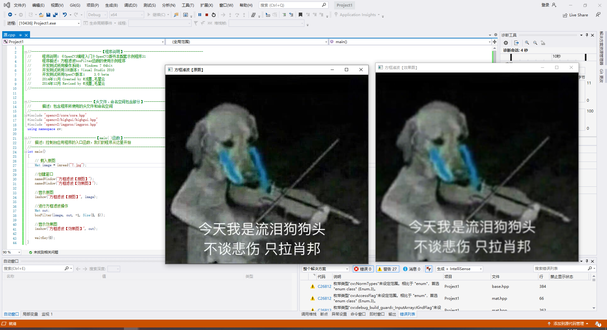

# 均值滤波 blur函数 # 

blur函数的作用是对于图像src进行均值滤波后用dst输出。

$源代码$

```

//--------------------------------------【程序说明】-------------------------------------------
//		程序说明：《OpenCV3编程入门》OpenCV3版书本配套示例程序32
//		程序描述：均值滤波blur函数的使用示例程序
//		开发测试所用操作系统： Windows 7 64bit
//		开发测试所用IDE版本：Visual Studio 2010
//		开发测试所用OpenCV版本：	3.0 beta
//		2014年11月 Created by @浅墨_毛星云
//		2014年12月 Revised by @浅墨_毛星云
//------------------------------------------------------------------------------------------------


//---------------------------------【头文件、命名空间包含部分】-------------------------------
//		描述：包含程序所使用的头文件和命名空间
//-----------------------------------------------------------------------------------------------
#include "opencv2/highgui/highgui.hpp" 
#include "opencv2/imgproc/imgproc.hpp" 
using namespace cv; 

//-----------------------------------【main( )函数】--------------------------------------------
//		描述：控制台应用程序的入口函数，我们的程序从这里开始
//-----------------------------------------------------------------------------------------------
int main( )
{ 
	//【1】载入原始图
	Mat srcImage=imread("1.jpg"); 

	//【2】显示原始图
	imshow( "均值滤波【原图】", srcImage ); 

	//【3】进行均值滤波操作
	Mat dstImage; 
	blur( srcImage, dstImage, Size(7, 7)); 

	//【4】显示效果图
	imshow( "均值滤波【效果图】" ,dstImage ); 

	waitKey( 0 );     
} 
```

$运行结果$

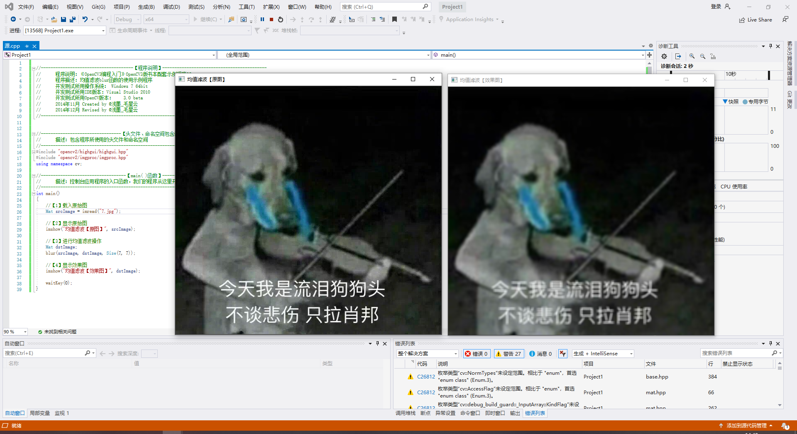

## 高斯滤波 GaussianBlur ##

高斯滤波是一种线性平滑滤波，可以消除高斯噪声，多用于图像处理的减噪过程。即高斯滤波就是对整幅图像进行加权平均的过程，每一个像素点的值都由其本身和领域内的其他像素值经过加权平均后得到。

$源代码$

```

//--------------------------------------【程序说明】-------------------------------------------
//		程序说明：《OpenCV3编程入门》OpenCV3版书本配套示例程序33
//		程序描述：高斯滤波GaussianBlur函数的使用示例程序
//		开发测试所用操作系统： Windows 7 64bit
//		开发测试所用IDE版本：Visual Studio 2010
//		开发测试所用OpenCV版本：	3.0 beta
//		2014年11月 Created by @浅墨_毛星云
//		2014年12月 Revised by @浅墨_毛星云
//------------------------------------------------------------------------------------------------


//---------------------------------【头文件、命名空间包含部分】-------------------------------
//		描述：包含程序所使用的头文件和命名空间
//------------------------------------------------------------------------------------------------
#include "opencv2/core/core.hpp" 
#include "opencv2/highgui/highgui.hpp" 
#include "opencv2/imgproc/imgproc.hpp" 
using namespace cv; 

//-----------------------------------【main( )函数】--------------------------------------------
//	描述：控制台应用程序的入口函数，我们的程序从这里开始
//-----------------------------------------------------------------------------------------------
int main( )
{ 
	// 载入原图
	Mat image=imread("1.jpg"); 

	//创建窗口
	namedWindow( "高斯滤波【原图】" ); 
	namedWindow( "高斯滤波【效果图】"); 

	//显示原图
	imshow( "高斯滤波【原图】", image ); 

	//进行高斯滤波操作
	Mat out; 
	GaussianBlur( image, out, Size( 5, 5 ), 0, 0 ); 

	//显示效果图
	imshow( "高斯滤波【效果图】" ,out ); 

	waitKey( 0 );     
} 
```

$运行结果$

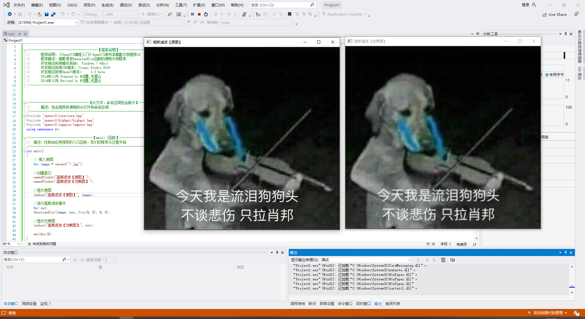

## 线性图像滤波综合 ##

$源代码$

```
//--------------------------------------【程序说明】-------------------------------------------
//		程序说明：《OpenCV3编程入门》OpenCV3版书本配套示例程序34
//		程序描述：线性图像滤波综合示例
//		开发测试所用操作系统： Windows 7 64bit
//		开发测试所用IDE版本：Visual Studio 2010
//		开发测试所用OpenCV版本：	3.0 beta
//		2014年11月 Created by @浅墨_毛星云
//		2014年12月 Revised by @浅墨_毛星云
//------------------------------------------------------------------------------------------------


//---------------------------------【头文件、命名空间包含部分】-------------------------------
//		描述：包含程序所使用的头文件和命名空间
//------------------------------------------------------------------------------------------------
#include <opencv2/core/core.hpp>
#include <opencv2/highgui/highgui.hpp>
#include <opencv2/imgproc/imgproc.hpp>
#include <iostream>

using namespace std;
using namespace cv;


//-----------------------------------【全局变量声明部分】--------------------------------------
//	描述：全局变量声明
//-----------------------------------------------------------------------------------------------
Mat g_srcImage,g_dstImage1,g_dstImage2,g_dstImage3;//存储图片的Mat类型
int g_nBoxFilterValue=3;  //方框滤波参数值
int g_nMeanBlurValue=3;  //均值滤波参数值
int g_nGaussianBlurValue=3;  //高斯滤波参数值


//-----------------------------------【全局函数声明部分】--------------------------------------
//	描述：全局函数声明
//-----------------------------------------------------------------------------------------------
//四个轨迹条的回调函数
static void on_BoxFilter(int, void *);		//均值滤波
static void on_MeanBlur(int, void *);		//均值滤波
static void on_GaussianBlur(int, void *);			//高斯滤波
void ShowHelpText();


//-----------------------------------【main( )函数】--------------------------------------------
//	描述：控制台应用程序的入口函数，我们的程序从这里开始
//-----------------------------------------------------------------------------------------------
int main(   )
{
	//改变console字体颜色
	system("color 5F");  

	//输出帮助文字
	ShowHelpText();

	// 载入原图
	g_srcImage = imread( "1.jpg", 1 );
	if( !g_srcImage.data ) { printf("Oh，no，读取srcImage错误~！ \n"); return false; }

	//克隆原图到三个Mat类型中
	g_dstImage1 = g_srcImage.clone( );
	g_dstImage2 = g_srcImage.clone( );
	g_dstImage3 = g_srcImage.clone( );

	//显示原图
	namedWindow("【<0>原图窗口】", 1);
	imshow("【<0>原图窗口】",g_srcImage);


	//=================【<1>方框滤波】==================
	//创建窗口
	namedWindow("【<1>方框滤波】", 1);
	//创建轨迹条
	createTrackbar("内核值：", "【<1>方框滤波】", &g_nBoxFilterValue, 40, on_BoxFilter);
	on_BoxFilter(g_nBoxFilterValue, 0);
	//================================================

	//=================【<2>均值滤波】==================
	//创建窗口
	namedWindow("【<2>均值滤波】", 1);
	//创建轨迹条
	createTrackbar("内核值：", "【<2>均值滤波】",&g_nMeanBlurValue, 40,on_MeanBlur );
	on_MeanBlur(g_nMeanBlurValue,0);
	//================================================

	//=================【<3>高斯滤波】=====================
	//创建窗口
	namedWindow("【<3>高斯滤波】", 1);
	//创建轨迹条
	createTrackbar("内核值：", "【<3>高斯滤波】",&g_nGaussianBlurValue, 40,on_GaussianBlur );
	on_GaussianBlur(g_nGaussianBlurValue,0);
	//================================================


	//输出一些帮助信息
	cout<<endl<<"\t运行成功，请调整滚动条观察图像效果~\n\n"
		<<"\t按下“q”键时，程序退出。\n";

	//按下“q”键时，程序退出
	while(char(waitKey(1)) != 'q') {}

	return 0;
}


//-----------------------------【on_BoxFilter( )函数】------------------------------------
//	描述：方框滤波操作的回调函数
//-----------------------------------------------------------------------------------------------
static void on_BoxFilter(int, void *)
{
	//方框滤波操作
	boxFilter( g_srcImage, g_dstImage1, -1,Size( g_nBoxFilterValue+1, g_nBoxFilterValue+1));
	//显示窗口
	imshow("【<1>方框滤波】", g_dstImage1);
}


//-----------------------------【on_MeanBlur( )函数】------------------------------------
//	描述：均值滤波操作的回调函数
//-----------------------------------------------------------------------------------------------
static void on_MeanBlur(int, void *)
{
	//均值滤波操作
	blur( g_srcImage, g_dstImage2, Size( g_nMeanBlurValue+1, g_nMeanBlurValue+1), Point(-1,-1));
	//显示窗口
	imshow("【<2>均值滤波】", g_dstImage2);
}


//-----------------------------【ContrastAndBright( )函数】------------------------------------
//	描述：高斯滤波操作的回调函数
//-----------------------------------------------------------------------------------------------
static void on_GaussianBlur(int, void *)
{
	//高斯滤波操作
	GaussianBlur( g_srcImage, g_dstImage3, Size( g_nGaussianBlurValue*2+1, g_nGaussianBlurValue*2+1 ), 0, 0);
	//显示窗口
	imshow("【<3>高斯滤波】", g_dstImage3);
}


//-----------------------------------【ShowHelpText( )函数】----------------------------------
//		 描述：输出一些帮助信息
//----------------------------------------------------------------------------------------------
void ShowHelpText()
{
	//输出欢迎信息和OpenCV版本
	printf("\n\n\t\t\t非常感谢购买《OpenCV3编程入门》一书！\n");
	printf("\n\n\t\t\t此为本书OpenCV3版的第34个配套示例程序\n");
	printf("\n\n\t\t\t   当前使用的OpenCV版本为：" CV_VERSION );
	printf("\n\n  ----------------------------------------------------------------------------\n");
}
```

$运行结果$

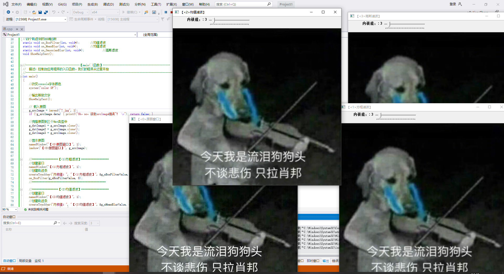

# 6.2 非线性滤波 #

在噪声是散粒噪声而不是高斯噪声时，即图像偶尔会出现很大的值的时候，用领域像素的非线性滤波会得到更好的结果。

## 中值滤波 Median filter ##

中值滤波是一种典型的非线性滤波技术，基本思想是用像素点邻域灰度值的中值来代替该像素点的灰度值。该方法在去除脉冲噪声、椒盐噪声的同时又能保留图像边缘细节。

$源代码$

```


//--------------------------------------【程序说明】-------------------------------------------
//		程序说明：《OpenCV3编程入门》OpenCV3版书本配套示例程序35
//		程序描述：中值滤波medianBlur函数的使用示例程序
//		开发测试所用操作系统： Windows 7 64bit
//		开发测试所用IDE版本：Visual Studio 2010
//		开发测试所用OpenCV版本：	3.0 beta
//		2014年11月 Created by @浅墨_毛星云
//		2014年12月 Revised by @浅墨_毛星云
//------------------------------------------------------------------------------------------------

//-----------------------------------【头文件包含部分】---------------------------------------
//	描述：包含程序所依赖的头文件
//---------------------------------------------------------------------------------------------- 
#include "opencv2/core/core.hpp" 
#include "opencv2/highgui/highgui.hpp" 
#include "opencv2/imgproc/imgproc.hpp" 

//-----------------------------------【命名空间声明部分】---------------------------------------
//	描述：包含程序所使用的命名空间
//-----------------------------------------------------------------------------------------------  
using namespace cv; 

//-----------------------------------【main( )函数】--------------------------------------------
//	描述：控制台应用程序的入口函数，我们的程序从这里开始
//-----------------------------------------------------------------------------------------------
int main( )
{ 
	// 载入原图
	Mat image=imread("1.jpg"); 

	//创建窗口
	namedWindow( "中值滤波【原图】" ); 
	namedWindow( "中值滤波【效果图】"); 

	//显示原图
	imshow( "中值滤波【原图】", image ); 

	//进行中值滤波操作
	Mat out; 
	medianBlur ( image, out, 7);

	//显示效果图
	imshow( "中值滤波【效果图】" ,out ); 

	waitKey( 0 );     
} 
```

$运行结果$

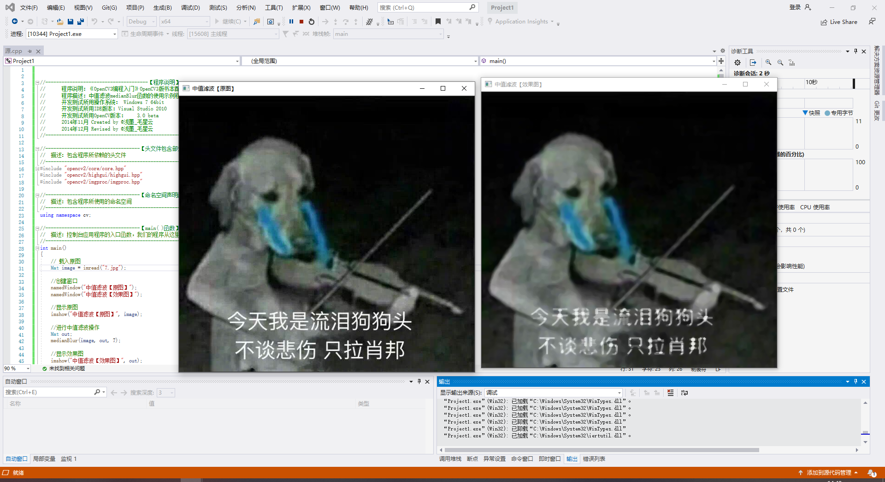

## 双边滤波 Bilateral filter ##

双边滤波是一种非线性的滤波方法，是结合图像的空间邻近度和像素值相似度的一种折中处理，同时考虑空域信息和灰度相似性，达到保边去噪的目的，具有简单、非迭代、局部的特点。

$源代码$

```
//--------------------------------------【程序说明】-------------------------------------------
//		程序说明：《OpenCV3编程入门》OpenCV3版书本配套示例程序36
//		程序描述：双边滤波bilateralFilter函数的使用示例程序
//		开发测试所用操作系统： Windows 7 64bit
//		开发测试所用IDE版本：Visual Studio 2010
//		开发测试所用OpenCV版本：	3.0 beta
//		2014年11月 Created by @浅墨_毛星云
//		2014年12月 Revised by @浅墨_毛星云
//------------------------------------------------------------------------------------------------


//-----------------------------------【头文件包含部分】---------------------------------------
//	描述：包含程序所依赖的头文件
//---------------------------------------------------------------------------------------------- 
#include "opencv2/core/core.hpp" 
#include "opencv2/highgui/highgui.hpp" 
#include "opencv2/imgproc/imgproc.hpp" 

//-----------------------------------【命名空间声明部分】---------------------------------------
//	描述：包含程序所使用的命名空间
//-----------------------------------------------------------------------------------------------  
using namespace cv; 

//-----------------------------------【main( )函数】--------------------------------------------
//	描述：控制台应用程序的入口函数，我们的程序从这里开始
//-----------------------------------------------------------------------------------------------
int main( )
{ 
	// 载入原图
	Mat image=imread("1.jpg"); 

	//创建窗口
	namedWindow( "双边滤波【原图】" ); 
	namedWindow( "双边滤波【效果图】"); 

	//显示原图
	imshow( "双边滤波【原图】", image ); 

	//进行双边滤波操作
	Mat out; 
	bilateralFilter ( image, out, 25, 25*2, 25/2 ); 

	//显示效果图
	imshow( "双边滤波【效果图】" ,out ); 

	waitKey( 0 );     
} 
```

$运行结果$

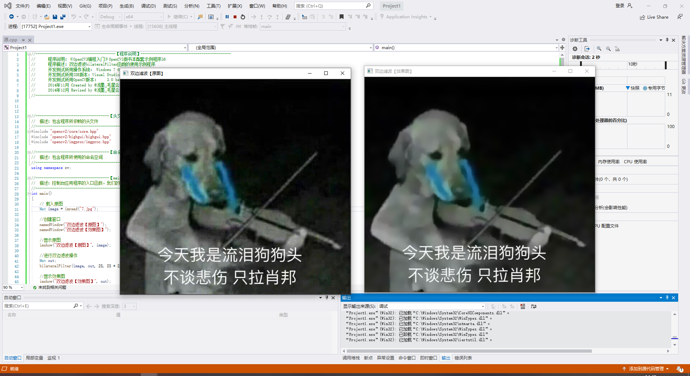

## 图像滤波综合 ##

$源代码$

```

//--------------------------------------【程序说明】-------------------------------------------
//		程序说明：《OpenCV3编程入门》OpenCV3版书本配套示例程序37
//		程序描述：五种图像滤波综合示例
//		开发测试所用操作系统： Windows 7 64bit
//		开发测试所用IDE版本：Visual Studio 2010
//		开发测试所用OpenCV版本：	3.0 beta
//		2014年11月 Created by @浅墨_毛星云
//		2014年12月 Revised by @浅墨_毛星云
//------------------------------------------------------------------------------------------------

//-----------------------------------【头文件包含部分】---------------------------------------
//		描述：包含程序所依赖的头文件
//---------------------------------------------------------------------------------------------- 
#include <opencv2/core/core.hpp>
#include <opencv2/highgui/highgui.hpp>
#include <opencv2/imgproc/imgproc.hpp>
#include <iostream>

//-----------------------------------【命名空间声明部分】---------------------------------------
//		描述：包含程序所使用的命名空间
//-----------------------------------------------------------------------------------------------  
using namespace std;
using namespace cv;


//-----------------------------------【全局变量声明部分】--------------------------------------
//		描述：全局变量声明
//-----------------------------------------------------------------------------------------------
Mat g_srcImage,g_dstImage1,g_dstImage2,g_dstImage3,g_dstImage4,g_dstImage5;
int g_nBoxFilterValue=6;  //方框滤波内核值
int g_nMeanBlurValue=10;  //均值滤波内核值
int g_nGaussianBlurValue=6;  //高斯滤波内核值
int g_nMedianBlurValue=10;  //中值滤波参数值
int g_nBilateralFilterValue=10;  //双边滤波参数值


//-----------------------------------【全局函数声明部分】--------------------------------------
//		描述：全局函数声明
//-----------------------------------------------------------------------------------------------
//轨迹条回调函数
static void on_BoxFilter(int, void *);		//方框滤波
static void on_MeanBlur(int, void *);		//均值块滤波器
static void on_GaussianBlur(int, void *);			//高斯滤波器
static void on_MedianBlur(int, void *);			//中值滤波器
static void on_BilateralFilter(int, void *);			//双边滤波器
void ShowHelpText();


//-----------------------------------【main( )函数】--------------------------------------------
//		描述：控制台应用程序的入口函数，我们的程序从这里开始
//-----------------------------------------------------------------------------------------------
int main(   )
{
	system("color 4F");  

	ShowHelpText();	

	// 载入原图
	g_srcImage = imread( "1.jpg", 1 );
	if( !g_srcImage.data ) { printf("读取srcImage错误~！ \n"); return false; }

	//克隆原图到四个Mat类型中
	g_dstImage1 = g_srcImage.clone( );
	g_dstImage2 = g_srcImage.clone( );
	g_dstImage3 = g_srcImage.clone( );
	g_dstImage4 = g_srcImage.clone( );
	g_dstImage5 = g_srcImage.clone( );

	//显示原图
	namedWindow("【<0>原图窗口】", 1);
	imshow("【<0>原图窗口】",g_srcImage);


	//=================【<1>方框滤波】=========================
	//创建窗口
	namedWindow("【<1>方框滤波】", 1);
	//创建轨迹条
	createTrackbar("内核值：", "【<1>方框滤波】",&g_nBoxFilterValue, 50,on_BoxFilter );
	on_MeanBlur(g_nBoxFilterValue,0);
	imshow("【<1>方框滤波】", g_dstImage1);
	//=====================================================


	//=================【<2>均值滤波】==========================
	//创建窗口
	namedWindow("【<2>均值滤波】", 1);
	//创建轨迹条
	createTrackbar("内核值：", "【<2>均值滤波】",&g_nMeanBlurValue, 50,on_MeanBlur );
	on_MeanBlur(g_nMeanBlurValue,0);
	//======================================================


	//=================【<3>高斯滤波】===========================
	//创建窗口
	namedWindow("【<3>高斯滤波】", 1);
	//创建轨迹条
	createTrackbar("内核值：", "【<3>高斯滤波】",&g_nGaussianBlurValue, 50,on_GaussianBlur );
	on_GaussianBlur(g_nGaussianBlurValue,0);
	//=======================================================


	//=================【<4>中值滤波】===========================
	//创建窗口
	namedWindow("【<4>中值滤波】", 1);
	//创建轨迹条
	createTrackbar("参数值：", "【<4>中值滤波】",&g_nMedianBlurValue, 50,on_MedianBlur );
	on_MedianBlur(g_nMedianBlurValue,0);
	//=======================================================


	//=================【<5>双边滤波】===========================
	//创建窗口
	namedWindow("【<5>双边滤波】", 1);
	//创建轨迹条
	createTrackbar("参数值：", "【<5>双边滤波】",&g_nBilateralFilterValue, 50,on_BilateralFilter);
	on_BilateralFilter(g_nBilateralFilterValue,0);
	//=======================================================


	//输出一些帮助信息
	cout<<endl<<"\t运行成功，请调整滚动条观察图像效果~\n\n"
		<<"\t按下“q”键时，程序退出。\n";
	while(char(waitKey(1)) != 'q') {}

	return 0;
}

//-----------------------------【on_BoxFilter( )函数】------------------------------------
//		描述：方框滤波操作的回调函数
//-----------------------------------------------------------------------------------------------
static void on_BoxFilter(int, void *)
{
	//方框滤波操作
	boxFilter( g_srcImage, g_dstImage1, -1,Size( g_nBoxFilterValue+1, g_nBoxFilterValue+1));
	//显示窗口
	imshow("【<1>方框滤波】", g_dstImage1);
}

//-----------------------------【on_MeanBlur( )函数】------------------------------------
//		描述：均值滤波操作的回调函数
//-----------------------------------------------------------------------------------------------
static void on_MeanBlur(int, void *)
{
	blur( g_srcImage, g_dstImage2, Size( g_nMeanBlurValue+1, g_nMeanBlurValue+1), Point(-1,-1));
	imshow("【<2>均值滤波】", g_dstImage2);

}

//-----------------------------【on_GaussianBlur( )函数】------------------------------------
//		描述：高斯滤波操作的回调函数
//-----------------------------------------------------------------------------------------------
static void on_GaussianBlur(int, void *)
{
	GaussianBlur( g_srcImage, g_dstImage3, Size( g_nGaussianBlurValue*2+1, g_nGaussianBlurValue*2+1 ), 0, 0);
	imshow("【<3>高斯滤波】", g_dstImage3);
}


//-----------------------------【on_MedianBlur( )函数】------------------------------------
//		描述：中值滤波操作的回调函数
//-----------------------------------------------------------------------------------------------
static void on_MedianBlur(int, void *)
{
	medianBlur ( g_srcImage, g_dstImage4, g_nMedianBlurValue*2+1 );
	imshow("【<4>中值滤波】", g_dstImage4);
}


//-----------------------------【on_BilateralFilter( )函数】------------------------------------
//		描述：双边滤波操作的回调函数
//-----------------------------------------------------------------------------------------------
static void on_BilateralFilter(int, void *)
{
	bilateralFilter ( g_srcImage, g_dstImage5, g_nBilateralFilterValue, g_nBilateralFilterValue*2, g_nBilateralFilterValue/2 );
	imshow("【<5>双边滤波】", g_dstImage5);
}

//-----------------------------------【ShowHelpText( )函数】-----------------------------
//		 描述：输出一些帮助信息
//----------------------------------------------------------------------------------------------
void ShowHelpText()
{
	//输出欢迎信息和OpenCV版本
	printf("\n\n\t\t\t非常感谢购买《OpenCV3编程入门》一书！\n");
	printf("\n\n\t\t\t此为本书OpenCV3版的第37个配套示例程序\n");
	printf("\n\n\t\t\t   当前使用的OpenCV版本为：" CV_VERSION );
	printf("\n\n  ----------------------------------------------------------------------------\n");
}

```

$运行结果$

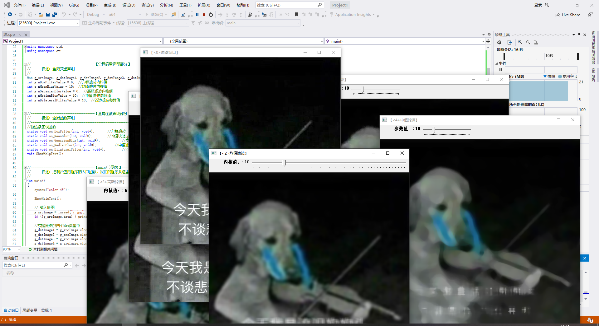

## 6.3 形态学滤波 ##

“形态学”通常表示生物学的一个分支，主要研究动植物的形态和结构。
数学形态学是一门建立在格论和拓扑学基础之上的图像分析学科，是数学形态学图像处理的基本理论。
简单来说，形态学操作就是基于形状的一系列图像处理操作。

## 膨胀 dilate ##

膨胀就是求局部最大值的操作。

$源代码$

```

//--------------------------------------【程序说明】-------------------------------------------
//		程序说明：《OpenCV3编程入门》OpenCV3版书本配套示例程序38
//		程序描述：图像膨胀dilate函数用法示例
//		开发测试所用操作系统： Windows 7 64bit
//		开发测试所用IDE版本：Visual Studio 2010
//		开发测试所用OpenCV版本：	3.0 beta
//		2014年11月 Created by @浅墨_毛星云
//		2014年12月 Revised by @浅墨_毛星云
//------------------------------------------------------------------------------------------------

//-----------------------------------【头文件包含部分】---------------------------------------
//	描述：包含程序所依赖的头文件
//---------------------------------------------------------------------------------------------- 
#include <opencv2/core/core.hpp>
#include <opencv2/highgui/highgui.hpp>
#include <opencv2/imgproc/imgproc.hpp>
#include <iostream>

//-----------------------------------【命名空间声明部分】---------------------------------------
//	描述：包含程序所使用的命名空间
//-----------------------------------------------------------------------------------------------  
using namespace std;
using namespace cv;

//-----------------------------------【main( )函数】--------------------------------------------
//	描述：控制台应用程序的入口函数，我们的程序从这里开始
//-----------------------------------------------------------------------------------------------
int main(   )
{

	//载入原图  
	Mat image = imread("1.jpg");

	//创建窗口  
	namedWindow("【原图】膨胀操作");
	namedWindow("【效果图】膨胀操作");

	//显示原图
	imshow("【原图】膨胀操作", image);

	//进行膨胀操作 
	Mat element = getStructuringElement(MORPH_RECT, Size(15, 15));
	Mat out;
	dilate(image, out, element);

	//显示效果图 
	imshow("【效果图】膨胀操作", out);

	waitKey(0); 

	return 0;
}
```

$运行结果$

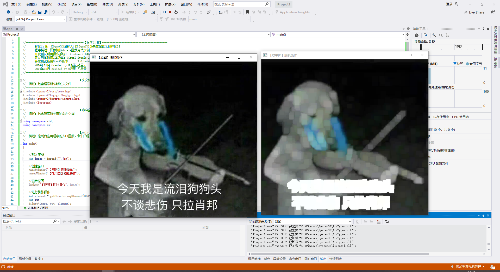

## 腐蚀 erode ##

腐蚀和膨胀是相反的一对操作，所以腐蚀就是求局部最小值的操作。

$源代码$

```
//--------------------------------------【程序说明】-------------------------------------------
//		程序说明：《OpenCV3编程入门》OpenCV3版书本配套示例程序39
//		程序描述：图像腐蚀erode函数用法示例
//		开发测试所用操作系统： Windows 7 64bit
//		开发测试所用IDE版本：Visual Studio 2010
//		开发测试所用OpenCV版本：	3.0 beta
//		2014年11月 Created by @浅墨_毛星云
//		2014年12月 Revised by @浅墨_毛星云
//------------------------------------------------------------------------------------------------

//---------------------------------【头文件、命名空间包含部分】----------------------------
//		描述：包含程序所使用的头文件和命名空间
//------------------------------------------------------------------------------------------------
#include <opencv2/highgui/highgui.hpp>
#include <opencv2/imgproc/imgproc.hpp>
using namespace cv;

//-----------------------------------【main( )函数】--------------------------------------------
//	描述：控制台应用程序的入口函数，我们的程序从这里开始
//-----------------------------------------------------------------------------------------------
int main(   )
{
	//载入原图  
	Mat srcImage = imread("1.jpg");
	//显示原图
	imshow("【原图】腐蚀操作", srcImage);
	//进行腐蚀操作 
	Mat element = getStructuringElement(MORPH_RECT, Size(15, 15));
	Mat dstImage;
	erode(srcImage, dstImage, element);
	//显示效果图 
	imshow("【效果图】腐蚀操作", dstImage);
	waitKey(0); 

	return 0;
}
```

$运行结果$

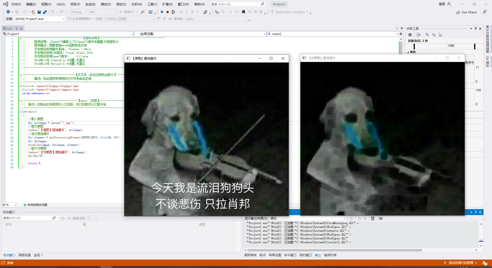

## 腐蚀膨胀综合 ##

$源代码$

```
//--------------------------------------【程序说明】-------------------------------------------
//		程序说明：《OpenCV3编程入门》OpenCV3版书本配套示例程序40
//		程序描述：图像腐蚀与膨胀综合示例
//		开发测试所用操作系统： Windows 7 64bit
//		开发测试所用IDE版本：Visual Studio 2010
//		开发测试所用OpenCV版本：	3.0 beta
//		2014年11月 Created by @浅墨_毛星云
//		2014年12月 Revised by @浅墨_毛星云
//------------------------------------------------------------------------------------------------


//---------------------------------【头文件、命名空间包含部分】-----------------------------
//		描述：包含程序所使用的头文件和命名空间
//------------------------------------------------------------------------------------------------
#include <opencv2/opencv.hpp>
#include <opencv2/highgui/highgui.hpp>
#include <opencv2/imgproc/imgproc.hpp>
#include <iostream>
using namespace std;
using namespace cv;


//-----------------------------------【全局变量声明部分】--------------------------------------
//		描述：全局变量声明
//-----------------------------------------------------------------------------------------------
Mat g_srcImage, g_dstImage;//原始图和效果图
int g_nTrackbarNumer = 0;//0表示腐蚀erode, 1表示膨胀dilate
int g_nStructElementSize = 3; //结构元素(内核矩阵)的尺寸


//-----------------------------------【全局函数声明部分】--------------------------------------
//		描述：全局函数声明
//-----------------------------------------------------------------------------------------------
void Process();//膨胀和腐蚀的处理函数
void on_TrackbarNumChange(int, void *);//回调函数
void on_ElementSizeChange(int, void *);//回调函数
void ShowHelpText();

//-----------------------------------【main( )函数】--------------------------------------------
//		描述：控制台应用程序的入口函数，我们的程序从这里开始
//-----------------------------------------------------------------------------------------------
int main( )
{
	//改变console字体颜色
	system("color 2F");  

	//载入原图
	g_srcImage = imread("1.jpg");
	if( !g_srcImage.data ) { printf("读取srcImage错误~！ \n"); return false; }

	ShowHelpText();

	//显示原始图
	namedWindow("【原始图】");
	imshow("【原始图】", g_srcImage);

	//进行初次腐蚀操作并显示效果图
	namedWindow("【效果图】");
	//获取自定义核
	Mat element = getStructuringElement(MORPH_RECT, Size(2*g_nStructElementSize+1, 2*g_nStructElementSize+1),Point( g_nStructElementSize, g_nStructElementSize ));
	erode(g_srcImage, g_dstImage, element);
	imshow("【效果图】", g_dstImage);

	//创建轨迹条
	createTrackbar("腐蚀/膨胀", "【效果图】", &g_nTrackbarNumer, 1, on_TrackbarNumChange);
	createTrackbar("内核尺寸", "【效果图】", &g_nStructElementSize, 21, on_ElementSizeChange);

	//输出一些帮助信息
	cout<<endl<<"\t运行成功，请调整滚动条观察图像效果~\n\n"
		<<"\t按下“q”键时，程序退出。\n";

	//轮询获取按键信息，若下q键，程序退出
	while(char(waitKey(1)) != 'q') {}

	return 0;
}

//-----------------------------【Process( )函数】------------------------------------
//		描述：进行自定义的腐蚀和膨胀操作
//-----------------------------------------------------------------------------------------
void Process() 
{
	//获取自定义核
	Mat element = getStructuringElement(MORPH_RECT, Size(2*g_nStructElementSize+1, 2*g_nStructElementSize+1),Point( g_nStructElementSize, g_nStructElementSize ));

	//进行腐蚀或膨胀操作
	if(g_nTrackbarNumer == 0) {    
		erode(g_srcImage, g_dstImage, element);
	}
	else {
		dilate(g_srcImage, g_dstImage, element);
	}

	//显示效果图
	imshow("【效果图】", g_dstImage);
}


//-----------------------------【on_TrackbarNumChange( )函数】------------------------------------
//		描述：腐蚀和膨胀之间切换开关的回调函数
//-----------------------------------------------------------------------------------------------------
void on_TrackbarNumChange(int, void *) 
{
	//腐蚀和膨胀之间效果已经切换，回调函数体内需调用一次Process函数，使改变后的效果立即生效并显示出来
	Process();
}


//-----------------------------【on_ElementSizeChange( )函数】-------------------------------------
//		描述：腐蚀和膨胀操作内核改变时的回调函数
//-----------------------------------------------------------------------------------------------------
void on_ElementSizeChange(int, void *)
{
	//内核尺寸已改变，回调函数体内需调用一次Process函数，使改变后的效果立即生效并显示出来
	Process();
}


//-----------------------------------【ShowHelpText( )函数】-----------------------------
//		 描述：输出一些帮助信息
//----------------------------------------------------------------------------------------------
void ShowHelpText()
{
	//输出欢迎信息和OpenCV版本
	printf("\n\n\t\t\t非常感谢购买《OpenCV3编程入门》一书！\n");
	printf("\n\n\t\t\t此为本书OpenCV3版的第40个配套示例程序\n");
	printf("\n\n\t\t\t   当前使用的OpenCV版本为：" CV_VERSION );
	printf("\n\n  ----------------------------------------------------------------------------\n");
}

```

$运行结果$


## morphologyEx进行图像膨胀 ##

$源代码$

```

//--------------------------------------【程序说明】-------------------------------------------
//		程序说明：《OpenCV3编程入门》OpenCV3版书本配套示例程序41
//		程序描述：用morphologyEx进行图像膨胀
//		开发测试所用操作系统： Windows 7 64bit
//		开发测试所用IDE版本：Visual Studio 2010
//		开发测试所用OpenCV版本：	3.0 beta
//		2014年11月 Created by @浅墨_毛星云
//		2014年12月 Revised by @浅墨_毛星云
//------------------------------------------------------------------------------------------------

//---------------------------------【头文件、命名空间包含部分】----------------------------
//		描述：包含程序所使用的头文件和命名空间
//------------------------------------------------------------------------------------------------
#include <opencv2/opencv.hpp>
#include <opencv2/highgui/highgui.hpp>
#include <opencv2/imgproc/imgproc.hpp>
using namespace cv;


//-----------------------------------【main( )函数】--------------------------------------------
//		描述：控制台应用程序的入口函数，我们的程序从这里开始
//-----------------------------------------------------------------------------------------------
int main( )
{
	//载入原始图   
	Mat image = imread("1.jpg");  //工程目录下应该有一张名为1.jpg的素材图
	//创建窗口   
	namedWindow("【原始图】膨胀");  
	namedWindow("【效果图】膨胀");  
	//显示原始图  
	imshow("【原始图】膨胀", image);  
	//定义核
	Mat element = getStructuringElement(MORPH_RECT, Size(15, 15));  
	//进行形态学操作
	morphologyEx(image, image, MORPH_DILATE, element);
	//显示效果图  
	imshow("【效果图】膨胀", image);  

	waitKey(0);  

	return 0;  
}

```

$运行结果$

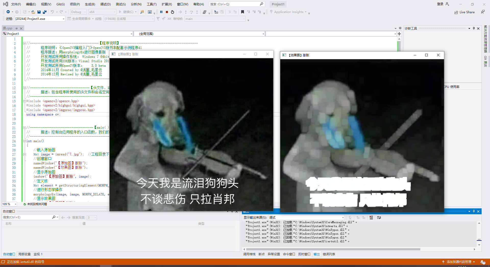

## morphologyEx进行图像腐蚀 ##

$源代码$

```
//--------------------------------------【程序说明】-------------------------------------------
//		程序说明：《OpenCV3编程入门》OpenCV3版书本配套示例程序42
//		程序描述：用morphologyEx进行图像腐蚀
//		开发测试所用操作系统： Windows 7 64bit
//		开发测试所用IDE版本：Visual Studio 2010
//		开发测试所用OpenCV版本：	3.0 beta
//		2014年11月 Created by @浅墨_毛星云
//		2014年12月 Revised by @浅墨_毛星云
//------------------------------------------------------------------------------------------------


//-----------------------------------【头文件包含部分】---------------------------------------
//		描述：包含程序所依赖的头文件
//---------------------------------------------------------------------------------------------- 
#include <opencv2/opencv.hpp>
#include <opencv2/highgui/highgui.hpp>
#include <opencv2/imgproc/imgproc.hpp>

//-----------------------------------【命名空间声明部分】---------------------------------------
//		描述：包含程序所使用的命名空间
//----------------------------------------------------------------------------------------------- 
using namespace cv;
//-----------------------------------【main( )函数】--------------------------------------------
//		描述：控制台应用程序的入口函数，我们的程序从这里开始
//-----------------------------------------------------------------------------------------------
int main( )
{
	//载入原始图   
	Mat image = imread("1.jpg");  //工程目录下应该有一张名为1.jpg的素材图
	//创建窗口   
	namedWindow("【原始图】腐蚀");  
	namedWindow("【效果图】腐蚀");  
	//显示原始图  
	imshow("【原始图】腐蚀", image);  
	//定义核
	Mat element = getStructuringElement(MORPH_RECT, Size(15, 15));  
	//进行形态学操作
	morphologyEx(image, image, MORPH_ERODE, element);
	//显示效果图  
	imshow("【效果图】腐蚀", image);  

	waitKey(0);  

	return 0;  
}

```

$运行结果$

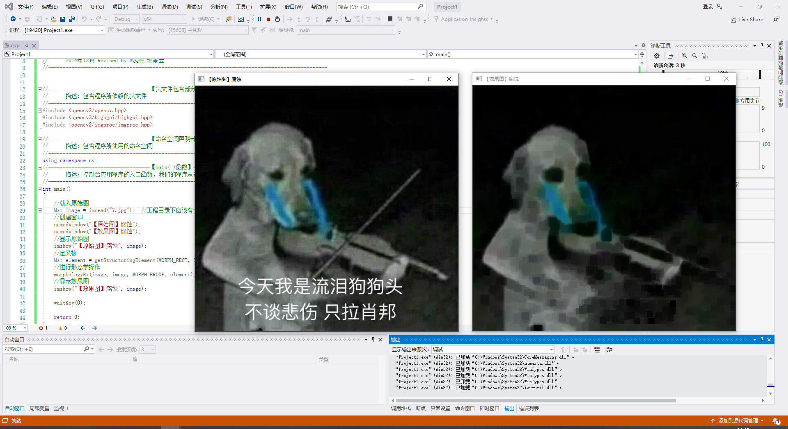

## 6.4形态学滤波2 ##

## 开运算 Opening Operation ##

即先腐蚀后膨胀过程。

$源代码$

```

//--------------------------------------【程序说明】-------------------------------------------
//		程序说明：《OpenCV3编程入门》OpenCV3版书本配套示例程序43
//		程序描述：用morphologyEx进行图像形态学开运算用法示例
//		开发测试所用操作系统： Windows 7 64bit
//		开发测试所用IDE版本：Visual Studio 2010
//		开发测试所用OpenCV版本：	3.0 beta
//		2014年11月 Created by @浅墨_毛星云
//		2014年12月 Revised by @浅墨_毛星云
//------------------------------------------------------------------------------------------------


//---------------------------------【头文件、命名空间包含部分】----------------------------
//		描述：包含程序所使用的头文件和命名空间
//------------------------------------------------------------------------------------------------
#include <opencv2/opencv.hpp>
#include <opencv2/highgui/highgui.hpp>
#include <opencv2/imgproc/imgproc.hpp>
using namespace cv;

//-----------------------------------【main( )函数】--------------------------------------------
//		描述：控制台应用程序的入口函数，我们的程序从这里开始
//-----------------------------------------------------------------------------------------------
int main( )
{
	//载入原始图   
	Mat image = imread("1.jpg");  //工程目录下应该有一张名为1.jpg的素材图
	//创建窗口   
	namedWindow("【原始图】开运算");  
	namedWindow("【效果图】开运算");  
	//显示原始图  
	imshow("【原始图】开运算", image);  
	//定义核
	Mat element = getStructuringElement(MORPH_RECT, Size(15, 15));  
	//进行形态学操作
	morphologyEx(image, image, MORPH_OPEN, element);
	//显示效果图  
	imshow("【效果图】开运算", image);  

	waitKey(0);  

	return 0;  
}

```

$运行结果$

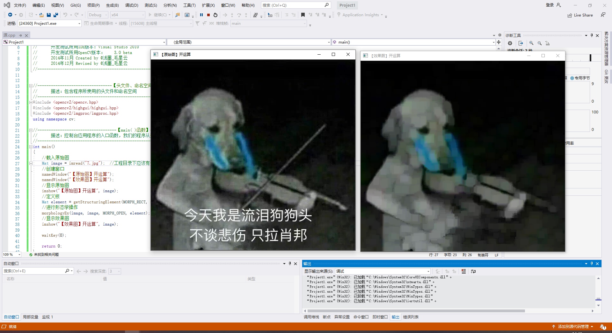

## 闭运算 ##

先膨胀后腐蚀的过程称为闭运算。

$源代码$

```

//--------------------------------------【程序说明】-------------------------------------------
//		程序说明：《OpenCV3编程入门》OpenCV3版书本配套示例程序44
//		程序描述：用morphologyEx进行图像闭运算
//		开发测试所用操作系统： Windows 7 64bit
//		开发测试所用IDE版本：Visual Studio 2010
//		开发测试所用OpenCV版本：	3.0 beta
//		2014年11月 Created by @浅墨_毛星云
//		2014年12月 Revised by @浅墨_毛星云
//------------------------------------------------------------------------------------------------


//---------------------------------【头文件、命名空间包含部分】----------------------------
//		描述：包含程序所使用的头文件和命名空间
//------------------------------------------------------------------------------------------------
#include <opencv2/opencv.hpp>
#include <opencv2/highgui/highgui.hpp>
#include <opencv2/imgproc/imgproc.hpp>
using namespace cv;


//-----------------------------------【main( )函数】------------------------------------------
//		描述：控制台应用程序的入口函数，我们的程序从这里开始
//-----------------------------------------------------------------------------------------------
int main( )
{
	//载入原始图   
	Mat image = imread("1.jpg");  //工程目录下应该有一张名为1.jpg的素材图
	//创建窗口   
	namedWindow("【原始图】闭运算");  
	namedWindow("【效果图】闭运算");  
	//显示原始图  
	imshow("【原始图】闭运算", image);  
	//定义核
	Mat element = getStructuringElement(MORPH_RECT, Size(15, 15));  
	//进行形态学操作
	morphologyEx(image, image, MORPH_CLOSE, element);
	//显示效果图  
	imshow("【效果图】闭运算", image);  

	waitKey(0);  

	return 0;  
}

```

$运行结果$

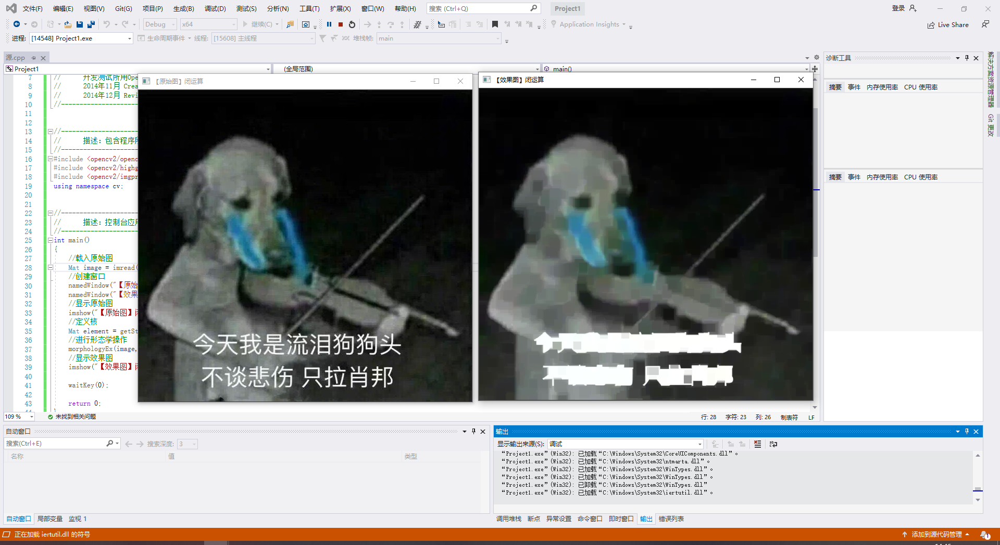

## 形态学梯度 ##

形态学梯度是膨胀图与腐蚀图之差。

$源代码$

```

//--------------------------------------【程序说明】-------------------------------------------
//		程序说明：《OpenCV3编程入门》OpenCV3版书本配套示例程序45
//		程序描述：用morphologyEx进行形态学梯度运算
//		开发测试所用操作系统： Windows 7 64bit
//		开发测试所用IDE版本：Visual Studio 2010
//		开发测试所用OpenCV版本：	3.0 beta
//		2014年11月 Created by @浅墨_毛星云
//		2014年12月 Revised by @浅墨_毛星云
//------------------------------------------------------------------------------------------------


//---------------------------------【头文件、命名空间包含部分】----------------------------
//		描述：包含程序所使用的头文件和命名空间
//------------------------------------------------------------------------------------------------
#include <opencv2/opencv.hpp>
#include <opencv2/highgui/highgui.hpp>
#include <opencv2/imgproc/imgproc.hpp>
using namespace cv;


//-----------------------------------【main( )函数】------------------------------------------
//		描述：控制台应用程序的入口函数，我们的程序从这里开始
//-----------------------------------------------------------------------------------------------
int main( )
{
	//载入原始图   
	Mat image = imread("1.jpg");  //工程目录下应该有一张名为1.jpg的素材图
	//创建窗口   
	namedWindow("【原始图】形态学梯度");  
	namedWindow("【效果图】形态学梯度");  
	//显示原始图  
	imshow("【原始图】形态学梯度", image);  
	//定义核
	Mat element = getStructuringElement(MORPH_RECT, Size(15, 15));  
	//进行形态学操作
	morphologyEx(image, image, MORPH_GRADIENT, element);
	//显示效果图  
	imshow("【效果图】形态学梯度", image);  

	waitKey(0);  

	return 0;  
}

```

$运行结果$

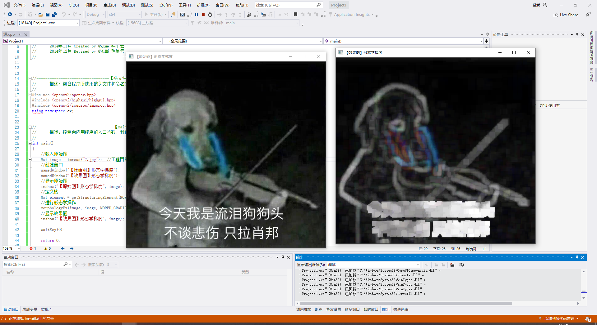

## 顶帽(Top Hat) ##

顶帽运算是原图像与上文刚刚介绍的“开运算”的结果图之差。

$源代码$

```
//--------------------------------------【程序说明】-------------------------------------------
//		程序说明：《OpenCV3编程入门》OpenCV3版书本配套示例程序46
//		程序描述：用morphologyEx进行形态学顶帽运算
//		开发测试所用操作系统： Windows 7 64bit
//		开发测试所用IDE版本：Visual Studio 2010
//		开发测试所用OpenCV版本：	3.0 beta
//		2014年11月 Created by @浅墨_毛星云
//		2014年12月 Revised by @浅墨_毛星云
//------------------------------------------------------------------------------------------------


//---------------------------------【头文件、命名空间包含部分】----------------------------
//		描述：包含程序所使用的头文件和命名空间
//------------------------------------------------------------------------------------------------
#include <opencv2/opencv.hpp>
#include <opencv2/highgui/highgui.hpp>
#include <opencv2/imgproc/imgproc.hpp>
using namespace cv;


//-----------------------------------【main( )函数】------------------------------------------
//		描述：控制台应用程序的入口函数，我们的程序从这里开始
//-----------------------------------------------------------------------------------------------
int main( )
{
	//载入原始图   
	Mat image = imread("1.jpg");  //工程目录下应该有一张名为1.jpg的素材图
	//创建窗口   
	namedWindow("【原始图】顶帽运算");  
	namedWindow("【效果图】顶帽运算");  
	//显示原始图  
	imshow("【原始图】顶帽运算", image);  
	//定义核
	Mat element = getStructuringElement(MORPH_RECT, Size(15, 15));  
	//进行形态学操作
	morphologyEx(image, image, MORPH_TOPHAT, element);
	//显示效果图  
	imshow("【效果图】顶帽运算", image);  

	waitKey(0);  

	return 0;  
}

```

$运行结果$

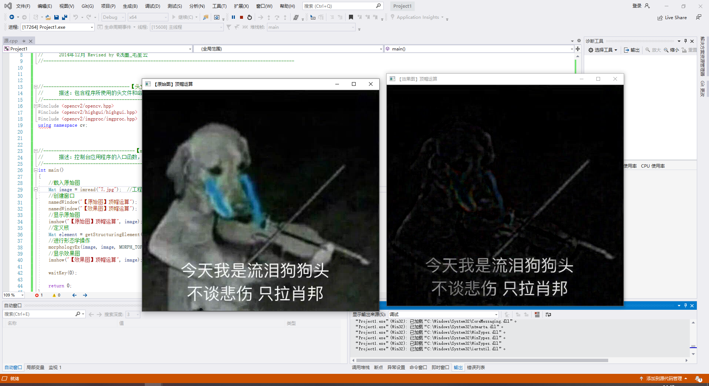

## 黑帽（Black Hat） ##

黑帽运算是闭运算的结果图与原图像之差。

$源代码$

```


//--------------------------------------【程序说明】-------------------------------------------
//		程序说明：《OpenCV3编程入门》OpenCV3版书本配套示例程序47
//		程序描述：用morphologyEx进行形态学黑帽运算
//		开发测试所用操作系统： Windows 7 64bit
//		开发测试所用IDE版本：Visual Studio 2010
//		开发测试所用OpenCV版本：	3.0 beta
//		2014年11月 Created by @浅墨_毛星云
//		2014年12月 Revised by @浅墨_毛星云
//------------------------------------------------------------------------------------------------


//---------------------------------【头文件、命名空间包含部分】----------------------------
//		描述：包含程序所使用的头文件和命名空间
//------------------------------------------------------------------------------------------------
#include <opencv2/opencv.hpp>
#include <opencv2/highgui/highgui.hpp>
#include <opencv2/imgproc/imgproc.hpp>
using namespace cv;


//-----------------------------------【main( )函数】--------------------------------------------
//		描述：控制台应用程序的入口函数，我们的程序从这里开始
//-----------------------------------------------------------------------------------------------
int main( )
{
	//载入原始图   
	Mat image = imread("1.jpg");  //工程目录下应该有一张名为1.jpg的素材图
	//创建窗口   
	namedWindow("【原始图】黑帽运算");  
	namedWindow("【效果图】黑帽运算");  
	//显示原始图  
	imshow("【原始图】黑帽运算", image);  
	//定义核
	Mat element = getStructuringElement(MORPH_RECT, Size(15, 15));  
	//进行形态学操作
	morphologyEx(image, image, MORPH_BLACKHAT, element);
	//显示效果图  
	imshow("【效果图】黑帽运算", image);  

	waitKey(0);  

	return 0;  
}

```

$运算结果$

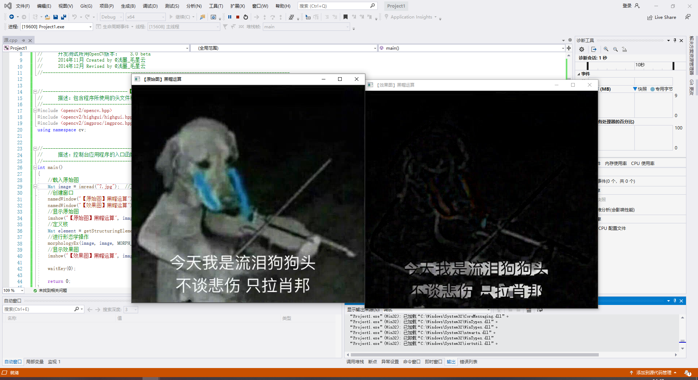

## 形态学图像处理综合 ##

$源代码$

```

//--------------------------------------【程序说明】-------------------------------------------
//		程序说明：《OpenCV3编程入门》OpenCV3版书本配套示例程序48
//		程序描述：形态学图像处理——开运算、闭运算、形态学梯度、顶帽、黑帽
//		开发测试所用操作系统： Windows 7 64bit
//		开发测试所用IDE版本：Visual Studio 2010
//		开发测试所用OpenCV版本：	3.0 beta
//		2014年11月 Created by @浅墨_毛星云
//		2014年12月 Revised by @浅墨_毛星云
//------------------------------------------------------------------------------------------------


//---------------------------------【头文件、命名空间包含部分】----------------------------
//		描述：包含程序所使用的头文件和命名空间
//------------------------------------------------------------------------------------------------
#include <opencv2/opencv.hpp>
#include <opencv2/highgui/highgui.hpp>
#include <opencv2/imgproc/imgproc.hpp>
using namespace std;
using namespace cv;


//-----------------------------------【全局变量声明部分】-----------------------------------
//		描述：全局变量声明
//-----------------------------------------------------------------------------------------------
Mat g_srcImage, g_dstImage;//原始图和效果图
int g_nElementShape = MORPH_RECT;//元素结构的形状

//变量接收的TrackBar位置参数
int g_nMaxIterationNum = 10;
int g_nOpenCloseNum = 0;
int g_nErodeDilateNum = 0;
int g_nTopBlackHatNum = 0;


//-----------------------------------【全局函数声明部分】--------------------------------------
//		描述：全局函数声明
//-----------------------------------------------------------------------------------------------
static void on_OpenClose(int, void*);//回调函数
static void on_ErodeDilate(int, void*);//回调函数
static void on_TopBlackHat(int, void*);//回调函数
static void ShowHelpText();


//-----------------------------------【main( )函数】--------------------------------------------
//		描述：控制台应用程序的入口函数，我们的程序从这里开始
//-----------------------------------------------------------------------------------------------
int main( )
{
	//改变console字体颜色
	system("color 2F");  

	ShowHelpText();

	//载入原图
	g_srcImage = imread("1.jpg");
	if( !g_srcImage.data ) { printf("Oh，no，读取srcImage错误~！ \n"); return false; }

	//显示原始图
	namedWindow("【原始图】");
	imshow("【原始图】", g_srcImage);

	//创建三个窗口
	namedWindow("【开运算/闭运算】",1);
	namedWindow("【腐蚀/膨胀】",1);
	namedWindow("【顶帽/黑帽】",1);

	//参数赋值
	g_nOpenCloseNum=9;
	g_nErodeDilateNum=9;
	g_nTopBlackHatNum=2;

	//分别为三个窗口创建滚动条
	createTrackbar("迭代值", "【开运算/闭运算】",&g_nOpenCloseNum,g_nMaxIterationNum*2+1,on_OpenClose);
	createTrackbar("迭代值", "【腐蚀/膨胀】",&g_nErodeDilateNum,g_nMaxIterationNum*2+1,on_ErodeDilate);
	createTrackbar("迭代值", "【顶帽/黑帽】",&g_nTopBlackHatNum,g_nMaxIterationNum*2+1,on_TopBlackHat);

	//轮询获取按键信息
	while(1)
	{
		int c;

		//执行回调函数
		on_OpenClose(g_nOpenCloseNum, 0);
		on_ErodeDilate(g_nErodeDilateNum, 0);
		on_TopBlackHat(g_nTopBlackHatNum,0);

		//获取按键
		c = waitKey(0);

		//按下键盘按键Q或者ESC，程序退出
		if( (char)c == 'q'||(char)c == 27 )
			break;
		//按下键盘按键1，使用椭圆(Elliptic)结构元素结构元素MORPH_ELLIPSE
		if( (char)c == 49 )//键盘按键1的ASII码为49
			g_nElementShape = MORPH_ELLIPSE;
		//按下键盘按键2，使用矩形(Rectangle)结构元素MORPH_RECT
		else if( (char)c == 50 )//键盘按键2的ASII码为50
			g_nElementShape = MORPH_RECT;
		//按下键盘按键3，使用十字形(Cross-shaped)结构元素MORPH_CROSS
		else if( (char)c == 51 )//键盘按键3的ASII码为51
			g_nElementShape = MORPH_CROSS;
		//按下键盘按键space，在矩形、椭圆、十字形结构元素中循环
		else if( (char)c == ' ' )
			g_nElementShape = (g_nElementShape + 1) % 3;
	}

	return 0;
}


//-----------------------------------【on_OpenClose( )函数】----------------------------------
//		描述：【开运算/闭运算】窗口的回调函数
//-----------------------------------------------------------------------------------------------
static void on_OpenClose(int, void*)
{
	//偏移量的定义
	int offset = g_nOpenCloseNum - g_nMaxIterationNum;//偏移量
	int Absolute_offset = offset > 0 ? offset : -offset;//偏移量绝对值
	//自定义核
	Mat element = getStructuringElement(g_nElementShape, Size(Absolute_offset*2+1, Absolute_offset*2+1), Point(Absolute_offset, Absolute_offset) );
	//进行操作
	if( offset < 0 )
		//此句代码的OpenCV2版为：
		//morphologyEx(g_srcImage, g_dstImage, CV_MOP_OPEN, element);
		//此句代码的OpenCV3版为:
		morphologyEx(g_srcImage, g_dstImage, MORPH_OPEN, element);
	else
		//此句代码的OpenCV2版为：
		//morphologyEx(g_srcImage, g_dstImage, CV_MOP_CLOSE, element);
		//此句代码的OpenCV3版为:
		morphologyEx(g_srcImage, g_dstImage, MORPH_CLOSE, element);
		


	//显示图像
	imshow("【开运算/闭运算】",g_dstImage);
}


//-----------------------------------【on_ErodeDilate( )函数】----------------------------------
//		描述：【腐蚀/膨胀】窗口的回调函数
//-----------------------------------------------------------------------------------------------
static void on_ErodeDilate(int, void*)
{
	//偏移量的定义
	int offset = g_nErodeDilateNum - g_nMaxIterationNum;	//偏移量
	int Absolute_offset = offset > 0 ? offset : -offset;//偏移量绝对值
	//自定义核
	Mat element = getStructuringElement(g_nElementShape, Size(Absolute_offset*2+1, Absolute_offset*2+1), Point(Absolute_offset, Absolute_offset) );
	//进行操作
	if( offset < 0 )
		erode(g_srcImage, g_dstImage, element);
	else
		dilate(g_srcImage, g_dstImage, element);
	//显示图像
	imshow("【腐蚀/膨胀】",g_dstImage);
}


//-----------------------------------【on_TopBlackHat( )函数】--------------------------------
//		描述：【顶帽运算/黑帽运算】窗口的回调函数
//----------------------------------------------------------------------------------------------
static void on_TopBlackHat(int, void*)
{
	//偏移量的定义
	int offset = g_nTopBlackHatNum - g_nMaxIterationNum;//偏移量
	int Absolute_offset = offset > 0 ? offset : -offset;//偏移量绝对值
	//自定义核
	Mat element = getStructuringElement(g_nElementShape, Size(Absolute_offset*2+1, Absolute_offset*2+1), Point(Absolute_offset, Absolute_offset) );
	//进行操作
	if( offset < 0 )
		morphologyEx(g_srcImage, g_dstImage, MORPH_TOPHAT , element);
	else
		morphologyEx(g_srcImage, g_dstImage, MORPH_BLACKHAT, element);
	//显示图像
	imshow("【顶帽/黑帽】",g_dstImage);
}

//-----------------------------------【ShowHelpText( )函数】----------------------------------
//		描述：输出一些帮助信息
//----------------------------------------------------------------------------------------------
static void ShowHelpText()
{
	//输出欢迎信息和OpenCV版本
	printf("\n\n\t\t\t非常感谢购买《OpenCV3编程入门》一书！\n");
	printf("\n\n\t\t\t此为本书OpenCV3版的第48个配套示例程序\n");
	printf("\n\n\t\t\t   当前使用的OpenCV版本为：" CV_VERSION );
	printf("\n\n  ----------------------------------------------------------------------------\n");

	//输出一些帮助信息
	printf("\n\t请调整滚动条观察图像效果\n\n");
	printf( "\n\t按键操作说明: \n\n"
		"\t\t键盘按键【ESC】或者【Q】- 退出程序\n"
		"\t\t键盘按键【1】- 使用椭圆(Elliptic)结构元素\n"
		"\t\t键盘按键【2】- 使用矩形(Rectangle )结构元素\n"
		"\t\t键盘按键【3】- 使用十字型(Cross-shaped)结构元素\n"
		"\t\t键盘按键【空格SPACE】- 在矩形、椭圆、十字形结构元素中循环\n"	);
}
```

$运行结果$


# 6.5 漫水填充 floodfill #

漫水填充法是一种特定的颜色填充连通区域，通过设置可联通像素的上下限以及联通方式来达到不同的填充效果的方法。
漫水填充经常被用来标记或分离图像的一部分，以便对其进行进一步的处理或分析，也可以用来从输入图像获取掩码区域，掩码会加速处理过程，或只处理掩码特定的像素点，操作的结果总是某个连续的区域。

$源代码$
```

//--------------------------------------【程序说明】-------------------------------------------
//		程序说明：《OpenCV3编程入门》OpenCV3版书本配套示例程序49
//		程序描述：漫水填充floodFill函数用法示例
//		开发测试所用操作系统： Windows 7 64bit
//		开发测试所用IDE版本：Visual Studio 2010
//		开发测试所用OpenCV版本：	3.0 beta
//		2014年11月 Created by @浅墨_毛星云
//		2014年12月 Revised by @浅墨_毛星云
//------------------------------------------------------------------------------------------------


//---------------------------------【头文件、命名空间包含部分】----------------------------
//		描述：包含程序所使用的头文件和命名空间
//------------------------------------------------------------------------------------------------
#include <opencv2/opencv.hpp>  
#include <opencv2/imgproc/imgproc.hpp>  
using namespace cv;  


//-----------------------------------【main( )函数】--------------------------------------------  
//      描述：控制台应用程序的入口函数，我们的程序从这里开始  
//----------------------------------------------------------------------------------------------- 
int main( )
{    
	Mat src = imread("1.jpg"); 
	imshow("【原始图】",src);
	Rect ccomp;
	floodFill(src, Point(50,300), Scalar(155, 255,55), &ccomp, Scalar(20, 20, 20),Scalar(20, 20, 20));
	imshow("【效果图】",src);
	waitKey(0);
	return 0;    
}  
```

$运行结果$

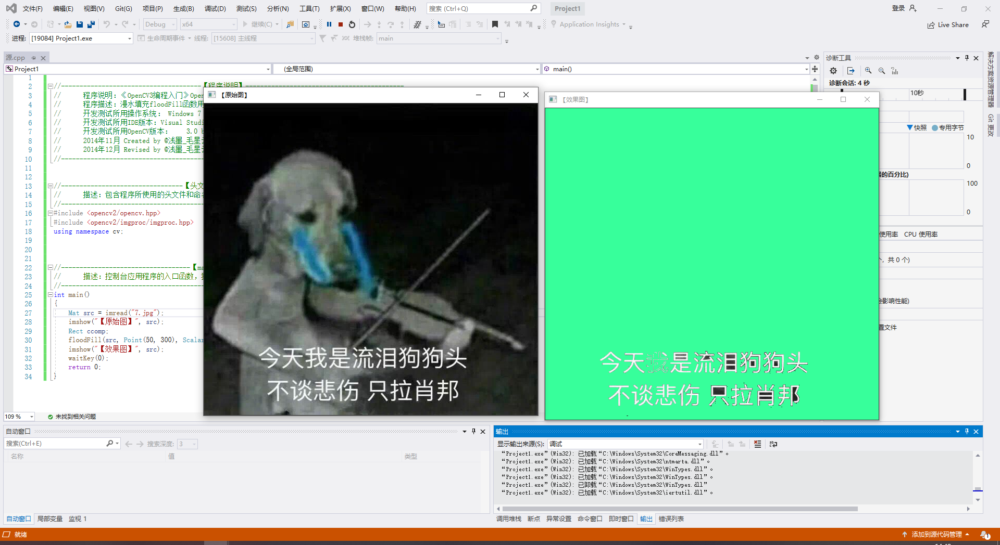

## 漫水填充综合 ##

$源代码$

```

//--------------------------------------【程序说明】-------------------------------------------
//		程序说明：《OpenCV3编程入门》OpenCV3版书本配套示例程序50
//		程序描述：漫水填充算法综合示例
//		开发测试所用操作系统： Windows 7 64bit
//		开发测试所用IDE版本：Visual Studio 2010
//		开发测试所用OpenCV版本：	3.0 beta
//		2014年11月 Created by @浅墨_毛星云
//		2014年12月 Revised by @浅墨_毛星云
//------------------------------------------------------------------------------------------------


//---------------------------------【头文件、命名空间包含部分】----------------------------
//		描述：包含程序所使用的头文件和命名空间
//------------------------------------------------------------------------------------------------
#include "opencv2/imgproc/imgproc.hpp"
#include "opencv2/highgui/highgui.hpp"
#include <iostream>
using namespace cv;
using namespace std;


//-----------------------------------【全局变量声明部分】--------------------------------------  
//      描述：全局变量声明  
//-----------------------------------------------------------------------------------------------  
Mat g_srcImage, g_dstImage, g_grayImage, g_maskImage;//定义原始图、目标图、灰度图、掩模图
int g_nFillMode = 1;//漫水填充的模式
int g_nLowDifference = 20, g_nUpDifference = 20;//负差最大值、正差最大值
int g_nConnectivity = 4;//表示floodFill函数标识符低八位的连通值
int g_bIsColor = true;//是否为彩色图的标识符布尔值
bool g_bUseMask = false;//是否显示掩膜窗口的布尔值
int g_nNewMaskVal = 255;//新的重新绘制的像素值


//-----------------------------------【ShowHelpText( )函数】----------------------------------  
//      描述：输出一些帮助信息  
//----------------------------------------------------------------------------------------------  
static void ShowHelpText()  
{  
	//输出欢迎信息和OpenCV版本
	printf("\n\n\t\t\t非常感谢购买《OpenCV3编程入门》一书！\n");
	printf("\n\n\t\t\t此为本书OpenCV3版的第50个配套示例程序\n");
	printf("\n\n\t\t\t   当前使用的OpenCV版本为：" CV_VERSION );
	printf("\n\n  ----------------------------------------------------------------------------\n");

	//输出一些帮助信息  
	printf("\n\n\t欢迎来到漫水填充示例程序~");  
	printf("\n\n\t本示例根据鼠标选取的点搜索图像中与之颜色相近的点，并用不同颜色标注。");  
	
	printf( "\n\n\t按键操作说明: \n\n"  
		"\t\t鼠标点击图中区域- 进行漫水填充操作\n"  
		"\t\t键盘按键【ESC】- 退出程序\n"  
		"\t\t键盘按键【1】-  切换彩色图/灰度图模式\n"  
		"\t\t键盘按键【2】- 显示/隐藏掩膜窗口\n"  
		"\t\t键盘按键【3】- 恢复原始图像\n"  
		"\t\t键盘按键【4】- 使用空范围的漫水填充\n"  
		"\t\t键盘按键【5】- 使用渐变、固定范围的漫水填充\n"  
		"\t\t键盘按键【6】- 使用渐变、浮动范围的漫水填充\n"  
		"\t\t键盘按键【7】- 操作标志符的低八位使用4位的连接模式\n"  
		"\t\t键盘按键【8】- 操作标志符的低八位使用8位的连接模式\n\n" 	);  
}  


//-----------------------------------【onMouse( )函数】--------------------------------------  
//      描述：鼠标消息onMouse回调函数
//---------------------------------------------------------------------------------------------
static void onMouse( int event, int x, int y, int, void* )
{
	// 若鼠标左键没有按下，便返回
	//此句代码的OpenCV2版为：
	//if( event != CV_EVENT_LBUTTONDOWN )
	//此句代码的OpenCV3版为：
	if( event != EVENT_LBUTTONDOWN )
		return;

	//-------------------【<1>调用floodFill函数之前的参数准备部分】---------------
	Point seed = Point(x,y);
	int LowDifference = g_nFillMode == 0 ? 0 : g_nLowDifference;//空范围的漫水填充，此值设为0，否则设为全局的g_nLowDifference
	int UpDifference = g_nFillMode == 0 ? 0 : g_nUpDifference;//空范围的漫水填充，此值设为0，否则设为全局的g_nUpDifference

	//标识符的0~7位为g_nConnectivity，8~15位为g_nNewMaskVal左移8位的值，16~23位为CV_FLOODFILL_FIXED_RANGE或者0。
	//此句代码的OpenCV2版为：
	//int flags = g_nConnectivity + (g_nNewMaskVal << 8) +(g_nFillMode == 1 ? CV_FLOODFILL_FIXED_RANGE : 0);
	//此句代码的OpenCV3版为：
	int flags = g_nConnectivity + (g_nNewMaskVal << 8) +(g_nFillMode == 1 ? FLOODFILL_FIXED_RANGE : 0);

	//随机生成bgr值
	int b = (unsigned)theRNG() & 255;//随机返回一个0~255之间的值
	int g = (unsigned)theRNG() & 255;//随机返回一个0~255之间的值
	int r = (unsigned)theRNG() & 255;//随机返回一个0~255之间的值
	Rect ccomp;//定义重绘区域的最小边界矩形区域

	Scalar newVal = g_bIsColor ? Scalar(b, g, r) : Scalar(r*0.299 + g*0.587 + b*0.114);//在重绘区域像素的新值，若是彩色图模式，取Scalar(b, g, r)；若是灰度图模式，取Scalar(r*0.299 + g*0.587 + b*0.114)

	Mat dst = g_bIsColor ? g_dstImage : g_grayImage;//目标图的赋值
	int area;

	//--------------------【<2>正式调用floodFill函数】-----------------------------
	if( g_bUseMask )
	{
		//此句代码的OpenCV2版为：
		//threshold(g_maskImage, g_maskImage, 1, 128, CV_THRESH_BINARY);
		//此句代码的OpenCV3版为：
		threshold(g_maskImage, g_maskImage, 1, 128, THRESH_BINARY);
		area = floodFill(dst, g_maskImage, seed, newVal, &ccomp, Scalar(LowDifference, LowDifference, LowDifference),
			Scalar(UpDifference, UpDifference, UpDifference), flags);
		imshow( "mask", g_maskImage );
	}
	else
	{
		area = floodFill(dst, seed, newVal, &ccomp, Scalar(LowDifference, LowDifference, LowDifference),
			Scalar(UpDifference, UpDifference, UpDifference), flags);
	}

	imshow("效果图", dst);
	cout << area << " 个像素被重绘\n";
}


//-----------------------------------【main( )函数】--------------------------------------------  
//      描述：控制台应用程序的入口函数，我们的程序从这里开始  
//-----------------------------------------------------------------------------------------------  
int main( int argc, char** argv )
{
	//改变console字体颜色  
	system("color 2F");    

	//载入原图
	g_srcImage = imread("1.jpg", 1);

	if( !g_srcImage.data ) { printf("读取图片image0错误~！ \n"); return false; }  

	//显示帮助文字
	ShowHelpText();

	g_srcImage.copyTo(g_dstImage);//拷贝源图到目标图
	cvtColor(g_srcImage, g_grayImage, COLOR_BGR2GRAY);//转换三通道的image0到灰度图
	g_maskImage.create(g_srcImage.rows+2, g_srcImage.cols+2, CV_8UC1);//利用image0的尺寸来初始化掩膜mask

	//此句代码的OpenCV2版为：
	//namedWindow( "效果图",CV_WINDOW_AUTOSIZE );
	//此句代码的OpenCV2版为：
	namedWindow( "效果图",WINDOW_AUTOSIZE );


	//创建Trackbar
	createTrackbar( "负差最大值", "效果图", &g_nLowDifference, 255, 0 );
	createTrackbar( "正差最大值" ,"效果图", &g_nUpDifference, 255, 0 );

	//鼠标回调函数
	setMouseCallback( "效果图", onMouse, 0 );

	//循环轮询按键
	while(1)
	{
		//先显示效果图
		imshow("效果图", g_bIsColor ? g_dstImage : g_grayImage);

		//获取键盘按键
		int c = waitKey(0);
		//判断ESC是否按下，若按下便退出
		if( (c & 255) == 27 )
		{
			cout << "程序退出...........\n";
			break;
		}

		//根据按键的不同，进行各种操作
		switch( (char)c )
		{
			//如果键盘“1”被按下，效果图在在灰度图，彩色图之间互换
		case '1':
			if( g_bIsColor )//若原来为彩色，转为灰度图，并且将掩膜mask所有元素设置为0
			{
				cout << "键盘“1”被按下，切换彩色/灰度模式，当前操作为将【彩色模式】切换为【灰度模式】\n";
				cvtColor(g_srcImage, g_grayImage, COLOR_BGR2GRAY);
				g_maskImage = Scalar::all(0);	//将mask所有元素设置为0
				g_bIsColor = false;	//将标识符置为false，表示当前图像不为彩色，而是灰度
			}
			else//若原来为灰度图，便将原来的彩图image0再次拷贝给image，并且将掩膜mask所有元素设置为0
			{
				cout << "键盘“1”被按下，切换彩色/灰度模式，当前操作为将【彩色模式】切换为【灰度模式】\n";
				g_srcImage.copyTo(g_dstImage);
				g_maskImage = Scalar::all(0);
				g_bIsColor = true;//将标识符置为true，表示当前图像模式为彩色
			}
			break;
			//如果键盘按键“2”被按下，显示/隐藏掩膜窗口
		case '2':
			if( g_bUseMask )
			{
				destroyWindow( "mask" );
				g_bUseMask = false;
			}
			else
			{
				namedWindow( "mask", 0 );
				g_maskImage = Scalar::all(0);
				imshow("mask", g_maskImage);
				g_bUseMask = true;
			}
			break;
			//如果键盘按键“3”被按下，恢复原始图像
		case '3':
			cout << "按键“3”被按下，恢复原始图像\n";
			g_srcImage.copyTo(g_dstImage);
			cvtColor(g_dstImage, g_grayImage, COLOR_BGR2GRAY);
			g_maskImage = Scalar::all(0);
			break;
			//如果键盘按键“4”被按下，使用空范围的漫水填充
		case '4':
			cout << "按键“4”被按下，使用空范围的漫水填充\n";
			g_nFillMode = 0;
			break;
			//如果键盘按键“5”被按下，使用渐变、固定范围的漫水填充
		case '5':
			cout << "按键“5”被按下，使用渐变、固定范围的漫水填充\n";
			g_nFillMode = 1;
			break;
			//如果键盘按键“6”被按下，使用渐变、浮动范围的漫水填充
		case '6':
			cout << "按键“6”被按下，使用渐变、浮动范围的漫水填充\n";
			g_nFillMode = 2;
			break;
			//如果键盘按键“7”被按下，操作标志符的低八位使用4位的连接模式
		case '7':
			cout << "按键“7”被按下，操作标志符的低八位使用4位的连接模式\n";
			g_nConnectivity = 4;
			break;
			//如果键盘按键“8”被按下，操作标志符的低八位使用8位的连接模式
		case '8':
			cout << "按键“8”被按下，操作标志符的低八位使用8位的连接模式\n";
			g_nConnectivity = 8;
			break;
		}
	}

	return 0;
}
```

$运行结果$

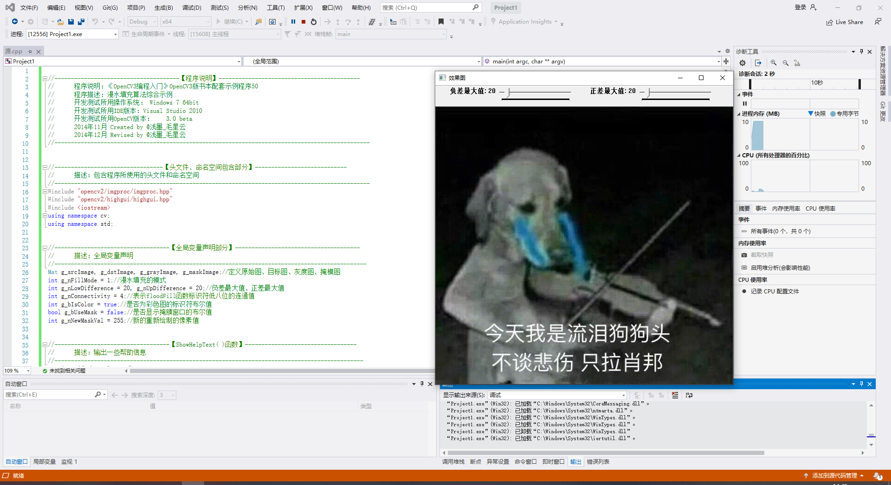


# 6.6 图像金字塔与图片尺寸缩放 #

## 图像金字塔 ##

图像金字塔是图像中多尺度表达的一种，主要用于图像分割，是一种以多分辨率来解释图像的有效但概念简单的结构。

## 高斯金字塔 ##

高斯金字塔是通过高斯平滑和亚采样获得一些列下采样图像。也就是说第K层高斯金字塔通过平滑、亚采样就能获得K+1层高斯图像。

$源代码$

```
//--------------------------------------【程序说明】-------------------------------------------
//		程序说明：《OpenCV3编程入门》OpenCV3版书本配套示例程序51
//		程序描述：resize函数用法示例
//		开发测试所用操作系统： Windows 7 64bit
//		开发测试所用IDE版本：Visual Studio 2010
//		开发测试所用OpenCV版本：	3.0 beta
//		2014年11月 Created by @浅墨_毛星云
//		2014年12月 Revised by @浅墨_毛星云
//------------------------------------------------------------------------------------------------


//---------------------------------【头文件、命名空间包含部分】----------------------------
//		描述：包含程序所使用的头文件和命名空间
//------------------------------------------------------------------------------------------------
#include <opencv2/opencv.hpp>
#include <opencv2/imgproc/imgproc.hpp>
using namespace cv;

//-----------------------------------【main( )函数】--------------------------------------------
//		描述：控制台应用程序的入口函数，我们的程序从这里开始
//-----------------------------------------------------------------------------------------------
int main( )
{
	//载入原始图   
	Mat srcImage = imread("1.jpg");  //工程目录下应该有一张名为1.jpg的素材图
	Mat tmpImage,dstImage1,dstImage2;//临时变量和目标图的定义
	tmpImage=srcImage;//将原始图赋给临时变量

	//显示原始图  
	imshow("【原始图】", srcImage);  

	//进行尺寸调整操作
	resize(tmpImage,dstImage1,Size( tmpImage.cols/2, tmpImage.rows/2 ),(0,0),(0,0),3);
	resize(tmpImage,dstImage2,Size( tmpImage.cols*2, tmpImage.rows*2 ),(0,0),(0,0),3);

	//显示效果图  
	imshow("【效果图】之一", dstImage1);  
	imshow("【效果图】之二", dstImage2);  

	waitKey(0);  
	return 0;  
}

```

$运行结果$

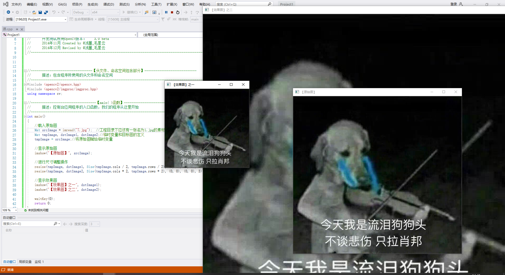


## 图像金字塔相关API函数 ##

### pyrUp ###

$源代码$
```
//--------------------------------------【程序说明】-------------------------------------------
//		程序说明：《OpenCV3编程入门》OpenCV3版书本配套示例程序52
//		程序描述：pyrUp函数用法示例
//		开发测试所用操作系统： Windows 7 64bit
//		开发测试所用IDE版本：Visual Studio 2010
//		开发测试所用OpenCV版本：	3.0 beta
//		2014年11月 Created by @浅墨_毛星云
//		2014年12月 Revised by @浅墨_毛星云
//------------------------------------------------------------------------------------------------


//---------------------------------【头文件、命名空间包含部分】----------------------------
//		描述：包含程序所使用的头文件和命名空间
//------------------------------------------------------------------------------------------------
#include <opencv2/opencv.hpp>
#include <opencv2/imgproc/imgproc.hpp>
using namespace cv;


//-----------------------------------【main( )函数】------------------------------------------
//		描述：控制台应用程序的入口函数，我们的程序从这里开始
//-----------------------------------------------------------------------------------------------
int main( )
{
	//载入原始图   
	Mat srcImage = imread("1.jpg");  //工程目录下应该有一张名为1.jpg的素材图
	Mat tmpImage,dstImage;//临时变量和目标图的定义
	tmpImage=srcImage;//将原始图赋给临时变量

	//显示原始图  
	imshow("【原始图】", srcImage);  
	//进行向上取样操作
	pyrUp( tmpImage, dstImage, Size( tmpImage.cols*2, tmpImage.rows*2 ) );
	//显示效果图  
	imshow("【效果图】", dstImage);  

	waitKey(0);  

	return 0;  
}

```

$运行结果$

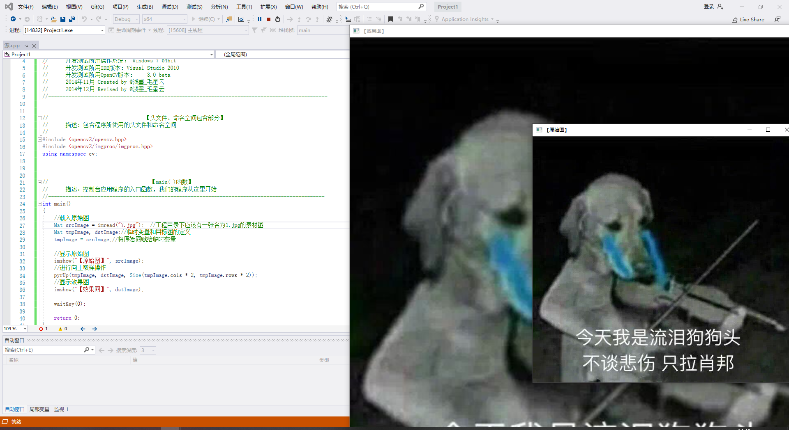

### pyrDown ###

$源代码$

```

//--------------------------------------【程序说明】-------------------------------------------
//		程序说明：《OpenCV3编程入门》OpenCV3版书本配套示例程序53
//		程序描述：pyrDown函数用法示例
//		开发测试所用操作系统： Windows 7 64bit
//		开发测试所用IDE版本：Visual Studio 2010
//		开发测试所用OpenCV版本：	3.0 beta
//		2014年11月 Created by @浅墨_毛星云
//		2014年12月 Revised by @浅墨_毛星云
//------------------------------------------------------------------------------------------------


//---------------------------------【头文件、命名空间包含部分】----------------------------
//		描述：包含程序所使用的头文件和命名空间
//------------------------------------------------------------------------------------------------
#include <opencv2/opencv.hpp>
#include <opencv2/imgproc/imgproc.hpp>
using namespace cv;

//-----------------------------------【main( )函数】-----------------------------------------
//		描述：控制台应用程序的入口函数，我们的程序从这里开始
//-----------------------------------------------------------------------------------------------
int main( )
{
	//载入原始图   
	Mat srcImage = imread("1.jpg");  //工程目录下应该有一张名为1.jpg的素材图
	Mat tmpImage,dstImage;//临时变量和目标图的定义
	tmpImage=srcImage;//将原始图赋给临时变量

	//显示原始图  
	imshow("【原始图】", srcImage);  
	//进行向下取样操作
	pyrDown( tmpImage, dstImage, Size( tmpImage.cols/2, tmpImage.rows/2 ) );
	//显示效果图  
	imshow("【效果图】", dstImage);  

	waitKey(0);  

	return 0;  
}

```

$运行结果$

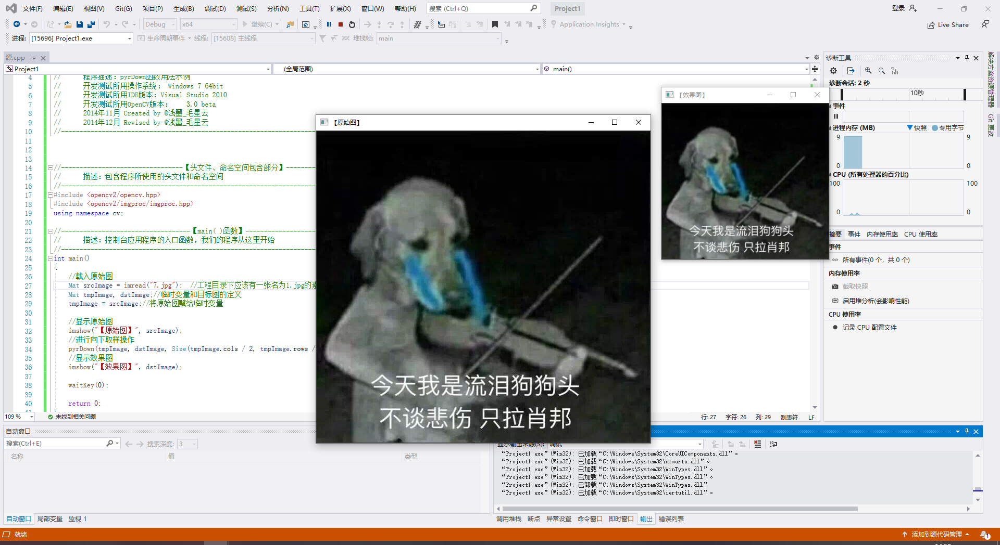

## 图像金字塔和resize综合示例 ##

$源代码$

```

//--------------------------------------【程序说明】-------------------------------------------
//		程序说明：《OpenCV3编程入门》OpenCV3版书本配套示例程序54
//		程序描述：图像金字塔和resize综合示例
//		开发测试所用操作系统： Windows 7 64bit
//		开发测试所用IDE版本：Visual Studio 2010
//		开发测试所用OpenCV版本：	3.0 beta
//		2014年11月 Created by @浅墨_毛星云
//		2014年12月 Revised by @浅墨_毛星云
//------------------------------------------------------------------------------------------------


//---------------------------------【头文件、命名空间包含部分】----------------------------
//		描述：包含程序所使用的头文件和命名空间
//------------------------------------------------------------------------------------------------
#include <opencv2/opencv.hpp>
#include <opencv2/highgui/highgui.hpp>
#include <opencv2/imgproc/imgproc.hpp>
using namespace std;
using namespace cv;


//-----------------------------------【宏定义部分】--------------------------------------------
//	描述：定义一些辅助宏
//------------------------------------------------------------------------------------------------
#define WINDOW_NAME "【程序窗口】"		//为窗口标题定义的宏


//-----------------------------------【全局变量声明部分】--------------------------------------
//		描述：全局变量声明
//-----------------------------------------------------------------------------------------------
Mat g_srcImage, g_dstImage, g_tmpImage;


//-----------------------------------【全局函数声明部分】--------------------------------------
//		描述：全局函数声明
//-----------------------------------------------------------------------------------------------
static void ShowHelpText();

//-----------------------------------【main( )函数】--------------------------------------------
//		描述：控制台应用程序的入口函数，我们的程序从这里开始
//-----------------------------------------------------------------------------------------------
int main( )
{
	//改变console字体颜色
	system("color 2F");  

	//显示帮助文字
	ShowHelpText();

	//载入原图
	g_srcImage = imread("1.jpg");//工程目录下需要有一张名为1.jpg的测试图像，且其尺寸需被2的N次方整除，N为可以缩放的次数
	if( !g_srcImage.data ) { printf("Oh，no，读取srcImage错误~！ \n"); return false; }

	// 创建显示窗口
	namedWindow( WINDOW_NAME, WINDOW_AUTOSIZE );
	imshow(WINDOW_NAME, g_srcImage);

	//参数赋值
	g_tmpImage = g_srcImage;
	g_dstImage = g_tmpImage;

	int key =0;

	//轮询获取按键信息
	while(1)
	{
		key=waitKey(9) ;//读取键值到key变量中

		//根据key变量的值，进行不同的操作
		switch(key)
		{
			//======================【程序退出相关键值处理】=======================  
		case 27://按键ESC
			return 0;
			break; 

		case 'q'://按键Q
			return 0;
			break; 

			//======================【图片放大相关键值处理】=======================  
		case 'a'://按键A按下，调用pyrUp函数
			pyrUp( g_tmpImage, g_dstImage, Size( g_tmpImage.cols*2, g_tmpImage.rows*2 ) );
			printf( ">检测到按键【A】被按下，开始进行基于【pyrUp】函数的图片放大：图片尺寸×2 \n" );		
			break; 

		case 'w'://按键W按下，调用resize函数
			resize(g_tmpImage,g_dstImage,Size( g_tmpImage.cols*2, g_tmpImage.rows*2 ));
			printf( ">检测到按键【W】被按下，开始进行基于【resize】函数的图片放大：图片尺寸×2 \n" );		
			break; 

		case '1'://按键1按下，调用resize函数
			resize(g_tmpImage,g_dstImage,Size( g_tmpImage.cols*2, g_tmpImage.rows*2 ));
			printf( ">检测到按键【1】被按下，开始进行基于【resize】函数的图片放大：图片尺寸×2 \n" );
			break; 

		case '3': //按键3按下，调用pyrUp函数
			pyrUp( g_tmpImage, g_dstImage, Size( g_tmpImage.cols*2, g_tmpImage.rows*2 ));
			printf( ">检测到按键【3】被按下，开始进行基于【pyrUp】函数的图片放大：图片尺寸×2 \n" );
			break; 
			//======================【图片缩小相关键值处理】=======================  
		case 'd': //按键D按下，调用pyrDown函数
			pyrDown( g_tmpImage, g_dstImage, Size( g_tmpImage.cols/2, g_tmpImage.rows/2 ));
			printf( ">检测到按键【D】被按下，开始进行基于【pyrDown】函数的图片缩小：图片尺寸/2\n" );
			break; 

		case  's' : //按键S按下，调用resize函数
			resize(g_tmpImage,g_dstImage,Size( g_tmpImage.cols/2, g_tmpImage.rows/2 ));
			printf( ">检测到按键【S】被按下，开始进行基于【resize】函数的图片缩小：图片尺寸/2\n" );
			break; 

		case '2'://按键2按下，调用resize函数
			resize(g_tmpImage,g_dstImage,Size( g_tmpImage.cols/2, g_tmpImage.rows/2 ));
			printf( ">检测到按键【2】被按下，开始进行基于【resize】函数的图片缩小：图片尺寸/2\n" );
			break; 

		case '4': //按键4按下，调用pyrDown函数
			pyrDown( g_tmpImage, g_dstImage, Size( g_tmpImage.cols/2, g_tmpImage.rows/2 ) );
			printf( ">检测到按键【4】被按下，开始进行基于【pyrDown】函数的图片缩小：图片尺寸/2\n" );
			break; 
		}

		//经过操作后，显示变化后的图
		imshow( WINDOW_NAME, g_dstImage );

		//将g_dstImage赋给g_tmpImage，方便下一次循环
		g_tmpImage = g_dstImage;
	}

	return 0;
}

//-----------------------------------【ShowHelpText( )函数】----------------------------------
//		描述：输出一些帮助信息
//----------------------------------------------------------------------------------------------
static void ShowHelpText()
{

	//输出欢迎信息和OpenCV版本
	printf("\n\n\t\t\t非常感谢购买《OpenCV3编程入门》一书！\n");
	printf("\n\n\t\t\t此为本书OpenCV3版的第54个配套示例程序\n");
	printf("\n\n\t\t\t   当前使用的OpenCV版本为：" CV_VERSION );
	printf("\n\n  ----------------------------------------------------------------------------\n");

	//输出一些帮助信息
	printf("\n\t欢迎来到OpenCV图像金字塔和resize示例程序~\n\n");
	printf( "\n\n\t按键操作说明: \n\n"
		"\t\t键盘按键【ESC】或者【Q】- 退出程序\n"
		"\t\t键盘按键【1】或者【W】- 进行基于【resize】函数的图片放大\n"
		"\t\t键盘按键【2】或者【S】- 进行基于【resize】函数的图片缩小\n"
		"\t\t键盘按键【3】或者【A】- 进行基于【pyrUp】函数的图片放大\n"
		"\t\t键盘按键【4】或者【D】- 进行基于【pyrDown】函数的图片缩小\n"
		);
}
```

$运行结果$

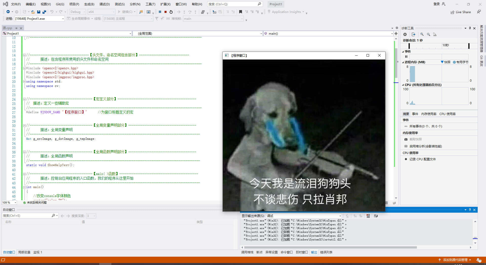

# 6.7 阈值化 #

在对各种图形进行处理操作的过程中，我们常常需要对图像中的像素做出取舍与决策，直接剔除一些低于或高于一定值的像素。阈值可以被视为最简单的图像分割法。

$源代码$

```

//--------------------------------------【程序说明】-------------------------------------------
//		程序说明：《OpenCV3编程入门》OpenCV3版书本配套示例程序55
//		程序描述：OpenCV基本阈值操作
//		开发测试所用操作系统： Windows 7 64bit
//		开发测试所用IDE版本：Visual Studio 2010
//		开发测试所用OpenCV版本：	3.0 beta
//		2014年11月 Created by @浅墨_毛星云
//		2014年12月 Revised by @浅墨_毛星云
//------------------------------------------------------------------------------------------------


//---------------------------------【头文件、命名空间包含部分】----------------------------
//		描述：包含程序所使用的头文件和命名空间
//------------------------------------------------------------------------------------------------
#include "opencv2/imgproc/imgproc.hpp"
#include "opencv2/highgui/highgui.hpp"
#include <iostream>
using namespace cv;
using namespace std;

//-----------------------------------【宏定义部分】-------------------------------------------- 
//		描述：定义一些辅助宏 
//------------------------------------------------------------------------------------------------ 
#define WINDOW_NAME "【程序窗口】"        //为窗口标题定义的宏 


//-----------------------------------【全局变量声明部分】--------------------------------------
//		描述：全局变量的声明
//-----------------------------------------------------------------------------------------------
int g_nThresholdValue = 100;
int g_nThresholdType = 3;
Mat g_srcImage, g_grayImage, g_dstImage;

//-----------------------------------【全局函数声明部分】--------------------------------------
//		描述：全局函数的声明
//-----------------------------------------------------------------------------------------------
static void ShowHelpText( );//输出帮助文字
void on_Threshold( int, void* );//回调函数


//-----------------------------------【main( )函数】--------------------------------------------
//		描述：控制台应用程序的入口函数，我们的程序从这里开始执行
//-----------------------------------------------------------------------------------------------
int main( )
{
	//【0】改变console字体颜色
	system("color 1F"); 

	//【0】显示欢迎和帮助文字
	ShowHelpText( );

	//【1】读入源图片
	g_srcImage = imread("1.jpg");
	if(!g_srcImage.data ) { printf("读取图片错误，请确定目录下是否有imread函数指定的图片存在~！ \n"); return false; }  
	imshow("原始图",g_srcImage);

	//【2】存留一份原图的灰度图
	cvtColor( g_srcImage, g_grayImage, COLOR_RGB2GRAY );

	//【3】创建窗口并显示原始图
	namedWindow( WINDOW_NAME, WINDOW_AUTOSIZE );

	//【4】创建滑动条来控制阈值
	createTrackbar( "模式",
		WINDOW_NAME, &g_nThresholdType,
		4, on_Threshold );

	createTrackbar( "参数值",
		WINDOW_NAME, &g_nThresholdValue,
		255, on_Threshold );

	//【5】初始化自定义的阈值回调函数
	on_Threshold( 0, 0 );

	// 【6】轮询等待用户按键，如果ESC键按下则退出程序
	while(1)
	{
		int key;
		key = waitKey( 20 );
		if( (char)key == 27 ){ break; }
	}

}

//-----------------------------------【on_Threshold( )函数】------------------------------------
//		描述：自定义的阈值回调函数
//-----------------------------------------------------------------------------------------------
void on_Threshold( int, void* )
{
	//调用阈值函数
	threshold(g_grayImage,g_dstImage,g_nThresholdValue,255,g_nThresholdType);

	//更新效果图
	imshow( WINDOW_NAME, g_dstImage );
}

//-----------------------------------【ShowHelpText( )函数】----------------------------------  
//      描述：输出一些帮助信息  
//----------------------------------------------------------------------------------------------  
static void ShowHelpText()  
{  
	//输出欢迎信息和OpenCV版本
	printf("\n\n\t\t\t非常感谢购买《OpenCV3编程入门》一书！\n");
	printf("\n\n\t\t\t此为本书OpenCV3版的第55个配套示例程序\n");
	printf("\n\n\t\t\t   当前使用的OpenCV版本为：" CV_VERSION );
	printf("\n\n  ----------------------------------------------------------------------------\n");

	//输出一些帮助信息  
	printf(	"\n\t欢迎来到【基本阈值操作】示例程序~\n\n");  
	printf(	"\n\t按键操作说明: \n\n"  
		"\t\t键盘按键【ESC】- 退出程序\n"  
		"\t\t滚动条模式0- 二进制阈值\n"  
		"\t\t滚动条模式1- 反二进制阈值\n"  
		"\t\t滚动条模式2- 截断阈值\n"  
		"\t\t滚动条模式3- 反阈值化为0\n"  
		"\t\t滚动条模式4- 阈值化为0\n"  );  
}  

```

$运行结果$

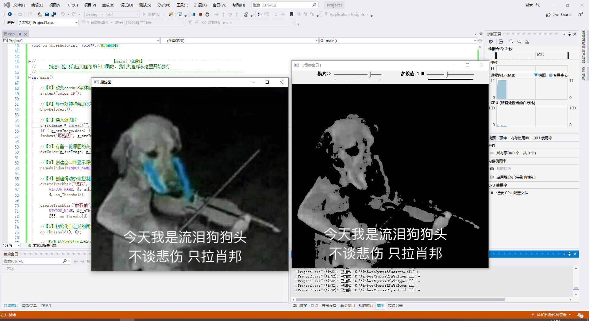


# 7.1 基于OpenCV 的边缘检测 #

## canny函数 ##

canny边缘检测算子的目标是找到一个最优的边缘检测算法。其主要评价标准包括：低错误率、高定位性、最小响应。

$源代码$

```

//--------------------------------------【程序说明】-------------------------------------------
//		程序说明：《OpenCV3编程入门》OpenCV3版书本配套示例程序56
//		程序描述：canny函数用法示例
//		开发测试所用操作系统： Windows 7 64bit
//		开发测试所用IDE版本：Visual Studio 2010
//		开发测试所用OpenCV版本：	3.0 beta
//		2014年11月 Created by @浅墨_毛星云
//		2014年12月 Revised by @浅墨_毛星云
//------------------------------------------------------------------------------------------------


//---------------------------------【头文件、命名空间包含部分】----------------------------
//		描述：包含程序所使用的头文件和命名空间
//------------------------------------------------------------------------------------------------
#include <opencv2/opencv.hpp>
#include<opencv2/highgui/highgui.hpp>
#include<opencv2/imgproc/imgproc.hpp>
using namespace cv;


//-----------------------------------【main( )函数】-------------------------------------------
//            描述：控制台应用程序的入口函数，我们的程序从这里开始
//-----------------------------------------------------------------------------------------------
int main( )
{
	//载入原始图  
	Mat srcImage = imread("1.jpg");  //工程目录下应该有一张名为1.jpg的素材图
	Mat srcImage1=srcImage.clone();

	//显示原始图 
	imshow("【原始图】Canny边缘检测", srcImage); 

	//----------------------------------------------------------------------------------
	//	一、最简单的canny用法，拿到原图后直接用。
	//	注意：此方法在OpenCV2中可用，在OpenCV3中已失效
	//----------------------------------------------------------------------------------
 	//Canny( srcImage, srcImage, 150, 100,3 );
	//imshow("【效果图】Canny边缘检测", srcImage); 


	//----------------------------------------------------------------------------------
	//	二、高阶的canny用法，转成灰度图，降噪，用canny，最后将得到的边缘作为掩码，拷贝原图到效果图上，得到彩色的边缘图
	//----------------------------------------------------------------------------------
	Mat dstImage,edge,grayImage;

	// 【1】创建与src同类型和大小的矩阵(dst)
	dstImage.create( srcImage1.size(), srcImage1.type() );

	// 【2】将原图像转换为灰度图像
	cvtColor( srcImage1, grayImage, COLOR_BGR2GRAY );

	// 【3】先用使用 3x3内核来降噪
	blur( grayImage, edge, Size(3,3) );

	// 【4】运行Canny算子
	Canny( edge, edge, 3, 9,3 );

	//【5】将g_dstImage内的所有元素设置为0 
	dstImage = Scalar::all(0);

	//【6】使用Canny算子输出的边缘图g_cannyDetectedEdges作为掩码，来将原图g_srcImage拷到目标图g_dstImage中
	srcImage1.copyTo( dstImage, edge);

	//【7】显示效果图 
	imshow("【效果图】Canny边缘检测2", dstImage); 


	waitKey(0); 

	return 0; 
}
```

$运行结果$

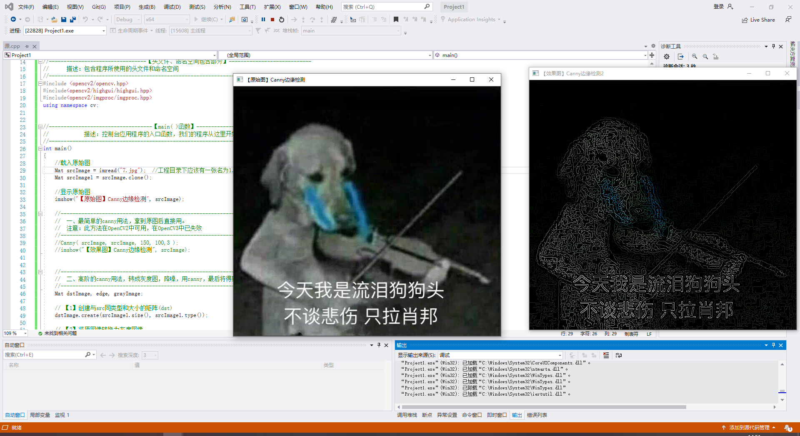

## sobel算子 ##

Sobel算子是一个主要用于边缘检测的离散微分算子，它结合了高斯平滑和微分求导，用来计算图像灰度函数的近似梯度。

$源代码$

```

//--------------------------------------【程序说明】-------------------------------------------
//		程序说明：《OpenCV3编程入门》OpenCV2版书本配套示例程序57
//		程序描述：sobel函数用法示例
//		开发测试所用操作系统： Windows 7 64bit
//		开发测试所用IDE版本：Visual Studio 2010
//		开发测试所用OpenCV版本：	3.0 beta
//		2014年11月 Created by @浅墨_毛星云
//		2014年12月 Revised by @浅墨_毛星云
//------------------------------------------------------------------------------------------------


//---------------------------------【头文件、命名空间包含部分】----------------------------
//		描述：包含程序所使用的头文件和命名空间
//------------------------------------------------------------------------------------------------


//-----------------------------------【头文件包含部分】---------------------------------------
//            描述：包含程序所依赖的头文件
//----------------------------------------------------------------------------------------------
#include <opencv2/opencv.hpp>
#include<opencv2/highgui/highgui.hpp>
#include<opencv2/imgproc/imgproc.hpp>

//-----------------------------------【命名空间声明部分】---------------------------------------
//            描述：包含程序所使用的命名空间
//-----------------------------------------------------------------------------------------------
using namespace cv;
//-----------------------------------【main( )函数】--------------------------------------------
//            描述：控制台应用程序的入口函数，我们的程序从这里开始
//-----------------------------------------------------------------------------------------------
int main( )
{
	//【0】创建 grad_x 和 grad_y 矩阵
	Mat grad_x, grad_y;
	Mat abs_grad_x, abs_grad_y,dst;

	//【1】载入原始图  
	Mat src = imread("1.jpg");  //工程目录下应该有一张名为1.jpg的素材图

	//【2】显示原始图 
	imshow("【原始图】sobel边缘检测", src); 

	//【3】求 X方向梯度
	Sobel( src, grad_x, CV_16S, 1, 0, 3, 1, 1, BORDER_DEFAULT );
	convertScaleAbs( grad_x, abs_grad_x );
	imshow("【效果图】 X方向Sobel", abs_grad_x); 

	//【4】求Y方向梯度
	Sobel( src, grad_y, CV_16S, 0, 1, 3, 1, 1, BORDER_DEFAULT );
	convertScaleAbs( grad_y, abs_grad_y );
	imshow("【效果图】Y方向Sobel", abs_grad_y); 

	//【5】合并梯度(近似)
	addWeighted( abs_grad_x, 0.5, abs_grad_y, 0.5, 0, dst );
	imshow("【效果图】整体方向Sobel", dst); 

	waitKey(0); 
	return 0; 
}
```

$运行结果$

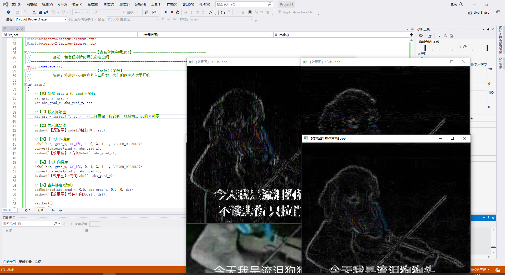

## Laplacian算子 ##

Laplacian算子是n维欧几里德空间中的一个二阶微分算子，定义为梯度grad的三度div。

$源代码$

```

//--------------------------------------【程序说明】-------------------------------------------
//		程序说明：《OpenCV3编程入门》OpenCV3版书本配套示例程序58
//		程序描述：Laplacian函数用法示例
//		开发测试所用操作系统： Windows 7 64bit
//		开发测试所用IDE版本：Visual Studio 2010
//		开发测试所用OpenCV版本：	3.0 beta
//		2014年11月 Created by @浅墨_毛星云
//		2014年12月 Revised by @浅墨_毛星云
//------------------------------------------------------------------------------------------------


//---------------------------------【头文件、命名空间包含部分】----------------------------
//		描述：包含程序所使用的头文件和命名空间
//------------------------------------------------------------------------------------------------
#include <opencv2/opencv.hpp>
#include<opencv2/highgui/highgui.hpp>
#include<opencv2/imgproc/imgproc.hpp>
using namespace cv;


//-----------------------------------【main( )函数】--------------------------------------------
//            描述：控制台应用程序的入口函数，我们的程序从这里开始
//-----------------------------------------------------------------------------------------------
int main( )
{
	//【0】变量的定义
	Mat src,src_gray,dst, abs_dst;

	//【1】载入原始图  
	src = imread("1.jpg");  //工程目录下应该有一张名为1.jpg的素材图

	//【2】显示原始图 
	imshow("【原始图】图像Laplace变换", src); 

	//【3】使用高斯滤波消除噪声
	GaussianBlur( src, src, Size(3,3), 0, 0, BORDER_DEFAULT );

	//【4】转换为灰度图
	cvtColor( src, src_gray, COLOR_RGB2GRAY );

	//【5】使用Laplace函数
	Laplacian( src_gray, dst, CV_16S, 3, 1, 0, BORDER_DEFAULT );

	//【6】计算绝对值，并将结果转换成8位
	convertScaleAbs( dst, abs_dst );

	//【7】显示效果图
	imshow( "【效果图】图像Laplace变换", abs_dst );

	waitKey(0); 

	return 0; 
}
```

$运行结果$

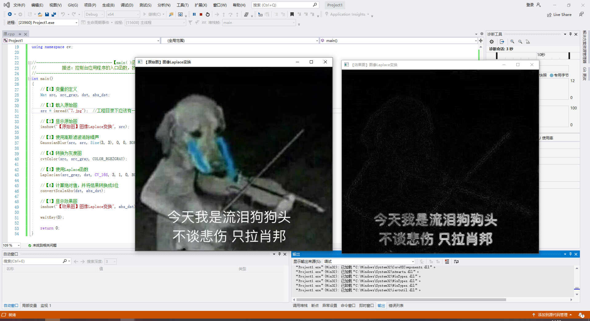

## scharr滤波器 ##

scharr滤波器主要用于配合Sobel算子的运算而存在。

$源代码$

```

//--------------------------------------【程序说明】-------------------------------------------
//		程序说明：《OpenCV3编程入门》OpenCV3版书本配套示例程序59
//		程序描述：Scharr函数用法示例
//		开发测试所用操作系统： Windows 7 64bit
//		开发测试所用IDE版本：Visual Studio 2010
//		开发测试所用OpenCV版本：	3.0 beta
//		2014年11月 Created by @浅墨_毛星云
//		2014年12月 Revised by @浅墨_毛星云
//------------------------------------------------------------------------------------------------


//---------------------------------【头文件、命名空间包含部分】----------------------------
//		描述：包含程序所使用的头文件和命名空间
//------------------------------------------------------------------------------------------------
#include <opencv2/opencv.hpp>
#include<opencv2/highgui/highgui.hpp>
#include<opencv2/imgproc/imgproc.hpp>
using namespace cv;


//-----------------------------------【main( )函数】--------------------------------------------
//            描述：控制台应用程序的入口函数，我们的程序从这里开始
//-----------------------------------------------------------------------------------------------
int main( )
{
	//【0】创建 grad_x 和 grad_y 矩阵
	Mat grad_x, grad_y;
	Mat abs_grad_x, abs_grad_y,dst;

	//【1】载入原始图  
	Mat src = imread("1.jpg");  //工程目录下应该有一张名为1.jpg的素材图

	//【2】显示原始图 
	imshow("【原始图】Scharr滤波器", src); 

	//【3】求 X方向梯度
	Scharr( src, grad_x, CV_16S, 1, 0, 1, 0, BORDER_DEFAULT );
	convertScaleAbs( grad_x, abs_grad_x );
	imshow("【效果图】 X方向Scharr", abs_grad_x); 

	//【4】求Y方向梯度
	Scharr( src, grad_y, CV_16S, 0, 1, 1, 0, BORDER_DEFAULT );
	convertScaleAbs( grad_y, abs_grad_y );
	imshow("【效果图】Y方向Scharr", abs_grad_y); 

	//【5】合并梯度(近似)
	addWeighted( abs_grad_x, 0.5, abs_grad_y, 0.5, 0, dst );

	//【6】显示效果图
	imshow("【效果图】合并梯度后Scharr", dst); 

	waitKey(0); 
	return 0; 
}
```

$运行结果$

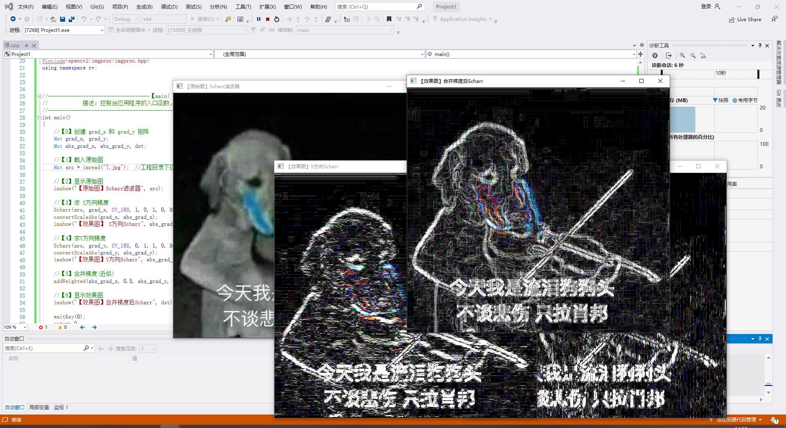


## 边缘检测综合实例 ##

$源代码$

```

//--------------------------------------【程序说明】-------------------------------------------
//		程序说明：《OpenCV3编程入门》OpenCV3版书本配套示例程序60
//		程序描述：边缘检测综合示例——Canny算子,Sobel算子,Laplace算子,Scharr滤波器合辑
//		开发测试所用操作系统： Windows 7 64bit
//		开发测试所用IDE版本：Visual Studio 2010
//		开发测试所用OpenCV版本：	3.0 beta
//		2014年11月 Created by @浅墨_毛星云
//		2014年12月 Revised by @浅墨_毛星云
//------------------------------------------------------------------------------------------------


//---------------------------------【头文件、命名空间包含部分】----------------------------
//		描述：包含程序所使用的头文件和命名空间
//------------------------------------------------------------------------------------------------
#include <opencv2/highgui/highgui.hpp>
#include <opencv2/imgproc/imgproc.hpp>
using namespace cv;


//-----------------------------------【全局变量声明部分】--------------------------------------
//		描述：全局变量声明
//-----------------------------------------------------------------------------------------------
//原图，原图的灰度版，目标图
Mat g_srcImage, g_srcGrayImage,g_dstImage;

//Canny边缘检测相关变量
Mat g_cannyDetectedEdges;
int g_cannyLowThreshold=1;//TrackBar位置参数  

//Sobel边缘检测相关变量
Mat g_sobelGradient_X, g_sobelGradient_Y;
Mat g_sobelAbsGradient_X, g_sobelAbsGradient_Y;
int g_sobelKernelSize=1;//TrackBar位置参数  

//Scharr滤波器相关变量
Mat g_scharrGradient_X, g_scharrGradient_Y;
Mat g_scharrAbsGradient_X, g_scharrAbsGradient_Y;


//-----------------------------------【全局函数声明部分】--------------------------------------
//		描述：全局函数声明
//-----------------------------------------------------------------------------------------------
static void ShowHelpText( );
static void on_Canny(int, void*);//Canny边缘检测窗口滚动条的回调函数
static void on_Sobel(int, void*);//Sobel边缘检测窗口滚动条的回调函数
void Scharr( );//封装了Scharr边缘检测相关代码的函数


//-----------------------------------【main( )函数】--------------------------------------------
//		描述：控制台应用程序的入口函数，我们的程序从这里开始
//-----------------------------------------------------------------------------------------------
int main( int argc, char** argv )
{
	//改变console字体颜色
	system("color 2F");  

	//显示欢迎语
	ShowHelpText();

	//载入原图
	g_srcImage = imread("1.jpg");
	if( !g_srcImage.data ) { printf("Oh，no，读取srcImage错误~！ \n"); return false; }

	//显示原始图
	namedWindow("【原始图】");
	imshow("【原始图】", g_srcImage);

	// 创建与src同类型和大小的矩阵(dst)
	g_dstImage.create( g_srcImage.size(), g_srcImage.type() );

	// 将原图像转换为灰度图像
	cvtColor( g_srcImage, g_srcGrayImage, COLOR_BGR2GRAY );

	// 创建显示窗口
	namedWindow( "【效果图】Canny边缘检测", WINDOW_AUTOSIZE );
	namedWindow( "【效果图】Sobel边缘检测", WINDOW_AUTOSIZE );

	// 创建trackbar
	createTrackbar( "参数值：", "【效果图】Canny边缘检测", &g_cannyLowThreshold, 120, on_Canny );
	createTrackbar( "参数值：", "【效果图】Sobel边缘检测", &g_sobelKernelSize, 3, on_Sobel );

	// 调用回调函数
	on_Canny(0, 0);
	on_Sobel(0, 0);

	//调用封装了Scharr边缘检测代码的函数
	Scharr( );

	//轮询获取按键信息，若按下Q，程序退出
	while((char(waitKey(1)) != 'q')) {}

	return 0;
}


//-----------------------------------【ShowHelpText( )函数】----------------------------------
//		描述：输出一些帮助信息
//----------------------------------------------------------------------------------------------
static void ShowHelpText()
{
	//输出欢迎信息和OpenCV版本
	printf("\n\n\t\t\t非常感谢购买《OpenCV3编程入门》一书！\n");
	printf("\n\n\t\t\t此为本书OpenCV3版的第60个配套示例程序\n");
	printf("\n\n\t\t\t   当前使用的OpenCV版本为：" CV_VERSION );
	printf("\n\n  ----------------------------------------------------------------------------\n");

	//输出一些帮助信息
	printf( "\n\n\t运行成功，请调整滚动条观察图像效果~\n\n"
		"\t按下“q”键时，程序退出。\n");
}


//-----------------------------------【on_Canny( )函数】----------------------------------
//		描述：Canny边缘检测窗口滚动条的回调函数
//-----------------------------------------------------------------------------------------------
void on_Canny(int, void*)
{
	// 先使用 3x3内核来降噪
	blur( g_srcGrayImage, g_cannyDetectedEdges, Size(3,3) );

	// 运行我们的Canny算子
	Canny( g_cannyDetectedEdges, g_cannyDetectedEdges, g_cannyLowThreshold, g_cannyLowThreshold*3, 3 );

	//先将g_dstImage内的所有元素设置为0 
	g_dstImage = Scalar::all(0);

	//使用Canny算子输出的边缘图g_cannyDetectedEdges作为掩码，来将原图g_srcImage拷到目标图g_dstImage中
	g_srcImage.copyTo( g_dstImage, g_cannyDetectedEdges);

	//显示效果图
	imshow( "【效果图】Canny边缘检测", g_dstImage );
}


//-----------------------------------【on_Sobel( )函数】----------------------------------
//		描述：Sobel边缘检测窗口滚动条的回调函数
//-----------------------------------------------------------------------------------------
void on_Sobel(int, void*)
{
	// 求 X方向梯度
	Sobel( g_srcImage, g_sobelGradient_X, CV_16S, 1, 0, (2*g_sobelKernelSize+1), 1, 1, BORDER_DEFAULT );
	convertScaleAbs( g_sobelGradient_X, g_sobelAbsGradient_X );//计算绝对值，并将结果转换成8位

	// 求Y方向梯度
	Sobel( g_srcImage, g_sobelGradient_Y, CV_16S, 0, 1, (2*g_sobelKernelSize+1), 1, 1, BORDER_DEFAULT );
	convertScaleAbs( g_sobelGradient_Y, g_sobelAbsGradient_Y );//计算绝对值，并将结果转换成8位

	// 合并梯度
	addWeighted( g_sobelAbsGradient_X, 0.5, g_sobelAbsGradient_Y, 0.5, 0, g_dstImage );

	//显示效果图
	imshow("【效果图】Sobel边缘检测", g_dstImage); 

}


//-----------------------------------【Scharr( )函数】----------------------------------
//		描述：封装了Scharr边缘检测相关代码的函数
//-----------------------------------------------------------------------------------------
void Scharr( )
{
	// 求 X方向梯度
	Scharr( g_srcImage, g_scharrGradient_X, CV_16S, 1, 0, 1, 0, BORDER_DEFAULT );
	convertScaleAbs( g_scharrGradient_X, g_scharrAbsGradient_X );//计算绝对值，并将结果转换成8位

	// 求Y方向梯度
	Scharr( g_srcImage, g_scharrGradient_Y, CV_16S, 0, 1, 1, 0, BORDER_DEFAULT );
	convertScaleAbs( g_scharrGradient_Y, g_scharrAbsGradient_Y );//计算绝对值，并将结果转换成8位

	// 合并梯度
	addWeighted( g_scharrAbsGradient_X, 0.5, g_scharrAbsGradient_Y, 0.5, 0, g_dstImage );

	//显示效果图
	imshow("【效果图】Scharr滤波器", g_dstImage); 
}

```

$运行结果$

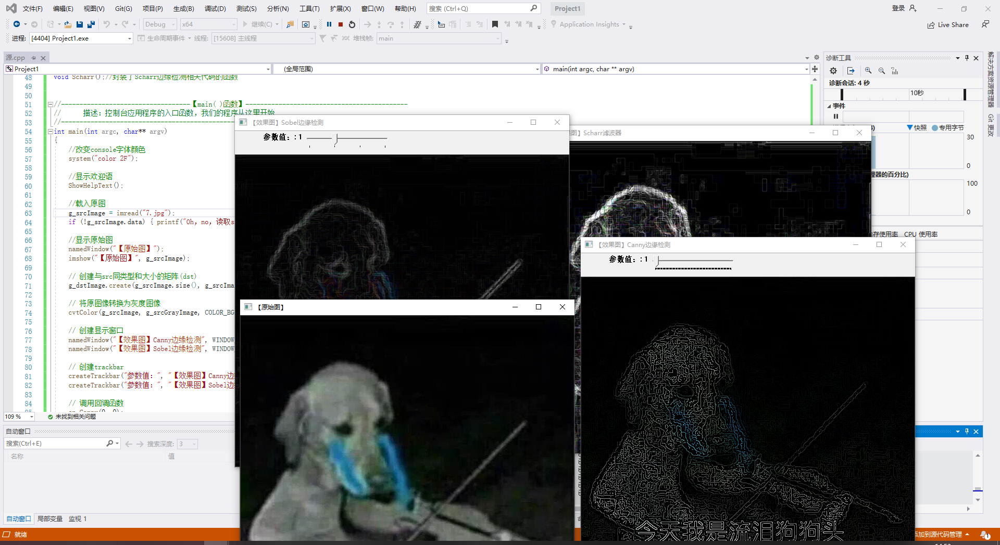

# 霍夫变换 #

最基本的霍夫变换是从黑白图像中检测直线（线段）。

## 标准霍夫变换 HoughLines()函数 ##

HoughLines()函数可以找出采用标准霍夫变换的二值图像线条。

$源代码$
```
//--------------------------------------【程序说明】-------------------------------------------
//		程序说明：《OpenCV3编程入门》OpenCV3版书本配套示例程序61
//		程序描述：HoughLines函数用法示例
//		开发测试所用操作系统： Windows 7 64bit
//		开发测试所用IDE版本：Visual Studio 2010
//		开发测试所用OpenCV版本：	3.0 beta
//		2014年11月 Created by @浅墨_毛星云
//		2014年12月 Revised by @浅墨_毛星云
//------------------------------------------------------------------------------------------------


//---------------------------------【头文件、命名空间包含部分】----------------------------
//		描述：包含程序所使用的头文件和命名空间
//------------------------------------------------------------------------------------------------
#include <opencv2/opencv.hpp>
#include <opencv2/imgproc/imgproc.hpp>
using namespace cv;
using namespace std;


//-----------------------------------【main( )函数】--------------------------------------------
//		描述：控制台应用程序的入口函数，我们的程序从这里开始
//-----------------------------------------------------------------------------------------------
int main( )
{
	//【1】载入原始图和Mat变量定义   
	Mat srcImage = imread("1.jpg");  //工程目录下应该有一张名为1.jpg的素材图
	Mat midImage,dstImage;//临时变量和目标图的定义

	//【2】进行边缘检测和转化为灰度图
	Canny(srcImage, midImage, 50, 200, 3);//进行一此canny边缘检测
	cvtColor(midImage,dstImage, COLOR_GRAY2BGR);//转化边缘检测后的图为灰度图

	//【3】进行霍夫线变换
	vector<Vec2f> lines;//定义一个矢量结构lines用于存放得到的线段矢量集合
	HoughLines(midImage, lines, 1, CV_PI/180, 150, 0, 0 );

	//【4】依次在图中绘制出每条线段
	for( size_t i = 0; i < lines.size(); i++ )
	{
		float rho = lines[i][0], theta = lines[i][1];
		Point pt1, pt2;
		double a = cos(theta), b = sin(theta);
		double x0 = a*rho, y0 = b*rho;
		pt1.x = cvRound(x0 + 1000*(-b));
		pt1.y = cvRound(y0 + 1000*(a));
		pt2.x = cvRound(x0 - 1000*(-b));
		pt2.y = cvRound(y0 - 1000*(a));
		//此句代码的OpenCV2版为:
		//line( dstImage, pt1, pt2, Scalar(55,100,195), 1, CV_AA);
		//此句代码的OpenCV3版为:
		line( dstImage, pt1, pt2, Scalar(55,100,195), 1, LINE_AA);
	}

	//【5】显示原始图  
	imshow("【原始图】", srcImage);  

	//【6】边缘检测后的图 
	imshow("【边缘检测后的图】", midImage);  

	//【7】显示效果图  
	imshow("【效果图】", dstImage);  

	waitKey(0);  

	return 0;  
}

```

$运行结果$

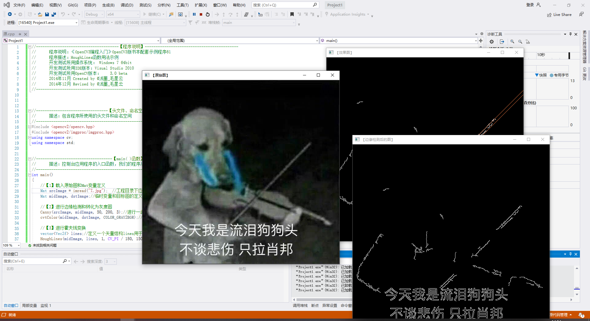

## 累计概率霍夫变换 HoughLinesP()函数 ##

HoughLinesP()函数可以采用累计概率霍夫变换找出二值图像中的直线。

$源代码$

```

//--------------------------------------【程序说明】-------------------------------------------
//		程序说明：《OpenCV3编程入门》OpenCV3版书本配套示例程序62
//		程序描述：HoughLinesP函数用法示例
//		开发测试所用操作系统： Windows 7 64bit
//		开发测试所用IDE版本：Visual Studio 2010
//		开发测试所用OpenCV版本：	3.0 beta
//		2014年11月 Created by @浅墨_毛星云
//		2014年12月 Revised by @浅墨_毛星云
//------------------------------------------------------------------------------------------------


//---------------------------------【头文件、命名空间包含部分】----------------------------
//		描述：包含程序所使用的头文件和命名空间
//------------------------------------------------------------------------------------------------
#include <opencv2/opencv.hpp>
#include <opencv2/imgproc/imgproc.hpp>
using namespace cv;
using namespace std;


//-----------------------------------【main( )函数】--------------------------------------------
//		描述：控制台应用程序的入口函数，我们的程序从这里开始
//-------------------------------------------------------------------------------------------------
int main( )
{
	//【1】载入原始图和Mat变量定义   
	Mat srcImage = imread("1.jpg");  //工程目录下应该有一张名为1.jpg的素材图
	Mat midImage,dstImage;//临时变量和目标图的定义

	//【2】进行边缘检测和转化为灰度图
	Canny(srcImage, midImage, 50, 200, 3);//进行一此canny边缘检测
	cvtColor(midImage,dstImage, COLOR_GRAY2BGR);//转化边缘检测后的图为灰度图

	//【3】进行霍夫线变换
	vector<Vec4i> lines;//定义一个矢量结构lines用于存放得到的线段矢量集合
	HoughLinesP(midImage, lines, 1, CV_PI/180, 80, 50, 10 );

	//【4】依次在图中绘制出每条线段
	for( size_t i = 0; i < lines.size(); i++ )
	{
		Vec4i l = lines[i];
		//此句代码的OpenCV2版为：
		//line( dstImage, Point(l[0], l[1]), Point(l[2], l[3]), Scalar(186,88,255), 1, CV_AA);
		//此句代码的OpenCV3版为：
		line( dstImage, Point(l[0], l[1]), Point(l[2], l[3]), Scalar(186,88,255), 1, LINE_AA);
	}

	//【5】显示原始图  
	imshow("【原始图】", srcImage);  

	//【6】边缘检测后的图 
	imshow("【边缘检测后的图】", midImage);  

	//【7】显示效果图  
	imshow("【效果图】", dstImage);  

	waitKey(0);  

	return 0;  
}

```

$运行结果$

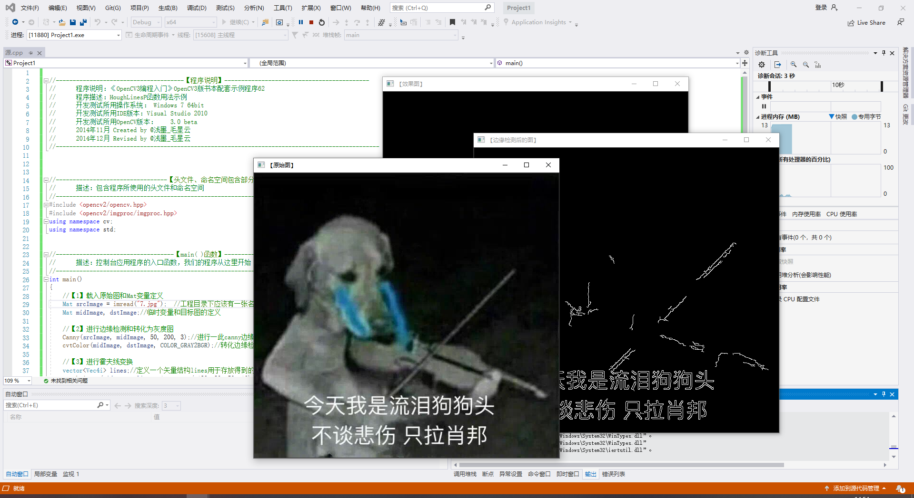


## 霍夫圆变换 ##

$源代码$

```
//--------------------------------------【程序说明】-------------------------------------------
//		程序说明：《OpenCV3编程入门》OpenCV2版书本配套示例程序63
//		程序描述：HoughCircles函数用法示例
//		开发测试所用操作系统： Windows 7 64bit
//		开发测试所用IDE版本：Visual Studio 2010
//		开发测试所用OpenCV版本：	2.4.9
//		2014年06月 Created by @浅墨_毛星云
//		2014年11月 Revised by @浅墨_毛星云
//------------------------------------------------------------------------------------------------


//---------------------------------【头文件、命名空间包含部分】-------------------------------
//          描述：包含程序所使用的头文件和命名空间
//----------------------------------------------------------------------------------------------
#include <opencv2/opencv.hpp>
#include <opencv2/imgproc/imgproc.hpp>
using namespace cv;
using namespace std;

//-----------------------------------【main( )函数】--------------------------------------------
//		描述：控制台应用程序的入口函数，我们的程序从这里开始
//-----------------------------------------------------------------------------------------------
int main( )
{
	//【1】载入原始图、Mat变量定义   
	Mat srcImage = imread("1.jpg");  //工程目录下应该有一张名为1.jpg的素材图
	Mat midImage,dstImage;//临时变量和目标图的定义

	//【2】显示原始图
	imshow("【原始图】", srcImage);  

	//【3】转为灰度图并进行图像平滑
	cvtColor(srcImage,midImage, COLOR_BGR2GRAY);//转化边缘检测后的图为灰度图
	GaussianBlur( midImage, midImage, Size(9, 9), 2, 2 );

	//【4】进行霍夫圆变换
	vector<Vec3f> circles;
	HoughCircles( midImage, circles, HOUGH_GRADIENT,1.5, 10, 200, 100, 0, 0 );

	//【5】依次在图中绘制出圆
	for( size_t i = 0; i < circles.size(); i++ )
	{
		//参数定义
		Point center(cvRound(circles[i][0]), cvRound(circles[i][1]));
		int radius = cvRound(circles[i][2]);
		//绘制圆心
		circle( srcImage, center, 3, Scalar(0,255,0), -1, 8, 0 );
		//绘制圆轮廓
		circle( srcImage, center, radius, Scalar(155,50,255), 3, 8, 0 );
	}

	//【6】显示效果图  
	imshow("【效果图】", srcImage);  

	waitKey(0);  

	return 0;  
}

```

$运行结果$

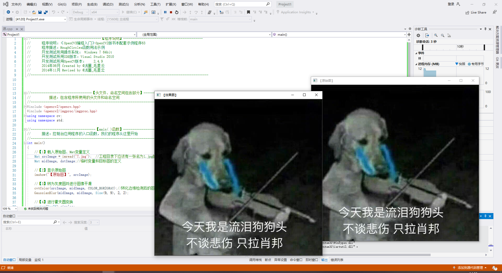

## 霍夫线变换综合实例 ##

$源代码$

```
//--------------------------------------【程序说明】-------------------------------------------
//		程序说明：《OpenCV3编程入门》OpenCV3版书本配套示例程序64
//		程序描述：霍夫线变换综合示例
//		开发测试所用操作系统： Windows 7 64bit
//		开发测试所用IDE版本：Visual Studio 2010
//		开发测试所用OpenCV版本：	3.0 beta
//		2014年11月 Created by @浅墨_毛星云
//		2014年12月 Revised by @浅墨_毛星云
//------------------------------------------------------------------------------------------------


//---------------------------------【头文件、命名空间包含部分】----------------------------
//		描述：包含程序所使用的头文件和命名空间
//------------------------------------------------------------------------------------------------
#include <opencv2/opencv.hpp>
#include <opencv2/highgui/highgui.hpp>
#include <opencv2/imgproc/imgproc.hpp>
using namespace std;
using namespace cv;


//-----------------------------------【全局变量声明部分】--------------------------------------
//		描述：全局变量声明
//-----------------------------------------------------------------------------------------------
Mat g_srcImage, g_dstImage,g_midImage;//原始图、中间图和效果图
vector<Vec4i> g_lines;//定义一个矢量结构g_lines用于存放得到的线段矢量集合
//变量接收的TrackBar位置参数
int g_nthreshold=100;

//-----------------------------------【全局函数声明部分】--------------------------------------
//		描述：全局函数声明
//-----------------------------------------------------------------------------------------------

static void on_HoughLines(int, void*);//回调函数
static void ShowHelpText();


//-----------------------------------【main( )函数】--------------------------------------------
//		描述：控制台应用程序的入口函数，我们的程序从这里开始
//-----------------------------------------------------------------------------------------------
int main( )
{
	//改变console字体颜色
	system("color 4F");  

	ShowHelpText();

	//载入原始图和Mat变量定义   
	Mat g_srcImage = imread("1.jpg");  //工程目录下应该有一张名为1.jpg的素材图

	//显示原始图  
	imshow("【原始图】", g_srcImage);  

	//创建滚动条
	namedWindow("【效果图】",1);
	createTrackbar("值", "【效果图】",&g_nthreshold,200,on_HoughLines);

	//进行边缘检测和转化为灰度图
	Canny(g_srcImage, g_midImage, 50, 200, 3);//进行一次canny边缘检测
	cvtColor(g_midImage,g_dstImage, COLOR_GRAY2BGR);//转化边缘检测后的图为灰度图

	//调用一次回调函数，调用一次HoughLinesP函数
	on_HoughLines(g_nthreshold,0);
	HoughLinesP(g_midImage, g_lines, 1, CV_PI/180, 80, 50, 10 );

	//显示效果图  
	imshow("【效果图】", g_dstImage);  


	waitKey(0);  

	return 0;  

}


//-----------------------------------【on_HoughLines( )函数】--------------------------------
//		描述：【顶帽运算/黑帽运算】窗口的回调函数
//----------------------------------------------------------------------------------------------
static void on_HoughLines(int, void*)
{
	//定义局部变量储存全局变量
	Mat dstImage=g_dstImage.clone();
	Mat midImage=g_midImage.clone();

	//调用HoughLinesP函数
	vector<Vec4i> mylines;
	HoughLinesP(midImage, mylines, 1, CV_PI/180, g_nthreshold+1, 50, 10 );

	//循环遍历绘制每一条线段
	for( size_t i = 0; i < mylines.size(); i++ )
	{
		Vec4i l = mylines[i];
		line( dstImage, Point(l[0], l[1]), Point(l[2], l[3]), Scalar(23,180,55), 1, LINE_AA);
	}
	//显示图像
	imshow("【效果图】",dstImage);
}

//-----------------------------------【ShowHelpText( )函数】----------------------------------
//		描述：输出一些帮助信息
//----------------------------------------------------------------------------------------------
static void ShowHelpText()
{
	//输出欢迎信息和OpenCV版本
	printf("\n\n\t\t\t非常感谢购买《OpenCV3编程入门》一书！\n");
	printf("\n\n\t\t\t此为本书OpenCV3版的第64个配套示例程序\n");
	printf("\n\n\t\t\t   当前使用的OpenCV版本为：" CV_VERSION );
	printf("\n\n  ----------------------------------------------------------------------------\n");

	//输出一些帮助信息
	printf("\n\n\n\t请调整滚动条观察图像效果~\n\n");


}
```

$运行结果$

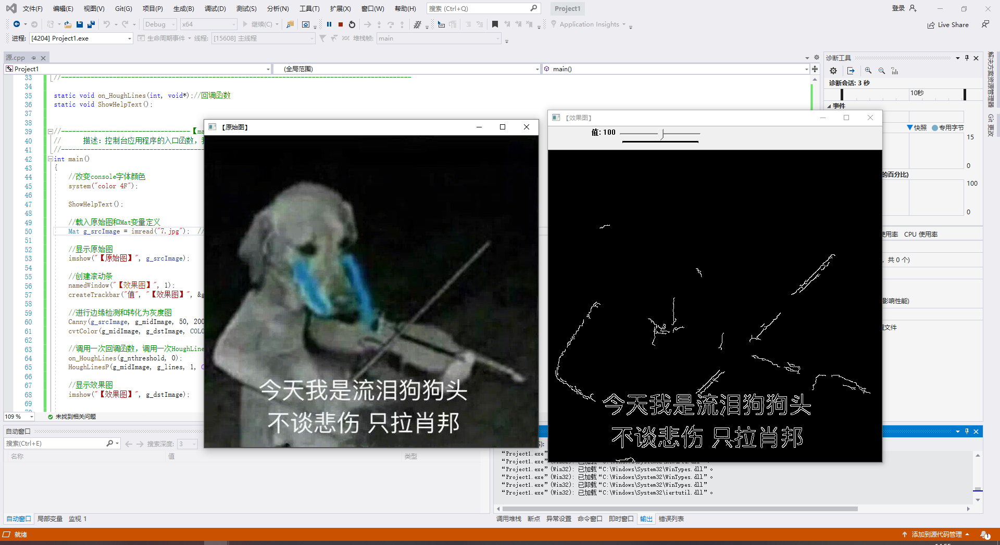


# 7.3 重映射 #

重映射就是把一幅图像中某位置的像素方知道另一个图片指定位置的过程。

$源代码$

```
//--------------------------------------【程序说明】-------------------------------------------
//		程序说明：《OpenCV3编程入门》OpenCV3版书本配套示例程序65
//		程序描述：remap函数用法示例
//		开发测试所用操作系统： Windows 7 64bit
//		开发测试所用IDE版本：Visual Studio 2010
//		开发测试所用OpenCV版本：	3.0 beta
//		2014年11月 Created by @浅墨_毛星云
//		2014年12月 Revised by @浅墨_毛星云
//------------------------------------------------------------------------------------------------


//---------------------------------【头文件、命名空间包含部分】----------------------------
//		描述：包含程序所使用的头文件和命名空间
//------------------------------------------------------------------------------------------------
#include "opencv2/highgui/highgui.hpp"
#include "opencv2/imgproc/imgproc.hpp"
#include <iostream>
using namespace cv;


//-----------------------------------【main( )函数】--------------------------------------------
//          描述：控制台应用程序的入口函数，我们的程序从这里开始执行
//-----------------------------------------------------------------------------------------------
int main(  )
{
	//【0】变量定义
	Mat srcImage, dstImage;
	Mat map_x, map_y;

	//【1】载入原始图
	srcImage = imread( "1.jpg", 1 );
	if(!srcImage.data ) { printf("读取图片错误，请确定目录下是否有imread函数指定的图片存在~！ \n"); return false; }  
	imshow("原始图",srcImage);

	//【2】创建和原始图一样的效果图，x重映射图，y重映射图
	dstImage.create( srcImage.size(), srcImage.type() );
	map_x.create( srcImage.size(), CV_32FC1 );
	map_y.create( srcImage.size(), CV_32FC1 );

	//【3】双层循环，遍历每一个像素点，改变map_x & map_y的值
	for( int j = 0; j < srcImage.rows;j++)
	{ 
		for( int i = 0; i < srcImage.cols;i++)
		{
			//改变map_x & map_y的值. 
			map_x.at<float>(j,i) = static_cast<float>(i);
			map_y.at<float>(j,i) = static_cast<float>(srcImage.rows - j);
		} 
	}

	//【4】进行重映射操作
	//此句代码的OpenCV2版为：
	//remap( srcImage, dstImage, map_x, map_y, CV_INTER_LINEAR, BORDER_CONSTANT, Scalar(0,0, 0) );
	//此句代码的OpenCV3版为：
	remap( srcImage, dstImage, map_x, map_y, INTER_LINEAR, BORDER_CONSTANT, Scalar(0,0, 0) );

	//【5】显示效果图
	imshow( "【程序窗口】", dstImage );
	waitKey();

	return 0;
}


```

$运行结果$

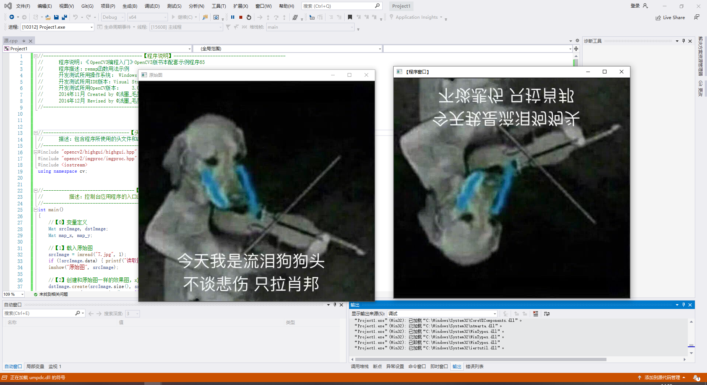

## 多重映射实例 ##

$源代码$

```
//--------------------------------------【程序说明】-------------------------------------------
//		程序说明：《OpenCV3编程入门》OpenCV3版书本配套示例程序66
//		程序描述：实现多种重映射综合示例
//		开发测试所用操作系统： Windows 7 64bit
//		开发测试所用IDE版本：Visual Studio 2010
//		开发测试所用OpenCV版本：	3.0 beta
//		2014年11月 Created by @浅墨_毛星云
//		2014年12月 Revised by @浅墨_毛星云
//------------------------------------------------------------------------------------------------


//---------------------------------【头文件、命名空间包含部分】----------------------------
//		描述：包含程序所使用的头文件和命名空间
//------------------------------------------------------------------------------------------------
#include "opencv2/highgui/highgui.hpp"
#include "opencv2/imgproc/imgproc.hpp"
#include <iostream>
using namespace cv;
using namespace std;


//-----------------------------------【宏定义部分】-------------------------------------------- 
//  描述：定义一些辅助宏 
//------------------------------------------------------------------------------------------------ 
#define WINDOW_NAME "【程序窗口】"        //为窗口标题定义的宏 


//-----------------------------------【全局变量声明部分】--------------------------------------
//          描述：全局变量的声明
//-----------------------------------------------------------------------------------------------
Mat g_srcImage, g_dstImage;
Mat g_map_x, g_map_y;


//-----------------------------------【全局函数声明部分】--------------------------------------
//          描述：全局函数的声明
//-----------------------------------------------------------------------------------------------
int update_map( int key);
static void ShowHelpText( );//输出帮助文字

//-----------------------------------【main( )函数】--------------------------------------------
//          描述：控制台应用程序的入口函数，我们的程序从这里开始执行
//-----------------------------------------------------------------------------------------------
int main( int argc, char** argv )
{
	//改变console字体颜色
	system("color 5F"); 

	//显示帮助文字
	ShowHelpText();

	//【1】载入原始图
	g_srcImage = imread( "1.jpg", 1 );
	if(!g_srcImage.data ) { printf("读取图片错误，请确定目录下是否有imread函数指定的图片存在~！ \n"); return false; }  
	imshow("原始图",g_srcImage);

	//【2】创建和原始图一样的效果图，x重映射图，y重映射图
	g_dstImage.create( g_srcImage.size(), g_srcImage.type() );
	g_map_x.create( g_srcImage.size(), CV_32FC1 );
	g_map_y.create( g_srcImage.size(), CV_32FC1 );

	//【3】创建窗口并显示
	namedWindow( WINDOW_NAME, WINDOW_AUTOSIZE );
	imshow(WINDOW_NAME,g_srcImage);

	//【4】轮询按键，更新map_x和map_y的值，进行重映射操作并显示效果图
	while( 1 )
	{
		//获取键盘按键  
		int key = waitKey(0);  

		//判断ESC是否按下，若按下便退出  
		if( (key & 255) == 27 )  
		{  
			cout << "程序退出...........\n";  
			break;  
		}  

		//根据按下的键盘按键来更新 map_x & map_y的值. 然后调用remap( )进行重映射
		update_map(key);
		//此句代码的OpenCV2版为：
		//remap( g_srcImage, g_dstImage, g_map_x, g_map_y, CV_INTER_LINEAR, BORDER_CONSTANT, Scalar(0,0, 0) );
		//此句代码的OpenCV3版为：
		remap( g_srcImage, g_dstImage, g_map_x, g_map_y, INTER_LINEAR, BORDER_CONSTANT, Scalar(0,0, 0) );

		//显示效果图
		imshow( WINDOW_NAME, g_dstImage );
	}
	return 0;
}

//-----------------------------------【update_map( )函数】--------------------------------
//          描述：根据按键来更新map_x与map_x的值
//----------------------------------------------------------------------------------------------
int update_map( int key )
{
	//双层循环，遍历每一个像素点
	for( int j = 0; j < g_srcImage.rows;j++)
	{ 
		for( int i = 0; i < g_srcImage.cols;i++)
		{
			switch(key)
			{
			case '1': // 键盘【1】键按下，进行第一种重映射操作
				if( i > g_srcImage.cols*0.25 && i < g_srcImage.cols*0.75 && j > g_srcImage.rows*0.25 && j < g_srcImage.rows*0.75)
				{
					g_map_x.at<float>(j,i) = static_cast<float>(2*( i - g_srcImage.cols*0.25 ) + 0.5);
					g_map_y.at<float>(j,i) = static_cast<float>(2*( j - g_srcImage.rows*0.25 ) + 0.5);
				}
				else
				{ 
					g_map_x.at<float>(j,i) = 0;
					g_map_y.at<float>(j,i) = 0;
				}
				break;
			case '2':// 键盘【2】键按下，进行第二种重映射操作
				g_map_x.at<float>(j,i) = static_cast<float>(i);
				g_map_y.at<float>(j,i) = static_cast<float>(g_srcImage.rows - j);
				break;
			case '3':// 键盘【3】键按下，进行第三种重映射操作
				g_map_x.at<float>(j,i) = static_cast<float>(g_srcImage.cols - i);
				g_map_y.at<float>(j,i) = static_cast<float>(j);
				break;
			case '4':// 键盘【4】键按下，进行第四种重映射操作
				g_map_x.at<float>(j,i) = static_cast<float>(g_srcImage.cols - i);
				g_map_y.at<float>(j,i) = static_cast<float>(g_srcImage.rows - j);
				break;
			} 
		}
	}
	return 1;
}

//-----------------------------------【ShowHelpText( )函数】----------------------------------  
//      描述：输出一些帮助信息  
//----------------------------------------------------------------------------------------------  
static void ShowHelpText()  
{  
	//输出欢迎信息和OpenCV版本
	printf("\n\n\t\t\t非常感谢购买《OpenCV3编程入门》一书！\n");
	printf("\n\n\t\t\t此为本书OpenCV3版的第66个配套示例程序\n");
	printf("\n\n\t\t\t   当前使用的OpenCV版本为：" CV_VERSION );
	printf("\n\n  ----------------------------------------------------------------------------\n");
	//输出一些帮助信息  
	printf("\n\t欢迎来到重映射示例程序~\n\n");  
	printf( "\n\t按键操作说明: \n\n"  
		"\t\t键盘按键【ESC】- 退出程序\n"  
		"\t\t键盘按键【1】-  第一种映射方式\n"  
		"\t\t键盘按键【2】- 第二种映射方式\n"  
		"\t\t键盘按键【3】- 第三种映射方式\n"  
		"\t\t键盘按键【4】- 第四种映射方式\n" 	 );  
}  

```

$运行结果$

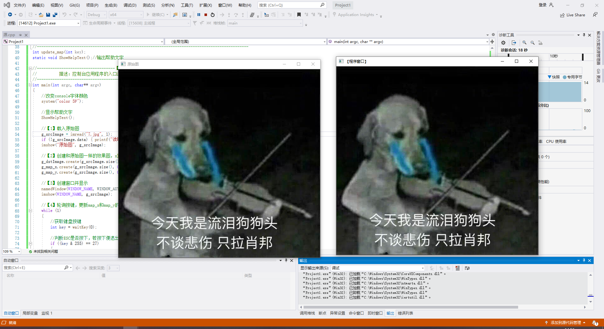


# 7.4 仿射变换 #

仿射变换是指几何中一个向量空间进行一次线性变换并接上一个平移，变换为另一个向量空间的过程。

$源代码$

```

//--------------------------------------【程序说明】-------------------------------------------
//		程序说明：《OpenCV3编程入门》OpenCV3版书本配套示例程序67
//		程序描述：仿射变换综合示例
//		开发测试所用操作系统： Windows 7 64bit
//		开发测试所用IDE版本：Visual Studio 2010
//		开发测试所用OpenCV版本：	3.0 beta
//		2014年11月 Created by @浅墨_毛星云
//		2014年12月 Revised by @浅墨_毛星云
//------------------------------------------------------------------------------------------------


//---------------------------------【头文件、命名空间包含部分】----------------------------
//		描述：包含程序所使用的头文件和命名空间
//------------------------------------------------------------------------------------------------
#include "opencv2/highgui/highgui.hpp"
#include "opencv2/imgproc/imgproc.hpp"
#include <iostream>
using namespace cv;
using namespace std;


//-----------------------------------【宏定义部分】-------------------------------------------- 
//		描述：定义一些辅助宏 
//------------------------------------------------------------------------------------------------ 
#define WINDOW_NAME1 "【原始图窗口】"					//为窗口标题定义的宏 
#define WINDOW_NAME2 "【经过Warp后的图像】"        //为窗口标题定义的宏 
#define WINDOW_NAME3 "【经过Warp和Rotate后的图像】"        //为窗口标题定义的宏 


//-----------------------------------【全局函数声明部分】--------------------------------------
//		描述：全局函数的声明
//-----------------------------------------------------------------------------------------------
static void ShowHelpText( );


//-----------------------------------【main( )函数】--------------------------------------------
//		描述：控制台应用程序的入口函数，我们的程序从这里开始执行
//-----------------------------------------------------------------------------------------------
int main(  )
{
	//【0】改变console字体颜色
	system("color 1F"); 

	//【0】显示欢迎和帮助文字
	ShowHelpText( );

	//【1】参数准备
	//定义两组点，代表两个三角形
	Point2f srcTriangle[3];
	Point2f dstTriangle[3];
	//定义一些Mat变量
	Mat rotMat( 2, 3, CV_32FC1 );
	Mat warpMat( 2, 3, CV_32FC1 );
	Mat srcImage, dstImage_warp, dstImage_warp_rotate;

	//【2】加载源图像并作一些初始化
	srcImage = imread( "1.jpg", 1 );
	if(!srcImage.data ) { printf("读取图片错误，请确定目录下是否有imread函数指定的图片存在~！ \n"); return false; } 
	// 设置目标图像的大小和类型与源图像一致
	dstImage_warp = Mat::zeros( srcImage.rows, srcImage.cols, srcImage.type() );

	//【3】设置源图像和目标图像上的三组点以计算仿射变换
	srcTriangle[0] = Point2f( 0,0 );
	srcTriangle[1] = Point2f( static_cast<float>(srcImage.cols - 1), 0 );
	srcTriangle[2] = Point2f( 0, static_cast<float>(srcImage.rows - 1 ));

	dstTriangle[0] = Point2f( static_cast<float>(srcImage.cols*0.0), static_cast<float>(srcImage.rows*0.33));
	dstTriangle[1] = Point2f( static_cast<float>(srcImage.cols*0.65), static_cast<float>(srcImage.rows*0.35));
	dstTriangle[2] = Point2f( static_cast<float>(srcImage.cols*0.15), static_cast<float>(srcImage.rows*0.6));

	//【4】求得仿射变换
	warpMat = getAffineTransform( srcTriangle, dstTriangle );

	//【5】对源图像应用刚刚求得的仿射变换
	warpAffine( srcImage, dstImage_warp, warpMat, dstImage_warp.size() );

	//【6】对图像进行缩放后再旋转
	// 计算绕图像中点顺时针旋转50度缩放因子为0.6的旋转矩阵
	Point center = Point( dstImage_warp.cols/2, dstImage_warp.rows/2 );
	double angle = -50.0;
	double scale = 0.6;
	// 通过上面的旋转细节信息求得旋转矩阵
	rotMat = getRotationMatrix2D( center, angle, scale );
	// 旋转已缩放后的图像
	warpAffine( dstImage_warp, dstImage_warp_rotate, rotMat, dstImage_warp.size() );


	//【7】显示结果
	imshow( WINDOW_NAME1, srcImage );
	imshow( WINDOW_NAME2, dstImage_warp );
	imshow( WINDOW_NAME3, dstImage_warp_rotate );

	// 等待用户按任意按键退出程序
	waitKey(0);

	return 0;
}


//-----------------------------------【ShowHelpText( )函数】----------------------------------  
//      描述：输出一些帮助信息  
//----------------------------------------------------------------------------------------------  
static void ShowHelpText()  
{  

	//输出欢迎信息和OpenCV版本
	printf("\n\n\t\t\t非常感谢购买《OpenCV3编程入门》一书！\n");
	printf("\n\n\t\t\t此为本书OpenCV3版的第67个配套示例程序\n");
	printf("\n\n\t\t\t   当前使用的OpenCV版本为：" CV_VERSION );
	printf("\n\n  ----------------------------------------------------------------------------\n");

	//输出一些帮助信息  
	printf(   "\n\n\t\t欢迎来到仿射变换综合示例程序\n\n");  
	printf(  "\t\t键盘按键【ESC】- 退出程序\n"  );  
}  


```

$运行结果$

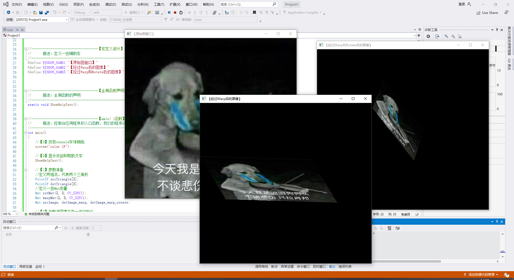

# 7.5 直方图均衡化 #

直方图均衡化可以用于扩大图像动态范围。

$源代码$

```
//--------------------------------------【程序说明】-------------------------------------------
//		程序说明：《OpenCV3编程入门》OpenCV3版书本配套示例程序68
//		程序描述：直方图均衡化
//		开发测试所用操作系统： Windows 7 64bit
//		开发测试所用IDE版本：Visual Studio 2010
//		开发测试所用OpenCV版本：	3.0 beta
//		2014年11月 Created by @浅墨_毛星云
//		2014年12月 Revised by @浅墨_毛星云
//------------------------------------------------------------------------------------------------


//---------------------------------【头文件、命名空间包含部分】---------------------------
//          描述：包含程序所使用的头文件和命名空间
//-----------------------------------------------------------------------------------------------
#include "opencv2/highgui/highgui.hpp"
#include "opencv2/imgproc/imgproc.hpp"
using namespace cv;


//--------------------------------------【main( )函数】-----------------------------------------
//          描述：控制台应用程序的入口函数，我们的程序从这里开始执行
//-----------------------------------------------------------------------------------------------
int main( )
{
	// 【1】加载源图像
	Mat srcImage, dstImage;
	srcImage = imread( "1.jpg", 1 );
	if(!srcImage.data ) { printf("读取图片错误，请确定目录下是否有imread函数指定图片存在~！ \n"); return false; } 

	// 【2】转为灰度图并显示出来
	cvtColor( srcImage, srcImage, COLOR_BGR2GRAY );
	imshow( "原始图", srcImage );

	// 【3】进行直方图均衡化
	equalizeHist( srcImage, dstImage );

	// 【4】显示结果
	imshow( "经过直方图均衡化后的图", dstImage );

	// 等待用户按键退出程序
	waitKey(0);
	return 0;

}
```

$运行结果$

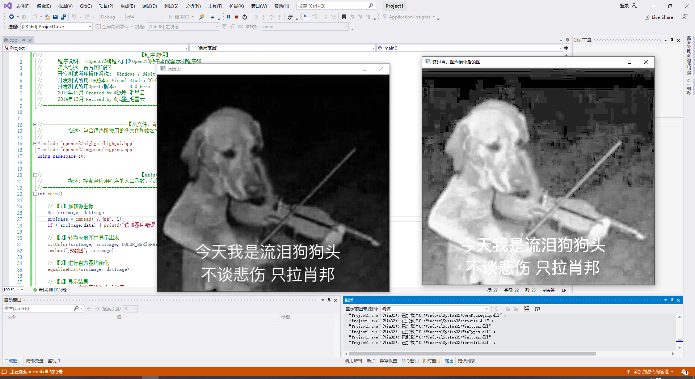


# 8.1 查找并绘制轮廓 #

一个轮廓一般对应一系列的点，也就是图像中的一条曲线。其表示方法可能根据不同的情况而有所不同。

## 寻找轮廓 fineContours()函数 ##

findContours（）函数用于在二值图像中寻找轮廓。

$源代码$

```

//--------------------------------------【程序说明】-------------------------------------------
//		程序说明：《OpenCV3编程入门》OpenCV2版书本配套示例程序69
//		程序描述：基础轮廓查找——findContours+drawContours
//		开发测试所用操作系统： Windows 7 64bit
//		开发测试所用IDE版本：Visual Studio 2010
//		开发测试所用OpenCV版本：	2.4.9
//		2014年06月 Created by @浅墨_毛星云
//		2014年11月 Revised by @浅墨_毛星云
//------------------------------------------------------------------------------------------------


//---------------------------------【头文件、命名空间包含部分】----------------------------
//		描述：包含程序所使用的头文件和命名空间
//------------------------------------------------------------------------------------------------
#include <opencv2/opencv.hpp>
#include "opencv2/highgui/highgui.hpp"
#include "opencv2/imgproc/imgproc.hpp"
using namespace cv;


//-----------------------------------【main( )函数】--------------------------------------------

//		描述：控制台应用程序的入口函数，我们的程序从这里开始
//-------------------------------------------------------------------------------------------------
int main( int argc, char** argv )
{
	// 【1】载入原始图，且必须以二值图模式载入
	Mat srcImage=imread("1.jpg", 0);
	imshow("原始图",srcImage);

	//【2】初始化结果图
	Mat dstImage = Mat::zeros(srcImage.rows, srcImage.cols, CV_8UC3);

	//【3】srcImage取大于阈值119的那部分
	srcImage = srcImage > 119;
	imshow( "取阈值后的原始图", srcImage );

	//【4】定义轮廓和层次结构
	vector<vector<Point> > contours;
	vector<Vec4i> hierarchy;

	//【5】查找轮廓
	findContours( srcImage, contours, hierarchy,
		CV_RETR_CCOMP, CV_CHAIN_APPROX_SIMPLE );

	// 【6】遍历所有顶层的轮廓， 以随机颜色绘制出每个连接组件颜色
	int index = 0;
	for( ; index >= 0; index = hierarchy[index][0] )
	{
		Scalar color( rand()&255, rand()&255, rand()&255 );
		drawContours( dstImage, contours, index, color, CV_FILLED, 8, hierarchy );
	}

	//【7】显示最后的轮廓图
	imshow( "轮廓图", dstImage );

	waitKey(0);

}
```

$运行结果$

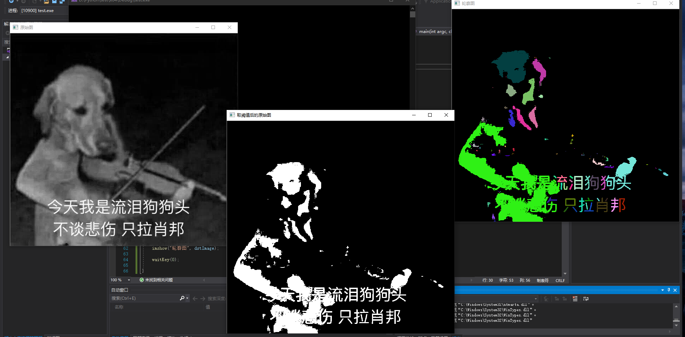

## 查找并绘制轮廓综合 ##

$源代码$

```

//--------------------------------------【程序说明】-------------------------------------------
//		程序说明：《OpenCV3编程入门》OpenCV2版书本配套示例程序70
//		程序描述：查找并绘制轮廓综合示例
//		开发测试所用操作系统： Windows 7 64bit
//		开发测试所用IDE版本：Visual Studio 2010
//		开发测试所用OpenCV版本：	2.4.9
//		2014年06月 Created by @浅墨_毛星云
//		2014年11月 Revised by @浅墨_毛星云
//------------------------------------------------------------------------------------------------


//---------------------------------【头文件、命名空间包含部分】----------------------------
//		描述：包含程序所使用的头文件和命名空间
//------------------------------------------------------------------------------------------------
#include "opencv2/highgui/highgui.hpp"
#include "opencv2/imgproc/imgproc.hpp"
#include <iostream>
using namespace cv;
using namespace std;


//-----------------------------------【宏定义部分】-------------------------------------------- 
//		描述：定义一些辅助宏 
//------------------------------------------------------------------------------------------------ 
#define WINDOW_NAME1 "【原始图窗口】"			//为窗口标题定义的宏 
#define WINDOW_NAME2 "【轮廓图】"					//为窗口标题定义的宏 


//-----------------------------------【全局变量声明部分】--------------------------------------
//		描述：全局变量的声明
//-----------------------------------------------------------------------------------------------
Mat g_srcImage; 
Mat g_grayImage;
int g_nThresh = 80;
int g_nThresh_max = 255;
RNG g_rng(12345);
Mat g_cannyMat_output;
vector<vector<Point>> g_vContours;
vector<Vec4i> g_vHierarchy;


//-----------------------------------【全局函数声明部分】--------------------------------------
//		描述：全局函数的声明
//-----------------------------------------------------------------------------------------------
static void ShowHelpText( );
void on_ThreshChange(int, void* );


//-----------------------------------【main( )函数】--------------------------------------------
//		描述：控制台应用程序的入口函数，我们的程序从这里开始执行
//-----------------------------------------------------------------------------------------------
int main( int argc, char** argv )
{
	//【0】改变console字体颜色
	system("color 1F"); 

	//【0】显示欢迎和帮助文字
	ShowHelpText( );

	// 加载源图像
	g_srcImage = imread( "1.jpg", 1 );
	if(!g_srcImage.data ) { printf("读取图片错误，请确定目录下是否有imread函数指定的图片存在~！ \n"); return false; } 

	// 转成灰度并模糊化降噪
	cvtColor( g_srcImage, g_grayImage, CV_BGR2GRAY );
	blur( g_grayImage, g_grayImage, Size(3,3) );

	// 创建窗口
	namedWindow( WINDOW_NAME1, CV_WINDOW_AUTOSIZE );
	imshow( WINDOW_NAME1, g_srcImage );

	//创建滚动条并初始化
	createTrackbar( "canny阈值", WINDOW_NAME1, &g_nThresh, g_nThresh_max, on_ThreshChange );
	on_ThreshChange( 0, 0 );

	waitKey(0);
	return(0);
}

//-----------------------------------【on_ThreshChange( )函数】------------------------------  
//      描述：回调函数
//----------------------------------------------------------------------------------------------  
void on_ThreshChange(int, void* )
{

	// 用Canny算子检测边缘
	Canny( g_grayImage, g_cannyMat_output, g_nThresh, g_nThresh*2, 3 );

	// 寻找轮廓
	findContours( g_cannyMat_output, g_vContours, g_vHierarchy, CV_RETR_TREE, CV_CHAIN_APPROX_SIMPLE, Point(0, 0) );

	// 绘出轮廓
	Mat drawing = Mat::zeros( g_cannyMat_output.size(), CV_8UC3 );
	for( int i = 0; i< g_vContours.size(); i++ )
	{
		Scalar color = Scalar( g_rng.uniform(0, 255), g_rng.uniform(0,255), g_rng.uniform(0,255) );//任意值
		drawContours( drawing, g_vContours, i, color, 2, 8, g_vHierarchy, 0, Point() );
	}

	// 显示效果图
	imshow( WINDOW_NAME2, drawing );
}


//-----------------------------------【ShowHelpText( )函数】----------------------------------  
//      描述：输出一些帮助信息  
//----------------------------------------------------------------------------------------------  
static void ShowHelpText()  
{  
	//输出欢迎信息和OpenCV版本
	printf("\n\n\t\t\t非常感谢购买《OpenCV3编程入门》一书！\n");
	printf("\n\n\t\t\t此为本书OpenCV2版的第70个配套示例程序\n");
	printf("\n\n\t\t\t   当前使用的OpenCV版本为：" CV_VERSION );
	printf("\n\n  ----------------------------------------------------------------------------\n");

	//输出一些帮助信息  
	printf(   "\n\n\t欢迎来到【在图形中寻找轮廓】示例程序~\n\n");  
	printf(   "\n\n\t按键操作说明: \n\n"  
		"\t\t键盘按键任意键- 退出程序\n\n"  
		"\t\t滑动滚动条-改变阈值\n" );  
}  

```

$运行结果$

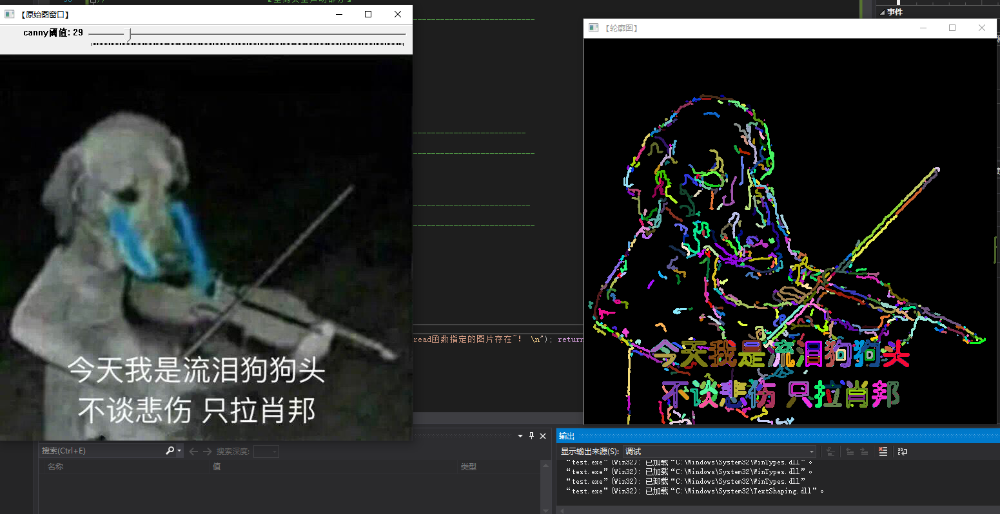

# 8.2 寻找物体凸包 ##

凸包是一个计算机几何中常见的概念。简单来说，给定二维平面上的点集，凸包就是将最外层的点连接起来构成的凸多边形，其能包含点集中所有的点。

$源代码$

```

//--------------------------------------【程序说明】-------------------------------------------
//		程序说明：《OpenCV3编程入门》OpenCV2版书本配套示例程序71
//		程序描述：凸包检测基础
//		开发测试所用操作系统： Windows 7 64bit
//		开发测试所用IDE版本：Visual Studio 2010
//		开发测试所用OpenCV版本：	2.4.9
//		2014年06月 Created by @浅墨_毛星云
//		2014年11月 Revised by @浅墨_毛星云
//------------------------------------------------------------------------------------------------


//---------------------------------【头文件、命名空间包含部分】----------------------------
//		描述：包含程序所使用的头文件和命名空间
//------------------------------------------------------------------------------------------------
#include "opencv2/imgproc/imgproc.hpp"
#include "opencv2/highgui/highgui.hpp"
#include <iostream>
using namespace cv;


//-----------------------------------【ShowHelpText( )函数】----------------------------------
//          描述：输出一些帮助信息
//----------------------------------------------------------------------------------------------
static void ShowHelpText()
{
	//输出欢迎信息和OpenCV版本
	printf("\n\n\t\t\t非常感谢购买《OpenCV3编程入门》一书！\n");
	printf("\n\n\t\t\t此为本书OpenCV2版的第71个配套示例程序\n");
	printf("\n\n\t\t\t   当前使用的OpenCV版本为：" CV_VERSION );
	printf("\n\n  ----------------------------------------------------------------------------\n");
	//输出一些帮助信息
	printf("\n\t欢迎来到【凸包检测】示例程序~\n\n"); 
	printf("\n\t按键操作说明: \n\n" 
		"\t\t键盘按键【ESC】、【Q】、【q】- 退出程序\n\n" 
		"\t\t键盘按键任意键 - 重新生成随机点，并进行凸包检测\n"  );  

}


//--------------------------------------【main( )函数】-----------------------------------------
//          描述：控制台应用程序的入口函数，我们的程序从这里开始执行
//-----------------------------------------------------------------------------------------------
int main( )
{
	//改变console字体颜色
	system("color 1F"); 

	//显示帮助文字
	ShowHelpText();

	//初始化变量和随机值
	Mat image(600, 600, CV_8UC3);
	RNG& rng = theRNG();

	//循环，按下ESC,Q,q键程序退出，否则有键按下便一直更新
	while(1)
	{
		//参数初始化
		char key;//键值
		int count = (unsigned)rng%100 + 3;//随机生成点的数量
		vector<Point> points; //点值

		//随机生成点坐标
		for(int i = 0; i < count; i++ )
		{
			Point point;
			point.x = rng.uniform(image.cols/4, image.cols*3/4);
			point.y = rng.uniform(image.rows/4, image.rows*3/4);

			points.push_back(point);
		}

		//检测凸包
		vector<int> hull;
		convexHull(Mat(points), hull, true);

		//绘制出随机颜色的点
		image = Scalar::all(0);
		for(int i = 0; i < count; i++ )
			circle(image, points[i], 3, Scalar(rng.uniform(0, 255), rng.uniform(0, 255), rng.uniform(0, 255)), CV_FILLED, CV_AA);

		//准备参数
		int hullcount = (int)hull.size();//凸包的边数
		Point point0 = points[hull[hullcount-1]];//连接凸包边的坐标点

		//绘制凸包的边
		for(int  i = 0; i < hullcount; i++ )
		{
			Point point = points[hull[i]];
			line(image, point0, point, Scalar(255, 255, 255), 2, CV_AA);
			point0 = point;
		}

		//显示效果图
		imshow("凸包检测示例", image);

		//按下ESC,Q,或者q，程序退出
		key = (char)waitKey();
		if( key == 27 || key == 'q' || key == 'Q' ) 
			break;
	}

	return 0;
}

```

$运行结果$

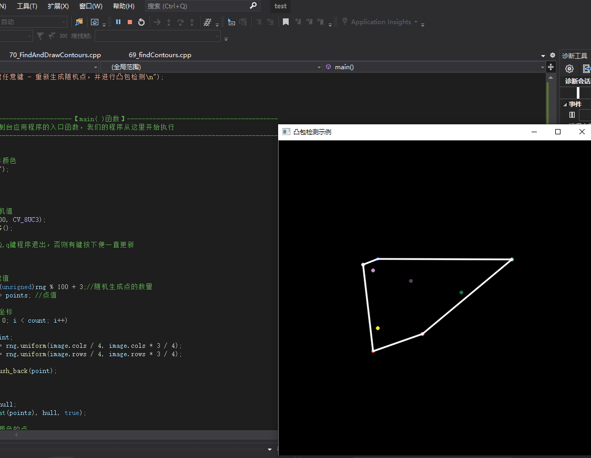

## 寻找和绘制物体的凸包 ##

$源代码$

```
##
//--------------------------------------【程序说明】-------------------------------------------
//		程序说明：《OpenCV3编程入门》OpenCV2版书本配套示例程序72
//		程序描述：寻找和绘制物体的凸包
//		开发测试所用操作系统： Windows 7 64bit
//		开发测试所用IDE版本：Visual Studio 2010
//		开发测试所用OpenCV版本：	2.4.9
//		2014年06月 Created by @浅墨_毛星云
//		2014年11月 Revised by @浅墨_毛星云
//------------------------------------------------------------------------------------------------


//---------------------------------【头文件、命名空间包含部分】----------------------------
//		描述：包含程序所使用的头文件和命名空间
//------------------------------------------------------------------------------------------------
#include "opencv2/highgui/highgui.hpp"
#include "opencv2/imgproc/imgproc.hpp"
#include <iostream>
using namespace cv;
using namespace std;


//-----------------------------------【宏定义部分】-------------------------------------------- 
//  描述：定义一些辅助宏 
//------------------------------------------------------------------------------------------------ 
#define WINDOW_NAME1 "【原始图窗口】"					//为窗口标题定义的宏 
#define WINDOW_NAME2 "【效果图窗口】"					//为窗口标题定义的宏 


//-----------------------------------【全局变量声明部分】--------------------------------------
//  描述：全局变量的声明
//-----------------------------------------------------------------------------------------------
Mat g_srcImage; Mat g_grayImage;
int g_nThresh = 50;
int g_maxThresh = 255;
RNG g_rng(12345);
Mat srcImage_copy = g_srcImage.clone();
Mat g_thresholdImage_output;
vector<vector<Point> > g_vContours;
vector<Vec4i> g_vHierarchy;


//-----------------------------------【全局函数声明部分】--------------------------------------
//   描述：全局函数的声明
//-----------------------------------------------------------------------------------------------
static void ShowHelpText( );
void on_ThreshChange(int, void* );
void ShowHelpText();

//-----------------------------------【main( )函数】------------------------------------------
//   描述：控制台应用程序的入口函数，我们的程序从这里开始执行
//-----------------------------------------------------------------------------------------------
int main(  )
{
	system("color 3F");
	ShowHelpText();

	// 加载源图像
	g_srcImage = imread( "1.jpg", 1 );

	// 将原图转换成灰度图并进行模糊降噪
	cvtColor( g_srcImage, g_grayImage, CV_BGR2GRAY );
	blur( g_grayImage, g_grayImage, Size(3,3) );

	// 创建原图窗口并显示
	namedWindow( WINDOW_NAME1, CV_WINDOW_AUTOSIZE );
	imshow( WINDOW_NAME1, g_srcImage );

	//创建滚动条
	createTrackbar( " 阈值:", WINDOW_NAME1, &g_nThresh, g_maxThresh, on_ThreshChange );
	on_ThreshChange( 0, 0 );//调用一次进行初始化

	waitKey(0);
	return(0);
}

//-----------------------------------【thresh_callback( )函数】----------------------------------  
//      描述：回调函数
//----------------------------------------------------------------------------------------------  
void on_ThreshChange(int, void* )
{
	// 对图像进行二值化，控制阈值
	threshold( g_grayImage, g_thresholdImage_output, g_nThresh, 255, THRESH_BINARY );

	// 寻找轮廓
	findContours( g_thresholdImage_output, g_vContours, g_vHierarchy, CV_RETR_TREE, CV_CHAIN_APPROX_SIMPLE, Point(0, 0) );

	// 遍历每个轮廓，寻找其凸包
	vector<vector<Point> >hull( g_vContours.size() );
	for( unsigned int i = 0; i < g_vContours.size(); i++ )
	{  
		convexHull( Mat(g_vContours[i]), hull[i], false );
	}

	// 绘出轮廓及其凸包
	Mat drawing = Mat::zeros( g_thresholdImage_output.size(), CV_8UC3 );
	for(unsigned  int i = 0; i< g_vContours.size(); i++ )
	{
		Scalar color = Scalar( g_rng.uniform(0, 255), g_rng.uniform(0,255), g_rng.uniform(0,255) );
		drawContours( drawing, g_vContours, i, color, 1, 8, vector<Vec4i>(), 0, Point() );
		drawContours( drawing, hull, i, color, 1, 8, vector<Vec4i>(), 0, Point() );
	}

	// 显示效果图
	imshow( WINDOW_NAME2, drawing );
}


//-----------------------------------【ShowHelpText( )函数】-----------------------------
//		 描述：输出一些帮助信息
//----------------------------------------------------------------------------------------------
void ShowHelpText()
{
	//输出欢迎信息和OpenCV版本
	printf("\n\n\t\t\t非常感谢购买《OpenCV3编程入门》一书！\n");
	printf("\n\n\t\t\t此为本书OpenCV2版的第72个配套示例程序\n");
	printf("\n\n\t\t\t   当前使用的OpenCV版本为：" CV_VERSION );
	printf("\n\n  ----------------------------------------------------------------------------\n");
}

```

$运行结果$

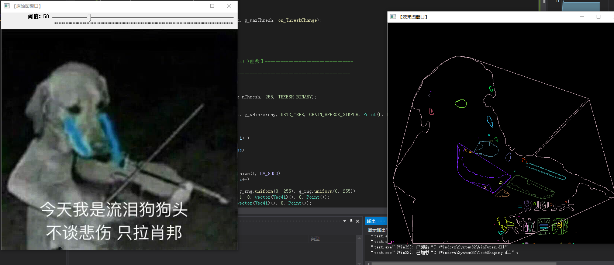

# 8.3 使用多边形将轮廓包围 #

## 创建包围轮廓的矩形边界 ##

$源代码$

```
//--------------------------------------【程序说明】-------------------------------------------
//		程序说明：《OpenCV3编程入门》OpenCV2版书本配套示例程序73
//		程序描述：创建包围轮廓的矩形边界
//		开发测试所用操作系统： Windows 7 64bit
//		开发测试所用IDE版本：Visual Studio 2010
//		开发测试所用OpenCV版本：	2.4.9
//		2014年06月 Created by @浅墨_毛星云
//		2014年11月 Revised by @浅墨_毛星云
//------------------------------------------------------------------------------------------------


//---------------------------------【头文件、命名空间包含部分】----------------------------
//		描述：包含程序所使用的头文件和命名空间
//------------------------------------------------------------------------------------------------
#include "opencv2/highgui/highgui.hpp"
#include "opencv2/imgproc/imgproc.hpp"
using namespace cv;
using namespace std;


//-----------------------------------【ShowHelpText( )函数】-----------------------------
//          描述：输出一些帮助信息
//----------------------------------------------------------------------------------------------
static void ShowHelpText()
{

	//输出欢迎信息和OpenCV版本
	printf("\n\n\t\t\t非常感谢购买《OpenCV3编程入门》一书！\n");
	printf("\n\n\t\t\t此为本书OpenCV2版的第73个配套示例程序\n");
	printf("\n\n\t\t\t   当前使用的OpenCV版本为：" CV_VERSION );
	printf("\n\n  ----------------------------------------------------------------------------\n");

	//输出一些帮助信息
	printf("\n\n\n\t\t\t欢迎来到【矩形包围示例】示例程序~\n\n"); 
	printf("\n\n\t按键操作说明: \n\n" 
		"\t\t键盘按键【ESC】、【Q】、【q】- 退出程序\n\n" 
		"\t\t键盘按键任意键 - 重新生成随机点，并寻找最小面积的包围矩形\n" );  
}

int main(  )
{
	//改变console字体颜色
	system("color 1F"); 

	//显示帮助文字
	ShowHelpText();

	//初始化变量和随机值
	Mat image(600, 600, CV_8UC3);
	RNG& rng = theRNG();

	//循环，按下ESC,Q,q键程序退出，否则有键按下便一直更新
	while(1)
	{
		//参数初始化
		int count = rng.uniform(3, 103);//随机生成点的数量
		vector<Point> points;//点值

		//随机生成点坐标
		for(int  i = 0; i < count; i++ )
		{

			Point point;
			point.x = rng.uniform(image.cols/4, image.cols*3/4);
			point.y = rng.uniform(image.rows/4, image.rows*3/4);

			points.push_back(point);
		}

		//对给定的 2D 点集，寻找最小面积的包围矩形
		RotatedRect box = minAreaRect(Mat(points));
		Point2f vertex[4];
		box.points(vertex);

		//绘制出随机颜色的点
		image = Scalar::all(0);
		for( int i = 0; i < count; i++ )
			circle( image, points[i], 3, Scalar(rng.uniform(0, 255), rng.uniform(0, 255), rng.uniform(0, 255)), CV_FILLED, CV_AA );


		//绘制出最小面积的包围矩形
		for( int i = 0; i < 4; i++ )
			line(image, vertex[i], vertex[(i+1)%4], Scalar(100, 200, 211), 2, CV_AA);

		//显示窗口
		imshow( "矩形包围示例", image );

		//按下ESC,Q,或者q，程序退出
		char key = (char)waitKey();
		if( key == 27 || key == 'q' || key == 'Q' ) // 'ESC'
			break;
	}

	return 0;
}
```

$运行结果$

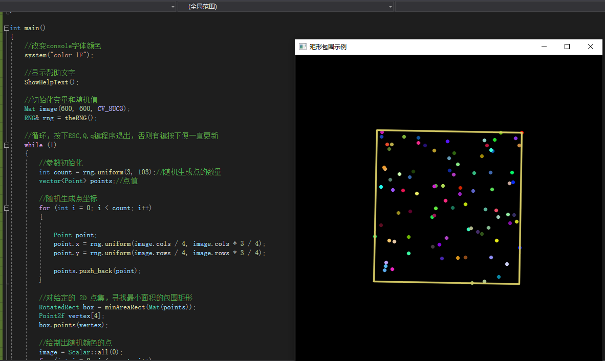

## 创建包围轮廓的圆形边界 ##

$源代码$

```
//--------------------------------------【程序说明】-------------------------------------------
//		程序说明：《OpenCV3编程入门》OpenCV2版书本配套示例程序74
//		程序描述：创建包围轮廓的圆形边界
//		开发测试所用操作系统： Windows 7 64bit
//		开发测试所用IDE版本：Visual Studio 2010
//		开发测试所用OpenCV版本：	2.4.9
//		2014年06月 Created by @浅墨_毛星云
//		2014年11月 Revised by @浅墨_毛星云
//------------------------------------------------------------------------------------------------


//---------------------------------【头文件、命名空间包含部分】----------------------------
//		描述：包含程序所使用的头文件和命名空间
//------------------------------------------------------------------------------------------------
#include "opencv2/highgui/highgui.hpp"
#include "opencv2/imgproc/imgproc.hpp"
using namespace cv;


//-----------------------------------【ShowHelpText( )函数】----------------------------------
//          描述：输出一些帮助信息
//----------------------------------------------------------------------------------------------
static void ShowHelpText()
{

	//输出欢迎信息和OpenCV版本
	printf("\n\n\t\t\t非常感谢购买《OpenCV3编程入门》一书！\n");
	printf("\n\n\t\t\t此为本书OpenCV2版的第13个配套示例程序\n");
	printf("\n\n\t\t\t   当前使用的OpenCV版本为：" CV_VERSION );
	printf("\n\n  ----------------------------------------------------------------------------\n");

	//输出一些帮助信息
	printf("\n\n\t\t\t欢迎来到【寻找最小面积的包围圆】示例程序~\n"); 
	printf("\n\n\t按键操作说明: \n\n" 
		"\t\t键盘按键【ESC】、【Q】、【q】- 退出程序\n\n" 
		"\t\t键盘按键任意键 - 重新生成随机点，并寻找最小面积的包围圆\n" );  
}

int main(  )
{
	//改变console字体颜色
	system("color 1F"); 

	//显示帮助文字
	ShowHelpText();

	//初始化变量和随机值
	Mat image(600, 600, CV_8UC3);
	RNG& rng = theRNG();

	//循环，按下ESC,Q,q键程序退出，否则有键按下便一直更新
	while(1)
	{
		//参数初始化
		int count = rng.uniform(3, 103);//随机生成点的数量
		vector<Point> points;//点值

		//随机生成点坐标
		for(int  i = 0; i < count; i++ )
		{

			Point point;
			point.x = rng.uniform(image.cols/4, image.cols*3/4);
			point.y = rng.uniform(image.rows/4, image.rows*3/4);

			points.push_back(point);
		}

		//对给定的 2D 点集，寻找最小面积的包围圆
		Point2f center;
		float radius = 0;
		minEnclosingCircle(Mat(points), center, radius);

		//绘制出随机颜色的点
		image = Scalar::all(0);
		for( int i = 0; i < count; i++ )
			circle( image, points[i], 3, Scalar(rng.uniform(0, 255), rng.uniform(0, 255), rng.uniform(0, 255)), CV_FILLED, CV_AA );


		//绘制出最小面积的包围圆
		circle(image, center, cvRound(radius), Scalar(rng.uniform(0, 255), rng.uniform(0, 255), rng.uniform(0, 255)), 2, CV_AA);

		//显示窗口
		imshow( "圆形包围示例", image );

		//按下ESC,Q,或者q，程序退出
		char key = (char)waitKey();
		if( key == 27 || key == 'q' || key == 'Q' ) // 'ESC'
			break;
	}

	return 0;
}

```

$运行结果$

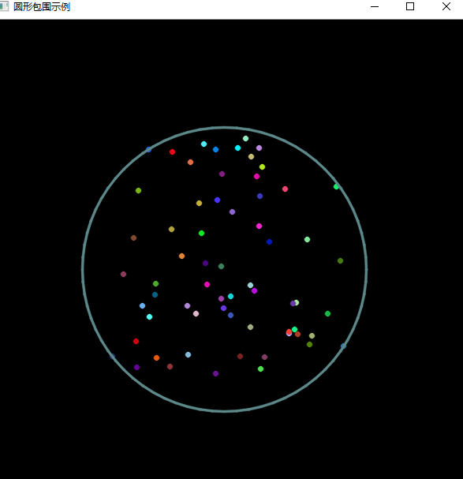

## 创建包围轮廓的矩形和圆形边界框 ##

$源代码$

```

//--------------------------------------【程序说明】-------------------------------------------
//		程序说明：《OpenCV3编程入门》OpenCV2版书本配套示例程序75
//		程序描述：创建轮廓边界框
//		开发测试所用操作系统： Windows 7 64bit
//		开发测试所用IDE版本：Visual Studio 2010
//		开发测试所用OpenCV版本：	2.4.9
//		2014年06月 Created by @浅墨_毛星云
//		2014年11月 Revised by @浅墨_毛星云
//------------------------------------------------------------------------------------------------


//---------------------------------【头文件、命名空间包含部分】----------------------------
//		描述：包含程序所使用的头文件和命名空间
//------------------------------------------------------------------------------------------------
#include "opencv2/highgui/highgui.hpp"
#include "opencv2/imgproc/imgproc.hpp"

//-----------------------------------【命名空间声明部分】--------------------------------------
//          描述：包含程序所使用的命名空间
//-----------------------------------------------------------------------------------------------
using namespace cv;

//-----------------------------------【宏定义部分】-------------------------------------------- 
//  描述：定义一些辅助宏 
//------------------------------------------------------------------------------------------------ 
#define WINDOW_NAME1 "【原始图窗口】"        //为窗口标题定义的宏 
#define WINDOW_NAME2 "【效果图窗口】"        //为窗口标题定义的宏 

//-----------------------------------【全局变量声明部分】--------------------------------------
//  描述：全局变量的声明
//-----------------------------------------------------------------------------------------------
Mat g_srcImage;
Mat g_grayImage;
int g_nThresh = 50;//阈值
int g_nMaxThresh = 255;//阈值最大值
RNG g_rng(12345);//随机数生成器

//-----------------------------------【全局函数声明部分】--------------------------------------
//   描述：全局函数的声明
//-----------------------------------------------------------------------------------------------
void on_ContoursChange(int, void* );
static void ShowHelpText( );

//-----------------------------------【main( )函数】--------------------------------------------
//   描述：控制台应用程序的入口函数，我们的程序从这里开始执行
//-----------------------------------------------------------------------------------------------
int main( )
{
	//【0】改变console字体颜色
	system("color 1F"); 

	//【0】显示欢迎和帮助文字
	ShowHelpText( );

	//【1】载入3通道的原图像
	g_srcImage = imread( "1.jpg", 1 );
	if(!g_srcImage.data ) { printf("读取图片错误，请确定目录下是否有imread函数指定的图片存在~！ \n"); return false; }  

	//【2】得到原图的灰度图像并进行平滑
	cvtColor( g_srcImage, g_grayImage, CV_BGR2GRAY );
	blur( g_grayImage, g_grayImage, Size(3,3) );

	//【3】创建原始图窗口并显示
	namedWindow( WINDOW_NAME1, CV_WINDOW_AUTOSIZE );
	imshow( WINDOW_NAME1, g_srcImage );

	//【4】设置滚动条并调用一次回调函数
	createTrackbar( " 阈值:", WINDOW_NAME1, &g_nThresh, g_nMaxThresh, on_ContoursChange );
	on_ContoursChange( 0, 0 );

	waitKey(0);

	return(0);
}

//----------------------------【on_ContoursChange( )函数】---------------------------------
//      描述：回调函数
//-------------------------------------------------------------------------------------------------  
void on_ContoursChange(int, void* )
{
	//定义一些参数
	Mat threshold_output;
	vector<vector<Point>> contours;
	vector<Vec4i> hierarchy;

	// 使用Threshold检测边缘
	threshold( g_grayImage, threshold_output, g_nThresh, 255, THRESH_BINARY );

	// 找出轮廓
	findContours( threshold_output, contours, hierarchy, CV_RETR_TREE, CV_CHAIN_APPROX_SIMPLE, Point(0, 0) );

	// 多边形逼近轮廓 + 获取矩形和圆形边界框
	vector<vector<Point> > contours_poly( contours.size() );
	vector<Rect> boundRect( contours.size() );
	vector<Point2f>center( contours.size() );
	vector<float>radius( contours.size() );

	//一个循环，遍历所有部分，进行本程序最核心的操作
	for( unsigned int i = 0; i < contours.size(); i++ )
	{ 
		approxPolyDP( Mat(contours[i]), contours_poly[i], 3, true );//用指定精度逼近多边形曲线 
		boundRect[i] = boundingRect( Mat(contours_poly[i]) );//计算点集的最外面（up-right）矩形边界
		minEnclosingCircle( contours_poly[i], center[i], radius[i] );//对给定的 2D点集，寻找最小面积的包围圆形 
	}

	// 绘制多边形轮廓 + 包围的矩形框 + 圆形框
	Mat drawing = Mat::zeros( threshold_output.size(), CV_8UC3 );
	for( int unsigned i = 0; i<contours.size( ); i++ )
	{
		Scalar color = Scalar( g_rng.uniform(0, 255), g_rng.uniform(0,255), g_rng.uniform(0,255) );//随机设置颜色
		drawContours( drawing, contours_poly, i, color, 1, 8, vector<Vec4i>(), 0, Point() );//绘制轮廓
		rectangle( drawing, boundRect[i].tl(), boundRect[i].br(), color, 2, 8, 0 );//绘制矩形
		circle( drawing, center[i], (int)radius[i], color, 2, 8, 0 );//绘制圆
	}

	// 显示效果图窗口
	namedWindow( WINDOW_NAME2, CV_WINDOW_AUTOSIZE );
	imshow( WINDOW_NAME2, drawing );
}

//-----------------------------------【ShowHelpText( )函数】----------------------------------  
//      描述：输出一些帮助信息  
//----------------------------------------------------------------------------------------------  
static void ShowHelpText()  
{  
	//输出欢迎信息和OpenCV版本
	printf("\n\n\t\t\t非常感谢购买《OpenCV3编程入门》一书！\n");
	printf("\n\n\t\t\t此为本书OpenCV2版的第75个配套示例程序\n");
	printf("\n\n\t\t\t   当前使用的OpenCV版本为：" CV_VERSION );
	printf("\n\n  ----------------------------------------------------------------------------\n");

	//输出一些帮助信息  
	printf("\n\n\n\t欢迎来到【创建包围轮廓的矩形和圆形边界框】示例程序~\n\n");  
	printf( "\n\n\t按键操作说明: \n\n"  
		"\t\t键盘按键【ESC】- 退出程序\n\n"  
		"\t\t滑动滚动条 - 改变阈值\n\n");  
}  

```

$运行结果$

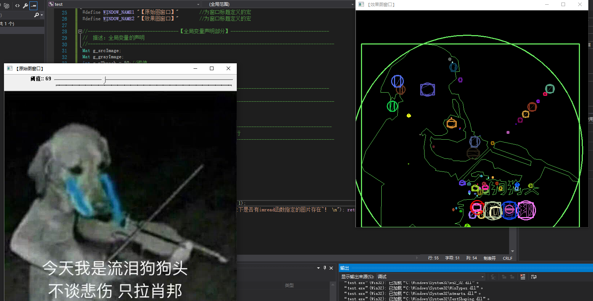


# 8.4 图像的矩 #

一个从一幅数字图形中计算出来的矩集，通常描述了该图像形状的全局特征，并提供了大量的关于该图像不同类型的几何特性信息。

## 查找和绘制图片轮廓矩 ##

$源代码$

```

//--------------------------------------【程序说明】-------------------------------------------
//		程序说明：《OpenCV3编程入门》OpenCV2版书本配套示例程序76
//		程序描述：查找和绘制图片轮廓矩
//		开发测试所用操作系统： Windows 7 64bit
//		开发测试所用IDE版本：Visual Studio 2010
//		开发测试所用OpenCV版本：	2.4.9
//		2014年06月 Created by @浅墨_毛星云
//		2014年11月 Revised by @浅墨_毛星云
//------------------------------------------------------------------------------------------------


//---------------------------------【头文件、命名空间包含部分】----------------------------
//		描述：包含程序所使用的头文件和命名空间
//------------------------------------------------------------------------------------------------
#include "opencv2/highgui/highgui.hpp"
#include "opencv2/imgproc/imgproc.hpp"
#include <iostream>
using namespace cv;
using namespace std;


//-----------------------------------【宏定义部分】-------------------------------------------- 
//		描述：定义一些辅助宏 
//------------------------------------------------------------------------------------------------ 
#define WINDOW_NAME1 "【原始图】"					//为窗口标题定义的宏 
#define WINDOW_NAME2 "【图像轮廓】"        //为窗口标题定义的宏 


//-----------------------------------【全局变量声明部分】--------------------------------------
//		描述：全局变量的声明
//-----------------------------------------------------------------------------------------------
Mat g_srcImage; Mat g_grayImage;
int g_nThresh = 100;
int g_nMaxThresh = 255;
RNG g_rng(12345);
Mat g_cannyMat_output;
vector<vector<Point> > g_vContours;
vector<Vec4i> g_vHierarchy;

//-----------------------------------【全局变量声明部分】--------------------------------------
//		描述：全局变量的声明
//-----------------------------------------------------------------------------------------------
void on_ThreshChange(int, void* );
static void ShowHelpText( );

//-----------------------------------【main( )函数】--------------------------------------------
//		描述：控制台应用程序的入口函数，我们的程序从这里开始执行
//-----------------------------------------------------------------------------------------------
int main( int argc, char** argv )
{
	//【0】改变console字体颜色
	system("color 71"); 

	ShowHelpText();
	// 读入原图像, 返回3通道图像数据
	g_srcImage = imread( "1.jpg", 1 );

	// 把原图像转化成灰度图像并进行平滑
	cvtColor( g_srcImage, g_grayImage, CV_BGR2GRAY );
	blur( g_grayImage, g_grayImage, Size(3,3) );

	// 创建新窗口
	namedWindow( WINDOW_NAME1, CV_WINDOW_AUTOSIZE );
	imshow( WINDOW_NAME1, g_srcImage );

	//创建滚动条并进行初始化
	createTrackbar( " 阈值", WINDOW_NAME1, &g_nThresh, g_nMaxThresh, on_ThreshChange );
	on_ThreshChange( 0, 0 );

	waitKey(0);
	return(0);
}

//-----------------------------------【on_ThreshChange( )函数】-------------------------------
//		描述：回调函数
//-----------------------------------------------------------------------------------------------
void on_ThreshChange(int, void* )
{
	// 使用Canndy检测边缘
	Canny( g_grayImage, g_cannyMat_output, g_nThresh, g_nThresh*2, 3 );

	// 找到轮廓
	findContours( g_cannyMat_output, g_vContours, g_vHierarchy, CV_RETR_TREE, CV_CHAIN_APPROX_SIMPLE, Point(0, 0) );

	// 计算矩
	vector<Moments> mu(g_vContours.size() );
	for(unsigned int i = 0; i < g_vContours.size(); i++ )
	{ mu[i] = moments( g_vContours[i], false ); }

	//  计算中心矩
	vector<Point2f> mc( g_vContours.size() );
	for( unsigned int i = 0; i < g_vContours.size(); i++ )
	{ mc[i] = Point2f( static_cast<float>(mu[i].m10/mu[i].m00), static_cast<float>(mu[i].m01/mu[i].m00 )); }

	// 绘制轮廓
	Mat drawing = Mat::zeros( g_cannyMat_output.size(), CV_8UC3 );
	for( unsigned int i = 0; i< g_vContours.size(); i++ )
	{
		Scalar color = Scalar( g_rng.uniform(0, 255), g_rng.uniform(0,255), g_rng.uniform(0,255) );//随机生成颜色值
		drawContours( drawing, g_vContours, i, color, 2, 8, g_vHierarchy, 0, Point() );//绘制外层和内层轮廓
		circle( drawing, mc[i], 4, color, -1, 8, 0 );;//绘制圆
	}

	// 显示到窗口中
	namedWindow( WINDOW_NAME2, CV_WINDOW_AUTOSIZE );
	imshow( WINDOW_NAME2, drawing );

	// 通过m00计算轮廓面积并且和OpenCV函数比较
	printf("\t 输出内容: 面积和轮廓长度\n");
	for(unsigned  int i = 0; i< g_vContours.size(); i++ )
	{
		printf(" >通过m00计算出轮廓[%d]的面积: (M_00) = %.2f \n OpenCV函数计算出的面积=%.2f , 长度: %.2f \n\n", i, mu[i].m00, contourArea(g_vContours[i]), arcLength( g_vContours[i], true ) );
		Scalar color = Scalar( g_rng.uniform(0, 255), g_rng.uniform(0,255), g_rng.uniform(0,255) );
		drawContours( drawing, g_vContours, i, color, 2, 8, g_vHierarchy, 0, Point() );
		circle( drawing, mc[i], 4, color, -1, 8, 0 );
	}
}


//-----------------------------------【ShowHelpText( )函数】-----------------------------
//		 描述：输出一些帮助信息
//----------------------------------------------------------------------------------------------
void ShowHelpText()
{
	//输出欢迎信息和OpenCV版本
	printf("\n\n\t\t\t非常感谢购买《OpenCV3编程入门》一书！\n");
	printf("\n\n\t\t\t此为本书OpenCV2版的第76个配套示例程序\n");
	printf("\n\n\t\t\t   当前使用的OpenCV版本为：" CV_VERSION );
	printf("\n\n  ----------------------------------------------------------------------------\n");
}
```

$运行结果$

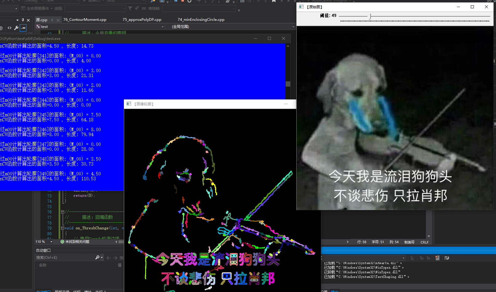

# 8.5 分水岭算法 #

分水岭算法可以将图像中的边缘转化成“山脉”，将均匀区域转化为“山谷”，有助于分割目标。

$源代码$

```
//--------------------------------------【程序说明】-------------------------------------------
//		程序说明：《OpenCV3编程入门》OpenCV2版书本配套示例程序77
//		程序描述：分水岭算法综合示例
//		开发测试所用操作系统： Windows 7 64bit
//		开发测试所用IDE版本：Visual Studio 2010
//		开发测试所用OpenCV版本：	2.4.9
//		2014年06月 Created by @浅墨_毛星云
//		2014年11月 Revised by @浅墨_毛星云
//------------------------------------------------------------------------------------------------


//---------------------------------【头文件、命名空间包含部分】----------------------------
//		描述：包含程序所使用的头文件和命名空间
//------------------------------------------------------------------------------------------------
#include "opencv2/imgproc/imgproc.hpp"
#include "opencv2/highgui/highgui.hpp"
#include <iostream>
using namespace cv;
using namespace std;

//-----------------------------------【宏定义部分】-------------------------------------------- 
//  描述：定义一些辅助宏 
//------------------------------------------------------------------------------------------------ 
#define WINDOW_NAME1 "【程序窗口1】"        //为窗口标题定义的宏 
#define WINDOW_NAME2 "【分水岭算法效果图】"        //为窗口标题定义的宏

//-----------------------------------【全局函变量声明部分】--------------------------------------
//		描述：全局变量的声明
//-----------------------------------------------------------------------------------------------
Mat g_maskImage, g_srcImage;
Point prevPt(-1, -1);

//-----------------------------------【全局函数声明部分】--------------------------------------
//		描述：全局函数的声明
//-----------------------------------------------------------------------------------------------
static void ShowHelpText();
static void on_Mouse( int event, int x, int y, int flags, void* );


//-----------------------------------【main( )函数】--------------------------------------------
//		描述：控制台应用程序的入口函数，我们的程序从这里开始执行
//-----------------------------------------------------------------------------------------------
int main( int argc, char** argv )
{	
	//【0】改变console字体颜色
	system("color 6F"); 

	//【0】显示帮助文字
	ShowHelpText( );

	//【1】载入原图并显示，初始化掩膜和灰度图
	g_srcImage = imread("1.jpg", 1);
	imshow( WINDOW_NAME1, g_srcImage );
	Mat srcImage,grayImage;
	g_srcImage.copyTo(srcImage);
	cvtColor(g_srcImage, g_maskImage, COLOR_BGR2GRAY);
	cvtColor(g_maskImage, grayImage, COLOR_GRAY2BGR);
	g_maskImage = Scalar::all(0);

	//【2】设置鼠标回调函数
	setMouseCallback( WINDOW_NAME1, on_Mouse, 0 );

	//【3】轮询按键，进行处理
	while(1)
	{
		//获取键值
		int c = waitKey(0);

		//若按键键值为ESC时，退出
		if( (char)c == 27 )
			break;

		//按键键值为2时，恢复源图
		if( (char)c == '2' )
		{
			g_maskImage = Scalar::all(0);
			srcImage.copyTo(g_srcImage);
			imshow( "image", g_srcImage );
		}

		//若检测到按键值为1或者空格，则进行处理
		if( (char)c == '1' || (char)c == ' ' )
		{
			//定义一些参数
			int i, j, compCount = 0;
			vector<vector<Point> > contours;
			vector<Vec4i> hierarchy;

			//寻找轮廓
			findContours(g_maskImage, contours, hierarchy, CV_RETR_CCOMP, CV_CHAIN_APPROX_SIMPLE);

			//轮廓为空时的处理
			if( contours.empty() )
				continue;

			//拷贝掩膜
			Mat maskImage(g_maskImage.size(), CV_32S);
			maskImage = Scalar::all(0);

			//循环绘制出轮廓
			for( int index = 0; index >= 0; index = hierarchy[index][0], compCount++ )
				drawContours(maskImage, contours, index, Scalar::all(compCount+1), -1, 8, hierarchy, INT_MAX);

			//compCount为零时的处理
			if( compCount == 0 )
				continue;

			//生成随机颜色
			vector<Vec3b> colorTab;
			for( i = 0; i < compCount; i++ )
			{
				int b = theRNG().uniform(0, 255);
				int g = theRNG().uniform(0, 255);
				int r = theRNG().uniform(0, 255);

				colorTab.push_back(Vec3b((uchar)b, (uchar)g, (uchar)r));
			}

			//计算处理时间并输出到窗口中
			double dTime = (double)getTickCount();
			watershed( srcImage, maskImage );
			dTime = (double)getTickCount() - dTime;
			printf( "\t处理时间 = %gms\n", dTime*1000./getTickFrequency() );

			//双层循环，将分水岭图像遍历存入watershedImage中
			Mat watershedImage(maskImage.size(), CV_8UC3);
			for( i = 0; i < maskImage.rows; i++ )
				for( j = 0; j < maskImage.cols; j++ )
				{
					int index = maskImage.at<int>(i,j);
					if( index == -1 )
						watershedImage.at<Vec3b>(i,j) = Vec3b(255,255,255);
					else if( index <= 0 || index > compCount )
						watershedImage.at<Vec3b>(i,j) = Vec3b(0,0,0);
					else
						watershedImage.at<Vec3b>(i,j) = colorTab[index - 1];
				}

				//混合灰度图和分水岭效果图并显示最终的窗口
				watershedImage = watershedImage*0.5 + grayImage*0.5;
				imshow( WINDOW_NAME2, watershedImage );
		}
	}

	return 0;
}


//-----------------------------------【onMouse( )函数】---------------------------------------
//		描述：鼠标消息回调函数
//-----------------------------------------------------------------------------------------------
static void on_Mouse( int event, int x, int y, int flags, void* )
{
	//处理鼠标不在窗口中的情况
	if( x < 0 || x >= g_srcImage.cols || y < 0 || y >= g_srcImage.rows )
		return;

	//处理鼠标左键相关消息
	if( event == CV_EVENT_LBUTTONUP || !(flags & CV_EVENT_FLAG_LBUTTON) )
		prevPt = Point(-1,-1);
	else if( event == CV_EVENT_LBUTTONDOWN )
		prevPt = Point(x,y);

	//鼠标左键按下并移动，绘制出白色线条
	else if( event == CV_EVENT_MOUSEMOVE && (flags & CV_EVENT_FLAG_LBUTTON) )
	{
		Point pt(x, y);
		if( prevPt.x < 0 )
			prevPt = pt;
		line( g_maskImage, prevPt, pt, Scalar::all(255), 5, 8, 0 );
		line( g_srcImage, prevPt, pt, Scalar::all(255), 5, 8, 0 );
		prevPt = pt;
		imshow(WINDOW_NAME1, g_srcImage);
	}
}


//-----------------------------------【ShowHelpText( )函数】----------------------------------  
//      描述：输出一些帮助信息  
//----------------------------------------------------------------------------------------------  
static void ShowHelpText()  
{  
	//输出欢迎信息和OpenCV版本
	printf("\n\n\t\t\t非常感谢购买《OpenCV3编程入门》一书！\n");
	printf("\n\n\t\t\t此为本书OpenCV2版的第77个配套示例程序\n");
	printf("\n\n\t\t\t   当前使用的OpenCV版本为：" CV_VERSION );
	printf("\n\n  ----------------------------------------------------------------------------\n");

	//输出一些帮助信息  
	printf(  "\n\n\n\t欢迎来到【分水岭算法】示例程序~\n\n");  
	printf(  "\t请先用鼠标在图片窗口中标记出大致的区域，\n\n\t然后再按键【1】或者【SPACE】启动算法。"
		"\n\n\t按键操作说明: \n\n"  
		"\t\t键盘按键【1】或者【SPACE】- 运行的分水岭分割算法\n"  
		"\t\t键盘按键【2】- 恢复原始图片\n"  
		"\t\t键盘按键【ESC】- 退出程序\n\n\n");  
}  

```

$运行结果$

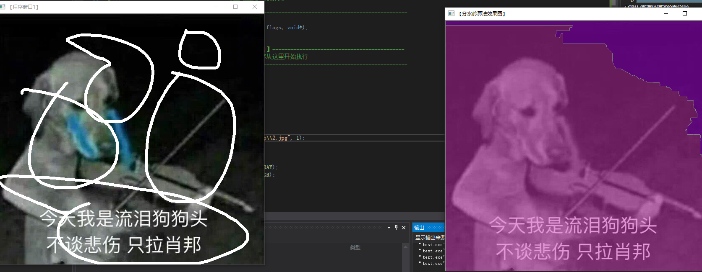

# 8.6 图像修补 #

图像修复技术简单来说就是利用已被破坏区域的边缘，即边缘的颜色和结构，繁殖和混合到损坏的图像中，达到图像修补的目的。

$源代码$

```
//--------------------------------------【程序说明】-------------------------------------------
//		程序说明：《OpenCV3编程入门》OpenCV2版书本配套示例程序78
//		程序描述：图像修补示例
//		开发测试所用操作系统： Windows 7 64bit
//		开发测试所用IDE版本：Visual Studio 2010
//		开发测试所用OpenCV版本：	2.4.9
//		2014年06月 Created by @浅墨_毛星云
//		2014年11月 Revised by @浅墨_毛星云
//------------------------------------------------------------------------------------------------


//---------------------------------【头文件、命名空间包含部分】----------------------------
//		描述：包含程序所使用的头文件和命名空间
//------------------------------------------------------------------------------------------------
#include "opencv2/highgui/highgui.hpp"
#include "opencv2/imgproc/imgproc.hpp"
#include "opencv2/photo/photo.hpp"
#include <iostream>
using namespace cv;
using namespace std;


//-----------------------------------【宏定义部分】-------------------------------------------- 
//  描述：定义一些辅助宏 
//----------------------------------------------------------------------------------------------
#define WINDOW_NAME0 "【原始图参考】"        //为窗口标题定义的宏 
#define WINDOW_NAME1 "【原始图】"        //为窗口标题定义的宏 
#define WINDOW_NAME2 "【修补后的效果图】"        //为窗口标题定义的宏 


//-----------------------------------【全局变量声明部分】--------------------------------------
//          描述：全局变量声明
//-----------------------------------------------------------------------------------------------
Mat srcImage0,srcImage1, inpaintMask;
Point previousPoint(-1,-1);//原来的点坐标


//-----------------------------------【ShowHelpText( )函数】----------------------------------
//          描述：输出一些帮助信息
//----------------------------------------------------------------------------------------------
static void ShowHelpText( )
{
	//输出欢迎信息和OpenCV版本
	printf("\n\n\t\t\t非常感谢购买《OpenCV3编程入门》一书！\n");
	printf("\n\n\t\t\t此为本书OpenCV2版的第78个配套示例程序\n");
	printf("\n\n\t\t\t   当前使用的OpenCV版本为：" CV_VERSION );
	printf("\n\n  ----------------------------------------------------------------------------\n");

	//输出一些帮助信息
	printf("\n\n\n\t欢迎来到【图像修复】示例程序~\n"); 
	printf(  "\n\t请在进行图像修复操作之前，在【原始图】窗口中进行适量的绘制" 
		"\n\n\t按键操作说明: \n\n" 
		"\t\t【鼠标左键】-在图像上绘制白色线条\n\n"
		"\t\t键盘按键【ESC】- 退出程序\n\n" 
		"\t\t键盘按键【1】或【SPACE】-进行图像修复操作 \n\n"   );  
}


//-----------------------------------【On_Mouse( )函数】--------------------------------
//          描述：响应鼠标消息的回调函数
//----------------------------------------------------------------------------------------------
static void On_Mouse( int event, int x, int y, int flags, void* )
{
	//鼠标左键弹起消息
	if( event == CV_EVENT_LBUTTONUP || !(flags & CV_EVENT_FLAG_LBUTTON) )
		previousPoint = Point(-1,-1);
	//鼠标左键按下消息
	else if( event == CV_EVENT_LBUTTONDOWN )
		previousPoint = Point(x,y);
	//鼠标按下并移动，进行绘制
	else if( event == CV_EVENT_MOUSEMOVE && (flags & CV_EVENT_FLAG_LBUTTON) )
	{
		Point pt(x,y);
		if( previousPoint.x < 0 )
			previousPoint = pt;
		//绘制白色线条
		line( inpaintMask, previousPoint, pt, Scalar::all(255), 5, 8, 0 );
		line( srcImage1, previousPoint, pt, Scalar::all(255), 5, 8, 0 );
		previousPoint = pt;
		imshow(WINDOW_NAME1, srcImage1);
	}
}


//--------------------------------------【main( )函数】-----------------------------------------
//          描述：控制台应用程序的入口函数，我们的程序从这里开始执行
//-----------------------------------------------------------------------------------------------
int main( int argc, char** argv )
{
	//改变console字体颜色
	system("color 2F"); 

	//显示帮助文字
	ShowHelpText();

	//载入原始图并进行掩膜的初始化
	Mat srcImage = imread("1.jpg", -1);
	if(!srcImage.data ) { printf("读取图片错误，请确定目录下是否有imread函数指定图片存在~！ \n"); return false; } 
	srcImage0 = srcImage.clone();
	srcImage1 = srcImage.clone();
	inpaintMask = Mat::zeros(srcImage1.size(), CV_8U);

	//显示原始图参考
	imshow(WINDOW_NAME0, srcImage0);
	//显示原始图
	imshow(WINDOW_NAME1, srcImage1);
	//设置鼠标回调消息
	setMouseCallback( WINDOW_NAME1, On_Mouse, 0 );

	//轮询按键，根据不同的按键进行处理
	while (1)
	{
		//获取按键键值
		char c = (char)waitKey();

		//键值为ESC，程序退出
		if( c == 27 )
			break;

		//键值为2，恢复成原始图像
		if( c == '2' )
		{
			inpaintMask = Scalar::all(0);
			srcImage.copyTo(srcImage1);
			imshow(WINDOW_NAME1, srcImage1);
		}

		//键值为1或者空格，进行图像修补操作
		if( c == '1' || c == ' ' )
		{
			Mat inpaintedImage;
			inpaint(srcImage1, inpaintMask, inpaintedImage, 3, CV_INPAINT_TELEA);
			imshow(WINDOW_NAME2, inpaintedImage);
		}
	}

	return 0;
}

```

$运行结果$

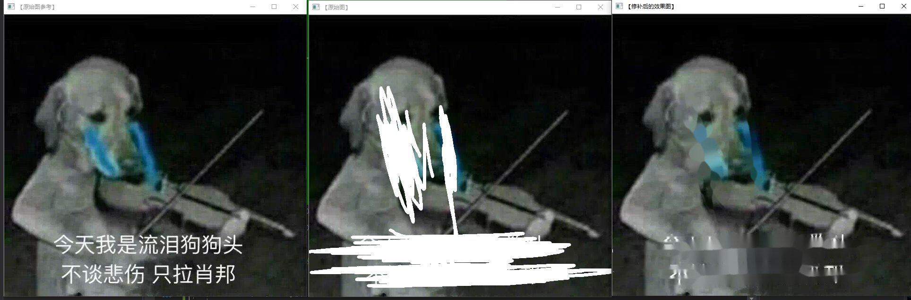

# 9.1 图像直方图概述 #

直方图通过标记帧与帧之间显著的边缘和颜色的统计变化来检测视频中场景的变化。

# 9.2 直方图的绘制 #

## H-S二维直方图的绘制 ##

$源代码$
```
//--------------------------------------【程序说明】-------------------------------------------
//		程序说明：《OpenCV3编程入门》OpenCV2版书本配套示例程序79
//		程序描述：H-S二维直方图的绘制
//		开发测试所用操作系统： Windows 7 64bit
//		开发测试所用IDE版本：Visual Studio 2010
//		开发测试所用OpenCV版本：	2.4.9
//		2014年06月 Created by @浅墨_毛星云
//		2014年11月 Revised by @浅墨_毛星云
//------------------------------------------------------------------------------------------------


//---------------------------------【头文件、命名空间包含部分】----------------------------
//		描述：包含程序所使用的头文件和命名空间
//------------------------------------------------------------------------------------------------
#include "opencv2/highgui/highgui.hpp"
#include "opencv2/imgproc/imgproc.hpp"
using namespace cv;


//-----------------------------------【ShowHelpText( )函数】-----------------------------
//		 描述：输出一些帮助信息
//----------------------------------------------------------------------------------------------
void ShowHelpText()
{
	//输出欢迎信息和OpenCV版本
	printf("\n\n\t\t\t非常感谢购买《OpenCV3编程入门》一书！\n");
	printf("\n\n\t\t\t此为本书OpenCV2版的第79个配套示例程序\n");
	printf("\n\n\t\t\t   当前使用的OpenCV版本为：" CV_VERSION );
	printf("\n\n  ----------------------------------------------------------------------------\n");
}


//--------------------------------------【main( )函数】-----------------------------------------
//          描述：控制台应用程序的入口函数，我们的程序从这里开始执行
//-----------------------------------------------------------------------------------------------
int main( )
{

	//【1】载入源图，转化为HSV颜色模型
	Mat srcImage, hsvImage;
	srcImage=imread("1.jpg");
	cvtColor(srcImage,hsvImage, CV_BGR2HSV);

	system("color 2F");
	ShowHelpText();

	//【2】参数准备
	//将色调量化为30个等级，将饱和度量化为32个等级
	int hueBinNum = 30;//色调的直方图直条数量
	int saturationBinNum = 32;//饱和度的直方图直条数量
	int histSize[ ] = {hueBinNum, saturationBinNum};
	// 定义色调的变化范围为0到179
	float hueRanges[] = { 0, 180 };
	//定义饱和度的变化范围为0（黑、白、灰）到255（纯光谱颜色）
	float saturationRanges[] = { 0, 256 };
	const float* ranges[] = { hueRanges, saturationRanges };
	MatND dstHist;
	//参数准备，calcHist函数中将计算第0通道和第1通道的直方图
	int channels[] = {0, 1};

	//【3】正式调用calcHist，进行直方图计算
	calcHist( &hsvImage,//输入的数组
		1, //数组个数为1
		channels,//通道索引
		Mat(), //不使用掩膜
		dstHist, //输出的目标直方图
		2, //需要计算的直方图的维度为2
		histSize, //存放每个维度的直方图尺寸的数组
		ranges,//每一维数值的取值范围数组
		true, // 指示直方图是否均匀的标识符，true表示均匀的直方图
		false );//累计标识符，false表示直方图在配置阶段会被清零

	//【4】为绘制直方图准备参数
	double maxValue=0;//最大值
	minMaxLoc(dstHist, 0, &maxValue, 0, 0);//查找数组和子数组的全局最小值和最大值存入maxValue中
	int scale = 10;
	Mat histImg = Mat::zeros(saturationBinNum*scale, hueBinNum*10, CV_8UC3);

	//【5】双层循环，进行直方图绘制
	for( int hue = 0; hue < hueBinNum; hue++ )
		for( int saturation = 0; saturation < saturationBinNum; saturation++ )
		{
			float binValue = dstHist.at<float>(hue, saturation);//直方图组距的值
			int intensity = cvRound(binValue*255/maxValue);//强度

			//正式进行绘制
			rectangle( histImg, Point(hue*scale, saturation*scale),
				Point( (hue+1)*scale - 1, (saturation+1)*scale - 1),
				Scalar::all(intensity),
				CV_FILLED );
		}

		//【6】显示效果图
		imshow( "素材图", srcImage );
		imshow( "H-S 直方图", histImg );

		waitKey();
}
```

$运行结果$

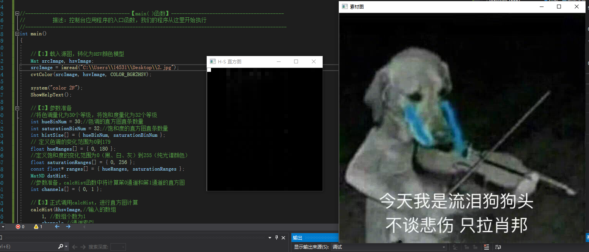

## 一维直方图的绘制 ##

$源代码$

```
//--------------------------------------【程序说明】-------------------------------------------
//		程序说明：《OpenCV3编程入门》OpenCV2版书本配套示例程序80
//		程序描述：一维直方图的绘制
//		开发测试所用操作系统： Windows 7 64bit
//		开发测试所用IDE版本：Visual Studio 2010
//		开发测试所用OpenCV版本：	2.4.9
//		2014年06月 Created by @浅墨_毛星云
//		2014年11月 Revised by @浅墨_毛星云
//------------------------------------------------------------------------------------------------


//---------------------------------【头文件、命名空间包含部分】----------------------------
//		描述：包含程序所使用的头文件和命名空间
//------------------------------------------------------------------------------------------------
#include "opencv2/highgui/highgui.hpp"
#include "opencv2/imgproc/imgproc.hpp"
#include <iostream>
using namespace cv;
using namespace std;


//-----------------------------------【ShowHelpText( )函数】-----------------------------
//		 描述：输出一些帮助信息
//----------------------------------------------------------------------------------------------
void ShowHelpText()
{
	//输出欢迎信息和OpenCV版本
	printf("\n\n\t\t\t非常感谢购买《OpenCV3编程入门》一书！\n");
	printf("\n\n\t\t\t此为本书OpenCV2版的第80个配套示例程序\n");
	printf("\n\n\t\t\t   当前使用的OpenCV版本为：" CV_VERSION );
	printf("\n\n  ----------------------------------------------------------------------------\n");
}


//--------------------------------------【main( )函数】-----------------------------------------
//          描述：控制台应用程序的入口函数，我们的程序从这里开始执行
//-------------------------------------------------------------------------------------------------
int main()
{
	//【1】载入原图并显示
	Mat srcImage = imread("1.jpg", 0);
	imshow("原图",srcImage);
	if(!srcImage.data) {cout << "fail to load image" << endl; 	return 0;}

	system("color 1F");
	ShowHelpText();

	//【2】定义变量
	MatND dstHist;       // 在cv中用CvHistogram *hist = cvCreateHist
	int dims = 1;
	float hranges[] = {0, 255};
	const float *ranges[] = {hranges};   // 这里需要为const类型
	int size = 256;
	int channels = 0;

	//【3】计算图像的直方图
	calcHist(&srcImage, 1, &channels, Mat(), dstHist, dims, &size, ranges);    // cv 中是cvCalcHist
	int scale = 1;

	Mat dstImage(size * scale, size, CV_8U, Scalar(0));
	//【4】获取最大值和最小值
	double minValue = 0;
	double maxValue = 0;
	minMaxLoc(dstHist,&minValue, &maxValue, 0, 0);  //  在cv中用的是cvGetMinMaxHistValue

	//【5】绘制出直方图
	int hpt = saturate_cast<int>(0.9 * size);
	for(int i = 0; i < 256; i++)
	{
		float binValue = dstHist.at<float>(i);           //   注意hist中是float类型    而在OpenCV1.0版中用cvQueryHistValue_1D
		int realValue = saturate_cast<int>(binValue * hpt/maxValue);
		rectangle(dstImage,Point(i*scale, size - 1), Point((i+1)*scale - 1, size - realValue), Scalar(255));
	}
	imshow("一维直方图", dstImage);
	waitKey(0);
	return 0;
}
```
$运行结果$

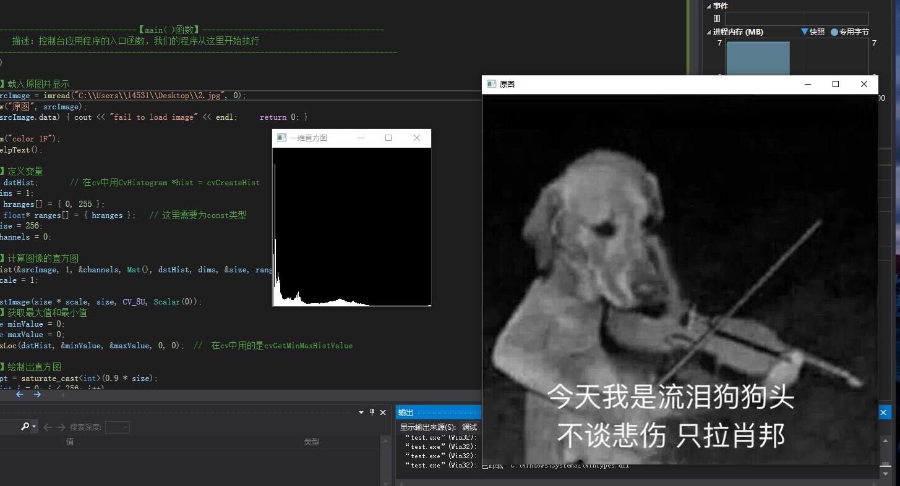

## RGB三色直方图的绘制 ##

$源代码$

```
//--------------------------------------【程序说明】-------------------------------------------
//		程序说明：《OpenCV3编程入门》OpenCV2版书本配套示例程序81
//		程序描述：绘制RGB三色分量的直方图
//		开发测试所用操作系统： Windows 7 64bit
//		开发测试所用IDE版本：Visual Studio 2010
//		开发测试所用OpenCV版本：	2.4.9
//		2014年06月 Created by @浅墨_毛星云
//		2014年11月 Revised by @浅墨_毛星云
//------------------------------------------------------------------------------------------------


//---------------------------------【头文件、命名空间包含部分】----------------------------
//		描述：包含程序所使用的头文件和命名空间
//------------------------------------------------------------------------------------------------
#include <opencv2/opencv.hpp>  
#include <opencv2/imgproc/imgproc.hpp>  
using namespace cv;  


//-----------------------------------【ShowHelpText( )函数】-----------------------------
//		 描述：输出一些帮助信息
//----------------------------------------------------------------------------------------------
void ShowHelpText()
{
	//输出欢迎信息和OpenCV版本
	printf("\n\n\t\t\t非常感谢购买《OpenCV3编程入门》一书！\n");
	printf("\n\n\t\t\t此为本书OpenCV2版的第81个配套示例程序\n");
	printf("\n\n\t\t\t   当前使用的OpenCV版本为：" CV_VERSION );
	printf("\n\n  ----------------------------------------------------------------------------\n");
}


//--------------------------------------【main( )函数】-----------------------------------------
//          描述：控制台应用程序的入口函数，我们的程序从这里开始执行
//-----------------------------------------------------------------------------------------------
int main(  )
{

	//【1】载入素材图并显示
	Mat srcImage;
	srcImage=imread("1.jpg");
	imshow( "素材图", srcImage );

	system("color 3F");
	ShowHelpText();

	//【2】参数准备
	int bins = 256;
	int hist_size[] = {bins};
	float range[] = { 0, 256 };
	const float* ranges[] = { range};
	MatND redHist,grayHist,blueHist;
	int channels_r[] = {0};

	//【3】进行直方图的计算（红色分量部分）
	calcHist( &srcImage, 1, channels_r, Mat(), //不使用掩膜
		redHist, 1, hist_size, ranges,
		true, false );

	//【4】进行直方图的计算（绿色分量部分）
	int channels_g[] = {1};
	calcHist( &srcImage, 1, channels_g, Mat(), // do not use mask
		grayHist, 1, hist_size, ranges,
		true, // the histogram is uniform
		false );

	//【5】进行直方图的计算（蓝色分量部分）
	int channels_b[] = {2};
	calcHist( &srcImage, 1, channels_b, Mat(), // do not use mask
		blueHist, 1, hist_size, ranges,
		true, // the histogram is uniform
		false );

	//-----------------------绘制出三色直方图------------------------
	//参数准备
	double maxValue_red,maxValue_green,maxValue_blue;
	minMaxLoc(redHist, 0, &maxValue_red, 0, 0);
	minMaxLoc(grayHist, 0, &maxValue_green, 0, 0);
	minMaxLoc(blueHist, 0, &maxValue_blue, 0, 0);
	int scale = 1;
	int histHeight=256;
	Mat histImage = Mat::zeros(histHeight,bins*3, CV_8UC3);

	//正式开始绘制
	for(int i=0;i<bins;i++)
	{
		//参数准备
		float binValue_red = redHist.at<float>(i); 
		float binValue_green = grayHist.at<float>(i);
		float binValue_blue = blueHist.at<float>(i);
		int intensity_red = cvRound(binValue_red*histHeight/maxValue_red);  //要绘制的高度
		int intensity_green = cvRound(binValue_green*histHeight/maxValue_green);  //要绘制的高度
		int intensity_blue = cvRound(binValue_blue*histHeight/maxValue_blue);  //要绘制的高度

		//绘制红色分量的直方图
		rectangle(histImage,Point(i*scale,histHeight-1),
			Point((i+1)*scale - 1, histHeight - intensity_red),
			CV_RGB(255,0,0));

		//绘制绿色分量的直方图
		rectangle(histImage,Point((i+bins)*scale,histHeight-1),
			Point((i+bins+1)*scale - 1, histHeight - intensity_green),
			CV_RGB(0,255,0));

		//绘制蓝色分量的直方图
		rectangle(histImage,Point((i+bins*2)*scale,histHeight-1),
			Point((i+bins*2+1)*scale - 1, histHeight - intensity_blue),
			CV_RGB(0,0,255));

	}

	//在窗口中显示出绘制好的直方图
	imshow( "图像的RGB直方图", histImage );
	waitKey(0);
	return 0;
}

```

$运行结果$


# 9.3 直方图对比 #

$源代码$

```
//--------------------------------------【程序说明】-------------------------------------------
//		程序说明：《OpenCV3编程入门》OpenCV2版书本配套示例程序82
//		程序描述：直方图对比
//		开发测试所用操作系统： Windows 7 64bit
//		开发测试所用IDE版本：Visual Studio 2010
//		开发测试所用OpenCV版本：	2.4.9
//		2014年06月 Created by @浅墨_毛星云
//		2014年11月 Revised by @浅墨_毛星云
//------------------------------------------------------------------------------------------------


//---------------------------------【头文件、命名空间包含部分】----------------------------
//		描述：包含程序所使用的头文件和命名空间
//------------------------------------------------------------------------------------------------
#include "opencv2/highgui/highgui.hpp"
#include "opencv2/imgproc/imgproc.hpp"
using namespace cv;


//-----------------------------------【ShowHelpText( )函数】-----------------------------
//          描述：输出一些帮助信息
//----------------------------------------------------------------------------------------------
static void ShowHelpText()
{
	//输出欢迎信息和OpenCV版本
	printf("\n\n\t\t\t非常感谢购买《OpenCV3编程入门》一书！\n");
	printf("\n\n\t\t\t此为本书OpenCV2版的第82个配套示例程序\n");
	printf("\n\n\t\t\t   当前使用的OpenCV版本为：" CV_VERSION );
	printf("\n\n  ----------------------------------------------------------------------------\n");
	//输出一些帮助信息
	printf("\n\n欢迎来到【直方图对比】示例程序~\n\n"); 

}


//--------------------------------------【main( )函数】-----------------------------------------
//          描述：控制台应用程序的入口函数，我们的程序从这里开始执行
//-----------------------------------------------------------------------------------------------
int main( )
{
	//【0】改变console字体颜色
	system("color 2F"); 

	//【1】显示帮助文字
	ShowHelpText();

	//【1】声明储存基准图像和另外两张对比图像的矩阵( RGB 和 HSV )
	Mat srcImage_base, hsvImage_base;
	Mat srcImage_test1, hsvImage_test1;
	Mat srcImage_test2, hsvImage_test2;
	Mat hsvImage_halfDown;

	//【2】载入基准图像(srcImage_base) 和两张测试图像srcImage_test1、srcImage_test2，并显示
	srcImage_base = imread( "1.jpg",1 );
	srcImage_test1 = imread( "2.jpg", 1 );
	srcImage_test2 = imread( "3.jpg", 1 );
	//显示载入的3张图像
	imshow("基准图像",srcImage_base);
	imshow("测试图像1",srcImage_test1);
	imshow("测试图像2",srcImage_test2);

	// 【3】将图像由BGR色彩空间转换到 HSV色彩空间
	cvtColor( srcImage_base, hsvImage_base, CV_BGR2HSV );
	cvtColor( srcImage_test1, hsvImage_test1, CV_BGR2HSV );
	cvtColor( srcImage_test2, hsvImage_test2, CV_BGR2HSV );

	//【4】创建包含基准图像下半部的半身图像(HSV格式)
	hsvImage_halfDown = hsvImage_base( Range( hsvImage_base.rows/2, hsvImage_base.rows - 1 ), Range( 0, hsvImage_base.cols - 1 ) );

	//【5】初始化计算直方图需要的实参
	// 对hue通道使用30个bin,对saturatoin通道使用32个bin
	int h_bins = 50; int s_bins = 60;
	int histSize[] = { h_bins, s_bins };
	// hue的取值范围从0到256, saturation取值范围从0到180
	float h_ranges[] = { 0, 256 };
	float s_ranges[] = { 0, 180 };
	const float* ranges[] = { h_ranges, s_ranges };
	// 使用第0和第1通道
	int channels[] = { 0, 1 };

	// 【6】创建储存直方图的 MatND 类的实例:
	MatND baseHist;
	MatND halfDownHist;
	MatND testHist1;
	MatND testHist2;

	// 【7】计算基准图像，两张测试图像，半身基准图像的HSV直方图:
	calcHist( &hsvImage_base, 1, channels, Mat(), baseHist, 2, histSize, ranges, true, false );
	normalize( baseHist, baseHist, 0, 1, NORM_MINMAX, -1, Mat() );

	calcHist( &hsvImage_halfDown, 1, channels, Mat(), halfDownHist, 2, histSize, ranges, true, false );
	normalize( halfDownHist, halfDownHist, 0, 1, NORM_MINMAX, -1, Mat() );

	calcHist( &hsvImage_test1, 1, channels, Mat(), testHist1, 2, histSize, ranges, true, false );
	normalize( testHist1, testHist1, 0, 1, NORM_MINMAX, -1, Mat() );

	calcHist( &hsvImage_test2, 1, channels, Mat(), testHist2, 2, histSize, ranges, true, false );
	normalize( testHist2, testHist2, 0, 1, NORM_MINMAX, -1, Mat() );


	//【8】按顺序使用4种对比标准将基准图像的直方图与其余各直方图进行对比:
	for( int i = 0; i < 4; i++ )
	{ 
		//进行图像直方图的对比
		int compare_method = i;
		double base_base = compareHist( baseHist, baseHist, compare_method );
		double base_half = compareHist( baseHist, halfDownHist, compare_method );
		double base_test1 = compareHist( baseHist, testHist1, compare_method );
		double base_test2 = compareHist( baseHist, testHist2, compare_method );

		//输出结果
		printf( " 方法 [%d] 的匹配结果如下：\n\n 【基准图 - 基准图】：%f, 【基准图 - 半身图】：%f,【基准图 - 测试图1】： %f, 【基准图 - 测试图2】：%f \n-----------------------------------------------------------------\n", i, base_base, base_half , base_test1, base_test2 );
	}

	printf( "检测结束。" );
	waitKey(0);
	return 0;
}
```

$运行结果$

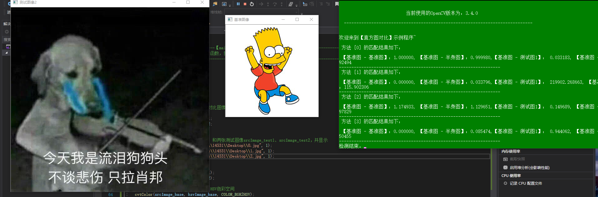

# 9.4 反向投影 #
反向投影是一种记录给定图像中的像素点如何适应直方图模型像素分布方式的一种方法。

$源代码$

```
//--------------------------------------【程序说明】-------------------------------------------
//		程序说明：《OpenCV3编程入门》OpenCV2版书本配套示例程序83
//		程序描述：反向投影示例程序
//		开发测试所用操作系统： Windows 7 64bit
//		开发测试所用IDE版本：Visual Studio 2010
//		开发测试所用OpenCV版本：	2.4.9
//		2014年06月 Created by @浅墨_毛星云
//		2014年11月 Revised by @浅墨_毛星云
//------------------------------------------------------------------------------------------------


//---------------------------------【头文件、命名空间包含部分】----------------------------
//		描述：包含程序所使用的头文件和命名空间
//------------------------------------------------------------------------------------------------
#include "opencv2/imgproc/imgproc.hpp"
#include "opencv2/highgui/highgui.hpp"
using namespace cv;


//-----------------------------------【宏定义部分】-------------------------------------------- 
//  描述：定义一些辅助宏 
//------------------------------------------------------------------------------------------------ 
#define WINDOW_NAME1 "【原始图】"        //为窗口标题定义的宏 


//-----------------------------------【全局变量声明部分】--------------------------------------
//          描述：全局变量声明
//-----------------------------------------------------------------------------------------------
Mat g_srcImage; Mat g_hsvImage; Mat g_hueImage;
int g_bins = 30;//直方图组距

//-----------------------------------【全局函数声明部分】--------------------------------------
//          描述：全局函数声明
//-----------------------------------------------------------------------------------------------
static void ShowHelpText();
void on_BinChange(int, void* );

//--------------------------------------【main( )函数】-----------------------------------------
//          描述：控制台应用程序的入口函数，我们的程序从这里开始执行
//-----------------------------------------------------------------------------------------------
int main( )
{
	//【0】改变console字体颜色
	system("color 6F"); 

	//【0】显示帮助文字
	ShowHelpText();

	//【1】读取源图像，并转换到 HSV 空间
	g_srcImage = imread( "1.jpg", 1 );
	if(!g_srcImage.data ) { printf("读取图片错误，请确定目录下是否有imread函数指定图片存在~！ \n"); return false; } 
	cvtColor( g_srcImage, g_hsvImage, CV_BGR2HSV );

	//【2】分离 Hue 色调通道
	g_hueImage.create( g_hsvImage.size(), g_hsvImage.depth() );
	int ch[ ] = { 0, 0 };
	mixChannels( &g_hsvImage, 1, &g_hueImage, 1, ch, 1 );

	//【3】创建 Trackbar 来输入bin的数目
	namedWindow( WINDOW_NAME1 , CV_WINDOW_AUTOSIZE );
	createTrackbar("色调组距 ", WINDOW_NAME1 , &g_bins, 180, on_BinChange );
	on_BinChange(0, 0);//进行一次初始化

	//【4】显示效果图
	imshow( WINDOW_NAME1 , g_srcImage );

	// 等待用户按键
	waitKey(0);
	return 0;
}


//-----------------------------------【on_HoughLines( )函数】--------------------------------
//          描述：响应滑动条移动消息的回调函数
//---------------------------------------------------------------------------------------------
void on_BinChange(int, void* )
{
	//【1】参数准备
	MatND hist;
	int histSize = MAX( g_bins, 2 );
	float hue_range[] = { 0, 180 };
	const float* ranges = { hue_range };

	//【2】计算直方图并归一化
	calcHist( &g_hueImage, 1, 0, Mat(), hist, 1, &histSize, &ranges, true, false );
	normalize( hist, hist, 0, 255, NORM_MINMAX, -1, Mat() );

	//【3】计算反向投影
	MatND backproj;
	calcBackProject( &g_hueImage, 1, 0, hist, backproj, &ranges, 1, true );

	//【4】显示反向投影
	imshow( "反向投影图", backproj );

	//【5】绘制直方图的参数准备
	int w = 400; int h = 400;
	int bin_w = cvRound( (double) w / histSize );
	Mat histImg = Mat::zeros( w, h, CV_8UC3 );

	//【6】绘制直方图
	for( int i = 0; i < g_bins; i ++ )
	{ rectangle( histImg, Point( i*bin_w, h ), Point( (i+1)*bin_w, h - cvRound( hist.at<float>(i)*h/255.0 ) ), Scalar( 100, 123, 255 ), -1 ); }

	//【7】显示直方图窗口
	imshow( "直方图", histImg );
}


//-----------------------------------【ShowHelpText( )函数】----------------------------------
//          描述：输出一些帮助信息
//----------------------------------------------------------------------------------------------
static void ShowHelpText()
{
	//输出欢迎信息和OpenCV版本
	printf("\n\n\t\t\t非常感谢购买《OpenCV3编程入门》一书！\n");
	printf("\n\n\t\t\t此为本书OpenCV2版的第83个配套示例程序\n");
	printf("\n\n\t\t\t   当前使用的OpenCV版本为：" CV_VERSION );
	printf("\n\n  ----------------------------------------------------------------------------\n");

	//输出一些帮助信息
	printf("\n\n\t欢迎来到【反向投影】示例程序\n\n"); 
	printf("\n\t请调整滑动条观察图像效果\n\n");

}

```

$运行结果$

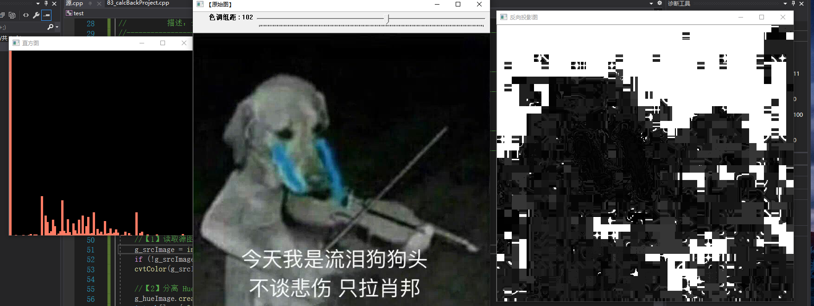

# 9.5 模板匹配 #
模板匹配是一项在一幅图像中寻找与另一幅图像最匹配部分的技术。

$源代码$

```
//--------------------------------------【程序说明】-------------------------------------------
//		程序说明：《OpenCV3编程入门》OpenCV2版书本配套示例程序84
//		程序描述：模板匹配示例
//		开发测试所用操作系统： Windows 7 64bit
//		开发测试所用IDE版本：Visual Studio 2010
//		开发测试所用OpenCV版本：	2.4.9
//		2014年06月 Created by @浅墨_毛星云
//		2014年11月 Revised by @浅墨_毛星云
//------------------------------------------------------------------------------------------------


//---------------------------------【头文件、命名空间包含部分】----------------------------
//		描述：包含程序所使用的头文件和命名空间
//------------------------------------------------------------------------------------------------
#include "opencv2/highgui/highgui.hpp"
#include "opencv2/imgproc/imgproc.hpp"
using namespace cv;


//-----------------------------------【宏定义部分】-------------------------------------------- 
//  描述：定义一些辅助宏 
//------------------------------------------------------------------------------------------------ 
#define WINDOW_NAME1 "【原始图片】"        //为窗口标题定义的宏 
#define WINDOW_NAME2 "【匹配窗口】"        //为窗口标题定义的宏 

//-----------------------------------【全局变量声明部分】------------------------------------
//          描述：全局变量的声明
//-----------------------------------------------------------------------------------------------
Mat g_srcImage; Mat g_templateImage; Mat g_resultImage;
int g_nMatchMethod;
int g_nMaxTrackbarNum = 5;

//-----------------------------------【全局函数声明部分】--------------------------------------
//          描述：全局函数的声明
//-----------------------------------------------------------------------------------------------
void on_Matching( int, void* );
static void ShowHelpText( );


//-----------------------------------【main( )函数】--------------------------------------------
//          描述：控制台应用程序的入口函数，我们的程序从这里开始执行
//-----------------------------------------------------------------------------------------------
int main(  )
{
	//【0】改变console字体颜色
	system("color 1F"); 

	//【0】显示帮助文字
	ShowHelpText();

	//【1】载入原图像和模板块
	g_srcImage = imread( "1.jpg", 1 );
	g_templateImage = imread( "2.jpg", 1 );

	//【2】创建窗口
	namedWindow( WINDOW_NAME1, CV_WINDOW_AUTOSIZE );
	namedWindow( WINDOW_NAME2, CV_WINDOW_AUTOSIZE );

	//【3】创建滑动条并进行一次初始化
	createTrackbar( "方法", WINDOW_NAME1, &g_nMatchMethod, g_nMaxTrackbarNum, on_Matching );
	on_Matching( 0, 0 );

	waitKey(0);
	return 0;

}

//-----------------------------------【on_Matching( )函数】--------------------------------
//          描述：回调函数
//-------------------------------------------------------------------------------------------
void on_Matching( int, void* )
{
	//【1】给局部变量初始化
	Mat srcImage;
	g_srcImage.copyTo( srcImage );

	//【2】初始化用于结果输出的矩阵
	int resultImage_rows = g_srcImage.rows - g_templateImage.rows + 1;
	int resultImage_cols = g_srcImage.cols - g_templateImage.cols + 1;
	g_resultImage.create(resultImage_rows, resultImage_cols, CV_32FC1);

	//【3】进行匹配和标准化
	matchTemplate( g_srcImage, g_templateImage, g_resultImage, g_nMatchMethod );
	normalize( g_resultImage, g_resultImage, 0, 1, NORM_MINMAX, -1, Mat() );

	//【4】通过函数 minMaxLoc 定位最匹配的位置
	double minValue; double maxValue; Point minLocation; Point maxLocation;
	Point matchLocation;
	minMaxLoc( g_resultImage, &minValue, &maxValue, &minLocation, &maxLocation, Mat() );

	//【5】对于方法 SQDIFF 和 SQDIFF_NORMED, 越小的数值有着更高的匹配结果. 而其余的方法, 数值越大匹配效果越好
	if( g_nMatchMethod  == CV_TM_SQDIFF || g_nMatchMethod == CV_TM_SQDIFF_NORMED )
	{ matchLocation = minLocation; }
	else
	{ matchLocation = maxLocation; }

	//【6】绘制出矩形，并显示最终结果
	rectangle( srcImage, matchLocation, Point( matchLocation.x + g_templateImage.cols , matchLocation.y + g_templateImage.rows ), Scalar(0,0,255), 2, 8, 0 );
	rectangle( g_resultImage, matchLocation, Point( matchLocation.x + g_templateImage.cols , matchLocation.y + g_templateImage.rows ), Scalar(0,0,255), 2, 8, 0 );

	imshow( WINDOW_NAME1, srcImage );
	imshow( WINDOW_NAME2, g_resultImage );

}


//-----------------------------------【ShowHelpText( )函数】----------------------------------
//          描述：输出一些帮助信息
//----------------------------------------------------------------------------------------------
static void ShowHelpText()
{
	//输出欢迎信息和OpenCV版本
	printf("\n\n\t\t\t非常感谢购买《OpenCV3编程入门》一书！\n");
	printf("\n\n\t\t\t此为本书OpenCV2版的第84个配套示例程序\n");
	printf("\n\n\t\t\t   当前使用的OpenCV版本为：" CV_VERSION );
	printf("\n\n  ----------------------------------------------------------------------------\n");
	//输出一些帮助信息
	printf("\t欢迎来到【模板匹配】示例程序~\n"); 
	printf("\n\n\t请调整滑动条观察图像效果\n\n");
	printf(  "\n\t滑动条对应的方法数值说明: \n\n" 
		"\t\t方法【0】- 平方差匹配法(SQDIFF)\n" 
		"\t\t方法【1】- 归一化平方差匹配法(SQDIFF NORMED)\n" 
		"\t\t方法【2】- 相关匹配法(TM CCORR)\n" 
		"\t\t方法【3】- 归一化相关匹配法(TM CCORR NORMED)\n" 
		"\t\t方法【4】- 相关系数匹配法(TM COEFF)\n" 
		"\t\t方法【5】- 归一化相关系数匹配法(TM COEFF NORMED)\n" );  
}
```

$运行结果$


