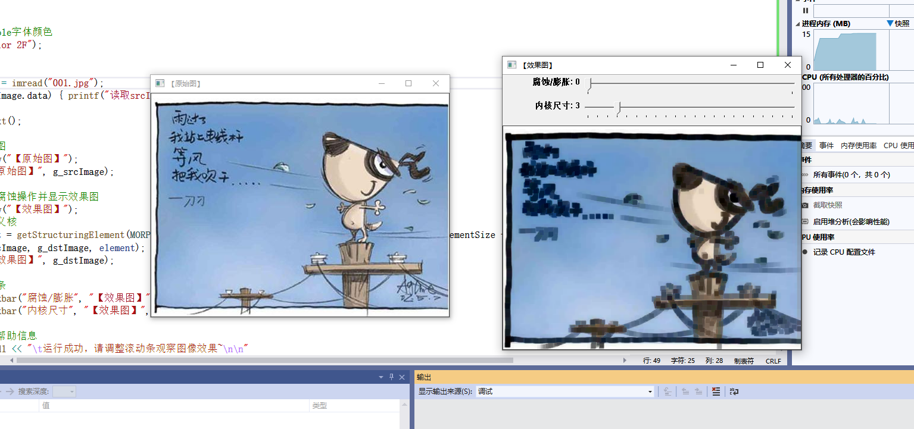
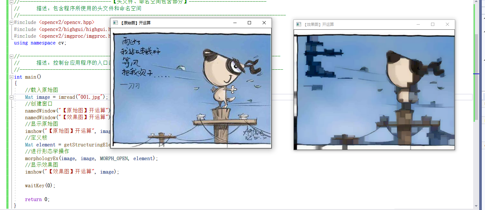
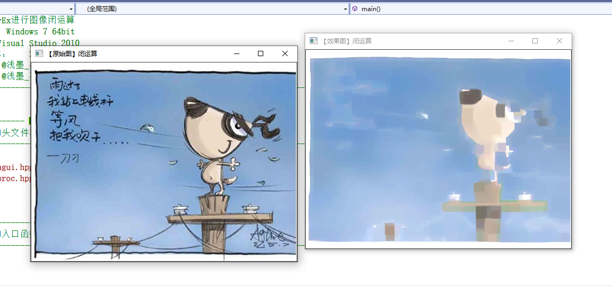
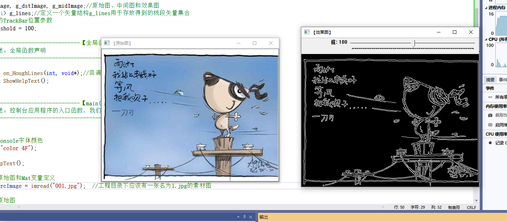
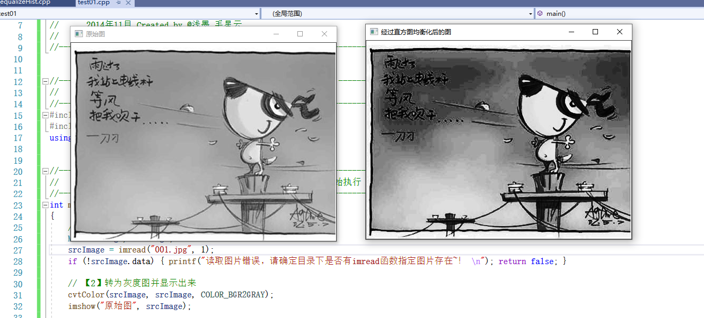
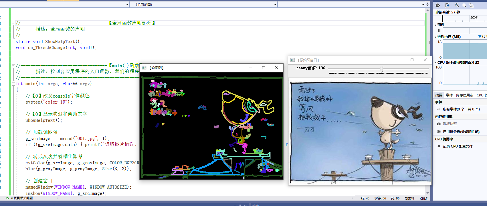
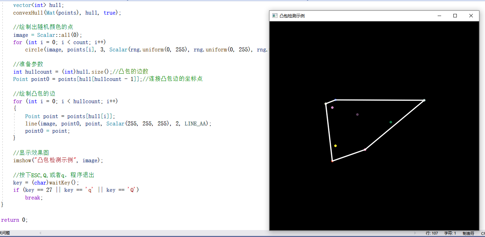
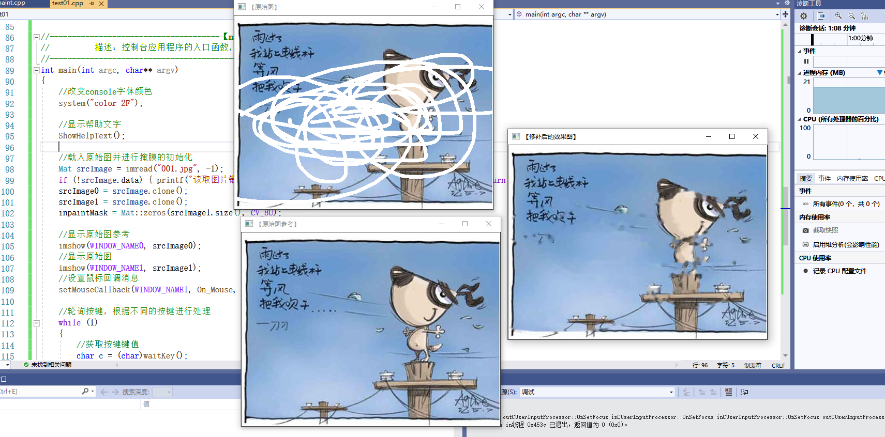

# 第三次作业
## 第6章 图像处理
### 线性滤波：方框滤波、均值滤波、高斯滤波
#### 平滑处理
平滑处理(smoothing）也称模糊处理(bluring)，是一种简单且使用频率很高的图像处理方法。平滑处理的用途有很多，最常见的是用来减少图像上的噪点或者失真。在涉及到降低图像分辨率时，平滑处理是非常好用的方法。

#### 图像滤波与滤波器
图像滤波﹐指在尽量保留图像细节特征的条件下对目标图像的噪声进行抑制，是图像预处理中不可缺少的操作，其处理效果的好坏将直接影响到后续图像处理和分析的有效性和可靠性。

消除图像中的噪声成分叫作图像的平滑化或滤波操作。信号或图像的能量大部分集中在幅度谱的低频和中频段，而在较高频段，有用的信息经常被噪声淹没。因此一个能降低高频成分幅度的滤波器就能够减弱噪声的影响。

图像滤波的目的有两个:一个是抽出对象的特征作为图像识别的特征模式;另一个是为适应图像处理的要求，消除图像数字化时所混入的噪声。

而对滤波处理的要求也有两条:一是不能损坏图像的轮廓及边缘等重要信息;二是使图像清晰视觉效果好。

关于滤波器，一种形象的比喻是:可以把滤波器想象成一个包含加权系数的窗口，当使用这个滤波器平滑处理图像时，就把这个窗口放到图像之上，透过这个窗口来看得到的图像。

滤波器的种类有很多，在新版本的OpenCV中，提供了如下5种常用的图像平滑处理操作方法，它们分别被封装在单独的函数中，使用起来非常方便。
- 方框滤波———BoxBlur函数
- 均值滤波（邻域平均滤波）——Blur函数
- 高斯滤波——GaussianBlur函数
- 中值滤波——medianBlur函数
- 双边滤波———bilateralFilter函数

#### 线性滤波器
线性滤波器经常用于剔除输入信号中不想要的频率或者从许多频率中选择一个想要的频率。

#### 滤波和模糊
用高斯滤波来作例子。滤波可分低通滤波和高通滤波两种:高斯滤波是指用高斯函数作为滤波函数的滤波操作，至于是不是模糊，要看是高斯低通还是高斯高通，低通就是模糊，高通就是锐化。

#### 邻域算子与线性邻域滤波
邻域算子（局部算子）是利用给定像素周围的像素值的决定此像素的最终输出值的一种算子。而线性邻域滤波就是一种常用的邻域算子，像素的输出值取决于输入像素的加权和。
邻域算子除了用于局部色调调整以外，还可以用于图像滤波，以实现图像的平滑和锐化，图像边缘增强或者图像噪声的去除。

#### 方框滤波( box Filter )
方框滤波（box Filter）被封装在一个名为boxblur的函数中，即 boxblur函数的作用是使用方框滤波器(box filter)来模糊一张图片，从src输入，从dst输出。

函数原型如下。
C++: void boxFilter(InputArray src,OutputArray dst, int ddepth，Sizeksize,Point anchor=Point (-1,-1), boolnormalize=true，int
borderType=BORDER_DEFAULT )

#### 均值滤波
均值滤波，是最简单的一种滤波操作，输出图像的每一个像素是核窗口内输入图像对应像素的平均值(所有像素加权系数相等)，其实说白了它就是归一化后的方框滤波。在进行源码剖析时会发现，blur函数内部中其实就是调用了一下boxFilter。

均值滤波是典型的线性滤波算法，主要方法为邻域平均法，即用一片图像区域的各个像素的均值来代替原图像中的各个像素值。

均值滤波本身存在着固有的缺陷，即它不能很好地保护图像细节，在图像去噪的同时也破坏了图像的细节部分，从而使图像变得模糊，不能很好地去除噪声点。

在OpenCV中使用均值滤波———blur函数
blur函数的作用是:对输入的图像src进行均值滤波后用dst输出。
blur函数的原型如下。
C++: void blur (InputArray src，outputArraydst,size ksize，Pointanchor=Point (-1,-1), int borderType=BORDER_DEFAULT )

#### 高斯滤波
高斯滤波是一种线性平滑滤波，可以消除高斯噪声，广泛应用于图像处理的减噪过程。通俗地讲，高斯滤波就是对整幅图像进行加权平均的过程，每一个像素点的值，都由其本身和邻域内的其他像素值经过加权平均后得到。
高斯分布参数 Sigma决定了高斯函数的宽度。

高斯滤波:GaussianBlur函数：
GaussianBlur函数的作用是用高斯滤波器来模糊一张图片，对输入的图像src进行高斯滤波后用dst输出。它将源图像和指定的高斯核函数做卷积运算，并且支持就地过滤（In-placefiltering)。
C++: void GaussianBlur(InputArray src,outputArray dst,Size ksize,double sigmax，double sigmaY=0，intborderType=BORDER_DEFAULT )

#### 图像线性滤波综合示例
```PythonPython 
#include <opencv2/core/core.hpp>
#include <opencv2/highgui/highgui.hpp>
#include <opencv2/imgproc/imgproc.hpp>
#include <iostream>

using namespace std;
using namespace cv;

//-----------------------------------【全局变量声明部分】--------------------------------------
//	描述：全局变量声明
//-----------------------------------------------------------------------------------------------
Mat g_srcImage, g_dstImage1, g_dstImage2, g_dstImage3;//存储图片的Mat类型
int g_nBoxFilterValue = 3;  //方框滤波参数值
int g_nMeanBlurValue = 3;  //均值滤波参数值
int g_nGaussianBlurValue = 3;  //高斯滤波参数值

//-----------------------------------【全局函数声明部分】--------------------------------------
//	描述：全局函数声明
//-----------------------------------------------------------------------------------------------
//四个轨迹条的回调函数
static void on_BoxFilter(int, void*);		//均值滤波
static void on_MeanBlur(int, void*);		//均值滤波
static void on_GaussianBlur(int, void*);			//高斯滤波
void ShowHelpText();

//-----------------------------------【main( )函数】--------------------------------------------
//	描述：控制台应用程序的入口函数，我们的程序从这里开始
//-----------------------------------------------------------------------------------------------
int main()
{
	//改变console字体颜色
	system("color 5F");

	//输出帮助文字
	ShowHelpText();

	// 载入原图
	g_srcImage = imread("001.jpg", 1);
	if (!g_srcImage.data) { printf("Oh，no，读取srcImage错误~！ \n"); return false; }
    //克隆原图到三个Mat类型中
	g_dstImage1 = g_srcImage.clone();
	g_dstImage2 = g_srcImage.clone();
	g_dstImage3 = g_srcImage.clone();

	//显示原图
	namedWindow("【<0>原图窗口】", 1);
	imshow("【<0>原图窗口】", g_srcImage);

    //=================【<1>方框滤波】==================
	//创建窗口
	namedWindow("【<1>方框滤波】", 1);
	//创建轨迹条
	createTrackbar("内核值：", "【<1>方框滤波】", &g_nBoxFilterValue, 40, on_BoxFilter);
	on_BoxFilter(g_nBoxFilterValue, 0);
	//================================================
    
    //=================【<2>均值滤波】==================
	//创建窗口
	namedWindow("【<2>均值滤波】", 1);
	//创建轨迹条
	createTrackbar("内核值：", "【<2>均值滤波】", &g_nMeanBlurValue, 40, on_MeanBlur);
	on_MeanBlur(g_nMeanBlurValue, 0);
	//================================================

	//=================【<3>高斯滤波】=====================
	//创建窗口
	namedWindow("【<3>高斯滤波】", 1);
	//创建轨迹条
	createTrackbar("内核值：", "【<3>高斯滤波】", &g_nGaussianBlurValue, 40, on_GaussianBlur);
	on_GaussianBlur(g_nGaussianBlurValue, 0);
	//================================================


	//输出一些帮助信息
	cout << endl << "\t运行成功，请调整滚动条观察图像效果~\n\n"
		<< "\t按下“q”键时，程序退出。\n";

	//按下“q”键时，程序退出
	while (char(waitKey(1)) != 'q') {}

	return 0;
}


//-----------------------------【on_BoxFilter( )函数】------------------------------------
//	描述：方框滤波操作的回调函数
//-----------------------------------------------------------------------------------------------
static void on_BoxFilter(int, void*)
{
	//方框滤波操作
	boxFilter(g_srcImage, g_dstImage1, -1, Size(g_nBoxFilterValue + 1, g_nBoxFilterValue + 1));
	//显示窗口
	imshow("【<1>方框滤波】", g_dstImage1);
}


//-----------------------------【on_MeanBlur( )函数】------------------------------------
//	描述：均值滤波操作的回调函数
//-----------------------------------------------------------------------------------------------
static void on_MeanBlur(int, void*)
{
	//均值滤波操作
	blur(g_srcImage, g_dstImage2, Size(g_nMeanBlurValue + 1, g_nMeanBlurValue + 1), Point(-1, -1));
	//显示窗口
	imshow("【<2>均值滤波】", g_dstImage2);
}


//-----------------------------【ContrastAndBright( )函数】------------------------------------
//	描述：高斯滤波操作的回调函数
//-----------------------------------------------------------------------------------------------
static void on_GaussianBlur(int, void*)
{
	//高斯滤波操作
	GaussianBlur(g_srcImage, g_dstImage3, Size(g_nGaussianBlurValue * 2 + 1, g_nGaussianBlurValue * 2 + 1), 0, 0);
	//显示窗口
	imshow("【<3>高斯滤波】", g_dstImage3);
}


//-----------------------------------【ShowHelpText( )函数】----------------------------------
//		 描述：输出一些帮助信息
//----------------------------------------------------------------------------------------------
void ShowHelpText()
{
	//输出欢迎信息和OpenCV版本
	printf("\n\n\t\t\t非常感谢购买《OpenCV3编程入门》一书！\n");
	printf("\n\n\t\t\t此为本书OpenCV3版的第34个配套示例程序\n");
	printf("\n\n\t\t\t   当前使用的OpenCV版本为：" CV_VERSION);
	printf("\n\n  ----------------------------------------------------------------------------\n");
}
```


#### 形态学滤波：腐蚀与膨胀
数学形态学(Mathematical morphology）是一门建立在格论和拓扑学基础之上的图像分析学科，是数学形态学图像处理的基本理论。其基本的运算包括:二值腐蚀和膨胀、二值开闭运算、骨架抽取、极限腐蚀、击中击不中变换、形态学梯度、Top-hat变换、颗粒分析、流域变换、灰值腐蚀和膨胀、灰值开闭运算、灰值形态学梯度等。

简单来讲，形态学操作就是基于形状的一系列图像处理操作。OpenCV为进行图像的形态学变换提供了快捷、方便的函数。最基本的形态学操作有两种，分别是:膨胀（dilate）与腐蚀( erode)。

膨胀与腐蚀能实现多种多样的功能，主要如下。
- 消除噪声;
- 分割( isolate）出独立的图像元素，在图像中连接（join）相邻的元素;·
- 寻找图像中的明显的极大值区域或极小值区域;
- 求出图像的梯度。

#### 膨胀
膨胀（dilate）就是求局部最大值的操作。从数学角度来说，膨胀或者腐蚀操作就是将图像（或图像的一部分区域，称之为A）与核（称之为B）进行卷积。
核可以是任何形状和大小，它拥有一个单独定义出来的参考点，我们称其为锚点( anchorpoint)。多数情况下，核是一个小的，中间带有参考点和实心正方形或者圆盘。其实，可以把核视为模板或者掩码。

而膨胀就是求局部最大值的操作。核B与图形卷积，即计算核B覆盖的区域的像素点的最大值，并把这个最大值赋值给参考点指定的像素。这样就会使图像中的高亮区域逐渐增长。如下图所示。这就是膨胀操作的初衷。

膨胀: dilate函数
dilate函数使用像素邻域内的局部极大运算符来膨胀一张图片，从 src输入，由dst输出。支持就地( in-place）操作。
函数原型如下。
C++: void dilate (
InputArray src,
outputArray dst,
InputArray kernel,
Point anchor=Point(-1,-1),
int iterations=1,
int borderType=BORDER_CONSTANT,
const Scalar& borderValue=morphologyDefaultBorderValue ()
);

#### 腐蚀
膨胀和腐蚀( erode）是相反的一对操作，所以腐蚀就是求局部最小值的操作。
腐蚀操作示例如下图所示。


腐蚀:erode函数
erode函数使用像素邻域内的局部极小运算符来腐蚀一张图片，从 src输入，由dst输出。支持就地( in-place）操作。
看一下函数原型，如下。
C++: void erode (
InputArray src,
outputArray dst,
InputArray kernel,
Point anchor=Point (-1,-1),
int iterations=1,
int borderType=BORDER_CONSTANT,
const Scalar& borderValue=morphologyDefaultBordervalue ()
);

#### 综合示例:腐蚀与膨胀
```PythonPython 
#include <opencv2/opencv.hpp>
#include <opencv2/highgui/highgui.hpp>
#include <opencv2/imgproc/imgproc.hpp>
#include <iostream>
using namespace std;
using namespace cv;


//-----------------------------------【全局变量声明部分】--------------------------------------
//		描述：全局变量声明
//-----------------------------------------------------------------------------------------------
Mat g_srcImage, g_dstImage;//原始图和效果图
int g_nTrackbarNumer = 0;//0表示腐蚀erode, 1表示膨胀dilate
int g_nStructElementSize = 3; //结构元素(内核矩阵)的尺寸


//-----------------------------------【全局函数声明部分】--------------------------------------
//		描述：全局函数声明
//-----------------------------------------------------------------------------------------------
void Process();//膨胀和腐蚀的处理函数
void on_TrackbarNumChange(int, void*);//回调函数
void on_ElementSizeChange(int, void*);//回调函数
void ShowHelpText();

//-----------------------------------【main( )函数】--------------------------------------------
//		描述：控制台应用程序的入口函数，我们的程序从这里开始
//-----------------------------------------------------------------------------------------------
int main()
{
	//改变console字体颜色
	system("color 2F");

	//载入原图
	g_srcImage = imread("001.jpg");
	if (!g_srcImage.data) { printf("读取srcImage错误~！ \n"); return false; }

	ShowHelpText();

	//显示原始图
	namedWindow("【原始图】");
	imshow("【原始图】", g_srcImage);

	//进行初次腐蚀操作并显示效果图
	namedWindow("【效果图】");
	//获取自定义核
	Mat element = getStructuringElement(MORPH_RECT, Size(2 * g_nStructElementSize + 1, 2 * g_nStructElementSize + 1), Point(g_nStructElementSize, g_nStructElementSize));
	erode(g_srcImage, g_dstImage, element);
	imshow("【效果图】", g_dstImage);

	//创建轨迹条
	createTrackbar("腐蚀/膨胀", "【效果图】", &g_nTrackbarNumer, 1, on_TrackbarNumChange);
	createTrackbar("内核尺寸", "【效果图】", &g_nStructElementSize, 21, on_ElementSizeChange);

	//输出一些帮助信息
	cout << endl << "\t运行成功，请调整滚动条观察图像效果~\n\n"
		<< "\t按下“q”键时，程序退出。\n";

	//轮询获取按键信息，若下q键，程序退出
	while (char(waitKey(1)) != 'q') {}

	return 0;
}

//-----------------------------【Process( )函数】------------------------------------
//		描述：进行自定义的腐蚀和膨胀操作
//-----------------------------------------------------------------------------------------
void Process()
{
	//获取自定义核
	Mat element = getStructuringElement(MORPH_RECT, Size(2 * g_nStructElementSize + 1, 2 * g_nStructElementSize + 1), Point(g_nStructElementSize, g_nStructElementSize));

	//进行腐蚀或膨胀操作
	if (g_nTrackbarNumer == 0) {
		erode(g_srcImage, g_dstImage, element);
	}
	else {
		dilate(g_srcImage, g_dstImage, element);
	}

	//显示效果图
	imshow("【效果图】", g_dstImage);
}


//-----------------------------【on_TrackbarNumChange( )函数】------------------------------------
//		描述：腐蚀和膨胀之间切换开关的回调函数
//-----------------------------------------------------------------------------------------------------
void on_TrackbarNumChange(int, void*)
{
	//腐蚀和膨胀之间效果已经切换，回调函数体内需调用一次Process函数，使改变后的效果立即生效并显示出来
	Process();
}


//-----------------------------【on_ElementSizeChange( )函数】-------------------------------------
//		描述：腐蚀和膨胀操作内核改变时的回调函数
//-----------------------------------------------------------------------------------------------------
void on_ElementSizeChange(int, void*)
{
	//内核尺寸已改变，回调函数体内需调用一次Process函数，使改变后的效果立即生效并显示出来
	Process();
}


//-----------------------------------【ShowHelpText( )函数】-----------------------------
//		 描述：输出一些帮助信息
//----------------------------------------------------------------------------------------------
void ShowHelpText()
{
	//输出欢迎信息和OpenCV版本
	printf("\n\n\t\t\t非常感谢购买《OpenCV3编程入门》一书！\n");
	printf("\n\n\t\t\t此为本书OpenCV3版的第40个配套示例程序\n");
	printf("\n\n\t\t\t   当前使用的OpenCV版本为：" CV_VERSION);
	printf("\n\n  ----------------------------------------------------------------------------\n");
}
```


#### 开运算
开运算(Opening Operation)，其实就是先腐蚀后膨胀的过程。其数学表达式如下:
dst=open (src,element)=dilate(erode (src,element))
开运算可以用来消除小物体，在纤细点处分离物体，并且在平滑较大物体的边界的同时不明显改变其面积。

#### 闭运算
先膨胀后腐蚀的过程称为闭运算（Closing Operation)，其数学表达式如下:
dst=clese(src,element) = erode (dilate(src,element) )
闭运算能够排除小型黑洞（黑色区域)。

#### 形态学梯度
形态学梯度（Morphological Gradient）是膨胀图与腐蚀图之差，数学表达式如下:
dst=morph-grad(src,element)= dilate(src,element)- erode(src,element)
对二值图像进行这一操作可以将团块（blob）的边缘突出出来。

#### 顶帽
顶帽运算（Top Hat）又常常被译为”礼帽“运算，是原图像与“开运算”的结果图之差，数学表达式如下:
dst=tophat (src,element) =src-open (src, element)

#### 黑帽
黑帽(Black Hat）运算是闭运算的结果图与原图像之差。数学表达式为:
dst=blackhat (src,element)=close(src,element) - src
黑帽运算后的效果图突出了比原图轮廓周围的区域更暗的区域，且这一操作和选择的核的大小相关。

#### 核心API函数:morphologyEx()
morphologyEx函数利用基本的膨胀和腐蚀技术，来执行更加高级形态学变换，如开闭运算、形态学梯度、“顶帽”、“黑帽”等。
C++: void morphologyEx(
InputArray src,
outputArray dst,
int op,
InputArraykernel,
Pointanchor=Point (-1,-1),
intiterations=1,
intborderType=BORDER_CONSTANT，
constScalar& bordervalue=morphologyDefaultBordervalue ( ) );
#### 用morphologyEx进行图像开运算
```PythonPython 
#include <opencv2/opencv.hpp>
#include <opencv2/highgui/highgui.hpp>
#include <opencv2/imgproc/imgproc.hpp>
using namespace cv;

//-----------------------------------【main( )函数】--------------------------------------------
//		描述：控制台应用程序的入口函数，我们的程序从这里开始
//-----------------------------------------------------------------------------------------------
int main( )
{
	//载入原始图   
	Mat image = imread("001.jpg");  //工程目录下应该有一张名为1.jpg的素材图
	//创建窗口   
	namedWindow("【原始图】开运算");  
	namedWindow("【效果图】开运算");  
	//显示原始图  
	imshow("【原始图】开运算", image);  
	//定义核
	Mat element = getStructuringElement(MORPH_RECT, Size(15, 15));  
	//进行形态学操作
	morphologyEx(image, image, MORPH_OPEN, element);
	//显示效果图  
	imshow("【效果图】开运算", image);  

	waitKey(0);  

	return 0;  
}
```


#### 用morphologyEx进行图像闭运算
```PythonPython 
#include <opencv2/opencv.hpp>
#include <opencv2/highgui/highgui.hpp>
#include <opencv2/imgproc/imgproc.hpp>
using namespace cv;


//-----------------------------------【main( )函数】------------------------------------------
//		描述：控制台应用程序的入口函数，我们的程序从这里开始
//-----------------------------------------------------------------------------------------------
int main()
{
	//载入原始图   
	Mat image = imread("001.jpg");  //工程目录下应该有一张名为1.jpg的素材图
	//创建窗口   
	namedWindow("【原始图】闭运算");
	namedWindow("【效果图】闭运算");
	//显示原始图  
	imshow("【原始图】闭运算", image);
	//定义核
	Mat element = getStructuringElement(MORPH_RECT, Size(15, 15));
	//进行形态学操作
	morphologyEx(image, image, MORPH_CLOSE, element);
	//显示效果图  
	imshow("【效果图】闭运算", image);

	waitKey(0);

	return 0;
}
```

#### 形态学图像处理综合示例


## 第7章 图像变换
#### 边缘检测的一般步骤
【第一步】滤波
【第二步】增强
【第三步】检测

#### canny算子
Canny的目标是找到一个最优的边缘检测算法，最优边缘检测的三个主要评价标准。
- 低错误率:标识出尽可能多的实际边缘，同时尽可能地减少噪声产生的误报。
- 高定位性:标识出的边缘要与图像中的实际边缘尽可能接近。
- 最小响应:图像中的边缘只能标识一次，并且可能存在的图像噪声不应标识为边缘。

#### Canny边缘检测的步骤
【第一步】消除噪声
【第二步】计算梯度幅值和方向
【第三步】非极大值抑制
【第四步】滞后阈值

Canny边缘检测:Canny()函数
Canny函数利用Canny算子来进行图像的边缘检测操作。
C++: void Canny(InputArray image,outputArray edges,double threshold1,double threshold2， int aperturesize=3,bool L2gradient=false )

#### sobel算子
sobel算子的基本概念
Sobel算子是一个主要用于边缘检测的离散微分算子(discrete differentiationoperator)。它结合了高斯平滑和微分求导，用来计算图像灰度函数的近似梯度。在图像的任何一点使用此算子，都将会产生对应的梯度矢量或是其法矢量。

使用Sobel算子:Sobel()函数
Sobel函数使用扩展的Sobel算子，来计算一阶、二阶、三阶或混合图像差分。
C++: void sobel (
InputArray src,
outputArray dst,
int ddepth,
int dx,
int dy,
int ksize=3,
double scale=1,
double delta=0 ,
int borderType=BORDER_DEFAULT );

#### scharr 滤波器
使用Scharr滤波器运算符计算x或y方向的图像差分。其实它的参数变量和Sobel基本上是一样的，除了没有ksize核的大小。
C++: void scharr(
InputArray src,//源图
outputArray dst,//目标图
int ddepth,//图像深度
int dx, /l x方向上的差分阶数
int dy , i l y方向上的差分阶数
double scale=1,//缩放因子
double delta=0, l/ delta值
intborderType=BORDER_DEFAULT )//边界模式

#### 边缘检测综合示例


#### 霍夫变换
霍夫变换（Hough Transform）是图像处理中的一种特征提取技术，该过程在一个参数空间中通过计算累计结果的局部最大值得到一个符合该特定形状的集合作为霍夫变换结果。

标准霍夫变换:HoughLines()函数
此函数可以找出采用标准霍夫变换的二值图像线条。在OpenCV中，我们可以用其来调用标准霍夫变换SHT和多尺度霍夫变换 MSHT的 OpenCV内建算法。
C++: void HoughLines(InputArray image，outputArray lines，double rho,double theta，int threshold，double srn=0，double stn=0 )

累计概率霍夫变换:HoughLinesPO)函数

此函数在 HoughLines的基础上，在末尾加了一个代表 Probabilistic（概率)的P，表明它可以采用累计概率霍夫变换（PPHT）来找出二值图像中的直线。

C++: void HoughLinesP(InputArray image，outputArray lines，double rho,double theta,int threshold，double minLineLength=0，double maxLineGap=0 )

霍夫圆变换:HoughCircles()函数
C++: void Houghcircles(InputArray image,outputArray circles,int method,double dp,double minDist, double param1=100 , double param2=100， intrninRadius=0, int maxRadius=0 )

#### 霍夫线变换综合示例
```PythonPython 
#include <opencv2/opencv.hpp>
#include <opencv2/highgui/highgui.hpp>
#include <opencv2/imgproc/imgproc.hpp>
using namespace std;
using namespace cv;


//-----------------------------------【全局变量声明部分】--------------------------------------
//		描述：全局变量声明
//-----------------------------------------------------------------------------------------------
Mat g_srcImage, g_dstImage, g_midImage;//原始图、中间图和效果图
vector<Vec4i> g_lines;//定义一个矢量结构g_lines用于存放得到的线段矢量集合
//变量接收的TrackBar位置参数
int g_nthreshold = 100;

//-----------------------------------【全局函数声明部分】--------------------------------------
//		描述：全局函数声明
//-----------------------------------------------------------------------------------------------

static void on_HoughLines(int, void*);//回调函数
static void ShowHelpText();


//-----------------------------------【main( )函数】--------------------------------------------
//		描述：控制台应用程序的入口函数，我们的程序从这里开始
//-----------------------------------------------------------------------------------------------
int main()
{
	//改变console字体颜色
	system("color 4F");

	ShowHelpText();

	//载入原始图和Mat变量定义   
	Mat g_srcImage = imread("001.jpg");  //工程目录下应该有一张名为1.jpg的素材图

	//显示原始图  
	imshow("【原始图】", g_srcImage);

	//创建滚动条
	namedWindow("【效果图】", 1);
	createTrackbar("值", "【效果图】", &g_nthreshold, 200, on_HoughLines);

	//进行边缘检测和转化为灰度图
	Canny(g_srcImage, g_midImage, 50, 200, 3);//进行一次canny边缘检测
	cvtColor(g_midImage, g_dstImage, COLOR_GRAY2BGR);//转化边缘检测后的图为灰度图

	//调用一次回调函数，调用一次HoughLinesP函数
	on_HoughLines(g_nthreshold, 0);
	HoughLinesP(g_midImage, g_lines, 1, CV_PI / 180, 80, 50, 10);

	//显示效果图  
	imshow("【效果图】", g_dstImage);


	waitKey(0);

	return 0;

}


//-----------------------------------【on_HoughLines( )函数】--------------------------------
//		描述：【顶帽运算/黑帽运算】窗口的回调函数
//----------------------------------------------------------------------------------------------
static void on_HoughLines(int, void*)
{
	//定义局部变量储存全局变量
	Mat dstImage = g_dstImage.clone();
	Mat midImage = g_midImage.clone();

	//调用HoughLinesP函数
	vector<Vec4i> mylines;
	HoughLinesP(midImage, mylines, 1, CV_PI / 180, g_nthreshold + 1, 50, 10);

	//循环遍历绘制每一条线段
	for (size_t i = 0; i < mylines.size(); i++)
	{
		Vec4i l = mylines[i];
		line(dstImage, Point(l[0], l[1]), Point(l[2], l[3]), Scalar(23, 180, 55), 1, LINE_AA);
	}
	//显示图像
	imshow("【效果图】", dstImage);
}

//-----------------------------------【ShowHelpText( )函数】----------------------------------
//		描述：输出一些帮助信息
//----------------------------------------------------------------------------------------------
static void ShowHelpText()
{
	//输出欢迎信息和OpenCV版本
	printf("\n\n\t\t\t非常感谢购买《OpenCV3编程入门》一书！\n");
	printf("\n\n\t\t\t此为本书OpenCV3版的第64个配套示例程序\n");
	printf("\n\n\t\t\t   当前使用的OpenCV版本为：" CV_VERSION);
	printf("\n\n  ----------------------------------------------------------------------------\n");

	//输出一些帮助信息
	printf("\n\n\n\t请调整滚动条观察图像效果~\n\n");


}
```

#### 直方图均衡化
直方图均衡化是灰度变换的一个重要应用，它高效且易于实现，广泛应用于图像增强处理中。图像的像素灰度变化是随机的，直方图的图形高低不齐，直方图均衡化就是用一定的算法使直方图大致平和的方法。

实现直方图均衡化: equalizeHist()函数
C++: void equalizeHist (InputArray src，outputArray dst)
```PythonPython
#include "opencv2/highgui/highgui.hpp"
#include "opencv2/imgproc/imgproc.hpp"
using namespace cv;


//--------------------------------------【main( )函数】-----------------------------------------
//          描述：控制台应用程序的入口函数，我们的程序从这里开始执行
//-----------------------------------------------------------------------------------------------
int main()
{
	// 【1】加载源图像
	Mat srcImage, dstImage;
	srcImage = imread("001.jpg", 1);
	if (!srcImage.data) { printf("读取图片错误，请确定目录下是否有imread函数指定图片存在~！ \n"); return false; }

	// 【2】转为灰度图并显示出来
	cvtColor(srcImage, srcImage, COLOR_BGR2GRAY);
	imshow("原始图", srcImage);

	// 【3】进行直方图均衡化
	equalizeHist(srcImage, dstImage);

	// 【4】显示结果
	imshow("经过直方图均衡化后的图", dstImage);

	// 等待用户按键退出程序
	waitKey(0);
	return 0;

}
```


## 第8章 图像轮廓与图像分割修复
#### 查找并绘制轮廓
一个轮廓一般对应一系列的点，也就是图像中的一条曲线。其表示方法可能根据不同的情况而有所不同。在OpenCV中，可以用findContours()函数从二值图像中查找轮廓.

#### 寻找轮廓: findContours()的数

findContours()函数用于在二值图像中寻找轮廓。
C++: void findContours(InputoutputArray image，outputArrayOfArrayscontours,OutputArray hierarchy，int mode，int method，Point offset=Point ( ) )

#### 绘制轮廓:drawContours()函数
drawContours()函数用于在图像中绘制外部或内部轮廓。
C++: void drawContours(InputoutputArray image，InputArrayofArrayscontours，int contourIdx，const Scalar& color，int thickness=1,intlineType=8,InputArray hierarchy=noArray ( ),int maxLevel=INT_MAX，Pointoffset=Point ( ) )

#### 查找并绘制轮廓综合示例
```PythonPython
//---------------------------------【头文件、命名空间包含部分】----------------------------
//		描述：包含程序所使用的头文件和命名空间
//------------------------------------------------------------------------------------------------
#include "opencv2/highgui/highgui.hpp"
#include "opencv2/imgproc/imgproc.hpp"
#include <iostream>
using namespace cv;
using namespace std;


//-----------------------------------【宏定义部分】-------------------------------------------- 
//		描述：定义一些辅助宏 
//------------------------------------------------------------------------------------------------ 
#define WINDOW_NAME1 "【原始图窗口】"			//为窗口标题定义的宏 
#define WINDOW_NAME2 "【轮廓图】"					//为窗口标题定义的宏 


//-----------------------------------【全局变量声明部分】--------------------------------------
//		描述：全局变量的声明
//-----------------------------------------------------------------------------------------------
Mat g_srcImage; 
Mat g_grayImage;
int g_nThresh = 80;
int g_nThresh_max = 255;
RNG g_rng(12345);
Mat g_cannyMat_output;
vector<vector<Point>> g_vContours;
vector<Vec4i> g_vHierarchy;


//-----------------------------------【全局函数声明部分】--------------------------------------
//		描述：全局函数的声明
//-----------------------------------------------------------------------------------------------
static void ShowHelpText( );
void on_ThreshChange(int, void* );


//-----------------------------------【main( )函数】--------------------------------------------
//		描述：控制台应用程序的入口函数，我们的程序从这里开始执行
//-----------------------------------------------------------------------------------------------
int main( int argc, char** argv )
{
	//【0】改变console字体颜色
	system("color 1F"); 

	//【0】显示欢迎和帮助文字
	ShowHelpText( );

	// 加载源图像
	g_srcImage = imread( "1.jpg", 1 );
	if(!g_srcImage.data ) { printf("读取图片错误，请确定目录下是否有imread函数指定的图片存在~！ \n"); return false; } 

	// 转成灰度并模糊化降噪
	cvtColor( g_srcImage, g_grayImage, COLOR_BGR2GRAY );
	blur( g_grayImage, g_grayImage, Size(3,3) );

	// 创建窗口
	namedWindow( WINDOW_NAME1, WINDOW_AUTOSIZE );
	imshow( WINDOW_NAME1, g_srcImage );

	//创建滚动条并初始化
	createTrackbar( "canny阈值", WINDOW_NAME1, &g_nThresh, g_nThresh_max, on_ThreshChange );
	on_ThreshChange( 0, 0 );

	waitKey(0);
	return(0);
}

//-----------------------------------【on_ThreshChange( )函数】------------------------------  
//      描述：回调函数
//----------------------------------------------------------------------------------------------  
void on_ThreshChange(int, void* )
{

	// 用Canny算子检测边缘
	Canny( g_grayImage, g_cannyMat_output, g_nThresh, g_nThresh*2, 3 );

	// 寻找轮廓
	findContours( g_cannyMat_output, g_vContours, g_vHierarchy, RETR_TREE, CHAIN_APPROX_SIMPLE, Point(0, 0) );

	// 绘出轮廓
	Mat drawing = Mat::zeros( g_cannyMat_output.size(), CV_8UC3 );
	for( int i = 0; i< g_vContours.size(); i++ )
	{
		Scalar color = Scalar( g_rng.uniform(0, 255), g_rng.uniform(0,255), g_rng.uniform(0,255) );//任意值
		drawContours( drawing, g_vContours, i, color, 2, 8, g_vHierarchy, 0, Point() );
	}

	// 显示效果图
	imshow( WINDOW_NAME2, drawing );
}
```

#### 凸包
凸包(Convex Hull）是一个计算几何（图形学）中常见的概念。简单来说，给定二维平面上的点集，凸包就是将最外层的点连接起来构成的凸多边型，它是能包含点集中所有点的。理解物体形状或轮廓的一种比较有用的方法便是计算一个物体的凸包，然后计算其凸缺陷(convexity defects)。很多复杂物体的特性能很好地被这种缺陷表现出来。

#### 寻找凸包:convexHull(函数
C++: void convexHull(InputArray points,outputArray hull，boolclockwise=false,bool returnPoints=true )

#### 凸包检测基础



#### 分水岭算法
在许多实际运用中，我们需要分割图像，但无法从背景图像中获得有用信息。分水岭算法 （ watershed algorithm）在这方面往往是非常有效的。此算法可以将图像中的边缘转化成“山脉”，将均匀区域转化为“山谷”，这样有助于分割目标。
分水岭算法，是一种基于拓扑理论的数学形态学的分割方法，其基本思想是把图像看作是测地学上的拓扑地貌，图像中每一点像素的灰度值表示该点的海拔高度，每一个局部极小值及其影响区域称为集水盆，而集水盆的边界则形成分水岭。

#### 实现分水岭算法:watershed()函数
C++: void watershed (InputArray image,InputoutputArray markers)

#### 分水岭算法


#### 图像修补
在实际应用中，我们的图像常常会被噪声腐蚀，这些噪声或者是镜头上的灰尘或水滴，或者是旧照片的划痕，或者由于图像的部分本身已经损坏。而“图像修复”( Inpainting)，就是妙手回春，解决这些问题的良方。图像修复技术简单来说，就是利用那些已经被破坏区域的边缘，即边缘的颜色和结构，繁殖和混合到损坏的图像中，以达到图像修补的目的。

#### 实现图像修补: inpaint()函数
C++: void inpaint (InputArray src，InputArray inpaintMask，outputArraydst, double inpaintRadius, int flags)

#### 图像修补
```PythonPython
#include "opencv2/highgui/highgui.hpp"
#include "opencv2/imgproc/imgproc.hpp"
#include "opencv2/photo/photo.hpp"
#include <iostream>
using namespace cv;
using namespace std;


//-----------------------------------【宏定义部分】-------------------------------------------- 
//  描述：定义一些辅助宏 
//----------------------------------------------------------------------------------------------
#define WINDOW_NAME0 "【原始图参考】"        //为窗口标题定义的宏 
#define WINDOW_NAME1 "【原始图】"        //为窗口标题定义的宏 
#define WINDOW_NAME2 "【修补后的效果图】"        //为窗口标题定义的宏 


//-----------------------------------【全局变量声明部分】--------------------------------------
//          描述：全局变量声明
//-----------------------------------------------------------------------------------------------
Mat srcImage0,srcImage1, inpaintMask;
Point previousPoint(-1,-1);//原来的点坐标


//-----------------------------------【ShowHelpText( )函数】----------------------------------
//          描述：输出一些帮助信息
//----------------------------------------------------------------------------------------------
static void ShowHelpText( )
{
	//输出欢迎信息和OpenCV版本
	printf("\n\n\t\t\t非常感谢购买《OpenCV3编程入门》一书！\n");
	printf("\n\n\t\t\t此为本书OpenCV3版的第78个配套示例程序\n");
	printf("\n\n\t\t\t   当前使用的OpenCV版本为：" CV_VERSION );
	printf("\n\n  ----------------------------------------------------------------------------\n");

	//输出一些帮助信息
	printf("\n\n\n\t欢迎来到【图像修复】示例程序~\n"); 
	printf(  "\n\t请在进行图像修复操作之前，在【原始图】窗口中进行适量的绘制" 
		"\n\n\t按键操作说明: \n\n" 
		"\t\t【鼠标左键】-在图像上绘制白色线条\n\n"
		"\t\t键盘按键【ESC】- 退出程序\n\n" 
		"\t\t键盘按键【1】或【SPACE】-进行图像修复操作 \n\n"   );  
}


//-----------------------------------【On_Mouse( )函数】--------------------------------
//          描述：响应鼠标消息的回调函数
//----------------------------------------------------------------------------------------------
static void On_Mouse( int event, int x, int y, int flags, void* )
{
	//鼠标左键弹起消息
	if( event == EVENT_LBUTTONUP || !(flags & EVENT_FLAG_LBUTTON) )
		previousPoint = Point(-1,-1);
	//鼠标左键按下消息
	else if( event == EVENT_LBUTTONDOWN )
		previousPoint = Point(x,y);
	//鼠标按下并移动，进行绘制
	else if( event == EVENT_MOUSEMOVE && (flags & EVENT_FLAG_LBUTTON) )
	{
		Point pt(x,y);
		if( previousPoint.x < 0 )
			previousPoint = pt;
		//绘制白色线条
		line( inpaintMask, previousPoint, pt, Scalar::all(255), 5, 8, 0 );
		line( srcImage1, previousPoint, pt, Scalar::all(255), 5, 8, 0 );
		previousPoint = pt;
		imshow(WINDOW_NAME1, srcImage1);
	}
}


//--------------------------------------【main( )函数】-----------------------------------------
//          描述：控制台应用程序的入口函数，我们的程序从这里开始执行
//-----------------------------------------------------------------------------------------------
int main( int argc, char** argv )
{
	//改变console字体颜色
	system("color 2F"); 

	//显示帮助文字
	ShowHelpText();

	//载入原始图并进行掩膜的初始化
	Mat srcImage = imread("1.jpg", -1);
	if(!srcImage.data ) { printf("读取图片错误，请确定目录下是否有imread函数指定图片存在~！ \n"); return false; } 
	srcImage0 = srcImage.clone();
	srcImage1 = srcImage.clone();
	inpaintMask = Mat::zeros(srcImage1.size(), CV_8U);

	//显示原始图参考
	imshow(WINDOW_NAME0, srcImage0);
	//显示原始图
	imshow(WINDOW_NAME1, srcImage1);
	//设置鼠标回调消息
	setMouseCallback( WINDOW_NAME1, On_Mouse, 0 );

	//轮询按键，根据不同的按键进行处理
	while (1)
	{
		//获取按键键值
		char c = (char)waitKey();

		//键值为ESC，程序退出
		if( c == 27 )
			break;

		//键值为2，恢复成原始图像
		if( c == '2' )
		{
			inpaintMask = Scalar::all(0);
			srcImage.copyTo(srcImage1);
			imshow(WINDOW_NAME1, srcImage1);
		}

		//键值为1或者空格，进行图像修补操作
		if( c == '1' || c == ' ' )
		{
			Mat inpaintedImage;
			inpaint(srcImage1, inpaintMask, inpaintedImage, 3, INPAINT_TELEA);
			imshow(WINDOW_NAME2, inpaintedImage);
		}
	}

	return 0;
}
```


## 第9章 直方图与匹配
图像直方图(Image Histogram）是用以表示数字图像中亮度分布的直方图，标绘了图像中每个亮度值的像素数。可以借助观察该直方图了解需要如何调整亮度分布。这种直方图中，横坐标的左侧为纯黑、较暗的区域，而右侧为较亮、纯白的区域。
直方图的意义如下。
- 直方图是图像中像素强度分布的图形表达方式。
- 它统计了每一个强度值所具有的像素个数。

#### 计算直方图:calcHist()函数
C++: void calcHist(const Mat* images,int nimages,const int* channels,InputArray mask,outputArray hist,int dims,const int* histSize,constfloat* * ranges,bool uniform=true,bool accumulate=false )
#### RGB三色直方图的绘制
```PythonPython
#include <opencv2/opencv.hpp>  
#include <opencv2/imgproc/imgproc.hpp>  
using namespace cv;  


//--------------------------------------【main( )函数】-----------------------------------------
//          描述：控制台应用程序的入口函数，我们的程序从这里开始执行
//-----------------------------------------------------------------------------------------------
int main(  )
{

	//【1】载入素材图并显示
	Mat srcImage;
	srcImage=imread("1.jpg");
	imshow( "素材图", srcImage );

	system("color 3F");
	ShowHelpText();

	//【2】参数准备
	int bins = 256;
	int hist_size[] = {bins};
	float range[] = { 0, 256 };
	const float* ranges[] = { range};
	MatND redHist,grayHist,blueHist;
	int channels_r[] = {0};

	//【3】进行直方图的计算（红色分量部分）
	calcHist( &srcImage, 1, channels_r, Mat(), //不使用掩膜
		redHist, 1, hist_size, ranges,
		true, false );

	//【4】进行直方图的计算（绿色分量部分）
	int channels_g[] = {1};
	calcHist( &srcImage, 1, channels_g, Mat(), // do not use mask
		grayHist, 1, hist_size, ranges,
		true, // the histogram is uniform
		false );

	//【5】进行直方图的计算（蓝色分量部分）
	int channels_b[] = {2};
	calcHist( &srcImage, 1, channels_b, Mat(), // do not use mask
		blueHist, 1, hist_size, ranges,
		true, // the histogram is uniform
		false );

	//-----------------------绘制出三色直方图------------------------
	//参数准备
	double maxValue_red,maxValue_green,maxValue_blue;
	minMaxLoc(redHist, 0, &maxValue_red, 0, 0);
	minMaxLoc(grayHist, 0, &maxValue_green, 0, 0);
	minMaxLoc(blueHist, 0, &maxValue_blue, 0, 0);
	int scale = 1;
	int histHeight=256;
	Mat histImage = Mat::zeros(histHeight,bins*3, CV_8UC3);

	//正式开始绘制
	for(int i=0;i<bins;i++)
	{
		//参数准备
		float binValue_red = redHist.at<float>(i); 
		float binValue_green = grayHist.at<float>(i);
		float binValue_blue = blueHist.at<float>(i);
		int intensity_red = cvRound(binValue_red*histHeight/maxValue_red);  //要绘制的高度
		int intensity_green = cvRound(binValue_green*histHeight/maxValue_green);  //要绘制的高度
		int intensity_blue = cvRound(binValue_blue*histHeight/maxValue_blue);  //要绘制的高度

		//绘制红色分量的直方图
		rectangle(histImage,Point(i*scale,histHeight-1),
			Point((i+1)*scale - 1, histHeight - intensity_red),
			Scalar(255,0,0));

		//绘制绿色分量的直方图
		rectangle(histImage,Point((i+bins)*scale,histHeight-1),
			Point((i+bins+1)*scale - 1, histHeight - intensity_green),
			Scalar(0,255,0));

		//绘制蓝色分量的直方图
		rectangle(histImage,Point((i+bins*2)*scale,histHeight-1),
			Point((i+bins*2+1)*scale - 1, histHeight - intensity_blue),
			Scalar(0,0,255));

	}

	//在窗口中显示出绘制好的直方图
	imshow( "图像的RGB直方图", histImage );
	waitKey(0);
	return 0;
}
```


#### 直方图对比
对于直方图来说，一个不可或缺的工具便是用某些具体的标准来比较两个直方图的相似度。要对两个直方图（比如说H1和 H2）进行比较，首先必须选择一个衡量直方图相似度的对比标准（ d(H1 ,H2))。在 OpenCV 2.X中，我们用compareHist()函数来对比两个直方图的相似度，而此函数的返回值就是d(H1,H2)。

#### 对比直方图: compareHist()函数
compareHist()函数用于对两幅直方图进行比较。有两个版本的C++原型，如下。
C++: double compareHist(InputArray Hl，InputArray H2， int method)
C++: double compareHist (const SparseMat& Hl, const SparseMat& H2,int method)

#### 直方图对比
```PythonPython
#include "opencv2/highgui/highgui.hpp"
#include "opencv2/imgproc/imgproc.hpp"
using namespace cv;

//--------------------------------------【main( )函数】-----------------------------------------
//          描述：控制台应用程序的入口函数，我们的程序从这里开始执行
//-----------------------------------------------------------------------------------------------
int main( )
{
	//【0】改变console字体颜色
	system("color 2F"); 

	//【1】显示帮助文字
	ShowHelpText();

	//【1】声明储存基准图像和另外两张对比图像的矩阵( RGB 和 HSV )
	Mat srcImage_base, hsvImage_base;
	Mat srcImage_test1, hsvImage_test1;
	Mat srcImage_test2, hsvImage_test2;
	Mat hsvImage_halfDown;

	//【2】载入基准图像(srcImage_base) 和两张测试图像srcImage_test1、srcImage_test2，并显示
	srcImage_base = imread( "1.jpg",1 );
	srcImage_test1 = imread( "2.jpg", 1 );
	srcImage_test2 = imread( "3.jpg", 1 );
	//显示载入的3张图像
	imshow("基准图像",srcImage_base);
	imshow("测试图像1",srcImage_test1);
	imshow("测试图像2",srcImage_test2);

	// 【3】将图像由BGR色彩空间转换到 HSV色彩空间
	cvtColor( srcImage_base, hsvImage_base,  COLOR_BGR2HSV );
	cvtColor( srcImage_test1, hsvImage_test1, COLOR_BGR2HSV );
	cvtColor( srcImage_test2, hsvImage_test2, COLOR_BGR2HSV );

	//【4】创建包含基准图像下半部的半身图像(HSV格式)
	hsvImage_halfDown = hsvImage_base( Range( hsvImage_base.rows/2, hsvImage_base.rows - 1 ), Range( 0, hsvImage_base.cols - 1 ) );

	//【5】初始化计算直方图需要的实参
	// 对hue通道使用30个bin,对saturatoin通道使用32个bin
	int h_bins = 50; int s_bins = 60;
	int histSize[] = { h_bins, s_bins };
	// hue的取值范围从0到256, saturation取值范围从0到180
	float h_ranges[] = { 0, 256 };
	float s_ranges[] = { 0, 180 };
	const float* ranges[] = { h_ranges, s_ranges };
	// 使用第0和第1通道
	int channels[] = { 0, 1 };

	// 【6】创建储存直方图的 MatND 类的实例:
	MatND baseHist;
	MatND halfDownHist;
	MatND testHist1;
	MatND testHist2;

	// 【7】计算基准图像，两张测试图像，半身基准图像的HSV直方图:
	calcHist( &hsvImage_base, 1, channels, Mat(), baseHist, 2, histSize, ranges, true, false );
	normalize( baseHist, baseHist, 0, 1, NORM_MINMAX, -1, Mat() );

	calcHist( &hsvImage_halfDown, 1, channels, Mat(), halfDownHist, 2, histSize, ranges, true, false );
	normalize( halfDownHist, halfDownHist, 0, 1, NORM_MINMAX, -1, Mat() );

	calcHist( &hsvImage_test1, 1, channels, Mat(), testHist1, 2, histSize, ranges, true, false );
	normalize( testHist1, testHist1, 0, 1, NORM_MINMAX, -1, Mat() );

	calcHist( &hsvImage_test2, 1, channels, Mat(), testHist2, 2, histSize, ranges, true, false );
	normalize( testHist2, testHist2, 0, 1, NORM_MINMAX, -1, Mat() );


	//【8】按顺序使用4种对比标准将基准图像的直方图与其余各直方图进行对比:
	for( int i = 0; i < 4; i++ )
	{ 
		//进行图像直方图的对比
		int compare_method = i;
		double base_base = compareHist( baseHist, baseHist, compare_method );
		double base_half = compareHist( baseHist, halfDownHist, compare_method );
		double base_test1 = compareHist( baseHist, testHist1, compare_method );
		double base_test2 = compareHist( baseHist, testHist2, compare_method );
		//输出结果
		printf( " 方法 [%d] 的匹配结果如下：\n\n 【基准图 - 基准图】：%f, 【基准图 - 半身图】：%f,【基准图 - 测试图1】： %f, 【基准图 - 测试图2】：%f \n-----------------------------------------------------------------\n", i, base_base, base_half , base_test1, base_test2 );
	}

	printf( "检测结束。" );
	waitKey(0);
	return 0;
}
```
