## 第三次作业
### 时间：2020年11月26日
### 第一部分 图像处理
#### 1.1 线性滤波
##### 1.1.1、线性滤波
平滑处理：平滑处理(smoothing）也称模糊处理(bluring)，是一种简单且使用频率很高的图像处理方法。平滑处理的用途有很多，最常见的是用来减少图像上的噪点或者失真。在涉及到降低图像分辨率时，平滑处理是非常好用的方法。

图像滤波的目的有两个:一个是抽出对象的特征作为图像识别的特征模式;另一个是为适应图像处理的要求，消除图像数字化时所混入的噪声。
而对滤波处理的要求也有两条:一是不能损坏图像的轮廓及边缘等重要信息;二是使图像清晰视觉效果好。
平滑滤波是低频增强的空间域滤波技术。它的目的有两类:一类是模糊;另一类是消除噪音。

线性滤波分为三种：方框滤波，均值滤波，高斯滤波。
方框滤波——boxblur函数
均值滤波（邻域平均滤波）——blur函数
高斯滤波——GaussianBlur函数

滤波和模糊的比较---滤波是将信号中特定波段频率滤除的操作，是抑制和防止干扰的一项重要措施。而模糊给图像预处理时候降低噪声 ， 把噪声与周围的数值平均一下就可以平滑噪声。前一个强调去除某个频段，而后者是对整体的操作。

三种滤波的比较:
```c++
#include "opencv2/core/core.hpp" 
#include "opencv2/highgui/highgui.hpp" 
#include "opencv2/imgproc/imgproc.hpp" 
using namespace cv;

int main()
{
	// 载入原图
	Mat image = imread("C:\\Users\\HUAT_IAE\\Desktop\\1.1.jpg");

	//创建窗口
	namedWindow("方框滤波【原图】");
	namedWindow("方框滤波【效果图】");

	//显示原图
	imshow("方框滤波【原图】", image);

	//进行方框滤波操作
	Mat out;
	boxFilter(image, out, -1, Size(5, 5));

	//显示效果图
	imshow("方框滤波【效果图】", out);
	Mat dstImage;
	blur(image, dstImage, Size(7, 7));

	//【4】显示效果图
	imshow("均值滤波【效果图】", dstImage);
	Mat out_image;
	GaussianBlur(image, out_image, Size(5, 5), 0, 0);

	//显示效果图
	imshow("高斯滤波【效果图】", out);

	waitKey(0);
}
```
运行效果如下：


##### 1.1.2 非线性滤波
中值滤波——medianBlur函数：中值滤波（Median filter）是一种典型的非线性滤波技术，基本思想是用像素点邻域灰度值的中值来代替该像素点的灰度值，该方法在去除脉冲噪声、椒盐噪声的同时又能保留图像边缘细节。
双边滤波——bilateralFilter函数：双边滤波（Bilateral filter）是一种非线性的滤波方法，是结合图像的空间邻近度和像素值相似度的一种折衷处理，同时考虑空域信息和灰度相似性，达到保边去噪的目的。具有简单、非迭代、局部的特点。

代码运行效果:
```c++
#include <opencv2/core/core.hpp>
#include <opencv2/highgui/highgui.hpp>
#include <opencv2/imgproc/imgproc.hpp>
#include <iostream>


using namespace std;
using namespace cv;

int main()
{

	//载入原图  
	Mat image = imread("C://Users//HUAT_IAE//Desktop//1.1.jpg");

	//创建窗口  
	namedWindow("【原图】膨胀操作");
	namedWindow("【效果图】膨胀操作");

	//显示原图
	imshow("【原图】膨胀操作", image);

	//进行膨胀操作 
	Mat element = getStructuringElement(MORPH_RECT, Size(15, 15));
	Mat out;
	dilate(image, out, element);

	//显示效果图 
	imshow("【效果图】膨胀操作", out);
	Mat dstImage;
	erode(image, dstImage, element);
	imshow("腐蚀操作", dstImage);
	waitKey(0);

	return 0;
}
```
运行结果如下：

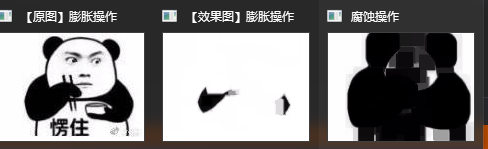

##### 形态学滤波1（膨胀与腐蚀）
形态学滤波一般分为：二种，他们是：膨胀与腐蚀(Dilation与Erosion)。
膨胀：是对高亮部分而言的，不是黑色部分。膨胀就是图像中的高亮部分进行膨胀，“领域扩张”，效果图拥有比原图更大的高亮区域。
腐蚀：是原图中的高亮部分被腐蚀，“领域被蚕食”，效果图拥有比原图更小的高亮区域。
腐蚀和膨胀综合操作
```c++
#include <opencv2/opencv.hpp>
#include <opencv2/highgui/highgui.hpp>
#include <opencv2/imgproc/imgproc.hpp>
#include <iostream>
using namespace std;
using namespace cv;


Mat g_srcImage, g_dstImage;//原始图和效果图
int g_nTrackbarNumer = 0;//0表示腐蚀erode, 1表示膨胀dilate
int g_nStructElementSize = 3; //结构元素(内核矩阵)的尺寸

void Process();//膨胀和腐蚀的处理函数
void on_TrackbarNumChange(int, void*);//回调函数
void on_ElementSizeChange(int, void*);//回调函数
void ShowHelpText();

int main()
{
	//改变console字体颜色
	system("color 2F");

	//载入原图
	g_srcImage = imread("C://Users//HUAT_IAE//Desktop//1.jpg");
	if (!g_srcImage.data) { printf("读取srcImage错误~！ \n"); return false; }

	ShowHelpText();

	//显示原始图
	namedWindow("【原始图】");
	imshow("【原始图】", g_srcImage);

	//进行初次腐蚀操作并显示效果图
	namedWindow("【效果图】");
	//获取自定义核
	Mat element = getStructuringElement(MORPH_RECT, Size(2 * g_nStructElementSize + 1, 2 * g_nStructElementSize + 1), Point(g_nStructElementSize, g_nStructElementSize));
	erode(g_srcImage, g_dstImage, element);
	imshow("【效果图】", g_dstImage);

	//创建轨迹条
	createTrackbar("腐蚀/膨胀", "【效果图】", &g_nTrackbarNumer, 1, on_TrackbarNumChange);
	createTrackbar("内核尺寸", "【效果图】", &g_nStructElementSize, 21, on_ElementSizeChange);

	//输出一些帮助信息
	cout << endl << "\t运行成功，请调整滚动条观察图像效果~\n\n"
		<< "\t按下“q”键时，程序退出。\n";

	//轮询获取按键信息，若下q键，程序退出
	while (char(waitKey(1)) != 'q') {}

	return 0;
}

void Process()
{
	//获取自定义核
	Mat element = getStructuringElement(MORPH_RECT, Size(2 * g_nStructElementSize + 1, 2 * g_nStructElementSize + 1), Point(g_nStructElementSize, g_nStructElementSize));

	//进行腐蚀或膨胀操作
	if (g_nTrackbarNumer == 0) {
		erode(g_srcImage, g_dstImage, element);
	}
	else {
		dilate(g_srcImage, g_dstImage, element);
	}

	//显示效果图
	imshow("【效果图】", g_dstImage);
}

void on_TrackbarNumChange(int, void*)
{
	//腐蚀和膨胀之间效果已经切换，回调函数体内需调用一次Process函数，使改变后的效果立即生效并显示出来
	Process();
}

void on_ElementSizeChange(int, void*)
{
	//内核尺寸已改变，回调函数体内需调用一次Process函数，使改变后的效果立即生效并显示出来
	Process();
}

void ShowHelpText()
{
	//输出欢迎信息和OpenCV版本
	printf("\n\n\t\t\t非常感谢购买《OpenCV3编程入门》一书！\n");
	printf("\n\n\t\t\t此为本书OpenCV3版的第40个配套示例程序\n");
	printf("\n\n\t\t\t   当前使用的OpenCV版本为：" CV_VERSION);
	printf("\n\n  ----------------------------------------------------------------------------\n");
}

```
运行效果如下：
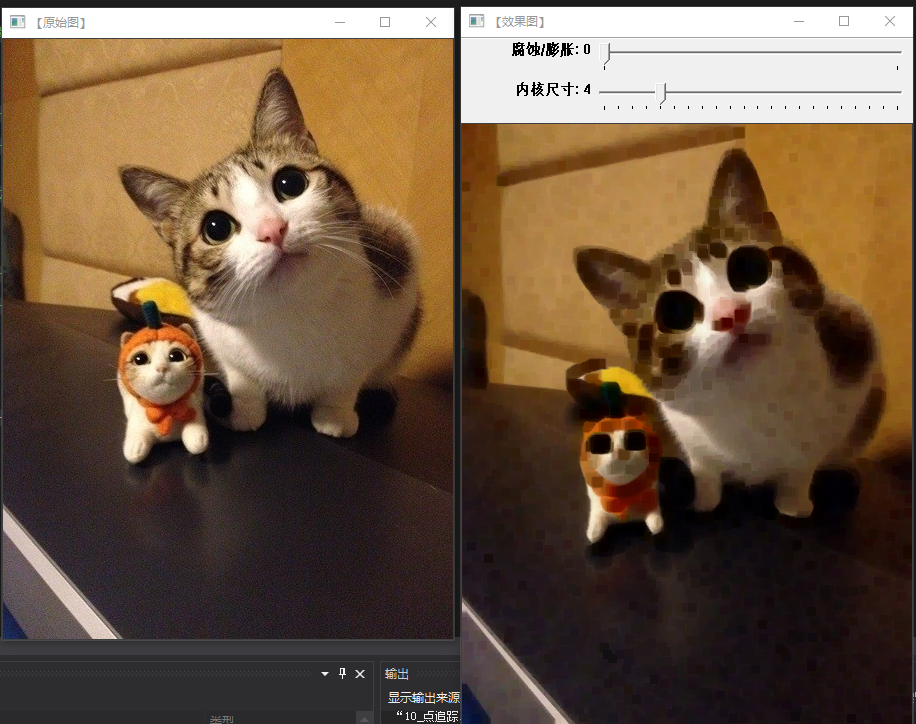
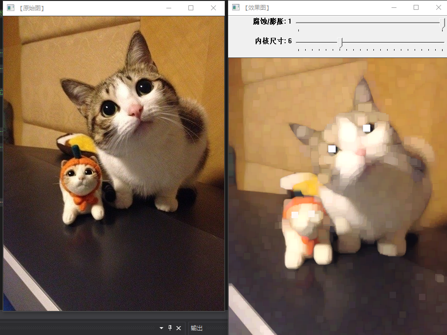

##### 形态学滤波2（开闭梯度）
开运算（Opening Operation），其实就是先腐蚀后膨胀的过程。
闭运算(Closing Operation)，先膨胀后腐蚀的过程
形态学梯度（Morphological Gradient），为膨胀图与腐蚀图之差
顶帽，原图像与上文刚刚介绍的“开运算“的结果图
黑帽（Black Hat）运算为”闭运算“的结果图与原图像之差
```c++
#include <opencv2/opencv.hpp>
#include <opencv2/highgui/highgui.hpp>
#include <opencv2/imgproc/imgproc.hpp>
using namespace std;
using namespace cv;

Mat g_srcImage, g_dstImage;//原始图和效果图
int g_nElementShape = MORPH_RECT;//元素结构的形状

//变量接收的TrackBar位置参数
int g_nMaxIterationNum = 10;
int g_nOpenCloseNum = 0;
int g_nErodeDilateNum = 0;
int g_nTopBlackHatNum = 0;

static void on_OpenClose(int, void*);//回调函数
static void on_ErodeDilate(int, void*);//回调函数
static void on_TopBlackHat(int, void*);//回调函数
static void ShowHelpText();

int main()
{
	//改变console字体颜色
	system("color 2F");

	ShowHelpText();

	//载入原图
	g_srcImage = imread("C://Users//HUAT_IAE//Desktop//1.jpg");
	if (!g_srcImage.data) { printf("Oh，no，读取srcImage错误~！ \n"); return false; }

	//显示原始图
	namedWindow("【原始图】");
	imshow("【原始图】", g_srcImage);

	//创建三个窗口
	namedWindow("【开运算/闭运算】", 1);
	namedWindow("【腐蚀/膨胀】", 1);
	namedWindow("【顶帽/黑帽】", 1);

	//参数赋值
	g_nOpenCloseNum = 9;
	g_nErodeDilateNum = 9;
	g_nTopBlackHatNum = 2;

	//分别为三个窗口创建滚动条
	createTrackbar("迭代值", "【开运算/闭运算】", &g_nOpenCloseNum, g_nMaxIterationNum * 2 + 1, on_OpenClose);
	createTrackbar("迭代值", "【腐蚀/膨胀】", &g_nErodeDilateNum, g_nMaxIterationNum * 2 + 1, on_ErodeDilate);
	createTrackbar("迭代值", "【顶帽/黑帽】", &g_nTopBlackHatNum, g_nMaxIterationNum * 2 + 1, on_TopBlackHat);

	//轮询获取按键信息
	while (1)
	{
		int c;

		//执行回调函数
		on_OpenClose(g_nOpenCloseNum, 0);
		on_ErodeDilate(g_nErodeDilateNum, 0);
		on_TopBlackHat(g_nTopBlackHatNum, 0);

		//获取按键
		c = waitKey(0);

		//按下键盘按键Q或者ESC，程序退出
		if ((char)c == 'q' || (char)c == 27)
			break;
		//按下键盘按键1，使用椭圆(Elliptic)结构元素结构元素MORPH_ELLIPSE
		if ((char)c == 49)//键盘按键1的ASII码为49
			g_nElementShape = MORPH_ELLIPSE;
		//按下键盘按键2，使用矩形(Rectangle)结构元素MORPH_RECT
		else if ((char)c == 50)//键盘按键2的ASII码为50
			g_nElementShape = MORPH_RECT;
		//按下键盘按键3，使用十字形(Cross-shaped)结构元素MORPH_CROSS
		else if ((char)c == 51)//键盘按键3的ASII码为51
			g_nElementShape = MORPH_CROSS;
		//按下键盘按键space，在矩形、椭圆、十字形结构元素中循环
		else if ((char)c == ' ')
			g_nElementShape = (g_nElementShape + 1) % 3;
	}

	return 0;
}

static void on_OpenClose(int, void*)
{
	//偏移量的定义
	int offset = g_nOpenCloseNum - g_nMaxIterationNum;//偏移量
	int Absolute_offset = offset > 0 ? offset : -offset;//偏移量绝对值
	//自定义核
	Mat element = getStructuringElement(g_nElementShape, Size(Absolute_offset * 2 + 1, Absolute_offset * 2 + 1), Point(Absolute_offset, Absolute_offset));
	//进行操作
	if (offset < 0)
		//此句代码的OpenCV2版为：
		//morphologyEx(g_srcImage, g_dstImage, CV_MOP_OPEN, element);
		//此句代码的OpenCV3版为:
		morphologyEx(g_srcImage, g_dstImage, MORPH_OPEN, element);
	else
		//此句代码的OpenCV2版为：
		//morphologyEx(g_srcImage, g_dstImage, CV_MOP_CLOSE, element);
		//此句代码的OpenCV3版为:
		morphologyEx(g_srcImage, g_dstImage, MORPH_CLOSE, element);


	//显示图像
	imshow("【开运算/闭运算】", g_dstImage);
}

static void on_ErodeDilate(int, void*)
{
	//偏移量的定义
	int offset = g_nErodeDilateNum - g_nMaxIterationNum;	//偏移量
	int Absolute_offset = offset > 0 ? offset : -offset;//偏移量绝对值
	//自定义核
	Mat element = getStructuringElement(g_nElementShape, Size(Absolute_offset * 2 + 1, Absolute_offset * 2 + 1), Point(Absolute_offset, Absolute_offset));
	//进行操作
	if (offset < 0)
		erode(g_srcImage, g_dstImage, element);
	else
		dilate(g_srcImage, g_dstImage, element);
	//显示图像
	imshow("【腐蚀/膨胀】", g_dstImage);
}

static void on_TopBlackHat(int, void*)
{
	//偏移量的定义
	int offset = g_nTopBlackHatNum - g_nMaxIterationNum;//偏移量
	int Absolute_offset = offset > 0 ? offset : -offset;//偏移量绝对值
	//自定义核
	Mat element = getStructuringElement(g_nElementShape, Size(Absolute_offset * 2 + 1, Absolute_offset * 2 + 1), Point(Absolute_offset, Absolute_offset));
	//进行操作
	if (offset < 0)
		morphologyEx(g_srcImage, g_dstImage, MORPH_TOPHAT, element);
	else
		morphologyEx(g_srcImage, g_dstImage, MORPH_BLACKHAT, element);
	//显示图像
	imshow("【顶帽/黑帽】", g_dstImage);
}

static void ShowHelpText()
{
	//输出欢迎信息和OpenCV版本
	printf("\n\n\t\t\t非常感谢购买《OpenCV3编程入门》一书！\n");
	printf("\n\n\t\t\t此为本书OpenCV3版的第48个配套示例程序\n");
	printf("\n\n\t\t\t   当前使用的OpenCV版本为：" CV_VERSION);
	printf("\n\n  ----------------------------------------------------------------------------\n");

	//输出一些帮助信息
	printf("\n\t请调整滚动条观察图像效果\n\n");
	printf("\n\t按键操作说明: \n\n"
		"\t\t键盘按键【ESC】或者【Q】- 退出程序\n"
		"\t\t键盘按键【1】- 使用椭圆(Elliptic)结构元素\n"
		"\t\t键盘按键【2】- 使用矩形(Rectangle )结构元素\n"
		"\t\t键盘按键【3】- 使用十字型(Cross-shaped)结构元素\n"
		"\t\t键盘按键【空格SPACE】- 在矩形、椭圆、十字形结构元素中循环\n");
}
```
运行后的效果:
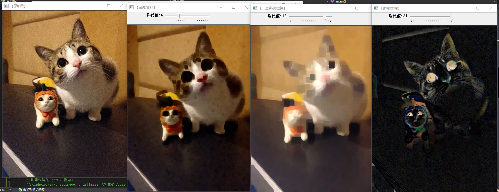
##### 漫水填充
定义:漫水填充是一种用特定的颜色填充连通区域，通过设置可联通像素的上下限以及联通方式来达到不同的填充效果的方法。
基本思想是，自动选择和种子点连接的区域，并将其代替为指定的颜色。在具体的实践中是使用内部函数floodFill()具体的函数参数看见文档。

以下代码实现利用floodfill函数使用漫水填充的方法实现对损坏图片的修复。由于代码占用的空间巨大且只涉及少数函数的引用，后面的内容将对本身函数进行解析。
```c++
int floodFill(InputoutputArray image,InputoutputArray mask,PointseedPoint,Scalar newVal,Rect* rect=0,Scalar loDiff=Scalar( ), ScalarupDiff=Scalar(), int flags=4) 
//InputoutputArray image---输入图像
//InputoutputArray mask---操作掩码
//PointseedPoint---漫水填充的起始点
//Scalar newVal---像素点被染色的值
//Rect* rect=0---设置漫水填充函数要重绘的最小边界矩形区域
//Scalar loDiff=Scalar( )---表示种子色与周边区域的色差
//ScalarupDiff=Scalar()---表示种子与待加入的最大色差
//int flags=4--记录(较为复杂)
```
代码运行结果如下图：

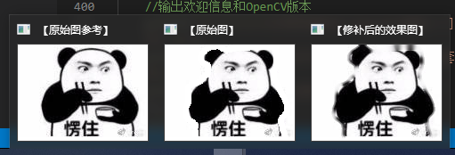
##### 图像金字塔与缩放
opencv 提供了两种方法来改变图片的尺寸
- resize函数：resize在 imgproc模块的Geometric Image Transformations子模块里。
- yurUp,yurDown函数：pyrUp、pyrDown在 OpenCV 的 imgproc模块中的Image Filtering子模块里。
图像金字塔最初用于机器视觉和图像压缩，一幅图像的金字塔是系列以金字塔形状排列的，分辨率逐步降低且来源于同一张原始图的图像集合其通过梯次向下采样获得，直到达到某个终止条件才停止采样。
#### 图像转换
- 边缘检测
边缘检测一般分为<br/>滤波：边缘检测的算法主要是基于图像强度的一阶和二阶导数，但导数通常对噪声很敏感，因此必须采用滤波器来改善与噪声有关的边缘检测器的性能。<br>
增强：增强边缘的基础是确定图像各点邻域强度的变化值。增强算法可以将图像灰度点邻域强度值有显著变化的点凸显出来。在具体编程实现时，可通过计算梯度幅值来确定。<br/>检测：经过增强的图像，往往邻域中有很多点的梯度值比较大，而在特定的应用中,文些点并不是要找的边缘点，所以应该采用某种方法来对这些点进行取舍。实际工程中，常用的方法是通过阙值化方法来检测。<br>
边缘检测的评估标准：
<br/>1.低错误率: 标识出尽可能多的实际边缘，同时尽可能的减少噪声产生的误报。<br>
2.高定位性: 标识出的边缘要与图像中的实际边缘尽可能接近.
<br/>3.最小响应: 图像中的边缘只能标识一次，并且可能存在的图像噪声不应标识为边缘。<br>
- canny算子及canny函数
canny算子的一般过程
消除噪音--->计算梯度幅值和方向--->非极大值抑制--->滞后阈值
对函数的介绍及运行效果
```c++
C++: void Canny(InputArray image,OutputArray edges, double threshold1, double threshold2, int apertureSize=3,bool L2gradient=false )
//InputArray类型的image，输入图像，即源图像，填Mat类的对象即可，且需为单通道8位图像。
//OutputArray类型的edges，输出的边缘图，需要和源图片有一样的尺寸和类型。
//double类型的threshold1，第一个滞后性阈值。
//double类型的threshold2，第二个滞后性阈值。
//int类型的apertureSize，表示应用Sobel算子的孔径大小，其有默认值3。
//bool类型的L2gradient，一个计算图像梯度幅值的标识，有默认值false。
```
运行结果如图：

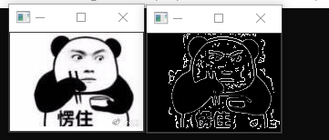
- Sobel算子
Sobel算子计算的一般过程：对图像分别在x、y上求偏导--->结合偏导结果求近似梯度。
Sodel函数的介绍及运行结果
```c++
 void Sobel (InputArray src, OutputArray dst, int ddepth, int dx, int dy,int ksize=3, double scale=1,
 double delta=0, int borderType=BORDER_DEFAULT );
//InputArray 类型的src，为输入图像，填Mat类型即可。
//OutputArray类型的dst，即目标图像，函数的输出参数，需要和源图片有一样的尺寸和类型。
/*int类型的ddepth，输出图像的深度，支持如下src.depth()和ddepth的组合：
若src.depth() = CV_8U, 取ddepth =-1/CV_16S/CV_32F/CV_64F
若src.depth() = CV_16U/CV_16S, 取ddepth =-1/CV_32F/CV_64F
若src.depth() = CV_32F, 取ddepth =-1/CV_32F/CV_64F
若src.depth() = CV_64F, 取ddepth = -1/CV_64F*/
//int类型dx，x 方向上的差分阶数。
//int类型dy，y方向上的差分阶数。
//int类型ksize，有默认值3，表示Sobel核的大小;必须取1，3，5或7。
///double类型的scale，计算导数值时可选的缩放因子，默认值是1，表示默认情况下是没有应用缩放的。我们可以在文档中查阅getDerivKernels的相关介绍，来得到这个参数的更多信息。
///double类型的delta，表示在结果存入目标图（第二个参数dst）之前可选的delta值，有默认值0。
// int类型的borderType，我们的老朋友了（万年是最后一个参数），边界模式，默认值为BORDER_DEFAULT。这个参数可以在官方文档中borderInterpolate处得到更详细的信息。
 ```
 运行结果如下：

 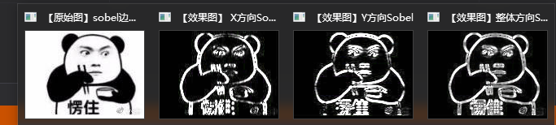
 - Laplace算子
 Laplace算子的定义:
<br/> (1) f的拉普拉斯算子也是笛卡儿坐标系xi中的所有非混合二阶偏导数求和<br>
(2) 作为一个二阶微分算子，拉普拉斯算子把C函数映射到C函数，对于k ≥ 2。表达式(1)（或(2)）定义了一个算子Δ :C(R) → C(R)，或更一般地，定义了一个算子Δ : C(Ω) → C(Ω)，对于任何开集Ω
 Laplace函数及介绍:

 ```c++
 void Laplacian(InputArray src,OutputArray dst, int ddepth, int ksize=1, double scale=1, double delta=0, intborderType=BORDER_DEFAULT );
 //第一个参数，InputArray类型的image，输入图像，即源图像，填Mat类的对象即可，且需为单通道8位图像。
//第二个参数，OutputArray类型的edges，输出的边缘图，需要和源图片有一样的尺寸和通道数。
//第三个参数，int类型的ddept，目标图像的深度。
//第四个参数，int类型的ksize，用于计算二阶导数的滤波器的孔径尺寸，大小必须为正奇数，且有默认值1。
//第五个参数，double类型的scale，计算拉普拉斯值的时候可选的比例因子，有默认值1。
//第六个参数，double类型的delta，表示在结果存入目标图（第二个参数dst）之前可选的delta值，有默认值0。
//第七个参数， int类型的borderType，边界模式，默认值为BORDER_DEFAULT。这个参数可以在官方文档中borderInterpolate()处得到更详细的信息。
 ```
 运行结果如下：

 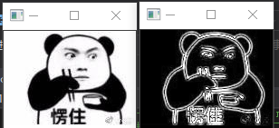
- 霍夫变换
<br/>霍夫变换(Hough Transform)是图像处理中的一种特征提取技术，该过程在一个参数空间中通过计算累计结果的局部最大值得到一个符合该特定形状的集合作为霍夫变换结果。霍夫变换在OpenCV中分为霍夫线变换和霍夫圆变换。<br>
OpenCV中的霍夫线变换有如下三种：

<br/><1>标准霍夫变换（StandardHough Transform，SHT），由HoughLines函数调用。<br>
<2>多尺度霍夫变换（Multi-ScaleHough Transform，MSHT），由HoughLines函数调用。
<br/><3>累计概率霍夫变换（ProgressiveProbabilistic Hough Transform，PPHT），由HoughLinesP函数调用。<br>
标准霍夫变换函数分析

```c++
void HoughLines(InputArray image, OutputArray lines, double rho, double theta, int threshold, double srn=0, double stn=0 )
//第一个参数，InputArray类型的image，输入图像，即源图像，需为8位的单通道二进制图像，可以将任意的源图载入进来后由函数修改成此格式后，再填在这里。
//第二个参数，InputArray类型的lines，经过调用HoughLines函数后储存了霍夫线变换检测到线条的输出矢量。每一条线由具有两个元素的矢量表示，其中，是离坐标原点((0,0)（也就是图像的左上角）的距离。 是弧度线条旋转角度（0~垂直线，π/2~水平线）。
//第三个参数，double类型的rho，以像素为单位的距离精度。另一种形容方式是直线搜索时的进步尺寸的单位半径。PS:Latex中/rho就表示 。
//第四个参数，double类型的theta，以弧度为单位的角度精度。另一种形容方式是直线搜索时的进步尺寸的单位角度。
//第五个参数，int类型的threshold，累加平面的阈值参数，即识别某部分为图中的一条直线时它在累加平面中必须达到的值。大于阈值threshold的线段才可以被检测通过并返回到结果中。
//第六个参数，double类型的srn，有默认值0。对于多尺度的霍夫变换，这是第三个参数进步尺寸rho的除数距离。粗略的累加器进步尺寸直接是第三个参数rho，而精确的累加器进步尺寸为rho/srn。
//第七个参数，double类型的stn，有默认值0，对于多尺度霍夫变换，srn表示第四个参数进步尺寸的单位角度theta的除数距离。且如果srn和stn同时为0，就表示使用经典的霍夫变换。否则，这两个参数应该都为正数。
```
多尺度霍夫变化
```c++
void HoughLinesP(InputArray image, OutputArray lines, double rho, double theta, int threshold, double minLineLength=0, double maxLineGap=0 )
//第一个参数，InputArray类型的image，输入图像，即源图像，需为8位的单通道二进制图像，可以将任意的源图载入进来后由函数修改成此格式后，再填在这里。
//第二个参数，InputArray类型的lines，经过调用HoughLinesP函数后后存储了检测到的线条的输出矢量，每一条线由具有四个元素的矢量(x_1,y_1, x_2, y_2）  表示，其中，(x_1, y_1)和(x_2, y_2) 是是每个检测到的线段的结束点。
//第三个参数，double类型的rho，以像素为单位的距离精度。另一种形容方式是直线搜索时的进步尺寸的单位半径。
//第四个参数，double类型的theta，以弧度为单位的角度精度。另一种形容方式是直线搜索时的进步尺寸的单位角度。
//第五个参数，int类型的threshold，累加平面的阈值参数，即识别某部分为图中的一条直线时它在累加平面中必须达到的值。大于阈值threshold的线段才可以被检测通过并返回到结果中。
//第六个参数，double类型的minLineLength，有默认值0，表示最低线段的长度，比这个设定参数短的线段就不能被显现出来。
//第七个参数，double类型的maxLineGap，有默认值0，允许将同一行点与点之间连接起来的最大的距离。
```
<br/>代码运行结果：<br>
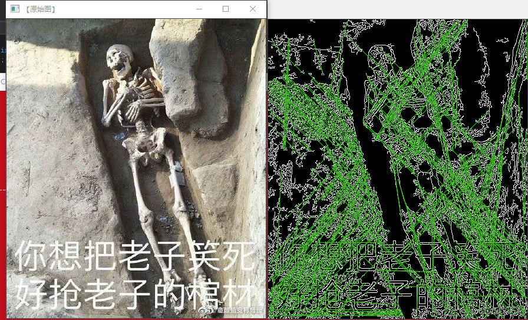

- 重映射

重映射，就是把一幅图像中某位置的像素放置到另一个图片指定位置的过程。为了完成映射过程, 我们需要获得一些插值为非整数像素的坐标,因为源图像与目标图像的像素坐标不是一一对应的。
<br/>remap( )函数解析<br>

```c++
void remap(InputArray src, OutputArraydst, InputArray map1, InputArray map2, int interpolation, intborderMode=BORDER_CONSTANT, const Scalar& borderValue=Scalar())
//第一个参数，InputArray类型的src，输入图像，即源图像，填Mat类的对象即可，且需为单通道8位或者浮点型图像。
//第二个参数，OutputArray类型的dst，函数调用后的运算结果存在这里，即这个参数用于存放函数调用后的输出结果，需和源图片有一样的尺寸和类型。
//第三个参数，InputArray类型的map1，它有两种可能的表示对象。
```
<br/>代码运行结果：<br>
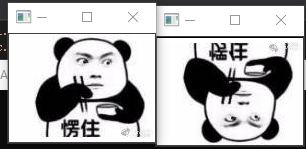
- 仿射变换
仿射变换（Affine Transformation或 Affine Map），又称仿射映射，是指在几何中，一个向量空间进行一次线性变换并接上一个平移，变换为另一个向量空间的过程。它保持了二维图形的“平直性”（即：直线经过变换之后依然是直线）和“平行性”（即：二维图形之间的相对位置关系保持不变，平行线依然是平行线，且直线上点的位置顺序不变）。

仿射变化的方法
<br/><1>已知 X和T，而且我们知道他们是有联系的. 接下来我们的工作就是求出矩阵 M<br>
<2>已知 M和X，要想求得 T. 我们只要应用算式即可. 对于这种联系的信息可以用矩阵 M 清晰的表达 (即给出明确的2×3矩阵) 或者也可以用两幅图片点之间几何关系来表达
<br/>warpAffine函数详解<br>

```c++
void warpAffine(InputArray src,OutputArray dst, InputArray M, Size dsize, int flags=INTER_LINEAR, intborderMode=BORDER_CONSTANT, const Scalar& borderValue=Scalar());
//第一个参数，InputArray类型的src，输入图像，即源图像，填Mat类的对象即可。
//第二个参数，OutputArray类型的dst，函数调用后的运算结果存在这里，需和源图片有一样的尺寸和类型。
//第三个参数，InputArray类型的M，2×3的变换矩阵。
//第四个参数，Size类型的dsize，表示输出图像的尺寸。
/*第五个参数，int类型的flags，插值方法的标识符。此参数有默认值INTER_LINEAR(线性插值)，可选的插值方式如下：
INTER_NEAREST - 最近邻插值
INTER_LINEAR - 线性插值（默认值）
INTER_AREA - 区域插值
INTER_CUBIC –三次样条插值
INTER_LANCZOS4 -Lanczos插值
CV_WARP_FILL_OUTLIERS - 填充所有输出图像的象素。如果部分象素落在输入图像的边界外，那么它们的值设定为 fillval.
CV_WARP_INVERSE_MAP –表示M为输出图像到输入图像的反变换，即 。因此可以直接用来做象素插值。否则, warpAffine函数从M矩阵得到反变换。*/
//第六个参数，int类型的borderMode，边界像素模式，默认值为BORDER_CONSTANT。
//第七个参数，const Scalar&类型的borderValue，在恒定的边界情况下取的值，默认值为Scalar()，即0。
```
<br/>测试结果：<br>
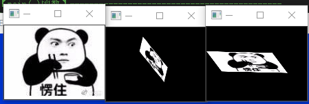
- 直方图均衡化
<br/>定义：<br>
直方图均衡化是灰度变换的一个重要应用，它高效且易于实现，广泛应用于图像增强处理中。图像的像素灰度变化是随机的，直方图的图形高低不齐，直方图均衡化就是用一定的算法使直方图大致平和的方法。简而言之，直方图均衡化是通过拉伸像素强度分布范围来增强图像对比度的一种方法。均衡化处理后的图像只能是近似均匀分布。
<br/>函数分析：<br>

```c++
void equalizeHist (InputArray src,OutputArray dst)
//第一个参数，InputArray类型的src，输入图像，即源图像，填 Mat类的对象即可，需为8位单通道的图像。
//第二个参数，OutputArray类型的 dst，函数调用后的运算结果存在这里，需和源图片有一样的尺寸和类型。
```
采用如下步骤对输入图像进行直方图均衡化。<br>
1)计算输入图像的直方图H。<br>
2）进行直方图归一化，直方图的组距的和为255。<br>
3）计算直方图积分:

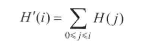
##### 图像轮廓与图像分割修复
- 寻找轮廓函数：findcontour

```c++
findContours(img, mode, method)
//img---输入的原图片
/*mode--轮廓检索模式
RETR_EXTERNAL ：只检索最外面的轮廓；
RETR_LIST：检索所有的轮廓，并将其保存到一条链表当中；
RETR_CCOMP：检索所有的轮廓，并将他们组织为两层：顶层是各部分的外部边界，第二层是空洞的边界;
RETR_TREE：检索所有的轮廓，并重构嵌套轮廓的整个层次;*/
/*metho---轮廓逼近模式
CHAIN_APPROX_NONE：以Freeman链码的方式输出轮廓，所有其他方法输出多边形（顶点的序列）。
CHAIN_APPROX_SIMPLE：压缩水平的、垂直的和斜的部分，也就是，函数只保留他们的终点部分。*/
```
<br/>绘制轮廓函数：drawContours<br>

```c++
drawContours(image, contours, contourIdx, color, thickness)
//image   输入的原图片
//contours   已经查找出的多个轮廓
//contourldx   需要绘制的轮廓的索引
//color   绘制的颜色
//thickness     绘制的粗细，如果该参数小于0，则表示填充整个轮廓内的区域
```
<br/>代码效果如下图<br>

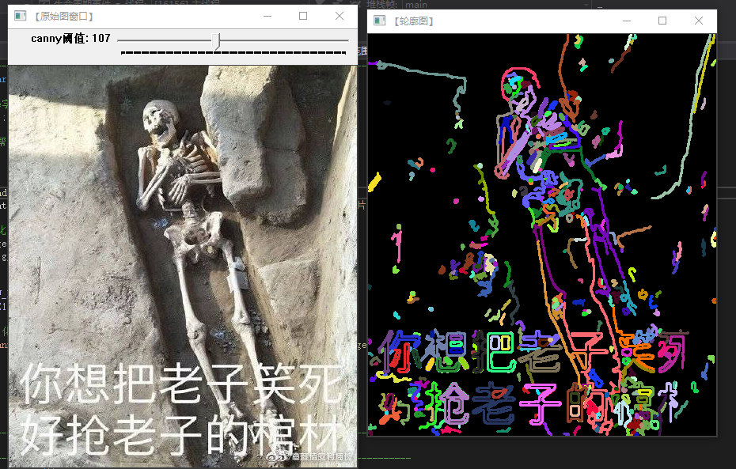
- 凸包
<br/>定义<br>
凸包（Convex Hull）是一个计算几何（图形学）中常见的概念。简单来说，给定二维平面上的点集，凸包就是将最外层的点连接起来构成的凸多边形，它是能包含点集中所有点的。理解物体形状或轮廓的一种比较有用的方法便是计算一个物体的凸包，然后计算其凸缺陷（convexity defects）。<br>
convexHull函数<br>

```c++
convexHull(points[, hull[, clockwise[, returnPoints]]])
///hull：凸包
//points：点的集合，若要处理轮廓则该参数为对应的轮廓变量
//clockwise：操作方向标识符，为True时，输出的凸包为顺时针方向，否则为逆时针方向
//returnPoints：hull参数的返回形式，若为True则hull返回点坐标的形式，若为False则返回对应点的索引值
```
多边测试函数：<br>
```c++
pointPolygonTest(contour, pt, measureDist)
//contour：轮廓信息
//pt：某点的坐标
//measureDist：当设为True时，返回值返回某点到轮廓的距离，设为False时返回0，1或-1
//retval：当某点位于轮廓内时返回一个正值，在轮廓外返回一个负值，在轮廓上返回0。例如当measureDist设为False时返回0（在轮廓上）、1（在轮廓里）或-1（在轮廓外）
```
<br/>代码测试结果：<br>
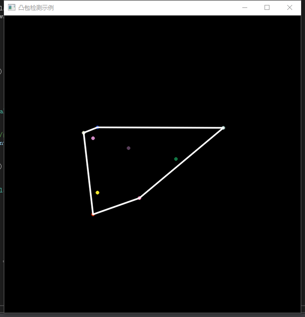
- 使用多边形包围轮廓
返回外部矩形边界-boundingRect函数
此函数计算并返回指定点集最外面(up-right)的矩形边界。 
Rect boundingRect(inputArray points) 
其唯一的参数就是输入的二维点集。
寻找最小包围矩形–minAreaRect函数
此函数用于对给定的2D点集，寻找可旋转的最小面积的包围矩形。 
RotateRect minAreaRect(inputArray points) 
其唯一的一个参数为输入的二维点集。
寻找最小包围圆形–minEnclosingCircle函数
函数的功能是利用一种迭代算法，对给定的2D点集，去寻找面积最小的可包围它们的圆形。 
void minEnclosingCircle(inputArray points,Point2f& center,float& radius) 
*第一个参数，输入的二维点集。 
*第二个参数，圆的输出圆心。 
*第三个参数，圆的输出半径。
用椭圆拟合二维点集–fitEllipse函数
此函数的作用是用椭圆拟合二维点集。 
RotateRect fitEllipse(inputArray points) 
其唯一的一个参数为输入的二维点集。
逼近多边形曲线–approxPolyDp函数
函数的作用是用指定精度逼近多边形曲线 
void approxPolyDp(inputArray curve,outputArray approxCurve,double epsilon,bool closed) 
*第一个参数，输入的二维点集。 
*第二个参数，多边形逼近的结果其类型应该和输入的二维点集的类型一致。 
*第三个参数，逼近的精度，为原始曲线和即近似曲线间的最大值。 
*第四个参数，如果其为真，则近似的曲线为封闭曲线（第一个顶点和最后一个顶点相连），否则，近似的曲线不封闭。
<br/>代码测试结果<br>
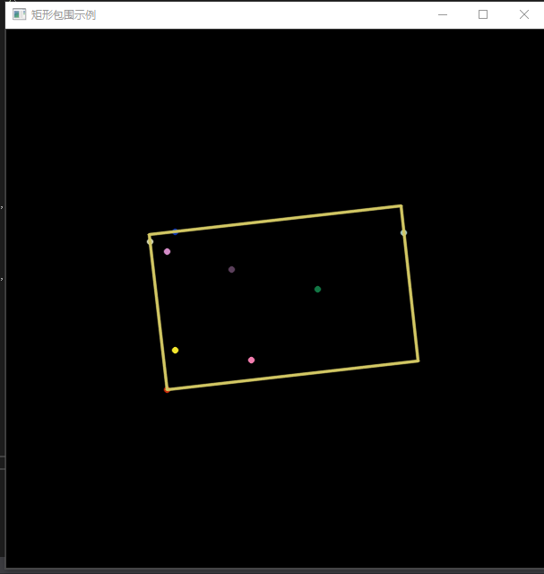

- 分水岭算法<br>
定义<br>
分水岭算法是一种图像区域分割法，在分割的过程中，它会把跟临近像素间的相似性作为重要的参考依据，从而将在空间位置上相近并且灰度值相近的像素点互相连接起来构成一个封闭的轮廓，封闭性是分水岭算法的一个重要特征。
```c++
void watershed( InputArray image, InputOutputArray markers );
//第一个参数 image，必须是一个8bit 3通道彩色图像矩阵序列，
//第一个参数没什么要说的。关键是第二个参数 markers，Opencv官方文档的说明如下：
/*大意说的是在执行分水岭函数watershed之前，必须对第二个参数markers进行处理，它应该包含不同区域的轮廓，每个轮廓有一个自己唯一的编号，轮廓的定位可以通过Opencv中findContours方法实现，这个是执行分水岭之前的要求。
接下来执行分水岭会发生什么呢？算法会根据markers传入的轮廓作为种子（也就是所谓的注水点），对图像上其他的像素点根据分水岭算法规则进行判断，并对每个像素点的区域归属进行划定，直到处理完图像上所有像素点。而区域与区域之间的分界处的值被置为“-1”，以做区分。
简单概括一下就是说第二个入参markers必须包含了种子点信息。Opencv官方例程中使用鼠标划线标记，其实就是在定义种子，只不过需要手动操作，而使用findContours可以自动标记种子点。而分水岭方法完成之后并不会直接生成分割后的图像，还需要进一步的显示处理，如此看来，只有两个参数的watershed其实并不简单。*/
```
总的概括一下watershed图像自动分割的实现步骤：
1. 图像灰度化、滤波、Canny边缘检测
2. 查找轮廓，并且把轮廓信息按照不同的编号绘制到watershed的第二个入参merkers上，相当于标记注水点。
3. watershed分水岭运算
4. 绘制分割出来的区域，视觉控还可以使用随机颜色填充，或者跟原始图像融合以下，以得到更好的显示效果。

- 图像修补
<br/>涉及函数：inpaint<br>

```c++
void inpaint( InputArray src, InputArrayinpaintMaskOutputArray dst, double inpaintRadius, int flags );
//第一个参数src，输入的单通道或三通道图像；
//第二个参数inpaintMask，图像的掩码，单通道图像，大小跟原图像一致，inpaintMask图像上除了需要修复的部分之外其他部分的像素值全部为0；
//第三个参数dst，输出的经过修复的图像；
//第四个参数inpaintRadius，修复算法取的邻域半径，用于计算当前像素点的差值；
//第五个参数flags，修复算法，有两种：INPAINT_NS 和I NPAINT_TELEA；
```
<br/>代码运行效果如图：<br>
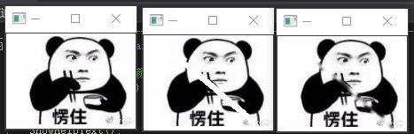

##### 直方图与匹配
<br/>定义<br>
灰度直方图(Histogram)是数字图像处理中最简单、最有用的工具之一，它概括了一幅图像的灰度级内容此处对直方图的数学原理以及OpenCV中的示例进行了展示。
<br/>直方图的一般步骤<br>
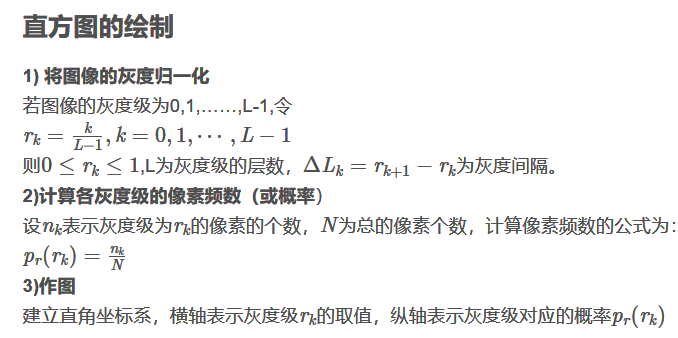

<br/>主要函数：calcHist<br>

```c++
calcHist(
				const Mat*   images,    //输入数组
				int          nimages,   //输入数组个数
				const int*   channels,  //通道索引
				InputArray   mask;      //Mat(),  //不使用腌膜
				OutputArray  hist,      //输出的目标直方图，一个二维数组
				int			 dims,      //需要计算的直方图的维度  例如：灰度，R,G,B，H,S,V等数据
				congst int*  histSize,   //存放每个维度的直方图尺寸的数组
				const float**    ranges, //每一维数组的取值范围数组
				bool          uniform=true,   
				bool          accumulate = false
			);
```
程序运行结果<br>

- 直方图的对比
运行结果如下：<br>
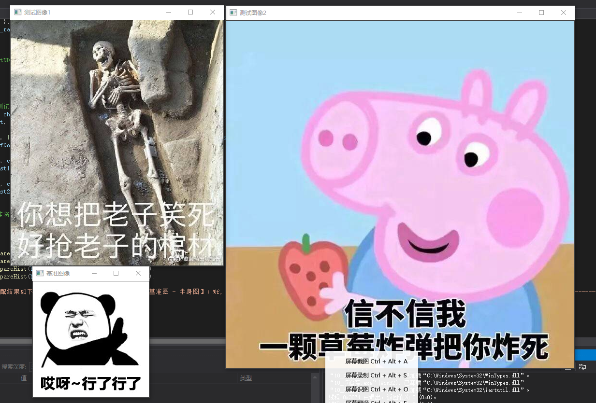
### 学习小结
这次课老师和我们讲了很多知识，比如线性滤波及非线性滤波的原理。腐蚀与膨胀，OpenCV漫水填充算法的原理。其中线性滤波包括方框滤波、均值滤波、高斯滤波，非线性滤波包括中值滤波、双边滤波。腐蚀和膨胀是相反的一对操作，它们分别是使用像素邻域内的局部极大运算符来膨胀一张图片和使用像素邻域内的局部极小运算符来腐蚀一张图片。漫水填充，就是自动选中了和种子点相连的区域，接着将该区域替换成指定的颜色。这是个非常有用的功能,经常用来标记或者分离图像的一部分进行处理或分析。
### 个人体会
我感觉太难了，需要多花时间下功夫学习知识才可以掌握！