### 第六章
#### 方框滤波操作
```C++
#include "opencv2/core/core.hpp" 
#include "opencv2/highgui/highgui.hpp" 
#include "opencv2/imgproc/imgproc.hpp" 
using namespace cv;

int main()
{
	// 载入原图
	Mat image = imread("D:\\2020\\AI\\人工智能\\1.jpg");

	//创建窗口
	namedWindow("方框滤波【原图】");
	namedWindow("方框滤波【效果图】");

	//显示原图
	imshow("方框滤波【原图】", image);

	//进行方框滤波操作
	Mat out;
	boxFilter(image, out, -1, Size(5, 5));

	//显示效果图
	imshow("方框滤波【效果图】", out);

	waitKey(0);
}
```
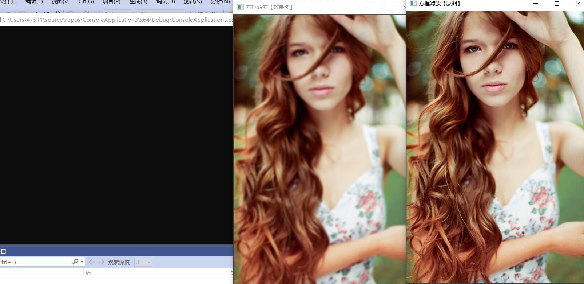

```C++

#include <opencv2/core/core.hpp>
#include <opencv2/highgui/highgui.hpp>
#include <opencv2/imgproc/imgproc.hpp>
#include <iostream>

//-----------------------------------【命名空间声明部分】---------------------------------------
//		描述：包含程序所使用的命名空间
//-----------------------------------------------------------------------------------------------  
using namespace std;
using namespace cv;


//-----------------------------------【全局变量声明部分】--------------------------------------
//		描述：全局变量声明
//-----------------------------------------------------------------------------------------------
Mat g_srcImage, g_dstImage1, g_dstImage2, g_dstImage3, g_dstImage4, g_dstImage5;
int g_nBoxFilterValue = 6;  //方框滤波内核值
int g_nMeanBlurValue = 10;  //均值滤波内核值
int g_nGaussianBlurValue = 6;  //高斯滤波内核值
int g_nMedianBlurValue = 10;  //中值滤波参数值
int g_nBilateralFilterValue = 10;  //双边滤波参数值


//-----------------------------------【全局函数声明部分】--------------------------------------
//		描述：全局函数声明
//-----------------------------------------------------------------------------------------------
//轨迹条回调函数
static void on_BoxFilter(int, void*);		//方框滤波
static void on_MeanBlur(int, void*);		//均值块滤波器
static void on_GaussianBlur(int, void*);			//高斯滤波器
static void on_MedianBlur(int, void*);			//中值滤波器
static void on_BilateralFilter(int, void*);			//双边滤波器
void ShowHelpText();

int main()
{
	system("color 4F");

	ShowHelpText();

	// 载入原图
	g_srcImage = imread("D:\\2020\\AI\\人工智能\\1.jpg", 1);
	if (!g_srcImage.data) { printf("读取srcImage错误~！ \n"); return false; }

	//克隆原图到四个Mat类型中
	g_dstImage1 = g_srcImage.clone();
	g_dstImage2 = g_srcImage.clone();
	g_dstImage3 = g_srcImage.clone();
	g_dstImage4 = g_srcImage.clone();
	g_dstImage5 = g_srcImage.clone();

	//显示原图
	namedWindow("【<0>原图窗口】", 1);
	imshow("【<0>原图窗口】", g_srcImage);


	//=================【<1>方框滤波】=========================
	//创建窗口
	namedWindow("【<1>方框滤波】", 1);
	//创建轨迹条
	createTrackbar("内核值：", "【<1>方框滤波】", &g_nBoxFilterValue, 50, on_BoxFilter);
	on_MeanBlur(g_nBoxFilterValue, 0);
	imshow("【<1>方框滤波】", g_dstImage1);
	//=====================================================


	//=================【<2>均值滤波】==========================
	//创建窗口
	namedWindow("【<2>均值滤波】", 1);
	//创建轨迹条
	createTrackbar("内核值：", "【<2>均值滤波】", &g_nMeanBlurValue, 50, on_MeanBlur);
	on_MeanBlur(g_nMeanBlurValue, 0);
	//======================================================


	//=================【<3>高斯滤波】===========================
	//创建窗口
	namedWindow("【<3>高斯滤波】", 1);
	//创建轨迹条
	createTrackbar("内核值：", "【<3>高斯滤波】", &g_nGaussianBlurValue, 50, on_GaussianBlur);
	on_GaussianBlur(g_nGaussianBlurValue, 0);
	//=======================================================


	//=================【<4>中值滤波】===========================
	//创建窗口
	namedWindow("【<4>中值滤波】", 1);
	//创建轨迹条
	createTrackbar("参数值：", "【<4>中值滤波】", &g_nMedianBlurValue, 50, on_MedianBlur);
	on_MedianBlur(g_nMedianBlurValue, 0);
	//=======================================================


	//=================【<5>双边滤波】===========================
	//创建窗口
	namedWindow("【<5>双边滤波】", 1);
	//创建轨迹条
	createTrackbar("参数值：", "【<5>双边滤波】", &g_nBilateralFilterValue, 50, on_BilateralFilter);
	on_BilateralFilter(g_nBilateralFilterValue, 0);
	//=======================================================


	//输出一些帮助信息
	cout << endl << "\t运行成功，请调整滚动条观察图像效果~\n\n"
		<< "\t按下“q”键时，程序退出。\n";
	while (char(waitKey(1)) != 'q') {}

	return 0;
}

//-----------------------------【on_BoxFilter( )函数】------------------------------------
//		描述：方框滤波操作的回调函数
//-----------------------------------------------------------------------------------------------
static void on_BoxFilter(int, void*)
{
	//方框滤波操作
	boxFilter(g_srcImage, g_dstImage1, -1, Size(g_nBoxFilterValue + 1, g_nBoxFilterValue + 1));
	//显示窗口
	imshow("【<1>方框滤波】", g_dstImage1);
}

//-----------------------------【on_MeanBlur( )函数】------------------------------------
//		描述：均值滤波操作的回调函数
//-----------------------------------------------------------------------------------------------
static void on_MeanBlur(int, void*)
{
	blur(g_srcImage, g_dstImage2, Size(g_nMeanBlurValue + 1, g_nMeanBlurValue + 1), Point(-1, -1));
	imshow("【<2>均值滤波】", g_dstImage2);

}

//-----------------------------【on_GaussianBlur( )函数】------------------------------------
//		描述：高斯滤波操作的回调函数
//-----------------------------------------------------------------------------------------------
static void on_GaussianBlur(int, void*)
{
	GaussianBlur(g_srcImage, g_dstImage3, Size(g_nGaussianBlurValue * 2 + 1, g_nGaussianBlurValue * 2 + 1), 0, 0);
	imshow("【<3>高斯滤波】", g_dstImage3);
}


//-----------------------------【on_MedianBlur( )函数】------------------------------------
//		描述：中值滤波操作的回调函数
//-----------------------------------------------------------------------------------------------
static void on_MedianBlur(int, void*)
{
	medianBlur(g_srcImage, g_dstImage4, g_nMedianBlurValue * 2 + 1);
	imshow("【<4>中值滤波】", g_dstImage4);
}


//-----------------------------【on_BilateralFilter( )函数】------------------------------------
//		描述：双边滤波操作的回调函数
//-----------------------------------------------------------------------------------------------
static void on_BilateralFilter(int, void*)
{
	bilateralFilter(g_srcImage, g_dstImage5, g_nBilateralFilterValue, g_nBilateralFilterValue * 2, g_nBilateralFilterValue / 2);
	imshow("【<5>双边滤波】", g_dstImage5);
}

//-----------------------------------【ShowHelpText( )函数】-----------------------------
//		 描述：输出一些帮助信息
//----------------------------------------------------------------------------------------------
void ShowHelpText()
{
	//输出欢迎信息和OpenCV版本
	printf("\n\n\t\t\t非常感谢购买《OpenCV3编程入门》一书！\n");
	printf("\n\n\t\t\t此为本书OpenCV3版的第37个配套示例程序\n");
	printf("\n\n\t\t\t   当前使用的OpenCV版本为：" CV_VERSION);
	printf("\n\n  ----------------------------------------------------------------------------\n");
}
```
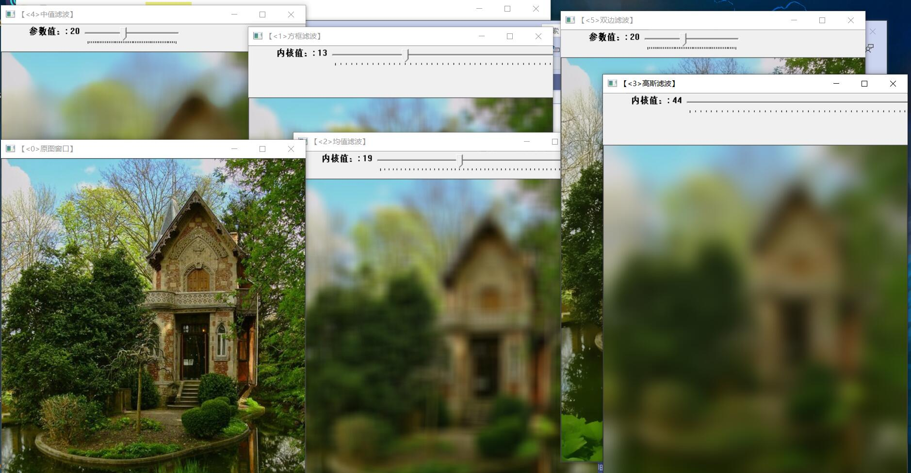

```C++
#include <opencv2/opencv.hpp>
#include <opencv2/highgui/highgui.hpp>
#include <opencv2/imgproc/imgproc.hpp>
#include <iostream>
using namespace std;
using namespace cv;


//-----------------------------------【全局变量声明部分】--------------------------------------
//		描述：全局变量声明
//-----------------------------------------------------------------------------------------------
Mat g_srcImage, g_dstImage;//原始图和效果图
int g_nTrackbarNumer = 0;//0表示腐蚀erode, 1表示膨胀dilate
int g_nStructElementSize = 3; //结构元素(内核矩阵)的尺寸


//-----------------------------------【全局函数声明部分】--------------------------------------
//		描述：全局函数声明
//-----------------------------------------------------------------------------------------------
void Process();//膨胀和腐蚀的处理函数
void on_TrackbarNumChange(int, void*);//回调函数
void on_ElementSizeChange(int, void*);//回调函数
void ShowHelpText();

//-----------------------------------【main( )函数】--------------------------------------------
//		描述：控制台应用程序的入口函数，我们的程序从这里开始
//-----------------------------------------------------------------------------------------------
int main()
{
	//改变console字体颜色
	system("color 2F");

	//载入原图
	g_srcImage = imread("D:\\2020\\AI\\人工智能\\1.jpg");
	if (!g_srcImage.data) { printf("读取srcImage错误~！ \n"); return false; }

	ShowHelpText();

	//显示原始图
	namedWindow("【原始图】");
	imshow("【原始图】", g_srcImage);

	//进行初次腐蚀操作并显示效果图
	namedWindow("【效果图】");
	//获取自定义核
	Mat element = getStructuringElement(MORPH_RECT, Size(2 * g_nStructElementSize + 1, 2 * g_nStructElementSize + 1), Point(g_nStructElementSize, g_nStructElementSize));
	erode(g_srcImage, g_dstImage, element);
	imshow("【效果图】", g_dstImage);

	//创建轨迹条
	createTrackbar("腐蚀/膨胀", "【效果图】", &g_nTrackbarNumer, 1, on_TrackbarNumChange);
	createTrackbar("内核尺寸", "【效果图】", &g_nStructElementSize, 21, on_ElementSizeChange);

	//输出一些帮助信息
	cout << endl << "\t运行成功，请调整滚动条观察图像效果~\n\n"
		<< "\t按下“q”键时，程序退出。\n";

	//轮询获取按键信息，若下q键，程序退出
	while (char(waitKey(1)) != 'q') {}

	return 0;
}

//-----------------------------【Process( )函数】------------------------------------
//		描述：进行自定义的腐蚀和膨胀操作
//-----------------------------------------------------------------------------------------
void Process()
{
	//获取自定义核
	Mat element = getStructuringElement(MORPH_RECT, Size(2 * g_nStructElementSize + 1, 2 * g_nStructElementSize + 1), Point(g_nStructElementSize, g_nStructElementSize));

	//进行腐蚀或膨胀操作
	if (g_nTrackbarNumer == 0) {
		erode(g_srcImage, g_dstImage, element);
	}
	else {
		dilate(g_srcImage, g_dstImage, element);
	}

	//显示效果图
	imshow("【效果图】", g_dstImage);
}


//-----------------------------【on_TrackbarNumChange( )函数】------------------------------------
//		描述：腐蚀和膨胀之间切换开关的回调函数
//-----------------------------------------------------------------------------------------------------
void on_TrackbarNumChange(int, void*)
{
	//腐蚀和膨胀之间效果已经切换，回调函数体内需调用一次Process函数，使改变后的效果立即生效并显示出来
	Process();
}


//-----------------------------【on_ElementSizeChange( )函数】-------------------------------------
//		描述：腐蚀和膨胀操作内核改变时的回调函数
//-----------------------------------------------------------------------------------------------------
void on_ElementSizeChange(int, void*)
{
	//内核尺寸已改变，回调函数体内需调用一次Process函数，使改变后的效果立即生效并显示出来
	Process();
}


//-----------------------------------【ShowHelpText( )函数】-----------------------------
//		 描述：输出一些帮助信息
//----------------------------------------------------------------------------------------------
void ShowHelpText()
{
	//输出欢迎信息和OpenCV版本
	printf("\n\n\t\t\t非常感谢购买《OpenCV3编程入门》一书！\n");
	printf("\n\n\t\t\t此为本书OpenCV3版的第40个配套示例程序\n");
	printf("\n\n\t\t\t   当前使用的OpenCV版本为：" CV_VERSION);
	printf("\n\n  ----------------------------------------------------------------------------\n");
}
```
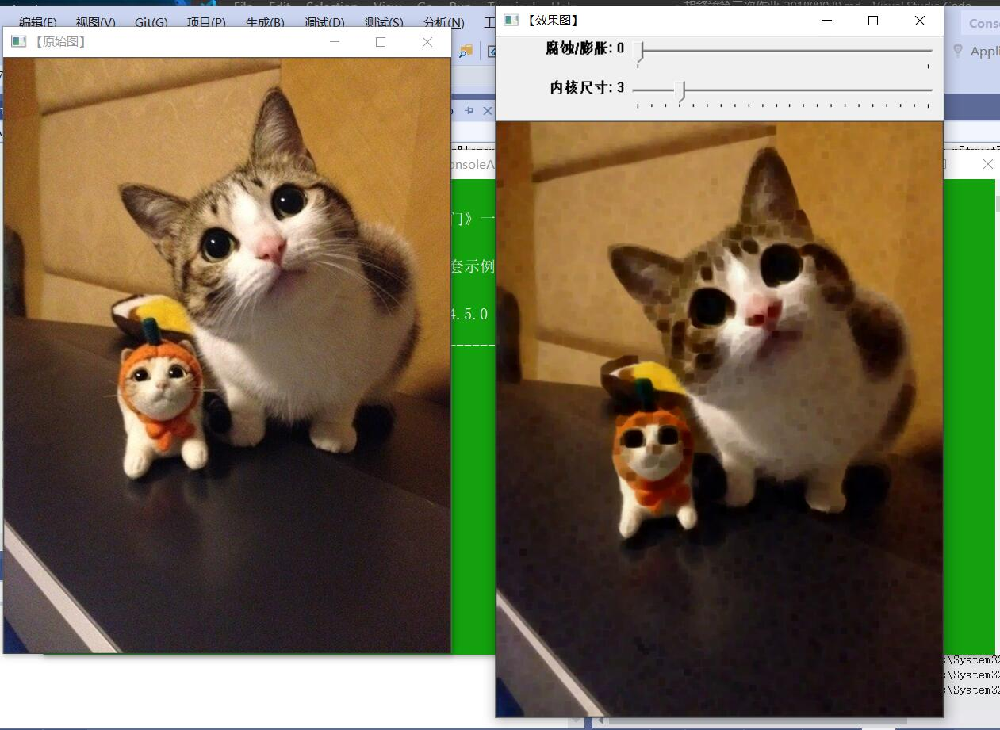


形态学图像处理综合示例
```C++
//------------------------------------------------------------------------------------------------
#include <opencv2/opencv.hpp>
#include <opencv2/highgui/highgui.hpp>
#include <opencv2/imgproc/imgproc.hpp>
using namespace std;
using namespace cv;


//-----------------------------------【全局变量声明部分】-----------------------------------
//		描述：全局变量声明
//-----------------------------------------------------------------------------------------------
Mat g_srcImage, g_dstImage;//原始图和效果图
int g_nElementShape = MORPH_RECT;//元素结构的形状

//变量接收的TrackBar位置参数
int g_nMaxIterationNum = 10;
int g_nOpenCloseNum = 0;
int g_nErodeDilateNum = 0;
int g_nTopBlackHatNum = 0;


//-----------------------------------【全局函数声明部分】--------------------------------------
//		描述：全局函数声明
//-----------------------------------------------------------------------------------------------
static void on_OpenClose(int, void*);//回调函数
static void on_ErodeDilate(int, void*);//回调函数
static void on_TopBlackHat(int, void*);//回调函数
static void ShowHelpText();


//-----------------------------------【main( )函数】--------------------------------------------
//		描述：控制台应用程序的入口函数，我们的程序从这里开始
//-----------------------------------------------------------------------------------------------
int main( )
{
	//改变console字体颜色
	system("color 2F");  

	ShowHelpText();

	//载入原图
	g_srcImage = imread("D:\\2020\\AI\\人工智能\\1.jpg");
	if( !g_srcImage.data ) { printf("Oh，no，读取srcImage错误~！ \n"); return false; }

	//显示原始图
	namedWindow("【原始图】");
	imshow("【原始图】", g_srcImage);

	//创建三个窗口
	namedWindow("【开运算/闭运算】",1);
	namedWindow("【腐蚀/膨胀】",1);
	namedWindow("【顶帽/黑帽】",1);

	//参数赋值
	g_nOpenCloseNum=9;
	g_nErodeDilateNum=9;
	g_nTopBlackHatNum=2;

	//分别为三个窗口创建滚动条
	createTrackbar("迭代值", "【开运算/闭运算】",&g_nOpenCloseNum,g_nMaxIterationNum*2+1,on_OpenClose);
	createTrackbar("迭代值", "【腐蚀/膨胀】",&g_nErodeDilateNum,g_nMaxIterationNum*2+1,on_ErodeDilate);
	createTrackbar("迭代值", "【顶帽/黑帽】",&g_nTopBlackHatNum,g_nMaxIterationNum*2+1,on_TopBlackHat);

	//轮询获取按键信息
	while(1)
	{
		int c;

		//执行回调函数
		on_OpenClose(g_nOpenCloseNum, 0);
		on_ErodeDilate(g_nErodeDilateNum, 0);
		on_TopBlackHat(g_nTopBlackHatNum,0);

		//获取按键
		c = waitKey(0);

		//按下键盘按键Q或者ESC，程序退出
		if( (char)c == 'q'||(char)c == 27 )
			break;
		//按下键盘按键1，使用椭圆(Elliptic)结构元素结构元素MORPH_ELLIPSE
		if( (char)c == 49 )//键盘按键1的ASII码为49
			g_nElementShape = MORPH_ELLIPSE;
		//按下键盘按键2，使用矩形(Rectangle)结构元素MORPH_RECT
		else if( (char)c == 50 )//键盘按键2的ASII码为50
			g_nElementShape = MORPH_RECT;
		//按下键盘按键3，使用十字形(Cross-shaped)结构元素MORPH_CROSS
		else if( (char)c == 51 )//键盘按键3的ASII码为51
			g_nElementShape = MORPH_CROSS;
		//按下键盘按键space，在矩形、椭圆、十字形结构元素中循环
		else if( (char)c == ' ' )
			g_nElementShape = (g_nElementShape + 1) % 3;
	}

	return 0;
}


//-----------------------------------【on_OpenClose( )函数】----------------------------------
//		描述：【开运算/闭运算】窗口的回调函数
//-----------------------------------------------------------------------------------------------
static void on_OpenClose(int, void*)
{
	//偏移量的定义
	int offset = g_nOpenCloseNum - g_nMaxIterationNum;//偏移量
	int Absolute_offset = offset > 0 ? offset : -offset;//偏移量绝对值
	//自定义核
	Mat element = getStructuringElement(g_nElementShape, Size(Absolute_offset*2+1, Absolute_offset*2+1), Point(Absolute_offset, Absolute_offset) );
	//进行操作
	if( offset < 0 )
		//此句代码的OpenCV2版为：
		//morphologyEx(g_srcImage, g_dstImage, CV_MOP_OPEN, element);
		//此句代码的OpenCV3版为:
		morphologyEx(g_srcImage, g_dstImage, MORPH_OPEN, element);
	else
		//此句代码的OpenCV2版为：
		//morphologyEx(g_srcImage, g_dstImage, CV_MOP_CLOSE, element);
		//此句代码的OpenCV3版为:
		morphologyEx(g_srcImage, g_dstImage, MORPH_CLOSE, element);
		


	//显示图像
	imshow("【开运算/闭运算】",g_dstImage);
}


//-----------------------------------【on_ErodeDilate( )函数】----------------------------------
//		描述：【腐蚀/膨胀】窗口的回调函数
//-----------------------------------------------------------------------------------------------
static void on_ErodeDilate(int, void*)
{
	//偏移量的定义
	int offset = g_nErodeDilateNum - g_nMaxIterationNum;	//偏移量
	int Absolute_offset = offset > 0 ? offset : -offset;//偏移量绝对值
	//自定义核
	Mat element = getStructuringElement(g_nElementShape, Size(Absolute_offset*2+1, Absolute_offset*2+1), Point(Absolute_offset, Absolute_offset) );
	//进行操作
	if( offset < 0 )
		erode(g_srcImage, g_dstImage, element);
	else
		dilate(g_srcImage, g_dstImage, element);
	//显示图像
	imshow("【腐蚀/膨胀】",g_dstImage);
}


//-----------------------------------【on_TopBlackHat( )函数】--------------------------------
//		描述：【顶帽运算/黑帽运算】窗口的回调函数
//----------------------------------------------------------------------------------------------
static void on_TopBlackHat(int, void*)
{
	//偏移量的定义
	int offset = g_nTopBlackHatNum - g_nMaxIterationNum;//偏移量
	int Absolute_offset = offset > 0 ? offset : -offset;//偏移量绝对值
	//自定义核
	Mat element = getStructuringElement(g_nElementShape, Size(Absolute_offset*2+1, Absolute_offset*2+1), Point(Absolute_offset, Absolute_offset) );
	//进行操作
	if( offset < 0 )
		morphologyEx(g_srcImage, g_dstImage, MORPH_TOPHAT , element);
	else
		morphologyEx(g_srcImage, g_dstImage, MORPH_BLACKHAT, element);
	//显示图像
	imshow("【顶帽/黑帽】",g_dstImage);
}

//-----------------------------------【ShowHelpText( )函数】----------------------------------
//		描述：输出一些帮助信息
//----------------------------------------------------------------------------------------------
static void ShowHelpText()
{
	//输出欢迎信息和OpenCV版本
	printf("\n\n\t\t\t非常感谢购买《OpenCV3编程入门》一书！\n");
	printf("\n\n\t\t\t此为本书OpenCV3版的第48个配套示例程序\n");
	printf("\n\n\t\t\t   当前使用的OpenCV版本为：" CV_VERSION );
	printf("\n\n  ----------------------------------------------------------------------------\n");

	//输出一些帮助信息
	printf("\n\t请调整滚动条观察图像效果\n\n");
	printf( "\n\t按键操作说明: \n\n"
		"\t\t键盘按键【ESC】或者【Q】- 退出程序\n"
		"\t\t键盘按键【1】- 使用椭圆(Elliptic)结构元素\n"
		"\t\t键盘按键【2】- 使用矩形(Rectangle )结构元素\n"
		"\t\t键盘按键【3】- 使用十字型(Cross-shaped)结构元素\n"
		"\t\t键盘按键【空格SPACE】- 在矩形、椭圆、十字形结构元素中循环\n"	);
}
```
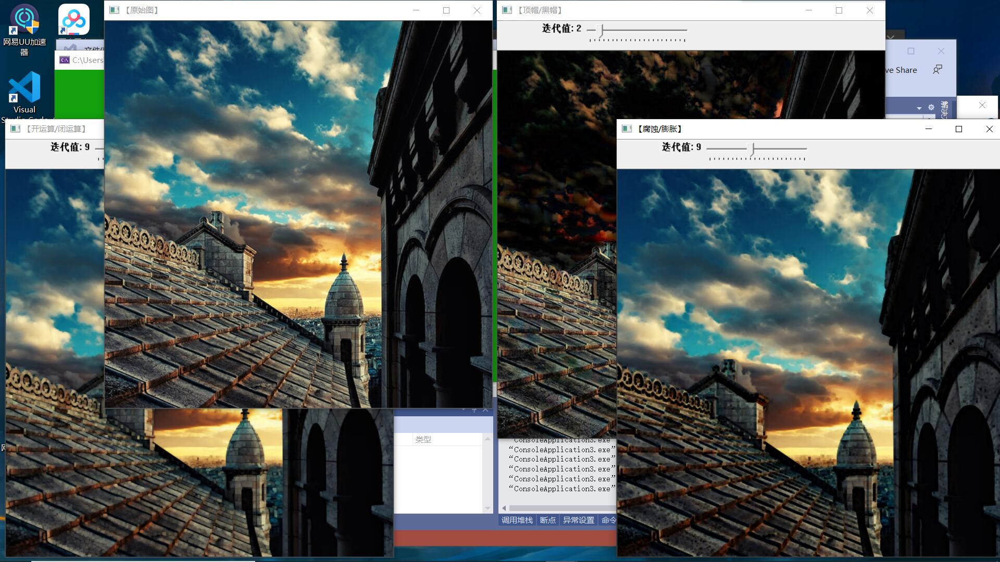

漫水填充floodFill
```C++
#include <opencv2/opencv.hpp>  
#include <opencv2/imgproc/imgproc.hpp>  
using namespace cv;

int main()
{
	Mat src = imread("D:\\2020\\AI\\人工智能\\1.jpg");
	imshow("【原始图】", src);
	Rect ccomp;
	floodFill(src, Point(50, 300), Scalar(155, 255, 55), &ccomp, Scalar(20, 20, 20), Scalar(20, 20, 20));
	imshow("【效果图】", src);
	waitKey(0);
	return 0;
}
```
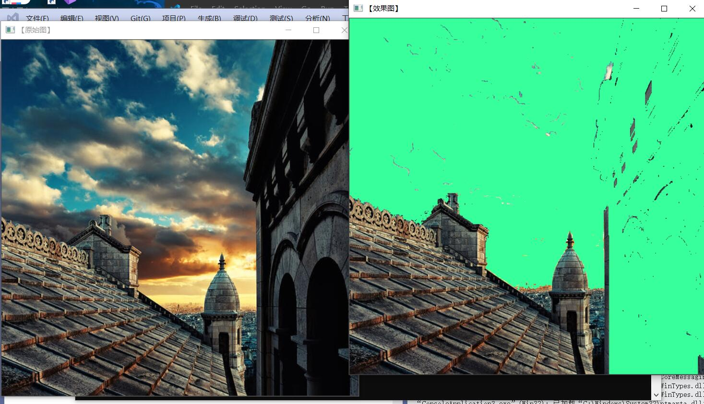
更改大小
```C++
#include <opencv2/opencv.hpp>
#include <opencv2/imgproc/imgproc.hpp>
using namespace cv;

int main()
{
	//载入原始图   
	Mat srcImage = imread("D:\\2020\\AI\\人工智能\\1.jpg");  //工程目录下应该有一张名为1.jpg的素材图
	Mat tmpImage, dstImage1, dstImage2;//临时变量和目标图的定义
	tmpImage = srcImage;//将原始图赋给临时变量

	//显示原始图  
	imshow("【原始图】", srcImage);

	//进行尺寸调整操作
	resize(tmpImage, dstImage1, Size(tmpImage.cols / 2, tmpImage.rows / 2), (0, 0), (0, 0), 3);
	resize(tmpImage, dstImage2, Size(tmpImage.cols * 2, tmpImage.rows * 2), (0, 0), (0, 0), 3);

	//显示效果图  
	imshow("【效果图】之一", dstImage1);
	imshow("【效果图】之二", dstImage2);

	waitKey(0);
	return 0;
}

```
pyrUp函数用法示例
```C++

#include <opencv2/opencv.hpp>
#include <opencv2/imgproc/imgproc.hpp>
using namespace cv;

int main()
{
	//载入原始图   
	Mat srcImage = imread("D:\\2020\\AI\\人工智能\\1.jpg");  //工程目录下应该有一张名为1.jpg的素材图
	Mat tmpImage, dstImage;//临时变量和目标图的定义
	tmpImage = srcImage;//将原始图赋给临时变量

	//显示原始图  
	imshow("【原始图】", srcImage);
	//进行向上取样操作
	pyrUp(tmpImage, dstImage, Size(tmpImage.cols * 2, tmpImage.rows * 2));
	//显示效果图  
	imshow("【效果图】", dstImage);

	waitKey(0);

	return 0;
}
```
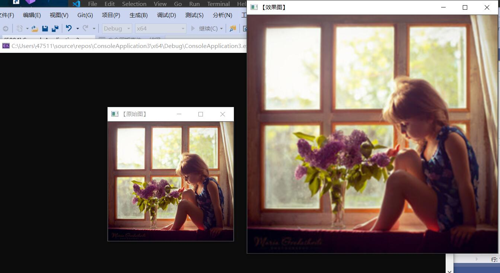

基本阈值操作
```C++

#include "opencv2/imgproc/imgproc.hpp"
#include "opencv2/highgui/highgui.hpp"
#include <iostream>
using namespace cv;
using namespace std;

#define WINDOW_NAME "【程序窗口】"        //为窗口标题定义的宏 

int g_nThresholdValue = 100;
int g_nThresholdType = 3;
Mat g_srcImage, g_grayImage, g_dstImage;

static void ShowHelpText( );//输出帮助文字
void on_Threshold( int, void* );//回调函数


int main( )
{
	//【0】改变console字体颜色
	system("color 1F"); 

	//【0】显示欢迎和帮助文字
	ShowHelpText( );

	//【1】读入源图片
	g_srcImage = imread("D:\\2020\\AI\\人工智能\\1.jpg");
	if(!g_srcImage.data ) { printf("读取图片错误，请确定目录下是否有imread函数指定的图片存在~！ \n"); return false; }  
	imshow("原始图",g_srcImage);

	//【2】存留一份原图的灰度图
	cvtColor( g_srcImage, g_grayImage, COLOR_RGB2GRAY );

	//【3】创建窗口并显示原始图
	namedWindow( WINDOW_NAME, WINDOW_AUTOSIZE );

	//【4】创建滑动条来控制阈值
	createTrackbar( "模式",
		WINDOW_NAME, &g_nThresholdType,
		4, on_Threshold );

	createTrackbar( "参数值",
		WINDOW_NAME, &g_nThresholdValue,
		255, on_Threshold );

	//【5】初始化自定义的阈值回调函数
	on_Threshold( 0, 0 );

	// 【6】轮询等待用户按键，如果ESC键按下则退出程序
	while(1)
	{
		int key;
		key = waitKey( 20 );
		if( (char)key == 27 ){ break; }
	}

}

//-----------------------------------【on_Threshold( )函数】------------------------------------
//		描述：自定义的阈值回调函数
//-----------------------------------------------------------------------------------------------
void on_Threshold( int, void* )
{
	//调用阈值函数
	threshold(g_grayImage,g_dstImage,g_nThresholdValue,255,g_nThresholdType);

	//更新效果图
	imshow( WINDOW_NAME, g_dstImage );
}

static void ShowHelpText()  
{  
	//输出欢迎信息和OpenCV版本
	printf("\n\n\t\t\t非常感谢购买《OpenCV3编程入门》一书！\n");
	printf("\n\n\t\t\t此为本书OpenCV3版的第55个配套示例程序\n");
	printf("\n\n\t\t\t   当前使用的OpenCV版本为：" CV_VERSION );
	printf("\n\n  ----------------------------------------------------------------------------\n");

	//输出一些帮助信息  
	printf(	"\n\t欢迎来到【基本阈值操作】示例程序~\n\n");  
	printf(	"\n\t按键操作说明: \n\n"  
		"\t\t键盘按键【ESC】- 退出程序\n"  
		"\t\t滚动条模式0- 二进制阈值\n"  
		"\t\t滚动条模式1- 反二进制阈值\n"  
		"\t\t滚动条模式2- 截断阈值\n"  
		"\t\t滚动条模式3- 反阈值化为0\n"  
		"\t\t滚动条模式4- 阈值化为0\n"  );  
}  

```
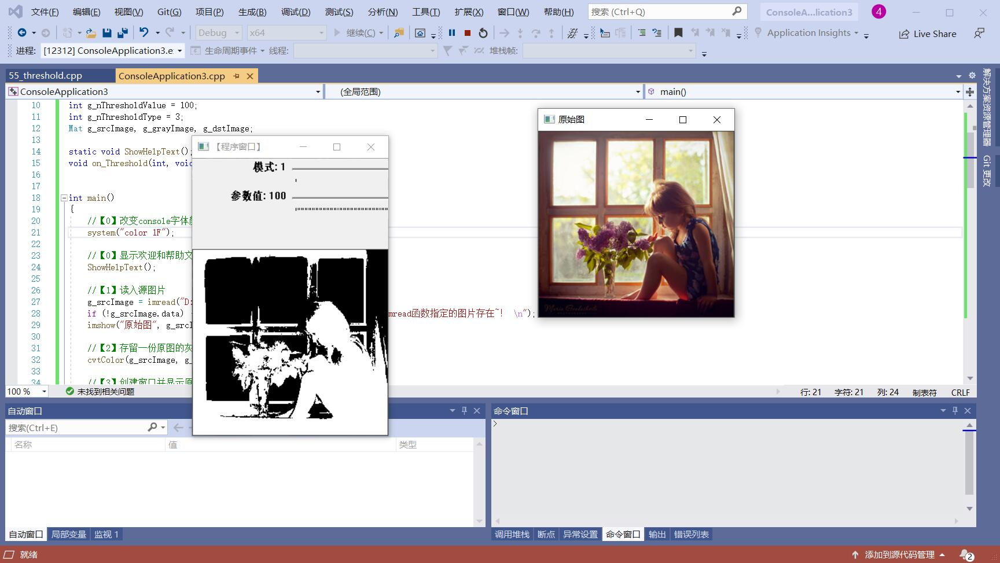

Canny边缘检测
```C++
#include <opencv2/opencv.hpp>
#include<opencv2/highgui/highgui.hpp>
#include<opencv2/imgproc/imgproc.hpp>
using namespace cv;

int main( )
{
	//载入原始图  
	Mat srcImage = imread("D:\\2020\\AI\\人工智能\\1.jpg");  //工程目录下应该有一张名为1.jpg的素材图
	Mat srcImage1=srcImage.clone();

	//显示原始图 
	imshow("【原始图】Canny边缘检测", srcImage); 

	Mat dstImage,edge,grayImage;

	// 【1】创建与src同类型和大小的矩阵(dst)
	dstImage.create( srcImage1.size(), srcImage1.type() );

	// 【2】将原图像转换为灰度图像
	cvtColor( srcImage1, grayImage, COLOR_BGR2GRAY );

	// 【3】先用使用 3x3内核来降噪
	blur( grayImage, edge, Size(3,3) );

	// 【4】运行Canny算子
	Canny( edge, edge, 3, 9,3 );

	//【5】将g_dstImage内的所有元素设置为0 
	dstImage = Scalar::all(0);

	//【6】使用Canny算子输出的边缘图g_cannyDetectedEdges作为掩码，来将原图g_srcImage拷到目标图g_dstImage中
	srcImage1.copyTo( dstImage, edge);

	//【7】显示效果图 
	imshow("【效果图】Canny边缘检测2", dstImage); 


	waitKey(0); 

	return 0; 
}
```
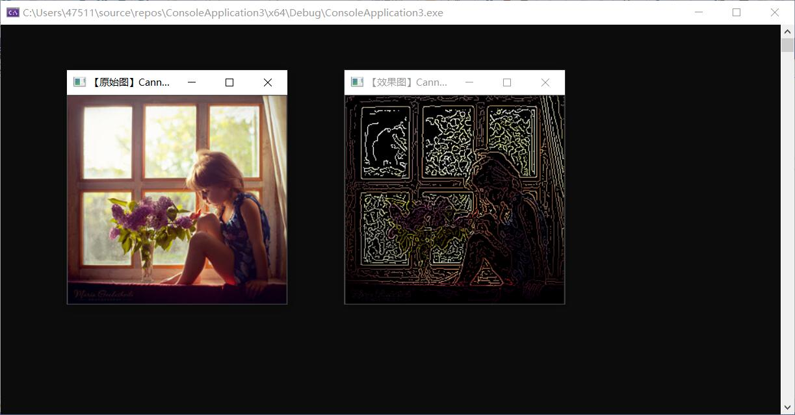

sobel算法
```C++
#include <opencv2/opencv.hpp>
#include<opencv2/highgui/highgui.hpp>
#include<opencv2/imgproc/imgproc.hpp>

using namespace cv;

int main()
{
	//【0】创建 grad_x 和 grad_y 矩阵
	Mat grad_x, grad_y;
	Mat abs_grad_x, abs_grad_y, dst;

	//【1】载入原始图  
	Mat src = imread("D:\\2020\\AI\\人工智能\\1.jpg");  //工程目录下应该有一张名为1.jpg的素材图

	//【2】显示原始图 
	imshow("【原始图】sobel边缘检测", src);

	//【3】求 X方向梯度
	Sobel(src, grad_x, CV_16S, 1, 0, 3, 1, 1, BORDER_DEFAULT);
	convertScaleAbs(grad_x, abs_grad_x);
	imshow("【效果图】 X方向Sobel", abs_grad_x);

	//【4】求Y方向梯度
	Sobel(src, grad_y, CV_16S, 0, 1, 3, 1, 1, BORDER_DEFAULT);
	convertScaleAbs(grad_y, abs_grad_y);
	imshow("【效果图】Y方向Sobel", abs_grad_y);

	//【5】合并梯度(近似)
	addWeighted(abs_grad_x, 0.5, abs_grad_y, 0.5, 0, dst);
	imshow("【效果图】整体方向Sobel", dst);

	waitKey(0);
	return 0;
}
```

```C++

#include <opencv2/highgui/highgui.hpp>
#include <opencv2/imgproc/imgproc.hpp>
using namespace cv;

//原图，原图的灰度版，目标图
Mat g_srcImage, g_srcGrayImage, g_dstImage;

//Canny边缘检测相关变量
Mat g_cannyDetectedEdges;
int g_cannyLowThreshold = 1;//TrackBar位置参数  

//Sobel边缘检测相关变量
Mat g_sobelGradient_X, g_sobelGradient_Y;
Mat g_sobelAbsGradient_X, g_sobelAbsGradient_Y;
int g_sobelKernelSize = 1;//TrackBar位置参数  

//Scharr滤波器相关变量
Mat g_scharrGradient_X, g_scharrGradient_Y;
Mat g_scharrAbsGradient_X, g_scharrAbsGradient_Y;


//-----------------------------------【全局函数声明部分】--------------------------------------
//		描述：全局函数声明
//-----------------------------------------------------------------------------------------------
static void ShowHelpText();
static void on_Canny(int, void*);//Canny边缘检测窗口滚动条的回调函数
static void on_Sobel(int, void*);//Sobel边缘检测窗口滚动条的回调函数
void Scharr();//封装了Scharr边缘检测相关代码的函数


//-----------------------------------【main( )函数】--------------------------------------------
//		描述：控制台应用程序的入口函数，我们的程序从这里开始
//-----------------------------------------------------------------------------------------------
int main(int argc, char** argv)
{
	//改变console字体颜色
	system("color 2F");

	//显示欢迎语
	ShowHelpText();

	//载入原图
	g_srcImage = imread("D:\\2020\\AI\\人工智能\\1.jpg");
	if (!g_srcImage.data) { printf("Oh，no，读取srcImage错误~！ \n"); return false; }

	//显示原始图
	namedWindow("【原始图】");
	imshow("【原始图】", g_srcImage);

	// 创建与src同类型和大小的矩阵(dst)
	g_dstImage.create(g_srcImage.size(), g_srcImage.type());

	// 将原图像转换为灰度图像
	cvtColor(g_srcImage, g_srcGrayImage, COLOR_BGR2GRAY);

	// 创建显示窗口
	namedWindow("【效果图】Canny边缘检测", WINDOW_AUTOSIZE);
	namedWindow("【效果图】Sobel边缘检测", WINDOW_AUTOSIZE);

	// 创建trackbar
	createTrackbar("参数值：", "【效果图】Canny边缘检测", &g_cannyLowThreshold, 120, on_Canny);
	createTrackbar("参数值：", "【效果图】Sobel边缘检测", &g_sobelKernelSize, 3, on_Sobel);

	// 调用回调函数
	on_Canny(0, 0);
	on_Sobel(0, 0);

	//调用封装了Scharr边缘检测代码的函数
	Scharr();

	//轮询获取按键信息，若按下Q，程序退出
	while ((char(waitKey(1)) != 'q')) {}

	return 0;
}


//-----------------------------------【ShowHelpText( )函数】----------------------------------
//		描述：输出一些帮助信息
//----------------------------------------------------------------------------------------------
static void ShowHelpText()
{
	//输出欢迎信息和OpenCV版本
	printf("\n\n\t\t\t非常感谢购买《OpenCV3编程入门》一书！\n");
	printf("\n\n\t\t\t此为本书OpenCV3版的第60个配套示例程序\n");
	printf("\n\n\t\t\t   当前使用的OpenCV版本为：" CV_VERSION);
	printf("\n\n  ----------------------------------------------------------------------------\n");

	//输出一些帮助信息
	printf("\n\n\t运行成功，请调整滚动条观察图像效果~\n\n"
		"\t按下“q”键时，程序退出。\n");
}


//-----------------------------------【on_Canny( )函数】----------------------------------
//		描述：Canny边缘检测窗口滚动条的回调函数
//-----------------------------------------------------------------------------------------------
void on_Canny(int, void*)
{
	// 先使用 3x3内核来降噪
	blur(g_srcGrayImage, g_cannyDetectedEdges, Size(3, 3));

	// 运行我们的Canny算子
	Canny(g_cannyDetectedEdges, g_cannyDetectedEdges, g_cannyLowThreshold, g_cannyLowThreshold * 3, 3);

	//先将g_dstImage内的所有元素设置为0 
	g_dstImage = Scalar::all(0);

	//使用Canny算子输出的边缘图g_cannyDetectedEdges作为掩码，来将原图g_srcImage拷到目标图g_dstImage中
	g_srcImage.copyTo(g_dstImage, g_cannyDetectedEdges);

	//显示效果图
	imshow("【效果图】Canny边缘检测", g_dstImage);
}


//-----------------------------------【on_Sobel( )函数】----------------------------------
//		描述：Sobel边缘检测窗口滚动条的回调函数
//-----------------------------------------------------------------------------------------
void on_Sobel(int, void*)
{
	// 求 X方向梯度
	Sobel(g_srcImage, g_sobelGradient_X, CV_16S, 1, 0, (2 * g_sobelKernelSize + 1), 1, 1, BORDER_DEFAULT);
	convertScaleAbs(g_sobelGradient_X, g_sobelAbsGradient_X);//计算绝对值，并将结果转换成8位

	// 求Y方向梯度
	Sobel(g_srcImage, g_sobelGradient_Y, CV_16S, 0, 1, (2 * g_sobelKernelSize + 1), 1, 1, BORDER_DEFAULT);
	convertScaleAbs(g_sobelGradient_Y, g_sobelAbsGradient_Y);//计算绝对值，并将结果转换成8位

	// 合并梯度
	addWeighted(g_sobelAbsGradient_X, 0.5, g_sobelAbsGradient_Y, 0.5, 0, g_dstImage);

	//显示效果图
	imshow("【效果图】Sobel边缘检测", g_dstImage);

}


//-----------------------------------【Scharr( )函数】----------------------------------
//		描述：封装了Scharr边缘检测相关代码的函数
//-----------------------------------------------------------------------------------------
void Scharr()
{
	// 求 X方向梯度
	Scharr(g_srcImage, g_scharrGradient_X, CV_16S, 1, 0, 1, 0, BORDER_DEFAULT);
	convertScaleAbs(g_scharrGradient_X, g_scharrAbsGradient_X);//计算绝对值，并将结果转换成8位

	// 求Y方向梯度
	Scharr(g_srcImage, g_scharrGradient_Y, CV_16S, 0, 1, 1, 0, BORDER_DEFAULT);
	convertScaleAbs(g_scharrGradient_Y, g_scharrAbsGradient_Y);//计算绝对值，并将结果转换成8位

	// 合并梯度
	addWeighted(g_scharrAbsGradient_X, 0.5, g_scharrAbsGradient_Y, 0.5, 0, g_dstImage);

	//显示效果图
	imshow("【效果图】Scharr滤波器", g_dstImage);
}
```
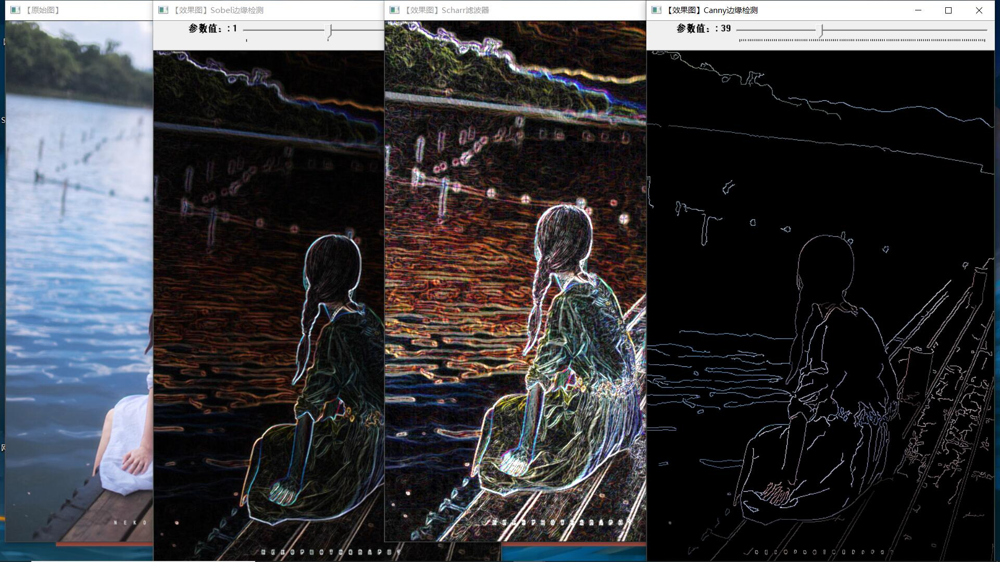

霍夫线变换综合示例
```C++

#include <opencv2/opencv.hpp>
#include <opencv2/highgui/highgui.hpp>
#include <opencv2/imgproc/imgproc.hpp>
using namespace std;
using namespace cv;


//-----------------------------------【全局变量声明部分】--------------------------------------
//		描述：全局变量声明
//-----------------------------------------------------------------------------------------------
Mat g_srcImage, g_dstImage, g_midImage;//原始图、中间图和效果图
vector<Vec4i> g_lines;//定义一个矢量结构g_lines用于存放得到的线段矢量集合
//变量接收的TrackBar位置参数
int g_nthreshold = 100;

//-----------------------------------【全局函数声明部分】--------------------------------------
//		描述：全局函数声明
//-----------------------------------------------------------------------------------------------

static void on_HoughLines(int, void*);//回调函数
static void ShowHelpText();


//-----------------------------------【main( )函数】--------------------------------------------
//		描述：控制台应用程序的入口函数，我们的程序从这里开始
//-----------------------------------------------------------------------------------------------
int main()
{
	//改变console字体颜色
	system("color 4F");

	ShowHelpText();

	//载入原始图和Mat变量定义   
	Mat g_srcImage = imread("D:\\2020\\AI\\人工智能\\1.jpg");  //工程目录下应该有一张名为1.jpg的素材图

	//显示原始图  
	imshow("【原始图】", g_srcImage);

	//创建滚动条
	namedWindow("【效果图】", 1);
	createTrackbar("值", "【效果图】", &g_nthreshold, 200, on_HoughLines);

	//进行边缘检测和转化为灰度图
	Canny(g_srcImage, g_midImage, 50, 200, 3);//进行一次canny边缘检测
	cvtColor(g_midImage, g_dstImage, COLOR_GRAY2BGR);//转化边缘检测后的图为灰度图

	//调用一次回调函数，调用一次HoughLinesP函数
	on_HoughLines(g_nthreshold, 0);
	HoughLinesP(g_midImage, g_lines, 1, CV_PI / 180, 80, 50, 10);

	//显示效果图  
	imshow("【效果图】", g_dstImage);


	waitKey(0);

	return 0;

}


//-----------------------------------【on_HoughLines( )函数】--------------------------------
//		描述：【顶帽运算/黑帽运算】窗口的回调函数
//----------------------------------------------------------------------------------------------
static void on_HoughLines(int, void*)
{
	//定义局部变量储存全局变量
	Mat dstImage = g_dstImage.clone();
	Mat midImage = g_midImage.clone();

	//调用HoughLinesP函数
	vector<Vec4i> mylines;
	HoughLinesP(midImage, mylines, 1, CV_PI / 180, g_nthreshold + 1, 50, 10);

	//循环遍历绘制每一条线段
	for (size_t i = 0; i < mylines.size(); i++)
	{
		Vec4i l = mylines[i];
		line(dstImage, Point(l[0], l[1]), Point(l[2], l[3]), Scalar(23, 180, 55), 1, LINE_AA);
	}
	//显示图像
	imshow("【效果图】", dstImage);
}

//-----------------------------------【ShowHelpText( )函数】----------------------------------
//		描述：输出一些帮助信息
//----------------------------------------------------------------------------------------------
static void ShowHelpText()
{
	//输出欢迎信息和OpenCV版本
	printf("\n\n\t\t\t非常感谢购买《OpenCV3编程入门》一书！\n");
	printf("\n\n\t\t\t此为本书OpenCV3版的第64个配套示例程序\n");
	printf("\n\n\t\t\t   当前使用的OpenCV版本为：" CV_VERSION);
	printf("\n\n  ----------------------------------------------------------------------------\n");

	//输出一些帮助信息
	printf("\n\n\n\t请调整滚动条观察图像效果~\n\n");


}
```
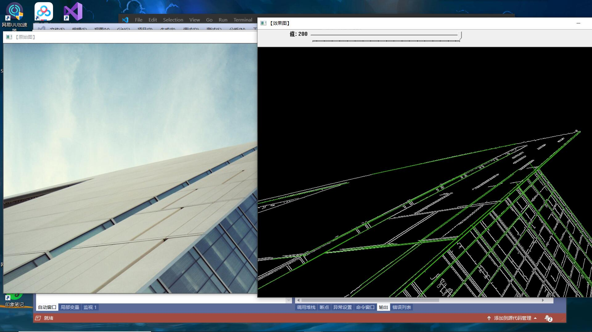

仿射变换综合示例
```C++

#include "opencv2/highgui/highgui.hpp"
#include "opencv2/imgproc/imgproc.hpp"
#include <iostream>
using namespace cv;
using namespace std;

#define WINDOW_NAME1 "【原始图窗口】"					//为窗口标题定义的宏 
#define WINDOW_NAME2 "【经过Warp后的图像】"        //为窗口标题定义的宏 
#define WINDOW_NAME3 "【经过Warp和Rotate后的图像】"        //为窗口标题定义的宏 

static void ShowHelpText();

int main()
{
	//【0】改变console字体颜色
	system("color 1F");

	//【0】显示欢迎和帮助文字
	ShowHelpText();

	//【1】参数准备
	//定义两组点，代表两个三角形
	Point2f srcTriangle[3];
	Point2f dstTriangle[3];
	//定义一些Mat变量
	Mat rotMat(2, 3, CV_32FC1);
	Mat warpMat(2, 3, CV_32FC1);
	Mat srcImage, dstImage_warp, dstImage_warp_rotate;

	//【2】加载源图像并作一些初始化
	srcImage = imread("D:\\2020\\AI\\人工智能\\1.jpg", 1);
	if (!srcImage.data) { printf("读取图片错误，请确定目录下是否有imread函数指定的图片存在~！ \n"); return false; }
	// 设置目标图像的大小和类型与源图像一致
	dstImage_warp = Mat::zeros(srcImage.rows, srcImage.cols, srcImage.type());

	//【3】设置源图像和目标图像上的三组点以计算仿射变换
	srcTriangle[0] = Point2f(0, 0);
	srcTriangle[1] = Point2f(static_cast<float>(srcImage.cols - 1), 0);
	srcTriangle[2] = Point2f(0, static_cast<float>(srcImage.rows - 1));

	dstTriangle[0] = Point2f(static_cast<float>(srcImage.cols * 0.0), static_cast<float>(srcImage.rows * 0.33));
	dstTriangle[1] = Point2f(static_cast<float>(srcImage.cols * 0.65), static_cast<float>(srcImage.rows * 0.35));
	dstTriangle[2] = Point2f(static_cast<float>(srcImage.cols * 0.15), static_cast<float>(srcImage.rows * 0.6));

	//【4】求得仿射变换
	warpMat = getAffineTransform(srcTriangle, dstTriangle);

	//【5】对源图像应用刚刚求得的仿射变换
	warpAffine(srcImage, dstImage_warp, warpMat, dstImage_warp.size());

	//【6】对图像进行缩放后再旋转
	// 计算绕图像中点顺时针旋转50度缩放因子为0.6的旋转矩阵
	Point center = Point(dstImage_warp.cols / 2, dstImage_warp.rows / 2);
	double angle = -50.0;
	double scale = 0.6;
	// 通过上面的旋转细节信息求得旋转矩阵
	rotMat = getRotationMatrix2D(center, angle, scale);
	// 旋转已缩放后的图像
	warpAffine(dstImage_warp, dstImage_warp_rotate, rotMat, dstImage_warp.size());


	//【7】显示结果
	imshow(WINDOW_NAME1, srcImage);
	imshow(WINDOW_NAME2, dstImage_warp);
	imshow(WINDOW_NAME3, dstImage_warp_rotate);

	// 等待用户按任意按键退出程序
	waitKey(0);

	return 0;
}


//-----------------------------------【ShowHelpText( )函数】----------------------------------  
//      描述：输出一些帮助信息  
//----------------------------------------------------------------------------------------------  
static void ShowHelpText()
{

	//输出欢迎信息和OpenCV版本
	printf("\n\n\t\t\t非常感谢购买《OpenCV3编程入门》一书！\n");
	printf("\n\n\t\t\t此为本书OpenCV3版的第67个配套示例程序\n");
	printf("\n\n\t\t\t   当前使用的OpenCV版本为：" CV_VERSION);
	printf("\n\n  ----------------------------------------------------------------------------\n");

	//输出一些帮助信息  
	printf("\n\n\t\t欢迎来到仿射变换综合示例程序\n\n");
	printf("\t\t键盘按键【ESC】- 退出程序\n");
}

```
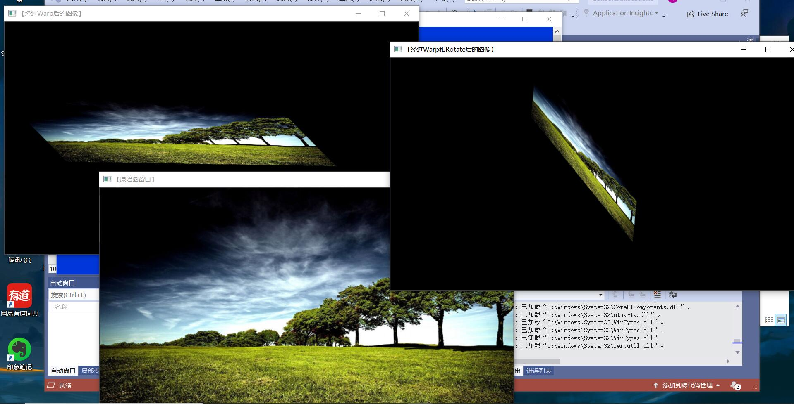

直方图
```C++
#include "opencv2/highgui/highgui.hpp"
#include "opencv2/imgproc/imgproc.hpp"
using namespace cv;

int main( )
{
	// 【1】加载源图像
	Mat srcImage, dstImage;
	srcImage = imread( "1.jpg", 1 );
	if(!srcImage.data ) { printf("读取图片错误，请确定目录下是否有imread函数指定图片存在~！ \n"); return false; } 

	// 【2】转为灰度图并显示出来
	cvtColor( srcImage, srcImage, COLOR_BGR2GRAY );
	imshow( "原始图", srcImage );

	// 【3】进行直方图均衡化
	equalizeHist( srcImage, dstImage );

	// 【4】显示结果
	imshow( "经过直方图均衡化后的图", dstImage );

	// 等待用户按键退出程序
	waitKey(0);
	return 0;

}
```
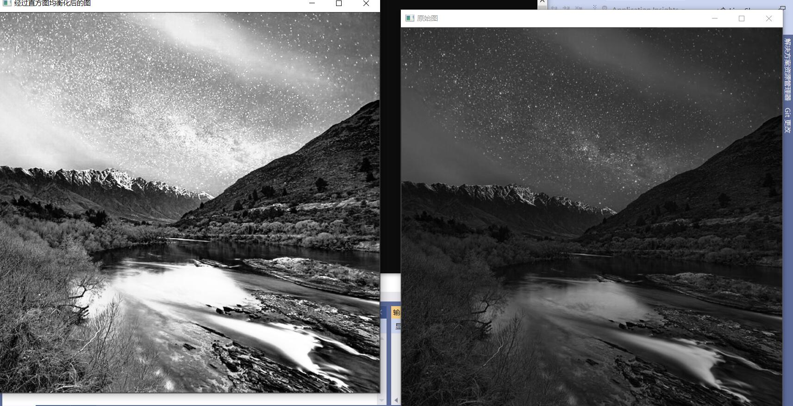

```C++
#include "opencv2/highgui/highgui.hpp"
#include "opencv2/imgproc/imgproc.hpp"
#include <iostream>
using namespace cv;
using namespace std;

#define WINDOW_NAME1 "【原始图窗口】"			//为窗口标题定义的宏 
#define WINDOW_NAME2 "【轮廓图】"					//为窗口标题定义的宏 

Mat g_srcImage; 
Mat g_grayImage;
int g_nThresh = 80;
int g_nThresh_max = 255;
RNG g_rng(12345);
Mat g_cannyMat_output;
vector<vector<Point>> g_vContours;
vector<Vec4i> g_vHierarchy;

static void ShowHelpText( );
void on_ThreshChange(int, void* );

int main( int argc, char** argv )
{
	//【0】改变console字体颜色
	system("color 1F"); 

	//【0】显示欢迎和帮助文字
	ShowHelpText( );

	// 加载源图像
	g_srcImage = imread( "1.jpg", 1 );
	if(!g_srcImage.data ) { printf("读取图片错误，请确定目录下是否有imread函数指定的图片存在~！ \n"); return false; } 

	// 转成灰度并模糊化降噪
	cvtColor( g_srcImage, g_grayImage, COLOR_BGR2GRAY );
	blur( g_grayImage, g_grayImage, Size(3,3) );

	// 创建窗口
	namedWindow( WINDOW_NAME1, WINDOW_AUTOSIZE );
	imshow( WINDOW_NAME1, g_srcImage );

	//创建滚动条并初始化
	createTrackbar( "canny阈值", WINDOW_NAME1, &g_nThresh, g_nThresh_max, on_ThreshChange );
	on_ThreshChange( 0, 0 );

	waitKey(0);
	return(0);
}

//-----------------------------------【on_ThreshChange( )函数】------------------------------  
//      描述：回调函数
//----------------------------------------------------------------------------------------------  
void on_ThreshChange(int, void* )
{

	// 用Canny算子检测边缘
	Canny( g_grayImage, g_cannyMat_output, g_nThresh, g_nThresh*2, 3 );

	// 寻找轮廓
	findContours( g_cannyMat_output, g_vContours, g_vHierarchy, RETR_TREE, CHAIN_APPROX_SIMPLE, Point(0, 0) );

	// 绘出轮廓
	Mat drawing = Mat::zeros( g_cannyMat_output.size(), CV_8UC3 );
	for( int i = 0; i< g_vContours.size(); i++ )
	{
		Scalar color = Scalar( g_rng.uniform(0, 255), g_rng.uniform(0,255), g_rng.uniform(0,255) );//任意值
		drawContours( drawing, g_vContours, i, color, 2, 8, g_vHierarchy, 0, Point() );
	}

	// 显示效果图
	imshow( WINDOW_NAME2, drawing );
}


//-----------------------------------【ShowHelpText( )函数】----------------------------------  
//      描述：输出一些帮助信息  
//----------------------------------------------------------------------------------------------  
static void ShowHelpText()  
{  
	//输出欢迎信息和OpenCV版本
	printf("\n\n\t\t\t非常感谢购买《OpenCV3编程入门》一书！\n");
	printf("\n\n\t\t\t此为本书OpenCV3版的第70个配套示例程序\n");
	printf("\n\n\t\t\t   当前使用的OpenCV版本为：" CV_VERSION );
	printf("\n\n  ----------------------------------------------------------------------------\n");

	//输出一些帮助信息  
	printf(   "\n\n\t欢迎来到【在图形中寻找轮廓】示例程序~\n\n");  
	printf(   "\n\n\t按键操作说明: \n\n"  
		"\t\t键盘按键任意键- 退出程序\n\n"  
		"\t\t滑动滚动条-改变阈值\n" );  
}  
```
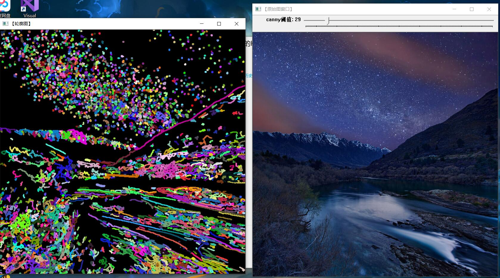


创建轮廓边界框
```C++
#include "opencv2/highgui/highgui.hpp"
#include "opencv2/imgproc/imgproc.hpp"
using namespace cv;
using namespace std;

#define WINDOW_NAME1 "【原始图窗口】"        //为窗口标题定义的宏 
#define WINDOW_NAME2 "【效果图窗口】"        //为窗口标题定义的宏 

Mat g_srcImage;
Mat g_grayImage;
int g_nThresh = 50;//阈值
int g_nMaxThresh = 255;//阈值最大值
RNG g_rng(12345);//随机数生成器

//-----------------------------------【全局函数声明部分】--------------------------------------
//   描述：全局函数的声明
//-----------------------------------------------------------------------------------------------
void on_ContoursChange(int, void*);
static void ShowHelpText();

//-----------------------------------【main( )函数】--------------------------------------------
//   描述：控制台应用程序的入口函数，我们的程序从这里开始执行
//-----------------------------------------------------------------------------------------------
int main()
{
	//【0】改变console字体颜色
	system("color 1F");

	//【0】显示欢迎和帮助文字
	ShowHelpText();

	//【1】载入3通道的原图像
	g_srcImage = imread("D:\\1.jpg", 1);
	if (!g_srcImage.data) { printf("读取图片错误，请确定目录下是否有imread函数指定的图片存在~！ \n"); return false; }

	//【2】得到原图的灰度图像并进行平滑
	cvtColor(g_srcImage, g_grayImage, COLOR_BGR2GRAY);
	blur(g_grayImage, g_grayImage, Size(3, 3));

	//【3】创建原始图窗口并显示
	namedWindow(WINDOW_NAME1, WINDOW_AUTOSIZE);
	imshow(WINDOW_NAME1, g_srcImage);

	//【4】设置滚动条并调用一次回调函数
	createTrackbar(" 阈值:", WINDOW_NAME1, &g_nThresh, g_nMaxThresh, on_ContoursChange);
	on_ContoursChange(0, 0);

	waitKey(0);

	return(0);
}

//----------------------------【on_ContoursChange( )函数】---------------------------------
//      描述：回调函数
//-------------------------------------------------------------------------------------------------  
void on_ContoursChange(int, void*)
{
	//定义一些参数
	Mat threshold_output;
	vector<vector<Point>> contours;
	vector<Vec4i> hierarchy;

	// 使用Threshold检测边缘
	threshold(g_grayImage, threshold_output, g_nThresh, 255, THRESH_BINARY);

	// 找出轮廓
	findContours(threshold_output, contours, hierarchy, RETR_TREE, CHAIN_APPROX_SIMPLE, Point(0, 0));

	// 多边形逼近轮廓 + 获取矩形和圆形边界框
	vector<vector<Point> > contours_poly(contours.size());
	vector<Rect> boundRect(contours.size());
	vector<Point2f>center(contours.size());
	vector<float>radius(contours.size());

	//一个循环，遍历所有部分，进行本程序最核心的操作
	for (unsigned int i = 0; i < contours.size(); i++)
	{
		approxPolyDP(Mat(contours[i]), contours_poly[i], 3, true);//用指定精度逼近多边形曲线 
		boundRect[i] = boundingRect(Mat(contours_poly[i]));//计算点集的最外面（up-right）矩形边界
		minEnclosingCircle(contours_poly[i], center[i], radius[i]);//对给定的 2D点集，寻找最小面积的包围圆形 
	}

	// 绘制多边形轮廓 + 包围的矩形框 + 圆形框
	Mat drawing = Mat::zeros(threshold_output.size(), CV_8UC3);
	for (int unsigned i = 0; i < contours.size(); i++)
	{
		Scalar color = Scalar(g_rng.uniform(0, 255), g_rng.uniform(0, 255), g_rng.uniform(0, 255));//随机设置颜色
		drawContours(drawing, contours_poly, i, color, 1, 8, vector<Vec4i>(), 0, Point());//绘制轮廓
		rectangle(drawing, boundRect[i].tl(), boundRect[i].br(), color, 2, 8, 0);//绘制矩形
		circle(drawing, center[i], (int)radius[i], color, 2, 8, 0);//绘制圆
	}

	// 显示效果图窗口
	namedWindow(WINDOW_NAME2, WINDOW_AUTOSIZE);
	imshow(WINDOW_NAME2, drawing);
}

//-----------------------------------【ShowHelpText( )函数】----------------------------------  
//      描述：输出一些帮助信息  
//----------------------------------------------------------------------------------------------  
static void ShowHelpText()
{
	//输出欢迎信息和OpenCV版本
	printf("\n\n\t\t\t非常感谢购买《OpenCV3编程入门》一书！\n");
	printf("\n\n\t\t\t此为本书OpenCV3版的第75个配套示例程序\n");
	printf("\n\n\t\t\t   当前使用的OpenCV版本为：" CV_VERSION);
	printf("\n\n  ----------------------------------------------------------------------------\n");

	//输出一些帮助信息  
	printf("\n\n\n\t欢迎来到【创建包围轮廓的矩形和圆形边界框】示例程序~\n\n");
	printf("\n\n\t按键操作说明: \n\n"
		"\t\t键盘按键【ESC】- 退出程序\n\n"
		"\t\t滑动滚动条 - 改变阈值\n\n");
}
```
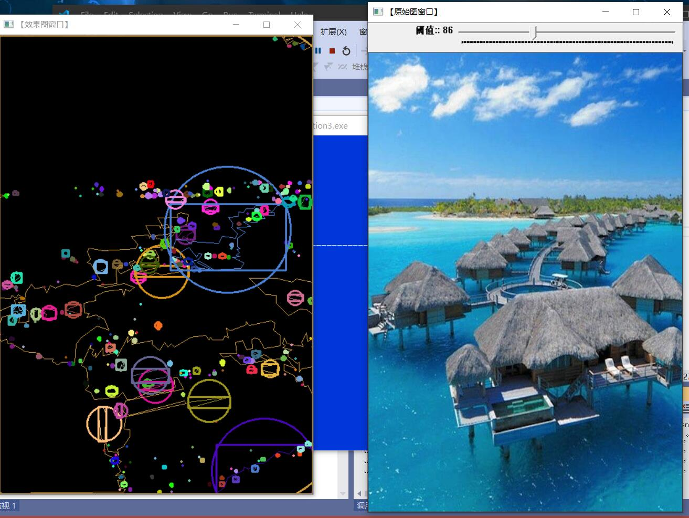
分水岭算法综合示例
```C++
#include "opencv2/imgproc/imgproc.hpp"
#include "opencv2/highgui/highgui.hpp"
#include <iostream>
using namespace cv;
using namespace std;

#define WINDOW_NAME1 "【程序窗口1】"        //为窗口标题定义的宏 
#define WINDOW_NAME2 "【分水岭算法效果图】"        //为窗口标题定义的宏

Mat g_maskImage, g_srcImage;
Point prevPt(-1, -1);

static void ShowHelpText();
static void on_Mouse(int event, int x, int y, int flags, void*);

int main(int argc, char** argv)
{
	//【0】改变console字体颜色
	system("color 6F");

	//【0】显示帮助文字
	ShowHelpText();

	//【1】载入原图并显示，初始化掩膜和灰度图
	g_srcImage = imread("D://1.jpg", 1);
	imshow(WINDOW_NAME1, g_srcImage);
	Mat srcImage, grayImage;
	g_srcImage.copyTo(srcImage);
	cvtColor(g_srcImage, g_maskImage, COLOR_BGR2GRAY);
	cvtColor(g_maskImage, grayImage, COLOR_GRAY2BGR);
	g_maskImage = Scalar::all(0);

	//【2】设置鼠标回调函数
	setMouseCallback(WINDOW_NAME1, on_Mouse, 0);

	//【3】轮询按键，进行处理
	while (1)
	{
		//获取键值
		int c = waitKey(0);

		//若按键键值为ESC时，退出
		if ((char)c == 27)
			break;

		//按键键值为2时，恢复源图
		if ((char)c == '2')
		{
			g_maskImage = Scalar::all(0);
			srcImage.copyTo(g_srcImage);
			imshow("image", g_srcImage);
		}

		//若检测到按键值为1或者空格，则进行处理
		if ((char)c == '1' || (char)c == ' ')
		{
			//定义一些参数
			int i, j, compCount = 0;
			vector<vector<Point> > contours;
			vector<Vec4i> hierarchy;

			//寻找轮廓
			findContours(g_maskImage, contours, hierarchy, RETR_CCOMP, CHAIN_APPROX_SIMPLE);

			//轮廓为空时的处理
			if (contours.empty())
				continue;

			//拷贝掩膜
			Mat maskImage(g_maskImage.size(), CV_32S);
			maskImage = Scalar::all(0);

			//循环绘制出轮廓
			for (int index = 0; index >= 0; index = hierarchy[index][0], compCount++)
				drawContours(maskImage, contours, index, Scalar::all(compCount + 1), -1, 8, hierarchy, INT_MAX);

			//compCount为零时的处理
			if (compCount == 0)
				continue;

			//生成随机颜色
			vector<Vec3b> colorTab;
			for (i = 0; i < compCount; i++)
			{
				int b = theRNG().uniform(0, 255);
				int g = theRNG().uniform(0, 255);
				int r = theRNG().uniform(0, 255);

				colorTab.push_back(Vec3b((uchar)b, (uchar)g, (uchar)r));
			}

			//计算处理时间并输出到窗口中
			double dTime = (double)getTickCount();
			watershed(srcImage, maskImage);
			dTime = (double)getTickCount() - dTime;
			printf("\t处理时间 = %gms\n", dTime * 1000. / getTickFrequency());

			//双层循环，将分水岭图像遍历存入watershedImage中
			Mat watershedImage(maskImage.size(), CV_8UC3);
			for (i = 0; i < maskImage.rows; i++)
				for (j = 0; j < maskImage.cols; j++)
				{
					int index = maskImage.at<int>(i, j);
					if (index == -1)
						watershedImage.at<Vec3b>(i, j) = Vec3b(255, 255, 255);
					else if (index <= 0 || index > compCount)
						watershedImage.at<Vec3b>(i, j) = Vec3b(0, 0, 0);
					else
						watershedImage.at<Vec3b>(i, j) = colorTab[index - 1];
				}

			//混合灰度图和分水岭效果图并显示最终的窗口
			watershedImage = watershedImage * 0.5 + grayImage * 0.5;
			imshow(WINDOW_NAME2, watershedImage);
		}
	}

	return 0;
}


//-----------------------------------【onMouse( )函数】---------------------------------------
//		描述：鼠标消息回调函数
//-----------------------------------------------------------------------------------------------
static void on_Mouse(int event, int x, int y, int flags, void*)
{
	//处理鼠标不在窗口中的情况
	if (x < 0 || x >= g_srcImage.cols || y < 0 || y >= g_srcImage.rows)
		return;

	//处理鼠标左键相关消息
	if (event == EVENT_LBUTTONUP || !(flags & EVENT_FLAG_LBUTTON))
		prevPt = Point(-1, -1);
	else if (event == EVENT_LBUTTONDOWN)
		prevPt = Point(x, y);

	//鼠标左键按下并移动，绘制出白色线条
	else if (event == EVENT_MOUSEMOVE && (flags & EVENT_FLAG_LBUTTON))
	{
		Point pt(x, y);
		if (prevPt.x < 0)
			prevPt = pt;
		line(g_maskImage, prevPt, pt, Scalar::all(255), 5, 8, 0);
		line(g_srcImage, prevPt, pt, Scalar::all(255), 5, 8, 0);
		prevPt = pt;
		imshow(WINDOW_NAME1, g_srcImage);
	}
}


//-----------------------------------【ShowHelpText( )函数】----------------------------------  
//      描述：输出一些帮助信息  
//----------------------------------------------------------------------------------------------  
static void ShowHelpText()
{
	//输出欢迎信息和OpenCV版本
	printf("\n\n\t\t\t非常感谢购买《OpenCV3编程入门》一书！\n");
	printf("\n\n\t\t\t此为本书OpenCV3版的第77个配套示例程序\n");
	printf("\n\n\t\t\t   当前使用的OpenCV版本为：" CV_VERSION);
	printf("\n\n  ----------------------------------------------------------------------------\n");

	//输出一些帮助信息  
	printf("\n\n\n\t欢迎来到【分水岭算法】示例程序~\n\n");
	printf("\t请先用鼠标在图片窗口中标记出大致的区域，\n\n\t然后再按键【1】或者【SPACE】启动算法。"
		"\n\n\t按键操作说明: \n\n"
		"\t\t键盘按键【1】或者【SPACE】- 运行的分水岭分割算法\n"
		"\t\t键盘按键【2】- 恢复原始图片\n"
		"\t\t键盘按键【ESC】- 退出程序\n\n\n");
}
```
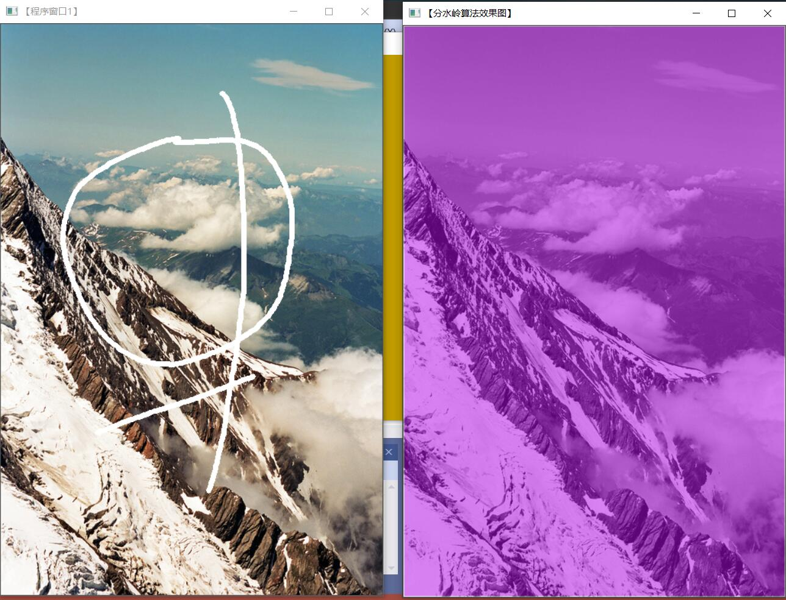
图像修补示例
```C++
#include "opencv2/highgui/highgui.hpp"
#include "opencv2/imgproc/imgproc.hpp"
#include "opencv2/photo/photo.hpp"
#include <iostream>
using namespace cv;
using namespace std;

#define WINDOW_NAME0 "【原始图参考】"        //为窗口标题定义的宏 
#define WINDOW_NAME1 "【原始图】"        //为窗口标题定义的宏 
#define WINDOW_NAME2 "【修补后的效果图】"        //为窗口标题定义的宏 

Mat srcImage0, srcImage1, inpaintMask;
Point previousPoint(-1, -1);//原来的点坐标


//-----------------------------------【ShowHelpText( )函数】----------------------------------
//          描述：输出一些帮助信息
//----------------------------------------------------------------------------------------------
static void ShowHelpText()
{
	//输出欢迎信息和OpenCV版本
	printf("\n\n\t\t\t非常感谢购买《OpenCV3编程入门》一书！\n");
	printf("\n\n\t\t\t此为本书OpenCV3版的第78个配套示例程序\n");
	printf("\n\n\t\t\t   当前使用的OpenCV版本为：" CV_VERSION);
	printf("\n\n  ----------------------------------------------------------------------------\n");

	//输出一些帮助信息
	printf("\n\n\n\t欢迎来到【图像修复】示例程序~\n");
	printf("\n\t请在进行图像修复操作之前，在【原始图】窗口中进行适量的绘制"
		"\n\n\t按键操作说明: \n\n"
		"\t\t【鼠标左键】-在图像上绘制白色线条\n\n"
		"\t\t键盘按键【ESC】- 退出程序\n\n"
		"\t\t键盘按键【1】或【SPACE】-进行图像修复操作 \n\n");
}


//-----------------------------------【On_Mouse( )函数】--------------------------------
//          描述：响应鼠标消息的回调函数
//----------------------------------------------------------------------------------------------
static void On_Mouse(int event, int x, int y, int flags, void*)
{
	//鼠标左键弹起消息
	if (event == EVENT_LBUTTONUP || !(flags & EVENT_FLAG_LBUTTON))
		previousPoint = Point(-1, -1);
	//鼠标左键按下消息
	else if (event == EVENT_LBUTTONDOWN)
		previousPoint = Point(x, y);
	//鼠标按下并移动，进行绘制
	else if (event == EVENT_MOUSEMOVE && (flags & EVENT_FLAG_LBUTTON))
	{
		Point pt(x, y);
		if (previousPoint.x < 0)
			previousPoint = pt;
		//绘制白色线条
		line(inpaintMask, previousPoint, pt, Scalar::all(255), 5, 8, 0);
		line(srcImage1, previousPoint, pt, Scalar::all(255), 5, 8, 0);
		previousPoint = pt;
		imshow(WINDOW_NAME1, srcImage1);
	}
}


//--------------------------------------【main( )函数】-----------------------------------------
//          描述：控制台应用程序的入口函数，我们的程序从这里开始执行
//-----------------------------------------------------------------------------------------------
int main(int argc, char** argv)
{
	//改变console字体颜色
	system("color 2F");

	//显示帮助文字
	ShowHelpText();

	//载入原始图并进行掩膜的初始化
	Mat srcImage = imread("D://1.jpg", -1);
	if (!srcImage.data) { printf("读取图片错误，请确定目录下是否有imread函数指定图片存在~！ \n"); return false; }
	srcImage0 = srcImage.clone();
	srcImage1 = srcImage.clone();
	inpaintMask = Mat::zeros(srcImage1.size(), CV_8U);

	//显示原始图参考
	imshow(WINDOW_NAME0, srcImage0);
	//显示原始图
	imshow(WINDOW_NAME1, srcImage1);
	//设置鼠标回调消息
	setMouseCallback(WINDOW_NAME1, On_Mouse, 0);

	//轮询按键，根据不同的按键进行处理
	while (1)
	{
		//获取按键键值
		char c = (char)waitKey();

		//键值为ESC，程序退出
		if (c == 27)
			break;

		//键值为2，恢复成原始图像
		if (c == '2')
		{
			inpaintMask = Scalar::all(0);
			srcImage.copyTo(srcImage1);
			imshow(WINDOW_NAME1, srcImage1);
		}

		//键值为1或者空格，进行图像修补操作
		if (c == '1' || c == ' ')
		{
			Mat inpaintedImage;
			inpaint(srcImage1, inpaintMask, inpaintedImage, 3, INPAINT_TELEA);
			imshow(WINDOW_NAME2, inpaintedImage);
		}
	}

	return 0;
}
```
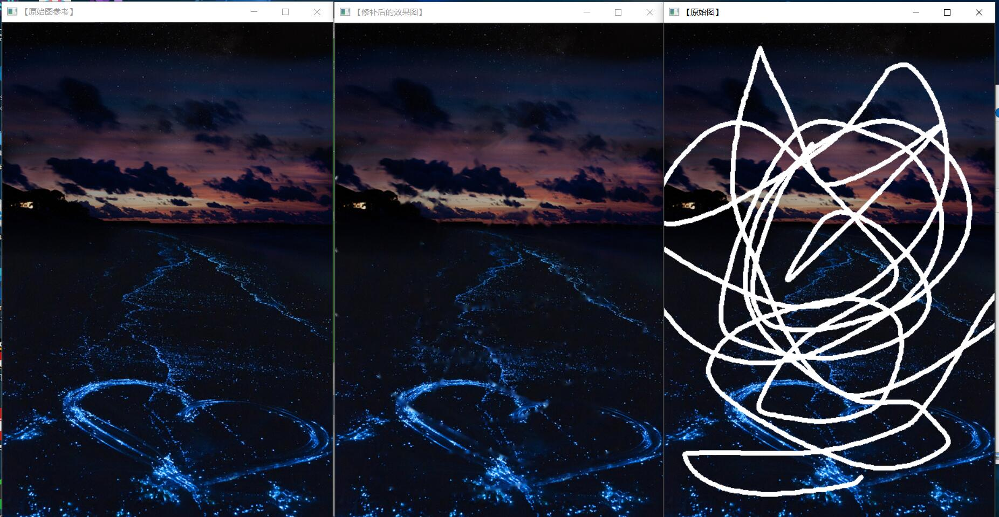

H-S二维直方图的绘制
```C++
#include "opencv2/highgui/highgui.hpp"
#include "opencv2/imgproc/imgproc.hpp"
using namespace cv;

void ShowHelpText()
{
	//输出欢迎信息和OpenCV版本
	printf("\n\n\t\t\t非常感谢购买《OpenCV3编程入门》一书！\n");
	printf("\n\n\t\t\t此为本书OpenCV3版的第79个配套示例程序\n");
	printf("\n\n\t\t\t   当前使用的OpenCV版本为：" CV_VERSION);
	printf("\n\n  ----------------------------------------------------------------------------\n");
}

int main()
{

	//【1】载入源图，转化为HSV颜色模型
	Mat srcImage, hsvImage;
	srcImage = imread("D://1.jpg");
	cvtColor(srcImage, hsvImage, COLOR_BGR2HSV);

	system("color 2F");
	ShowHelpText();

	//【2】参数准备
	//将色调量化为30个等级，将饱和度量化为32个等级
	int hueBinNum = 30;//色调的直方图直条数量
	int saturationBinNum = 32;//饱和度的直方图直条数量
	int histSize[] = { hueBinNum, saturationBinNum };
	// 定义色调的变化范围为0到179
	float hueRanges[] = { 0, 180 };
	//定义饱和度的变化范围为0（黑、白、灰）到255（纯光谱颜色）
	float saturationRanges[] = { 0, 256 };
	const float* ranges[] = { hueRanges, saturationRanges };
	MatND dstHist;
	//参数准备，calcHist函数中将计算第0通道和第1通道的直方图
	int channels[] = { 0, 1 };

	//【3】正式调用calcHist，进行直方图计算
	calcHist(&hsvImage,//输入的数组
		1, //数组个数为1
		channels,//通道索引
		Mat(), //不使用掩膜
		dstHist, //输出的目标直方图
		2, //需要计算的直方图的维度为2
		histSize, //存放每个维度的直方图尺寸的数组
		ranges,//每一维数值的取值范围数组
		true, // 指示直方图是否均匀的标识符，true表示均匀的直方图
		false);//累计标识符，false表示直方图在配置阶段会被清零

	//【4】为绘制直方图准备参数
	double maxValue = 0;//最大值
	minMaxLoc(dstHist, 0, &maxValue, 0, 0);//查找数组和子数组的全局最小值和最大值存入maxValue中
	int scale = 10;
	Mat histImg = Mat::zeros(saturationBinNum * scale, hueBinNum * 10, CV_8UC3);

	//【5】双层循环，进行直方图绘制
	for (int hue = 0; hue < hueBinNum; hue++)
		for (int saturation = 0; saturation < saturationBinNum; saturation++)
		{
			float binValue = dstHist.at<float>(hue, saturation);//直方图组距的值
			int intensity = cvRound(binValue * 255 / maxValue);//强度

			//正式进行绘制
			rectangle(histImg, Point(hue * scale, saturation * scale),
				Point((hue + 1) * scale - 1, (saturation + 1) * scale - 1),
				Scalar::all(intensity), FILLED);
		}

	//【6】显示效果图
	imshow("素材图", srcImage);
	imshow("H-S 直方图", histImg);

	waitKey();
}
```
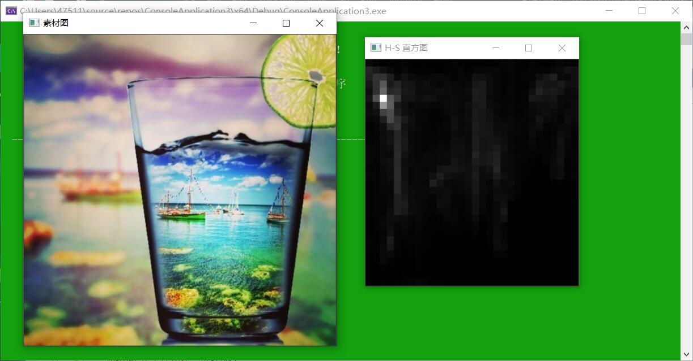
一维直方图的绘制
```C++
#include "opencv2/highgui/highgui.hpp"
#include "opencv2/imgproc/imgproc.hpp"
#include <iostream>
using namespace cv;
using namespace std;

void ShowHelpText()
{
	//输出欢迎信息和OpenCV版本
	printf("\n\n\t\t\t非常感谢购买《OpenCV3编程入门》一书！\n");
	printf("\n\n\t\t\t此为本书OpenCV3版的第80个配套示例程序\n");
	printf("\n\n\t\t\t   当前使用的OpenCV版本为：" CV_VERSION);
	printf("\n\n  ----------------------------------------------------------------------------\n");
}

int main()
{
	//【1】载入原图并显示
	Mat srcImage = imread("D://1.jpg", 0);
	imshow("原图", srcImage);
	if (!srcImage.data) { cout << "fail to load image" << endl; 	return 0; }

	system("color 1F");
	ShowHelpText();

	//【2】定义变量
	MatND dstHist;       // 在cv中用CvHistogram *hist = cvCreateHist
	int dims = 1;
	float hranges[] = { 0, 255 };
	const float* ranges[] = { hranges };   // 这里需要为const类型
	int size = 256;
	int channels = 0;

	//【3】计算图像的直方图
	calcHist(&srcImage, 1, &channels, Mat(), dstHist, dims, &size, ranges);    // cv 中是cvCalcHist
	int scale = 1;

	Mat dstImage(size * scale, size, CV_8U, Scalar(0));
	//【4】获取最大值和最小值
	double minValue = 0;
	double maxValue = 0;
	minMaxLoc(dstHist, &minValue, &maxValue, 0, 0);  //  在cv中用的是cvGetMinMaxHistValue

	//【5】绘制出直方图
	int hpt = saturate_cast<int>(0.9 * size);
	for (int i = 0; i < 256; i++)
	{
		float binValue = dstHist.at<float>(i);           //   注意hist中是float类型    而在OpenCV1.0版中用cvQueryHistValue_1D
		int realValue = saturate_cast<int>(binValue * hpt / maxValue);
		rectangle(dstImage, Point(i * scale, size - 1), Point((i + 1) * scale - 1, size - realValue), Scalar(255));
	}
	imshow("一维直方图", dstImage);
	waitKey(0);
	return 0;
}
```
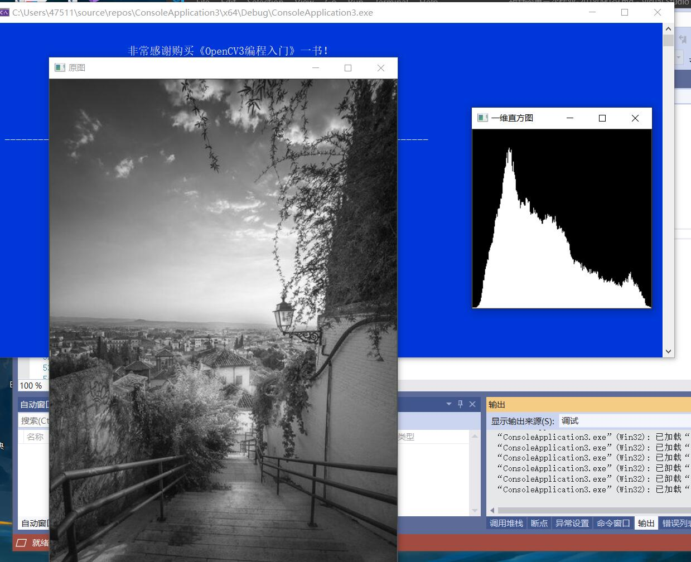

绘制RGB三色分量的直方图
```C++
#include <opencv2/opencv.hpp>  
#include <opencv2/imgproc/imgproc.hpp>  
using namespace cv;

void ShowHelpText()
{
	//输出欢迎信息和OpenCV版本
	printf("\n\n\t\t\t非常感谢购买《OpenCV3编程入门》一书！\n");
	printf("\n\n\t\t\t此为本书OpenCV3版的第81个配套示例程序\n");
	printf("\n\n\t\t\t   当前使用的OpenCV版本为：" CV_VERSION);
	printf("\n\n  ----------------------------------------------------------------------------\n");
}

int main()
{

	//【1】载入素材图并显示
	Mat srcImage;
	srcImage = imread("D://1.jpg");
	imshow("素材图", srcImage);

	system("color 3F");
	ShowHelpText();

	//【2】参数准备
	int bins = 256;
	int hist_size[] = { bins };
	float range[] = { 0, 256 };
	const float* ranges[] = { range };
	MatND redHist, grayHist, blueHist;
	int channels_r[] = { 0 };

	//【3】进行直方图的计算（红色分量部分）
	calcHist(&srcImage, 1, channels_r, Mat(), //不使用掩膜
		redHist, 1, hist_size, ranges,
		true, false);

	//【4】进行直方图的计算（绿色分量部分）
	int channels_g[] = { 1 };
	calcHist(&srcImage, 1, channels_g, Mat(), // do not use mask
		grayHist, 1, hist_size, ranges,
		true, // the histogram is uniform
		false);

	//【5】进行直方图的计算（蓝色分量部分）
	int channels_b[] = { 2 };
	calcHist(&srcImage, 1, channels_b, Mat(), // do not use mask
		blueHist, 1, hist_size, ranges,
		true, // the histogram is uniform
		false);

	//-----------------------绘制出三色直方图------------------------
	//参数准备
	double maxValue_red, maxValue_green, maxValue_blue;
	minMaxLoc(redHist, 0, &maxValue_red, 0, 0);
	minMaxLoc(grayHist, 0, &maxValue_green, 0, 0);
	minMaxLoc(blueHist, 0, &maxValue_blue, 0, 0);
	int scale = 1;
	int histHeight = 256;
	Mat histImage = Mat::zeros(histHeight, bins * 3, CV_8UC3);

	//正式开始绘制
	for (int i = 0; i < bins; i++)
	{
		//参数准备
		float binValue_red = redHist.at<float>(i);
		float binValue_green = grayHist.at<float>(i);
		float binValue_blue = blueHist.at<float>(i);
		int intensity_red = cvRound(binValue_red * histHeight / maxValue_red);  //要绘制的高度
		int intensity_green = cvRound(binValue_green * histHeight / maxValue_green);  //要绘制的高度
		int intensity_blue = cvRound(binValue_blue * histHeight / maxValue_blue);  //要绘制的高度

		//绘制红色分量的直方图
		rectangle(histImage, Point(i * scale, histHeight - 1),
			Point((i + 1) * scale - 1, histHeight - intensity_red),
			Scalar(255, 0, 0));

		//绘制绿色分量的直方图
		rectangle(histImage, Point((i + bins) * scale, histHeight - 1),
			Point((i + bins + 1) * scale - 1, histHeight - intensity_green),
			Scalar(0, 255, 0));

		//绘制蓝色分量的直方图
		rectangle(histImage, Point((i + bins * 2) * scale, histHeight - 1),
			Point((i + bins * 2 + 1) * scale - 1, histHeight - intensity_blue),
			Scalar(0, 0, 255));

	}

	//在窗口中显示出绘制好的直方图
	imshow("图像的RGB直方图", histImage);
	waitKey(0);
	return 0;
}
```


82_直方图对比
```C++
#include "opencv2/highgui/highgui.hpp"
#include "opencv2/imgproc/imgproc.hpp"
using namespace cv;

static void ShowHelpText()
{
	//输出欢迎信息和OpenCV版本
	printf("\n\n\t\t\t非常感谢购买《OpenCV3编程入门》一书！\n");
	printf("\n\n\t\t\t此为本书OpenCV3版的第82个配套示例程序\n");
	printf("\n\n\t\t\t   当前使用的OpenCV版本为：" CV_VERSION);
	printf("\n\n  ----------------------------------------------------------------------------\n");
	//输出一些帮助信息
	printf("\n\n欢迎来到【直方图对比】示例程序~\n\n");

}

int main()
{
	//【0】改变console字体颜色
	system("color 2F");

	//【1】显示帮助文字
	ShowHelpText();

	//【1】声明储存基准图像和另外两张对比图像的矩阵( RGB 和 HSV )
	Mat srcImage_base, hsvImage_base;
	Mat srcImage_test1, hsvImage_test1;
	Mat srcImage_test2, hsvImage_test2;
	Mat hsvImage_halfDown;

	//【2】载入基准图像(srcImage_base) 和两张测试图像srcImage_test1、srcImage_test2，并显示
	srcImage_base = imread("D://1.jpg", 1);
	srcImage_test1 = imread("D://2.jpg", 1);
	srcImage_test2 = imread("D://3.jpg", 1);
	//显示载入的3张图像
	imshow("基准图像", srcImage_base);
	imshow("测试图像1", srcImage_test1);
	imshow("测试图像2", srcImage_test2);

	// 【3】将图像由BGR色彩空间转换到 HSV色彩空间
	cvtColor(srcImage_base, hsvImage_base, COLOR_BGR2HSV);
	cvtColor(srcImage_test1, hsvImage_test1, COLOR_BGR2HSV);
	cvtColor(srcImage_test2, hsvImage_test2, COLOR_BGR2HSV);

	//【4】创建包含基准图像下半部的半身图像(HSV格式)
	hsvImage_halfDown = hsvImage_base(Range(hsvImage_base.rows / 2, hsvImage_base.rows - 1), Range(0, hsvImage_base.cols - 1));

	//【5】初始化计算直方图需要的实参
	// 对hue通道使用30个bin,对saturatoin通道使用32个bin
	int h_bins = 50; int s_bins = 60;
	int histSize[] = { h_bins, s_bins };
	// hue的取值范围从0到256, saturation取值范围从0到180
	float h_ranges[] = { 0, 256 };
	float s_ranges[] = { 0, 180 };
	const float* ranges[] = { h_ranges, s_ranges };
	// 使用第0和第1通道
	int channels[] = { 0, 1 };

	// 【6】创建储存直方图的 MatND 类的实例:
	MatND baseHist;
	MatND halfDownHist;
	MatND testHist1;
	MatND testHist2;

	// 【7】计算基准图像，两张测试图像，半身基准图像的HSV直方图:
	calcHist(&hsvImage_base, 1, channels, Mat(), baseHist, 2, histSize, ranges, true, false);
	normalize(baseHist, baseHist, 0, 1, NORM_MINMAX, -1, Mat());

	calcHist(&hsvImage_halfDown, 1, channels, Mat(), halfDownHist, 2, histSize, ranges, true, false);
	normalize(halfDownHist, halfDownHist, 0, 1, NORM_MINMAX, -1, Mat());

	calcHist(&hsvImage_test1, 1, channels, Mat(), testHist1, 2, histSize, ranges, true, false);
	normalize(testHist1, testHist1, 0, 1, NORM_MINMAX, -1, Mat());

	calcHist(&hsvImage_test2, 1, channels, Mat(), testHist2, 2, histSize, ranges, true, false);
	normalize(testHist2, testHist2, 0, 1, NORM_MINMAX, -1, Mat());


	//【8】按顺序使用4种对比标准将基准图像的直方图与其余各直方图进行对比:
	for (int i = 0; i < 4; i++)
	{
		//进行图像直方图的对比
		int compare_method = i;
		double base_base = compareHist(baseHist, baseHist, compare_method);
		double base_half = compareHist(baseHist, halfDownHist, compare_method);
		double base_test1 = compareHist(baseHist, testHist1, compare_method);
		double base_test2 = compareHist(baseHist, testHist2, compare_method);
		//输出结果
		printf(" 方法 [%d] 的匹配结果如下：\n\n 【基准图 - 基准图】：%f, 【基准图 - 半身图】：%f,【基准图 - 测试图1】： %f, 【基准图 - 测试图2】：%f \n-----------------------------------------------------------------\n", i, base_base, base_half, base_test1, base_test2);
	}

	printf("检测结束。");
	waitKey(0);
	return 0;
}
```

```C++
#include "opencv2/highgui/highgui.hpp"
#include "opencv2/imgproc/imgproc.hpp"
using namespace cv;

static void ShowHelpText()
{
	//输出欢迎信息和OpenCV版本
	printf("\n\n\t\t\t非常感谢购买《OpenCV3编程入门》一书！\n");
	printf("\n\n\t\t\t此为本书OpenCV3版的第82个配套示例程序\n");
	printf("\n\n\t\t\t   当前使用的OpenCV版本为：" CV_VERSION);
	printf("\n\n  ----------------------------------------------------------------------------\n");
	//输出一些帮助信息
	printf("\n\n欢迎来到【直方图对比】示例程序~\n\n");

}

int main()
{
	//【0】改变console字体颜色
	system("color 2F");

	//【1】显示帮助文字
	ShowHelpText();

	//【1】声明储存基准图像和另外两张对比图像的矩阵( RGB 和 HSV )
	Mat srcImage_base, hsvImage_base;
	Mat srcImage_test1, hsvImage_test1;
	Mat srcImage_test2, hsvImage_test2;
	Mat hsvImage_halfDown;

	//【2】载入基准图像(srcImage_base) 和两张测试图像srcImage_test1、srcImage_test2，并显示
	srcImage_base = imread("D://1.jpg", 1);
	srcImage_test1 = imread("D://2.jpg", 1);
	srcImage_test2 = imread("D://3.jpg", 1);
	//显示载入的3张图像
	imshow("基准图像", srcImage_base);
	imshow("测试图像1", srcImage_test1);
	imshow("测试图像2", srcImage_test2);

	// 【3】将图像由BGR色彩空间转换到 HSV色彩空间
	cvtColor(srcImage_base, hsvImage_base, COLOR_BGR2HSV);
	cvtColor(srcImage_test1, hsvImage_test1, COLOR_BGR2HSV);
	cvtColor(srcImage_test2, hsvImage_test2, COLOR_BGR2HSV);

	//【4】创建包含基准图像下半部的半身图像(HSV格式)
	hsvImage_halfDown = hsvImage_base(Range(hsvImage_base.rows / 2, hsvImage_base.rows - 1), Range(0, hsvImage_base.cols - 1));

	//【5】初始化计算直方图需要的实参
	// 对hue通道使用30个bin,对saturatoin通道使用32个bin
	int h_bins = 50; int s_bins = 60;
	int histSize[] = { h_bins, s_bins };
	// hue的取值范围从0到256, saturation取值范围从0到180
	float h_ranges[] = { 0, 256 };
	float s_ranges[] = { 0, 180 };
	const float* ranges[] = { h_ranges, s_ranges };
	// 使用第0和第1通道
	int channels[] = { 0, 1 };

	// 【6】创建储存直方图的 MatND 类的实例:
	MatND baseHist;
	MatND halfDownHist;
	MatND testHist1;
	MatND testHist2;

	// 【7】计算基准图像，两张测试图像，半身基准图像的HSV直方图:
	calcHist(&hsvImage_base, 1, channels, Mat(), baseHist, 2, histSize, ranges, true, false);
	normalize(baseHist, baseHist, 0, 1, NORM_MINMAX, -1, Mat());

	calcHist(&hsvImage_halfDown, 1, channels, Mat(), halfDownHist, 2, histSize, ranges, true, false);
	normalize(halfDownHist, halfDownHist, 0, 1, NORM_MINMAX, -1, Mat());

	calcHist(&hsvImage_test1, 1, channels, Mat(), testHist1, 2, histSize, ranges, true, false);
	normalize(testHist1, testHist1, 0, 1, NORM_MINMAX, -1, Mat());

	calcHist(&hsvImage_test2, 1, channels, Mat(), testHist2, 2, histSize, ranges, true, false);
	normalize(testHist2, testHist2, 0, 1, NORM_MINMAX, -1, Mat());


	//【8】按顺序使用4种对比标准将基准图像的直方图与其余各直方图进行对比:
	for (int i = 0; i < 4; i++)
	{
		//进行图像直方图的对比
		int compare_method = i;
		double base_base = compareHist(baseHist, baseHist, compare_method);
		double base_half = compareHist(baseHist, halfDownHist, compare_method);
		double base_test1 = compareHist(baseHist, testHist1, compare_method);
		double base_test2 = compareHist(baseHist, testHist2, compare_method);
		//输出结果
		printf(" 方法 [%d] 的匹配结果如下：\n\n 【基准图 - 基准图】：%f, 【基准图 - 半身图】：%f,【基准图 - 测试图1】： %f, 【基准图 - 测试图2】：%f \n-----------------------------------------------------------------\n", i, base_base, base_half, base_test1, base_test2);
	}

	printf("检测结束。");
	waitKey(0);
	return 0;
}
```

反向投影
```C++
#include "opencv2/imgproc/imgproc.hpp"
#include "opencv2/highgui/highgui.hpp"
using namespace cv;

#define WINDOW_NAME1 "【原始图】"        //为窗口标题定义的宏 

Mat g_srcImage; Mat g_hsvImage; Mat g_hueImage;
int g_bins = 30;//直方图组距

static void ShowHelpText();
void on_BinChange(int, void* );

int main( )
{
	//【0】改变console字体颜色
	system("color 6F"); 

	//【0】显示帮助文字
	ShowHelpText();

	//【1】读取源图像，并转换到 HSV 空间
	g_srcImage = imread( "1.jpg", 1 );
	if(!g_srcImage.data ) { printf("读取图片错误，请确定目录下是否有imread函数指定图片存在~！ \n"); return false; } 
	cvtColor( g_srcImage, g_hsvImage, COLOR_BGR2HSV );

	//【2】分离 Hue 色调通道
	g_hueImage.create( g_hsvImage.size(), g_hsvImage.depth() );
	int ch[ ] = { 0, 0 };
	mixChannels( &g_hsvImage, 1, &g_hueImage, 1, ch, 1 );

	//【3】创建 Trackbar 来输入bin的数目
	namedWindow( WINDOW_NAME1 , WINDOW_AUTOSIZE );
	createTrackbar("色调组距 ", WINDOW_NAME1 , &g_bins, 180, on_BinChange );
	on_BinChange(0, 0);//进行一次初始化

	//【4】显示效果图
	imshow( WINDOW_NAME1 , g_srcImage );

	// 等待用户按键
	waitKey(0);
	return 0;
}


//-----------------------------------【on_HoughLines( )函数】--------------------------------
//          描述：响应滑动条移动消息的回调函数
//---------------------------------------------------------------------------------------------
void on_BinChange(int, void* )
{
	//【1】参数准备
	MatND hist;
	int histSize = MAX( g_bins, 2 );
	float hue_range[] = { 0, 180 };
	const float* ranges = { hue_range };

	//【2】计算直方图并归一化
	calcHist( &g_hueImage, 1, 0, Mat(), hist, 1, &histSize, &ranges, true, false );
	normalize( hist, hist, 0, 255, NORM_MINMAX, -1, Mat() );

	//【3】计算反向投影
	MatND backproj;
	calcBackProject( &g_hueImage, 1, 0, hist, backproj, &ranges, 1, true );

	//【4】显示反向投影
	imshow( "反向投影图", backproj );

	//【5】绘制直方图的参数准备
	int w = 400; int h = 400;
	int bin_w = cvRound( (double) w / histSize );
	Mat histImg = Mat::zeros( w, h, CV_8UC3 );

	//【6】绘制直方图
	for( int i = 0; i < g_bins; i ++ )
	{ rectangle( histImg, Point( i*bin_w, h ), Point( (i+1)*bin_w, h - cvRound( hist.at<float>(i)*h/255.0 ) ), Scalar( 100, 123, 255 ), -1 ); }

	//【7】显示直方图窗口
	imshow( "直方图", histImg );
}


//-----------------------------------【ShowHelpText( )函数】----------------------------------
//          描述：输出一些帮助信息
//----------------------------------------------------------------------------------------------
static void ShowHelpText()
{
	//输出欢迎信息和OpenCV版本
	printf("\n\n\t\t\t非常感谢购买《OpenCV3编程入门》一书！\n");
	printf("\n\n\t\t\t此为本书OpenCV3版的第83个配套示例程序\n");
	printf("\n\n\t\t\t   当前使用的OpenCV版本为：" CV_VERSION );
	printf("\n\n  ----------------------------------------------------------------------------\n");

	//输出一些帮助信息
	printf("\n\n\t欢迎来到【反向投影】示例程序\n\n"); 
	printf("\n\t请调整滑动条观察图像效果\n\n");

}
```
反向投影
```C++
#include "opencv2/imgproc/imgproc.hpp"
#include "opencv2/highgui/highgui.hpp"
using namespace cv;

#define WINDOW_NAME1 "【原始图】"        //为窗口标题定义的宏 

Mat g_srcImage; Mat g_hsvImage; Mat g_hueImage;
int g_bins = 30;//直方图组距

static void ShowHelpText();
void on_BinChange(int, void*);

int main()
{
	//【0】改变console字体颜色
	system("color 6F");

	//【0】显示帮助文字
	ShowHelpText();

	//【1】读取源图像，并转换到 HSV 空间
	g_srcImage = imread("D://1.jpg", 1);
	if (!g_srcImage.data) { printf("读取图片错误，请确定目录下是否有imread函数指定图片存在~！ \n"); return false; }
	cvtColor(g_srcImage, g_hsvImage, COLOR_BGR2HSV);

	//【2】分离 Hue 色调通道
	g_hueImage.create(g_hsvImage.size(), g_hsvImage.depth());
	int ch[] = { 0, 0 };
	mixChannels(&g_hsvImage, 1, &g_hueImage, 1, ch, 1);

	//【3】创建 Trackbar 来输入bin的数目
	namedWindow(WINDOW_NAME1, WINDOW_AUTOSIZE);
	createTrackbar("色调组距 ", WINDOW_NAME1, &g_bins, 180, on_BinChange);
	on_BinChange(0, 0);//进行一次初始化

	//【4】显示效果图
	imshow(WINDOW_NAME1, g_srcImage);

	// 等待用户按键
	waitKey(0);
	return 0;
}


//-----------------------------------【on_HoughLines( )函数】--------------------------------
//          描述：响应滑动条移动消息的回调函数
//---------------------------------------------------------------------------------------------
void on_BinChange(int, void*)
{
	//【1】参数准备
	MatND hist;
	int histSize = MAX(g_bins, 2);
	float hue_range[] = { 0, 180 };
	const float* ranges = { hue_range };

	//【2】计算直方图并归一化
	calcHist(&g_hueImage, 1, 0, Mat(), hist, 1, &histSize, &ranges, true, false);
	normalize(hist, hist, 0, 255, NORM_MINMAX, -1, Mat());

	//【3】计算反向投影
	MatND backproj;
	calcBackProject(&g_hueImage, 1, 0, hist, backproj, &ranges, 1, true);

	//【4】显示反向投影
	imshow("反向投影图", backproj);

	//【5】绘制直方图的参数准备
	int w = 400; int h = 400;
	int bin_w = cvRound((double)w / histSize);
	Mat histImg = Mat::zeros(w, h, CV_8UC3);

	//【6】绘制直方图
	for (int i = 0; i < g_bins; i++)
	{
		rectangle(histImg, Point(i * bin_w, h), Point((i + 1) * bin_w, h - cvRound(hist.at<float>(i) * h / 255.0)), Scalar(100, 123, 255), -1);
	}

	//【7】显示直方图窗口
	imshow("直方图", histImg);
}


//-----------------------------------【ShowHelpText( )函数】----------------------------------
//          描述：输出一些帮助信息
//----------------------------------------------------------------------------------------------
static void ShowHelpText()
{
	//输出欢迎信息和OpenCV版本
	printf("\n\n\t\t\t非常感谢购买《OpenCV3编程入门》一书！\n");
	printf("\n\n\t\t\t此为本书OpenCV3版的第83个配套示例程序\n");
	printf("\n\n\t\t\t   当前使用的OpenCV版本为：" CV_VERSION);
	printf("\n\n  ----------------------------------------------------------------------------\n");

	//输出一些帮助信息
	printf("\n\n\t欢迎来到【反向投影】示例程序\n\n");
	printf("\n\t请调整滑动条观察图像效果\n\n");

}
```
模板匹配示例
```c++
#include "opencv2/highgui/highgui.hpp"
#include "opencv2/imgproc/imgproc.hpp"
using namespace cv;

#define WINDOW_NAME1 "【原始图片】"        //为窗口标题定义的宏 
#define WINDOW_NAME2 "【匹配窗口】"        //为窗口标题定义的宏 

//-----------------------------------【全局变量声明部分】------------------------------------
//          描述：全局变量的声明
//-----------------------------------------------------------------------------------------------
Mat g_srcImage; Mat g_templateImage; Mat g_resultImage;
int g_nMatchMethod;
int g_nMaxTrackbarNum = 5;

//-----------------------------------【全局函数声明部分】--------------------------------------
//          描述：全局函数的声明
//-----------------------------------------------------------------------------------------------
void on_Matching(int, void*);
static void ShowHelpText();

int main()
{
	//【0】改变console字体颜色
	system("color 1F");

	//【0】显示帮助文字
	ShowHelpText();

	//【1】载入原图像和模板块
	g_srcImage = imread("D://1.jpg", 1);
	g_templateImage = imread("D://2.jpg", 1);

	//【2】创建窗口
	namedWindow(WINDOW_NAME1, WINDOW_AUTOSIZE);
	namedWindow(WINDOW_NAME2, WINDOW_AUTOSIZE);

	//【3】创建滑动条并进行一次初始化
	createTrackbar("方法", WINDOW_NAME1, &g_nMatchMethod, g_nMaxTrackbarNum, on_Matching);
	on_Matching(0, 0);

	waitKey(0);
	return 0;

}

void on_Matching(int, void*)
{
	//【1】给局部变量初始化
	Mat srcImage;
	g_srcImage.copyTo(srcImage);

	//【2】初始化用于结果输出的矩阵
	int resultImage_rows = g_srcImage.rows - g_templateImage.rows + 1;
	int resultImage_cols = g_srcImage.cols - g_templateImage.cols + 1;
	g_resultImage.create(resultImage_rows, resultImage_cols, CV_32FC1);

	//【3】进行匹配和标准化
	matchTemplate(g_srcImage, g_templateImage, g_resultImage, g_nMatchMethod);
	normalize(g_resultImage, g_resultImage, 0, 1, NORM_MINMAX, -1, Mat());

	//【4】通过函数 minMaxLoc 定位最匹配的位置
	double minValue; double maxValue; Point minLocation; Point maxLocation;
	Point matchLocation;
	minMaxLoc(g_resultImage, &minValue, &maxValue, &minLocation, &maxLocation, Mat());

	//【5】对于方法 SQDIFF 和 SQDIFF_NORMED, 越小的数值有着更高的匹配结果. 而其余的方法, 数值越大匹配效果越好
	//此句代码的OpenCV2版为：
	//if( g_nMatchMethod  == CV_TM_SQDIFF || g_nMatchMethod == CV_TM_SQDIFF_NORMED )
	//此句代码的OpenCV3版为：
	if (g_nMatchMethod == TM_SQDIFF || g_nMatchMethod == TM_SQDIFF_NORMED)
	{
		matchLocation = minLocation;
	}
	else
	{
		matchLocation = maxLocation;
	}

	//【6】绘制出矩形，并显示最终结果
	rectangle(srcImage, matchLocation, Point(matchLocation.x + g_templateImage.cols, matchLocation.y + g_templateImage.rows), Scalar(0, 0, 255), 2, 8, 0);
	rectangle(g_resultImage, matchLocation, Point(matchLocation.x + g_templateImage.cols, matchLocation.y + g_templateImage.rows), Scalar(0, 0, 255), 2, 8, 0);

	imshow(WINDOW_NAME1, srcImage);
	imshow(WINDOW_NAME2, g_resultImage);

}


static void ShowHelpText()
{
	//输出欢迎信息和OpenCV版本
	printf("\n\n\t\t\t非常感谢购买《OpenCV3编程入门》一书！\n");
	printf("\n\n\t\t\t此为本书OpenCV3版的第84个配套示例程序\n");
	printf("\n\n\t\t\t   当前使用的OpenCV版本为：" CV_VERSION);
	printf("\n\n  ----------------------------------------------------------------------------\n");
	//输出一些帮助信息
	printf("\t欢迎来到【模板匹配】示例程序~\n");
	printf("\n\n\t请调整滑动条观察图像效果\n\n");
	printf("\n\t滑动条对应的方法数值说明: \n\n"
		"\t\t方法【0】- 平方差匹配法(SQDIFF)\n"
		"\t\t方法【1】- 归一化平方差匹配法(SQDIFF NORMED)\n"
		"\t\t方法【2】- 相关匹配法(TM CCORR)\n"
		"\t\t方法【3】- 归一化相关匹配法(TM CCORR NORMED)\n"
		"\t\t方法【4】- 相关系数匹配法(TM COEFF)\n"
		"\t\t方法【5】- 归一化相关系数匹配法(TM COEFF NORMED)\n");
}
```
