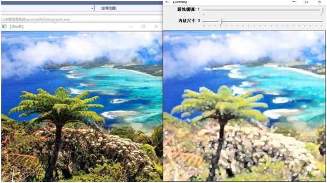
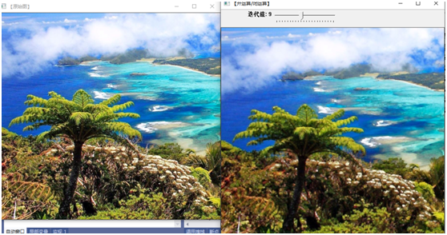
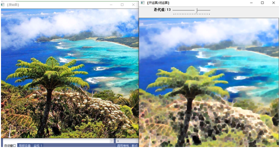
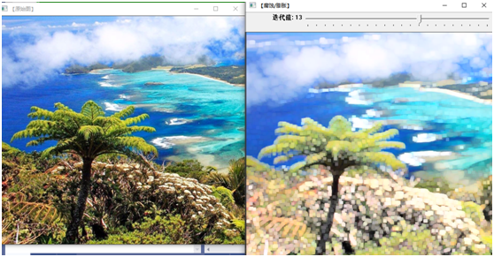
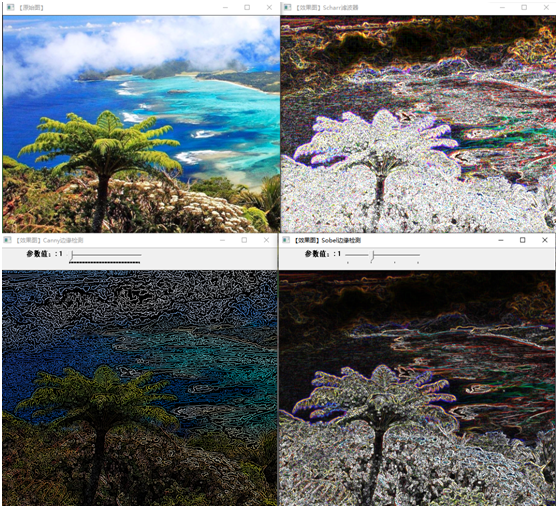
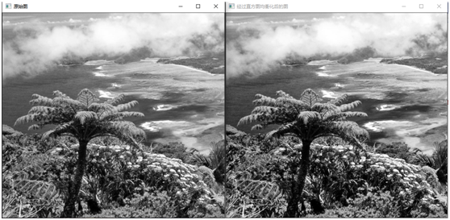
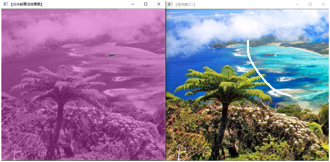

##  图像处理
这一节主要包含了
三种线性滤波：方框滤波、均值滤波、高斯滤波
两种非线性滤波：中值滤波、双边滤波
7种图像处理形态学：腐蚀、膨胀、开运算、闭运算、形态学梯度、顶帽、黑帽
漫水填充、图像缩放、图像金字塔、阈值化

### 线性滤波：方框滤波、均值滤波、高斯滤波

#### 方框滤波( box Filter )
方框滤波（box Filter)被封装在一个名为boxblur的函数中，即 boxblur函数的作用是使用方框滤波器( box filter）来模糊一张图片，从 src输入，从dst输出。
函数原型如下。
C++: void boxFilter(InputArray src, OutputArray dst,int ddepth,
Sizeksize，Point anchor=Point(-1,-1), boolnormalize=true，
IntborderType=BORDER__DEFAULT )
第一个参数，InputArray类型的src，输入图像，即源图像，填Mat类的对
象即可。该函数对通道是独立处理的，且可以处理任意通道数的图片。但需要注意，待处理的图片深度应该为CV_8U、CV_16U、CV_16s.cv_32F以及CV_64F之一。
第二个参数，OutputArray类型的 dst，即目标图像，需要和源图片有一样的尺寸和类型。
第三个参数，int类型的ddepth，输出图像的深度，-1代表使用原图深度，即src.depth()。
第四个参数，Size类型(对Size类型稍后有讲解）的ksize，内核的大小。一般用Size(w,h)来表示内核的大小，其中w为像素宽度，h为像素高度。Size (3,3）就表示3x3的核大小，Size (5,5）就表示5x5的核大小。
第五个参数，Point类型的anchor，表示锚点（即被平滑的那个点)。注意它有默认值Point(-1,-1)。如果这个点坐标是负值的话，就表示取核的中心为锚点，所以默认值Point(-1,-1)表示这个锚点在核的中心。
第六个参数，bool类型的normalize，默认值为true，一个标识符，表示内核是否被其区域归一化 （normalized)了。
第七个参数，int类型的 borderType，用于推断图像外部像素的某种边界模式。有默认值BORDER_DEFAULT，无需进行额外处理。

#### 均值滤波
均值滤波，是最简单的一种滤波操作，输出图像的每一个像素是核窗口内输入图像对应像素的平均值(所有像素加权系数相等)，其实说白了它就是归一化后
的方框滤波。我们在下文进行源码剖析时会发现，blur函数内部中其实就是调用了一下boxFilter。
#### 1．均值滤波的理论简析
均值滤波是典型的线性滤波算法，主要方法为邻域平均法，即用一片图像区域的各个像素的均值来代替原图像中的各个像素值。一般需要在图像上对目标像素给出一个模板（内核)，该模板包括了其周围的临近像素（比如以目标像素为中心的周围8(3x3-1）个像素，构成一个滤波模板，即去掉目标像素本身)。再用模板中的全体像素的平均值来代替原来像素值。即对待处理的当前像素点（x,y )，选择一个模板，该模板由其近邻的若干像素组成，求模板中所有像素的均值，再把该均值赋予当前像素点(x,y)，作为处理后图像在该点上的灰度点g (x,y)，即g (x,y) =1/m 2f (x,y)，其中m为该模板中包含当前像素在内的像素总个数。
#### 2．均值滤波的缺陷
均值滤波本身存在着固有的缺陷，即它不能很好地保护图像细节，在图像去噪的同时也破坏了图像的细节部分，从而使图像变得模糊，不能很好地去除噪声点。
#### 3．在OpenCV中使用均值滤波——blur函数
blur 函数的作用是:对输入的图像src进行均值滤波后用dst输出。blur函数在 OpenCV官方文档中，给出的其核是这样的:
这个内核一看就明了，就是在求均值，即 blur函数封装的就是均值滤波。blur函数的原型如下。
C++: void blur(InputArray src，outputArraydst,size ksize，Pointanchor=Point (-1,-1), 
int borderType=BORDER__DEFAULT )
第一个参数，InputArray类型的src，输入图像，即源图像，填Mat类的对象即可。该函数对通道是独立处理的，且可以处理任意通道数的图片。但需要注意的是，待处理的图片深度应该为CV_8u、CV_16U、CV_16S、cV_32F以及CV_64F之一。
第二个参数，OutputArray类型的dst，即目标图像，需要和源图片有一样的尺寸和类型。比如可以用Mat::Clone，以源图片为模板，来初始化得到如假包换的目标图。
第三个参数，Size类型(对Size类型稍后有讲解）的ksize，内核的大小。
一般写作Size(w,h)来表示内核的大小(其中，w为像素宽度，h为像素高度)。Size(3,3)就表示3×3的核大小，Size(5,5)就表示5×5的核大小
第四个参数，Point类型的anchor，表示锚点（即被平滑的那个点)，注意它有默认值Point(-1,-1)。如果这个点坐标是负值，就表示取核的中心为锚点，所以默认值Point(-1,-1)表示这个锚点在核的中心。
#### 高斯滤波
高斯滤波是一种线性平滑滤波，可以消除高斯噪声，广泛应用于图像处理的减噪过程。通俗地讲，高斯滤波就是对整幅图像进行加权平均的过程，每一个像素点的值，都由其本身和邻域内的其他像素值经过加权平均后得到。高斯滤波的具体操作是:用一个模板（或称卷积、掩模）扫描图像中的每一个像素，用模板确定的邻域内像素的加权平均灰度值去替代模板中心像素点的值。
高斯滤波是最有用的滤波操作,虽然它用起来效率往往不是最高的。高斯模糊技术生成的图像，其视觉效果就像是经过一个半透明屏幕在观察图像，这与镜头焦外成像效果散景以及普通照明阴影中的效果都明显不同。高斯平滑也用于计算机视觉算法中的预先处理阶段，以增强图像在不同比例大小下的图像效果(参见尺度空间表示以及尺度空间实现)。从数学的角度来看，图像的高斯模糊过程就是图像与正态分布做卷积。由于正态分布又叫作高斯分布，所以这项技术就叫作高斯模糊。
图像与圆形方框模糊做卷积将会生成更加精确的焦外成像效果。由于高斯函数的傅里叶变换是另外一个高斯函数，所以高斯模糊对于图像来说就是一个低通滤波操作。
高斯滤波器是一类根据高斯函数的形状来选择权值的线性平滑滤波器。高斯平滑滤波器对于抑制服从正态分布的噪声非常有效。一维零均值高斯函数如下。
线性滤波相关代码
 #include <opencv2/core/core.hpp>
 #include <opencv2/highgui/highgui.hpp>
 #include <opencv2/imgproc/imgproc.hpp>
 #include <iostream>
using namespace std;
using namespace cv;
//-----------------------------------【全局变量声明部分】--------------------------------------
//	描述：全局变量声明
//-----------------------------------------------------------------------------------------------
Mat g_srcImage, g_dstImage1, g_dstImage2, g_dstImage3;//存储图片的Mat类型
int g_nBoxFilterValue = 3;  //方框滤波参数值
int g_nMeanBlurValue = 3;  //均值滤波参数值
int g_nGaussianBlurValue = 3;  //高斯滤波参数值
//-----------------------------------【全局函数声明部分】--------------------------------------
//	描述：全局函数声明
//-----------------------------------------------------------------------------------------------
//四个轨迹条的回调函数
static void on_BoxFilter(int, void*);		//均值滤波
static void on_MeanBlur(int, void*);		//均值滤波
static void on_GaussianBlur(int, void*);			//高斯滤波
void ShowHelpText();
//-----------------------------------【main( )函数】--------------------------------------------
//	描述：控制台应用程序的入口函数，我们的程序从这里开始
//-----------------------------------------------------------------------------------------------
int main()
{
	//改变console字体颜色
	system("color 5F");
	//输出帮助文字
	ShowHelpText();
	// 载入原图
	g_srcImage = imread("E:\\车载信号系统\\wzxc\\wzxc\\fj.png", 1);
	if (!g_srcImage.data) { printf("Oh，no，读取srcImage错误~！ \n"); return false; }
	//克隆原图到三个Mat类型中
	g_dstImage1 = g_srcImage.clone();
	g_dstImage2 = g_srcImage.clone();
	g_dstImage3 = g_srcImage.clone();
	//显示原图
	namedWindow("【<0>原图窗口】", 1);
	imshow("【<0>原图窗口】", g_srcImage);
	//=================【<1>方框滤波】==================
	//创建窗口
	namedWindow("【<1>方框滤波】", 1);
	//创建轨迹条
	createTrackbar("内核值：", "【<1>方框滤波】", &g_nBoxFilterValue, 40, on_BoxFilter);
	on_BoxFilter(g_nBoxFilterValue, 0);
	//================================================
	//=================【<2>均值滤波】==================
	//创建窗口
	namedWindow("【<2>均值滤波】", 1);
	//创建轨迹条
	createTrackbar("内核值：", "【<2>均值滤波】", &g_nMeanBlurValue, 40, on_MeanBlur);
	on_MeanBlur(g_nMeanBlurValue, 0);
	//================================================
	//=================【<3>高斯滤波】=====================
	//创建窗口
	namedWindow("【<3>高斯滤波】", 1);
	//创建轨迹条
	createTrackbar("内核值：", "【<3>高斯滤波】", &g_nGaussianBlurValue, 40, on_GaussianBlur);
	on_GaussianBlur(g_nGaussianBlurValue, 0);
	//================================================
	//输出一些帮助信息
	cout << endl << "\t运行成功，请调整滚动条观察图像效果~\n\n"
		<< "\t按下“q”键时，程序退出。\n";
	//按下“q”键时，程序退出
	while (char(waitKey(1)) != 'q') {}
	return 0;
}
static void on_BoxFilter(int, void*)
{
	//方框滤波操作
	boxFilter(g_srcImage, g_dstImage1, -1, Size(g_nBoxFilterValue + 1, g_nBoxFilterValue + 1));
	//显示窗口
	imshow("【<1>方框滤波】", g_dstImage1);
}
//-----------------------------【on_MeanBlur( )函数】------------------------------------
//	描述：均值滤波操作的回调函数
//-----------------------------------------------------------------------------------------------
static void on_MeanBlur(int, void*)
{
	//均值滤波操作
	blur(g_srcImage, g_dstImage2, Size(g_nMeanBlurValue + 1, g_nMeanBlurValue + 1), Point(-1, -1));
	//显示窗口
	imshow("【<2>均值滤波】", g_dstImage2);
}
//-----------------------------【ContrastAndBright( )函数】------------------------------------
//	描述：高斯滤波操作的回调函数
//-----------------------------------------------------------------------------------------------
static void on_GaussianBlur(int, void*)
{
	//高斯滤波操作
	GaussianBlur(g_srcImage, g_dstImage3, Size(g_nGaussianBlurValue * 2 + 1, g_nGaussianBlurValue * 2 + 1), 0, 0);
	//显示窗口
	imshow("【<3>高斯滤波】", g_dstImage3);
}
//-----------------------------------【ShowHelpText( )函数】----------------------------------
//		 描述：输出一些帮助信息
//----------------------------------------------------------------------------------------------
void ShowHelpText()
{
	//输出欢迎信息和OpenCV版本
	printf("\n\n  ----------------------------------------------------------------------------\n");
}

### 非线性滤波
#### 中值滤波: medianBlur函数
medianBlur函数使用中值滤波器来平滑（模糊）处理一张图片，从 src输入，结果从 dst输出。对于多通道图片，它对每一个通道都单独进行处理，并且支持就地操作(In-placeoperation)。函数原型如下。
C++: void medianBlur(InputArray src,outputArray dst, int ksize)参数详解如下。
第一个参数，InputArray类型的src，函数的输入参数，填1、3或者4通道的Mat类型的图像。当ksize为3或者5的时候，图像深度需为CV_8U、cV_16U、cV_32F其中之一，而对于较大孔径尺寸的图片，它只能是cV_8U。
第二个参数:OutputArray类型的 dst，即目标图像，函数的输出参数，需要和源图片有一样的尺寸和类型。我们可以用Mat::Clone，以源图片为模板，来初始化得到如假包换的目标图。
第三个参数: int类型的ksize，孔径的线性尺寸( aperture linear size)，注意这个参数必须是大于1的奇数，比如:3、5、7、9……
#### 双边滤波：bilateralFilter函数
此函数的作用是用双边滤波器来模糊处理一张图片，由 src输入图片，结果于dst输出。函数原型如下。
C++: void bilateralFilter (InputArray src,outputArraydst,int d,double
sigmaColor，double sigmaSpace,int borderType=BORDER_DEFAULT)
第一个参数: InputArray类型的src，输入图像，即源图像，需要为8位或者浮点型单通道、三通道的图像。
第二个参数:OutputArray类型的 dst，即目标图像，需要和源图片有一样的尺寸和类型。
第三个参数: int类型的d，表示在过滤过程中每个像素邻域的直径。如果这个值被设为非正数，那么OpenCV会从第五个参数sigmaSpace来计算出它。
第四个参数: double类型的sigmaColor，颜色空间滤波器的sigma 值。这个参数的值越大，就表明该像素邻域内有越宽广的颜色会被混合到一起，产生较大的半相等颜色区域。
第五个参数:double类型的sigmaSpace，坐标空间中滤波器的sigma值，坐标空间的标注方差。它的数值越大，意味着越远的像素会相互影响，从而使更大的区域中足够相似的颜色获取相同的颜色。当d>0时，d指定了邻域大小且与 sigmaSpace无关。否则，d正比于sigmaSpace。
第六个参数: int类型的borderType，用于推断图像外部像素的某种边界模式。注意它有默认值 BORDER_DEFAULT。
代码展示如下：
 #include <opencv2/core/core.hpp>
 #include <opencv2/highgui/highgui.hpp>
 #include <opencv2/imgproc/imgproc.hpp>
 #include <iostream>
//-----------------------------------【命名空间声明部分】---------------------------------------
//		描述：包含程序所使用的命名空间
//-----------------------------------------------------------------------------------------------  
using namespace std;
using namespace cv;
//-----------------------------------【全局变量声明部分】--------------------------------------
//		描述：全局变量声明
//-----------------------------------------------------------------------------------------------
Mat g_srcImage, g_dstImage1, g_dstImage2, g_dstImage3, g_dstImage4, g_dstImage5;
int g_nBoxFilterValue = 6;  //方框滤波内核值
int g_nMeanBlurValue = 10;  //均值滤波内核值
int g_nGaussianBlurValue = 6;  //高斯滤波内核值
int g_nMedianBlurValue = 10;  //中值滤波参数值
int g_nBilateralFilterValue = 10;  //双边滤波参数值
//-----------------------------------【全局函数声明部分】--------------------------------------
//		描述：全局函数声明
//-----------------------------------------------------------------------------------------------
//轨迹条回调函数
static void on_BoxFilter(int, void*);		//方框滤波
static void on_MeanBlur(int, void*);		//均值块滤波器
static void on_GaussianBlur(int, void*);			//高斯滤波器
static void on_MedianBlur(int, void*);			//中值滤波器
static void on_BilateralFilter(int, void*);			//双边滤波器
void ShowHelpText();
//-----------------------------------【main( )函数】--------------------------------------------
//		描述：控制台应用程序的入口函数，我们的程序从这里开始
//-----------------------------------------------------------------------------------------------
int main()
{
	system("color 4F");

	ShowHelpText();

	// 载入原图
	g_srcImage = imread("E:\\车载信号系统\\wzxc\\wzxc\\fj.png", 1);
	if (!g_srcImage.data) { printf("读取srcImage错误~！ \n"); return false; }

	//克隆原图到四个Mat类型中
	g_dstImage1 = g_srcImage.clone();
	g_dstImage2 = g_srcImage.clone();
	g_dstImage3 = g_srcImage.clone();
	g_dstImage4 = g_srcImage.clone();
	g_dstImage5 = g_srcImage.clone();
	//显示原图
	namedWindow("【<0>原图窗口】", 1);
	imshow("【<0>原图窗口】", g_srcImage);
	//=================【<2>均值滤波】==========================
	//创建窗口
	namedWindow("【<2>均值滤波】", 1);
	//创建轨迹条
	createTrackbar("内核值：", "【<2>均值滤波】", &g_nMeanBlurValue, 50, on_MeanBlur);
	on_MeanBlur(g_nMeanBlurValue, 0);
	//======================================================
	//=================【<3>高斯滤波】===========================
	//创建窗口
	namedWindow("【<3>高斯滤波】", 1);
	//创建轨迹条
	createTrackbar("内核值：", "【<3>高斯滤波】", &g_nGaussianBlurValue, 50, on_GaussianBlur);
	on_GaussianBlur(g_nGaussianBlurValue, 0);
	//=======================================================
	//=================【<4>中值滤波】===========================
	//创建窗口
	namedWindow("【<4>中值滤波】", 1);
	//创建轨迹条
	createTrackbar("参数值：", "【<4>中值滤波】", &g_nMedianBlurValue, 50, on_MedianBlur);
	on_MedianBlur(g_nMedianBlurValue, 0);
	//=======================================================
	//=================【<5>双边滤波】===========================
	//创建窗口
	namedWindow("【<5>双边滤波】", 1);
	//创建轨迹条
	createTrackbar("参数值：", "【<5>双边滤波】", &g_nBilateralFilterValue, 50, on_BilateralFilter);
	on_BilateralFilter(g_nBilateralFilterValue, 0);
	//=======================================================
	//输出一些帮助信息
	cout << endl << "\t运行成功，请调整滚动条观察图像效果~\n\n"
		<< "\t按下“q”键时，程序退出。\n";
	while (char(waitKey(1)) != 'q') {}
	return 0;
}
//-----------------------------【on_BoxFilter( )函数】------------------------------------
//		描述：方框滤波操作的回调函数
//-----------------------------------------------------------------------------------------------
static void on_BoxFilter(int, void*)
{
	//方框滤波操作
	boxFilter(g_srcImage, g_dstImage1, -1, Size(g_nBoxFilterValue + 1, g_nBoxFilterValue + 1));
	//显示窗口
	imshow("【<1>方框滤波】", g_dstImage1);
}

//-----------------------------【on_MeanBlur( )函数】------------------------------------
//		描述：均值滤波操作的回调函数
//-----------------------------------------------------------------------------------------------
static void on_MeanBlur(int, void*)
{
	blur(g_srcImage, g_dstImage2, Size(g_nMeanBlurValue + 1, g_nMeanBlurValue + 1), Point(-1, -1));
	imshow("【<2>均值滤波】", g_dstImage2);
}
//-----------------------------【on_GaussianBlur( )函数】------------------------------------
//		描述：高斯滤波操作的回调函数
//-----------------------------------------------------------------------------------------------
static void on_GaussianBlur(int, void*)
{
	GaussianBlur(g_srcImage, g_dstImage3, Size(g_nGaussianBlurValue * 2 + 1, g_nGaussianBlurValue * 2 + 1), 0, 0);
	imshow("【<3>高斯滤波】", g_dstImage3);
}
//-----------------------------【on_MedianBlur( )函数】------------------------------------
//		描述：中值滤波操作的回调函数
//-----------------------------------------------------------------------------------------------
static void on_MedianBlur(int, void*)
{
	medianBlur(g_srcImage, g_dstImage4, g_nMedianBlurValue * 2 + 1);
	imshow("【<4>中值滤波】", g_dstImage4);
}
//-----------------------------【on_BilateralFilter( )函数】------------------------------------
//		描述：双边滤波操作的回调函数
//-----------------------------------------------------------------------------------------------
static void on_BilateralFilter(int, void*)
{
	bilateralFilter(g_srcImage, g_dstImage5, g_nBilateralFilterValue, g_nBilateralFilterValue * 2, g_nBilateralFilterValue / 2);
	imshow("【<5>双边滤波】", g_dstImage5);
}

//-----------------------------------【ShowHelpText( )函数】-----------------------------
//		 描述：输出一些帮助信息
//----------------------------------------------------------------------------------------------
void ShowHelpText()
{
	printf("\n\n  ----------------------------------------------------------------------------\n");
}

### 形态学滤波（1）：腐蚀与膨胀
膨胀（ dilate）就是求局部最大值的操作。从数学角度来说，膨胀或者腐蚀操作就是将图像（或图像的一部分区域，称之为A）与核（称之为B）进行卷积。
核可以是任何形状和大小，它拥有一个单独定义出来的参考点，我们称其为锚点( anchorpoint)。多数情况下，核是一个小的，中间带有参考点和实心正方形或者圆盘。其实，可以把核视为模板或者掩码。
而膨胀就是求局部最大值的操作。核B与图形卷积，即计算核B覆盖的区域的像素点的最大值，并把这个最大值赋值给参考点指定的像素。这样就会使图像中的高亮区域逐渐增长，如图6.20所示。这就是膨胀操作的初衷。
腐蚀（erode）就是求局部最小值的操作，与膨胀是一对相反的操作。

代码展示如下：
//---------------------------------【头文件、命名空间包含部分】-----------------------------
//		描述：包含程序所使用的头文件和命名空间
//------------------------------------------------------------------------------------------------
 #include <opencv2/opencv.hpp>
 #include <opencv2/highgui/highgui.hpp>
 #include <opencv2/imgproc/imgproc.hpp>
 #include <iostream>
using namespace std;
using namespace cv;
//----------------------------------【全局变量声明部分】--------------------------------------
//		描述：全局变量声明
//-----------------------------------------------------------------------------------------------
Mat g_srcImage, g_dstImage;//原始图和效果图
int g_nTrackbarNumer = 0;//0表示腐蚀erode, 1表示膨胀dilate
int g_nStructElementSize = 3; //结构元素(内核矩阵)的尺寸
//-----------------------------------【全局函数声明部分】--------------------------------------
//		描述：全局函数声明
//-----------------------------------------------------------------------------------------------
void Process();//膨胀和腐蚀的处理函数
void on_TrackbarNumChange(int, void*);//回调函数
void on_ElementSizeChange(int, void*);//回调函数
void ShowHelpText();
//-----------------------------------【main( )函数】--------------------------------------------
//		描述：控制台应用程序的入口函数，我们的程序从这里开始
//-----------------------------------------------------------------------------------------------
int main()
{
	//改变console字体颜色
	system("color 2F");
	//载入原图
	g_srcImage = imread("E:\\车载信号系统\\wzxc\\wzxc\\fj.png");
	if (!g_srcImage.data) { printf("读取srcImage错误~！ \n"); return false; }
	ShowHelpText();
	//显示原始图
	namedWindow("【原始图】");
	imshow("【原始图】", g_srcImage);
	//进行初次腐蚀操作并显示效果图
	namedWindow("【效果图】");
	//获取自定义核
	Mat element = getStructuringElement(MORPH_RECT, Size(2 * g_nStructElementSize + 1, 2 * g_nStructElementSize + 1), Point(g_nStructElementSize, g_nStructElementSize));
	erode(g_srcImage, g_dstImage, element);
	imshow("【效果图】", g_dstImage);
	//创建轨迹条
	createTrackbar("腐蚀/膨胀", "【效果图】", &g_nTrackbarNumer, 1, on_TrackbarNumChange);
	createTrackbar("内核尺寸", "【效果图】", &g_nStructElementSize, 21, on_ElementSizeChange);
	//输出一些帮助信息
	cout << endl << "\t运行成功，请调整滚动条观察图像效果~\n\n"
		<< "\t按下“q”键时，程序退出。\n";
	//轮询获取按键信息，若下q键，程序退出
	while (char(waitKey(1)) != 'q') {}
	return 0;
}
//-----------------------------【Process( )函数】------------------------------------
//		描述：进行自定义的腐蚀和膨胀操作
//-----------------------------------------------------------------------------------------
void Process()
{
	//获取自定义核
	Mat element = getStructuringElement(MORPH_RECT, Size(2 * g_nStructElementSize + 1, 2 * g_nStructElementSize + 1), Point(g_nStructElementSize, g_nStructElementSize));
	//进行腐蚀或膨胀操作
	if (g_nTrackbarNumer == 0) {
		erode(g_srcImage, g_dstImage, element);
	}
	else {
		dilate(g_srcImage, g_dstImage, element);
	}
	//显示效果图
	imshow("【效果图】", g_dstImage);
}
//-----------------------------【on_TrackbarNumChange( )函数】------------------------------------
//		描述：腐蚀和膨胀之间切换开关的回调函数
//-----------------------------------------------------------------------------------------------------
void on_TrackbarNumChange(int, void*)
{
	//腐蚀和膨胀之间效果已经切换，回调函数体内需调用一次Process函数，使改变后的效果立即生效并显示出来
	Process();
}
//-----------------------------【on_ElementSizeChange( )函数】-------------------------------------
//		描述：腐蚀和膨胀操作内核改变时的回调函数
//-----------------------------------------------------------------------------------------------------
void on_ElementSizeChange(int, void*)
{
	//内核尺寸已改变，回调函数体内需调用一次Process函数，使改变后的效果立即生效并显示出来
	Process();
}
//-----------------------------------【ShowHelpText( )函数】-----------------------------
//		 描述：输出一些帮助信息
//----------------------------------------------------------------------------------------------
void ShowHelpText()
{
	//输出欢迎信息和OpenCV版本
	printf("\n\n  ----------------------------------------------------------------------------\n");
}

### 形态学（2）：开运算、闭运算、形态学梯度、顶帽、黑帽
开运算就是先腐蚀后膨胀的操作过程。其数字表达式为：
	Dst=open(src,element)=dilate(erode(src,element))
开运算可以用来消除小物体，在纤细点处分离物体，并且在平滑较大物体的边界的同时不明显改变其面积。

#### 闭运算就是先膨胀的过程称为闭运算，其数字表达式为：
	Dst=clese(src,element)=erode(dilate(src,element))
闭运算能够排除小型黑洞（黑色区域）。

#### 形态学梯度就是膨胀图与腐蚀图之差，数学表达式如下：
Dst=morph-grad(src,element)=dilate(src,element)-erode(src,element)

#### 顶帽
常常被称为“礼帽”运算，是原图像与介绍的“开运算”的结果图之差，数字表达式：
Dst=tophat(src,element)=src-open(src,element)
因为开运算带来的结果是放大了裂缝或者局部低亮度的区域。所以从原图中减去开运算后的图，得到的效果图突出了比原图轮廓周围的区域更明亮的区域，且这一操作与选择的核的大小相关。

#### 黑帽运算
黑帽运算是闭运算的结果图与原图像之差。数学表达式为：
Dst=blackhat (src,element) =close(src,element) - src
黑帽运算后的效果图突出了比原图轮廓周围的区域更暗的区域，且这一操竹和选择的核的大小相关。

综合代码如下：
 #include <opencv2/opencv.hpp>
 #include <opencv2/highgui/highgui.hpp>
 #include <opencv2/imgproc/imgproc.hpp>
using namespace std;
using namespace cv;
//-----------------------------------【全局变量声明部分】-----------------------------------
//		描述：全局变量声明
//-----------------------------------------------------------------------------------------------
Mat g_srcImage, g_dstImage;//原始图和效果图
int g_nElementShape = MORPH_RECT;//元素结构的形状
//变量接收的TrackBar位置参数
int g_nMaxIterationNum = 10;
int g_nOpenCloseNum = 0;
int g_nErodeDilateNum = 0;
int g_nTopBlackHatNum = 0;
//-----------------------------------【全局函数声明部分】--------------------------------------
//		描述：全局函数声明
//-----------------------------------------------------------------------------------------------
static void on_OpenClose(int, void*);//回调函数
static void on_ErodeDilate(int, void*);//回调函数
static void on_TopBlackHat(int, void*);//回调函数
static void ShowHelpText();
//-----------------------------------【main( )函数】--------------------------------------------
//		描述：控制台应用程序的入口函数，我们的程序从这里开始
//-----------------------------------------------------------------------------------------------
int main()
{
	//改变console字体颜色
	system("color 2F");
	ShowHelpText();
	//载入原图
	g_srcImage = imread("1.jpg");
	if (!g_srcImage.data) { printf("Oh，no，读取srcImage错误~！ \n"); return false; }
	//显示原始图
	namedWindow("【原始图】");
	imshow("【原始图】", g_srcImage);
	//创建三个窗口
	namedWindow("【开运算/闭运算】", 1);
	namedWindow("【腐蚀/膨胀】", 1);
	namedWindow("【顶帽/黑帽】", 1);
	//参数赋值
	g_nOpenCloseNum = 9;
	g_nErodeDilateNum = 9;
	g_nTopBlackHatNum = 2;
	//分别为三个窗口创建滚动条
	createTrackbar("迭代值", "【开运算/闭运算】", &g_nOpenCloseNum, g_nMaxIterationNum * 2 + 1, on_OpenClose);
	createTrackbar("迭代值", "【腐蚀/膨胀】", &g_nErodeDilateNum, g_nMaxIterationNum * 2 + 1, on_ErodeDilate);
	createTrackbar("迭代值", "【顶帽/黑帽】", &g_nTopBlackHatNum, g_nMaxIterationNum * 2 + 1, on_TopBlackHat);
	//轮询获取按键信息
	while (1)
	{
		int c;
		//执行回调函数
		on_OpenClose(g_nOpenCloseNum, 0);
		on_ErodeDilate(g_nErodeDilateNum, 0);
		on_TopBlackHat(g_nTopBlackHatNum, 0);
		//获取按键
		c = waitKey(0);
		//按下键盘按键Q或者ESC，程序退出
		if ((char)c == 'q' || (char)c == 27)
			break;
		//按下键盘按键1，使用椭圆(Elliptic)结构元素结构元素MORPH_ELLIPSE
		if ((char)c == 49)//键盘按键1的ASII码为49
			g_nElementShape = MORPH_ELLIPSE;
		//按下键盘按键2，使用矩形(Rectangle)结构元素MORPH_RECT
		else if ((char)c == 50)//键盘按键2的ASII码为50
			g_nElementShape = MORPH_RECT;
		//按下键盘按键3，使用十字形(Cross-shaped)结构元素MORPH_CROSS
		else if ((char)c == 51)//键盘按键3的ASII码为51
			g_nElementShape = MORPH_CROSS;
		//按下键盘按键space，在矩形、椭圆、十字形结构元素中循环
		else if ((char)c == ' ')
			g_nElementShape = (g_nElementShape + 1) % 3;
	}

	return 0;
}

//-----------------------------------【on_OpenClose( )函数】----------------------------------
//		描述：【开运算/闭运算】窗口的回调函数
//-----------------------------------------------------------------------------------------------
static void on_OpenClose(int, void*)
{
	//偏移量的定义
	int offset = g_nOpenCloseNum - g_nMaxIterationNum;//偏移量
	int Absolute_offset = offset > 0 ? offset : -offset;//偏移量绝对值
	//自定义核
	Mat element = getStructuringElement(g_nElementShape, Size(Absolute_offset * 2 + 1, Absolute_offset * 2 + 1), Point(Absolute_offset, Absolute_offset));
	//进行操作
	if (offset < 0)
		//此句代码的OpenCV2版为：
		//morphologyEx(g_srcImage, g_dstImage, CV_MOP_OPEN, element);
		//此句代码的OpenCV3版为:
		morphologyEx(g_srcImage, g_dstImage, MORPH_OPEN, element);
	else
		//此句代码的OpenCV2版为：
		//morphologyEx(g_srcImage, g_dstImage, CV_MOP_CLOSE, element);
		//此句代码的OpenCV3版为:
		morphologyEx(g_srcImage, g_dstImage, MORPH_CLOSE, element);

	//显示图像
	imshow("【开运算/闭运算】", g_dstImage);
}
//-----------------------------------【on_ErodeDilate( )函数】----------------------------------
//		描述：【腐蚀/膨胀】窗口的回调函数
//-----------------------------------------------------------------------------------------------
static void on_ErodeDilate(int, void*)
{
	//偏移量的定义
	int offset = g_nErodeDilateNum - g_nMaxIterationNum;	//偏移量
	int Absolute_offset = offset > 0 ? offset : -offset;//偏移量绝对值
	//自定义核
	Mat element = getStructuringElement(g_nElementShape, Size(Absolute_offset * 2 + 1, Absolute_offset * 2 + 1), Point(Absolute_offset, Absolute_offset));
	//进行操作
	if (offset < 0)
		erode(g_srcImage, g_dstImage, element);
	else
		dilate(g_srcImage, g_dstImage, element);
	//显示图像
	imshow("【腐蚀/膨胀】", g_dstImage);
}

//-----------------------------------【on_TopBlackHat( )函数】--------------------------------
//		描述：【顶帽运算/黑帽运算】窗口的回调函数
//----------------------------------------------------------------------------------------------
static void on_TopBlackHat(int, void*)
{
	//偏移量的定义
	int offset = g_nTopBlackHatNum - g_nMaxIterationNum;//偏移量
	int Absolute_offset = offset > 0 ? offset : -offset;//偏移量绝对值
	//自定义核
	Mat element = getStructuringElement(g_nElementShape, Size(Absolute_offset * 2 + 1, Absolute_offset * 2 + 1), Point(Absolute_offset, Absolute_offset));
	//进行操作
	if (offset < 0)
		morphologyEx(g_srcImage, g_dstImage, MORPH_TOPHAT, element);
	else
		morphologyEx(g_srcImage, g_dstImage, MORPH_BLACKHAT, element);
	//显示图像
	imshow("【顶帽/黑帽】", g_dstImage);
}

//-----------------------------------【ShowHelpText( )函数】----------------------------------
//		描述：输出一些帮助信息
//----------------------------------------------------------------------------------------------
static void ShowHelpText()
{
	//输出欢迎信息和OpenCV版本
	printf("\n\n  ----------------------------------------------------------------------------\n");

	//输出一些帮助信息
	printf("\n\t请调整滚动条观察图像效果\n\n");
	printf("\n\t按键操作说明: \n\n"
		"\t\t键盘按键【ESC】或者【Q】- 退出程序\n"
		"\t\t键盘按键【1】- 使用椭圆(Elliptic)结构元素\n"
		"\t\t键盘按键【2】- 使用矩形(Rectangle )结构元素\n"
		"\t\t键盘按键【3】- 使用十字型(Cross-shaped)结构元素\n"
		"\t\t键盘按键【空格SPACE】- 在矩形、椭圆、十字形结构元素中循环\n");
}

#### 满水填充法的基本思想
所谓漫水填充，简单来说，就是自动选中了和种子点相连的区域，接着将该区域替换成指定的颜色，这是个非常有用的功能，经常用来标记或者分离图像的一部分进行处理或分析。漫水填充也可以用来从输入图像获取掩码区域，掩码会加速处理过程，或者只处理掩码指定的像素点。
以此填充算法为基础，类似 PhotoShop的魔术棒选择工具就很容易实现了。漫水填充(FloodFill）是查找和种子点连通的颜色相同的点，魔术棒选择工具则是查找和种子点连通的颜色相近的点，把和初始种子像素颜色相近的点压进栈做为新种子。
在OpenCV中，漫水填充是填充算法中最通用的方法。且在 OpenCV 2.X中，使用C++重写过的FloodFill函数有两个版本:一个不带掩膜mask的版本，和一个带 mask 的版本。这个掩膜mask，就是用于进一步控制哪些区域将被填充颜色(比如说当对同一图像进行多次填充时)。这两个版本的FloodFill，都必须在图像中选择一个种子点，然后把临近区域所有相似点填充上同样的颜色，不同的是，不一定将所有的邻近像素点都染上同一颜色，漫水填充操作的结果总是某个连续的区域。当邻近像素点位于给定的范围(从 loDiff 到upDiff)内或在原始seedPoint像素值范围内时，FloodFill函数就会为这个点涂上颜色。

#### 实现漫水填充算法
 #include "opencv2/imgproc/imgproc.hpp"
 #include "opencv2/highgui/highgui.hpp"
 #include <iostream>
using namespace cv;
using namespace std;

//-----------------------------------【全局变量声明部分】--------------------------------------  
//      描述：全局变量声明  
//-----------------------------------------------------------------------------------------------  
Mat g_srcImage, g_dstImage, g_grayImage, g_maskImage;//定义原始图、目标图、灰度图、掩模图
int g_nFillMode = 1;//漫水填充的模式
int g_nLowDifference = 20, g_nUpDifference = 20;//负差最大值、正差最大值
int g_nConnectivity = 4;//表示floodFill函数标识符低八位的连通值
int g_bIsColor = true;//是否为彩色图的标识符布尔值
bool g_bUseMask = false;//是否显示掩膜窗口的布尔值
int g_nNewMaskVal = 255;//新的重新绘制的像素值
//-----------------------------------【ShowHelpText( )函数】----------------------------------  
//      描述：输出一些帮助信息  
//----------------------------------------------------------------------------------------------  
static void ShowHelpText()
{
	//输出欢迎信息和OpenCV版本
	printf("\n\n  ----------------------------------------------------------------------------\n");

	//输出一些帮助信息  
	printf("\n\n\t欢迎来到漫水填充示例程序~");
	printf("\n\n\t本示例根据鼠标选取的点搜索图像中与之颜色相近的点，并用不同颜色标注。");

	printf("\n\n\t按键操作说明: \n\n"
		"\t\t鼠标点击图中区域- 进行漫水填充操作\n"
		"\t\t键盘按键【ESC】- 退出程序\n"
		"\t\t键盘按键【1】-  切换彩色图/灰度图模式\n"
		"\t\t键盘按键【2】- 显示/隐藏掩膜窗口\n"
		"\t\t键盘按键【3】- 恢复原始图像\n"
		"\t\t键盘按键【4】- 使用空范围的漫水填充\n"
		"\t\t键盘按键【5】- 使用渐变、固定范围的漫水填充\n"
		"\t\t键盘按键【6】- 使用渐变、浮动范围的漫水填充\n"
		"\t\t键盘按键【7】- 操作标志符的低八位使用4位的连接模式\n"
		"\t\t键盘按键【8】- 操作标志符的低八位使用8位的连接模式\n\n");
}
//-----------------------------------【onMouse( )函数】--------------------------------------  
//      描述：鼠标消息onMouse回调函数
//---------------------------------------------------------------------------------------------
static void onMouse(int event, int x, int y, int, void*)
{
	// 若鼠标左键没有按下，便返回
	//此句代码的OpenCV2版为：
	//if( event != CV_EVENT_LBUTTONDOWN )
	//此句代码的OpenCV3版为：
	if (event != EVENT_LBUTTONDOWN)
		return;

	//-------------------【<1>调用floodFill函数之前的参数准备部分】---------------
	Point seed = Point(x, y);
	int LowDifference = g_nFillMode == 0 ? 0 : g_nLowDifference;//空范围的漫水填充，此值设为0，否则设为全局的g_nLowDifference
	int UpDifference = g_nFillMode == 0 ? 0 : g_nUpDifference;//空范围的漫水填充，此值设为0，否则设为全局的g_nUpDifference

	//标识符的0~7位为g_nConnectivity，8~15位为g_nNewMaskVal左移8位的值，16~23位为CV_FLOODFILL_FIXED_RANGE或者0。
	//此句代码的OpenCV2版为：
	//int flags = g_nConnectivity + (g_nNewMaskVal << 8) +(g_nFillMode == 1 ? CV_FLOODFILL_FIXED_RANGE : 0);
	//此句代码的OpenCV3版为：
	int flags = g_nConnectivity + (g_nNewMaskVal << 8) + (g_nFillMode == 1 ? FLOODFILL_FIXED_RANGE : 0);

	//随机生成bgr值
	int b = (unsigned)theRNG() & 255;//随机返回一个0~255之间的值
	int g = (unsigned)theRNG() & 255;//随机返回一个0~255之间的值
	int r = (unsigned)theRNG() & 255;//随机返回一个0~255之间的值
	Rect ccomp;//定义重绘区域的最小边界矩形区域

	Scalar newVal = g_bIsColor ? Scalar(b, g, r) : Scalar(r * 0.299 + g * 0.587 + b * 0.114);//在重绘区域像素的新值，若是彩色图模式，取Scalar(b, g, r)；若是灰度图模式，取Scalar(r*0.299 + g*0.587 + b*0.114)

	Mat dst = g_bIsColor ? g_dstImage : g_grayImage;//目标图的赋值
	int area;

	//--------------------【<2>正式调用floodFill函数】-----------------------------
	if (g_bUseMask)
	{
		//此句代码的OpenCV2版为：
		//threshold(g_maskImage, g_maskImage, 1, 128, CV_THRESH_BINARY);
		//此句代码的OpenCV3版为：
		threshold(g_maskImage, g_maskImage, 1, 128, THRESH_BINARY);
		area = floodFill(dst, g_maskImage, seed, newVal, &ccomp, Scalar(LowDifference, LowDifference, LowDifference),
			Scalar(UpDifference, UpDifference, UpDifference), flags);
		imshow("mask", g_maskImage);
	}
	else
	{
		area = floodFill(dst, seed, newVal, &ccomp, Scalar(LowDifference, LowDifference, LowDifference),
			Scalar(UpDifference, UpDifference, UpDifference), flags);
	}

	imshow("效果图", dst);
	cout << area << " 个像素被重绘\n";
}

//-----------------------------------【main( )函数】--------------------------------------------  
//      描述：控制台应用程序的入口函数，我们的程序从这里开始  
//-----------------------------------------------------------------------------------------------  
int main(int argc, char** argv)
{
	//改变console字体颜色  
	system("color 2F");
	//载入原图
	g_srcImage = imread("E:\\车载信号系统\\wzxc\\wzxc\\fj.png", 1);
	if (!g_srcImage.data) { printf("读取图片image0错误~！ \n"); return false; }
	//显示帮助文字
	ShowHelpText();
	g_srcImage.copyTo(g_dstImage);//拷贝源图到目标图
	cvtColor(g_srcImage, g_grayImage, COLOR_BGR2GRAY);//转换三通道的image0到灰度图
	g_maskImage.create(g_srcImage.rows + 2, g_srcImage.cols + 2, CV_8UC1);//利用image0的尺寸来初始化掩膜mask
	//此句代码的OpenCV2版为：
	//namedWindow( "效果图",CV_WINDOW_AUTOSIZE );
	//此句代码的OpenCV2版为：
	namedWindow("效果图", WINDOW_AUTOSIZE);
	//创建Trackbar
	createTrackbar("负差最大值", "效果图", &g_nLowDifference, 255, 0);
	createTrackbar("正差最大值", "效果图", &g_nUpDifference, 255, 0);
	//鼠标回调函数
	setMouseCallback("效果图", onMouse, 0);
	//循环轮询按键
	while (1)
	{
		//先显示效果图
		imshow("效果图", g_bIsColor ? g_dstImage : g_grayImage);
		//获取键盘按键
		int c = waitKey(0);
		//判断ESC是否按下，若按下便退出
		if ((c & 255) == 27)
		{
			cout << "程序退出...........\n";
			break;
		}
		//根据按键的不同，进行各种操作
		switch ((char)c)
		{
			//如果键盘“1”被按下，效果图在在灰度图，彩色图之间互换
		case '1':
			if (g_bIsColor)//若原来为彩色，转为灰度图，并且将掩膜mask所有元素设置为0
			{
				cout << "键盘“1”被按下，切换彩色/灰度模式，当前操作为将【彩色模式】切换为【灰度模式】\n";
				cvtColor(g_srcImage, g_grayImage, COLOR_BGR2GRAY);
				g_maskImage = Scalar::all(0);	//将mask所有元素设置为0
				g_bIsColor = false;	//将标识符置为false，表示当前图像不为彩色，而是灰度
			}
			else//若原来为灰度图，便将原来的彩图image0再次拷贝给image，并且将掩膜mask所有元素设置为0
			{
				cout << "键盘“1”被按下，切换彩色/灰度模式，当前操作为将【彩色模式】切换为【灰度模式】\n";
				g_srcImage.copyTo(g_dstImage);
				g_maskImage = Scalar::all(0);
				g_bIsColor = true;//将标识符置为true，表示当前图像模式为彩色
			}
			break;
			//如果键盘按键“2”被按下，显示/隐藏掩膜窗口
		case '2':
			if (g_bUseMask)
			{
				destroyWindow("mask");
				g_bUseMask = false;
			}
			else
			{
				namedWindow("mask", 0);
				g_maskImage = Scalar::all(0);
				imshow("mask", g_maskImage);
				g_bUseMask = true;
			}
			break;
			//如果键盘按键“3”被按下，恢复原始图像
		case '3':
			cout << "按键“3”被按下，恢复原始图像\n";
			g_srcImage.copyTo(g_dstImage);
			cvtColor(g_dstImage, g_grayImage, COLOR_BGR2GRAY);
			g_maskImage = Scalar::all(0);
			break;
			//如果键盘按键“4”被按下，使用空范围的漫水填充
		case '4':
			cout << "按键“4”被按下，使用空范围的漫水填充\n";
			g_nFillMode = 0;
			break;
			//如果键盘按键“5”被按下，使用渐变、固定范围的漫水填充
		case '5':
			cout << "按键“5”被按下，使用渐变、固定范围的漫水填充\n";
			g_nFillMode = 1;
			break;
			//如果键盘按键“6”被按下，使用渐变、浮动范围的漫水填充
		case '6':
			cout << "按键“6”被按下，使用渐变、浮动范围的漫水填充\n";
			g_nFillMode = 2;
			break;
			//如果键盘按键“7”被按下，操作标志符的低八位使用4位的连接模式
		case '7':
			cout << "按键“7”被按下，操作标志符的低八位使用4位的连接模式\n";
			g_nConnectivity = 4;
			break;
			//如果键盘按键“8”被按下，操作标志符的低八位使用8位的连接模式
		case '8':
			cout << "按键“8”被按下，操作标志符的低八位使用8位的连接模式\n";
			g_nConnectivity = 8;
			break;
		}
	}

	return 0;
}

## 直方图
 #include "opencv2/highgui/highgui.hpp"
 #include "opencv2/imgproc/imgproc.hpp"
using namespace cv;
//--------------------------------------【main( )函数】-----------------------------------------
//          描述：控制台应用程序的入口函数，我们的程序从这里开始执行
//-----------------------------------------------------------------------------------------------
int main()
{
	// 【1】加载源图像
	Mat srcImage, dstImage;
	srcImage = imread("E:\\车载信号系统\\asd\\asd\\1.jpg", 1);
	if (!srcImage.data) { printf("读取图片错误，请确定目录下是否有imread函数指定图片存在~！ \n"); return false; }
	// 【2】转为灰度图并显示出来
	cvtColor(srcImage, srcImage, COLOR_BGR2GRAY);
	imshow("原始图", srcImage);
	// 【3】进行直方图均衡化
	equalizeHist(srcImage, dstImage);
	// 【4】显示结果
	imshow("经过直方图均衡化后的图", dstImage);
	// 等待用户按键退出程序
	waitKey(0);
	return 0;
}

此章节中学习了各种利用OpenCV进行图像处理的方法。包括属于线性滤波的方框滤波、均值滤波与高斯滤波，属于非线性滤波的中值滤波、双边滤波;两种基本形态学操作——膨胀与腐蚀;5种高级形态学滤波操作——开运算、闭运算、形态学梯度、顶帽以及黑帽;还有漫水填充算法、图像金字塔、图像缩放、阈值化。涉及到的内容可谓非常丰富。

#### 基于OpenCV的边缘检测
学习OpenCV中边缘检测的各种算子和滤波器——Canny算子、Sobel算子、Laplacian算子以及Scharr滤波器。
边缘检测的一般步骤
在具体介绍之前，先来一起看看边缘检测的一般步骤。
1.【第一步】滤波
边缘检测的算法主要是基于图像强度的一阶和二阶导数，但导数通常对噪声很敏感，因此必须采用滤波器来改善与噪声有关的边缘检测器的性能。常见的滤波方法主要有高斯滤波，即采用离散化的高斯函数产生一组归一化的高斯核，然后基于高斯核函数对图像灰度矩阵的每一点进行加权求和。
2.【第二步】增强
增强边缘的基础是确定图像各点邻域强度的变化值。增强算法可以将图像灰度点邻域强度值有显著变化的点凸显出来。在具体编程实现时，可通过计算梯度幅值来确定。
3.【第三步】检测
经过增强的图像，往往邻域中有很多点的梯度值比较大，而在特定的应用中，这些点并不是要找的边缘点，所以应该采用某种方法来对这些点进行取舍。实际工程中，常用的方法是通过阈值化方法来检测。
另外，需要注意，下文中讲到的Laplacian算子、sobel算子和 Scharr算子都是带方向的，所以，示例中我们分别写了X方向、Y方向和最终合成的的效果图。
 #include <opencv2/highgui/highgui.hpp>
 #include <opencv2/imgproc/imgproc.hpp>
using namespace cv;

//-----------------------------------【全局变量声明部分】--------------------------------------
//		描述：全局变量声明
//-----------------------------------------------------------------------------------------------
//原图，原图的灰度版，目标图
Mat g_srcImage, g_srcGrayImage,g_dstImage;

//Canny边缘检测相关变量
Mat g_cannyDetectedEdges;
int g_cannyLowThreshold=1;//TrackBar位置参数  

//Sobel边缘检测相关变量
Mat g_sobelGradient_X, g_sobelGradient_Y;
Mat g_sobelAbsGradient_X, g_sobelAbsGradient_Y;
int g_sobelKernelSize=1;//TrackBar位置参数  

//Scharr滤波器相关变量
Mat g_scharrGradient_X, g_scharrGradient_Y;
Mat g_scharrAbsGradient_X, g_scharrAbsGradient_Y;
//-----------------------------------【全局函数声明部分】--------------------------------------
//		描述：全局函数声明
//-----------------------------------------------------------------------------------------------
static void ShowHelpText( );
static void on_Canny(int, void*);//Canny边缘检测窗口滚动条的回调函数
static void on_Sobel(int, void*);//Sobel边缘检测窗口滚动条的回调函数
void Scharr( );//封装了Scharr边缘检测相关代码的函数
//-----------------------------------【main( )函数】--------------------------------------------
//		描述：控制台应用程序的入口函数，我们的程序从这里开始
//-----------------------------------------------------------------------------------------------
int main( int argc, char** argv )
{
	//改变console字体颜色
	system("color 2F");  

	//显示欢迎语
	ShowHelpText();
	//载入原图
	g_srcImage = imread("1.jpg");
	if( !g_srcImage.data ) { printf("Oh，no，读取srcImage错误~！ \n"); return false; }
	//显示原始图
	namedWindow("【原始图】");
	imshow("【原始图】", g_srcImage);
	// 创建与src同类型和大小的矩阵(dst)
	g_dstImage.create( g_srcImage.size(), g_srcImage.type() );
	// 将原图像转换为灰度图像
	cvtColor( g_srcImage, g_srcGrayImage, COLOR_BGR2GRAY );
	// 创建显示窗口
	namedWindow( "【效果图】Canny边缘检测", WINDOW_AUTOSIZE );
	namedWindow( "【效果图】Sobel边缘检测", WINDOW_AUTOSIZE );
	// 创建trackbar
	createTrackbar( "参数值：", "【效果图】Canny边缘检测", &g_cannyLowThreshold, 120, on_Canny );
	createTrackbar( "参数值：", "【效果图】Sobel边缘检测", &g_sobelKernelSize, 3, on_Sobel );
	// 调用回调函数
	on_Canny(0, 0);
	on_Sobel(0, 0);
	//调用封装了Scharr边缘检测代码的函数
	Scharr( );
	//轮询获取按键信息，若按下Q，程序退出
	while((char(waitKey(1)) != 'q')) {}
	return 0;
}
//-----------------------------------【ShowHelpText( )函数】----------------------------------
//		描述：输出一些帮助信息
//----------------------------------------------------------------------------------------------
static void ShowHelpText()
{
	//输出欢迎信息和OpenCV版本
	printf("\n\n  ----------------------------------------------------------------------------\n");
	//输出一些帮助信息
	printf( "\n\n\t运行成功，请调整滚动条观察图像效果~\n\n"
		"\t按下“q”键时，程序退出。\n");
}
//-----------------------------------【on_Canny( )函数】----------------------------------
//		描述：Canny边缘检测窗口滚动条的回调函数
//-----------------------------------------------------------------------------------------------
void on_Canny(int, void*)
{
	// 先使用 3x3内核来降噪
	blur( g_srcGrayImage, g_cannyDetectedEdges, Size(3,3) );

	// 运行我们的Canny算子
	Canny( g_cannyDetectedEdges, g_cannyDetectedEdges, g_cannyLowThreshold, g_cannyLowThreshold*3, 3 );

	//先将g_dstImage内的所有元素设置为0 
	g_dstImage = Scalar::all(0);

	//使用Canny算子输出的边缘图g_cannyDetectedEdges作为掩码，来将原图g_srcImage拷到目标图g_dstImage中
	g_srcImage.copyTo( g_dstImage, g_cannyDetectedEdges);

	//显示效果图
	imshow( "【效果图】Canny边缘检测", g_dstImage );
}
//-----------------------------------【on_Sobel( )函数】----------------------------------
//		描述：Sobel边缘检测窗口滚动条的回调函数
//-----------------------------------------------------------------------------------------
void on_Sobel(int, void*)
{
	// 求 X方向梯度
	Sobel( g_srcImage, g_sobelGradient_X, CV_16S, 1, 0, (2*g_sobelKernelSize+1), 1, 1, BORDER_DEFAULT );
	convertScaleAbs( g_sobelGradient_X, g_sobelAbsGradient_X );//计算绝对值，并将结果转换成8位
	// 求Y方向梯度
	Sobel( g_srcImage, g_sobelGradient_Y, CV_16S, 0, 1, (2*g_sobelKernelSize+1), 1, 1, BORDER_DEFAULT );
	convertScaleAbs( g_sobelGradient_Y, g_sobelAbsGradient_Y );//计算绝对值，并将结果转换成8位
	// 合并梯度
	addWeighted( g_sobelAbsGradient_X, 0.5, g_sobelAbsGradient_Y, 0.5, 0, g_dstImage );
	//显示效果图
	imshow("【效果图】Sobel边缘检测", g_dstImage); 

}
//-----------------------------------【Scharr( )函数】----------------------------------
//		描述：封装了Scharr边缘检测相关代码的函数
//-----------------------------------------------------------------------------------------
void Scharr( )
{
	// 求 X方向梯度
	Scharr( g_srcImage, g_scharrGradient_X, CV_16S, 1, 0, 1, 0, BORDER_DEFAULT );
	convertScaleAbs( g_scharrGradient_X, g_scharrAbsGradient_X );//计算绝对值，并将结果转换成8位
	// 求Y方向梯度
	Scharr( g_srcImage, g_scharrGradient_Y, CV_16S, 0, 1, 1, 0, BORDER_DEFAULT );
	convertScaleAbs( g_scharrGradient_Y, g_scharrAbsGradient_Y );//计算绝对值，并将结果转换成8位
	// 合并梯度
	addWeighted( g_scharrAbsGradient_X, 0.5, g_scharrAbsGradient_Y, 0.5, 0, g_dstImage );
	//显示效果图
	imshow("【效果图】Scharr滤波器", g_dstImage); 
}

直方图均衡化
很多时候，用相机拍摄的照片的效果往往会不尽人意。这时，可以对这些图像进行一些处理，来扩大图像的动态范围。这种情况下最常用到的技术就是直方图均衡化。未经均衡化的图片范例。
直方图均衡化
 #include "opencv2/highgui/highgui.hpp"
 #include "opencv2/imgproc/imgproc.hpp"
using namespace cv;
//--------------------------------------【main( )函数】-----------------------------------------
//          描述：控制台应用程序的入口函数，我们的程序从这里开始执行
//-----------------------------------------------------------------------------------------------
int main()
{
	// 【1】加载源图像
	Mat srcImage, dstImage;
	srcImage = imread("E:\\车载信号系统\\xzj\\xzj\\fj.png", 1);
	if (!srcImage.data) { printf("读取图片错误，请确定目录下是否有imread函数指定图片存在~！ \n"); return false; }

	// 【2】转为灰度图并显示出来
	cvtColor(srcImage, srcImage, COLOR_BGR2GRAY);
	imshow("原始图", srcImage);

	// 【3】进行直方图均衡化
	equalizeHist(srcImage, dstImage);

	// 【4】显示结果
	imshow("经过直方图均衡化后的图", dstImage);

	// 等待用户按键退出程序
	waitKey(0);
	return 0;
}

霍夫曼变换
探讨OpenCV中霍夫变换相关的知识点，并了解了OpenCV中实现霍夫线变换的HoughLines、HoughLinesP函数的使用方法，以及实现霍夫圆变换的HoughCircles函数的使用方法。
在图像处理和计算机视觉领域中，如何从当前的图像中提取所需要的特征信息是图像识别的关键所在。在许多应用场合中需要快速准确地检测出直线或者圆。其中一种非常有效的解决问题的方法是霍夫(Hough）变换，其为图像处理中从图像中识别几何形状的基本方法之一，应用很广泛，也有很多改进算法。最基本的霍夫变换是从黑白图像中检测直线(线段)。本节就将介绍 OpenCV中霍夫变换的使用方法和相关知识。
霍夫变换（Hough Transform）是图像处理中的一种特征提取技术，该过程在一个参数空间中通过计算累计结果的局部最大值得到一个符合该特定形状的集合作为霍夫变换结果。霍夫变换于1962年由PaulHough首次提出，最初的 Hough变换是设计用来检测直线和曲线的。起初的方法要求知道物体边界线的解析方程,但不需要有关区域位置的先验知识。这种方法的一个突出优点是分割结果的Robustness，即对数据的不完全或噪声不是非常敏感。然而，要获得描述边界的解析表达常常是不可能的。后于1972年由Richard Duda & Peter Hart推广使用，经典霍夫变换用来检测图像中的直线，后来霍夫变换扩展到任意形状物体的识别，多为圆和椭圆。霍夫变换运用两个坐标空间之间的变换将在一个空间中具有相同形状的曲线或直线映射到另一个坐标空间的一个点上形成峰值，从而把检测任意形状的问题转化为统计峰值问题。
霍夫曼算法综合实例代码内容如下：
 #include <opencv2/opencv.hpp>
 #include <opencv2/highgui/highgui.hpp>
 #include <opencv2/imgproc/imgproc.hpp>
using namespace std;
using namespace cv;
//-----------------------------------【全局变量声明部分】--------------------------------------
//		描述：全局变量声明
//-----------------------------------------------------------------------------------------------
Mat g_srcImage, g_dstImage, g_midImage;//原始图、中间图和效果图
vector<Vec4i> g_lines;//定义一个矢量结构g_lines用于存放得到的线段矢量集合
//变量接收的TrackBar位置参数
int g_nthreshold = 100;
//-----------------------------------【全局函数声明部分】--------------------------------------
//		描述：全局函数声明
//-----------------------------------------------------------------------------------------------
static void on_HoughLines(int, void*);//回调函数
static void ShowHelpText();
//-----------------------------------【main( )函数】--------------------------------------------
//		描述：控制台应用程序的入口函数，我们的程序从这里开始
//-----------------------------------------------------------------------------------------------
int main()
{
	//改变console字体颜色
	system("color 4F");

	ShowHelpText();

	//载入原始图和Mat变量定义   
	Mat g_srcImage = imread("E:\\车载信号系统\\xzj\\xzj\\1.png");  //工程目录下应该有一张名为1.jpg的素材图

	//显示原始图  
	imshow("【原始图】", g_srcImage);

	//创建滚动条
	namedWindow("【效果图】", 1);
	createTrackbar("值", "【效果图】", &g_nthreshold, 200, on_HoughLines);

	//进行边缘检测和转化为灰度图
	Canny(g_srcImage, g_midImage, 50, 200, 3);//进行一次canny边缘检测
	cvtColor(g_midImage, g_dstImage, COLOR_GRAY2BGR);//转化边缘检测后的图为灰度图

	//调用一次回调函数，调用一次HoughLinesP函数
	on_HoughLines(g_nthreshold, 0);
	HoughLinesP(g_midImage, g_lines, 1, CV_PI / 180, 80, 50, 10);

	//显示效果图  
	imshow("【效果图】", g_dstImage);
	waitKey(0);
	return 0;
}
//-----------------------------------【on_HoughLines( )函数】--------------------------------
//		描述：【顶帽运算/黑帽运算】窗口的回调函数
//----------------------------------------------------------------------------------------------
static void on_HoughLines(int, void*)
{
	//定义局部变量储存全局变量
	Mat dstImage = g_dstImage.clone();
	Mat midImage = g_midImage.clone();

	//调用HoughLinesP函数
	vector<Vec4i> mylines;
	HoughLinesP(midImage, mylines, 1, CV_PI / 180, g_nthreshold + 1, 50, 10);

	//循环遍历绘制每一条线段
	for (size_t i = 0; i <mylines.size(); i++)
	{
		Vec4i l = mylines[i];
		line(dstImage, Point(l[0], l[1]), Point(l[2], l[3]), Scalar(23, 180, 55), 1, LINE_AA);
	}
	//显示图像
	imshow("【效果图】", dstImage);
}
//-----------------------------------【ShowHelpText( )函数】----------------------------------
//		描述：输出一些帮助信息
//----------------------------------------------------------------------------------------------
static void ShowHelpText()
{
	//输出欢迎信息和OpenCV版本
	printf("\n\n  ----------------------------------------------------------------------------\n");
	//输出一些帮助信息
	printf("\n\n\n\t请调整滚动条观察图像效果~\n\n");
}

分水岭算法
在许多实际运用中，我们需要分割图像，但无法从背景图像中获得有用信息。分水岭算法( watershed algorithm）在这方面往往是非常有效的。此算法可以将图像中的边缘转化成“山脉”，将均匀区域转化为“山谷”，这样有助于分割目标。
分水岭算法，是一种基于拓扑理论的数学形态学的分割方法，其基本思想是把图像看作是测地学上的拓扑地貌，图像中每一点像素的灰度值表示该点的海拔高度，每一个局部极小值及其影响区域称为集水盆，而集水盆的边界则形成分水岭。分水岭的概念和形成可以通过模拟浸入过程来说明:在每一个局部极小值表面，刺穿一个小孔，然后把整个模型慢慢浸入水中，随着浸入的加深,每一个局部极小值的影响域慢慢向外扩展，在两个集水盆汇合处构筑大坝，即形成分水岭。
分水岭的计算过程是一个迭代标注过程。分水岭比较经典的计算方法是由L. Vincent提出的。在该算法中，分水岭计算分两个步骤:一个是排序过程，一个是淹没过程。首先对每个像素的灰度级进行从低到高的排序，然后在从低到高实现淹没的过程中，对每一个局部极小值在h阶高度的影响域采用先进先出(FIFO)结构进行判断及标注。分水岭变换得到的是输入图像的集水盆图像，集水盆之间的边界点，即为分水岭。显然，分水岭表示的是输入图像的极大值点。
也就是说，分水岭算法首先计算灰度图像的梯度;这对图像中的“山谷”或没有纹理的“盆地”(亮度值低的点)的形成是很有效的，也对“山头”或图像中有主导线段的“山脉”(山脊对应的边缘)的形成有效。然后开始从用户指定点(或者算法得到点）开始持续“灌注”盆地直到这些区域连成一片。基于这样产生的标记就可以把区域合并到0一起，合并后的区域又通聚集的方式进行分割，好像图像被“填充”起来一样。

分水岭算法代码内容如下：
 #include "opencv2/imgproc/imgproc.hpp"	
 #include "opencv2/highgui/highgui.hpp"
 #include <iostream>
using namespace cv;
using namespace std;

//-----------------------------------【宏定义部分】-------------------------------------------- 
//  描述：定义一些辅助宏 
//------------------------------------------------------------------------------------------------ 
 #define WINDOW_NAME1 "【程序窗口1】"        //为窗口标题定义的宏 
 #define WINDOW_NAME2 "【分水岭算法效果图】"        //为窗口标题定义的宏

//-----------------------------------【全局函变量声明部分】--------------------------------------
//		描述：全局变量的声明
//-----------------------------------------------------------------------------------------------
Mat g_maskImage, g_srcImage;
Point prevPt(-1, -1);

//-----------------------------------【全局函数声明部分】--------------------------------------
//		描述：全局函数的声明
//-----------------------------------------------------------------------------------------------
static void ShowHelpText();
static void on_Mouse(int event, int x, int y, int flags, void*);
//-----------------------------------【main( )函数】--------------------------------------------
//		描述：控制台应用程序的入口函数，我们的程序从这里开始执行
//-----------------------------------------------------------------------------------------------
int main(int argc, char** argv)
{
	//【0】改变console字体颜色
	system("color 6F");
	//【0】显示帮助文字
	ShowHelpText();
	//【1】载入原图并显示，初始化掩膜和灰度图
	g_srcImage = imread("1.jpg", 1);
	imshow(WINDOW_NAME1, g_srcImage);
	Mat srcImage, grayImage;
	g_srcImage.copyTo(srcImage);
	cvtColor(g_srcImage, g_maskImage, COLOR_BGR2GRAY);
	cvtColor(g_maskImage, grayImage, COLOR_GRAY2BGR);
	g_maskImage = Scalar::all(0);

	//【2】设置鼠标回调函数
	setMouseCallback(WINDOW_NAME1, on_Mouse, 0);

	//【3】轮询按键，进行处理
	while (1)
	{
		//获取键值
		int c = waitKey(0);

		//若按键键值为ESC时，退出
		if ((char)c == 27)
			break;

		//按键键值为2时，恢复源图
		if ((char)c == '2')
		{
			g_maskImage = Scalar::all(0);
			srcImage.copyTo(g_srcImage);
			imshow("image", g_srcImage);
		}

		//若检测到按键值为1或者空格，则进行处理
		if ((char)c == '1' || (char)c == ' ')
		{
			//定义一些参数
			int i, j, compCount = 0;
			vector<vector<Point>> contours;
			vector<Vec4i> hierarchy;

			//寻找轮廓
			findContours(g_maskImage, contours, hierarchy, RETR_CCOMP, CHAIN_APPROX_SIMPLE);

			//轮廓为空时的处理
			if (contours.empty())
				continue;

			//拷贝掩膜
			Mat maskImage(g_maskImage.size(), CV_32S);
			maskImage = Scalar::all(0);

			//循环绘制出轮廓
			for (int index = 0; index >= 0; index = hierarchy[index][0], compCount++)
				drawContours(maskImage, contours, index, Scalar::all(compCount + 1), -1, 8, hierarchy, INT_MAX);

			//compCount为零时的处理
			if (compCount == 0)
				continue;

			//生成随机颜色
			vector<Vec3b> colorTab;
			for (i = 0; i < compCount; i++)
			{
				int b = theRNG().uniform(0, 255);
				int g = theRNG().uniform(0, 255);
				int r = theRNG().uniform(0, 255);

				colorTab.push_back(Vec3b((uchar)b, (uchar)g, (uchar)r));
			}

			//计算处理时间并输出到窗口中
			double dTime = (double)getTickCount();
			watershed(srcImage, maskImage);
			dTime = (double)getTickCount() - dTime;
			printf("\t处理时间 = %gms\n", dTime * 1000. / getTickFrequency());

			//双层循环，将分水岭图像遍历存入watershedImage中
			Mat watershedImage(maskImage.size(), CV_8UC3);
			for (i = 0; i < maskImage.rows; i++)
				for (j = 0; j < maskImage.cols; j++)
				{
					int index = maskImage.at<int>(i, j);
					if (index == -1)
						watershedImage.at<Vec3b>(i, j) = Vec3b(255, 255, 255);
					else if (index <= 0 || index > compCount)
						watershedImage.at<Vec3b>(i, j) = Vec3b(0, 0, 0);
					else
						watershedImage.at<Vec3b>(i, j) = colorTab[index - 1];
				}

			//混合灰度图和分水岭效果图并显示最终的窗口
			watershedImage = watershedImage * 0.5 + grayImage * 0.5;
			imshow(WINDOW_NAME2, watershedImage);
		}
	}

	return 0;
}
//-----------------------------------【onMouse( )函数】---------------------------------------
//		描述：鼠标消息回调函数
//-----------------------------------------------------------------------------------------------
static void on_Mouse(int event, int x, int y, int flags, void*)
{
	//处理鼠标不在窗口中的情况
	if (x < 0 || x >= g_srcImage.cols || y < 0 || y >= g_srcImage.rows)
		return;

	//处理鼠标左键相关消息
	if (event == EVENT_LBUTTONUP || !(flags & EVENT_FLAG_LBUTTON))
		prevPt = Point(-1, -1);
	else if (event == EVENT_LBUTTONDOWN)
		prevPt = Point(x, y);

	//鼠标左键按下并移动，绘制出白色线条
	else if (event == EVENT_MOUSEMOVE && (flags & EVENT_FLAG_LBUTTON))
	{
		Point pt(x, y);
		if (prevPt.x < 0)
			prevPt = pt;
		line(g_maskImage, prevPt, pt, Scalar::all(255), 5, 8, 0);
		line(g_srcImage, prevPt, pt, Scalar::all(255), 5, 8, 0);
		prevPt = pt;
		imshow(WINDOW_NAME1, g_srcImage);
	}
}
//-----------------------------------【ShowHelpText( )函数】----------------------------------  
//      描述：输出一些帮助信息  
//----------------------------------------------------------------------------------------------  
static void ShowHelpText()
{
	//输出欢迎信息和OpenCV版本
	printf("\n\n  ----------------------------------------------------------------------------\n");

	//输出一些帮助信息  
	printf("\n\n\n\t欢迎来到【分水岭算法】示例程序~\n\n");
	printf("\t请先用鼠标在图片窗口中标记出大致的区域，\n\n\t然后再按键【1】或者【SPACE】启动算法。"
		"\n\n\t按键操作说明: \n\n"
		"\t\t键盘按键【1】或者【SPACE】- 运行的分水岭分割算法\n"
		"\t\t键盘按键【2】- 恢复原始图片\n"
		"\t\t键盘按键【ESC】- 退出程序\n\n\n");
}

图像修补代码内容如下：
 #include "opencv2/highgui/highgui.hpp"
 #include "opencv2/imgproc/imgproc.hpp"
 #include "opencv2/photo/photo.hpp"
 #include <iostream>
using namespace cv;
using namespace std;
//-----------------------------------【宏定义部分】-------------------------------------------- 
//  描述：定义一些辅助宏 
//----------------------------------------------------------------------------------------------
 #define WINDOW_NAME0 "【原始图参考】"        //为窗口标题定义的宏 
 #define WINDOW_NAME1 "【原始图】"        //为窗口标题定义的宏 
 #define WINDOW_NAME2 "【修补后的效果图】"        //为窗口标题定义的宏 

//-----------------------------------【全局变量声明部分】--------------------------------------
//          描述：全局变量声明
//-----------------------------------------------------------------------------------------------
Mat srcImage0,srcImage1, inpaintMask;
Point previousPoint(-1,-1);//原来的点坐标

//-----------------------------------【ShowHelpText( )函数】----------------------------------
//          描述：输出一些帮助信息
//----------------------------------------------------------------------------------------------
static void ShowHelpText( )
{
	//输出欢迎信息和OpenCV版本
printf("\n\n  ----------------------------------------------------------------------------\n");

	//输出一些帮助信息
	printf("\n\n\n\t欢迎来到【图像修复】示例程序~\n"); 
	printf(  "\n\t请在进行图像修复操作之前，在【原始图】窗口中进行适量的绘制" 
		"\n\n\t按键操作说明: \n\n" 
		"\t\t【鼠标左键】-在图像上绘制白色线条\n\n"
		"\t\t键盘按键【ESC】- 退出程序\n\n" 
		"\t\t键盘按键【1】或【SPACE】-进行图像修复操作 \n\n"   );  
}

//-----------------------------------【On_Mouse( )函数】--------------------------------
//          描述：响应鼠标消息的回调函数
//----------------------------------------------------------------------------------------------
static void On_Mouse( int event, int x, int y, int flags, void* )
{
	//鼠标左键弹起消息
	if( event == EVENT_LBUTTONUP || !(flags & EVENT_FLAG_LBUTTON) )
		previousPoint = Point(-1,-1);
	//鼠标左键按下消息
	else if( event == EVENT_LBUTTONDOWN )
		previousPoint = Point(x,y);
	//鼠标按下并移动，进行绘制
	else if( event == EVENT_MOUSEMOVE && (flags & EVENT_FLAG_LBUTTON) )
	{
		Point pt(x,y);
		if( previousPoint.x< 0 )
			previousPoint = pt;
		//绘制白色线条
		line( inpaintMask, previousPoint, pt, Scalar::all(255), 5, 8, 0 );
		line( srcImage1, previousPoint, pt, Scalar::all(255), 5, 8, 0 );
		previousPoint = pt;
		imshow(WINDOW_NAME1, srcImage1);
	}
}

//--------------------------------------【main( )函数】-----------------------------------------
//          描述：控制台应用程序的入口函数，我们的程序从这里开始执行
//-----------------------------------------------------------------------------------------------
int main( int argc, char** argv )
{
	//改变console字体颜色
	system("color 2F"); 

	//显示帮助文字
	ShowHelpText();

	//载入原始图并进行掩膜的初始化
	Mat srcImage = imread("1.jpg", -1);
	if(!srcImage.data ) { printf("读取图片错误，请确定目录下是否有imread函数指定图片存在~！ \n"); return false; }
	srcImage0 = srcImage.clone();
	srcImage1 = srcImage.clone();
	inpaintMask = Mat::zeros(srcImage1.size(), CV_8U);

	//显示原始图参考
	imshow(WINDOW_NAME0, srcImage0);
	//显示原始图
	imshow(WINDOW_NAME1, srcImage1);
	//设置鼠标回调消息
	setMouseCallback( WINDOW_NAME1, On_Mouse, 0 );

	//轮询按键，根据不同的按键进行处理
	while (1)
	{
		//获取按键键值
		char c = (char)waitKey();

		//键值为ESC，程序退出
		if( c == 27 )
			break;

		//键值为2，恢复成原始图像
		if( c == '2' )
		{
			inpaintMask = Scalar::all(0);
			srcImage.copyTo(srcImage1);
			imshow(WINDOW_NAME1, srcImage1);
		}

		//键值为1或者空格，进行图像修补操作
		if( c == '1' || c == ' ' )
		{
			Mat inpaintedImage;
			inpaint(srcImage1, inpaintMask, inpaintedImage, 3, INPAINT_TELEA);
			imshow(WINDOW_NAME2, inpaintedImage);
		}
	}
	return 0;
}

直方图的计算与绘制
直方图的计算在OpenCV中可以使用calcHist()函数，而计算完成之后，可以采用OpenCV中的绘图函数，如绘制矩形的rectangle()函数，绘制线段的line()来完成。
三色对比的代码内容如下：
 #include "opencv2/highgui/highgui.hpp"
 #include "opencv2/imgproc/imgproc.hpp"
using namespace cv;

//-----------------------------------【ShowHelpText( )函数】-----------------------------
//          描述：输出一些帮助信息
//----------------------------------------------------------------------------------------------
static void ShowHelpText()
{
	//输出欢迎信息和OpenCV版本
	printf("\n\n  ----------------------------------------------------------------------------\n");
	//输出一些帮助信息
	printf("\n\n欢迎来到【直方图对比】示例程序~\n\n");

}

//--------------------------------------【main( )函数】-----------------------------------------
//          描述：控制台应用程序的入口函数，我们的程序从这里开始执行
//-----------------------------------------------------------------------------------------------
int main()
{
	//【0】改变console字体颜色
	system("color 2F");

	//【1】显示帮助文字
	ShowHelpText();

	//【1】声明储存基准图像和另外两张对比图像的矩阵( RGB 和 HSV )
	Mat srcImage_base, hsvImage_base;
	Mat srcImage_test1, hsvImage_test1;
	Mat srcImage_test2, hsvImage_test2;
	Mat hsvImage_halfDown;

	//【2】载入基准图像(srcImage_base) 和两张测试图像srcImage_test1、srcImage_test2，并显示
	srcImage_base = imread("E:\\车载信号系统\\xzj\\xzj\\fj.png", 1);
	srcImage_test1 = imread("E:\\车载信号系统\\xzj\\xzj\\2.png", 1);
	srcImage_test2 = imread("E:\\车载信号系统\\xzj\\xzj\\3.png", 1);
	//显示载入的3张图像
	imshow("基准图像", srcImage_base);
	imshow("测试图像1", srcImage_test1);
	imshow("测试图像2", srcImage_test2);

	// 【3】将图像由BGR色彩空间转换到 HSV色彩空间
	cvtColor(srcImage_base, hsvImage_base, COLOR_BGR2HSV);
	cvtColor(srcImage_test1, hsvImage_test1, COLOR_BGR2HSV);
	cvtColor(srcImage_test2, hsvImage_test2, COLOR_BGR2HSV);

	//【4】创建包含基准图像下半部的半身图像(HSV格式)
	hsvImage_halfDown = hsvImage_base(Range(hsvImage_base.rows / 2, hsvImage_base.rows - 1), Range(0, hsvImage_base.cols - 1));

	//【5】初始化计算直方图需要的实参
	// 对hue通道使用30个bin,对saturatoin通道使用32个bin
	int h_bins = 50; int s_bins = 60;
	int histSize[] = { h_bins, s_bins };
	// hue的取值范围从0到256, saturation取值范围从0到180
	float h_ranges[] = { 0, 256 };
	float s_ranges[] = { 0, 180 };
	const float* ranges[] = { h_ranges, s_ranges };
	// 使用第0和第1通道
	int channels[] = { 0, 1 };

	// 【6】创建储存直方图的 MatND 类的实例:
	MatND baseHist;
	MatND halfDownHist;
	MatND testHist1;
	MatND testHist2;

	// 【7】计算基准图像，两张测试图像，半身基准图像的HSV直方图:
	calcHist(&hsvImage_base, 1, channels, Mat(), baseHist, 2, histSize, ranges, true, false);
	normalize(baseHist, baseHist, 0, 1, NORM_MINMAX, -1, Mat());

	calcHist(&hsvImage_halfDown, 1, channels, Mat(), halfDownHist, 2, histSize, ranges, true, false);
	normalize(halfDownHist, halfDownHist, 0, 1, NORM_MINMAX, -1, Mat());

	calcHist(&hsvImage_test1, 1, channels, Mat(), testHist1, 2, histSize, ranges, true, false);
	normalize(testHist1, testHist1, 0, 1, NORM_MINMAX, -1, Mat());

	calcHist(&hsvImage_test2, 1, channels, Mat(), testHist2, 2, histSize, ranges, true, false);
	normalize(testHist2, testHist2, 0, 1, NORM_MINMAX, -1, Mat());

	//【8】按顺序使用4种对比标准将基准图像的直方图与其余各直方图进行对比:
	for (int i = 0; i < 4; i++)
	{
		//进行图像直方图的对比
		int compare_method = i;
		double base_base = compareHist(baseHist, baseHist, compare_method);
		double base_half = compareHist(baseHist, halfDownHist, compare_method);
		double base_test1 = compareHist(baseHist, testHist1, compare_method);
		double base_test2 = compareHist(baseHist, testHist2, compare_method);
		//输出结果
		printf(" 方法 [%d] 的匹配结果如下：\n\n 【基准图 - 基准图】：%f, 【基准图 - 半身图】：%f,【基准图 - 测试图1】： %f, 【基准图 - 测试图2】：%f \n-----------------------------------------------------------------\n", i, base_base, base_half, base_test1, base_test2);
	}
	printf("检测结束。");
	waitKey(0);
	return 0;
}
