# 学习笔记

# 第六章节

## 图像线性滤波

### boxFilter 函数

#### 函数解释

方框滤波（box Filter）被封装在一个名为boxblur的函数中，即 boxblur函数的作用是使用方框滤波器(box filter）来模糊一张图片，从 src输入，从dst输出。

- 第一个参数，InputArray类型的src，输入图像，即源图像，填Mat类的对象即可。该函数对通道是独立处理的，且可以处理任意通道数的图片。但需要注意，待处理的图片深度应该为CV_8U、cV_16U、CV_16s.cv_32F以及CV_64F之一。
- 第二个参数，OutputArray类型的 dst，即目标图像，需要和源图片有一样的尺寸和类型。
- 第三个参数，int类型的ddepth，输出图像的深度，-1代表使用原图深度，即src.depth()。
- 第四个参数，Size类型(（对Size类型稍后有讲解）的ksize，内核的大小。一般用Size(w,h)来表示内核的大小，其中w为像素宽度，h为像素高度。Size (3,3）就表示3x3的核大小，Size (5,5）就表示5x5的核大小。
- 第五个参数，Point类型的 anchor，表示锚点（即被平滑的那个点)。注意它有默认值Point(-1,-1)。如果这个点坐标是负值的话，就表示取核的中心为锚点，所以默认值 Point(-1,-1)表示这个锚点在核的中心。
- 第六个参数，bool类型的normalize，默认值为true，一个标识符，表示内核是否被其区域归一化(normalized）了。
- 第七个参数，int类型的 borderType，用于推断图像外部像素的某种边界模式。有默认值 BORDER_DEFAULT,我们一般不去管它。

#### 函数原型
```C++
     void boxFilter(InputArray src,
     //InputArray类型的src，输入图像，即源图像，填Mat类的对象即可。该函数对通道是独立处理的，且可以处理任意通道数的图片，但需要注意，待处理的图片深度应该为CV_8U, CV_16U, CV_16S, CV_32F 以及 CV_64F之一。
     OutputArray dst,
     // OutputArray类型的dst，即目标图像，需要和源图片有一样的尺寸和类型
      int ddepth,
     //int类型的ddepth，输出图像的深度，-1代表使用原图深度
     Size ksize,
     //Size类型（对Size类型稍后有讲解）的ksize，内核的大小。
      Point anchor=Point(-1,-1), 
     //Point类型的anchor，表示锚点（即被平滑的那个点），注意有默认值Point(-1,-1)。如果这个点坐标是负值的话，就表示取核的中心为锚点，所以默认值Point(-1,-1)表示这个锚点在核的中心。
     bool normalize=true, 
     //默认值为true，一个标识符，表示内核是否被其区域归一化
     int borderType=BORDER_DEFAULT
     //用于推断图像外部像素的某种边界模式。
     )  
```
#### 方框滤波所用的核
  
  - 

#### 代码实现

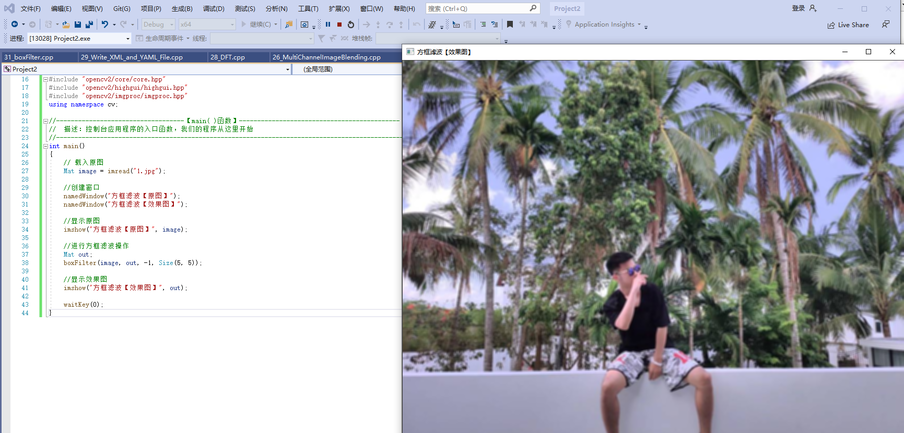

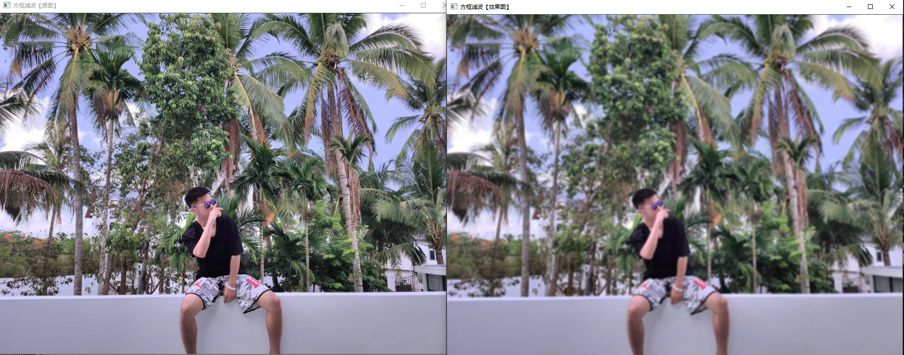

### 均值滤波 blur（）函数

#### 函数解释

均值滤波是典型的线性滤波算法，主要方法为邻域平均法，即用一片图像区域的各个像素的均值来代替原图像中的各个像素值。一般需要在图像上对目标像素给出一个模板（内核)，该模板包括了其周围的临近像素（比如以目标像素为中心的周围8(3x3-1）个像素，构成一个滤波模板，即去掉目标像素本身)。再用模板中的全体像素的平均值来代替原来像素值。即对待处理的当前像素点(x,y)，选择一个模板，该模板由其近邻的若干像素组成，求模板中所有像素的均值，再把该均值赋予当前像素点(x,y)，作为处理后图像在该点上的灰度点g (x,y)，即g (x,y) =1/m>f (x,y)，其中m为该模板中包含当前像素在内的像素总个数。

#### 函数原型
```C++
 void blur(InputArray src,
 //输入图像，即源图像，填Mat类的对象即可.
  OutputArraydst, 
  //即目标图像，需要和源图片有一样的尺寸和类型。
  Size ksize,
  //一般这样写Size( w,h )来表示内核的大小( 其中，w 为像素宽度， h为像素高度)。
  Point anchor=Point(-1,-1),
   //，Point类型的anchor，表示锚点（即被平滑的那个点），注意他有默认值Point(-1,-1)。如果这个点坐标是负值的话，就表示取核的中心为锚点，所以默认值Point(-1,-1)表示这个锚点在核的中心。
  int borderType=BORDER_DEFAULT
     //int类型的borderType，用于推断图像外部像素的某种边界模式。有默认值BORDER_DEFAULT
    ) 
```
#### 均值滤波所用的核
  

#### 代码实现

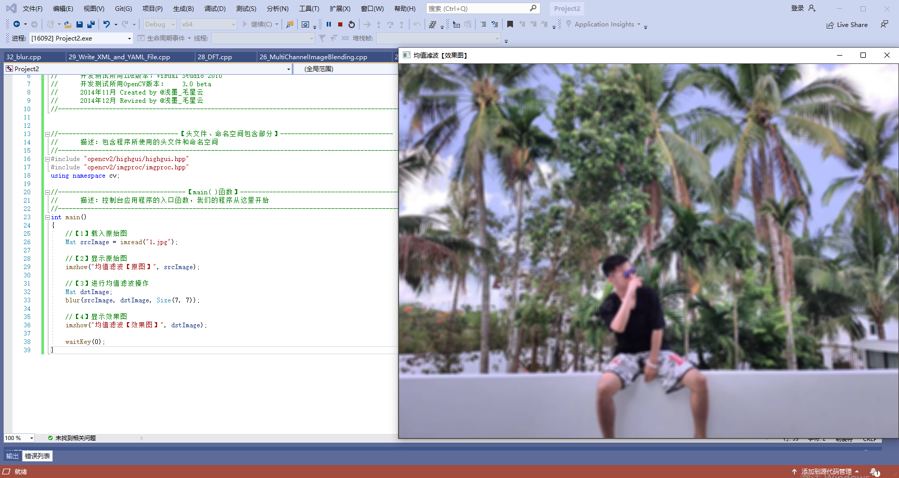


### 高斯滤波GaussianBlur函数

#### 函数解释

高斯滤波是一种线性平滑滤波，可以消除高斯噪声，广泛应用于图像处理的减噪过程。通俗地讲，高斯滤波就是对整幅图像进行加权平均的过程，每一个像素点的值，都由其本身和邻域内的其他像素值经过加权平均后得到。高斯滤波的具体操作是:用一个模板（或称卷积、掩模）扫描图像中的每一个像素，用模板确定的邻域内像素的加权平均灰度值去替代模板中心像素点的值。

高斯模糊技术生成的图像，其视觉效果就像是经过一个半透明屏幕在观察图像，这与镜头焦外成像效果散景以及普通照明阴影中的效果都明显不同。高斯平滑也用于计算机视觉算法中的预先处理阶段，以增强图像在不同比例大小下的图像效果（参见尺度空间表示以及尺度空间实现)。从数学的角度来看，图像的高斯模糊过程就是图像与正态分布做卷积。由于正态分布又叫作高斯分布，所以这项技术就叫作高斯模糊。

图像与圆形方框模糊做卷积将会生成更加精确的焦外成像效果。由于高斯函数的傅里叶变换是另外一个高斯函数，所以高斯模糊对于图像来说就是一个低通滤波操作。

高斯滤波器是一类根据高斯函数的形状来选择权值的线性平滑滤波器。高斯平滑滤波器对于抑制服从正态分布的噪声非常有效。一维零均值高斯函数如下。

- 第一个参数，InputArray类型的src，输入图像，即源图像，填Mat类的对象即可。它可以是单独的任意通道数的图片，但需要注意的是，其图片深度应该为CV_8U、CV_16U、cV_16S、cV_32F以及CV_64F之一。
- 第二个参数，OutputArray类型的 dst，即目标图像，需要和源图片有一样的尺寸和类型。比如可以用Mat::Clone，以源图片为模板，来初始化得到如假包换的目标图。
- 第三个参数，Size类型的ksize高斯内核的大小。其中 ksize.width和ksize.height可以不同,但它们都必须为正数和奇数,或者是零,这都由sigma计算而来。
- 第四个参数，double类型的sigmaX，表示高斯核函数在X方向的的标准偏差。
- 第五个参数，double类型的sigmaY，表示高斯核函数在Y方向的的标准偏差。若sigmaY为零，就将它设为sigmaX;如果sigmaX和 sigmaY都是0,那么就由ksize.width和l ksize.height计算出来。为了结果的正确性着想，最好是把第三个参数Size、第四个参数sigmaX和第五个参数sigmaY全部指定到。
- 第六个参数，int类型的borderType，用于推断图像外部像素的某种边界模式。有默认值BORDER_DEFAULT，我们一般不去管它。

#### 函数原型
  
```C++
 void GaussianBlur(InputArray src,
 //InputArray类型的src，输入图像，即源图像，填Mat类的对象即可。它可以是单独的任意通道数的图片，但需要注意，图片深度应该为CV_8U,CV_16U, CV_16S, CV_32F 以及 CV_64F之一
 OutputArray dst,
 //OutputArray类型的dst，即目标图像，需要和源图片有一样的尺寸和类型。
Size ksize,
// Size类型的ksize高斯内核的大小。
double sigmaX,
//，double类型的sigmaX，表示高斯核函数在X方向的的标准偏差。
double sigmaY=0,
//double类型的sigmaY，表示高斯核函数在Y方向的的标准偏差。
intborderType=BORDER_DEFAULT 
//int类型的borderType，用于推断图像外部像素的某种边界模式。
)  
```
#### 卷积函数
  

#### 代码实现

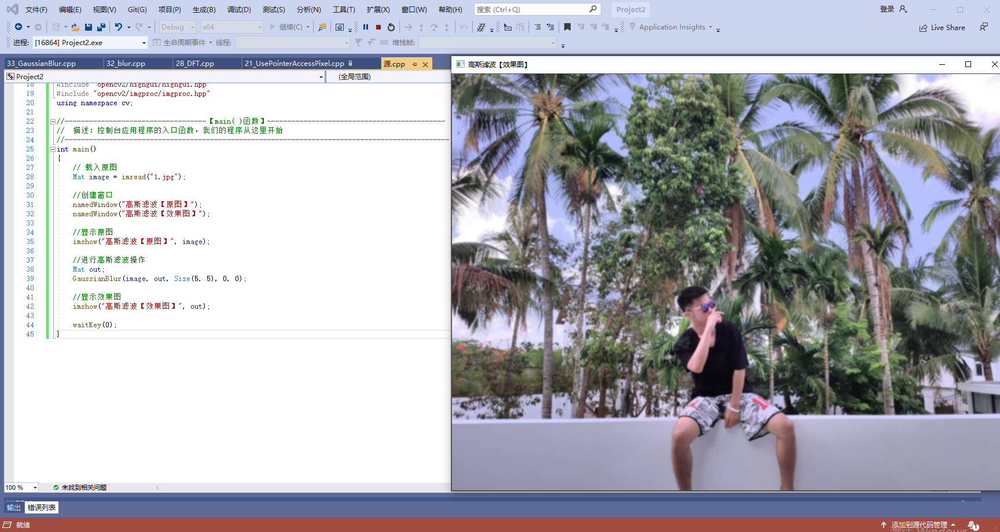

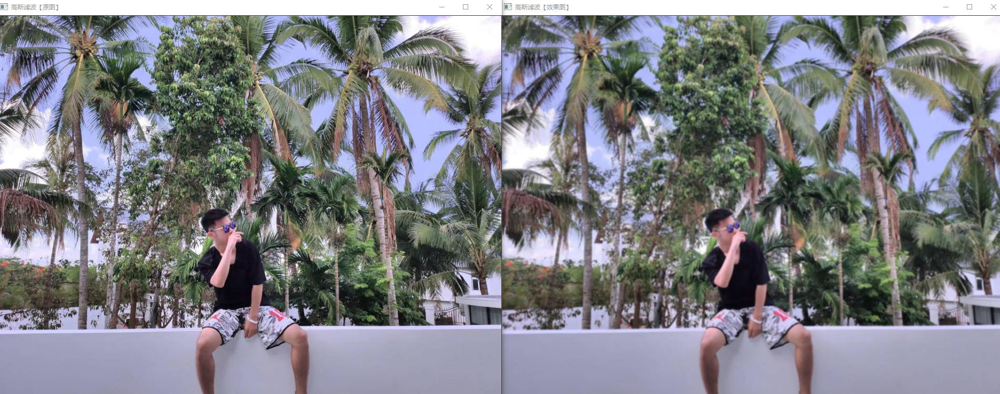

## 图像非线性滤波

### 中值滤波 medianBlur函数

#### 函数解释

medianBlur函数使用中值滤波器来平滑（模糊）处理一张图片，从 src输入，结果从 dst输出。对于多通道图片，它对每一个通道都单独进行处理，并且支持就地操作(In-placeoperation)。

- 第一个参数，InputArray类型的src，函数的输入参数，填1、3或者4通道的Mat类型的图像。当ksize为3或者5的时候，图像深度需为CV_8U、cV_16U、CV_32F其中之一，而对于较大孔径尺寸的图片，它只能是cV_8U。
- 第二个参数:OutputArray类型的 dst，即目标图像，函数的输出参数，需要和源图片有一样的尺寸和类型。我们可以用Mat:Clone，以源图片为模板，来初始化得到如假包换的目标图。
- 第三个参数:int类型的ksize，孔径的线性尺寸(aperture linear size)，注意这个参数必须是大于1的奇数，比如:3、5、7、9……

####  函数原型

```C++
void medianBlur(InputArray src,
//InputArray类型的src，函数的输入参数，填1、3或者4通道的Mat类型的图像；当ksize为3或者5的时候，图像深度需为CV_8U，CV_16U，或CV_32F其中之一，而对于较大孔径尺寸的图片，它只能是CV_8U。
OutputArray dst, 
//，OutputArray类型的dst，即目标图像，函数的输出参数，需要和源图片有一样的尺寸和类型。我们可以用Mat::Clone，以源图片为模板，来初始化得到如假包换的目标图。
int ksize)
//int类型的ksize，孔径的线性尺寸（aperture linear size），注意这个参数必须是大于1的奇数，比如：3，5，7，9 ...
``` 
#### 代码实现

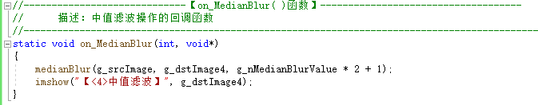


### 双边滤波 bilaterlfilter函数

#### 函数解释

一种非线性的滤波方法，是结合图像的空间邻近度和像素值相似度的一种折衷处理，同时考虑空域信息和灰度相似性，达到保边去噪的目的。具有简单、非迭代、局部的特点。

- 第一个参数:InputArray类型的src，输入图像，即源图像，需要为8位或者浮点型单通道、三通道的图像。
- 第二个参数:OutputArray类型的 dst，即目标图像，需要和源图片有一样的尺寸和类型。
- 第三个参数:int类型的d，表示在过滤过程中每个像素邻域的直径。如果这个值被设为非正数，那么 OpenCV会从第五个参数sigmaSpace来计算出它。
- 第四个参数:double类型的sigmaColor，颜色空间滤波器的sigma值。这个参数的值越大，就表明该像素邻域内有越宽广的颜色会被混合到一起，产生较大的半相等颜色区域。
- 第五个参数: double类型的sigmaSpace，坐标空间中滤波器的 sigma值，坐标空间的标注方差。它的数值越大，意味着越远的像素会相互影响，从而使更大的区域中足够相似的颜色获取相同的颜色。当d>0时，d指定了邻域大小且与sigmaSpace无关。否则，d正比于 sigmaSpace.
- 第六个参数: int类型的borderType，用于推断图像外部像素的某种边界模式。注意它有默认值BORDER_DEFAULT。
  
#### 函数原型
```C++
void bilateralFilter(InputArray src, 
//InputArray类型的src，输入图像，即源图像，需要为8位或者浮点型单通道、三通道的图像。
OutputArray dst,
//OutputArray类型的dst，即目标图像，需要和源图片有一样的尺寸和类型。
int d,
//表示在过滤过程中每个像素邻域的直径。如果这个值我们设其为非正数，那么OpenCV会从第五个参数sigmaSpace来计算出它来。
double sigmaColor,
//颜色空间滤波器的sigma值。这个参数的值越大，就表明该像素邻域内有更宽广的颜色会被混合到一起，产生较大的半相等颜色区域。
double sigmaSpace, 
//double类型的sigmaSpace坐标空间中滤波器的sigma值，坐标空间的标注方差。他的数值越大，意味着越远的像素会相互影响，从而使更大的区域足够相似的颜色获取相同的颜色。当d>0，d指定了邻域大小且与sigmaSpace无关。否则，d正比于sigmaSpace。
int borderType=BORDER_DEFAULT
//   用于推断图像外部像素的某种边界模式。注意它有默认值BORDER_DEFAULT。
   )
```
#### 定义域核
  

#### 输出像素值
  

#### 代码实现

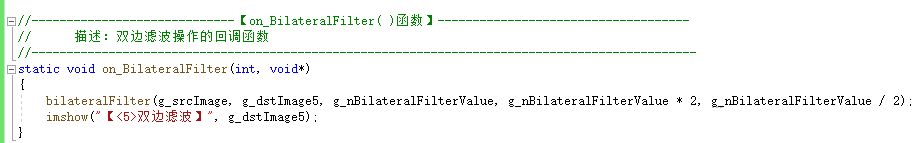

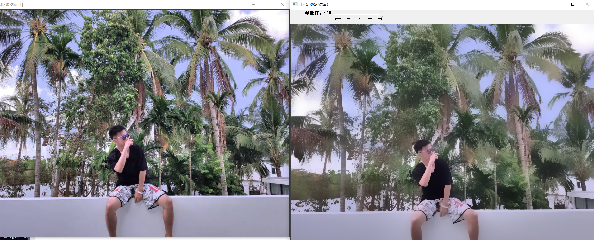

## 形态学滤波：腐蚀与膨胀

### 膨胀 dilate()函数

#### 函数解释

膨胀(dilate）就是求局部最大值的操作。从数学角度来说，膨胀或者腐蚀操作就是将图像（或图像的一部分区域，称之为A）与核（称之为B）进行卷积。

核可以是任何形状和大小，它拥有一个单独定义出来的参考点，我们称其为锚点(anchorpoint)。多数情况下，核是一个小的，中间带有参考点和实心正方形或者圆盘。其实，可以把核视为模板或者掩码。

而膨胀就是求局部最大值的操作。核B与图形卷积，即计算核B覆盖的区域的像素点的最大值，并把这个最大值赋值给参考点指定的像素。这样就会使图像中的高亮区域逐渐增长，如图6.20所示。这就是膨胀操作的初衷。

#### 函数原型
```C++
 void dilate(
	InputArray src,
  //InputArray类型的src，输入图像，即源图像，填Mat类的对象即可。图像通道的数量可以是任意的，但图像深度应为CV_8U，CV_16U，CV_16S，CV_32F或 CV_64F其中之一。
	OutputArray dst,
  //即目标图像，需要和源图片有一样的尺寸和类型。
	InputArray kernel,
  //膨胀操作的核。       
  // 矩形: MORPH_RECT
  //    交叉形: MORPH_CROSS
  //  椭圆形: MORPH_ELLIPSE

	Point anchor=Point(-1,-1),
  //Point类型的anchor，锚的位置，其有默认值（-1，-1），表示锚位于中心。
	int iterations=1,
  //nt类型的iterations，迭代使用erode（）函数的次数，默认值为1。
	int borderType=BORDER_CONSTANT,
  //用于推断图像外部像素的某种边界模式。注意它有默认值BORDER_DEFAULT。
	const Scalar& borderValue=morphologyDefaultBorderValue() 
  //当边界为常数时的边界值，
);
```
#### 函数内核

  

  #### 代码实现

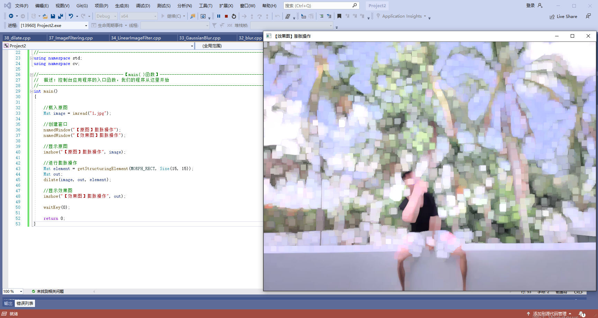

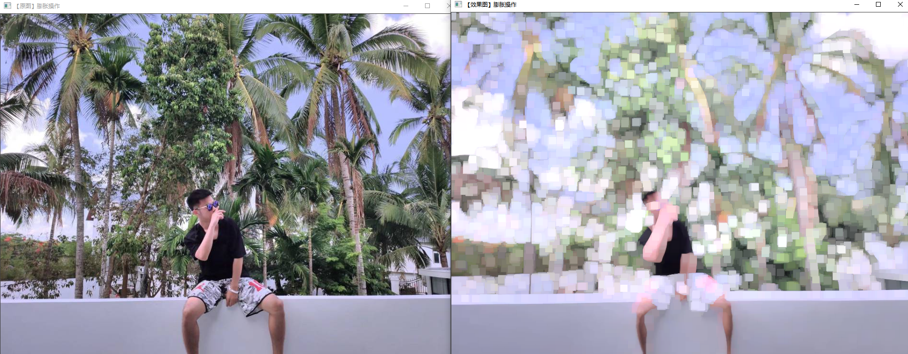

### 腐蚀 erode()函数

#### 函数解释

腐蚀就是求局部最小值的操作。

#### 函数原型
```C++
 void erode(
	InputArray src,
  //InputArray类型的src，输入图像，即源图像，填Mat类的对象即可。图像通道的数量可以是任意的，但图像深度应为CV_8U，CV_16U，CV_16S，CV_32F或 CV_64F其中之一。
	OutputArray dst,
  //即目标图像，需要和源图片有一样的尺寸和类型。
	InputArray kernel,
  //腐蚀操作的内核。
	Point anchor=Point(-1,-1),
  //锚的位置，其有默认值（-1，-1）
	int iterations=1,
  //迭代使用erode（）函数的次数，默认值为1。
	int borderType=BORDER_CONSTANT,
  //用于推断图像外部像素的某种边界模式。
	const ScalarborderValue=morphologyDefaultBorderValue()
  //当边界为常数时的边界值，
 );
```

#### 函数内核

  
  

#### 代码实现

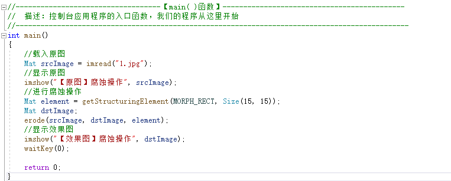

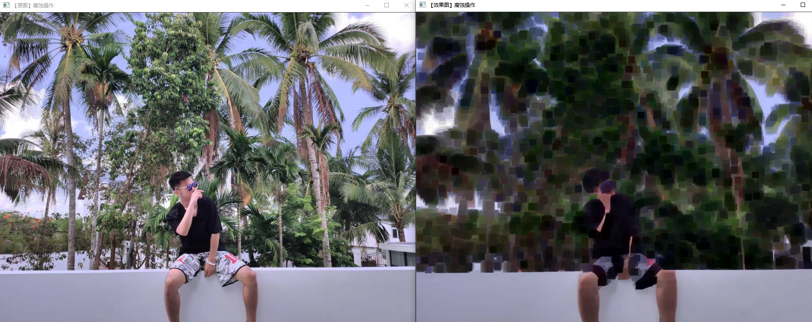

## 形态学滤波：开闭梯度

### 开运算

  
  先腐蚀后膨胀的过程。

#### 函数公式

  

### 闭运算

  
  先膨胀后腐蚀的过程
  
#### 函数公式

  

### 形态学梯度
  
  膨胀图与腐蚀图之差
  
  
  #### 函数公式

  

### 顶帽
  
  原图像与 “开运算“的结果图之差

####  函数公式

  

### 黑帽
  
   原图像与 “闭运算“的结果图之差
  
#### 函数公式

  

### 函数原型

```C++
void morphologyEx(
InputArray src,
//输入图像，即源图像，填Mat类的对象即可。
OutputArray dst,
//即目标图像，函数的输出参数，需要和源图片有一样的尺寸和类型
int op,
//表示形态学运算的类型，
InputArray kernel,
//形态学运算的内核。
Pointanchor=Point(-1,-1),
//锚的位置，其有默认值（-1，-1），表示锚位于中心。
intiterations=1,
//迭代使用函数的次数，默认值为1。
intborderType=BORDER_CONSTANT,
//用于推断图像外部像素的某种边界模式
constScalar& borderValue=morphologyDefaultBorderValue() 
//当边界为常数时的边界值，
);
```

### 代码实现

#### 开运算|闭运算

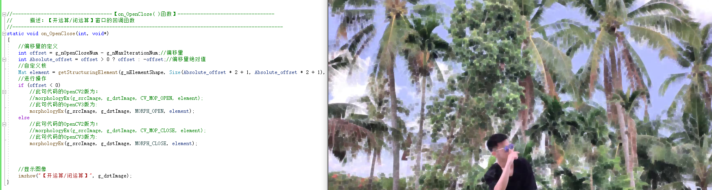

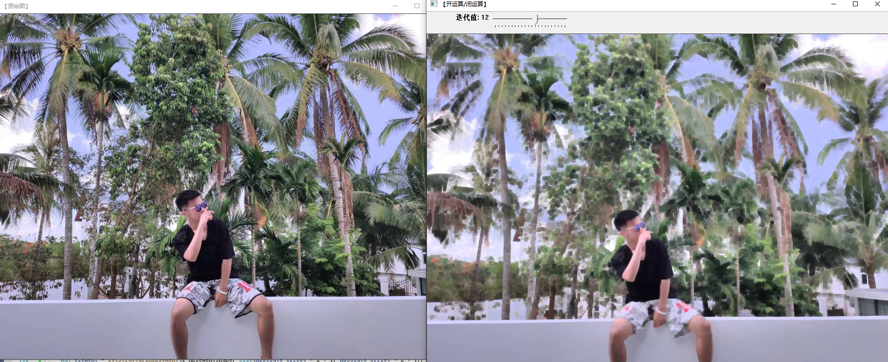

#### 腐蚀|膨胀

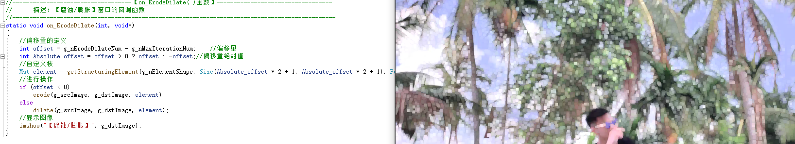

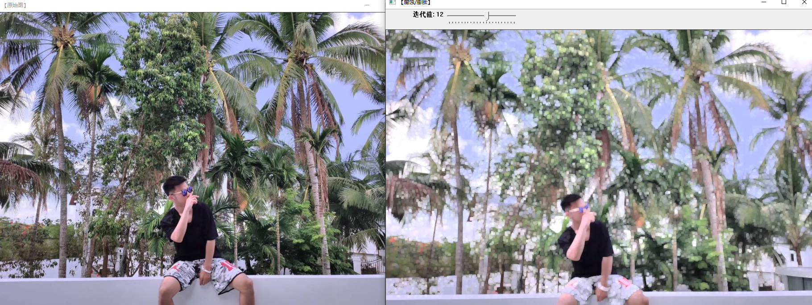

#### 顶帽|黑帽

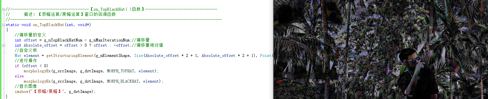

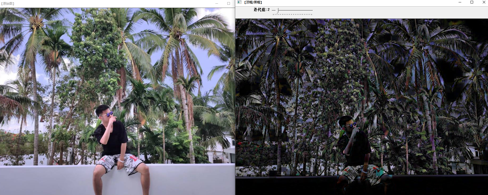

## 漫水填充

### floodFill函数

#### 函数解释

漫水填充法是一种用特定的颜色填充连通区域，通过设置可连通像素的上下限以及连通方式来达到不同的填充效果的方法。漫水填充经常被用来标记或分离图像的一部分，以便对其进行进一步处理或分析，也可以用来从输入图像获取掩码区域，掩码会加速处理过程，或只处理掩码指定的像素点，操作的结果总是某个连续的区域。

- 第一个参数，InputOutputArray类型的image，输入/输出1通道或3通道，8位或浮点图像，具体参数由之后的参数指明。
- 第二个参数，InputOutputArray类型的mask，这是第二个版本的floodFill独享的参数,表示操作掩模。它应该为单通道,8位,长和宽上都比输入图像image大两个像素点的图像。第二个版本的floodFill需要使用以及更新掩膜，所以对于这个mask 参数，我们一定要将其准备好并填在此处。需要注意的是，漫水填充不会填充掩膜mask 的非零像素区域。例如，一个边缘检测算子的输出可以用来作为掩膜，以防止填充到边缘。同样的，也可以在多次的函数调用中使用同一个掩膜，以保证填充的区域不会重叠。另外需要注意的是，掩膜mask 会比需填充的图像大，所以 mask中与输入图像(x,y)像素点相对应的点的坐标为(x+1,y+1)。
- 第三个参数，Point类型的seedPoint，漫水填充算法的起始点。
- 第四个参数，Scalar类型的new Val，像素点被染色的值，即在重绘区域像素的新值。
- 第五个参数，Rect*类型的rect，有默认值0，一个可选的参数，用于设置floodFill函数将要重绘区域的最小边界矩形区域。
- 第六个参数，Scalar类型的 loDiff，有默认值 Scalar()，表示当前观察像素值与其部件邻域像素值或者待加入该部件的种子像素之间的亮度或颜色之负差( lower brightness/color difference）的最大值。
- 第七个参数，Scalar类型的upDiff，有默认值Scalar()，表示当前观察像素值与其部件邻域像素值或者待加入该部件的种子像素之间的亮度或颜色之正差( lower brightness/color difference）的最大值。
- 第八个参数，int类型的 flags，操作标志符，此参数包含三个部分，比较复杂，我们一起详细看看。
  
#### 函数原型

```C++
int floodFill(InputOutputArray image, 
 //输入/输出1通道或3通道，8位或浮点图像，具体参数由之后的参数具体指明。
InputOutputArray mask,
 //表示操作掩模,。它应该为单通道、8位、长和宽上都比输入图像 image 大两个像素点的图像。
Point seedPoint,
  //Point类型的seedPoint，漫水填充算法的起始点。
Scalar newVal,
  //像素点被染色的值，即在重绘区域像素的新值。
Rect* rect=0, 
  // 有默认值0，一个可选的参数，用于设置floodFill函数将要重绘区域的最小边界矩形区域。
Scalar loDiff=Scalar(), 
   //有默认值Scalar( )，表示当前观察像素值与其部件邻域像素值或者待加入该部件的种子像素之间的亮度或颜色之负差（lower brightness/color difference）的最大值
Scalar upDiff=Scalar(), 
   //表示当前观察像素值与其部件邻域像素值或者待加入该部件的种子像素之间的亮度或颜色之正差（lower brightness/color difference）的最大值。
int flags=4
//操作标志符
 )
 ```

 #### 代码实现

 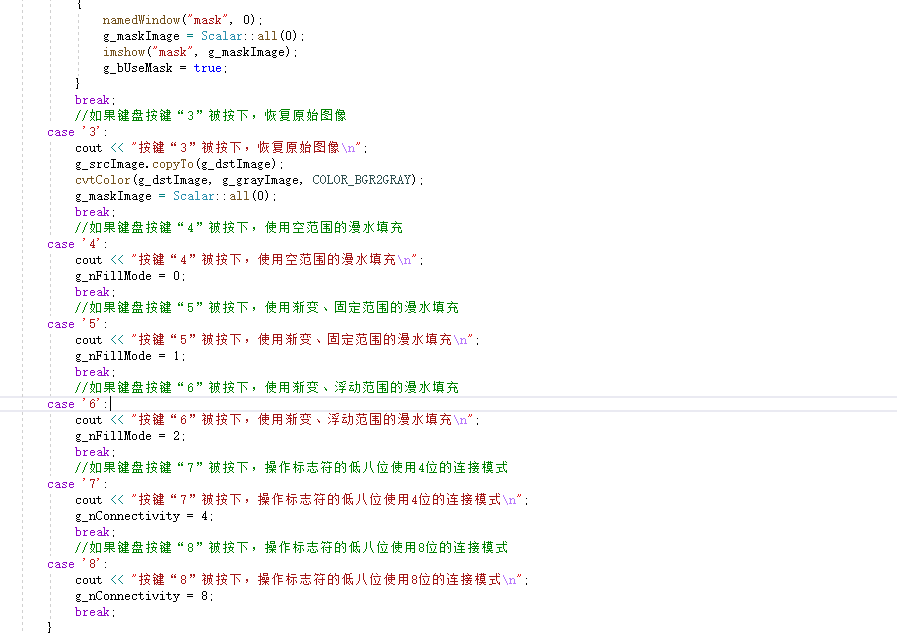

 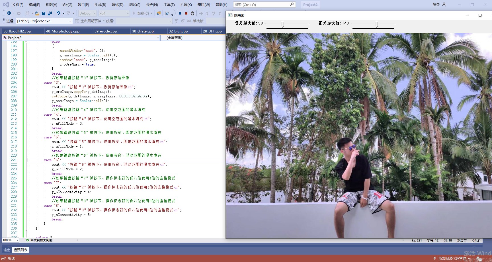

## 图像金子塔与缩放

### 高斯金字塔

 - 向下采样
   - 对图像G_i进行高斯内核卷积

    - 将所有偶数行和列去除
- 向上取样
    
    - 将图像在每个方向扩大为原来的两倍，新增的行和列以0填充

    - 使用先前同样的内核(乘以4)与放大后的图像卷积，获得 “新增像素”的近似值
### 拉普拉斯金字塔

-  数学定义
  

- 运行原理
  

### 尺寸调整：resize()函数

#### 函数解释

函数将源图像精确地转换为指定尺寸的目标图像。如果源图像中设置了ROI (Region Of Interest ，感兴趣区域)，那么resize()函数会对源图像的ROI区域进行调整图像尺寸的操作,来输出到目标图像中。若目标图像中已经设置了ROI区域，不难理解resize()将会对源图像进行尺寸调整并填充到目标图像的ROI中。

很多时候，我们并不用考虑第二个参数dst的初始图像尺寸和类型（即直接定义一个Mat类型，不用对其初始化)，因为其尺寸和类型可以由src、dsize、fx和fy这几个参数来确定。

- 第一个参数，InputArray类型的src，输入图像，即源图像，填Mat类的对象即可。
- 第二个参数，OutputArray类型的dst，输出图像，当其非零时，有着dsize(第三个参数）的尺寸，或者由src.size()计算出来。
- 第三个参数，Size类型的dsize，输出图像的大小。如果它等于零，由下式进行计算:dsize=Size(round(fx*src.cols)，round(fy*src.rows))其中，dsize、fx、 fy都不能为0。
- 第四个参数，double类型的f，沿水平轴的缩放系数，有默认值0，且当其等于0时,由下式进行计算:(double)dsize.width/src.cols
- 第五个参数，double类型的fy，沿垂直轴的缩放系数，有默认值0，且当其等于0时，由下式进行计算:(double)dsize.height/src.rows
- 第六个参数，int类型的interpolation，用于指定插值方式，默认为INTER_LINEAR（线性插值)

#### 函数原型

- resize()
  ```C++
  void resize(InputArray src,
  ////InputArray类型的src，输入图像，即源图像，填Mat类的对象即可。
  OutputArray dst, 
  //输出图像，当其非零时，有着dsize（第三个参数）的尺寸，或者由src.size()计算出来。
  Size dsize, 
  //Size类型的dsize，输出图像的大小; 
  double fx=0, 
  ///double类型的fx，沿水平轴的缩放系数，有默认值0，
  double fy=0, 
  //沿垂直轴的缩放系数，有默认值0，
  int interpolation=INTER_LINEAR 
  //int类型的interpolation，用于指定插值方式，
  /*
      INTER_NEAREST - 最近邻插值
    INTER_LINEAR - 线性插值（默认值）
    INTER_AREA - 区域插值（利用像素区域关系的重采样插值）
    INTER_CUBIC –三次样条插值（超过4×4像素邻域内的双三次插值）
    INTER_LANCZOS4 -Lanczos插值（超过8×8像素邻域的Lanczos插值）
  */
  )
  ```

#### 代码实现

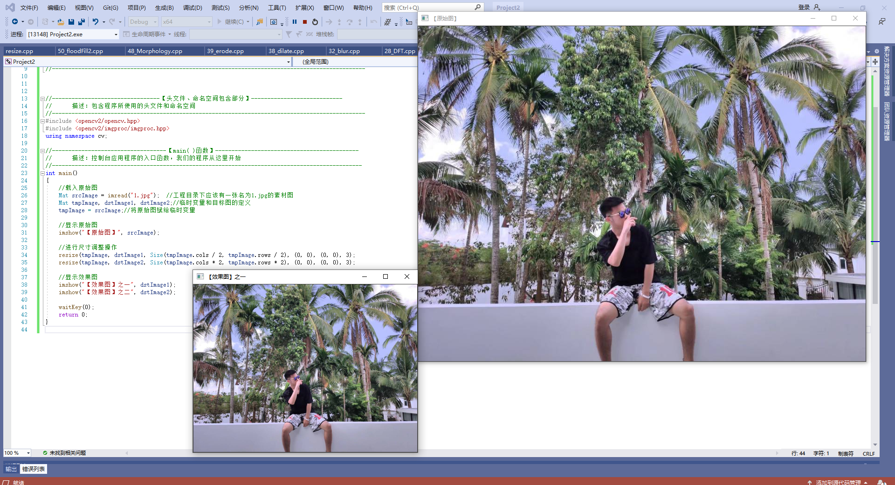

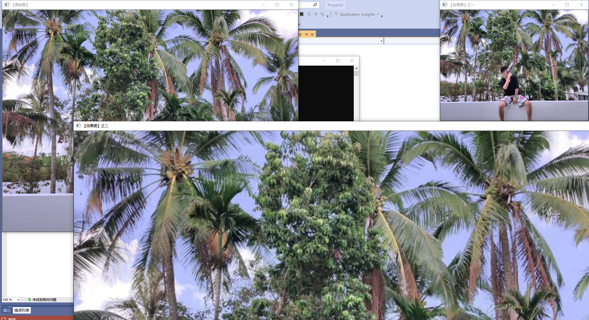

### pyrDown()函数

#### 函数解释

- 第一个参数，InputArray类型的src，输入图像，即源图像，填Mat类的对象即可。
- 第二个参数，OutputArray类型的 dst，输出图像，和源图片有一样的尺寸和类型。
- 第三个参数，const Size&类型的 dstsize，输出图像的大小;有默认值Size()，即默认情况下，由 Size Size((src.cols+1)/2，(src.rows+1)/2)来进行计算，且一直需要满足下列条件:
  | dstsize.width*2-src.cols |≤2
  | dstsize.hcigth*2-src.rows |≤2

#### 函数原型

- pyrDown()
  ```C++
    void pyrDown(InputArray src,
    //输入图像，即源图像，填Mat类的对象即可
    OutputArray dst, 
    //输出图像，和源图片有一样的尺寸和类型。
    const Size& dstsize=Size(), 
    //输出图像的大小;有默认值Size()，即默认情况下，由Size Size((src.cols+1)/2, (src.rows+1)/2)来进行计算，
    int borderType=BORDER_DEFAULT
    )
  ```

#### 代码实现

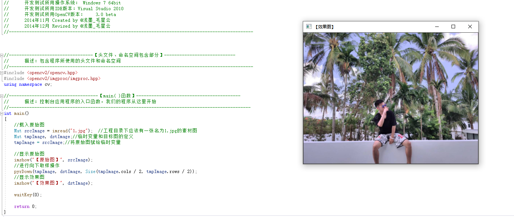

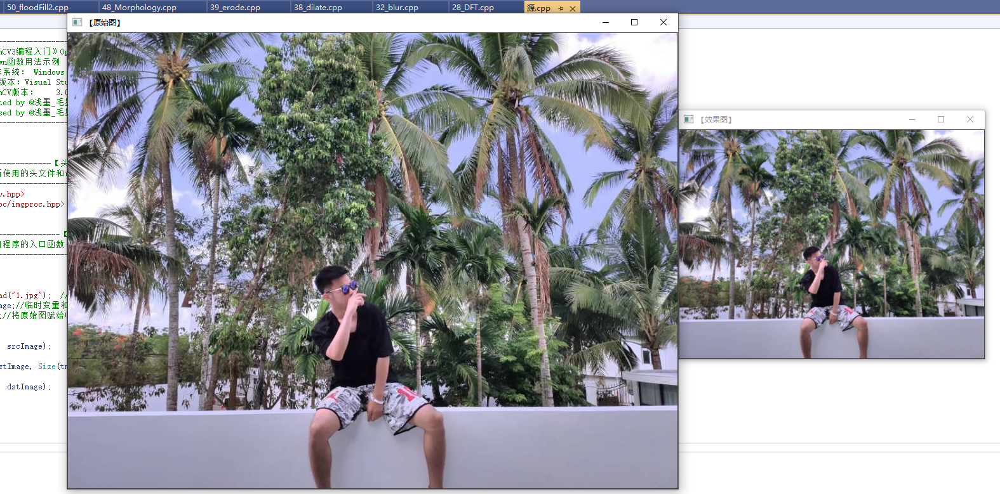

### pryUp（）函数

#### 函数解释

- 第一个参数，InputArray类型的src，输入图像，即源图像，填Mat类的对象即可。
- 第二个参数，OutputArray类型的dst，辐出图像，和源图片有一样的尺寸和类型。
- 第三个参数，const Size&类型的dstsize，输出图像的大小;有默认值Size()，即默认情况下，由 Size ( src.cols*2，src.rows*2）来进行计算，且一直需要满足下列条件:

| dstsize.width-src.cols*2 |≤(dstsize.width mod2)

| dstsize.height-src.rows*2 |≤(dstsize.heiht mod2)

- 第四个参数，int类型的borderType，边界模式，一般不用去管它。

#### 函数原型

- pyrUp()
  ```C++
   void pyrUp(InputArray src,
   //输入图像，即源图像，填Mat类的对象即可。
   OutputArray dst, 
   //输出图像，和源图片有一样的尺寸和类型。
   const Size& dstsize=Size(), 
   //输出图像的大小;有默认值Size()，
   int borderType=BORDER_DEFAULT 
   //int类型的borderType，又来了，边界模式
   )
  ```

#### 代码实现

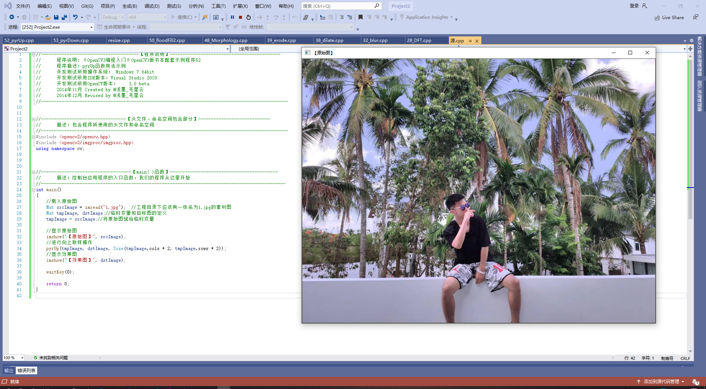

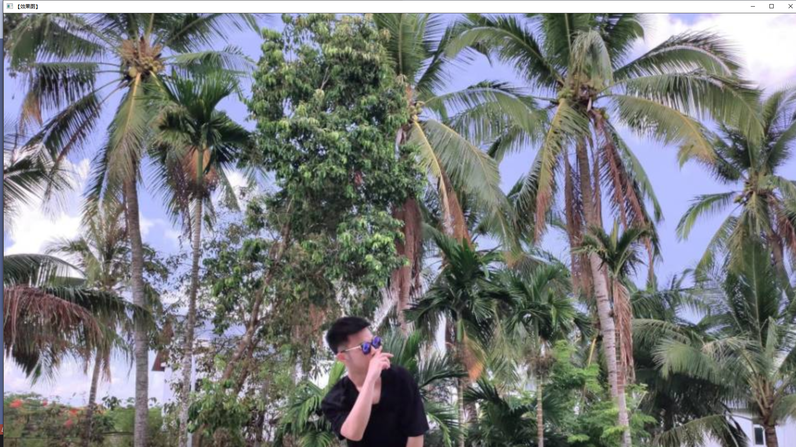

# 第七章节

## 图像变换

###  边缘检测

- 滤波
  
  边缘检测的算法主要是基于图像强度的一阶和二阶导数，但导数通常对噪声很敏感，因此必须采用滤波器来改善与噪声有关的边缘检测器的性能。

- 增强

  增强边缘的基础是确定图像各点邻域强度的变化值。增强算法可以将图像灰度点邻域强度值有显著变化的点凸显出来。在具体编程实现时，可通过计算梯度幅值来确定。

- 检测
  
  经过增强的图像，往往邻域中有很多点的梯度值比较大，而在特定的应用中，这些点并不是我们要找的边缘点，所以应该采用某种方法来对这些点进行取舍。实际工程中，常用的方法是通过阈值化方法来检测。

### canny算子

  - canny算子

  开发出来的一个多级边缘检测算法。
  - 评价标准
    
    - 低错误率
    - 高定位性
    - 最小响应
  - 步骤
    
    - 消除噪声
    - 计算梯度幅值和方向
    - 非极大值抑制
    - 滞后阈值
  - 函数原型
```C++
void Canny(InputArray image,//输入图像，即源图像，填Mat类的对象即可，且需为单通道8位图像。
OutputArray edges, //输出的边缘图，需要和源图片有一样的尺寸和类型
double threshold1,// 第一个滞后性阈值。
double threshold2, //第二个滞后性阈值
int apertureSize=3,// 表示应用Sobel算子的孔径大小，其有默认值3。
bool L2gradient=false//  一个计算图像梯度幅值的标识，有默认值false。
)
``` 

 ### sobel算子

  - 简述
  
  一个主要用作边缘检测的离散微分算子，算子结合了高斯平滑和微分求导，用来计算图像灰度函数的近似梯度。在图像的任何一点使用此算子，将会产生对应的梯度矢量或是其法矢量。
  
  - 过程

    - 分别在x和y两个方向求导。
    - 水平变化: 将 I 与一个奇数大小的内核x进行卷积。
    - 垂直变化: 将 I 与一个奇数大小的内核y进行卷积。
    - 结合以上两个结果求出近似梯度:
  
  - 函数原型
```C++
void Sobel (
 InputArray src,//输入图
 OutputArray dst,//输出图
 int ddepth,//输出图像的深度
 int dx,//x 方向上的差分阶数。
 int dy,//y方向上的差分阶数。
 int ksize=3,//有默认值3，表示Sobel核的大小;必须取1，3，5或7
 double scale=1,//计算导数值时可选的缩放因子，默认值是1
 double delta=0,//表示在结果存入目标图（第二个参数dst）之前可选的delta值，有默认值0。
 int borderType=BORDER_DEFAULT 
 //边界模式
 );
```
### Laplace算子

- 简述

 n维欧几里德空间中的一个二阶微分算子，定义为梯度grad（）的散度div（）。因此如果f是二阶可微的实函数，则f的拉普拉斯算子定义为：


(1) f的拉普拉斯算子也是笛卡儿坐标系xi中的所有非混合二阶偏导数求和：

(2) 作为一个二阶微分算子，拉普拉斯算子把C函数映射到C函数，对于k ≥ 2。表达式(1)（或(2)）定义了一个算子Δ :C(R) → C(R)，或更一般地，定义了一个算子Δ : C(Ω) → C(Ω)，对于任何开集Ω。

- 公式
  

- 函数原型

```C++
void Laplacian(InputArray src,//输入图像，即源图像，填Mat类的对象即可，且需为单通道8位图像。
OutputArray dst, //输出的边缘图，需要和源图片有一样的尺寸和通道数。
int ddepth, //目标图像的深度。
int ksize=1, //用于计算二阶导数的滤波器的孔径尺寸，大小必须为正奇数，且有默认值1。
double scale=1, //计算拉普拉斯值的时候可选的比例因子，有默认值1
double delta=0, //表示在结果存入目标图（第二个参数dst）之前可选的delta值，有默认值0。
intborderType=BORDER_DEFAULT //边界模式，
);
```
### scharr

- 简述

scharr一般为滤波器

## 霍夫变换

- 简述
  
  霍夫变换是图像处理中的一种特征提取技术，该过程在一个参数空间中通过计算累计结果的局部最大值得到一个符合该特定形状的集合作为霍夫变换结果。

### 变换

  - 分类
      
      - 标准霍夫变换
      - 多尺度霍夫变换
      - 累计概率霍夫变换
  - 步骤
  
    - 将极坐标和直角坐标整合至一个式子中
    - 将直角坐标固定绘出图线
    - 对多个点进行操作
    - 判断曲线
  - 函数
```C++
void HoughLines(InputArray image, OutputArray lines, double rho, double theta, int threshold, double srn=0, double stn=0 )
``` 
### 梯度法原理

- 描述
  
    - 首先对图像应用边缘检测
    - 对边缘图像中的每一个非零点，考虑其局部梯度
    - 利用得到的梯度，由斜率指定的直线上的每一个点都在累加器中被累加
    - 标记边缘图像中每一个非0像素的位置
    - 然后从二维累加器中这些点中选择候选的中心，这些中心都大于给定阈值并且大于其所有近邻。这些候选的中心按照累加值降序排列，以便于最支持像素的中心首先出现。
    - 接下来对每一个中心，考虑所有的非0像素。
    - 这些像素按照其与中心的距离排序。从到最大半径的最小距离算起，选择非0像素最支持的一条半径。
    -  如果一个中心收到边缘图像非0像素最充分的支持，并且到前期被选择的中心有足够的距离，那么它就会被保留下来。
- 缺点
  
  - 计算方法不稳定
  - 累加器的阈值设置偏低，算法将要消耗比较长的时间
  - 每一个中心只选择一个圆，如果有同心圆，就只能选择其中的一个。
  - 因为中心是按照其关联的累加器值的升序排列的，并且如果新的中心过于接近之前已经接受的中心的话，就不会被保留下来。且当有许多同心圆或者是近似的同心圆时，霍夫梯度法的倾向是保留最大的一个圆。可以说这是一种比较极端的做法，因为在这里默认Sobel导数会产生噪声，若是对于无穷分辨率的平滑图像而言的话，这才是必须的。

 ## 重映射

- 概念
 
   - 重映射，就是把一幅图像中某位置的像素放置到另一个图片指定位置的过程。
- 公式
  -  g(x,y) = f ( h(x,y) )
- X-轴反转
- remap()函数
    
    - 简述

      

```C++
 void remap(
   InputArray src,//输入图像
   OutputArray dst, //函数调用后的运算结果存在这里，即这个参数用于存放函数调用后的输出结果，需和源图片有一样的尺寸和类型。
   InputArray map1, 
    /*                
    1.表示点（x，y）的第一个映射。
    2.表示CV_16SC2 , CV_32FC1 或CV_32FC2类型的X值。
*/   
   InputArray map2,  
   /*                
   1.若map1表示点（x，y）时。这个参数不代表任何值。
   2.表示CV_16UC1 , CV_32FC1类型的Y值（第二个值）。
*/                

   int interpolation, 
   //插值方式
   intborderMode=BORDER_CONSTANT, 
    //边界模式，有默认值BORDER_CONSTANT，表示目标图像中“离群点（outliers）”的像素值不会被此函数修改
   const Scalar& borderValue=Scalar()
   //const Scalar&类型的borderValue，当有常数边界时使用的值，其有默认值Scalar( )，即默认值为0。
   )
```
### 特征点检测（SURF）

- 简述
  
SURF最大的特征在于采用了harr特征以及积分图像的概念，这大大加快了程序的运行时间。
- 算法简述
  
  - SURF算法为每个检测到的特征定义了位置和尺度，尺度值可用于定义围绕特征点的窗口大小，不论物体的尺度在窗口是什么样的，都将包含相同的视觉信息，这些信息用于表示特征点以使得他们与众不同
  - 特征描述子通常是用于N维向量，在光照不变以及少许透视变形的情况下很理想。

- 继承关系


- drawKeypoints函数
```C++
void drawKeypoints(
  const Mat&image,// 输入图像
  const vector<KeyPoint>& keypoints, //根据源图像得到的特征点，它是一个输出参数。
  Mat& outImage, //输出图像，其内容取决于第五个参数标识符falgs。

  constScalar& color=Scalar::all(-1), 
  //关键点的颜色，有默认值Scalar::all(-1)。
  int flags=DrawMatchesFlags::DEFAULT 
  //绘制关键点的特征标识符，有默认值DrawMatchesFlags::DEFAULT。
  )
```
- drawMatches()
```C++
  void drawMatches(const Mat& img1,//第一幅源图像。
  constvector<KeyPoint>& keypoints1,//根据第一幅源图像得到的特征点，它是一个输出参数。
 const Mat& img2,//第二幅源图像。
 constvector<KeyPoint>& keypoints2,//根据第二幅源图像得到的特征点，它是一个输出参数。
 constvector<DMatch>& matches1to2,//第一幅图像到第二幅图像的匹配点，即表示每一个图1中的特征点都在图2中有一一对应的点
 Mat& outImg,//输出图像，其内容取决于第五个参数标识符falgs。
 const Scalar&matchColor=Scalar::all(-1),
 //匹配的输出颜色，即线和关键点的颜色。
 const Scalar&singlePointColor=Scalar::all(-1),
 //单一特征点的颜色，它也有表示随机生成颜色的默认值Scalar::all(-1)。
 const vector<char>&matchesMask=vector<char>(),
 //确定哪些匹配是会绘制出来的掩膜，如果掩膜为空，表示所有匹配都进行绘制。
 intflags=DrawMatchesFlags::DEFAULT 
 //特征绘制的标识符
 )
  ```
## 仿射变换

- 简述

  -  在几何中，一个向量空间进行一次线性变换并接上一个平移，变换为另一个向量空间的过程。它保持了二维图形的“平直性”（即：直线经过变换之后依然是直线）和“平行性”（即：二维图形之间的相对位置关系保持不变，平行线依然是平行线，且直线上点的位置顺序不变）。
  -  一个任意的仿射变换都能表示为乘以一个矩阵(线性变换)接着再加上一个向量(平移)的形式。
  
- 求法

  - 场景
  
    - 已知 X和T，而且我们知道他们是有联系的. 接下来我们的工作就是求出矩阵 M
    - 用T=M·X求关系

- warpAffine函数
  
  - 数学原理
  
  
  
  - 函数原型
```C++
void warpAffine(
  InputArray src,//输入图像，即源图像，填Mat类的对象即可。
  OutputArray dst,// 函数调用后的运算结果存在这里，需和源图片有一样的尺寸和类型。
  InputArray M, //2×3的变换矩阵。
  Size dsize, //表示输出图像的尺寸。
  int flags=INTER_LINEAR,//插值方法的标识符。
  intborderMode=BORDER_CONSTANT, //边界像素模式
  const Scalar& borderValue=Scalar()//    在恒定的边界情况下取的值，默认值为Scalar()，即0。
  )
```
- 注


  WarpAffine函数与一个叫做cvGetQuadrangleSubPix( )的函数类似，但是不完全相同。 WarpAffine要求输入和输出图像具有同样的数据类型，有更大的资源开销（因此对小图像不太合适）而且输出图像的部分可以保留不变。而 cvGetQuadrangleSubPix 可以精确地从8位图像中提取四边形到浮点数缓存区中，具有比较小的系统开销，而且总是全部改变输出图像的内容。 

- getRotationMatrix2D函数

  - 简述
    
    -  计算二维旋转变换矩阵。变换会将旋转中心映射到它自身。
  - 函数原型
  ```C++
  C++: Mat getRotationMatrix2D(
    Point2fcenter, //表示源图像的旋转中心。
    double angle, //旋转角度。
    double scale //缩放系数。
    )
  ```
  - 数学原理
  
  

## 直方图均衡化

- 简述

  - 图像的直方图是用来表现图像中亮度分布的直方图,给出的是图像中某个亮度或者某个范围亮度下共有几个像素.
  - 灰度值和范围
- 函数原型
```C++
原型:
void cv::calcHist (
        const Mat *  images,//源图像，注意这里的格式是const Mat*，也就是说，你要传入一个地址，输入的数组(图片)或者数组集(一堆图片)需要为相同的深度和相同的尺寸。每个都能够用任意数量的通道。
        int  nimages,//输入图像个数
        const int *  channels,//用于计算直方图的dims通道列表
        InputArray  mask,//可选的掩码，如果不为空的话，那么它必须是8位且和image[i]尺寸相同。
        OutputArray  hist,//输出的直方图，二维数组。
        int  dims,//需要统计的直方图维度（特征数目）,必须是正数，且不大于CV_MAX_DIMS(这个版本opencv3.1里面是32)
        const int *  histSize,//存放每个维度的直方图尺寸的数组。
        const float **  ranges,//每一维数值的取值范围。
        bool  uniform = true,//表示直方图是否均匀
        bool  accumulate = false //累计标识符，若为ture，直方图再配置阶段不会被清零。
    ) 
```

### 代码实现

#### canny函数


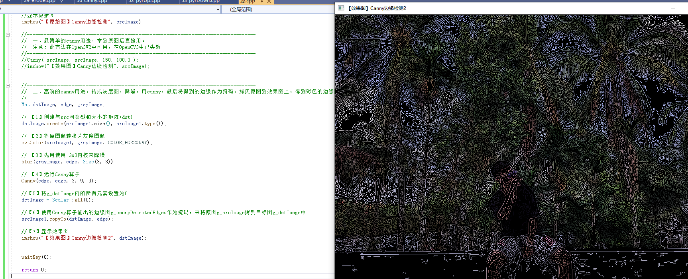

#### sobe函数

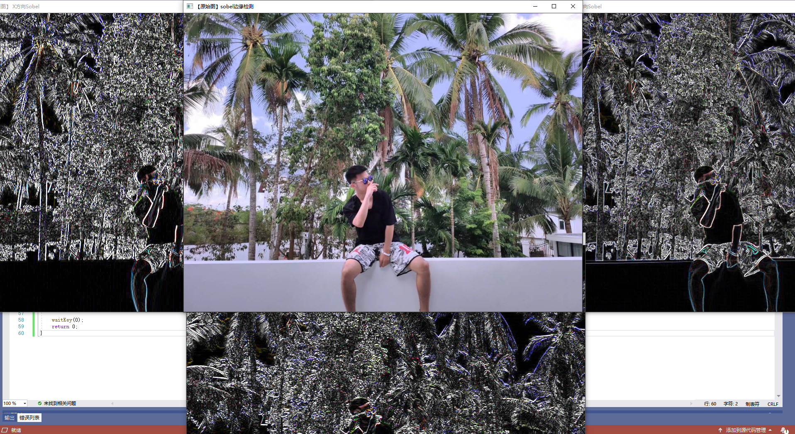
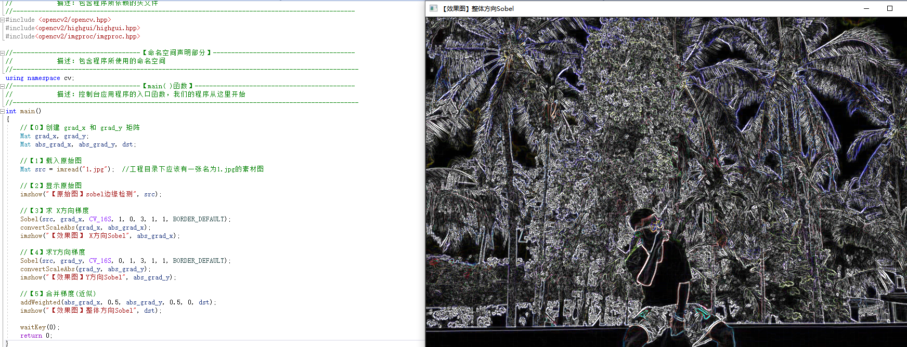

#### Laplacian 函数


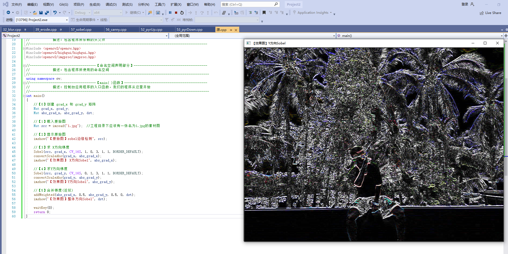

#### Scharr 函数

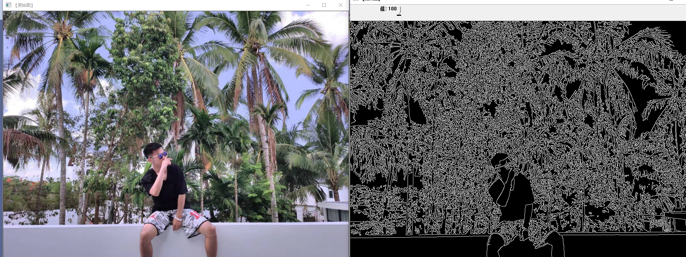
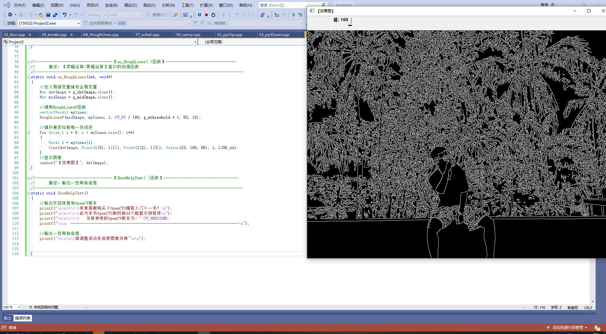

#### 霍夫线变换综合

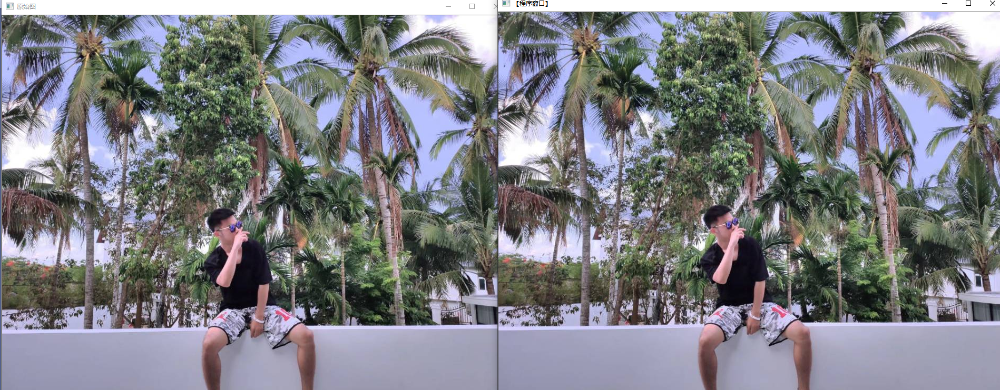
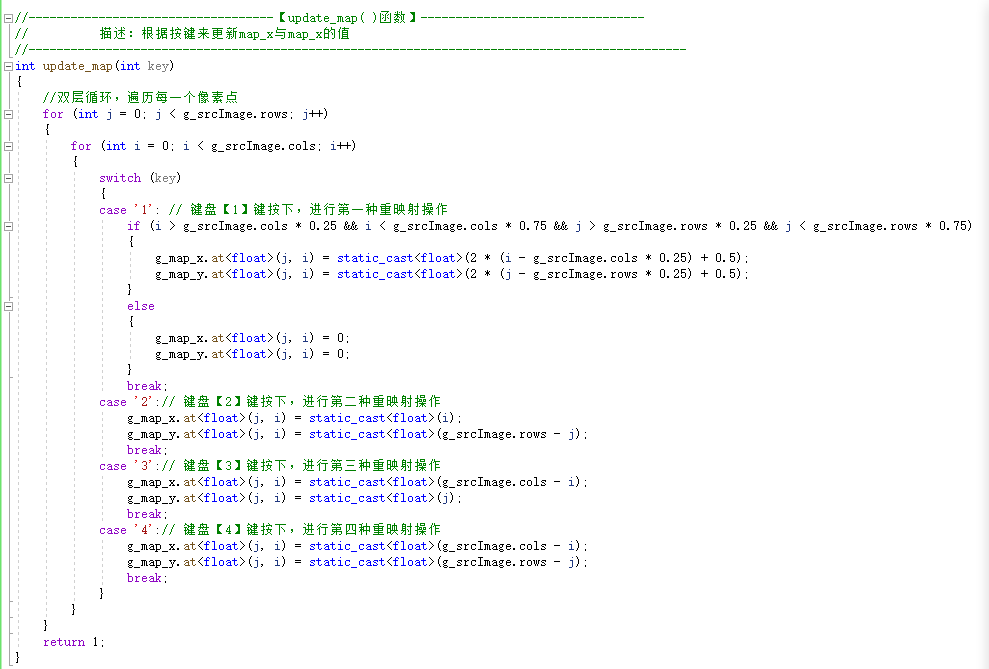
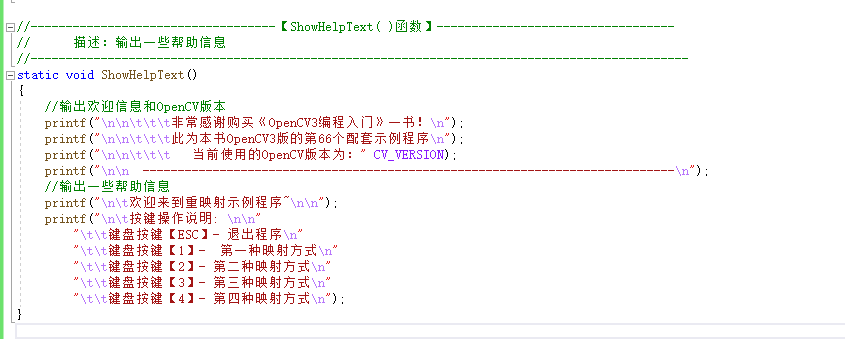

#### 直方图均衡化

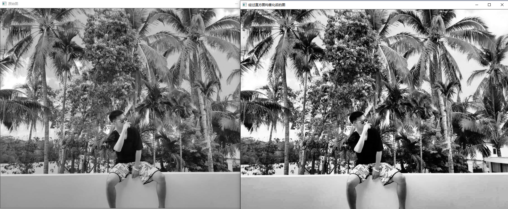
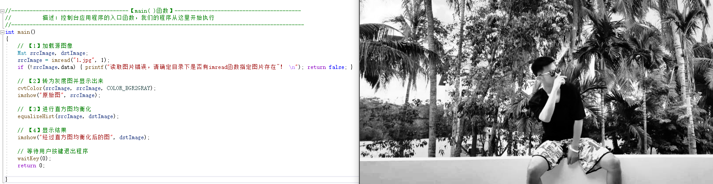


# 第八章节

# 图像轮廓与修复

## 绘制轮廓


  
   一个轮廓一般对应一系列的点，也就是图像中的一条曲线。其表示方法可能根据不同的情况而有所不同。图像轮廓是指将边缘连接起来后形成的一个整体，用于后续的计算。
- findContours()
```C++
void findcontours(InputOutputArray image, 
//输入图像，8位单通道图像，图像非零像素被保留为0，所以图像为二进制，
OutputArrayOfArrays contours, 
//检测到的轮廓，每个轮廓存储为一个点向量，即用point类型的vector表示
OutputArray hierarchy, 
//可选的输出向量，包含图像的拓扑信息，作为轮廓数量的表示，
int mode, 
//轮廓检索模式
int method, 
//轮廓近似办法
Point offset=Point()
//每个轮廓点的可选偏移量
)
```
- drawContours()

```C++
void drawContours(InputOutputArray image, 
//目标图像
InputArrayOfArrays contours, 
//输入轮廓
int contourIdx, 
//轮廓绘制指示变量，负值表示绘制所有轮廓
const Scalar& color, 
//轮廓颜色
int thickness=1, 
//轮廓线条粗细度，默认值1，负值会绘制在轮廓内部
int lineType=8, 
//线条类型
InputArray hierarchy=noArray(), 
//可选的层次结构信息
int maxLevel=INT_MAX, 
//用于绘制轮廓的最大等级
Point offset=Point()
//可选的轮廓偏移参数
)
```
## 寻找凸包

  
  凸包是一个计算几何（图形学）中的概念，它的严格的数学定义为：在一个向量空间V中，对于给定集合X，所有包含X的凸集的交集S被称为X的凸包。

- Graham’s Scan方法
  
  - 点级排序
  
    为了得到加入新点的顺序，Graham扫描法的第一步是对点集排序，对杂乱的点集进行梳理，这也是这种算法能够得到更高效的根本原因。排序的方法有极角坐标排序（极角序）和直角坐标排序（水平序）两种方法。在实现的时候，直角坐标排序比较方便。

  - 栈扫描、
  
    Graham扫描用的栈，其核心思想是按照拍好的序一次加入新点得到的边，边的寻找符合左旋判定。如果和上一条边成左转关系就压栈继续，如果右转就出栈直到和栈顶两点的边成左转关系，压栈继续。

- Jarvis步进法 
  
  - 流程

      - 照横坐标最小的点（如有一样则取相同点纵坐标更小的点）
      - 从这点开始卷包裹，照最靠近外侧的点（通过叉积比较）
      - 遍历所有点，直到重新找到起点，退出。
- convexHull()函数
```C++
void cv::convexHull (   
  InputArray  points,//输入的二维点集，Mat类型数据即可 
  OutputArray     hull,//:输出参数，用于输出函数调用后找到的凸包 
  bool    clockwise = false,//操作方向，当标识符为真时，输出凸包为顺时针方向，否则为逆时针方向。 
  bool    returnPoints = true //此时返回各凸包的各个点，否则返回凸包各点的指数.
)
```
### 多边形将轮廓包围

-  返回外部矩形边界
```C++
  Rect boundingRect(InputArray points)//输入为二维点集 
```
- 寻找最小包围矩形
  
```C++
RotatedRect minAreaRect(InputArraypoints)
//输入为二维点集 
```
- 寻找最小包围圆形
```C++
void minEnclosingCircle(InputArray points,
//输入为二维点集 
 Point2f& center,
 //圆的输出圆心
 float& radius)
// 圆的输出半经

```
- 用椭圆拟合二维点击
```C++
RotatedRect fitEllipse(InputArray points)\
//输入为二维点集合
```
- 逼近多边形曲线
```C++
void approxPolyDP(InputArray curve,
//输入为二维点集合
OutputArray approxCurve,
// 多边形逼近的结果 
double epsilon, 
// 逼近的精度
bool closed
//近似的曲线是否封闭
)
```
## 图像的矩

  
   
   -   一阶矩与形状有关。（期望）
   -   二阶矩显示曲线围绕直线平均值的扩展程度。（方差）
   -   三阶矩则是关于平均值的对称性的测量。  （分布的有偏性）
    - 不变距
      
      - 满足平移、伸缩、旋转均不变的不变性
  - 矩的计算
    
    -  moments()函数用于计算多边形和光栅形状的最高达三阶的所有矩。矩用来计算形状的重心、面积，主轴和其他形状特征。
    -  contourArea()函数用于计算整个轮廓或部分轮廓的面积
    - arcLength()函数用于计算封闭轮廓的周长或曲线的长度。
- moments()函数
  
``` C++
Moments moments(
  InputArray array,
  //InputArray类型的array，输入参数，可以是光栅图像（单通道，8位或浮点的二维数组)或二维数组（1N或N1)。
  bool binaryImage=false
  //bool类型的 binaryImage，有默认值false。若此参数取 true,则所有非零像素为1。此参数仅对于图像使用。
)
```
- contourArea()函数
```C++
double contourArea(
  InputArray contour
  // 输入向量二维点
  bool orientend=false
   // 面向区域标识符
   //为真则可判方向
)
```
- arcLength()函数
```C++
double arclength(InputArray curve,
//输入向量二维点
bool closed)
// 是否封闭
```
## 分水岭算法


  
  - 首先对每个像素的灰度级进行从低到高的排序，然后在从低到高实现淹没的过程中，对每一个局部极小值在 h阶高度的影响域采用先进先出(FIFO）结构进行判断及标注。分水岭变换得到的是输入图像的集水盆图像，集水盆之间的边界点，即为分水岭。 

- 步骤
    - 1. 将白色背景编程黑色背景 - 目的是为了后面变的变换做准备
    - 2. 使用filter2D与拉普拉斯算子实现图像对比度的提高 - sharp
    - 3. 转为二值图像通过threshold
    - 4. 距离变换
    - 5. 对距离变换结果进行归一化[0-1]之间
    - 6. 使用阈值，在此二值化，得到标记
    - 7. 腐蚀每个peak erode
    - 8. 发现轮廓 findContours
    - 9. 绘制轮廓 drawContours
    - 10.分水岭变换 watershed
    - 11.对每个分割区域着色输出结果
- watershed()函数
```C++
void watershed( InputArray image, 
//必须是一个8bit 3通道彩色图像矩阵序列
InputOutputArray markers
//包含不同区域的轮廓，每个轮廓有一个自己唯一的编号
 );
```
## 图像修补

  
  利用那些已经被破坏的区域的边缘， 即边缘的颜色和结构，根据这些图像留下的信息去推断被破坏的信息区的信息内容，然后对破坏区进行填补 ，以达到图像修补的目的。
- inpaint()函数
```C++
void inpaint( 
  InputArray src,
  // 输入的单通道或三通道图像
  InputArray inpaintMask,
  //图像的掩码，单通道图像，大小跟原图像一致，inpaintMask图像上除了需要修复的部分之外其他部分的像素值全部为0；
  OutputArray dst, 
  // 输出的经过修复的图像；
  double inpaintRadius, 
  //修复算法取的邻域半径，用于计算当前像素点的差值；
  int flags 
  //修复算法选择
  );
```

### 代码实现

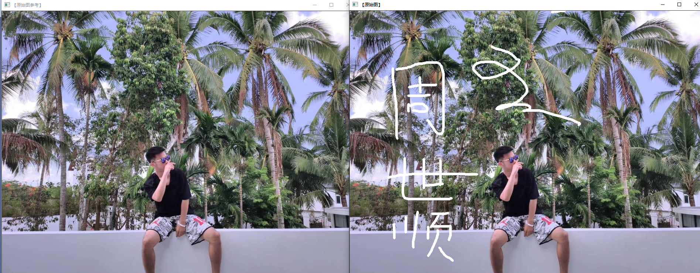
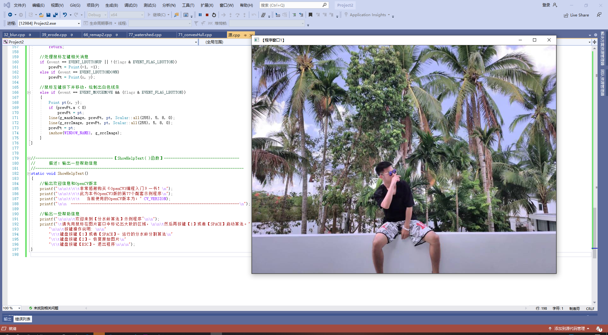
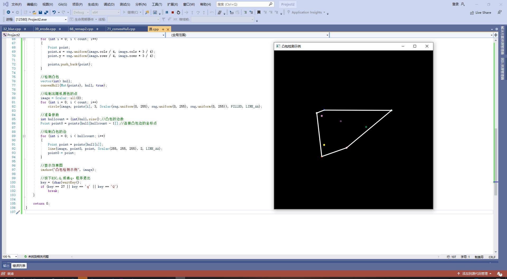
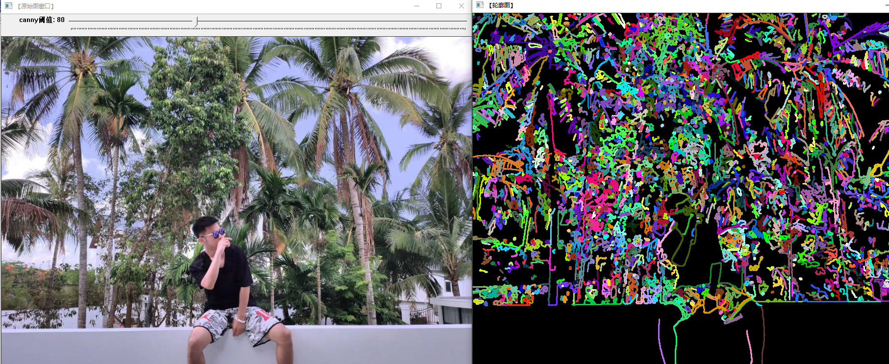

# 第九章节

# 直方图与匹配

## 图像直方图概述

- 过程在0~255中统计每一个像素

- 意义
  
  直方图是图像中像素强度分布的图形表达方式。
  统计了每一个强度值所具有的像素个数。
-  术语
   
    - dims:需要统计的特征的数目。在上例中，dims =,1因为我们仅仅统计了灰度值(灰度图像)。
    - bins:每个特征空间子区段的数目，可翻译为“直条”或“组距”。在上例中，bins = 16。
    - range:每个特征空间的取值范围。在上例中，range =[0,255]。
## 直方图的计算与绘制

### 计算

- calcHist()
  
```C++
void calcHist(
  const Mat* images, 
  //源图像数组，它们有同样的位深CV_8U或 CV_32F ，同样的尺寸；图像阵列中的每一个图像都可以有任意多个通道；
  int nimages,
  // 源图像的数目。
  const int* channels, 
  //维度通道序列，第一幅图像的通道标号从0~image[0].channels( )-1。
  InputArray mask, 
    //可选择的mask。如果该矩阵不空的话，它必须是一个8-bit的矩阵，与images[i]同尺寸
  OutputArray hist, 
 // 输出直方图， 它是一个稠密或稀疏矩阵，具有dims个维度；
  int dims, 
  // 直方图的维度，一定是正值， CV_MAX_DIMS（当前OpenCV版本是32个）
  const int* histSize, 
  // 数组，即histSize[i]表示第i个维度上bin的个数；这里的维度可以理解为通道。
  const float** ranges, 
  //当uniform=true时，ranges是多个二元数组组成的数组；当uniform=false时，ranges是多元数组组成的数组。
  bool uniform=true, 
  // 标识，用于说明直方条bin是否是均匀等宽的。
  bool accumulate = false
  //累积标识。
   )
```
- minMaxLoc()函数
  
  - 1  minMaxLoc寻找矩阵(一维数组当作向量,用Mat定义) 中最小值和最大值的位置. 
  - 2  参数若不需要,则置为NULL或者0,即可. 
  - 3  minMaxLoc针对Mat和MatND的重载中 ,第5个参数是可选的(optional),不使用不传递即可.
  - 4 minMaxLoc针对单通道图像，minMaxIdx则不限制（不过输出的坐标会变成三维）。
  
```C++
void minMaxLoc( 
  const Mat& src,
  //   输入单通道数组（图像）。
  double* minVal, 
  //返回最小值的指针。若无须返回，此值置为NULL。
  double* maxVal=0, 
  //返回最大值的指针。若无须返回，此值置为NULL。
  Point* minLoc=0, 
  //返回最小位置的指针（二维情况下）。若无须返回，此值置为NULL。
  Point* maxLoc=0, 
  // 返回最大位置的指针（二维情况下）。若无须返回，此值置为NULL。
  const Mat& mask=Mat() 
  //用于选择子阵列的可选掩膜。
  ); 
```
## 直方图对比

-  对比方法

   - 相关性比较
  
   - 卡方比较
  
   - 十字交叉性
  
   - 巴氏距离
  
- 函数原型
  
```C++
double compareHist(InputArray H1,InputArray H2， int method)

```
## 反向投影

- 简述
  
   - 一种记录给定图像中的像素点如何适应直方图模型像素分布的方式
   - 反向投影就是首先计算某一特征的直方图模型，然后使用模型去寻找图像中存在的特征。反向投影在某一位置的值就是原图对应位置像素值在原图像中的总数目。
- 原理
  - 对测试图像中的每个像素 p(i,j),获取色调数据并找到该色调这里写图片描述在直方图中的bin位置 
  - 查询模型直方图中对应的bin-这里写图片描述并读取该bin的数值。 
  - 将此数值存储在新的图像中(BackProjection)。也可以先归一化模型直方图，这样测试图像的输出就可以在屏幕上显示了。 
  - 通过对测试中的图像中的每个像素采用以上步骤。
  - 使用统计学的语言，BackProjection中存储的数值代表了测试图像中该像素属于皮肤区域的概率。以上图为例，亮的区域是皮肤区域的可能性更大，而暗的区域则表示更低的可能性
  
-  作用
  
  - 反向投影用于在输入图像（通常较大）中查找与特定图像（通常较小或者仅1个像素，以下将其称为模板图像）最匹配的点或者区域，也就是定位模板图像出现在输入图像的位置。

- 结果

  - 反向投影的结果包含了以每个输入图像像素点为起点的直方图对比结果。可以把它看成是一个二维的浮点型数组、二维矩阵，或者单通道的浮点型图像。
- calcBackproject()
```C++
void cv::calcBackProject    (   
  const Mat *     images,
  //输入图像
  int     nimages,
  //输入图像的数量 
  const int *     channels,
  //用于计算反向投影的通道列表，通道数必须与直方图维度相匹配
  InputArray      hist,
  //:输入的直方图，直方图的bin可以是密集(dense)或稀疏(sparse) 
  OutputArray     backProject,
  //目标反向投影输出图像，是一个单通道图像，
  const float **      ranges,
  //直方图中每个维度bin的取值范围 
  double      scale = 1,
  //可选输出反向投影的比例因子 
  bool    uniform = true 
  //直方图是否均匀分布(uniform)的标识符，有默认值true
    )
```
- mixChannels()函数
```C++
void mixChannels(const Mat* src,
// 输入矩阵，可以为一个也可以为多个，但是矩阵必须有相同的大小和深度.
int nsrc,
// 输入矩阵的个数。
Mat* dst ,
//输出矩阵，可以为一个也可以为多个，但是所有的矩阵必须事先分配空间（如用create），大小和深度须与输入矩阵等同.
int ndst,
//输出矩阵的个数
const int* fromTo,
//设置输入矩阵的通道对应输出矩阵的通道，
size_t npairs
//即参数fromTo中的有几组输入输出通道关系，其实就是参数fromTo的数组元素个数除以2.
);
```

## 模板匹配

- 适用场景

  - 图像检索
  - 目标跟踪

- 步骤

  - 读取图片
  - 创建一个空画布用来绘制匹配结果
  - 匹配，最后一个参数为匹配方式
  - 归一化图像矩阵，可省略
  - 获取最大或最小匹配系数
  - 开始正式绘制
  
- matchTemplat()函数
```C++
	void cv::matchTemplate(
		cv::InputArray image, // 用于搜索的输入图像, 8U 或 32F, 大小 W-H
		cv::InputArray templ, // 用于匹配的模板，和image类型相同， 大小 w-h
		cv::OutputArray result, // 匹配结果图像, 类型 32F, 大小 (W-w+1)-(H-h+1)
		int method // 用于比较的方法
	);
```

- 方法

  - 使用平方差进行匹配
  

  - 该方法使用归一化的平方差进行匹配，最佳匹配也在结果为0处。
  
  - 相关性匹配方法，该方法使用源图像与模板图像的卷积结果进行匹配，因此，最佳匹配位置在值最大处，值越小匹配结果越差。
  
  - 归一化的相关性匹配方法，与相关性匹配方法类似，最佳匹配位置也是在值最大处。
   
  - 相关性系数匹配方法，该方法使用源图像与其均值的差、模板与其均值的差二者之间的相关性进行匹配，最佳匹配结果在值等于1处，最差匹配结果在值等于-1处，值等于0直接表示二者不相关。
  
  - 归一化的相关性系数匹配方法，正值表示匹配的结果较好，负值则表示匹配的效果较差，也是值越大，匹配效果也好。
  

### 代码实现

#### H-S二维直方图

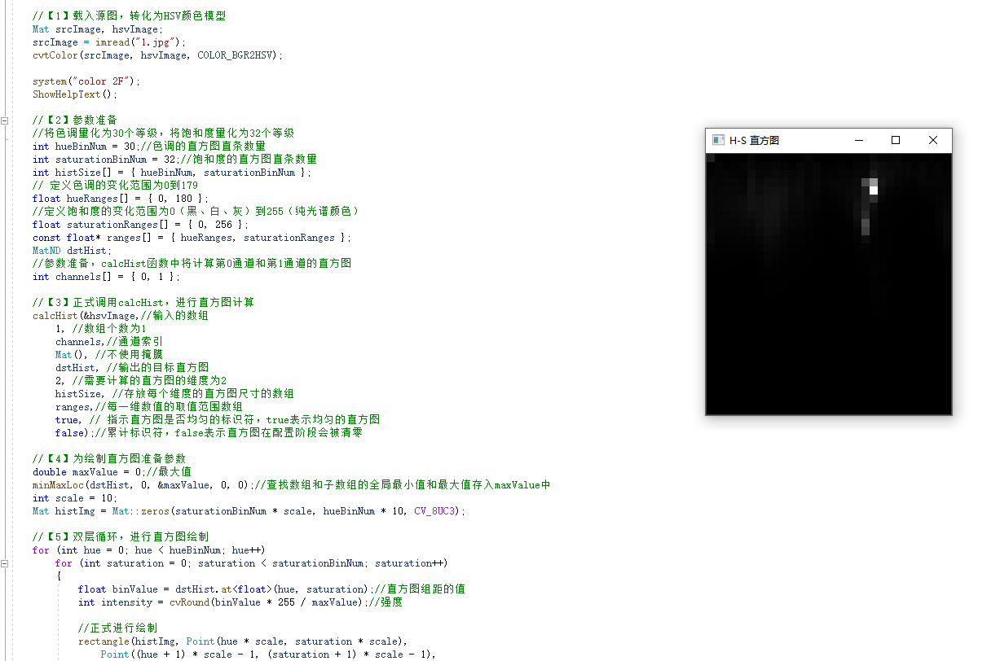
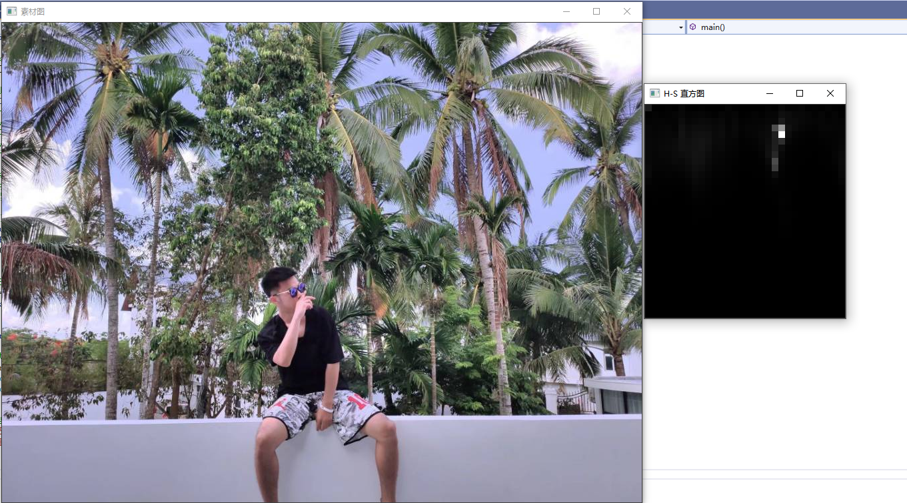

#### 一维直方图

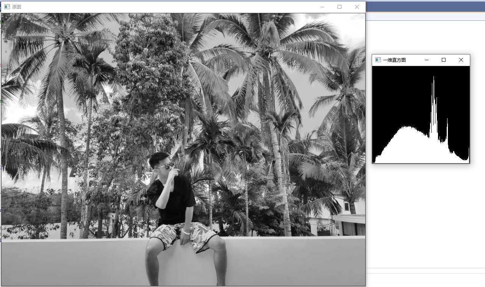
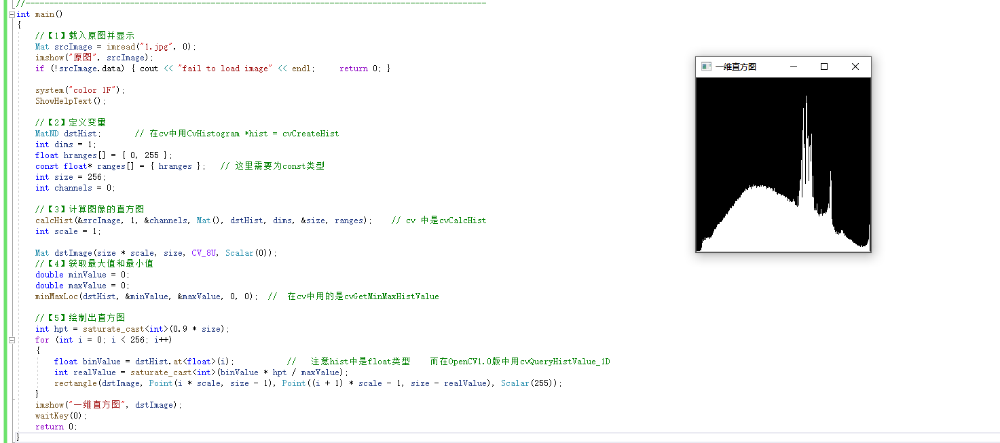

#### RGB三色直方图

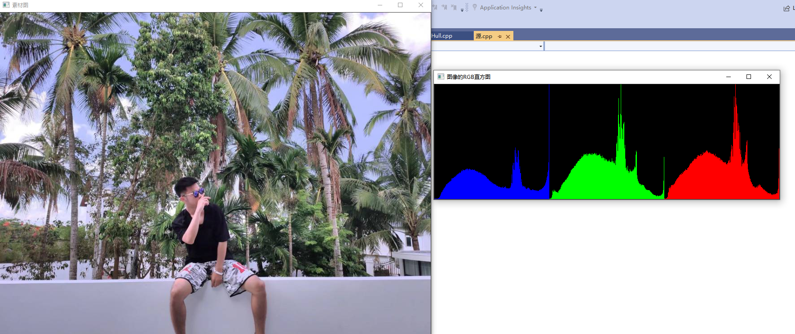

####　直方图对比

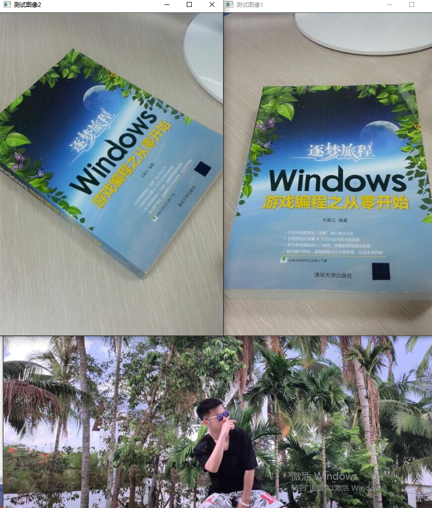

#### 反向投影

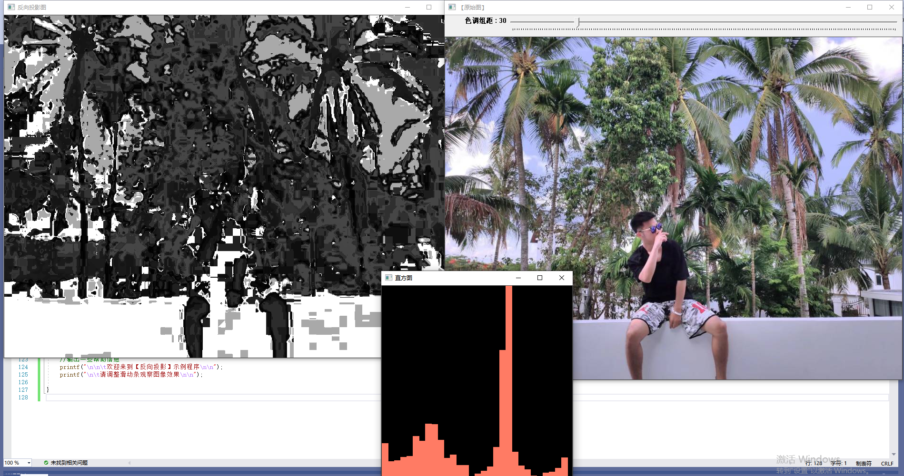

#### 模板匹配

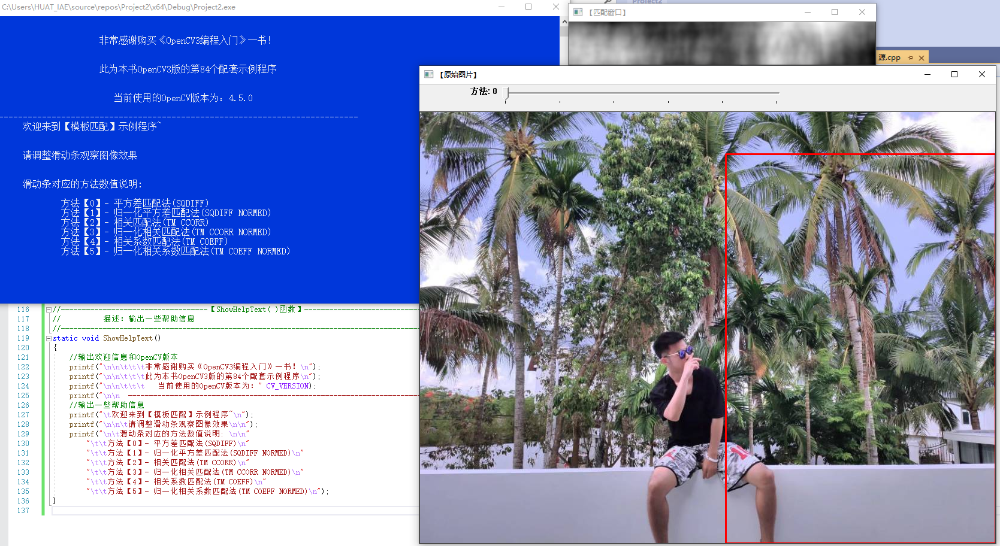


