## 图像处理
### 线性滤波
**方框滤波** 
滤波：剔除输入信号中不想要的频率
```C++
void boxFilter(InputArray src,
outputArray dst,
int ddepth,     //输出图像的深度，-1表示原图深度
Size ksize,     //内核的大小
Point anchor=Point(-1,1),   //表示锚点，即平滑的那个点
bollnormalize=true,     //一个标识符，表示内核是否被其区域归一化
int borderType=BORDER_DEFAULT)  //用于推断图像外部像素的某种边界模式
```

**均值滤波**
```C++
void blur(
    InputArray src,
    OutPutArray dst,
    Size ksize,  //内核的大小
    Point anchor = Point(-1,-1),  //表示锚点，即平滑的那个点
    int borderType = BORDER_DEFAULT  //用于推断图像外部像素的某种边界模式
)
```  
均值滤波的**缺陷**：他不能很好的保护图像细节去除噪音同时也破花了图像的细节，是的图像变得模糊

**高斯滤波**
从数学的角度上来看，图像的高斯模糊过程就是图像与正态分布作卷积。
```C++
void GaussianBlur(
    InputArray src,
    OutPutArray dst,
    Size ksize,  //高斯内核的大小
    double sigmax,   //表示高斯函数在X方向的标准偏差
    double sigmay = 0,  //表示高斯函数在Y方向的标准偏差
    int borderType = BORDER_DEFAULT  //用于推断图像外部像素的某种边界模式
)
```

线性滤波代码运行结果：
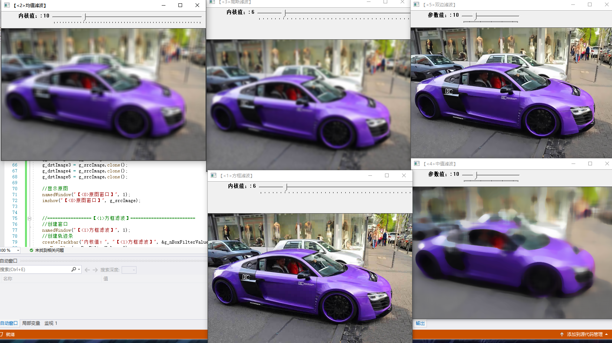

## 非线性滤波
### 中值滤波
该方法用在除去脉冲噪声，椒盐噪声同时又能保留图像的边缘细节，对于斑点噪声和椒盐噪声尤其有效，是非常经典的平滑噪声处理方法
```C++
void medianBlur(InputArray src,
OutputArray dst,
int ksize //孔径的尺寸，必须是大于1的奇数)
```
中值滤波和均值滤波器比较：


中值滤波器与均值滤波器比较的**优势**：在均值滤波器中，由于噪声成分被放入平均计算中，所以输出受到了噪声的影响，但是在中值滤波器中，由于噪声成分很难选上，所以几乎不会影响到输出。因此同样用3x3区域进行处理，中值滤波消除的噪声能力更胜一筹。中值滤波无论是在消除噪声还是保存边缘方面都是一个不错的方法。         

中值滤波器与均值滤波器比较的**劣势**：中值滤波花费的时间是均值滤波的5倍以上。

中值滤波在一定条件下，可以克服线性滤波器（如均值滤波等）所带来的图像细节模糊，

而且对滤除脉冲干扰即图像扫描噪声最为有效。在实际运算过程中并不需要图像的统计特

性，也给计算带来不少方便。但是对一些细节多，特别是线、尖顶等细节多的图像不宜采用中值滤波。

### 双边滤波
他是一种结合图像的空间领近度和像素值相似度的一种折中处理，同事奥绿空域信息和灰度相似性，达到保边去躁的目的，具有简单，非迭代，局部的特点。
```C++
void bilateralFilter(InputArray src,
OutputArray dst,
int d,     //每个像素邻域的直径
double sgmaColor,   // 颜色滤波器的sigma值。这个值越大，就表明有越宽广的颜色被混合在一起
double sigmaSpace,      //坐标空间中Sigma值，坐标空间的标注方差。他的数值越大就代表使得更大的区域中足够相似的颜色获取相同的颜色
int borderType=BORDER_DEFAULT)
```
双边滤波器的好处是可以做边缘保存，但对于对于彩色图像里的高频噪声，双边滤波器不能够干净的滤掉，只能够对于低频信息进行较好的滤波。

非线性滤波代码运行结果：
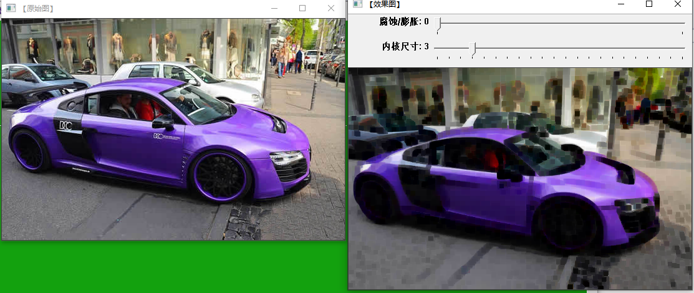

### 形态学 膨胀与腐蚀
它们的用途就是用来处理图形问题上。总结性的来说： + 膨胀用来处理缺陷问题； + 腐蚀用来处理毛刺问题
主要功能：
- 消除噪声
- 分割出独立的图像元素，在图像中连接相邻的元素
- 寻找图像中的明显的极大区域或极小值区域
- 求出图像的梯度
```C++
void cv::erode( InputArray src,
 OutputArray dst, 
 InputArray kernel,     //核的形状
 Point anchor,  //锚点
 int iterations,
 int borderType,
 const Scalar& borderValue )
                
```
```C++
void cv::dilate( InputArray src,
 OutputArray dst,
 InputArray kernel, //核的形状
 Point anchor, //锚点
 int iterations,  
 int borderType, 
 const Scalar& borderValue )
```
函数一般填前三个后面都是默认的
先腐蚀后膨胀就是开运算
开运算会平滑物体轮廓，断开较窄的狭颈并消除细的突出物
代码运行结果：
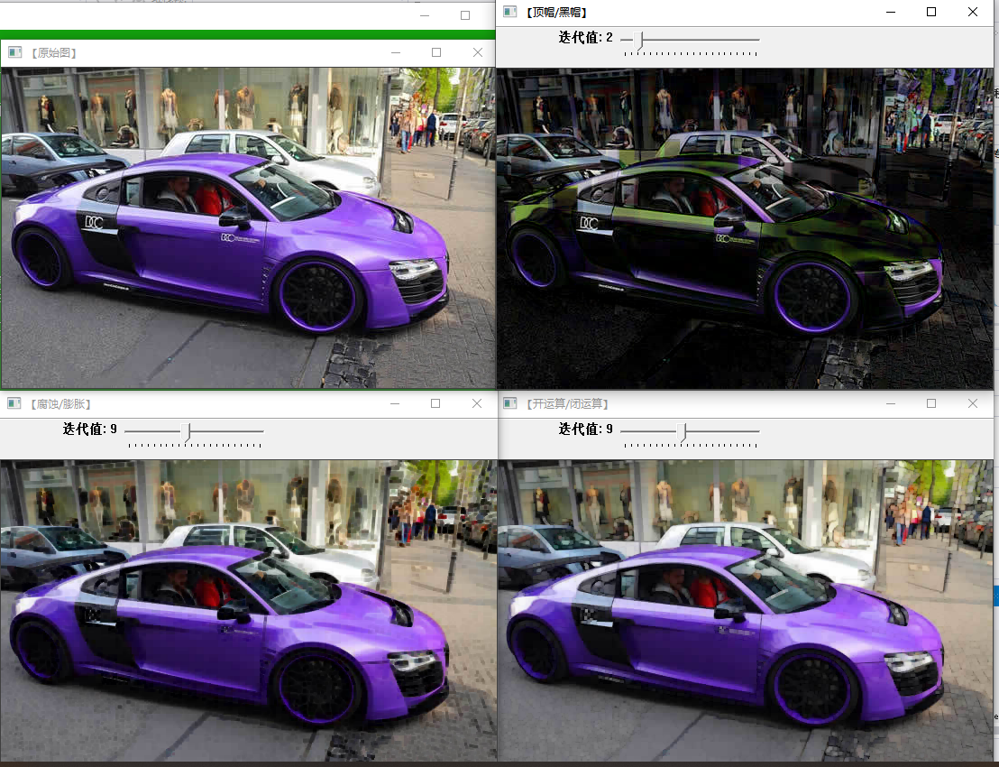

### 形态学 开运算，闭运算，梯度，顶帽，黑帽

开运算：先腐蚀后膨胀：平滑较大物体的边界
缺点： 放大了裂缝或者局部低亮的区域
闭运算：先膨胀后腐蚀：排除小型黑洞
缺点：突出了比原图轮廓周围更暗的区域
梯度：膨胀图与腐蚀图之差：保留物体边缘
顶帽：原图与开运算之差：比原图轮廓周围更明亮的区域
黑帽：闭运算与原图之差：分离邻近点暗一些的斑块，具有非常完美的轮廓


### 漫水填充
漫水填充是一种用特定的颜色填充连通区域，通过设置可连通像素的上下限以及连通方式达到不同的填充效果的方法。漫水填充经常用来标记或者是分离图像的一部分，以便对其进行进一步处理货分析，也可以用来从输入图像获取掩码区域，掩码会加速处理过程，或者只处理指定的像素点，操作的结果总是某个连续的区域。他的基本作用有两个：1、标记或分离目标区域；2、获取掩码区域，只处理掩码指定的像素点，加速处理过程。

```C++
loodFill(InputOutputArray image,    //1/3通道8位或浮点图像

Point seedPoint,    //种子点，起始点

Scalar newVal,    //指定颜色

Rect* rect=0,       //设定重绘区域的最小边界矩形

Scalar loDiff=Scalar(),     //当前观察象素值与其部件领域象素或者待加入该部件的种子象素之负差(Lower difference)的最大值。低于这个差距的不属于重绘区域

Scalar upDiff=Scalar(),     //当前观察象素值与其部件领域象素或者待加入该部件的种子象素之正差(upper difference)的最大值。高于这个差距的不属于重绘区域

int flags=4)
```
带mask版本
```C++
floodFill(InputOutputArray image, InputOutputArray mask, Point seedPoint, Scalar newVal, Rect* rect=0, Scalar loDiff=Scalar(), Scalar upDiff=Scalar(), int flags=4);
```
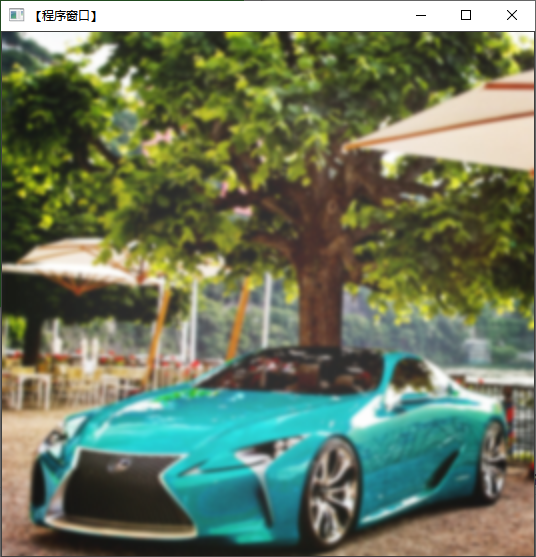

### 图像金字塔与图片尺寸缩放
图像金字塔是图像中多尺度表达的一种，最主要用于图像的分割，是一种以多分辨率来解释图像的有效但概念简单的结构。

图像金字塔最初用于机器视觉和图像压缩，一幅图像的金字塔是一系列以金字塔形状排列的分辨率逐步降低，且来源于同一张原始图的图像集合。其通过梯次向下采样获得，直到达到某个终止条件才停止采样。

金字塔的底部是待处理图像的高分辨率表示，而顶部是低分辨率的近似。

一般情况下有两种类型的图像金字塔常常出现在文献和以及实际运用中。他们分别是:

●高斯金字塔(Gaussianpyramid): 用来向下采样，主要的图像金字塔
 ●拉普拉斯金字塔(Laplacianpyramid): 用来从金字塔低层图像重建上层未采样图像，在数字图像处理中也即是预测残差，可以对图像进行最大程度的还原，配合高斯金字塔一起使用。
●对图像向上采样：pyrUp函数
上采样过程首先是将图像在每个方向上扩大为原来的两倍，新增的行和列都以0填充，然后使用下采样时用的高斯核乘以四与放大后的图像进行卷积，获得“新增像素”的近似值。因此处理后的图像尺寸变大，但是分辨率不变
●对图像向下采样：pyrDown函数
得到的图像即为G_i+1的图像，显而易见，结果图像只有原图的四分之一。通过对输入图像G_i(原始图像)不停迭代以上步骤就会得到整个金字塔。同时我们也可以看到，向下取样会逐渐丢失图像的信息。以上就是对图像的向下取样操作，即缩小图像。

代码运行结果：
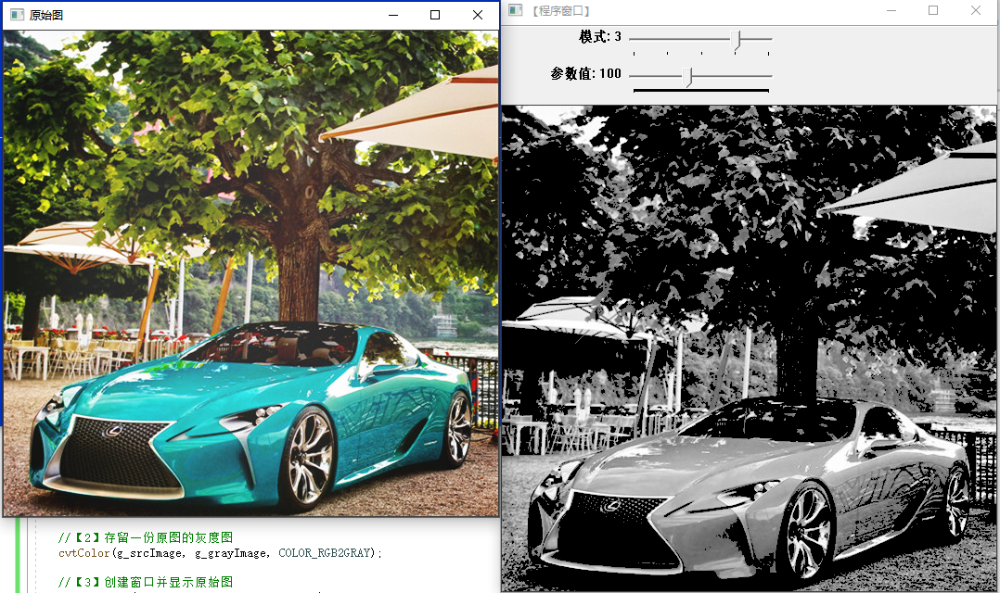

### 阈值化
阈值处理是指剔除图像内像素值高于阈值或者低于阈值得像素点

图像阈值化分割是一种传统的最常用的图像分割方法，因其实现简单、计算量小、性能较稳定而成为图像分割中最基本和应用最广泛的分割技术。它特别适用于目标和背景占据不同灰度级范围的图像。它不仅可以极大的压缩数据量，而且也大大简化了分析和处理步骤，因此在很多情况下，是进行图像分析、特征提取与模式识别之前的必要的图像预处理过程。图像阈值化的目的是要按照灰度级，对像素集合进行一个划分，得到的每个子集形成一个与现实景物相对应的区域，各个区域内部具有一致的属性，而相邻区域不具有这种一致属性。这样的划分可以通过从灰度级出发选取一个或多个阈值来实现。

```C++
double cv::threshold ( InputArray src,
                       OutputArray dst,
                       double thresh,   //要设定的阈值
                       double maxval,   //当type为THRESH_BINARY或者THRESH_BINARY_INV时，设定的最大值
                       int type     //阈值分割的类型:    THRESH_BINARY；二值化阈值处理：灰度值大于阈值的点，将其灰度值设定为最大值，灰度值小于或等于阈值的点，将其灰度值设定为0
    THRESH_BINARY_INV；反二值化阈值处理：灰度值大于阈值的点，将其灰度值设定为0，灰度值小于或等于阈值的点，将其灰度值设定为最大值
    THRESH_TRUNC；截断阈值化处理：灰度值大于阈值的点，将其灰度值设定为阈值，灰度值小于或等于阈值的点，其灰度值保持不变
    THRESH_TOZERO；低阈值零处理：灰度值大于阈值的点，其灰度值保持不变，灰度值小于或等于阈值的点，将其灰度值设定为0
    THRESH_TOZERO_INV；高阈值零处理：灰度值大于阈值的点，将其灰度值设定为0，灰度值小于或等于阈值的点，其灰度值保持不变 )  
```
```C++
void adaptiveThreshold(InputArray src, OutputArray dst, 
                       double maxValue,     //像素最大值
                       int adaptiveMethod,      //自适应方法，只有两种：THRESH_BINARY 和THRESH_BINARY_INV
                       int thresholdType,   //阈值计算方式，有两种：ADAPTIVE_THRESH_MEAN_C：计算方法是计算出领域内的像素平均值再减去C的值       ADAPTIVE_THRESH_GAUSSIAN_C：计算方法是计算出领域内像素的高斯均值再减去C的值
                       int blockSize, double C)
```
代码运行结果：
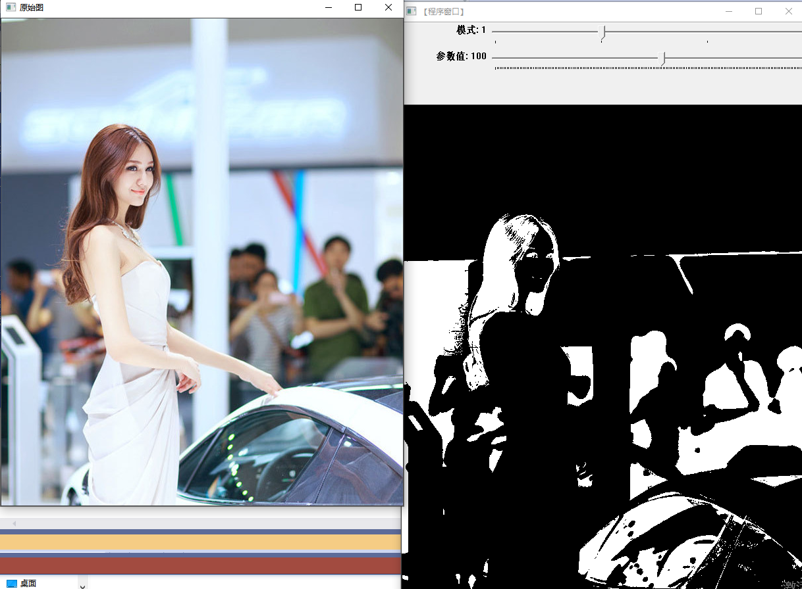
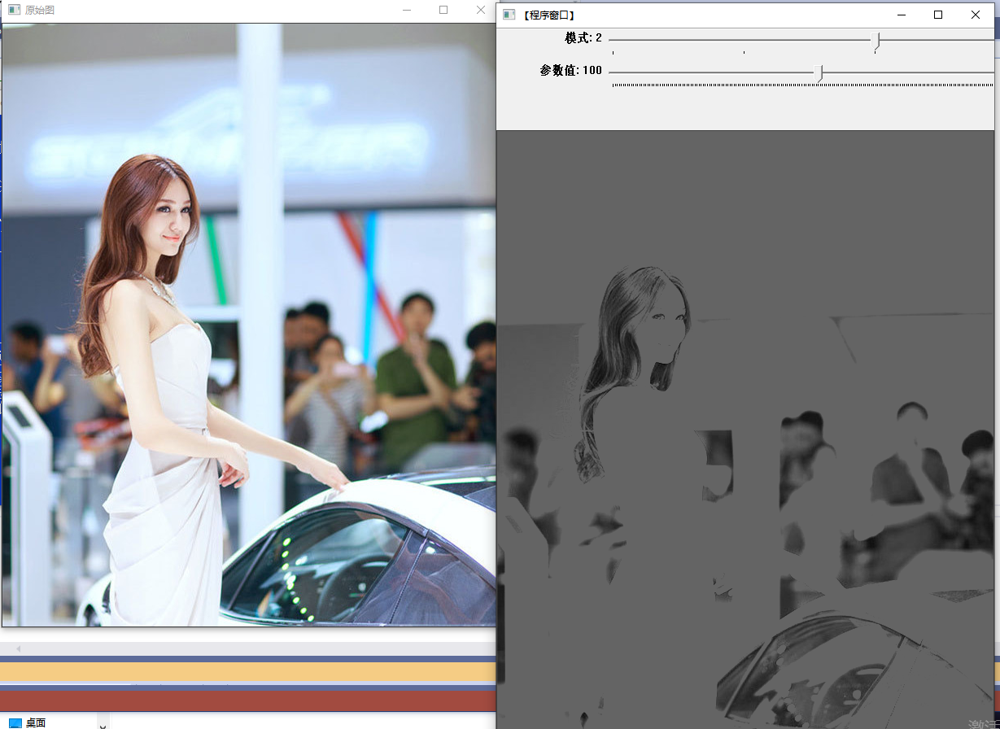
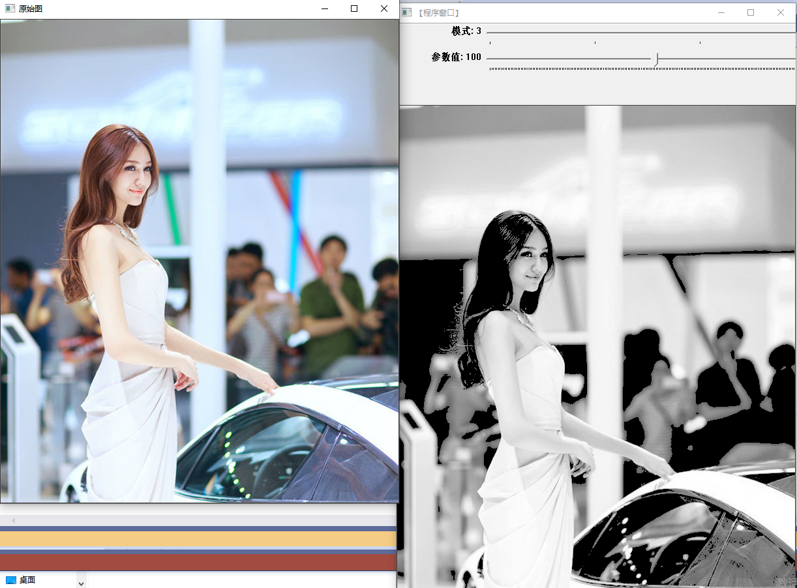

## 边缘检测
边缘检测的一般步骤：
- 滤波
  导数对噪声很敏感因此需要采用滤波器改善与噪声有关的边缘检测的性能。常见的有高斯滤波
- 增强
- 检测
  经过增强的图像往往有很多点的梯度值较大，而在特定的应用中，这些点并不是要找的边缘点，所以应该采用这种方法对这些点取舍，实际工程中通过阈值化方法来检测

### Canny算子
评价标准
- 低错误率：标识出尽可能多的实际边缘，同时尽可能地减少噪声产生的误报。
- 高定位性：标识出的边缘要与图像中的实际边缘尽可能接近
- 最小响应：图像中的边缘只能标识一次，并且可能存在的图像噪声不应标识为边缘

```C++
void Canny(InputArray image,
 OutputArray edges,
  double threshold,     //第一个滞后性阈值
  double threshold2,    //第二个滞后性阈值
  int apertureSize = 3,    //表示应用Sobel算子的孔径大小，默认值为3
  bool L2gradient = false   //一个计算图像梯度幅值的标识，默认值false)
```

### Sobel算子
Sobel算子是一个主要用于边缘检测的离散微分算子(discrete differentiation operator)，它结合高斯平滑和微分求导。用来计算图像灰度函数的近似函数
```C++
void Sobel(InputArray src,
OutputArray dst,
 int ddepth,    //输出图像深度
  int dx,       //  x方向的差分阶数
  int dy,       //y方向的差分阶数
  int ksize= 3,        //Sobel核大小必须取1、3、5、7
  double scale = 1,     //计算导数的缩放因子
  double delta = 0,     //在结果存入目标图 
  int borderType = BORDER_DEFAULT   //边界模式)
```

### Laplacian算子
Laplacian算子是n维欧几里得空间中的一个二阶微分算子。定义为梯度grad的散度div。定义如下： 
1. 
f
f
的拉普拉斯算子也是笛卡尔坐标系中的所有非混合二阶偏导数求和 
2. 作为一个二阶微分算子，拉普拉斯算子把C函数映射到C函数，对于
k≥2
k≥2
,定义一个算子
Δ
Δ
：
C(R)→C(R)
C(R)→C(R)
 
二阶导数可以用来进行检测边缘，因为图像是“二维”的，需要在两个方向上进行求导。 
```C++
void Laplacian(InputArray src,
 OutputArray dst,
 int ddepth ,
 int ksize = 1,
 double scale = 1,
 double delta = 0,
 int borderType = BORDER_DEFAULT)
```

### scharr滤波器
```C++
void Scharr(InputArray src,
 OutputArray dst,
 int ddepth ,
 int dx,
    int dy,
  double scale = 1,
  double delta = 0,
  int borderType = BORDER_DEFAULT)
  ```
代码运行结果图：


## 霍夫变换
 霍夫变换(Hough Transform)是图像处理中的一种特征提取技术，它通过一种投票算法检测具有特定形状的物体。Hough变换是图像处理中从图像中识别几何形状的基本方法之一。Hough变换的基本原理在于利用点与线的对偶性，将原始图像空间的给定的曲线通过曲线表达形式变为参数空间的一个点。这样就把原始图像中给定曲线的检测问题转化为寻找参数空间中的峰值问题。也即把检测整体特性转化为检测局部特性。比如直线、椭圆、圆、弧线等。

```C++

cv::HoughLines(

InputArray src, // 输入图像，必须8-bit的灰度图像

OutputArray lines, // 输出的极坐标来表示直线

double rho, // 生成极坐标时候的像素扫描步长

double theta, //生成极坐标时候的角度步长，一般

CV_PI/180

int threshold, // 阈值，只有获得足够交点的极坐标点才被看成是直线

double srn=0，// 是否应用多尺度的霍夫变换，如果不是设置0表示经典霍夫变换

double stn=0，//是否应用多尺度的霍夫变换，如果不是设置0表示经典霍夫变换

double min_theta=0， // 表示角度扫描范围 0 ~180之间， 默认即可

double max_theta=CV_PI) 
```
```C++
cv::HoughLinesP(

InputArray src, // 输入图像，必须8-bit的灰度图像

OutputArray lines, // 输出的极坐标来表示直线

double rho, // 生成极坐标时候的像素扫描步长

double theta, //生成极坐标时候的角度步长，一般取值CV_PI/180

Int threshold, // 阈值，只有获得足够交点的极坐标点才被看成是直线

double minLineLength=0，// 最小直线长度

double maxLineGap=0// 最大间隔)
```
代码运行结果：
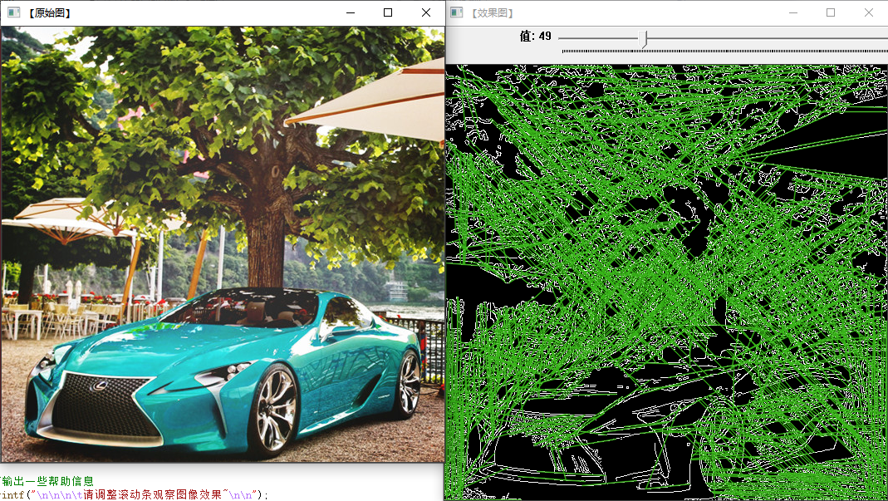
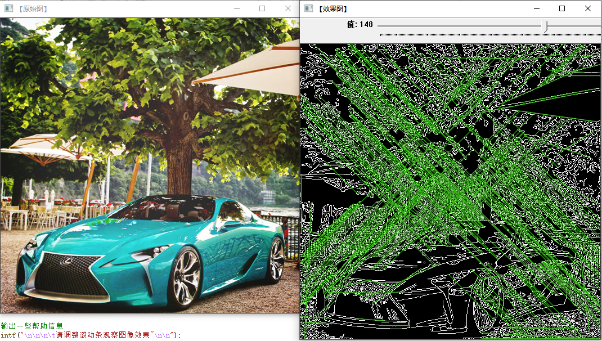

## 重映射
重映射就是把一幅图像中某个位置的像素放置到另一个图片中指定位置的过程
```C++
cv::remap(
    InputArray src,     //输入图像
    OutputArray dst,    //输出图像
    InputArray map1,//x映射表  CV_32FC1/CV_32FC2
    InputArray map2,//y映射表
    Int interpolation,  //插值方式
    Int borderMode, //边界模式
    Const Scalar borderValue //Color
)
```
代码运行结果：
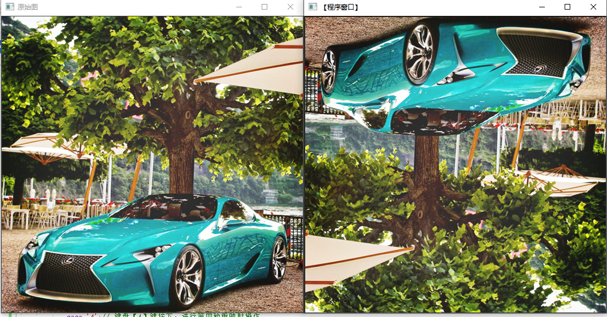

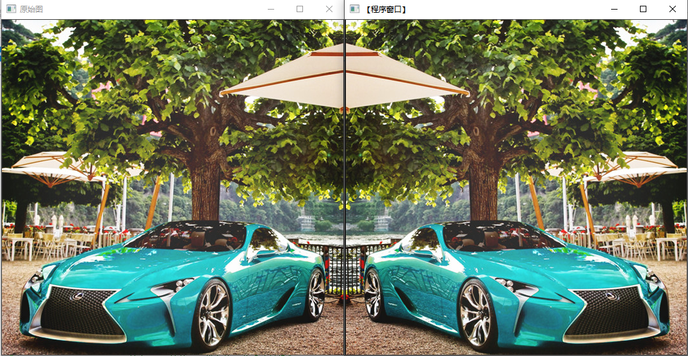
## 仿射变化
拉伸、收缩、扭曲、旋转是图像的几何变换，在三维视觉技术中大量应用到这些变换，又分为仿射变换和透视变换。仿射变换通常用单应性（homography）建模，利用cvWarpAffine解决稠密仿射变换，用cvTransform解决稀疏仿射变换。仿射变换可以将矩形转换成平行四边形，它可以将矩形的边压扁但必须保持边是平行的，也可以将矩形旋转或者按比例变化。透视变换提供了更大的灵活性，一个透视变换可以将矩阵转变成梯形。当然，平行四边形也是梯形，所以仿射变换是透视变换的子集。
```C++
1）getAffineTransform       //三点法

Mat M1=getAffineTransform(const Point2f* src, const Point2f* dst)

（2）getRotationMatrix2D       //直接指定比例和角度

Mat M2=getRotationMatrix2D (CvPoint2D32f  center,double angle,double scale)

//进行仿射变化
void warpAffine(InputArray src, OutputArray dst, InputArray M, Size dsize, int flags=INTER_LINEAR, int borderMode=BORDER_CONSTANT, const Scalar& borderValue=Scalar())

	   //参数InputArray src：输入变换前图像

		//参数OutputArray dst：输出变换后图像，需要初始化一个空矩阵用来保存结果，不用设定矩阵尺寸

		//参数InputArray M：变换矩阵，用另一个函数getAffineTransform()计算

		//参数Size dsize：设置输出图像大小

		//参数int flags = INTER_LINEAR：设置插值方式，默认方式为线性插值(另一种WARP_FILL_OUTLIERS)

        //参数int borderMode=BORDER_CONSTANT：边界像素模式，默认值BORDER_CONSTANT

        //参数const Scalar& borderValue=Scalar()，在恒定边界情况下取的值，默认值为Scalar（），即0
```

代码运行结果：
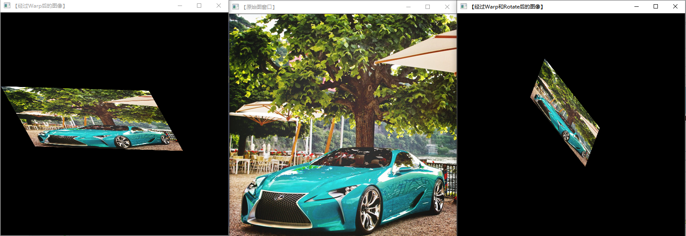

## 直方图均衡化
均值化步骤：
- 计算输入图像的直方图H
- 进行直方图归一化，直方图的组距的和为255
- 计算直方图积分
- 以H’作为查询表进行图像变化
```C++
void equalizeHist(InputArray src, OutputArray dst);
```
简而言之：
把直方图的每个灰度级进行归一化处理，秋每种灰度的累积分布（概率密度函数），得到一个映射的灰度映射表，然后根据相应的灰度值来修正原图中的每个像素
代码运行结果：
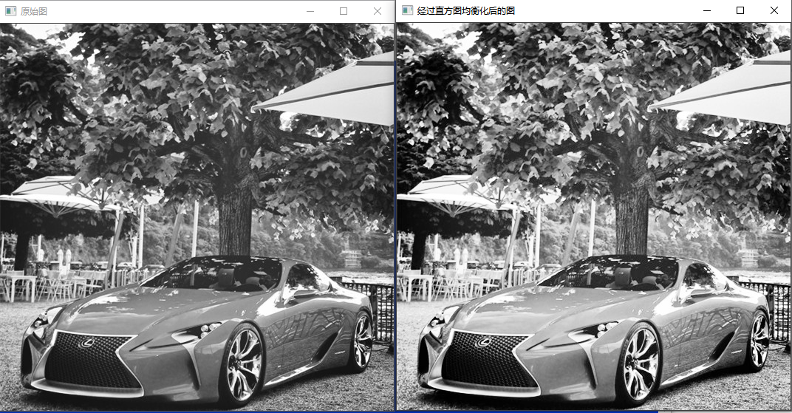

## 查找并绘制轮廓
寻找轮廓
```C++
void cv::findContours    (    InputOutputArray     image,
                        OutputArrayOfArrays     contours,
                        OutputArray     hierarchy,
                        int     mode,
                        int     method,
                        Point     offset = Point() 
                      )    
```
    image: 输入图像，需为8位单通道图像，图像非0像素视为1。 可以用compare(), imrange(), threshold(), adaptivethreshold(), canny()等函数创建，注意：此函数会在提取图像轮廓的同时修改图像内容。
        If mode equals to RETR_CCOMP or RETR_FLOODFILL, the input can also be a 32-bit integer image of labels (CV_32SC1).
    contours: 检测到的轮廓，每个轮廓存储为一个点向量，即用point类型的vector，例如可为类型vector<vector<Point> >。
    hierarchy: 可选的输出向量，包含图像的拓扑信息。 每个轮廓contours[i],
        hierarchy[i][0] , 后一个轮廓，
        hierarchy[i][1] , 前一个轮廓，
        hierarchy[i][2] , 父轮廓，
        hierarchy[i][3], 内嵌轮廓的索引编号。
        如果没有对应项，hierarchy[i]中的对应项设为负数。
    mode: 检索模式，可选模式包括
        RETR_EXTERNAL: 只监测最外层轮扩。hierarchy[i][2] ＝ hierarchy[i][3] ＝ －1
        RETR_LIST: 提取所有轮廓，并放置在list中。检测的轮廓不建立等级关系。
        RETR_CCOMP: 提取所有轮廓，并将其组织为双层结构，顶层为联通域的外围边界，次层为空的内层边界。
        RETR_TREE: 提取所有轮廓，并重新建立网状的轮廓结构。
    method: 轮廓的近似办法，包括
        CHAIN_APPROX_NONE: 获取每个轮廓的每个像素，相邻两点像素位置差不超过1，max(abs(x1-x2),abs(y1-y2)) == 1
        CHAIN_APPROX_SIMPLE: 压缩水平方向，垂直方向，对角线方向的元素，只保留该方向的终点坐标
        CHAIN_APPROX_TC89_LI ／CHAIN_APPROX_TC89_KCOS: 使用Teh-Chinl链逼近算法中的一个
            [135] C-H Teh and Roland T. Chin. On the detection of dominant points on digital curves. Pattern Analysis and Machine Intelligence, IEEE Transactions on, 11(8):859–872, 1989.
    offSet: 每个轮廓点的可选偏移量，默认Point(), 当ROI图像中找出的轮廓需要在整个图中进行分析时，可利用这个参数。
绘制轮廓
```C++
void cv::drawContours    (    InputOutputArray     image,
                        InputArrayOfArrays     contours,  //输入轮廓，每个轮廓存储为一个点向量
                        int     contourIdx,     //需要绘制的轮廓的编号，如果为负，绘制所有轮廓
                        const Scalar &     color,   //轮廓颜色
                        int     thickness = 1,    //轮廓线条粗细度
                        int     lineType = LINE_8,    
                        InputArray     hierarchy = noArray(),   //可选层次结构
                        int     maxLevel = INT_MAX,   //绘制轮廓的最大等级
                        Point     offset = Point()    //可选轮廓偏移参数
                      ) 
```

代码运行结果：
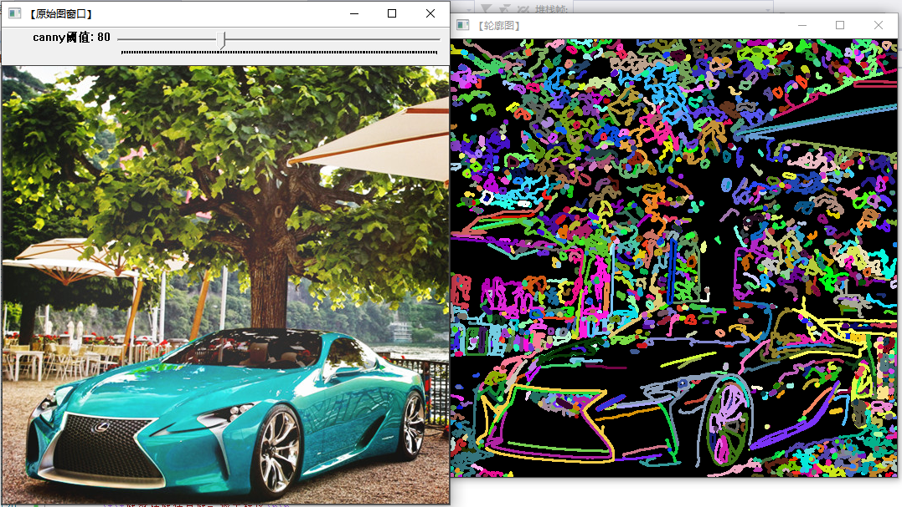

## 寻找物体的凸包
寻找凸包
```C++
    void cv::convexHull (   InputArray  points,   //输入的二维点集，Mat类型数据即可
                            OutputArray hull,   //输出参数，用于输出函数调用后找到的凸包 
                            bool  clockwise = false,    //操作方向，当标识符为真时，输出凸包为顺时针方向，否则为逆时针方向
                            bool  returnPoints = true   //操作标识符，默认值为true，此时返回各凸包的各个点，否则返回凸包各点的指数，当输出数组时std::vector时，此标识被忽略
    )
```
代码运行结果：
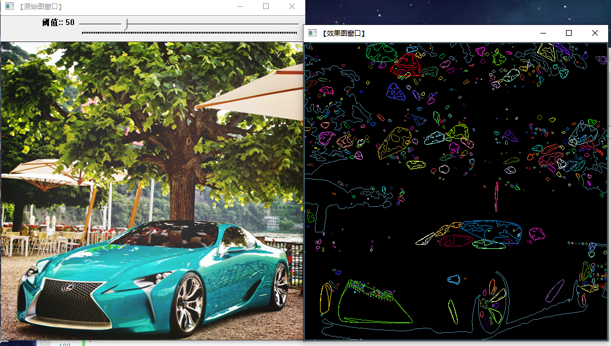

## 使用多边形将轮廓包围
矩形边界
```C++
Rect boundingRect(inputArray points) 
```
其唯一的参数就是输入的二维点集
最小包围矩形
```C++
Rect boundingRect(inputArray points) 
```
最小包围圆形
```C++
void minEnclosingCircle(inputArray points,  //输入的二维点集
Point2f& center,  //圆的输出圆心
float& radius //圆的输出半径) 
```
椭圆拟合
```C++
void approxPolyDp(inputArray curve,   //输入的二维点集
outputArray approxCurve,  //多边形逼近的结果其类型应该和输入的二维点集的类型一致
double epsilon,   //逼近的精度，为原始曲线和即近似曲线间的最大值
bool closed   //如果其为真，则近似的曲线为封闭曲线（第一个顶点和最后一个顶点相连），否则，近似的曲线不封
```
代码运行结果：


## 图像的矩
计算图像的矩一般由moment，contourArea，arcLength这三个函数配合求取
- 使用moments计算图像所有的矩(最高到3阶)
- 使用contourArea来计算轮廓面积
- 使用arLength来计算轮廓或者曲线长度
```C++
Moments moments(InputArray array,   //光栅图像或二维数组
bool binaryImage=false )
```
用于计算多边形和光栅形状的最高达三阶的所有矩，矩用来计算形状的重心，面积，主轴和其他形状特征。
```C++
double contourArea(InputArray contour,  //contour输入的向量，二维点
bool oriented-false)
```
拥有计算整个轮廓或者部分轮廓的面积
```C++
double arcLength(InputArray curve,  //二维点集可为Mat类或者Vector
bool closed)
```
代码运行结果：
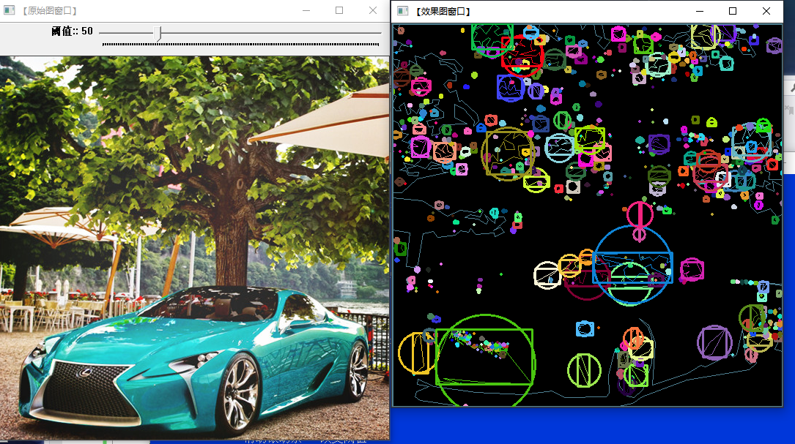

### 分水岭算法
分水岭算法是一种图像区域分割法，在分割的过程中，它会把跟临近像素间的相似性作为重要的参考依据，从而将在空间位置上相近并且灰度值相近（求梯度）的像素点互相连接起来构成一个封闭的轮廓
分水岭步骤：
1. 图像灰度化、滤波、Canny边缘检测

2. 查找轮廓，并且把轮廓信息按照不同的编号绘制到watershed的第二个入参merkers上，相当于标记注水点。

3. watershed分水岭运算

4. 绘制分割出来的区域，视觉控还可以使用随机颜色填充，或者跟原始图像融合以下，以得到更好的显示效果。
```C++
void watershed(InputArray image, InputOutpuArray markets)
```
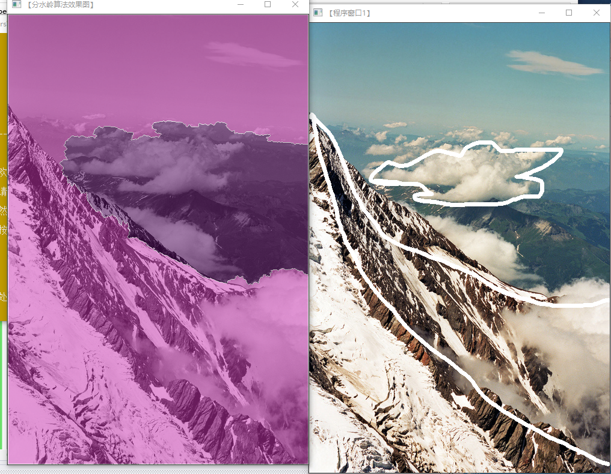
### 图像修补
```C++
void inpaint(InputArray src,  
InputArray inpaintMask,   //修复掩膜
 OutputArray dst,     
 double inpaintRadius,    //修补每个点的圆形领域，为修复算法的参考半径
 int flags)
```
代码运行结果：
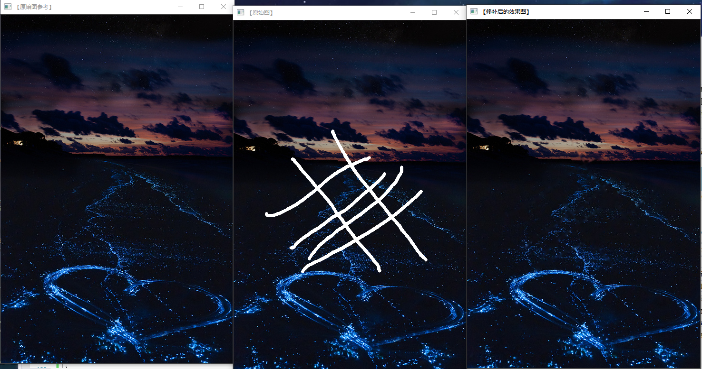
### 直方图概述
计算一个或者多个阵列的直方图
```C++
Void calcHist(
	        const Mat* images,//输入图像指针
	        int images,// 图像数目
	        const int* channels,// 通道数
	        InputArray mask,// 输入mask，可选，不用
	        OutputArray hist,//输出的直方图数据
	        int dims,// 维数
	        const int* histsize,// 直方图级数
	        const float* ranges,// 值域范围
	        bool uniform,// true by default
	        bool accumulate)// false by defaut
```
在数组中寻找全局最大和最小值
```C++
void minMaxLoc(InputArray src, double* minVal, double* maxVal=0, 
                    Point* minLoc=0,Point* maxLoc=0,InputArray mask=noArray())
        //第一个参数：输入单通道阵列
        //第二个参数：返回最小值的指针，若无需返回，此值置为NULL
        //第三个参数：返回最大值的指针，若无需返回，此值置为NULL
        //第四个参数：返回最小位置的指针（二维情况下），若无需返回，此值置为NULL
        //第五个参数：返回最大位置的指针（二维情况下），若无需返回，此值置为NULL
        //第六个参数：用于选择子阵列的可选掩膜
```
代码运行结果：
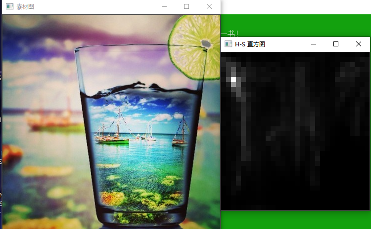
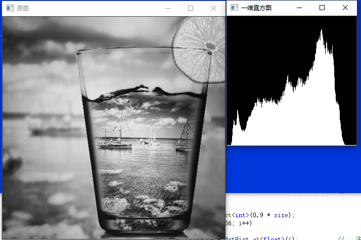
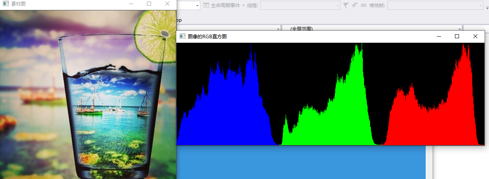
### 直方图对比
```C++
double compareHist(InputArray H1, InputArray H2,int method)
double compareHist(const SparseMat& H1,const SparseMat& H2,int method)
```
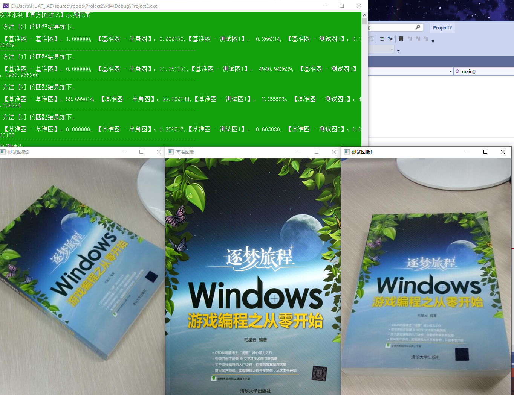
### 反向投影
反向投影是反映直方图模型在目标图像中的分布情况；简单点说就是用直方图模型去目标图像中寻找是否有相似的对象。通常用HSV色彩空间的HS两个通道直方图模型
步骤：

1. 建立直方图模型
2. 计算待测图像直方图并映射到模型中
3. 从模型反向计算生成图像
```C++
void calcBackProject(const Mat* arrays, int narrays, const int* channels, InputArray hist, OutputArray backProject, const float** ranges, double scale=1, bool uniform=true )
```
参数解释： 
    const Mat* images:输入图像，图像深度必须位CV_8U,CV_16U或CV_32F中的一种，尺寸相同，每一幅图像都可以有任意的通道数 
    int nimages:输入图像的数量 
    const int* channels:用于计算反向投影的通道列表，通道数必须与直方图维度相匹配，第一个数组的通道是从0到image[0].channels()-1,第二个数组通道从图像image[0].channels()到image[0].channels()+image[1].channels()-1计数 
    InputArray hist:输入的直方图，直方图的bin可以是密集(dense)或稀疏(sparse) 
    OutputArray backProject:目标反向投影输出图像，是一个单通道图像，与原图像有相同的尺寸和深度 
    const float ranges**:直方图中每个维度bin的取值范围 
    double scale=1:可选输出反向投影的比例因子 
    bool uniform=true:直方图是否均匀分布(uniform)的标识符，有默认值true
通道复制函数
```C++
void mixChannels(const Mat*src, size_t nsrcs, Mat* dst, size_t ndsts, const int* fromTo, size_t npairs)
//src– 输入矩阵，可以为一个也可以为多个，但是矩阵必须有相同的大小和深度.
    //nsrcs– 输入矩阵的个数。
    //dst– 输出矩阵，可以为一个也可以为多个，但是所有的矩阵必须事先分配空间（如用create），大小和深度须与输入矩阵等同.
    //ndsts– Number of matrices in dst.输出矩阵的个数。
    //fromTo –设置输入矩阵的通道对应输出矩阵的通道，规则如下：首先用数字标记输入矩阵的各个通道。输入矩阵个数可能多于一个并且每个矩阵的通道可能不一样，
    //第一个输入矩阵的通道标记范围为：0 ~src[0].channels() - 1，第二个输入矩阵的通道标记范围为：src[0].channels() ~src[0].channels() + src[1].channels() - 1,
    //以此类推；其次输出矩阵也用同样的规则标记，第一个输出矩阵的通道标记范围为：0 ~dst[0].channels() - 1，第二个输入矩阵的通道标记范围为：dst[0].channels()
    //~dst[0].channels() + dst[1].channels() - 1, 以此类推；最后，数组fromTo的第一个元素即fromTo[0]应该填入输入矩阵的某个通道标记，而fromTo的第二个元素即
    //fromTo[1]应该填入输出矩阵的某个通道标记，这样函数就会把输入矩阵的fromTo[0]通道里面的数据复制给输出矩阵的fromTo[1]通道。fromTo后面的元素也是这个
    //道理，总之就是一个输入矩阵的通道标记后面必须跟着个输出矩阵的通道标记。
    //npairs– Number of index pairs in fromTo.即参数fromTo中的有几组输入输出通道关系，其实就是参数fromTo的数组元素个数除以2.

```
代码运行结果：
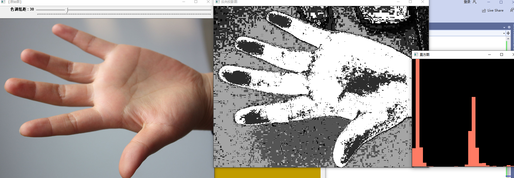

### 模板匹配

```C++
 void matchTemplate(InputArray image, InputArray templ, OutputArray result, int method);
void cvMatchTemplate(const CvArr* image, const CvArr* templ, CvArr* result, int method);
```
方法：

运行结果代码：
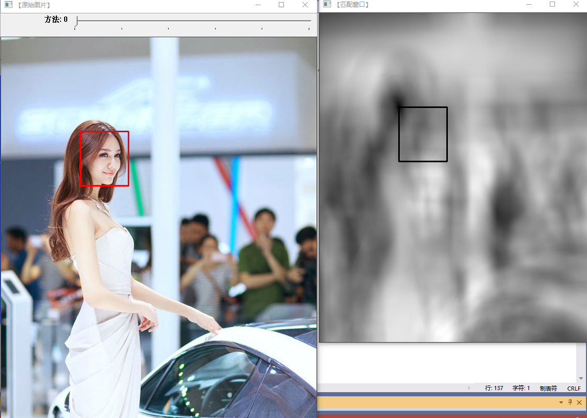
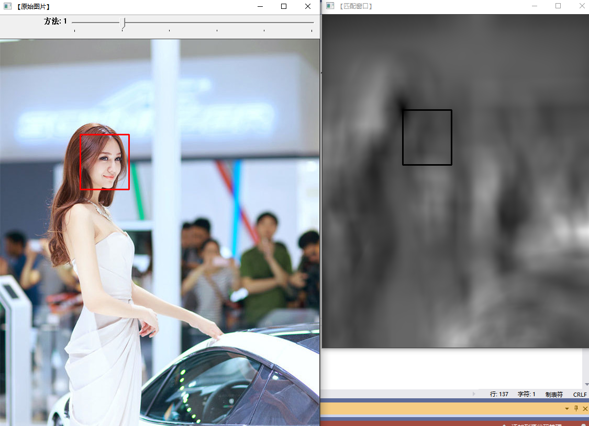
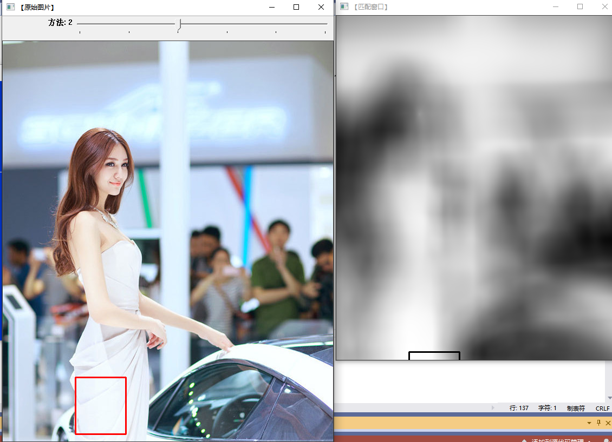
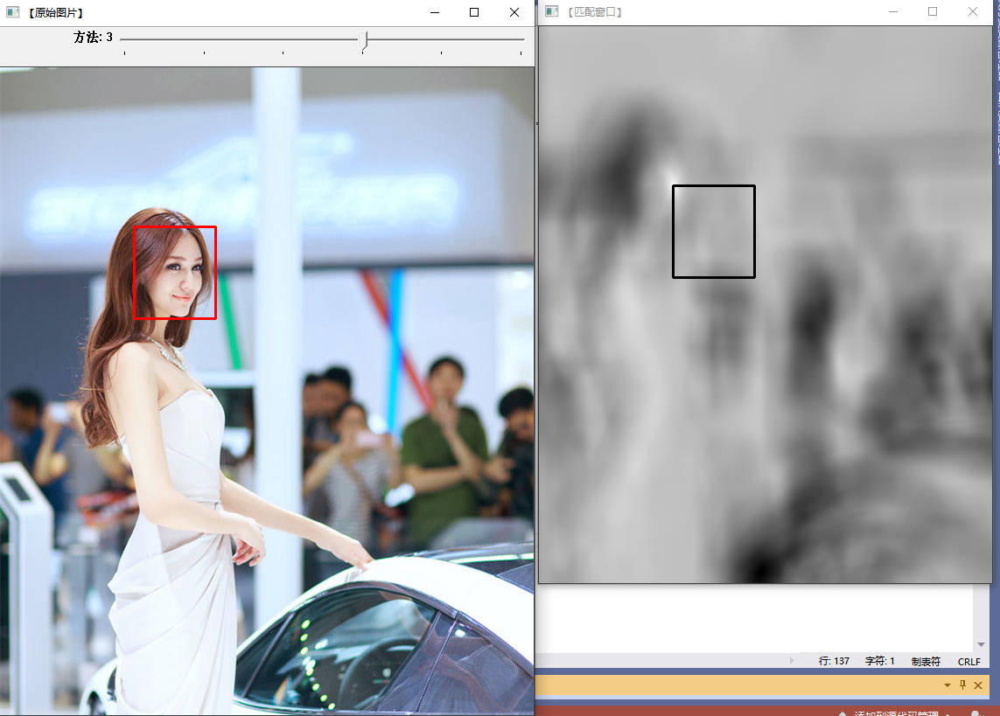
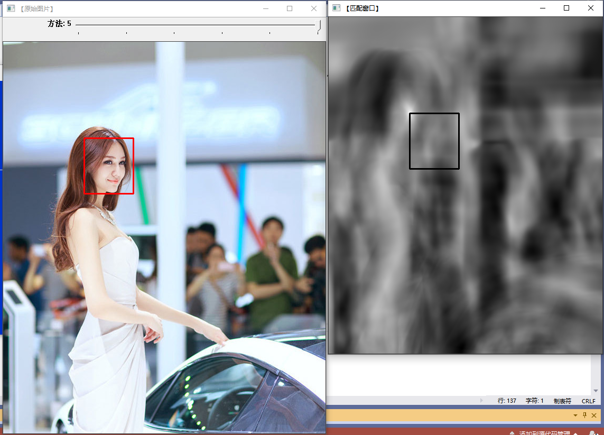

## 总结
我学习了很多的图像处理方法，例如线性滤波（方框滤波，均值滤波，高斯滤波），非线性滤波（中值滤波，双边滤波），边缘检测（canny，sobel，laplace算子和scharr滤波器），掌握了霍夫变换，元变换，重映射，仿射变换寻找和绘制轮廓，凸包，图像的矩，分水岭算法和图像修补，还有很多函数应用和用法

## 心得
对边缘检测和漫水填充，霍夫变换，分水岭算法，图像修补影响深刻，并且理解他的概念和用法。学习了解一整个图像处理的流程和原理，和要注意的点，首先边缘检测或者线性非线性滤波，原图变成灰度图，然后在进行处理，提取出图像的特征进行处理。