# 方框滤波：boxFilter函数的使用
## 笔记
函数原型：

1.第一个参数，InputArray类型的src，输入图像，即源图像，填Mat类的对象即可。该函数对通道是独立处理的，且可以处理任意通道数的图片，但需要注意，待处理的图片深度应该为CV_8U, CV_16U, CV_16S, CV_32F 以及 CV_64F之一。

2.第二个参数，OutputArray类型的dst，即目标图像，需要和源图片有一样的尺寸和类型。

3.第三个参数，int类型的ddepth，输出图像的深度，-1代表使用原图深度，即src.depth()。

4.第四个参数，Size类型的ksize，内核的大小。一般这样写Size( w,h )来表示内核的大小( 其中，w 为像素宽度， h为像素高度)。Size（3,3）就表示3x3的核大小，Size（5,5）就表示5x5的核大小

5.第五个参数，Point类型的anchor，表示锚点（即被平滑的那个点），注意他有默认值Point(-1,-1)。如果这个点坐标是负值的话，就表示取核的中心为锚点，所以默认值Point(-1,-1)表示这个锚点在核的中心。

6.第六个参数，bool类型的normalize，默认值为true，一个标识符，表示内核是否被其区域归一化（normalized）了。

7.第七个参数，int类型的borderType，用于推断图像外部像素的某种边界模式。有默认值BORDER_DEFAULT，我们一般不去管它。

## 运行截图

# 均值滤波：blur函数的使用
## 笔记
blur的作用是对输入的图像src进行均值滤波后用dst输出。

参数详解如下：

1.第一个参数，InputArray类型的src，输入图像，即源图像，填Mat类的对象即可。该函数对通道是独立处理的，且可以处理任意通道数的图片，但需要注意，待处理的图片深度应该为CV_8U, CV_16U, CV_16S, CV_32F 以及 CV_64F之一。

2.第二个参数，OutputArray类型的dst，即目标图像，需要和源图片有一样的尺寸和类型。比如可以用Mat::Clone，以源图片为模板，来初始化得到如假包换的目标图。

3.第三个参数，Size类型（对Size类型稍后有讲解）的ksize，内核的大小。一般这样写Size( w,h )来表示内核的大小( 其中，w 为像素宽度， h为像素高度)。Size（3,3）就表示3x3的核大小，Size（5,5）就表示5x5的核大小
第四个参数，Point类型的anchor，表示锚点（即被平滑的那个点），注意他有默认值Point(-1,-1)。如果这个点坐标是负值的话，就表示取核的中心为锚点，所以默认值Point(-1,-1)表示这个锚点在核的中心。
第五个参数，int类型的borderType，用于推断图像外部像素的某种边界模式。有默认值BORDER_DEFAULT，我们一般不去管它。

## 运行截图

# 高斯滤波：GaussianBlur函数的使用
## 笔记
函数原型如下：

参数详解如下：

1.第一个参数，InputArray类型的src，输入图像，即源图像，填Mat类的对象即可。它可以是单独的任意通道数的图片，但需要注意，图片深度应该为CV_8U,CV_16U, CV_16S, CV_32F 以及 CV_64F之一。

2.第二个参数，OutputArray类型的dst，即目标图像，需要和源图片有一样的尺寸和类型。比如可以用Mat::Clone，以源图片为模板，来初始化得到如假包换的目标图。

3.第三个参数，Size类型的ksize高斯内核的大小。其中ksize.width和ksize.height可以不同，但他们都必须为正数和奇数。或者，它们可以是零的，它们都是由sigma计算而来。

4.第四个参数，double类型的sigmaX，表示高斯核函数在X方向的的标准偏差。

5.第五个参数，double类型的sigmaY，表示高斯核函数在Y方向的的标准偏差。若sigmaY为零，就将它设为sigmaX，如果sigmaX和sigmaY都是0，那么就由ksize.width和ksize.height计算出来。为了结果的正确性着想，最好是把第三个参数Size，第四个参数sigmaX和第五个参数sigmaY全部指定到。

6.第六个参数，int类型的borderType，用于推断图像外部像素的某种边界模式。注意它有默认值BORDER_DEFAULT。

## 运行结果

# 综合示例：图像线性滤波
## 运行结果

# 中值滤波：medianBlur函数的使用
## 笔记
函数原型：
<strong>C++: void medianBlur(InputArray src, OutputArray dst, int ksize)</strong>

 参数详解：

1.第一个参数，InputArray类型的src，函数的输入参数，填1、3或者4通道的Mat类型的图像；当ksize为3或者5的时候，图像深度需为CV_8U，CV_16U，或CV_32F其中之一，而对于较大孔径尺寸的图片，它只能是CV_8U。

2.第二个参数，OutputArray类型的dst，即目标图像，函数的输出参数，需要和源图片有一样的尺寸和类型。我们可以用Mat::Clone，以源图片为模板，来初始化得到如假包换的目标图。

3.第三个参数，int类型的ksize，孔径的线性尺寸（aperture linear size），注意这个参数必须是大于1的奇数，比如：3，5，7，9 ...

4.中值滤波（Median filter）是一种典型的非线性滤波技术，基本思想是用像素点邻域灰度值的中值来代替该像素点的灰度值，该方法在去除脉冲噪声、椒盐噪声的同时又能保留图像边缘细节。

5.中值滤波是基于排序统计理论的一种能有效抑制噪声的非线性信号处理技术，其基本原理是把数字图像或数字序列中一点的值用该点的一个邻域中各点值的中值代替，让周围的像素值接近的真实值，从而消除孤立的噪声点，对于斑点噪声（speckle noise）和椒盐噪声（salt-and-pepper noise）来说尤其有用，因为它不依赖于邻域内那些与典型值差别很大的值。中值滤波器在处理连续图像窗函数时与线性滤波器的工作方式类似，但滤波过程却不再是加权运算。

## 运行结果

# 双边滤波：bilateralFilter函数的使用
## 笔记
函数原型：
C++: void bilateralFilter(InputArray src, OutputArraydst, int d, double sigmaColor, double sigmaSpace, int borderType=BORDER_DEFAULT)  

1.第一个参数：InputArray类型的src，输入图像，即源图像，需要为8位或者浮点型单通道、三通道的图像。

2.第二个参数：OutputArray类型的dst，即目标图像，需要和源图片有一样的尺寸和类型。

3.第三个参数：int类型的d，表示在过滤过程中每个像素邻域的直径。如果这个值我们设其为非正数，那么OpenCV会从第五个参数sigmaSpace来计算出它来。

4.第四个参数：double类型的sigmaColor，颜色空间滤波器的sigma值。这个参数的值越大，就表明该像素邻域内有更宽广的颜色会被混合到一起，产生较大的半相等颜色区域。

5.第五个参数：double类型的sigmaSpace坐标空间中滤波器的sigma值，坐标空间的标注方差。他的数值越大，意味着越远的像素会相互影响，从而使更大的区域足够相似的颜色获取相同的颜色。当d>0，d指定了邻域大小且与sigmaSpace无关。否则，d正比于sigmaSpace。

6.第六个参数：int类型的borderType，用于推断图像外部像素的某种边界模式。注意它有默认值BORDER_DEFAULT。

## 运行结果

# 综合示例：图像滤波

## 运行结果

# 膨胀：dilate函数的使用
## 笔记
dilate函数使用像素邻域内的局部极大运算符来膨胀一张图片，从src输入，由dst输出。支持就地( in-place）操作。

函数原型

参数详解如下。
1.第一个参数，InputArray类型的src，输入图像，即源图像，填Mat类的对象即可。图像通道的数量可以是任意的,但图像深度应为CV_8u.cv_16U、cV_16S、cV_32F或CV_64F其中之一。

2.第二个参数，OutputArray类型的dst，即目标图像，需要和源图片有一样的尺寸和类型。

3.第三个参数，InputArray类型的kernel，膨胀操作的核。当为NULL时，表示的是使用参考点位于中心3×3的核。

我们一般使用函数getStructuringElement配合这个参数的使用。getStructuringElement函数会返回指定形状和尺寸的结构元素（内核矩阵)。其中，getStructuringElement 函数的第一个参数表示内核的形状，有如下三种形状可以选择。

矩形:MORPH_RECT;

交叉形:MORPH_CROSs;

椭圆形: MORPH_ELLIPSE。

而getStructuringElement函数的第二和第三个参数分别是内核的尺寸以及锚点的位置。

一般在调用erode 以及 dilate函数之前，先定义一个 Mat类型的变量来获得getStructuringElement 函数的返回值。对于锚点的位置，有默认值Point(-1,-1)，表示锚点位于中心。此外，需要注意，十字形的 element形状唯一依赖于锚点的位置，而在其他情况下，锚点只是影响了形态学运算结果的偏移。

getStructuringElement函数相关的调用示例代码如下。

调用之后，我们可以在接下来调用erode或dilate函数时，在第三个参数填保存了getStructuringElement返回值的Mat类型变量。对应于上面的示例，就是element变量。

4.第四个参数，Point类型的 anchor，锚的位置，其有默认值(-1,-1)，表示锚位于中心。

5.第五个参数，int类型的 iterations，迭代使用erode()函数的次数，默认值为1。

6.第六个参数，int类型的 borderType，用于推断图像外部像素的某种边界模式。注意它有默认值BORDER_DEFAULT。

7·第七个参数，const Scalar&类型的 borderValue，当边界为常数时的边界值，有默认值morphologyDefaultBorderValue()，一般不用去管它。需要用到它时，可以看官方文档中的createMorphologyFilter()函数，以得到更详细的解释。

使用erode 函数，一般只需要填前面的三个参数，后面的四个参数都有默认值，而且往往会结合getStructuringElement一起使用。

## 运行结果

# 腐蚀：erode函数的使用
## 笔记
erode函数使用像素邻域内的局部极小运算符来腐蚀一张图片，从 src输入，由dst输出。支持就地（ in-place）操作。

函数原型

1.第一个参数，InputArray类型的src，输入图像，即源图像，填Mat类的对象即可。图像通道的数量可以是任意的,但图像深度应为CV_8U.CV_16U、cV_16S、cV_32F或cV_64F其中之一。

2·第二个参数，OutputArray类型的dst，即目标图像，需要和源图片有一样的尺寸和类型。

3·第三个参数，InputArray类型的kernel，腐蚀操作的内核。为NULL时，表示的是使用参考点位于中心3x3的核。一般使用函数getStructuringElement配合这个参数的使用。getStructuringElement函数会返回指定形状和尺寸的结构元素（内核矩阵，具体看上文中dilate函数的第三个参数讲解部分。

4·第四个参数，Point类型的anchor，错的位置。其有默认值(-1,-1)，表示错位于单位(element）的中心，一般不用管它。

5·第五个参数，int类型的 iterations，迭代使用erode()函数的次数，默认值为1。

6·第六个参数，int类型的 borderType，用于推断图像外部像素的某种边界模式。注意它有默认值 BORDER_DEFAULT。

7·第七个参数，const Scalar&类型的 borderValue，当边界为常数时的边界值，有默认值 morphologyDefaultBorderValue()，一般不用去管它。需要用到它时，可以看官方文档中的createMorphologyFilter()函数以得到更详细的解释。

同样的，使用erode 函数，一般只需要填前面的三个参数，后面的四个参数都有默认值。而且往往结合getStructuringElement一起使用。

## 运行结果

# 综合示例：腐蚀与膨胀

## 运行结果

# morphologyEX()函数
## 笔记
函数.png)
1.第一个参数，InputArray类型的src，输入图像，即源图像，填Mat类的对象即可。图像位深应该为以下五种之一：CV_8U, CV_16U,CV_16S, CV_32F 或CV_64F。

2.第二个参数，OutputArray类型的dst，即目标图像，函数的输出参数，需要和源图片有一样的尺寸和类型。

3.第三个参数，int类型的op，表示形态学运算的类型，可以是如下之一的标识符：

 MORPH_OPEN – 开运算（Opening operation）
 MORPH_CLOSE – 闭运算（Closing operation）
 MORPH_GRADIENT -形态学梯度（Morphological gradient）
 MORPH_TOPHAT - “顶帽”（“Top hat”）
 MORPH_BLACKHAT - “黑帽”（“Black hat“）

4.第四个参数，InputArray类型的kernel，形态学运算的内核。若为NULL时，表示的是使用参考点位于中心3x3的核。我们一般使用函数 getStructuringElement配合这个参数的使用。getStructuringElement函数会返回指定形状和尺寸的结构元素（内核矩阵）

其中，getStructuringElement函数的第一个参数表示内核的形状，我们可以选择如下三种形状之一:

矩形: MORPH_RECT

交叉形: MORPH_CROSS

椭圆形: MORPH_ELLIPSE

而getStructuringElement函数的第二和第三个参数分别是内核的尺寸以及锚点的位置。

我们一般在调用erode以及dilate函数之前，先定义一个Mat类型的变量来获得getStructuringElement函数的返回值。对于锚点的位置，有默认值Point(-1,-1)，表示锚点位于中心。且需要注意，十字形的element形状唯一依赖于锚点的位置。而在其他情况下，锚点只是影响了形态学运算结果的偏移。

5.第五个参数，Point类型的anchor，锚的位置，其有默认值（-1，-1），表示锚位于中心。
            
6.第六个参数，int类型的iterations，迭代使用函数的次数，默认值为1。

7.第七个参数，int类型的borderType，用于推断图像外部像素的某种边界模式。注意它有默认值BORDER_ CONSTANT。

8.第八个参数，const Scalar&类型的borderValue，当边界为常数时的边界值，有默认值morphologyDefaultBorderValue()，一般我们不用去管他。需要用到它时，可以看官方文档中的createMorphologyFilter()函数得到更详细的解释。

## 用morphologyEX()函数实现形态学膨胀
### 笔记
膨胀：用结构元素的中心点对准当前正在遍历的这个像素，
然后取当前结构元素所覆盖下的原图对应区域内的所有像素的最大值，用这个最大值替换当前像素值，给图像中的对象边界添加像素，使二值图像扩大一圈
1. 用结构元素，扫描图像的每一个像素
2. 用结构元素与其覆盖的二值图像做“与”操作
3. 如果都为0，结果图像的该像素为0。否则为1
也就是在结构元素覆盖范围下，只要有一个像素符和结构元素像素相同，那么中心点对应点就为1，否则为0

### 运行结果

## 用morphologyEX()函数实现形态学腐蚀
### 笔记
腐蚀：用结构元素的中心点对准当前正在遍历的这个像素，
然后取当前结构元素所覆盖下的原图对应区域内的所有像素的最小值，用这个最小值替换当前像素值，删除对象边界的某些像素，使二值图像减小一圈
1. 用结构元素，扫描图像的每一个像素
2. 用结构元素与其覆盖的二值图像做“与”操作
3. 如果都为1，结果图像的该像素为1。否则为0
也就是查找被处理图像中能不能找到和结构元素相同的矩阵。如果存在那么中心点所对应的点就为1，否则为0

### 运行结果

## 用morphologyEX()函数实现形态学开运算
### 笔记
开运算：先腐蚀，再膨胀，可清除一些小东西(亮的)，放大局部低亮度的区域 

### 运行结果

## 用morphologyEX()函数实现形态学闭运算
### 笔记
闭运算：先膨胀，再腐蚀，可清除小黑点 

### 运行结果

## 用morphologyEX()函数实现形态学梯度
### 笔记
形态学梯度：膨胀图与腐蚀图之差，提取物体边缘 
### 运行结果

## 用morphologyEX()函数实现形态学“顶帽”
### 笔记
顶帽：原图像-开运算图，突出原图像中比周围亮的区域 
### 运行结果

## 用morphologyEX()函数实现形态学“黑帽”
### 笔记
黑帽：闭运算图-原图像，突出原图像中比周围暗的区域
### 运行结果

## 注：这些代码基本上内容一致，就是改一下morphologyEx里面的第三个标识符参数。核都是选的MORPH_RECT（矩形元素结构)。

# 综合示例：形态学滤波

## 运行结果
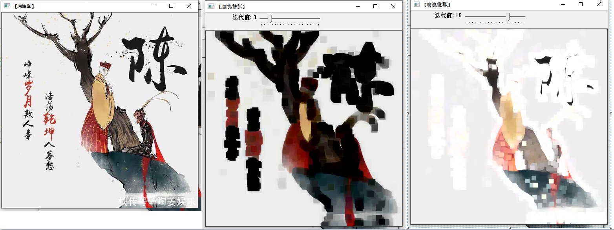

# 漫水填充算法：floodFill函数
## 笔记
在OpenCV中，漫水填充算法由floodFill函数实现，其作用是用我们指定的颜色从种子点开始填充一个连接域。连通性由像素值的接近程度来衡量。OpenCV2.X有两个C++重写版本的floodFill。
第一个版本的floodFill：

第二个版本的floodFill

下面是一起介绍的参数详解。除了第二个参数外，其他的参数都是共用的。

第一个参数，InputOutputArray类型的image, 输入/输出1通道或3通道，8位或浮点图像，具体参数由之后的参数具体指明。

第二个参数， InputOutputArray类型的mask，这是第二个版本的floodFill独享的参数，表示操作掩模,。它应该为单通道、8位、长和宽上都比输入图像 image 大两个像素点的图像。第二个版本的floodFill需要使用以及更新掩膜，所以这个mask参数我们一定要将其准备好并填在此处。需要注意的是，漫水填充不会填充掩膜mask的非零像素区域。例如，一个边缘检测算子的输出可以用来作为掩膜，以防止填充到边缘。同样的，也可以在多次的函数调用中使用同一个掩膜，以保证填充的区域不会重叠。另外需要注意的是，掩膜mask会比需填充的图像大，所以 mask 中与输入图像(x,y)像素点相对应的点的坐标为(x+1,y+1)。

第三个参数，Point类型的seedPoint，漫水填充算法的起始点。

第四个参数，Scalar类型的newVal，像素点被染色的值，即在重绘区域像素的新值。

第五个参数，Rect*类型的rect，有默认值0，一个可选的参数，用于设置floodFill函数将要重绘区域的最小边界矩形区域。

第六个参数，Scalar类型的loDiff，有默认值Scalar( )，表示当前观察像素值与其部件邻域像素值或者待加入该部件的种子像素之间的亮度或颜色之负差（lower brightness/color difference）的最大值。

第七个参数，Scalar类型的upDiff，有默认值Scalar( )，表示当前观察像素值与其部件邻域像素值或者待加入该部件的种子像素之间的亮度或颜色之正差（lower brightness/color difference）的最大值。

第八个参数，int类型的flags，操作标志符，此参数包含三个部分，比较复杂，我们一起详细看看。

•低八位（第0~7位）用于控制算法的连通性，可取4 (4为缺省值) 或者 8。如果设为4，表示填充算法只考虑当前像素水平方向和垂直方向的相邻点；如果设为 8，除上述相邻点外，还会包含对角线方向的相邻点。

•高八位部分（16~23位）可以为0 或者如下两种选项标识符的组合：
FLOODFILL_FIXED_RANGE - 如果设置为这个标识符的话，就会考虑当前像素与种子像素之间的差，否则就考虑当前像素与其相邻像素的差。也就是说，这个范围是浮动的。
FLOODFILL_MASK_ONLY - 如果设置为这个标识符的话，函数不会去填充改变原始图像 (也就是忽略第三个参数newVal), 而是去填充掩模图像（mask）。这个标识符只对第二个版本的floodFill有用，因第一个版本里面压根就没有mask参数。

•中间八位部分，上面关于高八位FLOODFILL_MASK_ONLY标识符中已经说的很明显，需要输入符合要求的掩码。Floodfill的flags参数的中间八位的值就是用于指定填充掩码图像的值的。但如果flags中间八位的值为0，则掩码会用1来填充。

而所有flags可以用or操作符连接起来，即“|”。例如，如果想用8邻域填充，并填充固定像素值范围，填充掩码而不是填充源图像，以及设填充值为38，那么输入的参数是这样：
flags=8 | FLOODFILL_MASK_ONLY | FLOODFILL_FIXED_RANGE | （38<<8） 

## 运行结果

 # 综合示例：漫水填充

 ## 运行结果
 

 # 尺寸调整：resize（）函数的使用
 ## 笔记
 esize( )为OpenCV中专职调整图像大小的函数。此函数将源图像精确地转换为指定尺寸的目标图像。如果源图像中设置了ROI（Region Of Interest ，感兴趣区域），那么resize( )函数会对源图像的ROI区域进行调整图像尺寸的操作，来输出到目标图像中。若目标图像中已经设置ROI区域，不难理解resize( )将会对源图像进行尺寸调整并填充到目标图像的ROI中。很多时候，我们并不用考虑第二个参数dst的初始图像尺寸和类型（即直接定义一个Mat类型，不用对其初始化），因为其尺寸和类型可以由src,dsize,fx和fy这几个参数来确定。\

 函数原型
 
第一个参数，InputArray类型的src，输入图像，即源图像，填Mat类的对象即可。

第二个参数，OutputArray类型的dst，输出图像，当其非零时，有着dsize（第三个参数）的尺寸，或者由src.size()计算出来。

第三个参数，Size类型的dsize，输出图像的大小;如果它等于零，由下式进行计算：
其中，dsize，fx，fy都不能为0。

第四个参数，double类型的fx，沿水平轴的缩放系数，有默认值0，且当其等于0时，由下式进行计算：

第五个参数，double类型的fy，沿垂直轴的缩放系数，有默认值0，且当其等于0时，由下式进行计算：

第六个参数，int类型的interpolation，用于指定插值方式，默认为INTER_LINEAR（线性插值）。
可选的插值方式如下：

INTER_NEAREST - 最近邻插值

INTER_LINEAR - 线性插值（默认值）

INTER_AREA - 区域插值（利用像素区域关系的重采样插值）

INTER_CUBIC –三次样条插值（超过4×4像素邻域内的双三次插值）

INTER_LANCZOS4 -Lanczos插值（超过8×8像素邻域的Lanczos插值）

若要缩小图像，一般情况下最好用CV_INTER_AREA来插值，而若要放大图像，一般情况下最好用CV_INTER_CUBIC（效率不高，慢，不推荐使用）或CV_INTER_LINEAR（效率较高，速度较快，推荐使用）。 

## 运行结果

# 向上采样图像金字塔：pyrUp()函数的使用
## 笔记
函数原型

第一个参数，InputArray类型的src，输入图像，即源图像，填Mat类的对象即可。

第二个参数，OutputArray类型的dst，输出图像，和源图片有一样的尺寸和类型。

第三个参数，const Size&类型的dstsize，输出图像的大小;有默认值Size()，即默认情况下，由Size（src.cols*2，src.rows*2）来进行计算，且一直需要满足下列条件：

第四个参数，int类型的borderType，又来了，边界模式，一般我们不用去管它。
pyrUp函数执行高斯金字塔的采样操作，其实它也可以用于拉普拉斯金字塔的。首先，它通过插入可为零的行与列，对源图像进行向上取样操作，然后将结果与pyrDown（）乘以4的内核做卷积，就是这样。直接看完整的示例程序。 

## 运行结果

# 向上采样图像金字塔：pyrDown()函数的使用

## 笔记
函数原型

第一个参数，InputArray类型的src，输入图像，即源图像，填Mat类的对象即可。
第二个参数，OutputArray类型的dst，输出图像，和源图片有一样的尺寸和类型。
第三个参数，const Size&类型的dstsize，输出图像的大小;有默认值Size()，即默认情况下，由Size Size((src.cols+1)/2, (src.rows+1)/2)来进行计算，且一直需要满足下列条件：

该pyrDown函数执行了高斯金字塔建造的向下采样的步骤。首先，它将源图像与如下内核做卷积运算：

接着，它便通过对图像的偶数行和列做插值来进行向下采样操作。依然是看看完整的示例程序。 

## 运行结果

# 综合示例:图像金字塔与图片尺寸缩放

## 运行结果
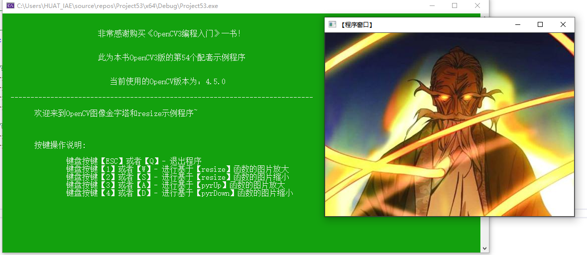

# 示例程序:基本阀值操作
## 运行结果
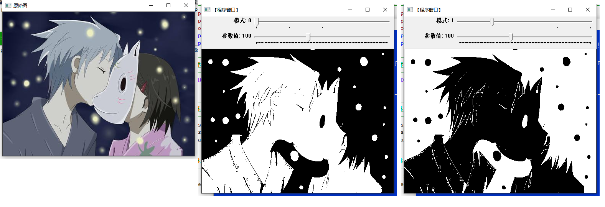
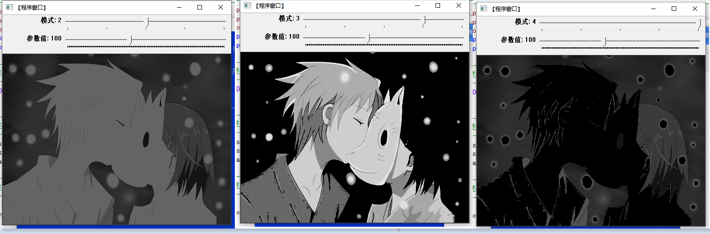

# Canny边缘检测
## 笔记
    Canny边缘检测算子是John F. Canny于1986年开发出来的一个多级边缘检测算法。更为重要的是Canny创立了“边缘检测计算理论”（computational theory of edge detection）解释这项技术如何工作。
    Canny的目标是找到一个最优的边缘检测算法，最优边缘检测的含义是：

    好的检测 - 算法能够尽可能多地标识出图像中的实际边缘。
    好的定位 - 标识出的边缘要与实际图像中的实际边缘尽可能接近。
    最小响应 - 图像中的边缘只能标识一次，并且可能存在的图像雜訊不应标识为边缘。

    为了满足这些要求Canny使用了变分法，这是一种寻找满足特定功能的函数的方法。最优检测使用四个指数函数项的和表示，但是它非常近似于高斯函数的一阶导数。

    Canny(InputArray image,OutputArray edges, double threshold1, double threshold2, int apertureSize=3,bool L2gradient=false )
    第一个参数，InputArray类型的image，输入图像，即源图像，填Mat类的对象即可，且需为单通道8位图像。
    第二个参数，OutputArray类型的edges，输出的边缘图，需要和源图片有一样的尺寸和类型。
    第三个参数，double类型的threshold1，第一个滞后性阈值。
    第四个参数，double类型的threshold2，第二个滞后性阈值。
    第五个参数，int类型的apertureSize，表示应用Sobel算子的孔径大小，其有默认值3。
    第六个参数，bool类型的L2gradient，一个计算图像梯度幅值的标识，有默认值false。
    注：这个函数阈值1和阈值2两者的小者用于边缘连接，而大者用来控制强边缘的初始段，推荐的高低阈值比在2:1到3:1之间。 
## 运行结果
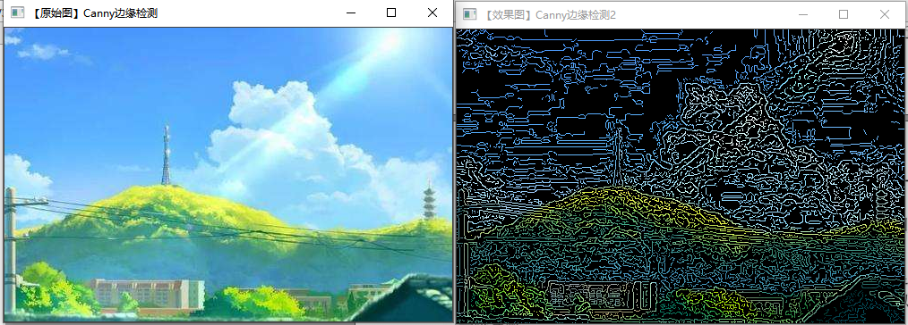

# Sobel算子的使用
## 笔记
### sobel算子的基本概念

Sobel算子是一个主要用于边缘检测的离散微分算子(discrete differentiation operator)。它结合了高斯平滑和微分求导，用来计算图像灰度函数的近似梯度。在图像的任何一点使用此算子，都将会产生对应的梯度矢量或是其法矢量。

### Sobel算子函数

    第一个参数，InputArray 类型的src，为输入图像，填Mat类型即可。
    第二个参数，OutputArray类型的dst，即目标图像，函数的输出参数，需要和源图片有一样的尺寸和类型。
    第三个参数，int类型的ddepth，输出图像的深度，支持如下src.depth()和ddepth的组合：
        若src.depth() = CV_8U, 取ddepth =-1/CV_16S/CV_32F/CV_64F
        若src.depth() = CV_16U/CV_16S, 取ddepth =-1/CV_32F/CV_64F
        若src.depth() = CV_32F, 取ddepth =-1/CV_32F/CV_64F
        若src.depth() = CV_64F, 取ddepth = -1/CV_64F
    第四个参数，int类型dx，x 方向上的差分阶数。
    第五个参数，int类型dy，y方向上的差分阶数。
    第六个参数，int类型ksize，有默认值3，表示Sobel核的大小;必须取1，3，5或7。
    第七个参数，double类型的scale，计算导数值时可选的缩放因子，默认值是1，表示默认情况下是没有应用缩放的。
    我们可以在文档中查阅getDerivKernels的相关介绍，来得到这个参数的更多信息。
    第八个参数，double类型的delta，表示在结果存入目标图（第二个参数dst）之前可选的delta值，有默认值0。
    第九个参数， int类型的borderType，我们的老朋友了（万年是最后一个参数），边界模式，默认值为BORDER_DEFAULT。这个参数可以在官方文档中borderInterpolate处得到更详细的信息。 

## 运行结果

# Laplacian算子的使用

## 笔记

    第一个参数，InputArray类型的image，输入图像，即源图像，填Mat类的对象即可，且需为单通道8位图像。
    第二个参数，OutputArray类型的edges，输出的边缘图，需要和源图片有一样的尺寸和通道数。    
    第三个参数，int类型的ddept，目标图像的深度。、   
    第四个参数，int类型的ksize，用于计算二阶导数的滤波器的孔径尺寸，大小必须为正奇数，且有默认值1。 
    第五个参数，double类型的scale，计算拉普拉斯值的时候可选的比例因子，有默认值1。   
    第六个参数，double类型的delta，表示在结果存入目标图（第二个参数dst）之前可选的delta值，有默认值  0。   
    第七个参数， int类型的borderType，边界模式，默认值为BORDER_DEFAULT。这个参数可以在官方文档中borderInterpolate()处得到更详细的信息。
# 运行结果
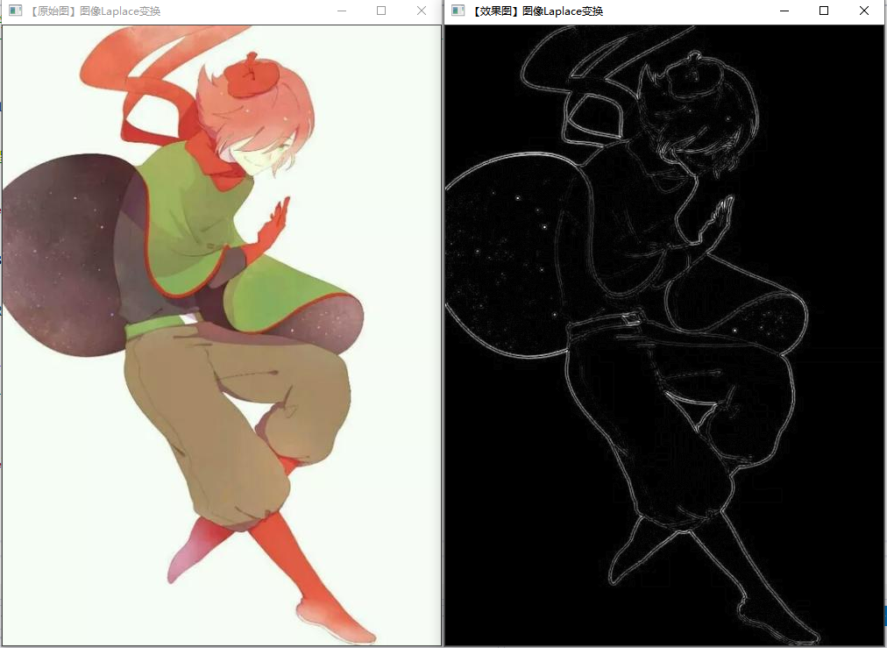

# Scharr滤波器
## 笔记

    第一个参数，InputArray 类型的src，为输入图像，填Mat类型即可。
    第二个参数，OutputArray类型的dst，即目标图像，函数的输出参数，需要和源图片有一样的尺寸和类型。
    第三个参数，int类型的ddepth，输出图像的深度，支持如下src.depth()和ddepth的组合：
            若src.depth() = CV_8U, 取ddepth =-1/CV_16S/CV_32F/CV_64F
            若src.depth() = CV_16U/CV_16S, 取ddepth =-1/CV_32F/CV_64F
            若src.depth() = CV_32F, 取ddepth =-1/CV_32F/CV_64F
            若src.depth() = CV_64F, 取ddepth = -1/CV_64F
    第四个参数，int类型dx，x方向上的差分阶数。
    第五个参数，int类型dy，y方向上的差分阶数。
    第六个参数，double类型的scale，计算导数值时可选的缩放因子，默认值是1，表示默认情况下是没有应用缩放的。我们可以在文档中查阅getDerivKernels的相关介绍，来得到这个参数的更多信息。
    第七个参数，double类型的delta，表示在结果存入目标图（第二个参数dst）之前可选的delta值，有默认值0。
    第八个参数， int类型的borderType，边界模式，默认值为BORDER_DEFAULT。
# 运行结果

# 综合示例：边缘检测
## 运行结果

# 标准霍夫变换:HoughLines()函数的使用
## 笔记
    C++: void HoughLines(InputArray image, OutputArray lines, double rho, double theta, int threshold, double srn=0, double stn=0 )  
    第一个参数，InputArray类型的image，输入图像，即源图像，需为8位的单通道二进制图像，可以将任意的源图载入进来后由函数修改成此格式后，再填在这里。
    第二个参数，InputArray类型的lines，经过调用HoughLines函数后储存了霍夫线变换检测到线条的输出矢量。每一条线由具有两个元素的矢量表示，其中，是离坐标原点((0,0)（也就是图像的左上角）的距离。 是弧度线条旋转角度（0~垂直线，π/2~水平线）。
    第三个参数，double类型的rho，以像素为单位的距离精度。另一种形容方式是直线搜索时的进步尺寸的单位半径。PS:Latex中/rho就表示 。
    第四个参数，double类型的theta，以弧度为单位的角度精度。另一种形容方式是直线搜索时的进步尺寸的单位角度。
    第五个参数，int类型的threshold，累加平面的阈值参数，即识别某部分为图中的一条直线时它在累加平面中必须达到的值。大于阈值threshold的线段才可以被检测通过并返回到结果中。
    第六个参数，double类型的srn，有默认值0。对于多尺度的霍夫变换，这是第三个参数进步尺寸rho的除数距离。粗略的累加器进步尺寸直接是第三个参数rho，而精确的累加器进步尺寸为rho/srn。
    第七个参数，double类型的stn，有默认值0，对于多尺度霍夫变换，srn表示第四个参数进步尺寸的单位角度theta的除数距离。且如果srn和stn同时为0，就表示使用经典的霍夫变换。否则，这两个参数应该都为正数。
## 运行结果

# 累计概率霍夫变换:HoughLinesP()函数
## 笔记
    C++: void HoughLinesP(InputArray image, OutputArray lines, double rho, double theta, int threshold, double minLineLength=0,double maxLineGap=0 )  
    第一个参数，InputArray类型的image，输入图像，即源图像，需为8位的单通道二进制图像，可以将任意的源图载入进来后由函数修改成此格式后，再填在这里。
    第二个参数，InputArray类型的lines，经过调用HoughLinesP函数后后存储了检测到的线条的输出矢量，每一条线由具有四个元素的矢量(x_1,y_1, x_2, y_2） 表示，其中，(x_1, y_1)和(x_2, y_2) 是是每个检测到的线段的结束点。
    第三个参数，double类型的rho，以像素为单位的距离精度。另一种形容方式是直线搜索时的进步尺寸的单位半径。
    第四个参数，double类型的theta，以弧度为单位的角度精度。另一种形容方式是直线搜索时的进步尺寸的单位角度。
    第五个参数，int类型的threshold，累加平面的阈值参数，即识别某部分为图中的一条直线时它在累加平面中必须达到的值。大于阈值threshold的线段才可以被检测通过并返回到结果中。
    第六个参数，double类型的minLineLength，有默认值0，表示最低线段的长度，比这个设定参数短的线段就不能被显现出来。
    第七个参数，double类型的maxLineGap，有默认值0，允许将同一行点与点之间连接起来的最大的距离。 
## 运行结果
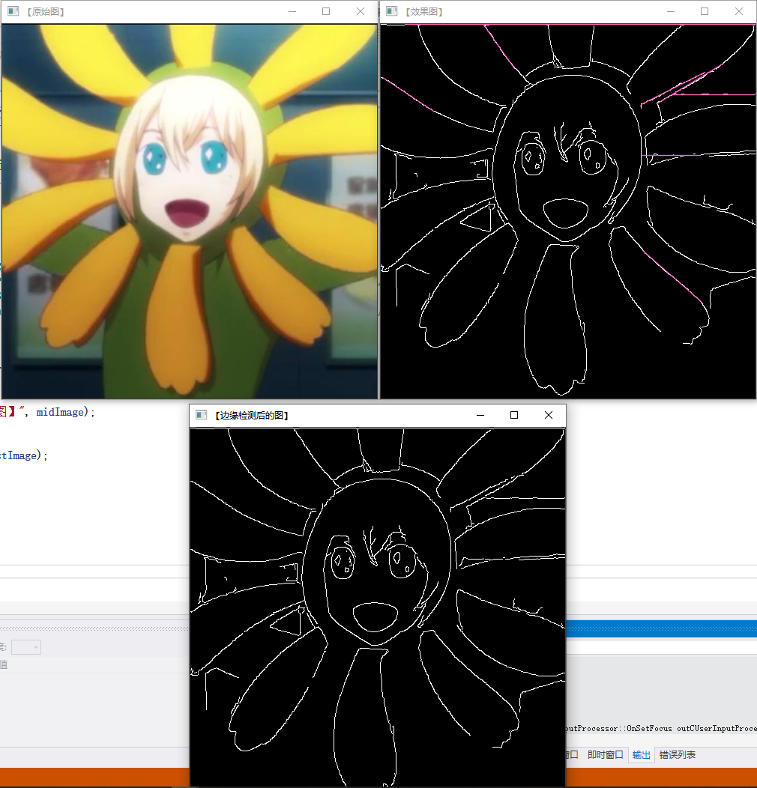
# 霍夫圆变换:HoughCircles()函数
## 笔记
    HoughCircles函数可以利用霍夫变换算法检测出灰度图中的圆。它和之前的HoughLines和HoughLinesP比较明显的一个区别是它不需要源图是二值的，而HoughLines和HoughLinesP都需要源图为二值图像。 
    C++: void HoughCircles(InputArray image,OutputArray circles, int method, double dp,  double minDist, double param1=100,double param2=100, int minRadius=0, int maxRadius=0 )
    第一个参数，InputArray类型的image，输入图像，即源图像，需为8位的灰度单通道图像。
    第二个参数，InputArray类型的circles，经过调用HoughCircles函数后此参数存储了检测到的圆的输出矢量，每个矢量由包含了3个元素的浮点矢量(x, y, radius)表示。
    第三个参数，int类型的method，即使用的检测方法，目前OpenCV中就霍夫梯度法一种可以使用，它的标识符为CV_HOUGH_GRADIENT，在此参数处填这个标识符即可。
    第四个参数，double类型的dp，用来检测圆心的累加器图像的分辨率于输入图像之比的倒数，且此参数允许创建一个比输入图像分辨率低的累加器。上述文字不好理解的话，来看例子吧。例如，如果dp= 1时，累加器和输入图像具有相同的分辨率。如果dp=2，累加器便有输入图像一半那么大的宽度和高度。
    第五个参数，double类型的minDist，为霍夫变换检测到的圆的圆心之间的最小距离，即让我们的算法能明显区分的两个不同圆之间的最小距离。这个参数如果太小的话，多个相邻的圆可能被错误地检测成了一个重合的圆。反之，这个参数设置太大的话，某些圆就不能被检测出来了。
    第六个参数，double类型的param1，有默认值100。它是第三个参数method设置的检测方法的对应的参数。对当前唯一的方法霍夫梯度法CV_HOUGH_GRADIENT，它表示传递给canny边缘检测算子的高阈值，而低阈值为高阈值的一半。
    第七个参数，double类型的param2，也有默认值100。它是第三个参数method设置的检测方法的对应的参数。对当前唯一的方法霍夫梯度法CV_HOUGH_GRADIENT，它表示在检测阶段圆心的累加器阈值。它越小的话，就可以检测到更多根本不存在的圆，而它越大的话，能通过检测的圆就更加接近完美的圆形了。
    第八个参数，int类型的minRadius,有默认值0，表示圆半径的最小值。
    第九个参数，int类型的maxRadius,也有默认值0，表示圆半径的最大值。
    需要注意的是，使用此函数可以很容易地检测出圆的圆心，但是它可能找不到合适的圆半径。我们可以通过第八个参数minRadius和第九个参数maxRadius指定最小和最大的圆半径，来辅助圆检测的效果。或者，我们可以直接忽略返回半径，因为它们都有着默认值0，单单用HoughCircles函数检测出来的圆心，然后用额外的一些步骤来进一步确定半径。  
## 运行结果

# 综合示例：霍夫变换
## 运行结果
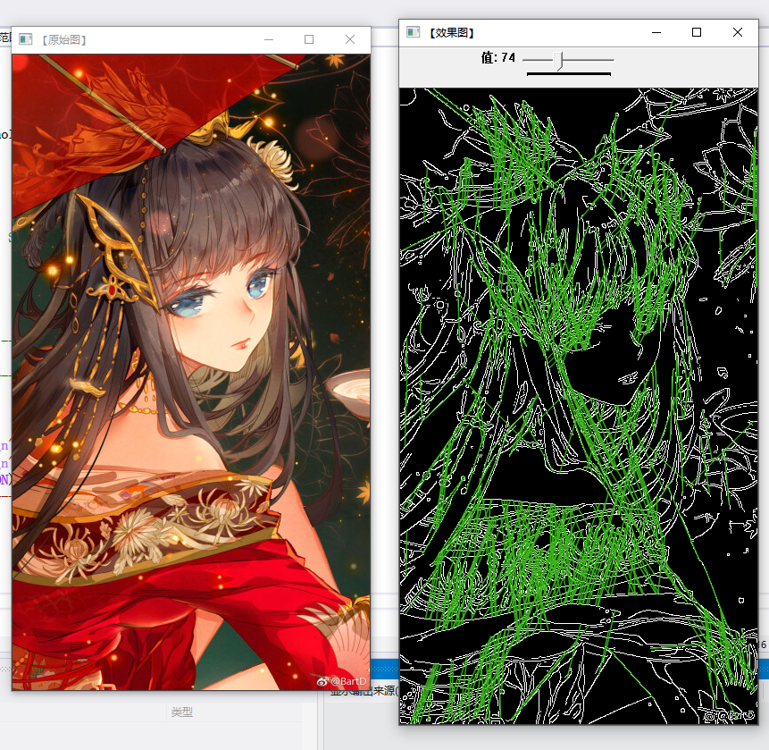

# 实现重映射:remap()函数
## 笔记
    void remap( InputArray src, OutputArray dst, InputArray map1, InputArray map2, int interpolation, int borderMode = BORDER_CONSTANT,const Scalar& borderValue = Scalar() )
    第一个参数，InputArray类型的src，输入图像，填Mat类的对象即可，且需要为单通道8位或者浮点型的图像；
    第二个参数，OutputArray类型的dst，函数调用后的运算结果存在这里，即这个参数用于存放函数调用后的输出结果，需和原图片有一样的尺寸和类型。
    第三个参数，InputArray类型的map1，它有两种可能的表示对象；
          表示点（x, y）的第一个映射；
          表示CV_16S, CV_32FC1或CV_32FC2类型的X值；
    第四个参数，InputArray类型的map2，同样，它有两种可能的表示对象，而且它会根据map1来确定表示那种对象；
          若map1表示点（x, y）时，这个参数不代表任何值；
          表示CV_16UC1，CV_32FC1类型的Y值（第二个值）；
    第五个参数，int类型的interpolation，插值方式，之前的resize()函数中有讲到，需要注意，resize()函数中提到的  INTER_AREA插值方式在这里是不支持的，所以可选的插值方式如下：
          INTER_NEAREST：最近邻插值；
          INTER_LINEAR：双线性插值（默认值）；
          INTER_CUBIC：双三次样条插值（逾4x4像素邻域内的双三次插值）；
          INTER_LANCZOS4：Lanczos插值（逾8x8像素邻域的Lanczos插值）
    第六个参数，int类型的borderMode，边界模式，有默认值BORDER_CONSTANT，表示目标图像中“离群点”的像素不会被此函数修改；
    第七个参数，const Scalar&类型的 borderValue，当有常数边界时使用的值，默认值为0；
## 运行结果
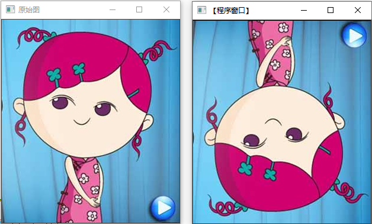

# 综合示例程序:实现多种重映射
## 运行结果
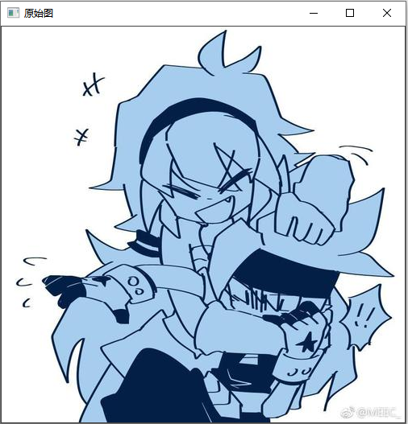
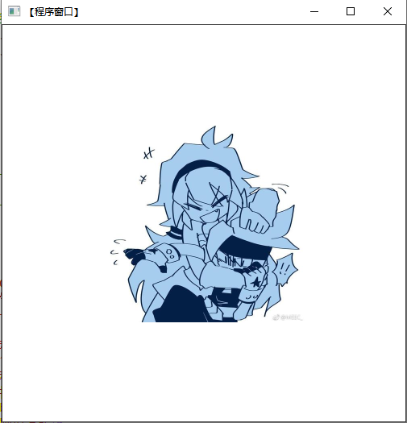

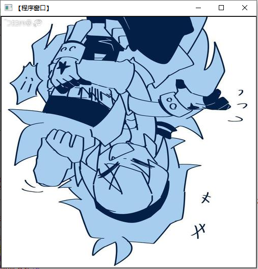

# 仿射变换
## 运行结果

# 直方图均衡化
## 运行结果
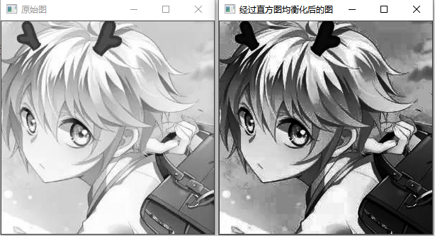

# 轮廓查找
## 运行结果
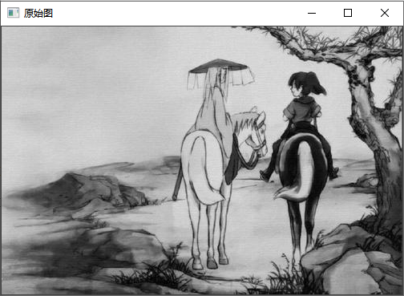

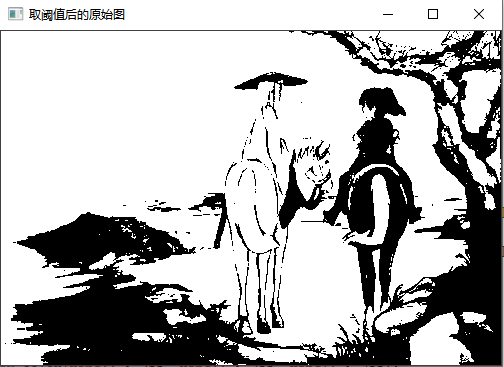

# 查找并绘制轮廓
## 运行结果

# 凸包检测基础
## 运行结果

# 寻找和绘制物体的凸包
## 运行结果
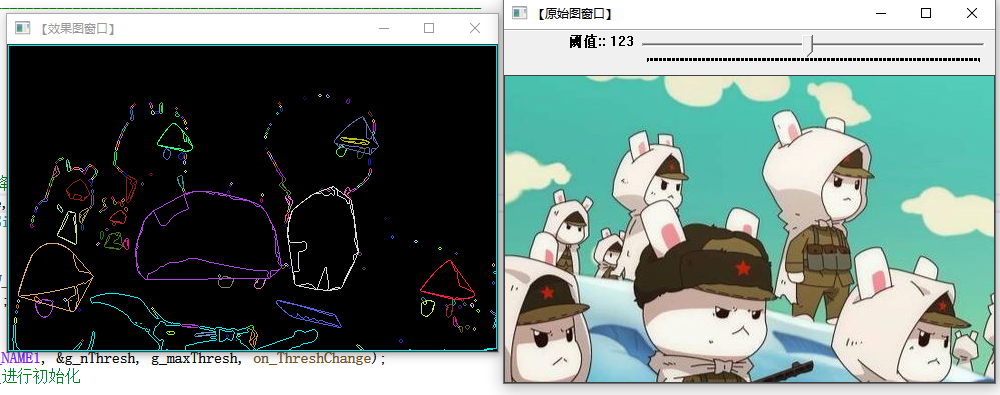

# 创建包围轮廓的矩形边界
## 运行结果

# 创建包围轮廓的圆形边界
## 运行结果

# 使用多边形包围轮廓
## 运行结果
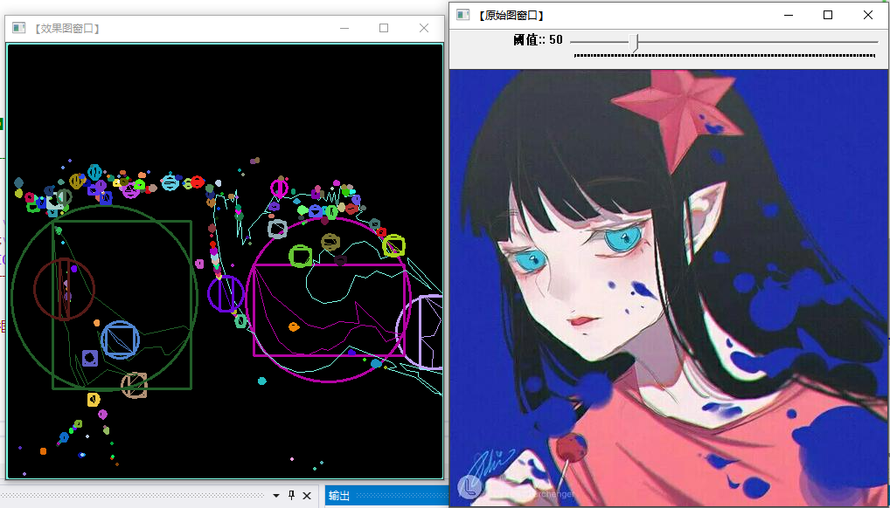

# 图像轮廓矩
## 运行结果

# 分水岭算法的使用
## 笔记
    实现分水岭算法–watershed函数

    函数watershed实现的分水岭算法是基于标记的分割算法中的一种。在把图像传给函数之前，需要大致勾画标记出图像中的期望进行分割的区域，它们被标记为正指数，所以，每一个区域都会被标记为像素值1、2、3等，表示成为一个或者多个连接组件，这些标记的值可以使用findContours函数和drawContours函数由二进制的掩码检索出来。这些标记就是即将绘制出来的分割区域的“种子”，而没有标记清楚的区域，被置为0，在函数的输出中，每一个标记中的像素被设置为“种子”的值，而区域间的值被设置为-1。
    void watershed(inputArray image,intputOutputArray markers)
    第一个参数，输入图像，需为8位三通道的彩色图像。
    第二个参数，函数调用后的运算结果存在这里，输入／输入32位单通道图像的标记结果。
## 运行结果

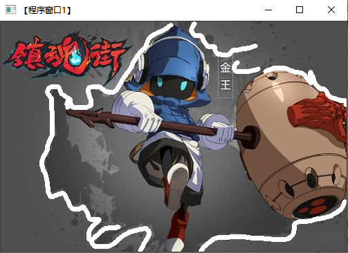

# 实现图像修补
## 笔记
    void inpaint(InputArray src, InputArray inpaintMask, OutputArray dst, double inpaintRadius, int flags)
    第一个参数，InputArray类型的src，也就是输入图像，用Mat类对象就可以了。并且要是8位单通道或者三通道图像。
    第二个参数，InputArray类型的inpaintMask，修复掩膜，为8位单通道图像。其中非0像素表示要修复的区域。
    第三个参数，OutputArray类型的dst，函数调用后的运算结果保存在这里，和输入图像有着一样的大小和类型。
    第四个参数，double类型的inpaintRadius，需要修补的每个点的圆形邻域，为修复算法参考的半径。
    第五个参数，int类型的flags，修补方法的标识符。如下
         INPAINT_NS 基于Navier-Stokes方程的方法
         INPAINT_TELEA Alexandru Telea方法**
## 运行结果
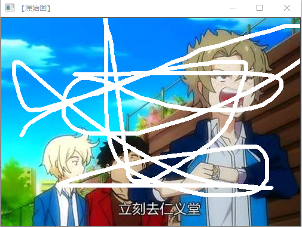

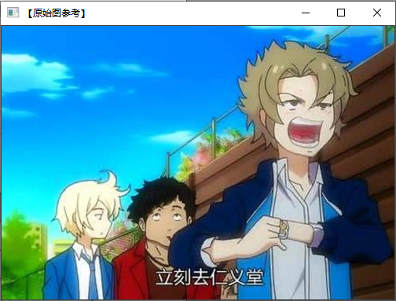

# H-S二维直方图的绘制
## 笔记
    直方图计算：calcHist()函数
    void calcHist( const Mat* images, int nimages,const int* channels, InputArray mask, OutputArray hist, int dims, const int* histSize,const float** ranges, bool uniform=true, bool accumulate=false );
    参数1：输入源图像。注意这里的格式是const Mat*，也就是说，你要传入一个地址，输入的数组(图片)或者数组集(一堆图片)需要为相同的深度（CV_8U或CV_32F）和相同的尺寸。
    参数2：int类型的nimages，输入数组的个数，也就是第一个参数中存放了多少张“图像”，有几个原数组。
    参数3：const int*类型的channels，用来计算直方图的channes的数组，需要统计的通道（dim）索引。第一个数组通道从0到images[0].channels()-1，而第二个数组通道从images[0]计算到images[0].channels()+images[1].channels()-1，以此类推。比如输入是2副图像，第一副图像有0，1，2共三个channel，第二幅图像只有0一个channel，那么输入就一共有4个channes，如果int channels[3] = {3, 2, 0}，那么就表示是使用第二副图像的第一个通道和第一副图像的第2和第0个通道来计算直方图。（这句表示没看懂）。
    参数4：InputArray类型的mask，可选的操作掩码。如果此掩码不为空，那么它必须为8位（CV_8U）的数组，并且与images[i]有同样大小的尺寸，值为1的点将用来计算直方图。这里的非零掩码元素用于标记出统计直方图的数组元素数据。
    参数5：OutputArray类型的hist，输出的计算出来的直方图，一个二维数组。
    参数6：int类型dims，需要计算的直方图的维度，必须是正数，且不大于CV_MAX_DIMS。（32）
    参数7：const int*类型的histSize，存放每个维度的直方图尺寸的数组。简单把直方图看作一个一个的竖条的话，就是每一维上竖条的个数。
    参数8：const float**类型的ranges，表示每一个维度数组（第6个参数dims）的每一维的边界阵列，可以理解为每一维数值的取值范围。比如 float rang1[] = {0, 20}；float rang2[] = {30, 40}；  const float*rangs[] = {rang1, rang2}；那么就是对0，20和30，40范围的值进行统计。
    参数9：bool类型的uniform，表示直方图是否均匀的标识符，即每一个竖条的宽度是否相等。有默认值true。
    参数10：bool类型的accumulate，累计标识符，有默认值false。若其为true，直方图在配置阶段不会被清零。此功能主要是允许从多个阵列中计算单个直方图，或者用于在特定的时间更新直方图。

    寻找最值：minMaxLoc() 函数 
    minMaxLoc() 函数的作用是在数组中找到全局最小值和最大值。
    void minMaxLoc(InputArray src,double* minVal,double* maxVal = 0,Point* minLoc = 0,Point* maxLoc = 0,InputArray mask = noArray())
    第一个参数：InputArray 类型的 src，输入的单通道阵列。
    第二个参数：double* 类型的 minVal，返回最小值的指针。若无需返回，此参数设置为 NULL。
    第三个参数：double* 类型的 maxVal，返回最大值的指针，若无需返回，此参数设置为 NULL。
    第四个参数：Point* 类型的 minLoc，返回最小位置的指针（二维情况下）。若无需返回，此值置为 NULL。
    第五个参数：Point* 类型的 maxLoc，返回最大位置的指针（二维情况下）。若无需返回，此值置为 NULL。
    第六个参数：InputArray 类型的 mask，用于选择子阵列的可选掩膜。
## 运行结果
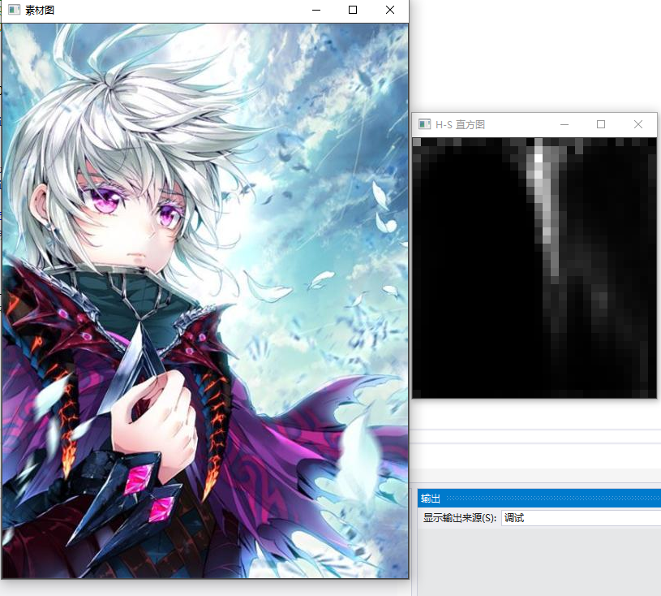

# 一维直方图的绘制
## 运行结果

# RGB 三色直方图的绘制
## 运行结果

## 直方图对比
# 笔记
    compareHist()函数用于对两幅直方图进行比较。有两个版本的C++原型，如下
    C++: double compareHist (InputArray Hl，InputArray H2，int method)
    C++: double compareHist(const SparseMat& Hl,const SparseMat& H2，int method)
    它们的前两个参数是要比较的大小相同的直方图，第三个变量是所选择的距离标准。可采用如下4种方法，比较两个直方图(H1表示第一个，H2表示第二个):
    相关， Correlation  (method=CV_COMP_CORREL)   方法1越趋近于1的时候基本图与样例图的相似度越近；
    卡方， Chi-Square (method=CV_COMP_CHISQR)    方2法越趋近于0的时候基本图与样例图的相似度越近；
    直方相交， Intersection (method=CV_COMP_INTERSETC)  方法3越趋近于58.69的时候基本图与样例图的相似度越近；
    距离， Bhattacharyya (method=CV_COMP_BHATTACHARYYA)  方法4越趋近于0的时候基本图与样例图的相似度越近；
## 运行结果
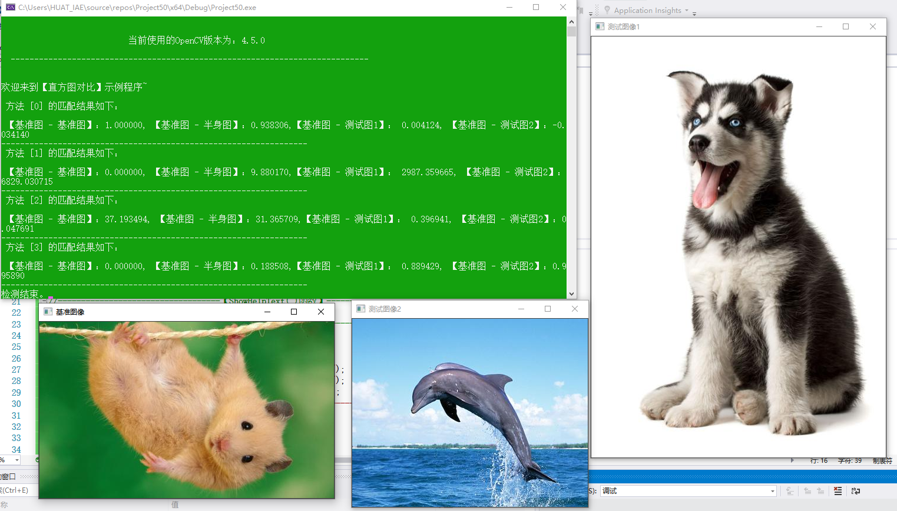

# 反向投影
## 运行结果

# 模板匹配
## 笔记
    void matchTemplate( InputArray image,InputArray templ，OutputArray result,int method,InputArray mask = noArray() );
    
    参数一：InputArray类型的image，运行搜索的图像。它必须是8位或32位浮点。；
    参数二：InputArray类型的templ，模板搜索模板。它不能大于源映像，并且具有相同的数据类型；
    参数三：OutputArray类型的result，比较结果的结果图，result图像中的每一个点的值代表了一次相似度比较结果。它必须是单通道32位浮点，如果图像尺寸是W x H而templ尺寸是w x h，则此参数result一定是（W-w+1）x（H-h+1）。
    参数四：int类型的method
## 运行结果
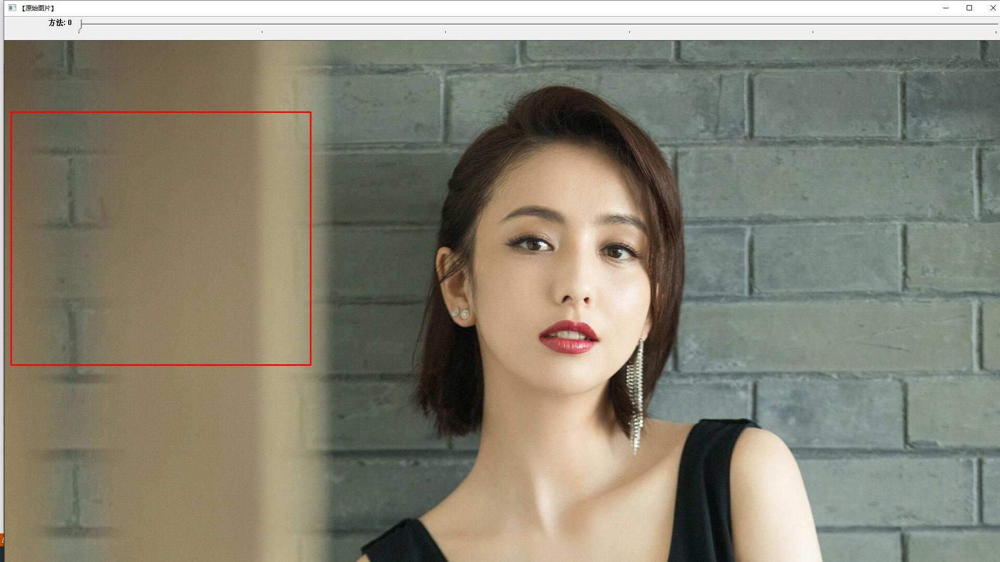
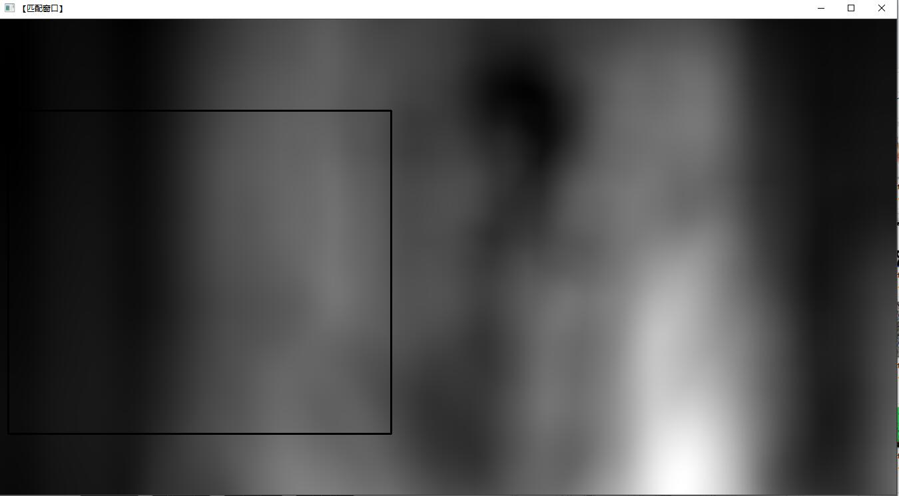

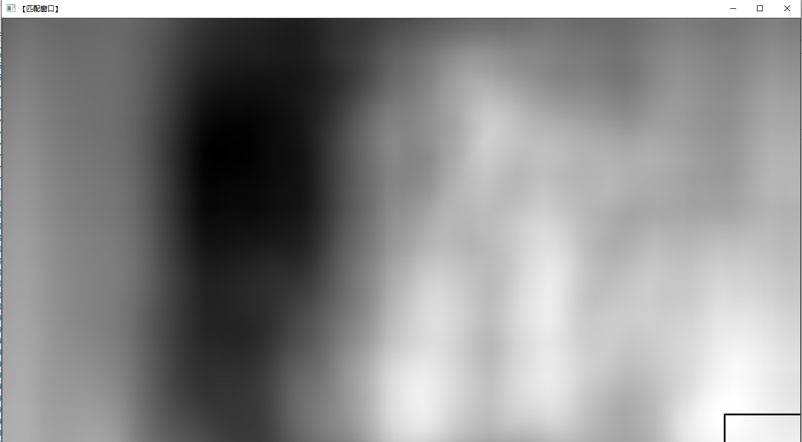
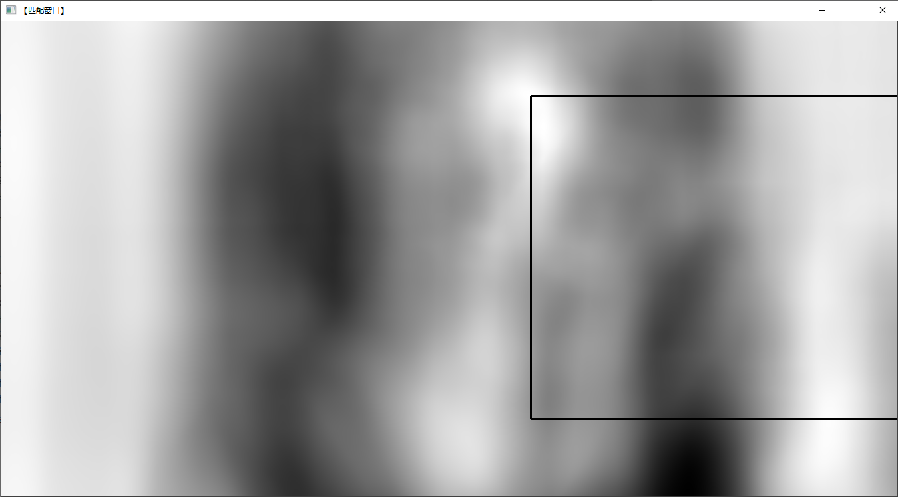
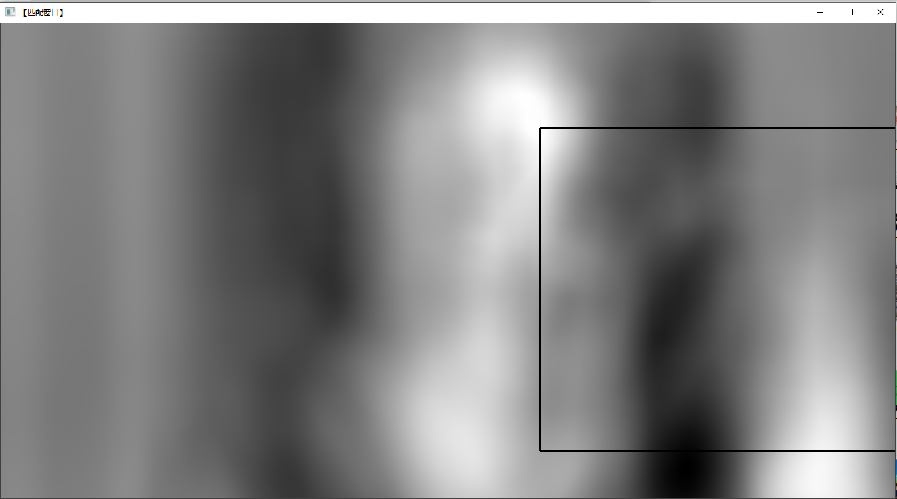
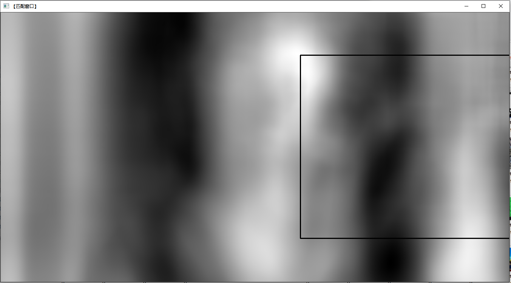
