# 第七章 基于OpenCV的边缘检测

## 边缘检测步骤

**第一步 滤波**
基于图像的一阶和二阶导数
**第二步 增强**
增强边缘的基础是确定图像各点领域强度的变化值
**第三步 检测**
往往领域中有很多点的梯度值比较大，而在特定的应用中，这些点并不是找边缘点，所以应该采用某种方法进行取舍。常用
方法是阈值法

## canny算子原理

从表面效果上来讲，Canny算法是对Sobel、Prewitt等算子效果的进一步细化和更加准确的定位。

Canny算法基于三个基本目标：

低错误率。所有边缘都应被找到，且没有伪响应。
边缘点应该被很好地定位。已定位的边缘必须尽可能接近真实边缘。
单一的边缘点响应。这意味在仅存一个单一边缘点的位置，检测器不应指出多个像素边缘。
进而，Canny的工作本质是，从数学上表达前面的三个准则。因此Canny的步骤如下：

对输入图像进行高斯平滑，降低错误率。
计算梯度幅度和方向来估计每一点处的边缘强度与方向。
根据梯度方向，对梯度幅值进行非极大值抑制。本质上是对Sobel、Prewitt等算子结果的进一步细化。
用双阈值处理和连接边缘。


## sobel算子

sobel算子就对这些问题做了自己的规范，而且命名为sobel算子，就是对一副图像的输入到输出边缘信息的整个处理过程。

sobel算子的思想，Sobel算子认为，邻域的像素对当前像素产生的影响不是等价的，所以距离不同的像素具有不同的权值，对算子结果产生的影响也不同。一般来说，距离越远，产生的影响越小。

sobel算子的原理，对传进来的图像像素做卷积，卷积的实质是在求梯度值，或者说给了一个加权平均，其中权值就是所谓的卷积核；然后对生成的新像素灰度值做阈值运算，以此来确定边缘信息。

## laplacian算子

Laplace算子作为边缘检测之一，和Sobel算子一样也是工程数学中常用的一种积分变换，属于空间锐化滤波操作。拉普拉斯算子（Laplace Operator）是n维欧几里德空间中的一个二阶微分算子，定义为梯度（▽f）的散度（▽·f）。拉普拉斯算子也可以推广为定义在黎曼流形上的椭圆型算子，称为拉普拉斯-贝尔特拉米算子。

　　拉普拉斯算子是二阶微分线性算子，在图像边缘处理中，二阶微分的边缘定位能力更强，锐化效果更好，因此在进行图像边缘处理时，直接采用二阶微分算子而不使用一阶微分。

f的拉普拉斯算子也是笛卡尔坐标系中的所有非混合二阶偏导求和
作为一个二阶微分算子，拉普拉斯算子把c函数映射到c函数。

## schar滤波器

我们一般直接称scharr为滤波器，而不是算子。主要配合Sobel算子存在

##综合示例 

```c++

//--------------------------------------【程序说明】-------------------------------------------
//		程序说明：《OpenCV3编程入门》OpenCV3版书本配套示例程序60
//		程序描述：边缘检测综合示例——Canny算子,Sobel算子,Laplace算子,Scharr滤波器合辑
//		开发测试所用操作系统： Windows 7 64bit
//		开发测试所用IDE版本：Visual Studio 2010
//		开发测试所用OpenCV版本：	3.0 beta
//		2014年11月 Created by @浅墨_毛星云
//		2014年12月 Revised by @浅墨_毛星云
//------------------------------------------------------------------------------------------------


//---------------------------------【头文件、命名空间包含部分】----------------------------
//		描述：包含程序所使用的头文件和命名空间
//------------------------------------------------------------------------------------------------
#include <opencv2/highgui/highgui.hpp>
#include <opencv2/imgproc/imgproc.hpp>
using namespace cv;


//-----------------------------------【全局变量声明部分】--------------------------------------
//		描述：全局变量声明
//-----------------------------------------------------------------------------------------------
//原图，原图的灰度版，目标图
Mat g_srcImage, g_srcGrayImage, g_dstImage;

//Canny边缘检测相关变量
Mat g_cannyDetectedEdges;
int g_cannyLowThreshold = 1;//TrackBar位置参数  

//Sobel边缘检测相关变量
Mat g_sobelGradient_X, g_sobelGradient_Y;
Mat g_sobelAbsGradient_X, g_sobelAbsGradient_Y;
int g_sobelKernelSize = 1;//TrackBar位置参数  

//Scharr滤波器相关变量
Mat g_scharrGradient_X, g_scharrGradient_Y;
Mat g_scharrAbsGradient_X, g_scharrAbsGradient_Y;


//-----------------------------------【全局函数声明部分】--------------------------------------
//		描述：全局函数声明
//-----------------------------------------------------------------------------------------------
static void ShowHelpText();
static void on_Canny(int, void*);//Canny边缘检测窗口滚动条的回调函数
static void on_Sobel(int, void*);//Sobel边缘检测窗口滚动条的回调函数
void Scharr();//封装了Scharr边缘检测相关代码的函数


//-----------------------------------【main( )函数】--------------------------------------------
//		描述：控制台应用程序的入口函数，我们的程序从这里开始
//-----------------------------------------------------------------------------------------------
int main(int argc, char** argv)
{
	//改变console字体颜色
	system("color 2F");

	//显示欢迎语
	ShowHelpText();

	//载入原图
	g_srcImage = imread("D:/image/2.jpg");
	if (!g_srcImage.data) { printf("Oh，no，读取srcImage错误~！ \n"); return false; }

	//显示原始图
	namedWindow("【原始图】");
	imshow("【原始图】", g_srcImage);

	// 创建与src同类型和大小的矩阵(dst)
	g_dstImage.create(g_srcImage.size(), g_srcImage.type());

	// 将原图像转换为灰度图像
	cvtColor(g_srcImage, g_srcGrayImage, COLOR_BGR2GRAY);

	// 创建显示窗口
	namedWindow("【效果图】Canny边缘检测", WINDOW_AUTOSIZE);
	namedWindow("【效果图】Sobel边缘检测", WINDOW_AUTOSIZE);

	// 创建trackbar
	createTrackbar("参数值：", "【效果图】Canny边缘检测", &g_cannyLowThreshold, 120, on_Canny);
	createTrackbar("参数值：", "【效果图】Sobel边缘检测", &g_sobelKernelSize, 3, on_Sobel);

	// 调用回调函数
	on_Canny(0, 0);
	on_Sobel(0, 0);

	//调用封装了Scharr边缘检测代码的函数
	Scharr();

	//轮询获取按键信息，若按下Q，程序退出
	while ((char(waitKey(1)) != 'q')) {}

	return 0;
}


//-----------------------------------【ShowHelpText( )函数】----------------------------------
//		描述：输出一些帮助信息
//----------------------------------------------------------------------------------------------
static void ShowHelpText()
{
	//输出欢迎信息和OpenCV版本
	printf("\n\n\t\t\t非常感谢购买《OpenCV3编程入门》一书！\n");
	printf("\n\n\t\t\t此为本书OpenCV3版的第60个配套示例程序\n");
	printf("\n\n\t\t\t   当前使用的OpenCV版本为：" CV_VERSION);
	printf("\n\n  ----------------------------------------------------------------------------\n");

	//输出一些帮助信息
	printf("\n\n\t运行成功，请调整滚动条观察图像效果~\n\n"
		"\t按下“q”键时，程序退出。\n");
}


//-----------------------------------【on_Canny( )函数】----------------------------------
//		描述：Canny边缘检测窗口滚动条的回调函数
//-----------------------------------------------------------------------------------------------
void on_Canny(int, void*)
{
	// 先使用 3x3内核来降噪
	blur(g_srcGrayImage, g_cannyDetectedEdges, Size(3, 3));

	// 运行我们的Canny算子
	Canny(g_cannyDetectedEdges, g_cannyDetectedEdges, g_cannyLowThreshold, g_cannyLowThreshold * 3, 3);

	//先将g_dstImage内的所有元素设置为0 
	g_dstImage = Scalar::all(0);

	//使用Canny算子输出的边缘图g_cannyDetectedEdges作为掩码，来将原图g_srcImage拷到目标图g_dstImage中
	g_srcImage.copyTo(g_dstImage, g_cannyDetectedEdges);

	//显示效果图
	imshow("【效果图】Canny边缘检测", g_dstImage);
}


//-----------------------------------【on_Sobel( )函数】----------------------------------
//		描述：Sobel边缘检测窗口滚动条的回调函数
//-----------------------------------------------------------------------------------------
void on_Sobel(int, void*)
{
	// 求 X方向梯度
	Sobel(g_srcImage, g_sobelGradient_X, CV_16S, 1, 0, (2 * g_sobelKernelSize + 1), 1, 1, BORDER_DEFAULT);
	convertScaleAbs(g_sobelGradient_X, g_sobelAbsGradient_X);//计算绝对值，并将结果转换成8位

	// 求Y方向梯度
	Sobel(g_srcImage, g_sobelGradient_Y, CV_16S, 0, 1, (2 * g_sobelKernelSize + 1), 1, 1, BORDER_DEFAULT);
	convertScaleAbs(g_sobelGradient_Y, g_sobelAbsGradient_Y);//计算绝对值，并将结果转换成8位

	// 合并梯度
	addWeighted(g_sobelAbsGradient_X, 0.5, g_sobelAbsGradient_Y, 0.5, 0, g_dstImage);

	//显示效果图
	imshow("【效果图】Sobel边缘检测", g_dstImage);

}


//-----------------------------------【Scharr( )函数】----------------------------------
//		描述：封装了Scharr边缘检测相关代码的函数
//-----------------------------------------------------------------------------------------
void Scharr()
{
	// 求 X方向梯度
	Scharr(g_srcImage, g_scharrGradient_X, CV_16S, 1, 0, 1, 0, BORDER_DEFAULT);
	convertScaleAbs(g_scharrGradient_X, g_scharrAbsGradient_X);//计算绝对值，并将结果转换成8位

	// 求Y方向梯度
	Scharr(g_srcImage, g_scharrGradient_Y, CV_16S, 0, 1, 1, 0, BORDER_DEFAULT);
	convertScaleAbs(g_scharrGradient_Y, g_scharrAbsGradient_Y);//计算绝对值，并将结果转换成8位

	// 合并梯度
	addWeighted(g_scharrAbsGradient_X, 0.5, g_scharrAbsGradient_Y, 0.5, 0, g_dstImage);

	//显示效果图
	imshow("【效果图】Scharr滤波器", g_dstImage);
}

```
**实验结果**
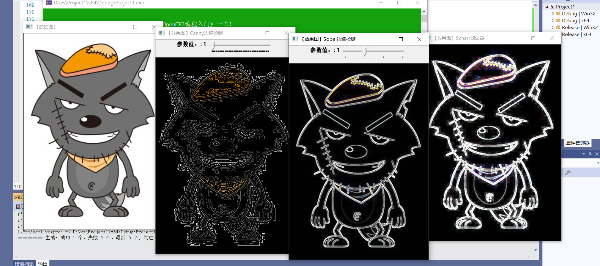

## 直方图的均衡化

直方图均衡化是一种简单有效的图像增强技术，通过改变图像的直方图来改变图像中各像素的灰度，主要用于增强动态范围偏小的图像的对比度。原始图像由于其灰度分布可能集中在较窄的区间，造成图像不够清晰。例如，过曝光图像的灰度级集中在高亮度范围内，而曝光不足将使图像灰度级集中在低亮度范围内。采用直方图均衡化，可以把原始图像的直方图变换为均匀分布（均衡）的形式，这样就增加了像素之间灰度值差别的动态范围，从而达到增强图像整体对比度的效果。换言之，直方图均衡化的基本原理是：对在图像中像素个数多的灰度值（即对画面起主要作用的灰度值）进行展宽，而对像素个数少的灰度值（即对画面不起主要作用的灰度值）进行归并，从而增大对比度，使图像清晰，达到增强的目的。

```c++
//--------------------------------------【程序说明】-------------------------------------------
//		程序说明：《OpenCV3编程入门》OpenCV3版书本配套示例程序68
//		程序描述：直方图均衡化
//		开发测试所用操作系统： Windows 7 64bit
//		开发测试所用IDE版本：Visual Studio 2010
//		开发测试所用OpenCV版本：	3.0 beta
//		2014年11月 Created by @浅墨_毛星云
//		2014年12月 Revised by @浅墨_毛星云
//------------------------------------------------------------------------------------------------


//---------------------------------【头文件、命名空间包含部分】---------------------------
//          描述：包含程序所使用的头文件和命名空间
//-----------------------------------------------------------------------------------------------
#include "opencv2/highgui/highgui.hpp"
#include "opencv2/imgproc/imgproc.hpp"
using namespace cv;


//--------------------------------------【main( )函数】-----------------------------------------
//          描述：控制台应用程序的入口函数，我们的程序从这里开始执行
//-----------------------------------------------------------------------------------------------
int main()
{
	// 【1】加载源图像
	Mat srcImage, dstImage;
	srcImage = imread("D:/image/2.jpg", 1);
	if (!srcImage.data) { printf("读取图片错误，请确定目录下是否有imread函数指定图片存在~！ \n"); return false; }

	// 【2】转为灰度图并显示出来
	cvtColor(srcImage, srcImage, COLOR_BGR2GRAY);
	imshow("原始图", srcImage);

	// 【3】进行直方图均衡化
	equalizeHist(srcImage, dstImage);

	// 【4】显示结果
	imshow("经过直方图均衡化后的图", dstImage);

	// 等待用户按键退出程序
	waitKey(0);
	return 0;

}
```
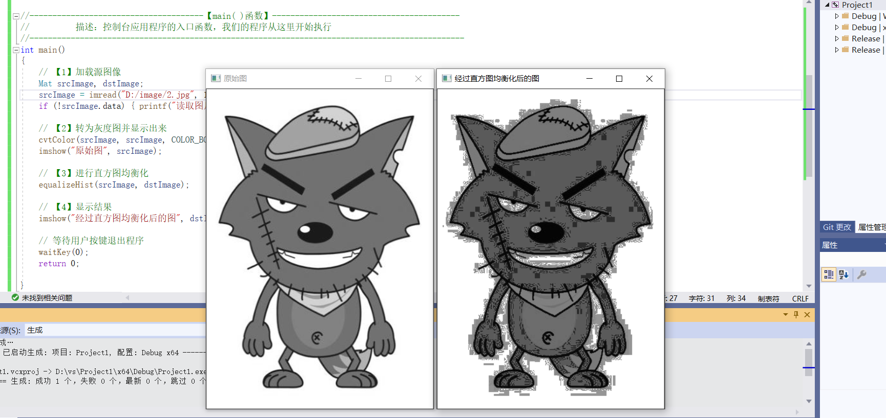

## 图像直方图概述

直方图广泛运用于很多计算机视觉运用当中，通过标记帧与帧之间显著的边缘和颜色的统计变化，来检查视频中的场景变化

## 直方图的计算与绘制

直方图的计算在OpenCV中可以使用calcHist()函数，而计算完成之后，可以采用OpenCV中的绘图函数，如绘制矩形的rectangle()函数，绘制线段的line()来完成

```c++
//--------------------------------------【程序说明】-------------------------------------------
//		程序说明：《OpenCV3编程入门》OpenCV3版书本配套示例程序79
//		程序描述：H-S二维直方图的绘制
//		开发测试所用操作系统： Windows 7 64bit
//		开发测试所用IDE版本：Visual Studio 2010
//		开发测试所用OpenCV版本：	3.0 beta
//		2014年11月 Created by @浅墨_毛星云
//		2014年12月 Revised by @浅墨_毛星云
//------------------------------------------------------------------------------------------------


//---------------------------------【头文件、命名空间包含部分】----------------------------
//		描述：包含程序所使用的头文件和命名空间
//------------------------------------------------------------------------------------------------
#include "opencv2/highgui/highgui.hpp"
#include "opencv2/imgproc/imgproc.hpp"
using namespace cv;


//-----------------------------------【ShowHelpText( )函数】-----------------------------
//		 描述：输出一些帮助信息
//----------------------------------------------------------------------------------------------
void ShowHelpText()
{
	//输出欢迎信息和OpenCV版本
	printf("\n\n\t\t\t非常感谢购买《OpenCV3编程入门》一书！\n");
	printf("\n\n\t\t\t此为本书OpenCV3版的第79个配套示例程序\n");
	printf("\n\n\t\t\t   当前使用的OpenCV版本为：" CV_VERSION );
	printf("\n\n  ----------------------------------------------------------------------------\n");
}


//--------------------------------------【main( )函数】-----------------------------------------
//          描述：控制台应用程序的入口函数，我们的程序从这里开始执行
//-----------------------------------------------------------------------------------------------
int main( )
{

	//【1】载入源图，转化为HSV颜色模型
	Mat srcImage, hsvImage;
	srcImage=imread("1.jpg");
	cvtColor(srcImage,hsvImage, COLOR_BGR2HSV);

	system("color 2F");
	ShowHelpText();

	//【2】参数准备
	//将色调量化为30个等级，将饱和度量化为32个等级
	int hueBinNum = 30;//色调的直方图直条数量
	int saturationBinNum = 32;//饱和度的直方图直条数量
	int histSize[ ] = {hueBinNum, saturationBinNum};
	// 定义色调的变化范围为0到179
	float hueRanges[] = { 0, 180 };
	//定义饱和度的变化范围为0（黑、白、灰）到255（纯光谱颜色）
	float saturationRanges[] = { 0, 256 };
	const float* ranges[] = { hueRanges, saturationRanges };
	MatND dstHist;
	//参数准备，calcHist函数中将计算第0通道和第1通道的直方图
	int channels[] = {0, 1};

	//【3】正式调用calcHist，进行直方图计算
	calcHist( &hsvImage,//输入的数组
		1, //数组个数为1
		channels,//通道索引
		Mat(), //不使用掩膜
		dstHist, //输出的目标直方图
		2, //需要计算的直方图的维度为2
		histSize, //存放每个维度的直方图尺寸的数组
		ranges,//每一维数值的取值范围数组
		true, // 指示直方图是否均匀的标识符，true表示均匀的直方图
		false );//累计标识符，false表示直方图在配置阶段会被清零

	//【4】为绘制直方图准备参数
	double maxValue=0;//最大值
	minMaxLoc(dstHist, 0, &maxValue, 0, 0);//查找数组和子数组的全局最小值和最大值存入maxValue中
	int scale = 10;
	Mat histImg = Mat::zeros(saturationBinNum*scale, hueBinNum*10, CV_8UC3);

	//【5】双层循环，进行直方图绘制
	for( int hue = 0; hue < hueBinNum; hue++ )
		for( int saturation = 0; saturation < saturationBinNum; saturation++ )
		{
			float binValue = dstHist.at<float>(hue, saturation);//直方图组距的值
			int intensity = cvRound(binValue*255/maxValue);//强度

			//正式进行绘制
			rectangle( histImg, Point(hue*scale, saturation*scale),
				Point( (hue+1)*scale - 1, (saturation+1)*scale - 1),
				Scalar::all(intensity),FILLED );
		}

		//【6】显示效果图
		imshow( "素材图", srcImage );
		imshow( "H-S 直方图", histImg );

		waitKey();
}
```

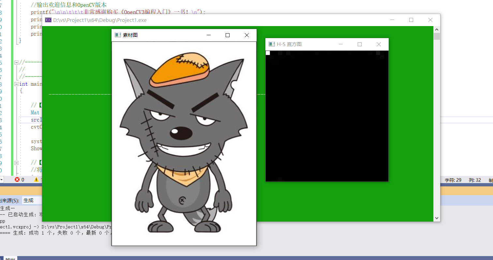

## 计算并绘制图像一维直方图
```c++
//--------------------------------------【程序说明】-------------------------------------------
//		程序说明：《OpenCV3编程入门》OpenCV3版书本配套示例程序80
//		程序描述：一维直方图的绘制
//		开发测试所用操作系统： Windows 7 64bit
//		开发测试所用IDE版本：Visual Studio 2010
//		开发测试所用OpenCV版本：	3.0 beta
//		2014年11月 Created by @浅墨_毛星云
//		2014年12月 Revised by @浅墨_毛星云
//------------------------------------------------------------------------------------------------


//---------------------------------【头文件、命名空间包含部分】----------------------------
//		描述：包含程序所使用的头文件和命名空间
//------------------------------------------------------------------------------------------------
#include "opencv2/highgui/highgui.hpp"
#include "opencv2/imgproc/imgproc.hpp"
#include <iostream>
using namespace cv;
using namespace std;


//-----------------------------------【ShowHelpText( )函数】-----------------------------
//		 描述：输出一些帮助信息
//----------------------------------------------------------------------------------------------
void ShowHelpText()
{
	//输出欢迎信息和OpenCV版本
	printf("\n\n\t\t\t非常感谢购买《OpenCV3编程入门》一书！\n");
	printf("\n\n\t\t\t此为本书OpenCV3版的第80个配套示例程序\n");
	printf("\n\n\t\t\t   当前使用的OpenCV版本为：" CV_VERSION );
	printf("\n\n  ----------------------------------------------------------------------------\n");
}


//--------------------------------------【main( )函数】-----------------------------------------
//          描述：控制台应用程序的入口函数，我们的程序从这里开始执行
//-------------------------------------------------------------------------------------------------
int main()
{
	//【1】载入原图并显示
	Mat srcImage = imread("1.jpg", 0);
	imshow("原图",srcImage);
	if(!srcImage.data) {cout << "fail to load image" << endl; 	return 0;}

	system("color 1F");
	ShowHelpText();

	//【2】定义变量
	MatND dstHist;       // 在cv中用CvHistogram *hist = cvCreateHist
	int dims = 1;
	float hranges[] = {0, 255};
	const float *ranges[] = {hranges};   // 这里需要为const类型
	int size = 256;
	int channels = 0;

	//【3】计算图像的直方图
	calcHist(&srcImage, 1, &channels, Mat(), dstHist, dims, &size, ranges);    // cv 中是cvCalcHist
	int scale = 1;

	Mat dstImage(size * scale, size, CV_8U, Scalar(0));
	//【4】获取最大值和最小值
	double minValue = 0;
	double maxValue = 0;
	minMaxLoc(dstHist,&minValue, &maxValue, 0, 0);  //  在cv中用的是cvGetMinMaxHistValue

	//【5】绘制出直方图
	int hpt = saturate_cast<int>(0.9 * size);
	for(int i = 0; i < 256; i++)
	{
		float binValue = dstHist.at<float>(i);           //   注意hist中是float类型    而在OpenCV1.0版中用cvQueryHistValue_1D
		int realValue = saturate_cast<int>(binValue * hpt/maxValue);
		rectangle(dstImage,Point(i*scale, size - 1), Point((i+1)*scale - 1, size - realValue), Scalar(255));
	}
	imshow("一维直方图", dstImage);
	waitKey(0);
	return 0;
}
```

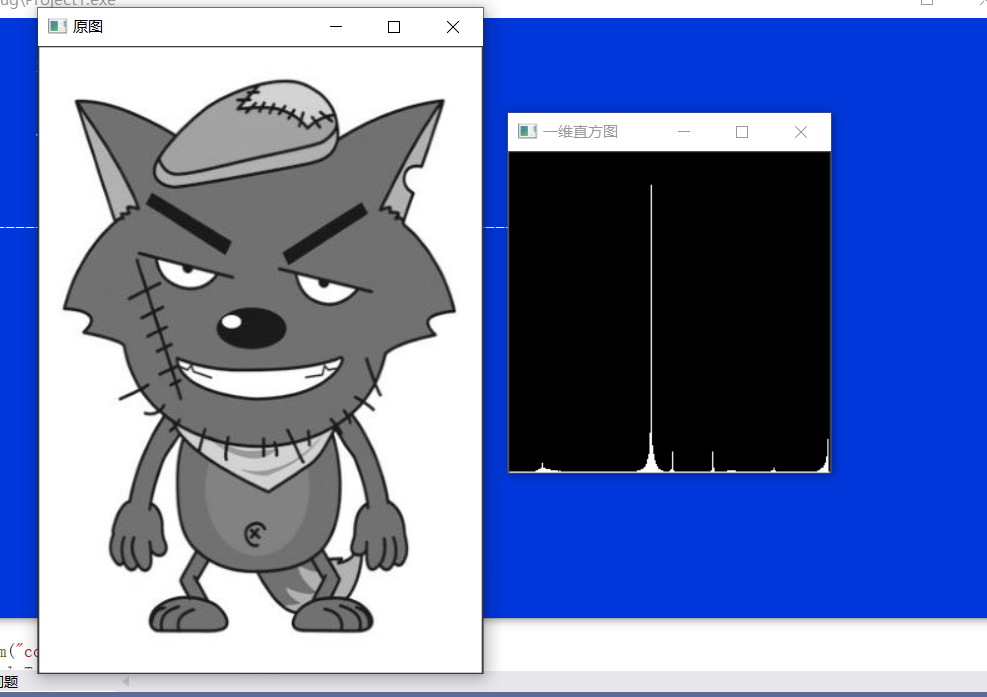

## 绘制RGB三色直方图

```c++
//--------------------------------------【程序说明】-------------------------------------------
//		程序说明：《OpenCV3编程入门》OpenCV2版书本配套示例程序81
//		程序描述：绘制RGB三色分量的直方图
//		开发测试所用操作系统： Windows 7 64bit
//		开发测试所用IDE版本：Visual Studio 2010
//		开发测试所用OpenCV版本：	3.0 beta
//		2014年11月 Created by @浅墨_毛星云
//		2014年12月 Revised by @浅墨_毛星云
//------------------------------------------------------------------------------------------------


//---------------------------------【头文件、命名空间包含部分】----------------------------
//		描述：包含程序所使用的头文件和命名空间
//------------------------------------------------------------------------------------------------
#include <opencv2/opencv.hpp>  
#include <opencv2/imgproc/imgproc.hpp>  
using namespace cv;  


//-----------------------------------【ShowHelpText( )函数】-----------------------------
//		 描述：输出一些帮助信息
//----------------------------------------------------------------------------------------------
void ShowHelpText()
{
	//输出欢迎信息和OpenCV版本
	printf("\n\n\t\t\t非常感谢购买《OpenCV3编程入门》一书！\n");
	printf("\n\n\t\t\t此为本书OpenCV3版的第81个配套示例程序\n");
	printf("\n\n\t\t\t   当前使用的OpenCV版本为：" CV_VERSION );
	printf("\n\n  ----------------------------------------------------------------------------\n");
}


//--------------------------------------【main( )函数】-----------------------------------------
//          描述：控制台应用程序的入口函数，我们的程序从这里开始执行
//-----------------------------------------------------------------------------------------------
int main(  )
{

	//【1】载入素材图并显示
	Mat srcImage;
	srcImage=imread("1.jpg");
	imshow( "素材图", srcImage );

	system("color 3F");
	ShowHelpText();

	//【2】参数准备
	int bins = 256;
	int hist_size[] = {bins};
	float range[] = { 0, 256 };
	const float* ranges[] = { range};
	MatND redHist,grayHist,blueHist;
	int channels_r[] = {0};

	//【3】进行直方图的计算（红色分量部分）
	calcHist( &srcImage, 1, channels_r, Mat(), //不使用掩膜
		redHist, 1, hist_size, ranges,
		true, false );

	//【4】进行直方图的计算（绿色分量部分）
	int channels_g[] = {1};
	calcHist( &srcImage, 1, channels_g, Mat(), // do not use mask
		grayHist, 1, hist_size, ranges,
		true, // the histogram is uniform
		false );

	//【5】进行直方图的计算（蓝色分量部分）
	int channels_b[] = {2};
	calcHist( &srcImage, 1, channels_b, Mat(), // do not use mask
		blueHist, 1, hist_size, ranges,
		true, // the histogram is uniform
		false );

	//-----------------------绘制出三色直方图------------------------
	//参数准备
	double maxValue_red,maxValue_green,maxValue_blue;
	minMaxLoc(redHist, 0, &maxValue_red, 0, 0);
	minMaxLoc(grayHist, 0, &maxValue_green, 0, 0);
	minMaxLoc(blueHist, 0, &maxValue_blue, 0, 0);
	int scale = 1;
	int histHeight=256;
	Mat histImage = Mat::zeros(histHeight,bins*3, CV_8UC3);

	//正式开始绘制
	for(int i=0;i<bins;i++)
	{
		//参数准备
		float binValue_red = redHist.at<float>(i); 
		float binValue_green = grayHist.at<float>(i);
		float binValue_blue = blueHist.at<float>(i);
		int intensity_red = cvRound(binValue_red*histHeight/maxValue_red);  //要绘制的高度
		int intensity_green = cvRound(binValue_green*histHeight/maxValue_green);  //要绘制的高度
		int intensity_blue = cvRound(binValue_blue*histHeight/maxValue_blue);  //要绘制的高度

		//绘制红色分量的直方图
		rectangle(histImage,Point(i*scale,histHeight-1),
			Point((i+1)*scale - 1, histHeight - intensity_red),
			Scalar(255,0,0));

		//绘制绿色分量的直方图
		rectangle(histImage,Point((i+bins)*scale,histHeight-1),
			Point((i+bins+1)*scale - 1, histHeight - intensity_green),
			Scalar(0,255,0));

		//绘制蓝色分量的直方图
		rectangle(histImage,Point((i+bins*2)*scale,histHeight-1),
			Point((i+bins*2+1)*scale - 1, histHeight - intensity_blue),
			Scalar(0,0,255));

	}

	//在窗口中显示出绘制好的直方图
	imshow( "图像的RGB直方图", histImage );
	waitKey(0);
	return 0;
}

```

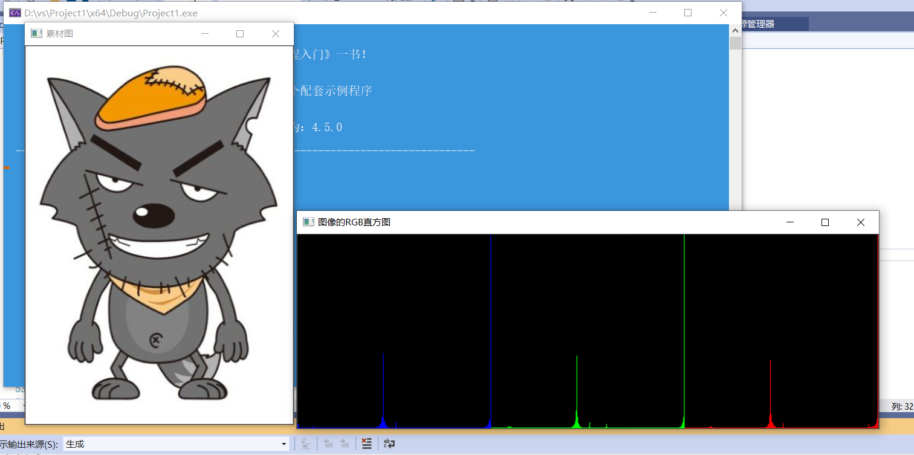

## 直方图对比

```c++
//--------------------------------------【程序说明】-------------------------------------------
//		程序说明：《OpenCV3编程入门》OpenCV2版书本配套示例程序82
//		程序描述：直方图对比
//		开发测试所用操作系统： Windows 7 64bit
//		开发测试所用IDE版本：Visual Studio 2010
//		开发测试所用OpenCV版本：	3.0 beta
//		2014年11月 Created by @浅墨_毛星云
//		2014年12月 Revised by @浅墨_毛星云
//------------------------------------------------------------------------------------------------


//---------------------------------【头文件、命名空间包含部分】----------------------------
//		描述：包含程序所使用的头文件和命名空间
//------------------------------------------------------------------------------------------------
#include "opencv2/highgui/highgui.hpp"
#include "opencv2/imgproc/imgproc.hpp"
using namespace cv;


//-----------------------------------【ShowHelpText( )函数】-----------------------------
//          描述：输出一些帮助信息
//----------------------------------------------------------------------------------------------
static void ShowHelpText()
{
	//输出欢迎信息和OpenCV版本
	printf("\n\n\t\t\t非常感谢购买《OpenCV3编程入门》一书！\n");
	printf("\n\n\t\t\t此为本书OpenCV3版的第82个配套示例程序\n");
	printf("\n\n\t\t\t   当前使用的OpenCV版本为：" CV_VERSION );
	printf("\n\n  ----------------------------------------------------------------------------\n");
	//输出一些帮助信息
	printf("\n\n欢迎来到【直方图对比】示例程序~\n\n"); 

}


//--------------------------------------【main( )函数】-----------------------------------------
//          描述：控制台应用程序的入口函数，我们的程序从这里开始执行
//-----------------------------------------------------------------------------------------------
int main( )
{
	//【0】改变console字体颜色
	system("color 2F"); 

	//【1】显示帮助文字
	ShowHelpText();

	//【1】声明储存基准图像和另外两张对比图像的矩阵( RGB 和 HSV )
	Mat srcImage_base, hsvImage_base;
	Mat srcImage_test1, hsvImage_test1;
	Mat srcImage_test2, hsvImage_test2;
	Mat hsvImage_halfDown;

	//【2】载入基准图像(srcImage_base) 和两张测试图像srcImage_test1、srcImage_test2，并显示
	srcImage_base = imread( "D:/image/2.jpg",1 );
	srcImage_test1 = imread( "D:/image/3.jpg", 1 );
	srcImage_test2 = imread( "D:/image/4.jpg", 1 );
	//显示载入的3张图像
	imshow("基准图像",srcImage_base);
	imshow("测试图像1",srcImage_test1);
	imshow("测试图像2",srcImage_test2);

	// 【3】将图像由BGR色彩空间转换到 HSV色彩空间
	cvtColor( srcImage_base, hsvImage_base,  COLOR_BGR2HSV );
	cvtColor( srcImage_test1, hsvImage_test1, COLOR_BGR2HSV );
	cvtColor( srcImage_test2, hsvImage_test2, COLOR_BGR2HSV );

	//【4】创建包含基准图像下半部的半身图像(HSV格式)
	hsvImage_halfDown = hsvImage_base( Range( hsvImage_base.rows/2, hsvImage_base.rows - 1 ), Range( 0, hsvImage_base.cols - 1 ) );

	//【5】初始化计算直方图需要的实参
	// 对hue通道使用30个bin,对saturatoin通道使用32个bin
	int h_bins = 50; int s_bins = 60;
	int histSize[] = { h_bins, s_bins };
	// hue的取值范围从0到256, saturation取值范围从0到180
	float h_ranges[] = { 0, 256 };
	float s_ranges[] = { 0, 180 };
	const float* ranges[] = { h_ranges, s_ranges };
	// 使用第0和第1通道
	int channels[] = { 0, 1 };

	// 【6】创建储存直方图的 MatND 类的实例:
	MatND baseHist;
	MatND halfDownHist;
	MatND testHist1;
	MatND testHist2;

	// 【7】计算基准图像，两张测试图像，半身基准图像的HSV直方图:
	calcHist( &hsvImage_base, 1, channels, Mat(), baseHist, 2, histSize, ranges, true, false );
	normalize( baseHist, baseHist, 0, 1, NORM_MINMAX, -1, Mat() );

	calcHist( &hsvImage_halfDown, 1, channels, Mat(), halfDownHist, 2, histSize, ranges, true, false );
	normalize( halfDownHist, halfDownHist, 0, 1, NORM_MINMAX, -1, Mat() );

	calcHist( &hsvImage_test1, 1, channels, Mat(), testHist1, 2, histSize, ranges, true, false );
	normalize( testHist1, testHist1, 0, 1, NORM_MINMAX, -1, Mat() );

	calcHist( &hsvImage_test2, 1, channels, Mat(), testHist2, 2, histSize, ranges, true, false );
	normalize( testHist2, testHist2, 0, 1, NORM_MINMAX, -1, Mat() );


	//【8】按顺序使用4种对比标准将基准图像的直方图与其余各直方图进行对比:
	for( int i = 0; i < 4; i++ )
	{ 
		//进行图像直方图的对比
		int compare_method = i;
		double base_base = compareHist( baseHist, baseHist, compare_method );
		double base_half = compareHist( baseHist, halfDownHist, compare_method );
		double base_test1 = compareHist( baseHist, testHist1, compare_method );
		double base_test2 = compareHist( baseHist, testHist2, compare_method );
		//输出结果
		printf( " 方法 [%d] 的匹配结果如下：\n\n 【基准图 - 基准图】：%f, 【基准图 - 半身图】：%f,【基准图 - 测试图1】： %f, 【基准图 - 测试图2】：%f \n-----------------------------------------------------------------\n", i, base_base, base_half , base_test1, base_test2 );
	}

	printf( "检测结束。" );
	waitKey(0);
	return 0;
}
```

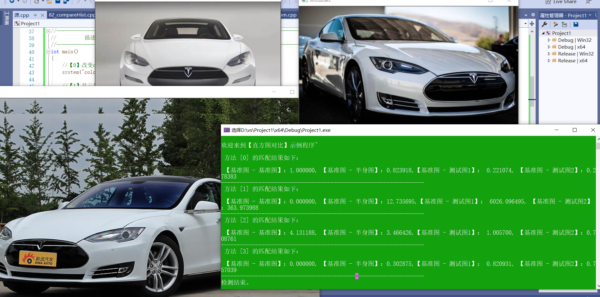

## 霍夫变换

霍夫变换主要用于，对付图片数据，能够提供一种方式找到直线/圆，广义上的霍夫变换可以找到你想要的任何你可以描述的特征。

学完霍夫变换，我认为精髓就在于把握特征变换。

一、霍夫变换（Hough）

**基本原理**

一条直线可由两个点A=(X1,Y1)和B=(X2,Y2)确定(笛卡尔坐标)
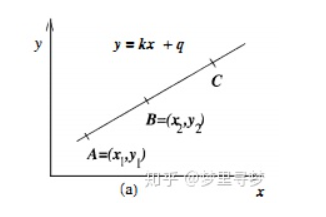

另一方面，y = kx + q，也可以写成关于（k,q）的函数表达式（霍夫空间）：

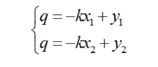

对应的变换可以通过图形直观表示：

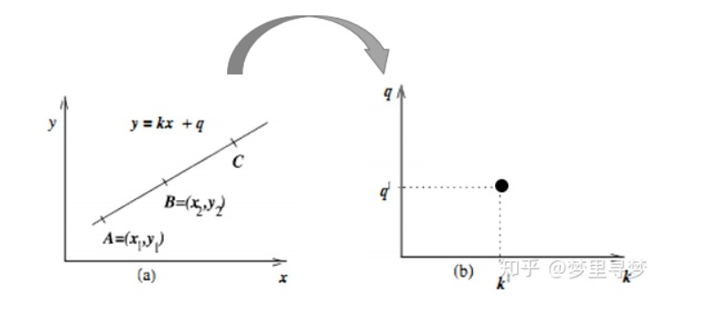

变换后的空间成为霍夫空间。即：笛卡尔坐标系中一条直线，对应霍夫空间的一个点。

反过来同样成立（霍夫空间的一条直线，对应笛卡尔坐标系的一个点）：

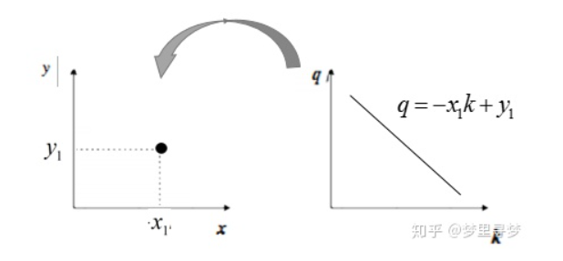

再来看看A、B两个点，对应霍夫空间的情形：

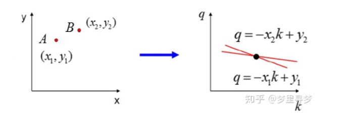

一步步来，再看一下三个点共线的情况：

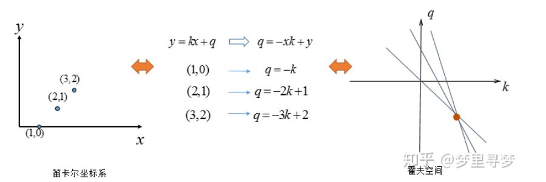

可以看出如果笛卡尔坐标系的点共线，这些点在霍夫空间对应的直线交于一点：这也是必然，共线只有一种取值可能。

如果不止一条直线呢？再看看多个点的情况（有两条直线）：

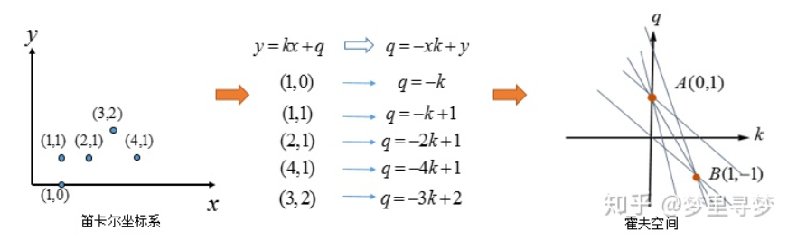

其实（3，2）与（4，1）也可以组成直线，只不过它有两个点确定，而图中A、B两点是由三条直线汇成，这也是霍夫变换的后处理的基本方式：选择由尽可能多直线汇成的点。

看看，霍夫空间：选择由三条交汇直线确定的点（中间图），对应的笛卡尔坐标系的直线（右图）。

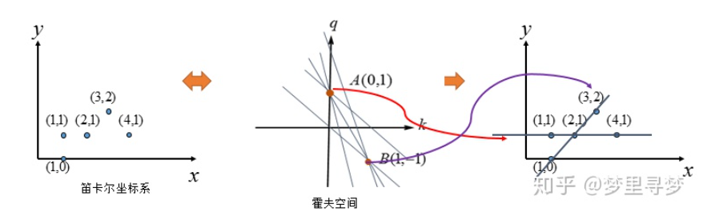

## 寻找绘制轮廓

```c++

//--------------------------------------【程序说明】-------------------------------------------
//		程序说明：《OpenCV3编程入门》OpenC3版书本配套示例程序70
//		程序描述：查找并绘制轮廓综合示例
//		开发测试所用操作系统： Windows 7 64bit
//		开发测试所用IDE版本：Visual Studio 2010
//		开发测试所用OpenCV版本：	3.0 beta
//		2014年11月 Created by @浅墨_毛星云
//		2014年12月 Revised by @浅墨_毛星云
//------------------------------------------------------------------------------------------------


//---------------------------------【头文件、命名空间包含部分】----------------------------
//		描述：包含程序所使用的头文件和命名空间
//------------------------------------------------------------------------------------------------
#include "opencv2/highgui/highgui.hpp"
#include "opencv2/imgproc/imgproc.hpp"
#include <iostream>
using namespace cv;
using namespace std;


//-----------------------------------【宏定义部分】-------------------------------------------- 
//		描述：定义一些辅助宏 
//------------------------------------------------------------------------------------------------ 
#define WINDOW_NAME1 "【原始图窗口】"			//为窗口标题定义的宏 
#define WINDOW_NAME2 "【轮廓图】"					//为窗口标题定义的宏 


//-----------------------------------【全局变量声明部分】--------------------------------------
//		描述：全局变量的声明
//-----------------------------------------------------------------------------------------------
Mat g_srcImage;
Mat g_grayImage;
int g_nThresh = 80;
int g_nThresh_max = 255;
RNG g_rng(12345);
Mat g_cannyMat_output;
vector<vector<Point>> g_vContours;
vector<Vec4i> g_vHierarchy;


//-----------------------------------【全局函数声明部分】--------------------------------------
//		描述：全局函数的声明
//-----------------------------------------------------------------------------------------------
static void ShowHelpText();
void on_ThreshChange(int, void*);


//-----------------------------------【main( )函数】--------------------------------------------
//		描述：控制台应用程序的入口函数，我们的程序从这里开始执行
//-----------------------------------------------------------------------------------------------
int main(int argc, char** argv)
{
	//【0】改变console字体颜色
	system("color 1F");

	//【0】显示欢迎和帮助文字
	ShowHelpText();

	// 加载源图像
	g_srcImage = imread("D:/image/2.jpg", 1);
	if (!g_srcImage.data) { printf("读取图片错误，请确定目录下是否有imread函数指定的图片存在~！ \n"); return false; }

	// 转成灰度并模糊化降噪
	cvtColor(g_srcImage, g_grayImage, COLOR_BGR2GRAY);
	blur(g_grayImage, g_grayImage, Size(3, 3));

	// 创建窗口
	namedWindow(WINDOW_NAME1, WINDOW_AUTOSIZE);
	imshow(WINDOW_NAME1, g_srcImage);

	//创建滚动条并初始化
	createTrackbar("canny阈值", WINDOW_NAME1, &g_nThresh, g_nThresh_max, on_ThreshChange);
	on_ThreshChange(0, 0);

	waitKey(0);
	return(0);
}

//-----------------------------------【on_ThreshChange( )函数】------------------------------  
//      描述：回调函数
//----------------------------------------------------------------------------------------------  
void on_ThreshChange(int, void*)
{

	// 用Canny算子检测边缘
	Canny(g_grayImage, g_cannyMat_output, g_nThresh, g_nThresh * 2, 3);

	// 寻找轮廓
	findContours(g_cannyMat_output, g_vContours, g_vHierarchy, RETR_TREE, CHAIN_APPROX_SIMPLE, Point(0, 0));

	// 绘出轮廓
	Mat drawing = Mat::zeros(g_cannyMat_output.size(), CV_8UC3);
	for (int i = 0; i < g_vContours.size(); i++)
	{
		Scalar color = Scalar(g_rng.uniform(0, 255), g_rng.uniform(0, 255), g_rng.uniform(0, 255));//任意值
		drawContours(drawing, g_vContours, i, color, 2, 8, g_vHierarchy, 0, Point());
	}

	// 显示效果图
	imshow(WINDOW_NAME2, drawing);
}


//-----------------------------------【ShowHelpText( )函数】----------------------------------  
//      描述：输出一些帮助信息  
//----------------------------------------------------------------------------------------------  
static void ShowHelpText()
{
	//输出欢迎信息和OpenCV版本
	printf("\n\n\t\t\t非常感谢购买《OpenCV3编程入门》一书！\n");
	printf("\n\n\t\t\t此为本书OpenCV3版的第70个配套示例程序\n");
	printf("\n\n\t\t\t   当前使用的OpenCV版本为：" CV_VERSION);
	printf("\n\n  ----------------------------------------------------------------------------\n");

	//输出一些帮助信息  
	printf("\n\n\t欢迎来到【在图形中寻找轮廓】示例程序~\n\n");
	printf("\n\n\t按键操作说明: \n\n"
		"\t\t键盘按键任意键- 退出程序\n\n"
		"\t\t滑动滚动条-改变阈值\n");
}

```

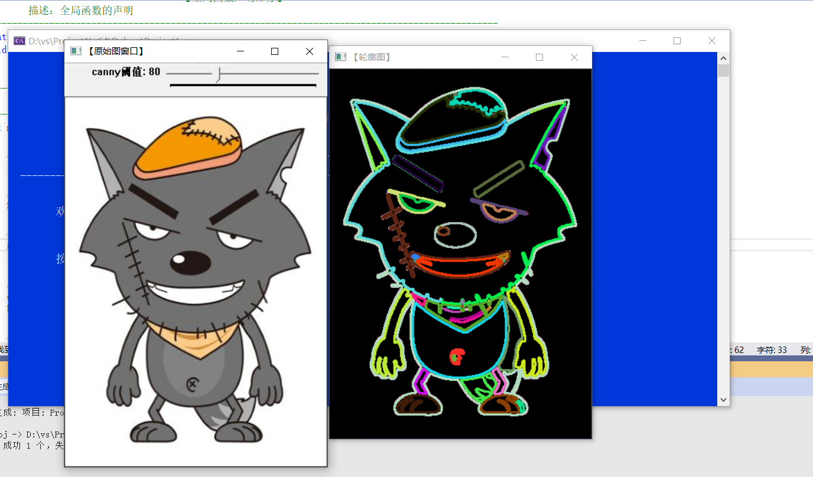

## 凸包

```c++

//--------------------------------------【程序说明】-------------------------------------------
//		程序说明：《OpenCV3编程入门》OpenCV2版书本配套示例程序72
//		程序描述：寻找和绘制物体的凸包
//		开发测试所用操作系统： Windows 7 64bit
//		开发测试所用IDE版本：Visual Studio 2010
//		开发测试所用OpenCV版本：	3.0 beta
//		2014年11月 Created by @浅墨_毛星云
//		2014年12月 Revised by @浅墨_毛星云
//------------------------------------------------------------------------------------------------


//---------------------------------【头文件、命名空间包含部分】----------------------------
//		描述：包含程序所使用的头文件和命名空间
//------------------------------------------------------------------------------------------------
#include "opencv2/highgui/highgui.hpp"
#include "opencv2/imgproc/imgproc.hpp"
#include <iostream>
using namespace cv;
using namespace std;


//-----------------------------------【宏定义部分】-------------------------------------------- 
//  描述：定义一些辅助宏 
//------------------------------------------------------------------------------------------------ 
#define WINDOW_NAME1 "【原始图窗口】"					//为窗口标题定义的宏 
#define WINDOW_NAME2 "【效果图窗口】"					//为窗口标题定义的宏 


//-----------------------------------【全局变量声明部分】--------------------------------------
//  描述：全局变量的声明
//-----------------------------------------------------------------------------------------------
Mat g_srcImage; Mat g_grayImage;
int g_nThresh = 50;
int g_maxThresh = 255;
RNG g_rng(12345);
Mat srcImage_copy = g_srcImage.clone();
Mat g_thresholdImage_output;
vector<vector<Point> > g_vContours;
vector<Vec4i> g_vHierarchy;


//-----------------------------------【全局函数声明部分】--------------------------------------
//   描述：全局函数的声明
//-----------------------------------------------------------------------------------------------
static void ShowHelpText();
void on_ThreshChange(int, void*);
void ShowHelpText();

//-----------------------------------【main( )函数】------------------------------------------
//   描述：控制台应用程序的入口函数，我们的程序从这里开始执行
//-----------------------------------------------------------------------------------------------
int main()
{
	system("color 3F");
	ShowHelpText();

	// 加载源图像
	g_srcImage = imread("D:/image/2.jpg", 1);

	// 将原图转换成灰度图并进行模糊降
	cvtColor(g_srcImage, g_grayImage, COLOR_BGR2GRAY);
	blur(g_grayImage, g_grayImage, Size(3, 3));

	// 创建原图窗口并显示
	namedWindow(WINDOW_NAME1, WINDOW_AUTOSIZE);
	imshow(WINDOW_NAME1, g_srcImage);

	//创建滚动条
	createTrackbar(" 阈值:", WINDOW_NAME1, &g_nThresh, g_maxThresh, on_ThreshChange);
	on_ThreshChange(0, 0);//调用一次进行初始化

	waitKey(0);
	return(0);
}

//-----------------------------------【thresh_callback( )函数】----------------------------------  
//      描述：回调函数
//----------------------------------------------------------------------------------------------  
void on_ThreshChange(int, void*)
{
	// 对图像进行二值化，控制阈值
	threshold(g_grayImage, g_thresholdImage_output, g_nThresh, 255, THRESH_BINARY);

	// 寻找轮廓
	findContours(g_thresholdImage_output, g_vContours, g_vHierarchy, RETR_TREE, CHAIN_APPROX_SIMPLE, Point(0, 0));

	// 遍历每个轮廓，寻找其凸包
	vector<vector<Point> >hull(g_vContours.size());
	for (unsigned int i = 0; i < g_vContours.size(); i++)
	{
		convexHull(Mat(g_vContours[i]), hull[i], false);
	}

	// 绘出轮廓及其凸包
	Mat drawing = Mat::zeros(g_thresholdImage_output.size(), CV_8UC3);
	for (unsigned int i = 0; i < g_vContours.size(); i++)
	{
		Scalar color = Scalar(g_rng.uniform(0, 255), g_rng.uniform(0, 255), g_rng.uniform(0, 255));
		drawContours(drawing, g_vContours, i, color, 1, 8, vector<Vec4i>(), 0, Point());
		drawContours(drawing, hull, i, color, 1, 8, vector<Vec4i>(), 0, Point());
	}

	// 显示效果图
	imshow(WINDOW_NAME2, drawing);
}


//-----------------------------------【ShowHelpText( )函数】-----------------------------
//		 描述：输出一些帮助信息
//----------------------------------------------------------------------------------------------
void ShowHelpText()
{
	//输出欢迎信息和OpenCV版本
	printf("\n\n\t\t\t非常感谢购买《OpenCV3编程入门》一书！\n");
	printf("\n\n\t\t\t此为本书OpenCV3版的第72个配套示例程序\n");
	printf("\n\n\t\t\t   当前使用的OpenCV版本为：" CV_VERSION);
	printf("\n\n  ----------------------------------------------------------------------------\n");
}

```

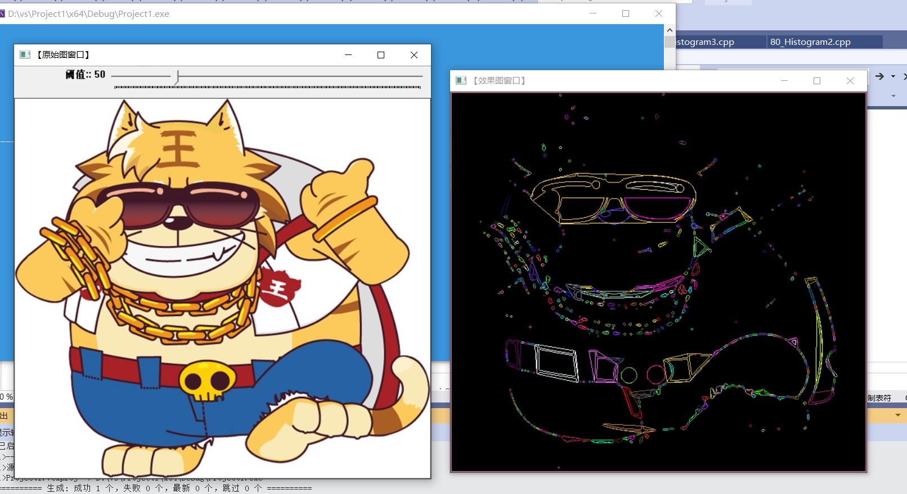

## 分水岭算法

```c++
//--------------------------------------【程序说明】-------------------------------------------
//		程序说明：《OpenCV3编程入门》OpenCV3版书本配套示例程序77
//		程序描述：分水岭算法综合示例
//		开发测试所用操作系统： Windows 7 64bit
//		开发测试所用IDE版本：Visual Studio 2010
//		开发测试所用OpenCV版本：	3.0 beta
//		2014年11月 Created by @浅墨_毛星云
//		2014年12月 Revised by @浅墨_毛星云
//------------------------------------------------------------------------------------------------


//---------------------------------【头文件、命名空间包含部分】----------------------------
//		描述：包含程序所使用的头文件和命名空间
//------------------------------------------------------------------------------------------------
#include "opencv2/imgproc/imgproc.hpp"
#include "opencv2/highgui/highgui.hpp"
#include <iostream>
using namespace cv;
using namespace std;

//-----------------------------------【宏定义部分】-------------------------------------------- 
//  描述：定义一些辅助宏 
//------------------------------------------------------------------------------------------------ 
#define WINDOW_NAME1 "【程序窗口1】"        //为窗口标题定义的宏 
#define WINDOW_NAME2 "【分水岭算法效果图】"        //为窗口标题定义的宏

//-----------------------------------【全局函变量声明部分】--------------------------------------
//		描述：全局变量的声明
//-----------------------------------------------------------------------------------------------
Mat g_maskImage, g_srcImage;
Point prevPt(-1, -1);

//-----------------------------------【全局函数声明部分】--------------------------------------
//		描述：全局函数的声明
//-----------------------------------------------------------------------------------------------
static void ShowHelpText();
static void on_Mouse( int event, int x, int y, int flags, void* );


//-----------------------------------【main( )函数】--------------------------------------------
//		描述：控制台应用程序的入口函数，我们的程序从这里开始执行
//-----------------------------------------------------------------------------------------------
int main( int argc, char** argv )
{	
	//【0】改变console字体颜色
	system("color 6F"); 

	//【0】显示帮助文字
	ShowHelpText( );

	//【1】载入原图并显示，初始化掩膜和灰度图
	g_srcImage = imread("1.jpg", 1);
	imshow( WINDOW_NAME1, g_srcImage );
	Mat srcImage,grayImage;
	g_srcImage.copyTo(srcImage);
	cvtColor(g_srcImage, g_maskImage, COLOR_BGR2GRAY);
	cvtColor(g_maskImage, grayImage, COLOR_GRAY2BGR);
	g_maskImage = Scalar::all(0);

	//【2】设置鼠标回调函数
	setMouseCallback( WINDOW_NAME1, on_Mouse, 0 );

	//【3】轮询按键，进行处理
	while(1)
	{
		//获取键值
		int c = waitKey(0);

		//若按键键值为ESC时，退出
		if( (char)c == 27 )
			break;

		//按键键值为2时，恢复源图
		if( (char)c == '2' )
		{
			g_maskImage = Scalar::all(0);
			srcImage.copyTo(g_srcImage);
			imshow( "image", g_srcImage );
		}

		//若检测到按键值为1或者空格，则进行处理
		if( (char)c == '1' || (char)c == ' ' )
		{
			//定义一些参数
			int i, j, compCount = 0;
			vector<vector<Point> > contours;
			vector<Vec4i> hierarchy;

			//寻找轮廓
			findContours(g_maskImage, contours, hierarchy, RETR_CCOMP, CHAIN_APPROX_SIMPLE);

			//轮廓为空时的处理
			if( contours.empty() )
				continue;

			//拷贝掩膜
			Mat maskImage(g_maskImage.size(), CV_32S);
			maskImage = Scalar::all(0);

			//循环绘制出轮廓
			for( int index = 0; index >= 0; index = hierarchy[index][0], compCount++ )
				drawContours(maskImage, contours, index, Scalar::all(compCount+1), -1, 8, hierarchy, INT_MAX);

			//compCount为零时的处理
			if( compCount == 0 )
				continue;

			//生成随机颜色
			vector<Vec3b> colorTab;
			for( i = 0; i < compCount; i++ )
			{
				int b = theRNG().uniform(0, 255);
				int g = theRNG().uniform(0, 255);
				int r = theRNG().uniform(0, 255);

				colorTab.push_back(Vec3b((uchar)b, (uchar)g, (uchar)r));
			}

			//计算处理时间并输出到窗口中
			double dTime = (double)getTickCount();
			watershed( srcImage, maskImage );
			dTime = (double)getTickCount() - dTime;
			printf( "\t处理时间 = %gms\n", dTime*1000./getTickFrequency() );

			//双层循环，将分水岭图像遍历存入watershedImage中
			Mat watershedImage(maskImage.size(), CV_8UC3);
			for( i = 0; i < maskImage.rows; i++ )
				for( j = 0; j < maskImage.cols; j++ )
				{
					int index = maskImage.at<int>(i,j);
					if( index == -1 )
						watershedImage.at<Vec3b>(i,j) = Vec3b(255,255,255);
					else if( index <= 0 || index > compCount )
						watershedImage.at<Vec3b>(i,j) = Vec3b(0,0,0);
					else
						watershedImage.at<Vec3b>(i,j) = colorTab[index - 1];
				}

				//混合灰度图和分水岭效果图并显示最终的窗口
				watershedImage = watershedImage*0.5 + grayImage*0.5;
				imshow( WINDOW_NAME2, watershedImage );
		}
	}

	return 0;
}


//-----------------------------------【onMouse( )函数】---------------------------------------
//		描述：鼠标消息回调函数
//-----------------------------------------------------------------------------------------------
static void on_Mouse( int event, int x, int y, int flags, void* )
{
	//处理鼠标不在窗口中的情况
	if( x < 0 || x >= g_srcImage.cols || y < 0 || y >= g_srcImage.rows )
		return;

	//处理鼠标左键相关消息
	if( event == EVENT_LBUTTONUP || !(flags & EVENT_FLAG_LBUTTON) )
		prevPt = Point(-1,-1);
	else if( event == EVENT_LBUTTONDOWN )
		prevPt = Point(x,y);

	//鼠标左键按下并移动，绘制出白色线条
	else if( event == EVENT_MOUSEMOVE && (flags & EVENT_FLAG_LBUTTON) )
	{
		Point pt(x, y);
		if( prevPt.x < 0 )
			prevPt = pt;
		line( g_maskImage, prevPt, pt, Scalar::all(255), 5, 8, 0 );
		line( g_srcImage, prevPt, pt, Scalar::all(255), 5, 8, 0 );
		prevPt = pt;
		imshow(WINDOW_NAME1, g_srcImage);
	}
}


//-----------------------------------【ShowHelpText( )函数】----------------------------------  
//      描述：输出一些帮助信息  
//----------------------------------------------------------------------------------------------  
static void ShowHelpText()  
{  
	//输出欢迎信息和OpenCV版本
	printf("\n\n\t\t\t非常感谢购买《OpenCV3编程入门》一书！\n");
	printf("\n\n\t\t\t此为本书OpenCV3版的第77个配套示例程序\n");
	printf("\n\n\t\t\t   当前使用的OpenCV版本为：" CV_VERSION );
	printf("\n\n  ----------------------------------------------------------------------------\n");

	//输出一些帮助信息  
	printf(  "\n\n\n\t欢迎来到【分水岭算法】示例程序~\n\n");  
	printf(  "\t请先用鼠标在图片窗口中标记出大致的区域，\n\n\t然后再按键【1】或者【SPACE】启动算法。"
		"\n\n\t按键操作说明: \n\n"  
		"\t\t键盘按键【1】或者【SPACE】- 运行的分水岭分割算法\n"  
		"\t\t键盘按键【2】- 恢复原始图片\n"  
		"\t\t键盘按键【ESC】- 退出程序\n\n\n");  
}  

```

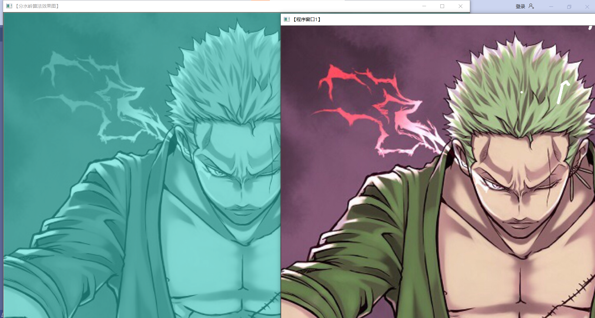

## 图像修补

```c++
//--------------------------------------【程序说明】-------------------------------------------
//		程序说明：《OpenCV3编程入门》OpenCV2版书本配套示例程序78
//		程序描述：图像修补示例
//		开发测试所用操作系统： Windows 7 64bit
//		开发测试所用IDE版本：Visual Studio 2010
//		开发测试所用OpenCV版本：	3.0 beta
//		2014年11月 Created by @浅墨_毛星云
//		2014年12月 Revised by @浅墨_毛星云
//------------------------------------------------------------------------------------------------


//---------------------------------【头文件、命名空间包含部分】----------------------------
//		描述：包含程序所使用的头文件和命名空间
//------------------------------------------------------------------------------------------------
#include "opencv2/highgui/highgui.hpp"
#include "opencv2/imgproc/imgproc.hpp"
#include "opencv2/photo/photo.hpp"
#include <iostream>
using namespace cv;
using namespace std;


//-----------------------------------【宏定义部分】-------------------------------------------- 
//  描述：定义一些辅助宏 
//----------------------------------------------------------------------------------------------
#define WINDOW_NAME0 "【原始图参考】"        //为窗口标题定义的宏 
#define WINDOW_NAME1 "【原始图】"        //为窗口标题定义的宏 
#define WINDOW_NAME2 "【修补后的效果图】"        //为窗口标题定义的宏 


//-----------------------------------【全局变量声明部分】--------------------------------------
//          描述：全局变量声明
//-----------------------------------------------------------------------------------------------
Mat srcImage0,srcImage1, inpaintMask;
Point previousPoint(-1,-1);//原来的点坐标


//-----------------------------------【ShowHelpText( )函数】----------------------------------
//          描述：输出一些帮助信息
//----------------------------------------------------------------------------------------------
static void ShowHelpText( )
{
	//输出欢迎信息和OpenCV版本
	printf("\n\n\t\t\t非常感谢购买《OpenCV3编程入门》一书！\n");
	printf("\n\n\t\t\t此为本书OpenCV3版的第78个配套示例程序\n");
	printf("\n\n\t\t\t   当前使用的OpenCV版本为：" CV_VERSION );
	printf("\n\n  ----------------------------------------------------------------------------\n");

	//输出一些帮助信息
	printf("\n\n\n\t欢迎来到【图像修复】示例程序~\n"); 
	printf(  "\n\t请在进行图像修复操作之前，在【原始图】窗口中进行适量的绘制" 
		"\n\n\t按键操作说明: \n\n" 
		"\t\t【鼠标左键】-在图像上绘制白色线条\n\n"
		"\t\t键盘按键【ESC】- 退出程序\n\n" 
		"\t\t键盘按键【1】或【SPACE】-进行图像修复操作 \n\n"   );  
}


//-----------------------------------【On_Mouse( )函数】--------------------------------
//          描述：响应鼠标消息的回调函数
//----------------------------------------------------------------------------------------------
static void On_Mouse( int event, int x, int y, int flags, void* )
{
	//鼠标左键弹起消息
	if( event == EVENT_LBUTTONUP || !(flags & EVENT_FLAG_LBUTTON) )
		previousPoint = Point(-1,-1);
	//鼠标左键按下消息
	else if( event == EVENT_LBUTTONDOWN )
		previousPoint = Point(x,y);
	//鼠标按下并移动，进行绘制
	else if( event == EVENT_MOUSEMOVE && (flags & EVENT_FLAG_LBUTTON) )
	{
		Point pt(x,y);
		if( previousPoint.x < 0 )
			previousPoint = pt;
		//绘制白色线条
		line( inpaintMask, previousPoint, pt, Scalar::all(255), 5, 8, 0 );
		line( srcImage1, previousPoint, pt, Scalar::all(255), 5, 8, 0 );
		previousPoint = pt;
		imshow(WINDOW_NAME1, srcImage1);
	}
}


//--------------------------------------【main( )函数】-----------------------------------------
//          描述：控制台应用程序的入口函数，我们的程序从这里开始执行
//-----------------------------------------------------------------------------------------------
int main( int argc, char** argv )
{
	//改变console字体颜色
	system("color 2F"); 

	//显示帮助文字
	ShowHelpText();

	//载入原始图并进行掩膜的初始化
	Mat srcImage = imread("1.jpg", -1);
	if(!srcImage.data ) { printf("读取图片错误，请确定目录下是否有imread函数指定图片存在~！ \n"); return false; } 
	srcImage0 = srcImage.clone();
	srcImage1 = srcImage.clone();
	inpaintMask = Mat::zeros(srcImage1.size(), CV_8U);

	//显示原始图参考
	imshow(WINDOW_NAME0, srcImage0);
	//显示原始图
	imshow(WINDOW_NAME1, srcImage1);
	//设置鼠标回调消息
	setMouseCallback( WINDOW_NAME1, On_Mouse, 0 );

	//轮询按键，根据不同的按键进行处理
	while (1)
	{
		//获取按键键值
		char c = (char)waitKey();

		//键值为ESC，程序退出
		if( c == 27 )
			break;

		//键值为2，恢复成原始图像
		if( c == '2' )
		{
			inpaintMask = Scalar::all(0);
			srcImage.copyTo(srcImage1);
			imshow(WINDOW_NAME1, srcImage1);
		}

		//键值为1或者空格，进行图像修补操作
		if( c == '1' || c == ' ' )
		{
			Mat inpaintedImage;
			inpaint(srcImage1, inpaintMask, inpaintedImage, 3, INPAINT_TELEA);
			imshow(WINDOW_NAME2, inpaintedImage);
		}
	}

	return 0;
}

```
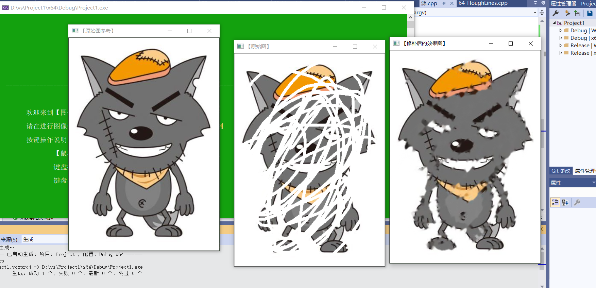

## 总结及其心得体会

学习了边缘检测的一般步骤（滤波、增强、检测），接下来引出Canny边缘检测算子、Sobel算子(离散微分算子)、Laplacian算子(n维欧几里德空间中的一个二阶微分算子)、scharr滤波器(不是算子)。
感觉要想运用这些算子其实并不难，但是要搞清楚它的计算过程还要翻翻前面高数的书了

霍夫变换是一种用来寻找直线的方法，当然运用它，我们先要进行前面边缘检测

直方图均衡化主要作用是扩大图像的动态范围来提示图像效果（通过拉伸像素强度分布范围增强对比度）
接下来对计算直方图calcHist()函数进行实践
之后使用直方图calcHist()函数计算彩色图像的色调显示
接下来绘制同理
我们都是先载入原图、定义变量、calcHist()函数计算图像的直方图然后绘制显示

后面查找并绘制轮廓、寻找物体凸包、分水岭算法及其图像修补，其实我们学习的都是函数，其余就是之前学习的一些处理


