# 第六章 图像处理
## 6.1 线性滤波:方框滤波、均值滤波、高斯滤波
### 6.1.1   平滑处理
平滑处理(smoothing）也称模糊处理(bluring)，是一种简单且使用频率很高的图像处理方法。平滑处理的用途有很多，最常见的是用来减少图像上的噪点或者失真。在涉及到降低图像分辨率时，平滑处理是非常好用的方法。
### 6.1.2图像滤波与滤波器
图像滤波﹐指在尽量保留图像细节特征的条件下对目标图像的噪声进行抑制，是图像预处理中不可缺少的操作，其处理效果的好坏将直接影响到后续图像处理和分析的有效性和可靠性。

消除图像中的噪声成分叫作图像的平滑化或滤波操作。信号或图像的能量大部分集中在幅度谱的低频和中频段，而在较高频段，有用的信息经常被噪声淹没。因此一个能降低高频成分幅度的滤波器就能够减弱噪声的影响。

图像滤波的目的有两个:一个是抽出对象的特征作为图像识别的特征模式;另一个是为适应图像处理的要求，消除图像数字化时所混入的噪声。
而对滤波处理的要求也有两条:一是不能损坏图像的轮廓及边缘等重要信息;二是使图像清晰视觉效果好。

平滑滤波是低频增强的空间域滤波技术。它的目的有两类:一类是模糊;另一类是消除噪音。

空间域的平滑滤波一般采用简单平均法进行，就是求邻近像元点的平均亮度值。邻域的大小与平滑的效果直接相关，邻域越大平滑的效果越好，但邻域过大，平滑也会使边缘信息损失的越大，从而使输出的图像变得模糊，因此需合理选择邻域的大小。

关于滤波器，一种形象的比喻是:可以把滤波器想象成一个包含加权系数的窗口，当使用这个滤波器平滑处理图像时，就把这个窗口放到图像之上，透过这个窗口来看我们得到的图像。

滤波器的种类有很多，在新版本的OpenCV中，提供了如下5种常用的图像平滑处理操作方法，它们分别被封装在单独的函数中，使用起来非常方便。

方框滤波———BoxBlur 函数
均值滤波（邻域平均滤波）———Blur函数
高斯滤波———GaussianBlur函数
中值滤波——medianBlur函数·
双边滤波——bilateralFilter函数

### 6.1.3线性滤波器的简介
线性滤波器:线性滤波器经常用于剔除输入信号中不想要的频率或者从许多频率中选择一个想要的频率。
几种常见的线性滤波器如下。
低通滤波器:允许低频率通过;
高通滤波器允许高频率通过;
带通滤波器:允许一定范围频率通过;
带阻滤波器:阻止一定范围频率通过并且允许其他频率通过;
全通滤波器:允许所有频率通过，仅仅改变相位关系;
陷波滤波器（Band-Stop Filter):阻止一个狭窄频率范围通过，是一种特殊带阻滤波器。

### 6.1.4 方框滤波: boxFilter函数
第一个参数: InputArray类型的src，输入图像，即源图像，填Mat类的对象即可。该函数对通道是独立处理的，且可以处理任意通道数的图片。但需要注意,待处理的图片深度应该是CV_8U、CV_16U、CV_16S.cV_32F、CV_64F之一。
第二个参数:OutputArray类型的 dst，即目标图像，需要和源图片有一样的尺寸和类型。
第三个参数: int类型的ddepth，输出图像的深度。“-1”代表使用原图深度，即src.depth()。
第四个参数:Size类型的ksize，内核的大小。一般用Size(w,h)的写法来表示内核的大小（其中，w为像素宽度，h 为像素高度)。例如，Size(3,3)表示3x3的核大小;Size(5,5)就表示5x5的核大小。
第五个参数:Point类型的anchor，表示锚点（即被平滑的那个点)，注意它有默认值 Point(-1,-1)。如果这个点坐标是负值的话，就表示取核的中心为锚点，所以默认值 Point(-1,-1)表示这个锚点在核的中心。
第六个参数: bool类型的normalize，默认值为true，一个标识符，表示内核是否被其区域归一化（normalized)了。
第七个参数: int类型的borderType，用于推断图像外部像素的某种边界模式。

### 6.1.5  均值滤波: blur函数
第一个参数:InputArray类型的src，输入图像，即源图像，填Mat类的对象即可。该函数对通道是独立处理的，且可以处理任意通道数的图片。但需要注意，待处理的图片深度应该为CV_8U、CV_16U、CV_16s.cV_32F、cV_64F之一。
第二个参数:OutputArray类型的 dst，即目标图像，需要和源图片有一样的尺寸和类型。比如可以用Mat:Clone，以源图片为模板，来初始化得到如假包换的目标图。
第三个参数:Size类型（对Size类型稍后有讲解）的ksize，内核的大小。一般用Size(w,h)的写法来表示内核的大小(其中w为像素宽度，h为像素高度)。例如，Size(3,3)表示3x3的核大小，Size(5,5)就表示5x5的核大小。第四个参数:Point类型的anchor，表示锚点（即被平滑的那个点)，注意它有默认值 Point(-1,-1)。如果这个点坐标是负值的话，就表示取核的中心为锚点，所以默认值 Point(-1,-1)表示这个锚点在核的中心。
第五个参数: int类型的borderType，用于推断图像外部像素的某种边界模式。有默认值BORDER_DEFAULT，我们一般不去管它。

### 6.1.6 高斯滤波:GaussianBlur函数
第一个参数: InputArray类型的src，输入图像，即源图像，填Mat类的对象即可。它可以是单独的任意通道数的图片。但需要注意，图片深度应该为CV_8U、CV_16U、CV_16S、cV_32F、CV_64F之一。
第二个参数:OutputArray类型的 dst，即目标图像，需要和源图片有一样的尺寸和类型。比如可以用Mat::Clone，以源图片为模板，来初始化得到如假包换的目标图。
第三个参数: Size 类型的 ksize 高斯内核的大小。其中 ksize.width和ksize.height可以不同，但它们都必须为正数和奇数，也可以为零。它们都是由sigma计算而来的。
第四个参数: double类型的sigmaX，表示高斯核函数在X方向的的标准偏差。
第五个参数: double类型的sigmaY，表示高斯核函数在Y方向的的标准偏差。若sigmaY为零，就将它设为sigmaX，如果sigmaX和 sigmaY都是0,那么就由ksize.width和 ksize.height计算出来。为了结果的正确性着想，最好是把第三个参数Size、第四个参数sigmaX和第五个参数sigmaY全部指定到。
第六个参数: int类型的borderType，用于推断图像外部像素的某种边界模式。注意它有默认值BORDER_DEFAULT。

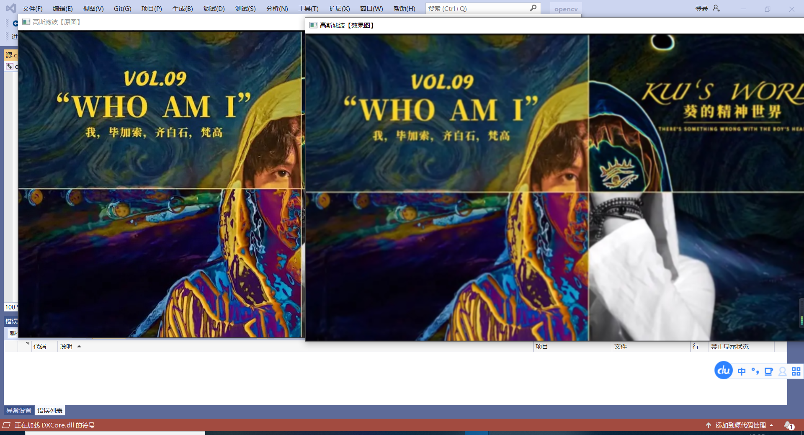

### 6.1.7 图像线性滤波综合示例
这个示例程序中可以用滑动条来控制三种线性滤波的核参数值。通过滑动滚动条，就可以控制图像在三种线性滤波下的模糊度，有一定的可玩性。

##  6.2 非线性滤波:中值滤波、双边滤波
###  6.2.1非线性滤波概述
在6.1节中，我们所考虑的滤波器都是线性的，即两个信号之和的响应和它们各自响应之和相等。换句话说，每个像素的输出值是一些输入像素的加权和。线性滤波器易于构造，并且易于从频率响应角度来进行分析。
然而，在很多情况下，使用邻域像素的非线性滤波会得到更好的效果。比如在噪声是散粒噪声而不是高斯噪声，即图像偶尔会出现很大的值的时候，用高斯滤波器对图像进行模糊的话，噪声像素是不会被去除的，它们只是转换为更为柔和但仍然可见的散粒。这就到了中值滤波登场的时候了。

### 6.2.2中值滤波
中值滤波(Median filter）是一种典型的非线性滤波技术，基本思想是用像素点邻域灰度值的中值来代替该像素点的灰度值，该方法在去除脉冲噪声、椒盐噪声的同时又能保留图像的边缘细节。

中值滤波是基于排序统计理论的一种能有效抑制噪声的非线性信号处理技
术，其基本原理是把数字图像或数字序列中一点的值用该点的一个邻域中各点值的中值代替，让周围的像素值接近真实值，从而消除孤立的噪声点。这对于斑点噪声 (speckle noise）和椒盐噪声(salt-and-pepper noise）来说尤其有用，因为它不依赖于邻域内那些与典型值差别很大的值。中值滤波器在处理连续图像窗函数时与线性滤波器的工作方式类似，但滤波过程却不再是加权运算。

中值滤波在一定的条件下可以克服常见线性滤波器，如最小均方滤波、方框滤波器、均值滤波等带来的图像细节模糊，而且对滤除脉冲干扰及图像扫描噪声非常有效，也常用于保护边缘信息。保存边缘的特性使它在不希望出现边缘模糊的场合也很有用，是非常经典的平滑噪声处理方法。
·中值滤波与均值滤波器比较
优势:在均值滤波器中，由于噪声成分被放入平均计算中，所以输出受到了噪声的影响。但是在中值滤波器中，由于噪声成分很难选上，所以几乎不会影响到输出。因此同样用3×3区域进行处理，中值滤波消除的噪声能力更胜一筹。中值滤波无论是在消除噪声还是保存边缘方面都是一个不错的方法。
劣势:中值滤波花费的时间是均值滤波的5倍以上。

顾名思义，中值滤波选择每个像素的邻域像素中的中值作为输出，或者说中值滤波将每一像素点的灰度值设置为该点某邻域窗口内的所有像素点灰度值的中值。

### 6.2.3双边滤波
双边滤波（Bilateral filter）是一种非线性的滤波方法，是结合图像的空间邻近度和像素值相似度的一种折中处理，同时考虑空域信息和灰度相似性，达到保边去噪的目的，具有简单、非迭代、局部的特点。
双边滤波器的好处是可以做边缘保存(edge preserving)。以往常用维纳滤波或者高斯滤波去降噪，但二者都会较明显地模糊边缘，对于高频细节的保护效果并不明显。双边滤波器顾名思义，比高斯滤波多了一个高斯方差sigma-d，它是基于空间分布的高斯滤波函数，所以在边缘附近，离得较远的像素不会对边缘上的像素值影响太多，这样就保证了边缘附近像素值的保存。但是，由于保存了过多的高频信息，对于彩色图像里的高频噪声，双边滤波器不能够干净地滤掉，只能对于低频信息进行较好地滤波。

### 6.2.4 中值滤波: medianBlur函数
第一个参数，InputArray类型的src，函数的输入参数，填1、3或者4通道的Mat类型的图像。当ksize为3或者5的时候，图像深度需为CV_8U、CV_16U、CV_32F其中之一，而对于较大孔径尺寸的图片，它只能是cV_8U。
第二个参数:OutputArray类型的 dst，即目标图像，函数的输出参数，需要和源图片有一样的尺寸和类型。我们可以用Mat::Clone，以源图片为模板，来初始化得到如假包换的目标图。
第三个参数: int类型的ksize，孔径的线性尺寸( aperture linear size)，注意这个参数必须是大于1的奇数，比如:3、5、7、9……

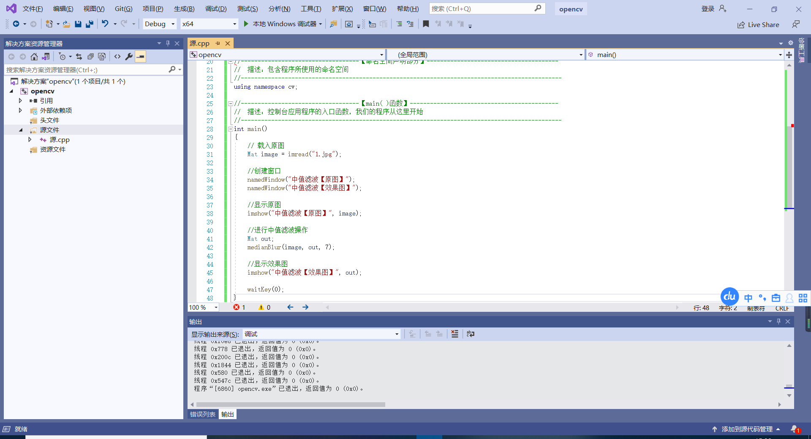

### 6.2.5 双边滤波: bilateralFilter 函数
第一个参数:InputArray类型的src，输入图像，即源图像，需要为8位或者浮点型单通道、三通道的图像。
第二个参数:OutputArray类型的 dst，即目标图像，需要和源图片有一样的尺寸和类型。
第三个参数: int类型的d，表示在过滤过程中每个像素邻域的直径。如果这个值被设为非正数，那么 OpenCV会从第五个参数sigmaSpace来计算出它。
第四个参数:double 类型的sigmaColor，颜色空间滤波器的sigma值。这个参数的值越大，就表明该像素邻域内有越宽广的颜色会被混合到一起，产生较大的半相等颜色区域。
第五个参数: double类型的sigmaSpace，坐标空间中滤波器的sigma值，坐标空间的标注方差。它的数值越大，意味着越远的像素会相互影响，从而使更大的区域中足够相似的颜色获取相同的颜色。当d>0时，d指定了邻域大小且与sigmaSpace无关。否则，d正比于sigmaSpace。
第六个参数: int类型的 borderType，用于推断图像外部像素的某种边界模式。注意它有默认值BORDER_DEFAULT。

### 6.2.6 OpenCV中的5种图像滤波综合示例
在下面这个示例程序中，可以用滑动条来控制我们学习到的各种滤波（方框滤波、均值滤波、高斯滤波、中值滤波、双边滤波）的参数值，通过滑动滚动条，就可以控制图像在各种平滑处理下的模糊度，有一定的可玩性。详细注释的完整代码如下。

## 6.3 形态学滤波（1):腐蚀与膨胀
### 6.3.1 形态学概述
形态学( morphology)一词通常表示生物学的一个分支，该分支主要研究动植物的形态和结构。而我们图像处理中的形态学，往往指的是数学形态学。下面一起来了解数学形态学的概念。
数学形态学(Mathematical morphology）是一门建立在格论和拓扑学基础之上的图像分析学科，是数学形态学图像处理的基本理论。其基本的运算包括:二值腐蚀和膨胀、二值开闭运算、骨架抽取、极限腐蚀、击中击不中变换、形态学梯度、Top-hat变换、颗粒分析、流域变换、灰值腐蚀和膨胀、灰值开闭运算、灰值形态学梯度等。
简单来讲，形态学操作就是基于形状的一系列图像处理操作。OpenCV为进行图像的形态学变换提供了快捷、方便的函数。最基本的形态学操作有两种，分别是:膨胀（ dilate）与腐蚀( erode)。
膨胀与腐蚀能实现多种多样的功能，主要如下。·消除噪声;
·分割(isolate）出独立的图像元素，在图像中连接(join）相邻的元素;·寻找图像中的明显的极大值区域或极小值区域;
·求出图像的梯度。
### 6.3.2膨胀
膨胀（dilate）就是求局部最大值的操作。从数学角度来说，膨胀或者腐蚀操作就是将图像（或图像的一部分区域，称之为A)与核（称之为B）进行卷积。
核可以是任何形状和大小，它拥有一个单独定义出来的参考点，我们称其为锚点( anchorpoint)。多数情况下，核是一个小的，中间带有参考点和实心正方形或者圆盘。其实，可以把核视为模板或者掩码。
而膨胀就是求局部最大值的操作。核B与图形卷积，即计算核B覆盖的区域的像素点的最大值，并把这个最大值赋值给参考点指定的像素。这样就会使图像中的高亮区域逐渐增长，如图所示。这就是膨胀操作的初衷。

### 6.3.3 膨胀: dilate函数
第一个参数，InputArray类型的src，输入图像，即源图像，填Mat类的对象即可。图像通道的数量可以是任意的,但图像深度应为CV_8U、CV_16U、CV_16S.CV_32F或CV_64F其中之一。
第二个参数，OutputArray类型的 dst，即目标图像，需要和源图片有一样的尺寸和类型。
第三个参数，InputArray类型的kernel，膨胀操作的核。当为NULL时，表示的是使用参考点位于中心3×3的核。
第四个参数，Point类型的anchor，锚的位置，其有默认值(-1,-1)，表示锚位于中心。
第五个参数，int类型的 iterations，迭代使用erode()函数的次数，默认值为1。
第六个参数，int类型的borderType，用于推断图像外部像素的某种边界模式。注意它有默认值BORDER_DEFAULT。
第七个参数，const Scalar&类型的borderValue，当边界为常数时的边界值，有默认值morphologyDefaultBorderValue()，一般不用去管它。需要用到它时，可以看官方文档中的createMorphologyFilter()函数，以得到更详细的解释。

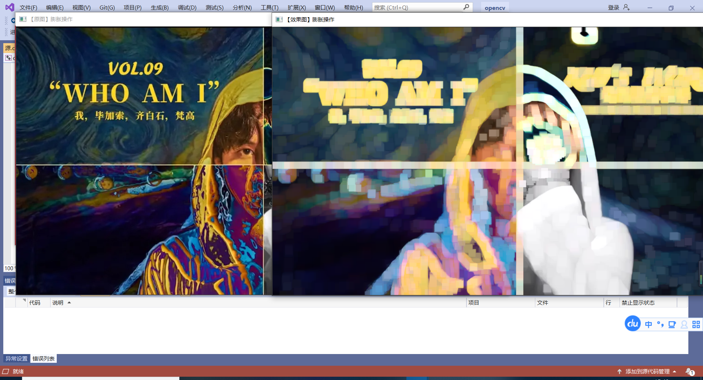

### 6.3.4 腐蚀: erode函数
第一个参数，InputArray类型的src，输入图像，即源图像，填Mat类的对象即可。图像通道的数量可以是任意的,但图像深度应为CV_8U、CV_16U、CV_16S、CV_32F或CV_64F其中之一。
第二个参数，OutputArray类型的 dst，即目标图像，需要和源图片有一样的尺寸和类型。
第三个参数，InputArray类型的kernel，腐蚀操作的内核。为NULL时，表示的是使用参考点位于中心3x3的核。一般使用函数getStructuringElement配合这个参数的使用。getStructuringElement函数会返回指定形状和尺寸的结构元素（内核矩阵，具体看上文中dilate函数的第三个参数讲解部分。第四个参数，Point类型的anchor，锚的位置。其有默认值(-1,-1)，表示锚位于单位（element）的中心，一般不用管它。
第五个参数，int类型的 iterations，迭代使用erode()函数的次数，默认值为1。
第六个参数，int类型的 borderType，用于推断图像外部像素的某种边界模式。注意它有默认值BORDER_DEFAULT。
第七个参数，const Scalar&类型的 borderValue，当边界为常数时的边界值，有默认值morphologyDefaultBorderValue()，一般不用去管它。需要用到它时，可以看官方文档中的 createMorphologyFilter()函数以得到更详细的解释。

### 6.3.5 综合示例:腐蚀与膨胀
此示例程序中的效果图窗口中有两个滑动条第一个滑动条“腐蚀/膨胀”用于在腐蚀/膨胀之间进行切换;第二个滚动条”内核尺寸”用于调节形态学操作时的内核尺寸，以得到效果不同的图像，有一定的可玩性。详细注释的示例程序代码如下。
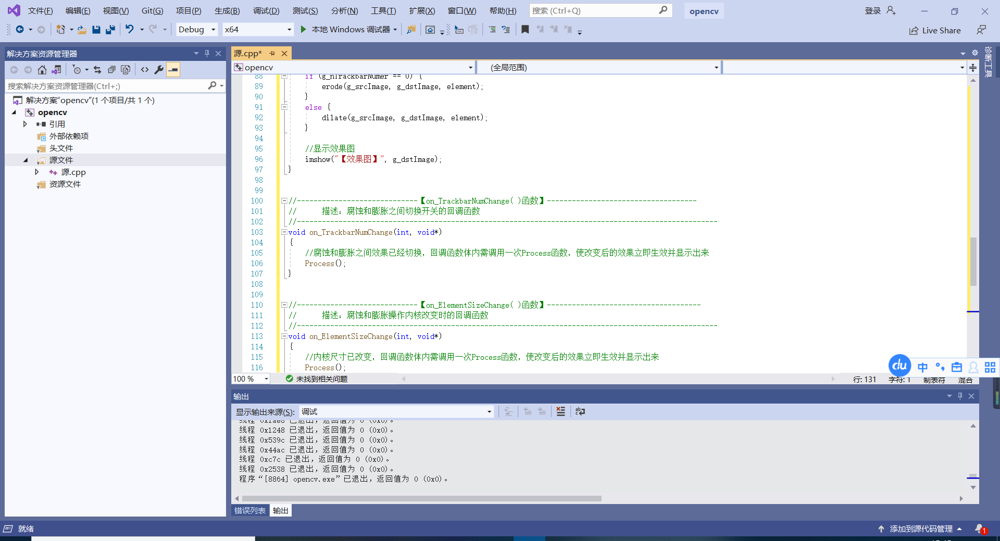

## 6.4形态学滤波(2):开运算、闭运算、形态学梯度、顶帽、黑帽

### 6.4.1   开运算（Opening Operation）
开运算（opening operation）,其实就是先腐蚀后膨胀过得过程，其数学表达式如下：
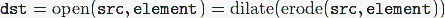                                 
开运算可以用来消除小物体，在纤细点出分离物体，平滑较大物体的边界同时并不明显改变其面积，效果图是这样的：
  

### 6.4.2 闭运算(Closing Operation)
先膨胀后腐蚀的过程称为闭运算（closing operation）,数学表达式如下：
  

闭运算能够排除小型黑洞（黑色区域），如下所示：
  

### 6.4.3 形态学梯度（MorphologicalGradient）
形态学梯度（morphological gradient）为膨胀图与腐蚀图之差，表达式如下：
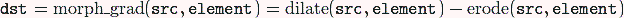                           
对二值图像进行这一操作可以将团块（blob）的边缘突出来。我们可以用形态学梯度来保留物体的边缘轮廓.

### 6.4.4 核心API函数: morphologyEx()
第一个参数，InputArray类型的src，输入图像，即源图像，填Mat类的对象即可。图像位深应该为以下5种之一:CV_8U、CV_16U.CV_16S.cV_32F和CV_64F。
第二个参数，OutputArray 类型的dst，即目标图像，函数的输出参数，需要和源图片有一样的尺寸和类型。
第三个参数，int类型的op，表示形态学运算的类型，可以是如表6.2中任意之一的标识符。
第四个参数，InputArray类型的 kernel，形态学运算的内核。若为NULL，表示的是使用参考点位于中心3×3的核。一般使用函数getStructuringElement配合这个参数的使用。getStructuringElement函数会返回指定形状和尺寸的结构元素（内核矩阵)。
第五个参数，Point类型的 anchor，锚的位置，其有默认值(-1,-1)，表示锚位于中心。
第六个参数，int类型的 iterations，迭代使用函数的次数，默认值1。
第七个参数，int类型的borderType，用于推断图像外部像素的某种边界模式。注意它有默认值BORDER_ CONSTANT。
第八个参数，const Scalar&类型的 borderValue，当边界为常数时的边界值，有默认值 morphologyDefaultBorderValue()，一般不用去管它。需要用到它时，可以看官方文档中的createMorphologyFilter()函数得到更详细的解释。其中的这些操作都可以进行就地（in-place）操作，且对于多通道图像，每一个通道都单独进行操作。
####图像膨胀

####图像腐蚀

####图像开运算

####图像闭运算

####形态学梯度运算

####形态学顶帽运算

####形态学黑帽运算
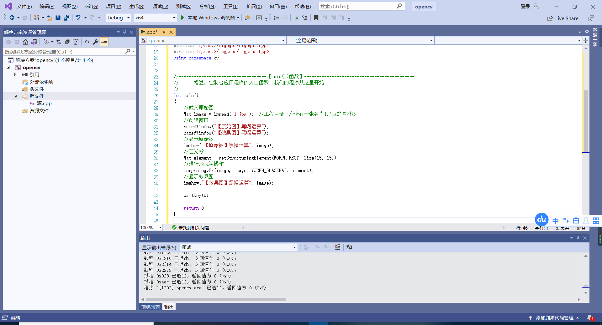

### 6.4.5 综合示例:形态学滤波
这个综合示例程序中，一共会出现4个显示图像的窗口，包括原始图一个，开/闭运算为一个，腐蚀/膨胀为一个，顶帽/黑帽运算为一个。它们分别使用滚动条，来控制得到的形态学效果，且迭代值为10的时候为中间点。另外，还可以通过键盘按键1、2、3以及空格键来调节成不同的元素结构(矩形、椭圆、十字形)。

## 6.5 漫水填充
### 6.5.1 漫水填充的定义
漫水填充法是一种用特定的颜色填充连通区域，通过设置可连通像素的上下限以及连通方式来达到不同的填充效果的方法。漫水填充经常被用来标记或分离图像的一部分，以便对其进行进一步处理或分析，也可以用来从输入图像获取掩码区域，掩码会加速处理过程，或只处理掩码指定的像素点，操作的结果总是某个连续的区域。
另外，floodfill 官方译作“漫水填充”，但是很多朋友们总是喜欢说成“水漫填充”，因为受从小到大深入骨髓的“水漫金山”这个成语的影响。

### 6.5.2 漫水填充法的基本思想
所谓漫水填充，简单来说，就是自动选中了和种子点相连的区域，接着将该区域替换成指定的颜色，这是个非常有用的功能，经常用来标记或者分离图像的一部分进行处理或分析。漫水填充也可以用来从输入图像获取掩码区域，掩码会加速处理过程，或者只处理掩码指定的像素点。
以此填充算法为基础，类似 PhotoShop的魔术棒选择工具就很容易实现了。漫水填充（FloodFill）是查找和种子点连通的颜色相同的点，魔术棒选择工具则是查找和种子点连通的颜色相近的点，把和初始种子像素颜色相近的点压进栈做为新种子。
在OpenCV中，漫水填充是填充算法中最通用的方法。且在 OpenCV2.X中，使用C++重写过的FloodFill 函数有两个版本:一个不带掩膜mask 的版本，和一个带 mask 的版本。这个掩膜mask，就是用于进一步控制哪些区域将被填充颜色(比如说当对同一图像进行多次填充时)。这两个版本的FloodFill，都必须在图像中选择一个种子点，然后把临近区域所有相似点填充上同样的颜色，不同的是，不一定将所有的邻近像素点都染上同一颜色，漫水填充操作的结果总是某个连续的区域。当邻近像素点位于给定的范围(从loDiff到upDiff)内或在原始seedPoint像素值范围内时，FloodFill函数就会为这个点涂上颜色。

### 6.5.3 漫水填充算法:floodFill函数
(1)第一个参数，InputOutputArray类型的image，输入/输出1通道或3通道，8位或浮点图像，具体参数由之后的参数指明。
(2)第二个参数，InputOutputArray类型的 mask,这是第二个版本的floodFill独享的参数,表示操作掩模。它应该为单通道,8位,长和宽上都比输入图像image大两个像素点的图像。第二个版本的floodFill需要使用以及更新掩膜，所以对于这个mask 参数，我们一定要将其准备好并填在此处。需要注意的是，漫水填充不会填充掩膜mask 的非零像素区域。例如，一个边缘检测算子的输出可以用来作为掩膜，以防止填充到边缘。同样的，也可以在多次的函数调用中使用同一个掩膜，以保证填充的区域不会重叠。另外需要注意的是，掩膜mask 会比需填充的图像大，所以mask中与输入图像(x,y)像素点相对应的点的坐标为(x+1,y+l)。
(3）第三个参数，Point类型的 seedPoint，漫水填充算法的起始点。
(4）第四个参数，Scalar类型的newVal，像素点被染色的值，即在重绘区域像素的新值。
(5）第五个参数，Rect*类型的rect，有默认值0，一个可选的参数，用于设置floodFill函数将要重绘区域的最小边界矩形区域。
(6）第六个参数，Scalar类型的 loDiff，有默认值Scalar()，表示当前观察像素值与其部件邻域像素值或者待加入该部件的种子像素之间的亮度或颜色之负差( lower brightness/color difference）的最大值。
(7）第七个参数，Scalar类型的upDiff，有默认值Scalar()，表示当前观察像素值与其部件邻域像素值或者待加入该部件的种子像素之间的亮度或颜色之正差(lower brightness/color difference）的最大值。
(8）第八个参数，int类型的 flags，操作标志符，此参数包含三个部分，比较复杂，我们一起详细看看。
·低八位(第0～7位)用于控制算法的连通性，可取4(4为默认值)或者8。如果设为4，表示填充算法只考虑当前像素水平方向和垂直方向的相邻点;如果设为8，除上述相邻点外，还会包含对角线方向的相邻点。
·高八位部分（16～23位）可以为0或者如下两种选项标识符的组合。
FLOODFILL_FIXED_RANGE:如果设置为这个标识符，就会考虑当前像素与种子像素之间的差，否则就考虑当前像素与其相邻像素的差。也就是说，这个范围是浮动的。
FLOODFILL_MASK_ONLY-如果设置为这个标识符，函数不会去填充改变原始图像（也就是忽略第三个参数newVal) ,而是去填充掩模图像( mask)。这个标识符只对第二个版本的floodFill有用，因第一个版本里面压根就没有mask参数。
·中间八位部分，上面关于高八位FLOODFILL_MASK_ONLY标识符中已经说得很明显，需要输入符合要求的掩码。Floodfill 的 flags参数的中间八位的值就是用于指定填充掩码图像的值的。但如果flags 中间八位的值为0，则掩码会用1来填充。

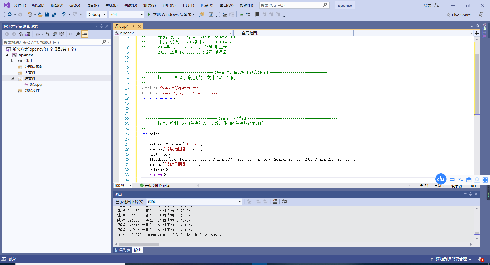

### 6.5.4 漫水填充算法综合示例

## 6.6 图像金字塔与图片尺寸缩放
### 6.6.1 引言
我们经常会将某种尺寸的图像转换为其他尺寸的图像，如果要放大或者缩小图片的尺寸，笼统来说，可以使用OpenCV提供的如下两种方法。
resize函数。这是最直接的方式
pyrUp()、pyrDown()函数。即图像金字塔相关的两个函数，对图像进行向上采样和向下采样的操作。
pyrUp.pyrDown其实和专门用作放大缩小图像尺寸的resize在功能上差不多，披着图像金字塔的皮，说白了还是在对图像进行放大和缩小操作。另外需要指出的是，pyrUp、pyrDown在 OpenCV的 imgproc模块中的 Image Filtering子模块里，而resize在 imgproc模块的Geometric Image Transformations子模块里。

### 6.6.2 尺寸调整:resize()函数
(1）第一个参数，InputArray类型的src，输入图像，即源图像，填Mat类的对象即可。
(2）第二个参数，OutputArray类型的dst，输出图像，当其非零时，有着dsize(第三个参数）的尺寸，或者由src.size()计算出来。
(3）第三个参数，Size类型的 dsize，输出图像的大小。如果它等于零，由下式进行计算:
dsize=Size(round(fx*src.cols)，round(fy*src.rows))
其中，dsize、fx、fy都不能为0。
(4）第四个参数，double类型的fx，沿水平轴的缩放系数，有默认值0，且当其等于0时，由下式进行计算:
(double)dsize.width/src.cols
(5）第五个参数，double类型的fy，沿垂直轴的缩放系数，有默认值0，且当其等于0时，由下式进行计算:
(double)dsize.height/src.rows
(6）第六个参数，int类型的 interpolation，用于指定插值方式，默认为INTER_LINEAR（线性插值)。
可选的插值方式如下:
·INTER_NEAREST——最近邻插值
·INTER_LINEAR——线性插值（默认值)
·INTER_AREA——区域插值（利用像素区域关系的重采样插值)
·INTER CUBIC——三次样条插值（超过4×4像素邻域内的双三次插值)·INTER LANCZOS4——Lanczos插值(超过8×8像素邻域的Lanczos插值)

### 6.6.3 向上采样: pyrUp()函数

第一个参数，InputArray类型的src，输入图像，即源图像，填Mat类的对象即可。
第二个参数，OutputArray类型的 dst，输出图像，和源图片有一样的尺寸和类型。
第三个参数，const Size&类型的dstsize，输出图像的大小;有默认值Size()，即默认情况下，由 Size ( src.cols*2，src.rows*2）来进行计算，且一直需要满足下列条件:
l dstsize.width-src.cols*2 │≤(dstsize.width mod2)l dstsize.height-src.rows*2│ ≤(dstsize.heiht mod2)
第四个参数，int类型的borderType，边界模式，一般不用去管它。

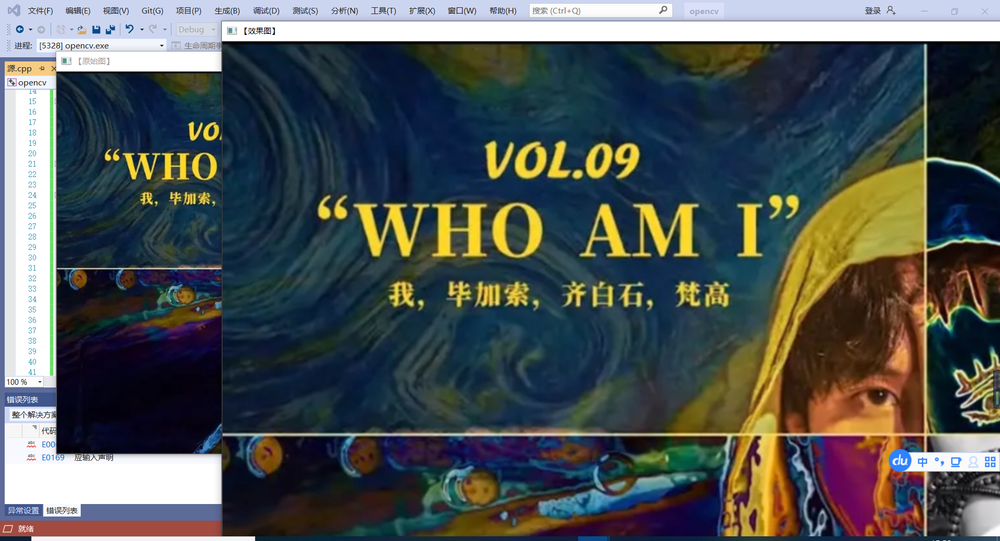

### 6.6.4 采样:pyrDown()函数
第一个参数，InputArray类型的src，输入图像，即源图像，填 Mat类的对象即可。
第二个参数，OutputArray类型的 dst，输出图像，和源图片有一样的尺寸和类型。
第三个参数，const Size&类型的 dstsize，输出图像的大小;有默认值 Size()，即默认情况下，由 Size Size((src.cols+1)/2，(src.rows+1)/2)来进行计算，且一直需要满足下列条件:
  dstsize.width*2-src.cols | ≤2
  dstsize.heigth*2-src.rows |≤2

### 6.6.5 综合示例:图像金字塔与图片尺寸缩放
这个示例程序中，分别演示了用resize，pryUp，pryDown来让源图像进行放大缩小的操作，分别用键盘按键1、2、3、4、A、D、W、S来控制图片的放大与缩小。

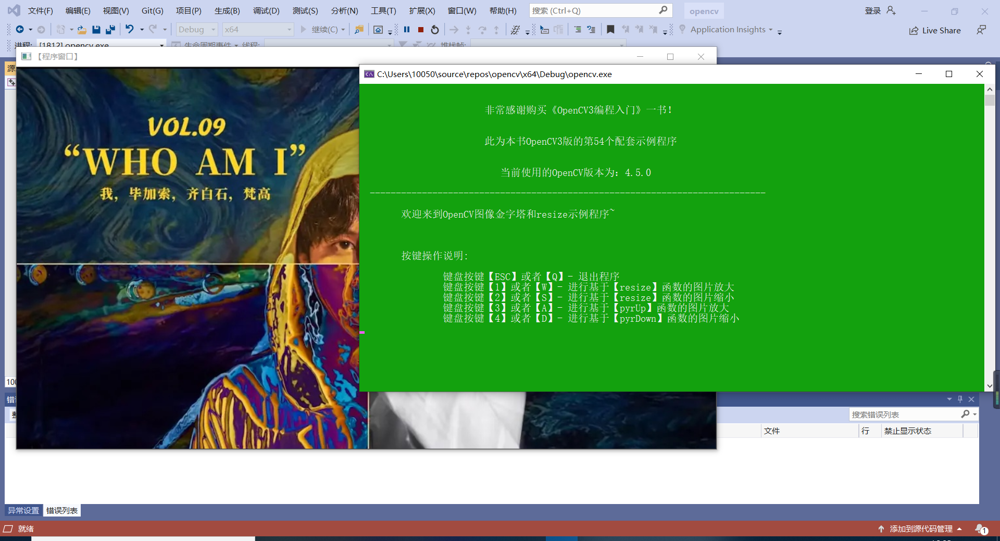

### 6.6.6 阈值化
在对各种图形进行处理操作的过程中，我们常常需要对图像中的像素做出取舍与决策，直接剔除一些低于或者高于一定值的像素。
阈值可以被视作最简单的图像分割方法。比如，从一副图像中利用阈值分割出我们需要的物体部分(当然这里的物体可以是一部分或者整体)。这样的图像分割方法基于图像中物体与背景之间的灰度差异，而且此分割属于像素级的分割。为了从一副图像中提取出我们需要的部分，应该用图像中的每一个像素点的灰度值与选取的阈值进行比较，并作出相应的判断。注意:阈值的选取依赖于具体的问题。即物体在不同的图像中有可能会有不同的灰度值。

### 6.6.7 固定阈值操作:Threshold()函数
函数Threshold(对单通道数组应用固定阈值操作。该函数的典型应用是对灰度图像进行阈值操作得到二值图像，( compare()函数也可以达到此目的）或者是去掉噪声，例如过滤很小或很大象素值的图像点。
C++: double threshold(InputArray src,outputArray dst，double thresh,double maxval, int type)
·第一个参数，InputArray类型的src，输入数组，填单通道，8或32位浮点类型的Mat即可。
第二个参数，OutputArray 类型的 dst，函数调用后的运算结果存在这里，即这个参数用于存放输出结果，且和第一个参数中的Mat变量有一样的尺寸和类型。
第三个参数，double类型的thresh，阈值的具体值。
·第四个参数，double类型的 maxval，当第五个参数阈值类型 type 取CV_THRESH BINARY 或CV_THRESH_BINARY_INV时阈值类型时的最大值（对应地，OpenCV2中可以为CV_THRESH_ BINARY 和CV_THRESH_BINARY_ INV).
·第五个参数，int类型的type，阈值类型。threshold()函数支持的对图像取阈值的方法由其确定。

### 6.6.8 自适应阈值操作: adaptiveThresholdO函数
第一个参数，InputArray类型的src，输入图像，即源图像，填Mat类的对象即可，且需为8位单通道浮点型图像。
第二个参数，OutputArray 类型的 dst，函数调用后的运算结果存在这里，需和源图片有一样的尺寸和类型。
第三个参数，double类型的 max Value，给像素赋的满足条件的非零值。具体看下面的讲解。
第四个参数，int类型的adaptiveMethod，用于指定要使用的自适应阈值算法，可取值为ADAPTIVE_ THRESH_MEAN_C或ADAPTIVE_THRESH_GAUSSIAN_C。
第五个参数，int类型的 thresholdType ，阈值类型。取值必须为THRESH_BINARY、THRESH_BINARY_INV其中之一。
第六个参数，int类型的 blockSize，用于计算阈值大小的一个像素的邻域尺寸，取值为3、5、7等。
第七个参数，double类型的C，减去平均或加权平均值后的常数值。通常其为正数，但少数情况下也可以为零或负数。

### 6.6.9 示例程序:基本阈值操作
讲解完这个函数，让我们看一个调用示例程序，这个示例程序演示了基本阈值操作的方方面面。此程序可以通过按键，在不同的阈值模式之间切换。
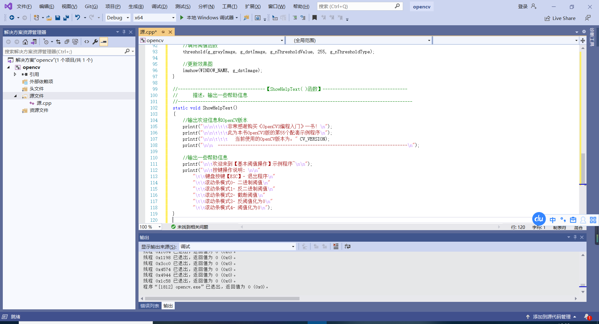
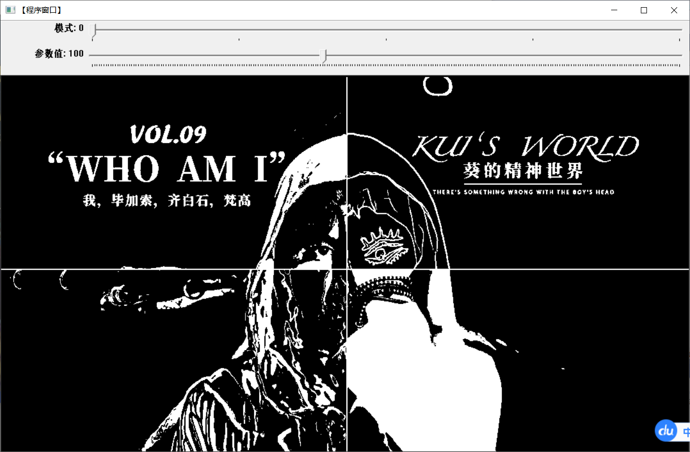

## 6.7 本章小结
本章中我们学习了各种利用OpenCV进行图像处理的方法。包括属于线性滤波的方框滤波、均值滤波与高斯滤波，属于非线性滤波的中值滤波、双边滤波;两种基本形态学操作——膨胀与腐蚀;5种高级形态学滤波操作——开运算、闭运算、形态学梯度、顶帽以及黑帽;还有漫水填充算法、图像金字塔、图像缩放、阈值化。涉及到的内容可谓非常丰富。

# 第7章 图像变换
## 7.1 基于OpenCV的边缘检测
### 7.1.1 边缘检测的一般步骤
1.【第一步】滤波
边缘检测的算法主要是基于图像强度的一阶和二阶导数，但导数通常对噪声很敏感，因此必须采用滤波器来改善与噪声有关的边缘检测器的性能。常见的滤波方法主要有高斯滤波，即采用离散化的高斯函数产生一组归一化的高斯核，然后基于高斯核函数对图像灰度矩阵的每一点进行加权求和。
2.【第二步】增强
增强边缘的基础是确定图像各点邻域强度的变化值。增强算法可以将图像灰度点邻域强度值有显著变化的点凸显出来。在具体编程实现时，可通过计算梯度幅值来确定。
3.【第三步】检测
经过增强的图像，往往邻域中有很多点的梯度值比较大，而在特定的应用中，这些点并不是要找的边缘点，所以应该采用某种方法来对这些点进行取舍。实际工程中，常用的方法是通过阈值化方法来检测。

### 7.1.2 canny 算子
Canny边缘检测算子是John F.Canny于 1986年开发出来的一个多级边缘检测算法。更为重要的是，Canny创立了边缘检测计算理论(Computational
theory
ofedge detection)，解释了这项技术是如何工作的。Canny边缘检测算法以
Canny
的名字命名，被很多人推崇为当今最优的边缘检测的算法。
其中，Canny的目标是找到一个最优的边缘检测算法，让我们看一下最优边缘检测的三个主要评价标准。
低错误率:标识出尽可能多的实际边缘，同时尽可能地减少噪声产生的误报。
高定位性:标识出的边缘要与图像中的实际边缘尽可能接近。
最小响应:图像中的边缘只能标识一次，并且可能存在的图像噪声不应标识为边缘。
为了满足这些要求，Canny使用了变分法，这是一种寻找满足特定功能的函数的方法。最优检测用4个指数函数项的和表示，但是它非常近似于高斯函数的一阶导数。

### 7.1.3 Canny边缘检测:Canny()函数

第一个参数，InputArray类型的 image，输入图像，即源图像，填Mat类的对象即可，且需为单通道8位图像。
第二个参数，OutputArray类型的edges，输出的边缘图，需要和源图片有一样的尺寸和类型。
第三个参数，double类型的 threshold1，第一个滞后性阈值。第四个参数，double类型的threshold2，第二个滞后性阈值。
第五个参数，int类型的apertureSize，表示应用Sobel算子的孔径大小，其有默认值3。
第六个参数，bool类型的 L2gradient，一个计算图像梯度幅值的标识，有默认值false。

### 7.1.4 sobel算子
Sobel 算子是一个主要用于边缘检测的离散微分算子（ discrete differentiationoperator)。它结合了高斯平滑和微分求导，用来计算图像灰度函数的近似梯度。在图像的任何一点使用此算子，都将会产生对应的梯度矢量或是其法矢量。

(1）第一个参数，InputArray类型的src，为输入图像，填Mat类型即可
(2）第二个参数，OutputArray类型的 dst，即目标图像，函数的输出参数，需要和源图片有一样的尺寸和类型。
(3）第三个参数，int类型的ddepth，输出图像的深度，支持如下src.depth(和 ddepth 的组合:
·若src.depth()= cV_8U，取 ddepth =-1/CV_16S/CV_32F/CV_64F●若src.depth()= CV_16U/CV_16S，取 ddepth =-1/CV_32F/CV_64F·若src.depth()= cV_32F，取ddepth =-1/CV_32F/CV_64F
·若src.depth()= CV_64F，取 ddepth =-1/CV_64F
(4）第四个参数，int类型dx，x方向上的差分阶数。(5）第五个参数，int类型dy，y方向上的差分阶数。
(6)第六个参数，int类型ksize，有默认值3，表示 Sobel核的大小;必须取1、3、5或7。
( 7）第七个参数，double类型的scale，计算导数值时可选的缩放因子
默认值是1，表示默认情况下是没有应用缩放的。
(8）第八个参数，double类型的delta，表示在结果存入目标图（第二个参数dst）之前可选的delta值，有默认值0。
(9）第九个参数，int类型的 borderType，边界模式，默认值为 BORDER_DEFAULT。这个参数可以在官方文档中borderInterpolate处得到更详细的信息。

### 7.1.5  Laplacian算子
#### 1. Laplacian算子简介
Laplacian算子是n维欧几里德空间中的一个二阶微分算子，定义为梯度grad的散度div。因此如果f是二阶可微的实函数，则f的拉普拉斯算子定义如下。
(1)f的拉普拉斯算子也是笛卡儿坐标系xi中的所有非混合二阶偏导数求和。(2）作为一个二阶微分算子，拉普拉斯算子把C函数映射到C函数
对于k
≥2，表达式(1)（或(2)）定义了一个算子A:C(R)→C(R);或更一般地，
对于任何开集Q，定义了一个算子A:C(Q)→C(Q2)。

####2 .计算拉普拉斯变换: Laplacian()函数
Laplacian函数可以计算出图像经过拉普拉斯变换后的结果。
C++: void Laplacian(InputArray src,outputArray dst, int ddepth,intksize=1, double scale=1, double delta=0,
intborderType=BORDER_DEFAULT );
·第一个参数，InputArray类型的image，输入图像，即源图像，填 Mat类的对象即可，且需为单通道8位图像。
·第二个参数，OutputArray类型的edges，输出的边缘图，需要和源图片有一样的尺寸和通道数。
第三个参数，int类型的ddept，目标图像的深度。
第四个参数，int类型的ksize，用于计算二阶导数的滤波器的孔径尺寸，大小必须为正奇数，且有默认值1。
·第五个参数，double类型的scale，计算拉普拉斯值的时候可选的比例因子，有默认值1。
第六个参数，double类型的delta，表示在结果存入目标图(第二个参数dst)之前可选的delta值，有默认值0。
第七个参数，int类型的 borderType，边界模式，默认值为BORDERDEFAULT。

3．示例程序: Laplacian算子的使用

### 7.1.6 scharr滤波器
####1.计算图像差分:Scharr()函数
使用Scharr滤波器运算符计算x或y方向的图像差分。其实它的参数变量和Sobel基本上是一样的，除了没有ksize核的大小。
C十+: void scharr(
InputArray src，//源图
outputArray dst,//目标图
int ddepth,//图像深度
int dx, // x方向上的差分阶数
int dy,// y方向上的差分阶数
double scale=1,//缩放因子
double delta=0,// delta值
intborderType=BORDER_DEFAULT )// 边界模式
(1）第一个参数，InputArray类型的src，为输入图像，填Mat类型即可。
(2）第二个参数，OutputArray类型的 dst，即目标图像，函数的输出参数，需要和源图片有一样的尺寸和类型。
(3）第三个参数，int类型的 ddepth，输出图像的深度，支持如下src.depth()和 ddepth 的组合:
·若src.depth()= cV_8U，取 ddepth =-1/CV_16S/CV_32F/CV_64F
·若src.depth()= CV 16U/CV_16S，取 ddepth=-1/CV_32F/CV_64F
·若src.depth()= CV32F，取 ddepth =-1/CV_32F/CV_64F
·若 src.depth()= CV_64F，取ddepth =-1/CV_64F
(4）第四个参数，int类型dx，x方向上的差分阶数。(5）第五个参数，int类型dy，y方向上的差分阶数。
(6）第六个参数，double类型的scale，计算导数值时可选的伯以囚丁，V值是1，表示默认情况下是没有应用缩放的。我们可以仕乂档中食园getDerivKernels的相关介绍，来得到这个参数的更多信息。
(7)第七个参数，double类型的 delta，表示在结果仔入目杯图（弟一个参蚁dst）之前可选的 delta值,有默认值0.
(8）第八个参数，int类型的 borderType，边界模式，默认值为 BORDER_DEFAULT。这个参数可以在官方文档中 borderInterpolate处得到更详细的信息。
不难理解，如下两者是等价的，即:
scharr(src, dst,ddepth,dx,dy,scale, delta,borderType);
与
Sobel(src，dst,ddepth, dx，dy,cv_SCHARR,scale, delta,borderType);

#### 2．示例程序:Scharr滤波器

### 7.1.7 综合示例:边缘检测

## 7.2 霍夫变换
在图像处理和计算机视觉领域中，如何从当前的图像中提取所需要的特征信息是图像识别的关键所在。在许多应用场合中需要快速准确地检测出直线或者圆。其中一种非常有效的解决问题的方法是霍夫（Hough）变换，其为图像处理中从图像中识别几何形状的基本方法之一，应用很广泛，也有很多改进算法。最基本的霍夫变换是从黑白图像中检测直线(线段)。本节就将介绍 OpenCV中霍夫变换的使用方法和相关知识。

### 7.2.1 霍夫变换概述
霍夫变换（Hough Transform）是图像处理中的一种特征提取技木，该N程仕一个参数空间中通过计算累计结果的局部最大值得到一个符合该特足形状的集合作为霍夫变换结果。霍夫变换于1962年由 PaulHough首次提出，最初换是设计用来检测直线和曲线的。起初的方法要求知道物体边界线的解析方程,但不需要有关区域位置的先验知识。这种方法的一个突出优点是分割结宋的Robustness，即对数据的不完全或噪声不是非常敏感。然而，要获得描述边界的解析表达常常是不可能的。后于1972年由Richard Duda & Peter Hart 推广使用，经典霍夫变换用来检测图像中的直线，后来霍夫变换扩展到任意形状物体的识别，多为圆和椭圆。霍夫变换运用两个坐标空间之间的变换将在一个空间中具有相同形状的曲线或直线映射到另一个坐标空间的一个点上形成峰值，从而把检测任意形状的问题转化为统计峰值问题。

### 7.2.2 OpenCV中的霍大线变换

OpenCV支持三种不同的霍夫线变换，它们分别是:标准霍夫变换（StandardHough Transform,SHT)、多尺度霍夫变换(Multi-Scale Hough Transform，MSHT)和累计概率霍夫变换（Progressive Probabilistic Hough Transform，PPHT)。
其中，多尺度霍夫变换（MSHT）为经典霍夫变换（SHT)在多尺度下的一
个变种。而累计概率霍夫变换（PPHT）算法是标准霍夫变换（SHT)算法的一个改进，它在一定的范围内进行霍夫变换，计算单独线段的万回以o汇团，从队少计算量，缩短计算时间。之所以称PPHT为“概率”的，是因为并不将累加器平面内的所有可能的点累加，而只是累加其中的一部分，该想法是如果峰值如果足够高，只用一小部分时间去寻找它就够了。按照猜想，可以实质性地减少计算时间。
在OpenCV中，可以用HoughLines函数来调用标准霍夫变换（SHT)和多尺度霍夫变换（MSHT)。
而HoughLinesP函数用于调用累计概率霍夫变换 PPHT。累计概率霍夫变换执行效率很高，所有相比于HoughLines 函数，我们更倾向于使用HoughLinesP函数。

总结一下，OpenCV中的霍夫线变换有如下三种:
·标准霍夫变换(StandardHough Transform，SHT)，由 HoughLines 函数调用。
·多尺度霍夫变换（Multi-ScaleHougn iranso，Monw函数调用。
累计概率霍夫变换（ProgressiveProbabilistic Hough Transform，PPHT),由HoughLinesP函数调用。

### 7.2.3 标准霍夫变换:HoughLines()函数

第一个参数，InputArray类型的image，输入图像，即源图像。需为8位的单通道二进制图像，可以将任意的源图载入进来，并由函数修改成此格式后，再填在这里。
第二个参数，InputArray类型的 lines，经过调用HoughLines 函数后储存了霍夫线变换检测到线条的输出矢量。每一条线由具有两个元素的矢量（ p ,0 )表示，其中，p是离坐标原点（0,0)(也就是图像的左上角）的距离，0是弧度线条旋转角度（О度表示垂直线，nt/2度表示水平线)。
第三个参数，double类型的rho，以像素为单位的距离精度。另一种表述方式是直线搜索时的进步尺寸的单位半径。(Latex 中/rho即表示p)
第四个参数，double类型的 theta，以弧度为单位的角度精度。另一种表述方式是直线搜索时的进步尺寸的单位角度。
第五个参数，int类型的threshold，累加平面的阈值参数，即识别某部分为图中的一条直线时它在累加平面中必须达到的值。大于阈值threshold 的线段才可以被检测通过并返回到结果中。
第六个参数，double类型的srn，有默认值0。对于多尺度的霍夫变换，这是第三个参数进步尺寸rho的除数距离。粗略的累加器进步尺寸直接是第三个参数rho，而精确的累加器进步尺寸为rho/srn。
第七个参数，double类型的 stn，有默认值0，对于多尺度霍夫变换，srn表示第四个参数进步尺寸的单位角度theta的除数距离。且如果 srn和 stn同时为0，就表示使用经典的霍夫变换。否则，这两个参数应该都为正数。

### 7.2.4 累计概率霍夫变换:HoughLinesPO函数

第一个参数，InputArray类型的image，输入图像，即源图像。需为8位的单通道二进制图像，可以将任意的源图载入进来后由函数修改成此格式后，再填在这里。
第二个参数，InputArray类型的lines，经过调用HoughLinesP函数后存储了检测到的线条的输出矢量,每一条线由具有4个元素的矢量(x_1,y_1,x_2,y_2)表示，其中，(x_1,y_1)和(x_2,y_2)是是每个检测到的线段的结束点。第三个参数，double类型的rho，以像素为单位的距离精度。另一种表述方式是直线搜索时的进步尺寸的单位半径。
第四个参数，double类型的 theta，以弧度为单位的角度精度。另一种表述方式是直线搜索时的进步尺寸的单位角度。
第五个参数，int类型的 threshold，累加平面的阈值参数，即识别某部分为图中的一条直线时它在累加平面中必须达到的值。大于阙值 threshold的线段才可以被检测通过并返回到结果中。
第六个参数，double类型的 minLineLength，有默认值0，表示最低线段的长度，比这个设定参数短的线段就不能被显现出来。
第七个参数，double类型的 maxLineGap，有默认值0，允许将同一行点与点之间连接起来的最大的距离。

### 7.2.5霍夫梯度法的原理
霍夫梯度法的原理是这样的:
(1）首先对图像应用边缘检测，比如用canny边缘检测。
(2）然后，对边缘图像中的每一个非零点，考虑其局部梯度，即用Sobel()函数计算x和y方向的Sobel一阶导数得到梯度。
(3）利用得到的梯度，由斜率指定的直线上的每一个点都在累加器中被累加，这里的斜率是从一个指定的最小值到指定的最大值的距离。
(4）同时，标记边缘图像中每一个非О像素的位置。
(5）然后从二维累加器中这些点中选择候选的中心，这些中心都大于给定阈值并且大于其所有近邻。这些候选的中心按照累加值降序排列，以便于最支持像素的中心首先出现。
(6）接下来对每一个中心，考虑所有的非О像素。
(7）这些像素按照其与中心的距离排序。从到最大半径的最小距离算起，选择非0像素最支持的一条半径。
(8）如果一个中心收到边缘图像非О像素最充分的支持，并且到前期被选择的中心有足够的距离，那么它就会被保留下来。

### 7.2.6 霍大圆变换:HoughCircles()函数
第一个参数，InputArray类型的 image，输入图像，即源图像，需为8位的灰度单通道图像。
第二个参数，InputArray类型的circles，经过调用HoughCircles 函数后此参数存储了检测到的圆的输出矢量，每个矢量由包含了3个元素的浮点矢量(x,y,radius)表示。
第三个参数，int类型的 method，即使用的检测方法，目前OpenCV中就霍夫梯度法一种可以使用，它的标识符为HOUGH_GRADIENT (OpenCV2中可写作CV_HOUGH_GRADIENT)，在此参数处填这个标识符即可。
第四个参数，double类型的dp，用来检测圆心的累加器图像的分辨率于输入图像之比的倒数，且此参数允许创建一个比输入图像分辨率低的累加器例如，如果 dp=1时，累加器和输入图像具有相同的分辨率。如果dp=2,累加器便有输入图像一半那么大的宽度和高度。
第五个参数，double类型的minDist，为霍夫变换检测到的圆的圆心之间的最小距离，即让算法能明显区分的两个不同圆之间的最小距离。这个参数如果太小的话，多个相邻的圆可能被错误地检测成了一个重合的圆。反之，这个参数设置太大，某些圆就不能被检测出来。
第六个参数,double类型的 paraml，有默认值100。它是第三个参数method设置的检测方法的对应的参数。对当前唯一的方法霍夫梯度法
CV_HOUGH_GRADIENT，它表示传递给canny边缘检测算子的高阈值，而低阈值为高阈值的一半。
第七个参数，double类型的 param2，也有默认值100。它是第三个参数method设置的检测方法的对应的参数。对当前唯一的方法霍夫梯度法CV_HOUGH_GRADIENT，它表示在检测阶段圆心的累加器阈值。它越小，就越可以检测到更多根本不存在的圆，而它越大的话，能通过检测的圆就更加接近完美的圆形了。
第八个参数，int类型的 minRadius，有默认值0，表示圆半径的最小值。第九个参数，int类型的maxRadius，也有默认值0，表示圆半径的最大值。

### 7.2.7 综合示例:霍夫变换
 
这次的综合示例，我们在 HoughLinesP函数的基础上，为其添加了用于控制其第五个参数阈值 threshold的滚动条，因此可以通过调节滚动条来改变阈值，从而动态地控制霍夫线变换检测的线条多少。

## 7.3 重映射

### 7.3.1重映射的概念
重映射,就是把一幅图像中某位置的像素放置到另一个图片指定位置的过程。为了完成映射过程，需要获得一些插值为非整数像素的坐标，因为源图像与目标图像的像素坐标不是一一对应的。一般情况下，我们通过重映射来表达每个像素的位置（(x,y)，像这样:
g(x,y)= f ( h(x,y))
在这里，g()是目标图像,f(是源图像，而h(x,y)是作用于(x,y)的映射方法函数来看个例子。若有一幅图像I，对其按照下面的条件作重映射:
h(x,y)= (1.cols - x,y )

### 7.3.2实现重映射:remap()函数
第一个参数，InputArray类型的src，输入图像，即源图像，填Mat类的对象即可，且需为单通道8位或者浮点型图像。
第二个参数，OutputArray类型的dst，函数调用后的运算结果存在这里，即这个参数用于存放函数调用后的输出结果，需和源图片有一样的尺寸和类型。第三个参数，InputArray类型的 map1，它有两种可能的表示对象。
表示点（x，y）的第一个映射。
表示CV16SC2、cV_32FC1或CV_32FC2类型的X值。
第四个参数，InputArray类型的map2，同样，它也有两种可能的表示对象，而且它会根据map1来确定表示那种对象。
若map1表示点（x，y）时。这个参数不代表任何值。
表示CV_16UC1，CV_32FC1类型的Y值（第二个值)。
第五个参数，int类型的interpolation，插值方式，之前的resize()函数中有讲到，需要注意，resize()函数中提到的INTER_AREA插值方式在这里是不支持的，所以可选的插值方式如下（需要注意，这些宏相应的OpenCV2版为在它们的宏名称前面加上“cV_”前缀，比如“INTER_LINEAR”的OpenCV2版为“CV_INTER_LINEAR”):
INTER_NEAREST——最近邻插值
INTER_LINEAR——双线性插值（默认值)
INTER_CUBIC——双三次样条插值（逾4×4像素邻域内的双三次插值)INTER_LANCZOS4——Lanczos插值(逾8×8像素邻域的Lanczos插值)第六个参数，int类型的 borderMode，边界模式，有默认值 BORDERCONSTANT，表示目标图像中“离群点（ outliers)”的像素值不会被此函数修改。
第七个参数，const Scalar&类型的borderValue，当有常数边界时使用的值,其有默认值 Scalar()，即默认值为0。

### 7.3.3 综合示例程序:实现多种重映射

## 7.4仿射变换
### 7.4.1 认识仿射变换
仿射变换（Affine Transformation或 Affine Map)，又称仿射映射，是指在几何中，一个向量空间进行一次线性变换并接上一个平移，变换为另一个向量空间的过程。它保持了二维图形的“平直性”(直线经过变换之后依然是直线）和“平行性”(二维图形之间的相对位置关系保持不变，平行线依然是平行线，且直线上点的位置顺序不变)。
一个任意的仿射变换都能表示为乘以一个矩阵（线性变换）接着再加上一个向量（平移）的形式。
那么，我们能够用仿射变换来表示如下三种常见的变换形式:·旋转，rotation(线性变换)
平移，translation(向量加)缩放，scale(线性变换)

### 7.4.2 进行仿射变换:warpAffine()函数
第一个参数，InputArray类型的src，输入图像，即源图像，填Mat类的对象即可。
第二个参数，OutputArray类型的 dst，函数调用后的运算结果存在这里，需和源图片有一样的尺寸和类型。
第三个参数，InputArray类型的M，2×3的变换矩阵。第四个参数，Size类型的dsize，表示输出图像的尺寸。
第五个参数，int类型的 flags，插值方法的标识符。此参数有默认值INTER LINEAR(线性插值)。
第六个参数，int类型的 borderMode ，边界像素模式，默认值为BORDER_CONSTANT。
第七个参数，const Scalar&类型的borderValue，在恒定的边界情况下取的值，默认值为Scalar()，即0。

### 7.4.3 计算二维旋转变换矩阵:getRotationMatrix2D()函数

第一个参数，Point2f类型的center，表示源图像的旋转中心。
第二个参数，double类型的angle，旋转角度。角度为正值表示向逆时针旋转（坐标原点是左上角)。
第三个参数，double类型的scale，缩放系数。

### 7.4.4 示例程序:仿射变换

## 7.5 直方图均衡化
### 7.5.1 直方图均衡化的概念和特点
直方图均衡化是灰度变换的一个重要应用，它高效且易于实现，广泛
图像增强处理中。图像的像素灰度变化是随机的，直方图的图形高低不齐，直方图均衡化就是用一定的算法使直方图大致平和的方法。

简而言之，直方图均衡化是通过拉伸像素强度分布范围来增强图像对比度的一种方法。
均衡化处理后的图像只能是近似均匀分布。均衡化图像的动态范围扩大了，但其本质是扩大了量化间隔，而量化级别反而减少了，因此，原来灰度不同的象素经处理后可能变的相同，形成了一片相同灰度的区域，各区域之间有明显的边界，从而出现了伪轮廓。
在原始图像对比度本来就很高的情况下，如果再均衡化则灰度调和，对比度会降低。在泛白缓和的图像中，均衡化会合并一些象素灰度，从而增大对比度。均衡化后的图片如果再对其均衡化，则图像不会有任何变化。

### 7.5.2 实现直方图均衡化:equalizeHist()函数
第一个参数，InputArray类型的src，输入图像，即源图像，填Mat类的对象即可，需为8位单通道的图像。
第二个参数，OutputArray类型的 dst，函数调用后的运算结果存在这里，需和源图片有一样的尺寸和类型。

### 7.5.3 示例程序:直方图均衡化

## 7.6 本章小结
在这章中我们学习了很多类型的图像变换方法。包括利用OpenCV进行边缘检测所用到的canny 算子、sobel算子，Laplace算子以及 scharr滤波器;进行图像特征提取的霍夫线变换、霍夫圆变换，重映射和仿射变换以及直方图均衡化。

# 第8章图像轮廓与图像分割修复

## 8.1查找并绘制轮廓
一个轮廓一般对应一系列的点，也就是图像中的一条曲线。其表示方法可能根据不同的情况而有所不同。在OpenCV中，可以用findContours()函数从二值图像中查找轮廓。

### 8.1.1 寻找轮廓: findContours(O)的数
findContours()函数用于在二值图像中寻找轮廓。
~~~
 void findContours(InputOutputArray image,OutputArray0fArrayscontours，outputArray hierarchy, int mode,int method，Point
offset=Point () )
~~~
第一个参数，InputArray类型的image，输入图像，即源图像，填Mat类的对象即可，且需为8位单通道图像。图像的非零像素被视为1，0像素值被保留为0，所以图像为二进制。我们可以使用compare()、inrange()、threshold()、adaptivethreshold()、canny()等函数由灰度图或彩色图创建二进制图像。此函数会在提取图像轮廓的同时修改图像的内容。
第二个参数，OutputArrayOfArrays类型的contours、检测到的轮廓
函数调用后的运算结果存在这里。每个轮廓存储为一个点向量，即用point类型的vector表示。
第三个参数，OutputArray类型的 hierarchy，可选的输出向量，包含图像的拓扑信息。其作为轮廓数量的表示,包含了许多元素。每个轮廓contours[ i ]对应4个hierarchy元素 hierarchy[ i ][ 0]~hierarchy[ i ][ 3 ]，分别表示后一个轮廓、前一个轮廓、父轮廓、内嵌轮廓的索引编号。如果没有对应项，对应的 hierarchy[i]值设置为负数。

### 8.1.2 绘制轮廓:drawContours()函数
drawContours()函数用于在图像中绘制外部或内部轮廓。
~~~
 void drawContours(InputOutputArray image,InputArrayofArrayscontours,int contourIdx,const Scalar& color, int thickness=1,intlineType=8,InputArray hierarchy=noArray ( ) , int maxLevel=INT_MAX，Pointoffset=Point ( ) )
~~~
第一个参数，InputArray类型的image，目标图像，填Mat类的对象即可。
第二个参数，InputArrayOfArrays类型的contours，所有的输入轮廓。
每个轮廓存储为一个点向量，即用point类型的vector表示。
第三个参数，int 大主则绘制所有轮廓。
第四个参数，const Scalar&类型的color，轮廓的颜色。
第五个参数，int thickness，轮廓线条的粗细度，有默认值1。如果其为负值（如thickness= cv_filled)，便会绘制在轮廓的内部。可选为FILLED宏

### 8.1.3 综合示例程序:查找并绘制轮廓
除了上述这个精简版的示例程序，此程序利用了图像平滑技术（blur()函数)和边缘检测技术( canny()函数)，根据滑动条的调节，可以动态地检测出图形的轮廓。

## 8.2寻找物体的凸包
### 8.2.1 凸包
凸包(Convex Hull）是一个计算几何（图形学）中常见的概念。简单来说，给定二维平面上的点集，凸包就是将最外层的点连接起来构成的凸多边型，它是能包含点集中所有点的。理解物体形状或轮廓的一种比较有用的方法便是计算一个物体的凸包，然后计算其凸缺陷(convexity defects)。很多复杂物体的特性能很好地被这种缺陷表现出来。
我们用人手图来举例说明凸缺陷这一概念。手周围深色的线描画出了凸包，A到H被标出的区域是凸包的各个“缺陷”。正如看到的，这些凸度缺陷提供了手以及手状态的特征表现的方法。

### 8.2.2寻找凸包:convexHull()函数
第一个参数，InputArray类型的points，输入的二维点集，可以填Mat类型或者std::vector。
第二个参数，OutputArray类型的 hull，输出参数，函数调用后找到的凸包。
第三个参数，bool类型的clockwise，操作方向标识符。当此标识符为真时,输出的凸包为顺时针方向。否则，就为逆时针方向。并且是假定坐标系的x轴指向右，y轴指向上方。
第四个参数，bool类型的returnPoints，操作标志符，默认值 true。当标志符为真时，函数返回各凸包的各个点。否则，它返回凸包各点的指数。当输出数组是std::vector 时，此标志被忽略。

### 8.2.3基础示例程序:凸包检测基础

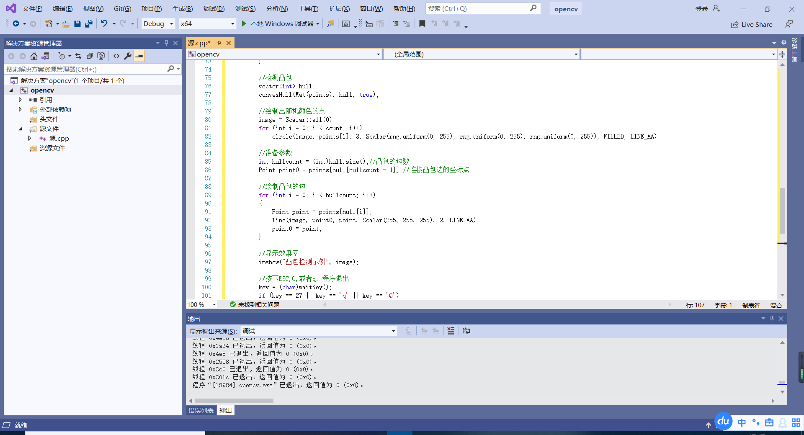

### 8.2.4 综合示例程序:寻找和绘制物体的凸包
这一节的综合示例程序，依然是结合滑动条，通过滑动条控制阈值，来得到不同的凸包检测效果图。程序详细注释的源代码如下。
程序运行后，可以在原始图窗口中调节阈值，改变全局变量g_nThresh的值,以改变g thresholdImage _output参数，最后findContours以此参数为输入，查找不同的轮廓图。经过一系列的处理，最后得到的凸包图形便有精细度上的差异。运行效果如图所示。

## 8.3 使用多边形将轮廓包围
### 8.3.1 返回外部矩形边界: boundingRect()函数
此函数计算并返回指定点集最外面（up-right）的矩形边界。
~~~
C++: Rect boundingRect(InputArray points)
~~~
其唯一的一个参数为输入的二维点集，可以是 std::vector 或 Mat类型

### 8.3.2 寻找最小包围矩形:minAreaRect()函数
此函数用于对给定的2D点集，寻找可旋转的最小面积的包围矩形。
~~~
C++: RotatedRect minAreaRect (InputArray points)
~~~
其唯一的一个参数为输入的二维点集，可以为std::vector<>或 Mat类型。

### 8.3.3 寻找最小包围圆形:minEnclosingCircle()函数
minEnclosingCircle函数的功能是利用一种迭代算法，对给定的2D点集，去寻找面积最小的可包围它们的圆形。
~~~
C++:void minEnclosingCircle (InputArray points,Point2f& center, float&radius)
~~~
第一个参数, InputArray类型的points,输入的二维点集,可以为std::vector<>或Mat类型。
第二个参数，Point2f&类型的center，圆的输出圆心。第三个参数，float&类型的radius，圆的输出半径。
### 8.3.4 用椭圆拟合二维点集:fitEllipse()函数
此函数的作用是用椭圆拟合二维点集。
~~~
C++:RotatedRect fitEllipse (InputArray points)
~~~
其唯一的一个参数为输入的二维点集，可以为std::vector<>或 Mat类型。
### 8.3.5 逼近多边形曲线: approxPolyDPO)函数
approxPolyDP函数的作用是用指定精度逼近多边形曲线。
~~~
C++: void approxPolyDP(InputArray curve,outputArray approxcurve,double epsilon,bool closed)
~~~
第一个参数，InputArray类型的curve，输入的二维点集，可以为std::vecto或Mat类型。
第二个参数，OutputArray类型的approxCurve，多边形逼近的结果，其类型应该和输入的二维点集的类型一致。
第三个参数，double类型的epsilon，逼近的精度，为原始曲线和即近似曲线间的最大值。
第四个参数，bool类型的 closed，如果其为真，则近似的曲线为封闭曲线(第一个顶点和最后一个顶点相连)，否则，近似的曲线曲线不封闭。

### 8.3.6 基础示例程序:创建包围轮廓的矩形边界
此示例程序以minAreaRect 函数为核心，先随机生成3～103个彩色点，然后绘制一个可以旋转的最小的矩形，将这些点全部包含进去。操作依然是通过键盘按下任意键来重新生成随机点，并寻找最小面积的包围矩形。
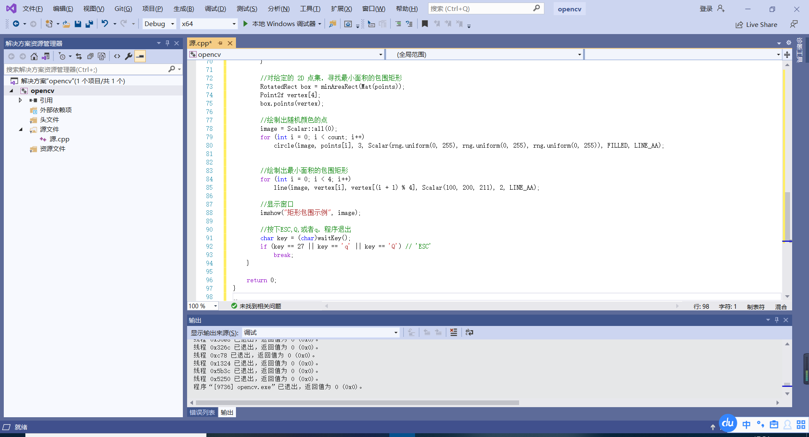

### 8.3.7基础示例程序:创建包围轮廓的圆形边界
本小节给出的程序和上一小节的程序类似，只不过核心函数替换为minEnclosingCircle，依然是先随机生成3～103个彩色点，不同的是绘制的是一个圆而不是矩形，将这些点组成的轮廓包含进去。为了大家学习方便，这里依然是贴出此程序详细注释的源代码。

### 8.3.8 综合示例程序:使用多边形包围轮廓
经过上述两个基础示例程序的学习，相信大家应该对minAreaRect和minEnclosingCircle函数的用法有了一定的认识。这两个示例程序中，处理的轮廓都是程序自己随机生成的点。在接下来这个综合一点的示例程序中，让我们载入一幅图像，用上文中学到的函数来创建包围轮廓的矩形和圆形边界框。

## 8.4图像的矩
矩函数在图像分析中有着广泛的应用，如模式识别、目标分类、目标识别与方位估计、图像编码与重构等。一个从一幅数字图形中计算出来的矩集
通常描述了该图像形状的全局特征，并提供了大量的关于该图像不同类型的几何特性信息，比如大小、位置、方向及形状等。图像矩的这种特性描述能力被广泛地应用在各种图像处理、计算机视觉和机器人技术领域的目标识别与方位估计中。一阶矩与形状有关，二阶矩显示曲线围绕直线平均值的扩展程度，三阶矩则是关于平均值的对称性的测量。由二阶矩和三阶矩可以导出一组共7个不变矩。而不变矩是图像的统计特性，满足平移、伸缩、旋转均不变的不变性，在图像识别领域得到了广泛的应用。

那么，在 OpenCV 中，如何计算一个图像的矩呢?一般由 moments .contourArea、arcLength这三个函数配合求取。
使用moments计算图像所有的矩(最高到3阶)
使用contourArea来计算轮廓面积
使用arcLength来计算轮廓或曲线长度

### 8.4.1 矩的计算:moments()函数
moments()函数用于计算多边形和光栅形状的最高达三阶的所有矩。矩用来计算形状的重心、面积，主轴和其他形状特征，如 7Hu不变量等。
~~~
C++:Moments moments(InputArray array,bool binaryImage=false
)
~~~
第一个参数，InputArray类型的array，输入参数，可以是光栅图像（单通道，8位或浮点的二维数组）或二维数组（1N或N1)。
第二个参数，bool类型的 binaryImage，有默认值false。若此参数取true,则所有非零像素为1。此参数仅对于图像使用。

### 8.4.2 计算轮廓面积:contourArea()函数
contourArea()函数用于计算整个轮廓或部分轮廓的面积
~~~
C++; double contourArea (InputArray contour, bool oriented=false
~~~
第一个参数，InputArray类型的contour，输入的向量，二维点(轮廓顶点)，可以为std::vector 或 Mat类型。
第二个参数，bool类型的oriented，面向区域标识符。若其为true，该函数返回一个带符号的面积值,其正负取决于轮廓的方向(顺时针还是逆时针)。根据这个特性我们可以根据面积的符号来确定轮廓的位置。需要注意的是，这个参数有默认值false，表示以绝对值返回，不带符号。

### 8.4.3 计算轮廓长度: arcLength()函数
arcLength()函数用于计算封闭轮廓的周长或曲线的长度。C++: double arcLength(InputArray curve,bool closed)
第一个参数，InputArray类型的curve，输入的二维点集，可以为std::vector或Mat类型。
第二个参数，bool类型的closed，一个用于指示曲线是否封闭的标识符，有默认值closed，表示曲线封闭。

### 8.4.4 综合示例程序:查找和绘制图像轮廓矩

## 8.5分水岭算法
在许多实际运用中，我们需要分割图像，但无法从背景图像中获得有用信息。分水岭算法( watershed algorithm）在这方面往往是非常有效的。此算法可以将图像中的边缘转化成“山脉”，将均匀区域转化为“山谷”，这样有助于分割目标。
分水岭算法，是一种基于拓扑理论的数学形态学的分割方法，其基本思想是把图像看作是测地学上的拓扑地貌，图像中每一点像素的灰度值表示该点的海拔高度，每一个局部极小值及其影响区域称为集水盆，而集水盆的边界则形成分水岭。分水岭的概念和形成可以通过模拟浸入过程来说明:在每一个局部极小值表面，刺穿一个小孔，然后把整个模型慢慢浸入水中，随着浸入的加深，每一个局部极小值的影响域慢慢向外扩展，在两个集水盆汇合处构筑大坝，即形成分水岭。
分水岭的计算过程是一个迭代标注过程。分水岭比较经典的计算方法是由
L. Vincent提出的。在该身法中，的府仍讲行从低到高的排序，然后在从低一个是淹没过程。首先对每个像系的灰度教值在八阶高度的影响域采用先进先到高实现淹没的过程中，对每一个局部极小值在h阶高度的影响域采用先进先出(FIFO）结构进行判断及标注。分水岭变换得到的是输入图像的集水盆图像，集水盆之间的边界点，即为分水岭。显然，分水岭表示的是输入图像的极大值点。
也就是说，分水岭算法首先计算灰度图像的梯度;这对图像中的“山谷”或没有纹理的“盆地”(亮度值低的点）的形成是很有效的，也对“山头”或图像中有主导线段的“山脉”(山脊对应的边缘)的形成有效。然后开始从用户指定点(或者算法得到点）开始持续“灌注”盆地直到这些区域连成一片。基于这样产生的标记就可以把区域合并到0一起，合并后的区域又通聚集的方式进行分割,好像图像被“填充”起来一样。

### 8.5.1 实现分水岭算法:watershed()函数
函数 watershed 实现的分水岭算法是基于标记的分割算法中的一种。在把图像传给函数之前，我们需要大致勾画标记出图像中的期望进行分割的区域它们被标记为正指数。所以，每一个区域都会被标记为像素值1、2、3等，表示成为一个或者多个连接组件。这些标记的值可以使用findContours()函数和drawContours()函数由二进制的掩码检索出来。不难理解，这些标记就是即将绘制出来的分割区域的“种子”，而没有标记清楚的区域，被置为0。在函数输出中，每一个标记中的像素被设置为“种子”的值，而区域间的值被设置为-1。
~~~
C++: void watershed(InputArray image, InputoutputArray markers)
~~~
第一个参数，InputArray类型的src，输入图像，即源图像，填Mat类的对象即可，且需为8位三通道的彩色图像。
第二个参数，InputOutputArray类型的markers，函数调用后的运算结果存在这里，输入/输出 32位单通道图像的标记结果。即这个参数用于存放函数调用后的输出结果，需和源图片有一样的尺寸和类型。

### 8.5.2 综合示例程序:分水岭算法

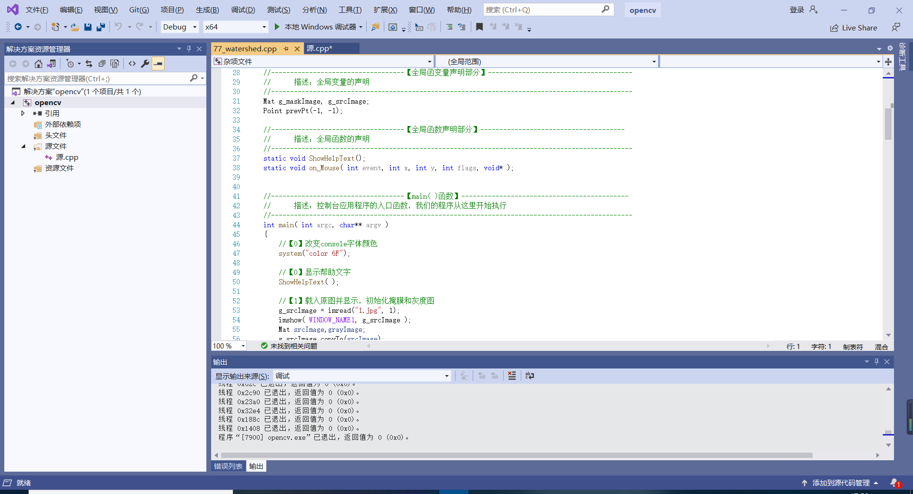

## 8.6图像修补
### 8.6.1实现图像修补:inpaint()函数
在新版OpenCV 中，图像修补技术由inpaint函数实现，它可以用来从扫描的照片中清除灰尘和划痕，或者从静态图像或视频中去除不需要的物体。其原型声明如下。
~~~
C++: void inpaint (InputArray src,InputArray inpaintMask,Ou
tputArraydst,double inpaintRadius,int flags)
~~~
第一个参数，InputArray类型的src，输入图像，即源图像，填 Mat
类的对
象即可，且需为8位单通道或者三通道图像。
第二个参数，InputArray类型的 inpaintMask，修复掩膜，为8位的单通道图像。其中的非零像素表示需要修补的区域。
第三个参数，OutputArray类型的 dst，函数调用后的运算结果存在这里，和源图片有一样的尺寸和类型。
第四个参数，double类型的inpaintRadius，需要修补的每个点的圆形邻域，为修复算法的参考半径。
第五个参数，int类型的flags，修补方法的标识符，可以是表8.4所示两者之一。

### 8.6.2综合示例程序:图像修补
函数和概念讲解完毕，下面我们依然是学习一个以本节所讲内容为核心的示例程序，将本节所学内容付诸实践，融会贯通。此示例程序会先让我们在图像中用鼠标绘制出白色的线条破坏图像，然后按下键盘按键【1】或【SPACE】进行图像修补操作。且如果对自己的绘制不够满意，可以按下键盘按键【2】恢复原始图像。操作说明如图所示。

## 8.7本章小结
本章中，我们先学习了查找轮并绘制轮廪，然后学习了如何寻找到物体的凸包，接着是使用多边形来包围轮廓，以及计算一个图像的矩。在本章后面几节，还学习了分水岭算法和图像修补操作的实现方法。

# 第9章 直方图与匹配
## 9.1 图像直方图概述
直方图广泛运用于很多计算机视觉运用当中，通过标记帧与帧之间显著的边缘和颜色的统计变化，来检测视频中场景的变化。在每个兴趣点设置一个有相近特征的直方图所构成“标签”，用以确定图像中的兴趣点。边缘、色彩、角度等直方图构成了可以被传递给目标识别分类器的一个通用特征类型。色彩和边缘的直方图序列还可以用来识别网络视频是否被复制。

其实，简单点说，直方图就是对数据进行统计的一种方法，并且将统计值组织到一系列事先定义好的bin当中。其中，bin为直方图中经常用到的一个概念，可翻译为“直条”或“组距”，其数值是从数据中计算出的特征统计量，这些数据可以是诸如梯度、方向、色彩或任何其他特征。且无论如何，直方图获得的是数据分布的统计图。通常直方图的维数要低于原始数据。总而言之，直方图是计算机视觉中最经典的工具之一。

在统计学中，直方图（Histogram）是一种对数据分布情况的图形表示，是一种二维统计图表,它的两个坐标分别是统计样本和该样本对应的某个属性的度量。

我们在图像变换的那一章中讲过直方图的均衡化，它是通过拉伸像素强度分布范围来增强图像对比度的一种方法。大家在自己的心目中应该已经对直方图有一定的理解和认知。下面就来看一看对图像直方图比较书面化的解释。

图像直方图( Image Histogram）是用以表示数字图像中亮度分布的直方图，标绘了图像中每个亮度值的像素数。可以借助观察该直方图了解需要如何调整亮度分布。这种直方图中，横坐标的左侧为纯黑、较暗的区域，而右侧为较亮、纯白的区域。因此，一张较暗图片的图像直方图中的数据多集中于左侧和中间部分，而整体明亮、只有少量阴影的图像则相反。计算机视觉领域常借助图像直方图来实现图像的二值化。
直方图的意义如下。

·直方图是图像中像素强度分布的图形表达方式。
·它统计了每一个强度值所具有的像素个数。

## 9.2直方图的计算与绘制
直方图的计算在OpenCV中可以使用calcHist()函数，而计算完成之后，可以采用OpenCV中的绘图函数，如绘制矩形的rectangle()函数，绘制线段的line()来完成。

### 9.2.1计算直方图: calcHist()函数
在OpenCV 中，calcHist()函数用于计算一个或者多个阵列的直方图。
原型如
下。
~~~
C++: void calcHist(const Mat* images, int nimages, const int* channels,InputArray mask,outputArray hist,int dims, const int* histSize, constfloat** ranges,bool uniform=true,bool accumulate=false )
~~~
·第一个参数，const Mat*类型的 images，输入的数组(或数组集)，它们需为相同的深度（CV_8U或CV_32F）和相同的尺寸。
·第二个参数，int类型的nimages，输入数组的个数，也就是第一个参数中存放了多少张“图像”，有几个原数组。
·第三个参数，const int*类型的channels，需要统计的通道(dim）索引。第一个数组通道从0到images[0].channels()-1，而第二个数组通道从images[0].channels()计算到images[O].channels()+images[1].channels()-1。
·第四个参数，InputArray类型的mask，可选的操作掩码。如果此掩码不为空，那么它必须为8位，并且与images[i]有同样大小的尺寸。这里的非零掩码元素用于标记出统计直方图的数组元素数据。
·第五个参数，OutputArray类型的 hist，输出的目标直方图，一个二维数组。
·第六个参数，int类型的dims，需要计算的直方图的维度，必须是正数，且不大于CV_MAX_DIMS（在当前版本的OpenCV中等于32)。
·第七个参数，const int*类型的 histSize，存放每个维度的直方图尺寸的数组。
·第八个参数，const float**类型的 ranges，表示每一个维度数组（第六个参数dims）的每一维的边界阵列，可以理解为每一维数值的取值范围。
·第九个参数，bool类型的uniform，指示直方图是否均匀的标识符，有默认值true。
·第十个参数，bool类型的accumulate，累计标识符，有默认值false。若其为true，直方图在配置阶段不会被清零。此功能主要是允许从多个阵列中计算单个直方图，或者用于在特定的时间更新直方图。

### 9.2.2 找寻最值:minMaxLoc()函数
minMaxLoc()函数的作用是在数组中找到全局最小值和最大值。它有两个版本的原型，在此介绍常用的那一个版本。
~~~
C++: void minMaxLoc(InputArray src，double* minval，double* maxVal=0,Point* minLoc=0，Point* maxLoc=0，InputArray mask=noArray())
~~~
·第一个参数，InputArray类型的src，输入的单通道阵列。
·第二个参数，double*类型的 minVal，返回最小值的指针。若无须返回，此值置为NULL。
·第三个参数，double*类型的maxVal，返回的最大值的指针。若无须返回，此值置为NULL。
·第四个参数，Point*类型的 minLoc，返回最小位置的指针（二维情况下)。若无须返回，此值置为NULL。
·第五个参数，Point*类型的 maxLoc，返回最大位置的指针（二维情况下)。若无须返回，此值置为NULL。
·第六个参数，InputArray类型的mask，用于选择子阵列的可选掩膜。

### 9.2.3 示例程序:绘制H—S直方图

### 9.2.4 示例程序:计算并绘制图像一维直方图

### 9.2.5示例程序:绘制RGB三色直方图

## 9.3 直方图对比
对于直方图来说，一个不可或缺的工具便是用某些具体的标准来比较两个直方图的相似度。要对两个直方图（比如说H和H）进行比较，首先必须选择一个衡量直方图相似度的对比标准（ d(H,H2))。在 OpenCV 2.X中，我们用compareHist()函数来对比两个直方图的相似度，而此函数的返回值就是d(H,Hz)。
### 9.3.1 对比直方图:compareHist()函数
compareHist()函数用于对两幅直方图进行比较。有两个版本的C++原型，如下。
~~~
C++: double compareHist (InputArray Hl,InputArray H2，int method)
C++: double compareHist (const SparseMat& H1l,const SparseMat& H2，int method)
~~~

### 9.3.2示例程序:直方图对比
其中的方法0至3,分别表示之前讲过的 Correlation.Chi-square、Intersection、Bhattacharyya对比标准。其中，对于Correlation(方法0)和 Intersection(方法2)标准，值越大表示相似度越高。可以发现,【基准图—基准图】的匹配数值结果相对于其他几种匹配方式是最大的，符合实际情况。【基准图—半身图】的匹配结果次大，正如我们预料。而【基准—测试图1】和【基准图—测试图2】的匹配结果却不尽人意，同样和之前的预料吻合。

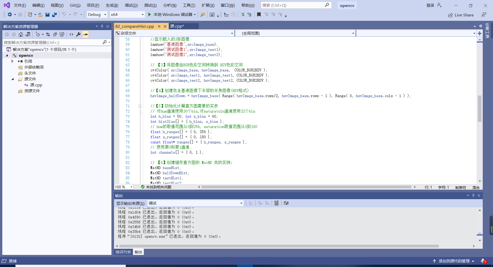
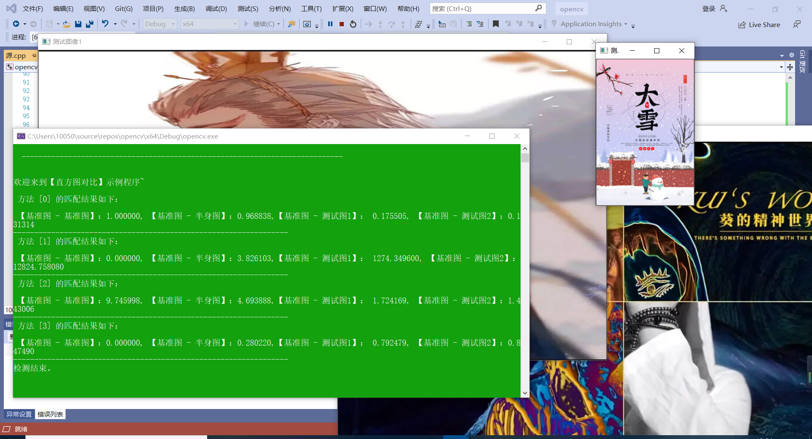

## 9.4 反向投影
### 9.4.1 引言
如果一幅图像的区域中显示的是一种结构纹理或者一个独特的物体，那么这个区域的直方图可以看作一个概率函数，其表现形式是某个像素属于该纹理或物体的概率。
而反向投影(back projection）就是一种记录给定图像中的像素点如何适应直方图模型像素分布方式的一种方法。
简单的讲，所谓反向投影就是首先计算某一特征的直方图模型，然后使用模型去寻找图像中存在的该特征的方法。

### 9.4.2反向投影的工作原理
(1）对测试图像中的每个像素（p(i.j))，获取色调数据并找到该色调（hiysij)在直方图中的bin的位置。
(2）查询模型直方图中对应bin 的数值。
(3）将此数值储存在新的反射投影图像中。也可以先归一化直方图数值到0-255范围，这样可以直接显示反射投影图像（单通道图像)。
(4）通过对测试图像中的每个像素采用以上步骤，可以得到最终的反射投影图像。
(5）使用统计学的语言进行分析。反向投影中储存的数值代表了测试图像中该像素属于皮肤区域的概率。亮起的区域是皮肤区域的概率更大，而更暗的区域则表示是皮肤的概率更低。另外，可以注意到，手掌内部和边缘的阴影影响了检测的精度。

### 9.4.3 反向投影的作用
反向投影用于在输入图像（通常较大）中查找与特定图像（通常较小或者仅1个像素，以下将其称为模板图像）最匹配的点或者区域，也就是定位模板图像出现在输入图像的位置。
### 9.4.4 反向投影的结果
反向投影的结果包含了以每个输入图像像素点为起点的直方图对比结果。可以把它看成是一个二维的浮点型数组、二维矩阵，或者单通道的浮点型图像。

### 9.4.5计算反向投影: calcBackProject()函数
calcBackProject()函数用于计算直方图的反向投影。
~~~
C++ : void calcBackProject (const Mat* images,int nimages,
const int* channels,InputArray hist,outputArray backProject,const float* * ranges,double scale=1,bool uniform=true )
~~~
·第一个参数，const Mat*类型的 images，输入的数组(或数组集)，它们须为相同的深度（CV_8U或CV_32F）和相同的尺寸，而通道数则可以任意。
·第二个参数，int类型的nimages，输入数组的个数，也就是第一个参数中存放了多少张“图像”，有几个原数组。
·第三个参数，const int*类型的channels，需要统计的通道(dim)索引。第一个数组通道从0到images[0].channels()-1，而第二个数组通道从images[0].channels()计算到images[0].channels() + images[1].channels()-1。第四个参数，InputArray类型的hist，输入的直方图。
第五个参数，OutputArray类型的backProject，目标反向投影阵列，其须为单通道，并且和 image[0]有相同的大小和深度。
·第六个参数，const float**类型的ranges，表示每一个维度数组（第六个参数dims）的每一维的边界阵列，可以理解为每一维数值的取值范围。
·第七个参数，double scale，有默认值1，输出的方向投影可选的缩放因子，默认值为1。
·第八个参数，bool类型的uniform，指示直方图是否均匀的标识符，有默认值true。

### 9.4.6通道复制:mixChannels()函数
此函数由输入参数复制某通道到输出参数特定的通道中。有两个版本的C++原型，采用函数注释方式分别介绍如下。
~~~
C++: void mixChannels (
const Mat* src，//输入的数组，所有的矩阵必须有相同的尺寸和深度size_t nsrcs,//第一个参数src输入的矩阵数
Mat* dst,//输出的数组，所有矩阵必须被初始化，且大小和深度必须与src[0]相同size_t ndsts,//第三个参数dst输入的矩阵数
const int* fromTo,//对指定的通道进行复制的数组索引size_t npairs)//第五个参数fromTo的索引数
C++: void mixChannels(
const vector<Mat>& src,//输入的矩阵向量，所有的矩阵必须有相同的尺寸和深度
vector<Mat>& dst，/ /输出的矩阵向量,所有矩阵须被初始化，且大小和深度须与src[01相同
const int* fromTo,//对指定的通道进行复制的数组索引size_t npairs)//第三个参数fromTo的索引数
~~~
此函数为重排图像通道提供了比较先进的机制。其实，之前我们接触到的split()和 merge()，以及cvtColor()的某些形式，都只是mixChannels()的一部分。
下面给出一个示例，将一个4通道的RGBA图像转化为3通道BGR(R通道和B通道交换）和一个单独的Alpha通道的图像。
~~~
Mat rgba( 100,100,cv_8UC4,scalar(1,2,3，4) );
Mat bgr( rgba.rows, rgba.cols,cV_8UC3 ) ;
Mat alpha( rgba .rows, rgba.cols,cv_8uc1 );
//组成矩阵数组来进行操作
Mat out [ ] = { bgr, alpha };
//说明:将rgba [0] -> bgr [2], rgba [ 1] -> bgr [1],
//说明:将rgba[2] -> bgr [0], rgba [ 3] -> alpha [0]
int from_to [ ] = { 0,2，1,1，2,0，3,3 };
mixChannels ( &rgba，1, out,2,from_to,4 );
~~~
### 9.4.7综合程序:反向投影

### 9.5模板匹配
### 9.5.1模板匹配的概念与原理
模板匹配是一项在一幅图像中寻找与另一幅模板图像最匹配（相似）部分的技术。在OpenCV2和 OpenCV3中，模板匹配由MatchTemplate()函数完成。需要注意，模板匹配不是基于直方图的，而是通过在输入图像上滑动图像块，对实际的图像块和输入图像进行匹配的一种匹配方法。

### 9.5.2实现模板匹配: matchTemplate()函数
matchTemplate()用于匹配出和模板重叠的图像区域。
~~~
C++ : void matchTemplate (InputArray image，InputArray templ,outputArrayresult, int method)
~~~
·第一个参数，InputArray类型的 image，待搜索的图像，且需为8位或32位浮点型图像。
·第二个参数，InputArray类型的templ，搜索模板，需和源图片有一样的数据类型，且尺寸不能大于源图像。
·第三个参数，OutputArray类型的 result，比较结果的映射图像。其必须为单通道、32位浮点型图像.如果图像尺寸是 WxH 而templ 尺寸是w*h ,则此参数result一定是(W-w+1)×(H-h+1).
第四个参数，int类型的 method，指定的匹配方法，OpenCV为我们提供了如下6种图像匹配方法可供使用。

### 9.5.3综合示例:模板匹配

## 9.6 本章小结
本章我们学习了广泛运用于很多计算机视觉运用当中的直方图,而简单点说，直方图就是对数据进行统计的一种方法。然后还讲到了反向投影和模板匹配。所谓反向投影就是首先计算某一特征的直方图模型，最后使用模型去寻找图像中存在的该特征的方法。而模板匹配是一项在一幅图像中寻找与另一幅模板图像最匹配（相似）部分的技术。

